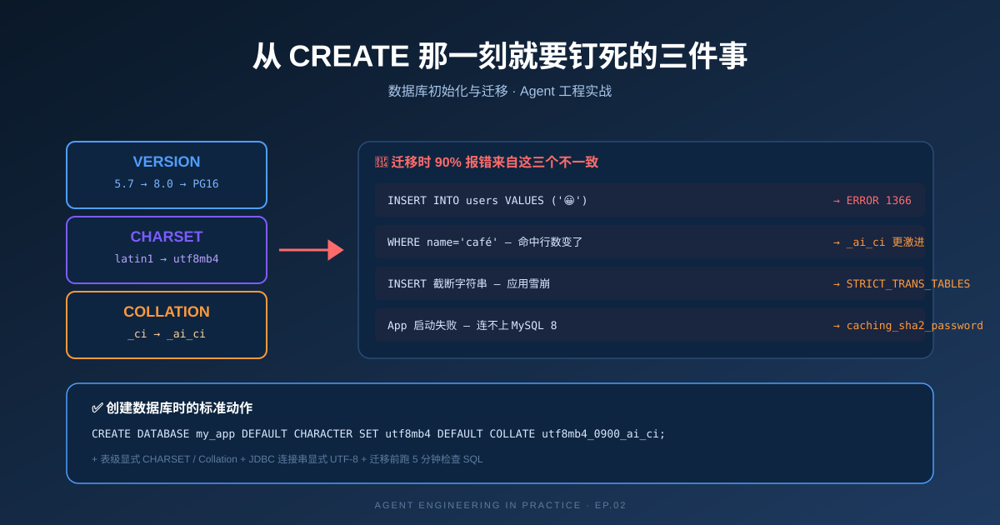

> **一句话：版本 + 字符集 + 排序规则，三件事必须在 `CREATE` 那一刻写死。** 之后任何跨环境、迁移、同步都建立在这三件事一致的基础上。



## 一、三件事在四个数据库里的标准值

| 数据库 | 版本 | 字符集 | 排序规则 | 改的代价 |
|---|---|---|---|---|
| MySQL 5.7 | `5.7.x` LTS | `utf8mb4` | `utf8mb4_general_ci` | 单 ALTER |
| MySQL 8.0 | `8.0.x` / `8.4.x` | `utf8mb4` | `utf8mb4_0900_ai_ci` | 单 ALTER |
| PostgreSQL | `15.x` / `16.x` | `UTF8` (client) | ICU 默认 | **库级改不了** |
| SQL Server | `2019` / `2022` | 见 collation | `SQL_Latin1_General_CP1_CI_AS` | 可改，需重建索引 |

> 永远显式写。**不能依赖"实例默认值"**——开发/测试/预发/线上四个环境经常不一样。

---

## 二、emoji 演示：`utf8` ≠ `utf8mb4`

```
INSERT INTO users (name) VALUES ('😀');  -- 字符: 4 字节
```

| 字符集 | 字节数上限 | 结果 |
|---|---|---|
| `latin1` | 1 字节 | ❌ 中文都存不了 |
| `utf8` | **3 字节** ⚠️ | ❌ emoji 报错 `ERROR 1366` |
| `utf8mb4` | 4 字节 | ✅ |

> MySQL 的 `utf8` 是历史包袱，**只支持 3 字节**。JDBC / ORM 里写 `utf8` 的，emoji 入库一律失败。**永远写 `utf8mb4`**。

---

## 三、四套初始化模板（直接复制）

### MySQL 5.7

```sql
CREATE DATABASE my_app
    DEFAULT CHARACTER SET utf8mb4
    DEFAULT COLLATE utf8mb4_general_ci;

CREATE TABLE users (
    id    BIGINT UNSIGNED NOT NULL AUTO_INCREMENT,
    name  VARCHAR(64)     NOT NULL,
    email VARCHAR(128)    NOT NULL,
    created_at DATETIME(3) NOT NULL DEFAULT CURRENT_TIMESTAMP(3),
    PRIMARY KEY (id),
    UNIQUE KEY uk_email (email)
) ENGINE=InnoDB
  DEFAULT CHARSET=utf8mb4
  COLLATE=utf8mb4_general_ci;
```

### MySQL 8.0

```sql
CREATE DATABASE my_app
    DEFAULT CHARACTER SET utf8mb4
    DEFAULT COLLATE utf8mb4_0900_ai_ci;

CREATE TABLE users (
    id    BIGINT UNSIGNED NOT NULL AUTO_INCREMENT,
    name  VARCHAR(64)     NOT NULL,
    email VARCHAR(128)    NOT NULL,
    payload JSON DEFAULT NULL,
    created_at DATETIME(3) NOT NULL DEFAULT CURRENT_TIMESTAMP(3),
    PRIMARY KEY (id),
    UNIQUE KEY uk_email (email),
    -- 8.0 才支持的表达式索引
    KEY idx_payload_user_id ((CAST(payload->>'$.userId' AS CHAR(64))))
) ENGINE=InnoDB
  DEFAULT CHARSET=utf8mb4
  COLLATE=utf8mb4_0900_ai_ci;
```

### PostgreSQL

```sql
-- 库级字符集在 CREATE DATABASE 时定型,后续改不动!
CREATE DATABASE my_app
    WITH ENCODING 'UTF8'
         LC_COLLATE = 'en_US.UTF8'
         LC_CTYPE   = 'en_US.UTF8'
         TEMPLATE   = template0;

CREATE TABLE users (
    id    BIGSERIAL PRIMARY KEY,
    name  TEXT       NOT NULL,
    email TEXT       NOT NULL,
    payload JSONB    DEFAULT NULL,
    created_at TIMESTAMPTZ NOT NULL DEFAULT NOW(),
    UNIQUE (email)
);

CREATE INDEX idx_payload_user_id
    ON users ((payload->>'userId'));
```

> PG 的字符集分两层：库级 `ENCODING` + 连接级 `client_encoding`。JDBC 必须显式：
> ```text
> jdbc:postgresql://host:5432/my_app?charSet=UTF8
> ```

### SQL Server

```sql
-- 实例默认 collation 不一定是这个,必须显式写
CREATE DATABASE my_app
    COLLATE SQL_Latin1_General_CP1_CI_AS;
GO

CREATE TABLE users (
    id    BIGINT IDENTITY(1,1) PRIMARY KEY,
    name  VARCHAR(64)
        COLLATE SQL_Latin1_General_CP1_CI_AS NOT NULL,
    email VARCHAR(128)
        COLLATE SQL_Latin1_General_CP1_CI_AS NOT NULL,
    payload NVARCHAR(MAX) DEFAULT NULL,
    created_at DATETIME2(3) NOT NULL DEFAULT SYSUTCDATETIME(),
    UNIQUE (email)
);
GO
```

---

## 四、迁移报错 4 种「症状 → 原因 → 修复」

### 🔴 症状 1：emoji / 中文入库乱码或报错

```sql
-- 报错信息
ERROR 1366 (HY000): Incorrect string value: '\xF0\x9F\x98\x80' for column 'name'
```

| 项 | 内容 |
|---|---|
| **原因** | 表字符集不是 `utf8mb4` |
| **修复** | `ALTER TABLE users CONVERT TO CHARACTER SET utf8mb4 COLLATE utf8mb4_0900_ai_ci;` |
| **预防** | JDBC 连接串 `characterEncoding=utf8`、表级显式 `CHARSET=utf8mb4` |

### 🔴 症状 2：`ORDER BY name` 顺序变了 / `WHERE col='...'` 命中行数变化

| 项 | 内容 |
|---|---|
| **原因** | 排序规则从 `general_ci` → `0900_ai_ci`，UCA 9.0 比较更激进 |
| **修复** | `ORDER BY name COLLATE utf8mb4_bin` 锁定；或应用层排序 |
| **预防** | **业务层不依赖 DB 排序结果做正确性判断** |

### 🔴 症状 3：`INSERT` 截断字符串 → 整个应用雪崩

| 项 | 内容 |
|---|---|
| **原因** | 8.0 默认 `STRICT_TRANS_TABLES`，截断从 warning 变 error |
| **修复** | 灰度期间 `SET GLOBAL sql_mode = 'STRICT_TRANS_TABLES,NO_ENGINE_SUBSTITUTION,...';` |
| **预防** | 上线前用真实流量回放，发现 silent-truncate 全部修掉 |

### 🔴 症状 4：本地能连，CI/线上连不上

| 项 | 内容 |
|---|---|
| **原因** | 5.7 `mysql_native_password` → 8.0 `caching_sha2_password` |
| **修复** | 升级 JDBC/ORM 驱动；禁掉 `mysql_native_password` |
| **临时方案** | `ALTER USER 'app'@'%' IDENTIFIED WITH mysql_native_password BY 'xxx';` |

---

## 五、其他数据库的独有坑（速查）

| 数据库 | 坑 | 一句话修复 |
|---|---|---|
| **PG** | 字符串默认大小写敏感 | `LOWER(name) = LOWER(?)` 或用 `citext` |
| **PG** | 10+ 隐式类型转换收紧 | 所有比较显式 `CAST` |
| **PG** | `BIGSERIAL ≠ AUTO_INCREMENT` | 跨库迁移重置序列或改 UUID |
| **SQL Server** | collation 在 3 个层级设置 | 列级 `COLLATE ...` 钉死 |
| **SQL Server** | `DATETIME` vs `DATETIME2` | 迁移时零日期映射为 `NULL` |
| **SQL Server** | `OFFSET` 在大表慢 | 永远用 keyset 分页（`WHERE id > last_id`） |

---

## 六、迁移前 5 分钟 checklist（直接跑）

### MySQL

```sql
-- 1. 实例信息
SELECT @@version, @@character_set_server, @@collation_server, @@sql_mode;

-- 2. 找出非 utf8mb4 的表
SELECT table_schema, table_name, table_collation, CCSA.character_set_name
FROM information_schema.tables T
JOIN information_schema.collation_character_set_applicability CCSA
  ON CCSA.collation_name = T.table_collation
WHERE table_schema NOT IN ('mysql','sys','information_schema','performance_schema')
  AND CCSA.character_set_name != 'utf8mb4';

-- 3. 找出表达式索引 (8.0+ 特性)
SELECT * FROM information_schema.statistics
WHERE expression IS NOT NULL
  AND table_schema NOT IN ('mysql','sys','information_schema','performance_schema');

-- 4. 找出 mysql_native_password 账号
SELECT user, host, plugin FROM mysql.user WHERE plugin = 'mysql_native_password';
```

### PostgreSQL

```sql
SELECT version();
SELECT datname, datcollate, datctype
FROM pg_database WHERE datistemplate = false;
SELECT * FROM users WHERE length(name) = 0 OR name IS NULL;
```

### SQL Server

```sql
SELECT SERVERPROPERTY('Collation') AS server_collation;
SELECT name, collation_name FROM sys.databases;
SELECT * FROM dbo.users WHERE created_at < '1900-01-01';
```

---

## 七、迁移流程（七步走）

```
1. 备份 (mysqldump --single-transaction --hex-blob)
        ↓
2. 准备目标实例 (兼容 sql_mode)
        ↓
3. 导入备份 (不要用 source,用 mysql ... < backup.sql)
        ↓
4. 跑上面的 checklist SQL
        ↓
5. CONVERT 字符集 + 验证表达式索引兼容
        ↓
6. 灰度切流量 5% → 20% → 100%
        ↓
7. 完全切完后再升级 ORM / 驱动
```

> **回滚三件套**：
> 1. 保留 7 天以上源端快照
> 2. 迁移脚本**幂等**（跑两遍不报错也不丢数据）
> 3. DNS / 负载均衡能**秒级切回**

---

## 八、Agent 系统特别提醒

| # | 提醒 | 一句话 |
|---|---|---|
| 1 | **向量存储** | 别用原生 PG/MySQL 向量扩展做主索引,规模上来性能不行 |
| 2 | **对话历史** | 高频追加→单独 `messages` 表+定期归档 |
| 3 | **状态机持久化** (LangGraph checkpoint) | 高频 UPDATE 同一行 → `SKIP LOCKED` + 多分片 |
| 4 | **审计 / Trace 表** | 可能比业务表大 10 倍 → 单独 schema + TTL + 列存 |

---

## 速查表

```
┌────────────────────────────────────────────┐
│  创建数据库那一刻要钉死的三件事:            │
│                                              │
│  VERSION    →   5.7 / 8.0 / PG15 / 2019     │
│  CHARSET    →   utf8mb4 (永远,别用 utf8)   │
│  COLLATION  →   utf8mb4_0900_ai_ci (8.0)   │
│                                              │
│  任何"看起来能跑"的 SQL 上生产前必查:       │
│                                              │
│  EXPLAIN  +  CHARSET  +  COLLATION  +  TIMEOUT │
└────────────────────────────────────────────┘
```

---

下一篇：**Tool Calling 工程化**——从 schema 设计到 Human-in-the-loop 的具体落地。

## 参考

- [MySQL 8.0 Charset & Collation](https://dev.mysql.com/doc/refman/8.0/en/charset.html)
- [PostgreSQL: Character Set Support](https://www.postgresql.org/docs/current/multibyte.html)
- [PostgreSQL: CREATE DATABASE](https://www.postgresql.org/docs/current/sql-createdatabase.html)
- [SQL Server: Collation and Unicode Support](https://learn.microsoft.com/en-us/sql/relational-databases/collations/collation-and-unicode-support)
- [pgloader: MySQL → PostgreSQL](https://pgloader.io/)