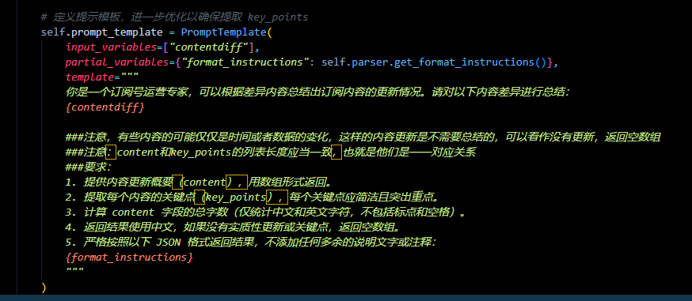
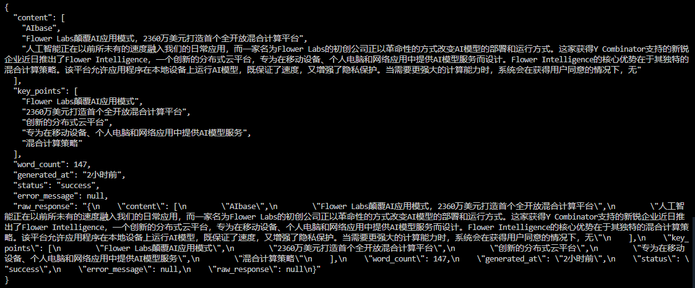
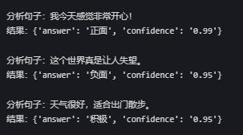

<!--  -->


## 开发心得

<span style="color:red;">所选用的ai模型的性能起决定性的作用，如果用的模型不能按照你想要的格式返回数据，那么重试一万次也不能得到一个好的效果，带来的只能是Token的浪费...</span>
---



我在开发这样一个agent 的时候，我传入了一些信息，我希望它能够按照我想要的格式返回数据，但是重试很多次他都不能返回，比如下面的结果


我使用的是7B的模型，但是回答很差，当然也有很多次它是回答的格式不对，我设置的重试3次，但是基本上都不会得到想要的结果



我换了qwq-32b模型，效果好了很多


一些模型的对比可以看：
|参考|
|---|
|[对比了几种大模型在相同任务下的表现](../对比了几种大模型在相同任务下的表现)|


---
---
---


## 实战代码

### 示例代码一：输出解析器 和 多次尝试

```python

import os
from langchain.chat_models import ChatOpenAI
from langchain.prompts import PromptTemplate
from langchain.output_parsers import StructuredOutputParser, ResponseSchema
from pydantic import ValidationError
from dotenv import  load_dotenv
load_dotenv()
import os


#  密钥（替换为你的密钥，或通过环境变量获取） 这里我用的阿里云的

api_key = os.getenv("api_key")
base_url = os.getenv("base_url")
model = "qwq-32b"

# 定义期望的输出结构
response_schemas = [
    ResponseSchema(name="answer", description="回答内容，字符串类型"),
    ResponseSchema(name="confidence", description="置信度，0-1之间的浮点数")
]

# 创建输出解析器
output_parser = StructuredOutputParser.from_response_schemas(response_schemas)

# 定义提示模板
prompt_template = """
请分析以下句子的情感，并以指定的 JSON 格式返回结果：
{format_instructions}

句子：{sentence}
"""

prompt = PromptTemplate(
    template=prompt_template,
    input_variables=["sentence"],
    partial_variables={"format_instructions": output_parser.get_format_instructions()}
)

# 初始化语言模型
llm = ChatOpenAI(temperature=0.2, max_tokens=200,api_key = api_key , base_url = base_url,model = model,streaming = True)

# 定义解析和重试逻辑
def get_stable_output(sentence, max_attempts=3):
    chain = prompt | llm | output_parser
    
    for attempt in range(max_attempts):
        try:
            # 调用模型并解析输出
            result = chain.invoke({"sentence": sentence})
            return result
        except Exception as e:
            print(f"尝试 {attempt + 1}/{max_attempts} 失败: {e}")
            if attempt == max_attempts - 1:
                # 最后一次尝试失败，返回默认值
                return {"answer": "无法分析", "confidence": 0.5}
    
    return {"answer": "未完成分析", "confidence": 0.0}  # 理论上不会到达这里

# 测试代码
def main():
    test_sentences = [
        "我今天感觉非常开心！",
        "这个世界真是让人失望。",
        "天气很好，适合出门散步。"
    ]

    for sentence in test_sentences:
        print(f"\n分析句子：{sentence}")
        result = get_stable_output(sentence)
        print(f"结果：{result}")

if __name__ == "__main__":
    main()


```




### 代码说明
1. **输出结构定义**：
   - 使用 `ResponseSchema` 定义了期望的 JSON 结构：`answer`（字符串）和 `confidence`（浮点数）。

2. **提示模板**：
   - 通过 `PromptTemplate` 构造提示，确保模型知道返回 JSON 格式。
   - `output_parser.get_format_instructions()` 自动生成格式说明，例如：
     ```
     The output should be a markdown code block formatted as JSON:
     ```json
     {
       "answer": "string",
       "confidence": "float"
     }
     ```
     ```

3. **语言模型**：
   - 使用 `ChatOpenAI`，设置 `temperature=0.2` 减少随机性，`max_tokens=200` 限制输出长度。

4. **解析与重试**：
   - `get_stable_output` 函数使用 LangChain 的链式调用（`prompt | llm | output_parser`）。
   - 如果解析失败，会重试最多 3 次，最后返回默认值。


## 具体分析 - 如何减少解析错误

在使用 LangChain 开发 AI 应用时，AI 返回数据的格式不稳定并导致解析错误是一个常见问题。这通常与大语言模型（LLM）的输出不确定性有关，尤其是当模型生成的内容未严格遵循预期结构时。以下是一些解决方案和思路，帮助你应对这一问题：


### 1. **明确提示（Prompt）设计**
   - **问题原因**：LLM 的输出很大程度上依赖于输入提示的清晰度。如果提示不够具体，模型可能会生成不一致或不符合预期的格式。
   - **解决方法**：
     - 在提示中明确要求返回特定格式，例如 JSON 或其他结构化数据。例如：
       ```
       请以 JSON 格式返回以下内容：{"key": "value"}
       ```
     - 使用示例（Few-shot Learning）来引导模型输出一致的格式。例如：
       ```
       输入：分析这句话的情感
       输出：{"sentence": "这句话", "sentiment": "积极"}
       ```
     - 添加约束性描述，如“确保输出是可解析的 JSON，且不包含多余文本”。


### 2. **使用输出解析器（Output Parsers）**
   - **问题原因**：即使提示明确，LLM 有时仍会生成不符合预期的输出，导致解析失败。
   - **解决方法**：
     - LangChain 提供了内置的输出解析器（如 `StructuredOutputParser` 或 `JsonOutputParser`），可以用来规范化模型输出。
     - 示例代码：
       ```python
       from langchain.output_parsers import StructuredOutputParser, ResponseSchema

       response_schemas = [
           ResponseSchema(name="answer", description="回答内容"),
           ResponseSchema(name="confidence", description="置信度，0-1之间的浮点数")
       ]
       parser = StructuredOutputParser.from_response_schemas(response_schemas)
       prompt = f"请按照以下格式返回数据：\n{parser.get_format_instructions()}"
       ```
     - 在提示中嵌入 `parser.get_format_instructions()`，让模型知道预期格式。
     - 如果解析失败，可以捕获异常并重试。

### 3. **处理解析错误（Handle Parsing Errors）**
   - **问题原因**：LLM 输出可能偶尔无法解析，例如缺少关键字段或格式错误。
   - **解决方法**：
     - 在代理（Agent）或链（Chain）中启用错误处理机制。LangChain 支持通过 `handle_parsing_errors` 参数自定义错误处理逻辑。
     - 示例代码：
       ```python
       from langchain.agents import initialize_agent, AgentType
       from langchain.chat_models import ChatOpenAI

       agent = initialize_agent(
           tools=[...], 
           llm=ChatOpenAI(temperature=0),
           agent=AgentType.ZERO_SHOT_REACT_DESCRIPTION,
           handle_parsing_errors=True  # 自动忽略解析错误并重试
       )
       ```
     - 你也可以定义自定义回调函数来处理错误：
       ```python
       def custom_error_handler(error):
           print(f"解析错误: {error}")
           return "发生错误，请重试或检查输入"

       agent = initialize_agent(..., handle_parsing_errors=custom_error_handler)
       ```

### 4. **后处理与验证**
   - **问题原因**：即使使用了解析器，输出仍可能不符合预期。
   - **解决方法**：
     - 在接收到模型输出后，使用 Python 的 `try-except` 块或数据验证库（如 `pydantic`）检查和修复数据。
     - 示例代码：
       ```python
       from pydantic import BaseModel, ValidationError

       class Response(BaseModel):
           answer: str
           confidence: float

       def parse_response(raw_output):
           try:
               return Response.parse_raw(raw_output)
           except ValidationError as e:
               print(f"验证失败: {e}")
               return Response(answer="默认回答", confidence=0.5)  # 回退值

       raw_output = '{"answer": "是的", "confidence": "0.9"}'
       result = parse_response(raw_output)
       ```

### 5. **调整模型参数**
   - **问题原因**：模型的随机性（temperature）或输出长度（max_tokens）可能导致格式不稳定。
   - **解决方法**：
     - 降低 `temperature`（如设为 0 或 0.2），减少输出的随机性。
     - 设置合理的 `max_tokens`，避免输出被截断。
     - 示例：
       ```python
       llm = ChatOpenAI(temperature=0.2, max_tokens=500)
       ```

### 6. **重试机制**
   - **问题原因**：单次调用可能失败，但多次尝试可能成功。
   - **解决方法**：
     - 实现一个简单的重试逻辑，确保在解析失败时重新请求。
     - 示例代码：
       ```python
       def get_stable_output(prompt, max_attempts=3):
           for _ in range(max_attempts):
               try:
                   response = llm(prompt)
                   return parser.parse(response)
               except Exception:
                   continue
           return "无法获取稳定输出"
       ```

### 总结
通过优化提示、使用 LangChain 的输出解析器、启用错误处理机制、后处理验证数据以及调整模型参数，可以有效解决 AI 返回数据格式不稳定和解析错误的问题。根据具体应用场景，你可能需要结合多种方法。例如，对于需要高可靠性的生产环境，建议同时使用解析器和重试机制；对于快速原型开发，则可以通过清晰的提示和简单后处理解决问题。
