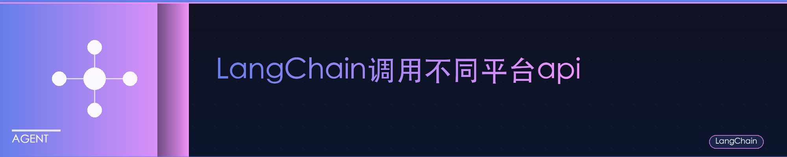

### 总结命令


#### chatmodel

``` py
# 1. OpenAI
# 说明：这是最常用的 LLM 提供商之一。你需要一个 OpenAI API 密钥。
# temperature 参数控制输出的随机性，值越高，输出越随机，越低则越确定。
from langchain_openai import ChatOpenAI

# 初始化 OpenAI LLM
# 你需要设置 OPENAI_API_KEY 环境变量，或者通过 openai_api_key 参数传递
llm_openai = ChatOpenAI(model="gpt-3.5-turbo", temperature=0.7)
# 或者直接传入key:
# llm_openai = ChatOpenAI(model="gpt-3.5-turbo", temperature=0.7, openai_api_key="YOUR_OPENAI_API_KEY")

# 使用示例 (假设你已经有了一个提示)
# from langchain_core.prompts import ChatPromptTemplate
# prompt = ChatPromptTemplate.from_messages([("user", "你好，请介绍一下你自己。")])
# chain = prompt | llm_openai
# response = chain.invoke({})
# print(response.content)


# 2. Anthropic (Claude)
# 说明：Anthropic 提供了 Claude 系列模型。你需要一个 Anthropic API 密钥。
from langchain_anthropic import ChatAnthropic

# 初始化 Anthropic LLM
# 你需要设置 ANTHROPIC_API_KEY 环境变量，或者通过 anthropic_api_key 参数传递
llm_anthropic = ChatAnthropic(model="claude-3-sonnet-20240229", temperature=0.7)
# 或者直接传入key:
# llm_anthropic = ChatAnthropic(model="claude-3-sonnet-20240229", temperature=0.7, anthropic_api_key="YOUR_ANTHROPIC_API_KEY")

# 使用示例
# prompt = ChatPromptTemplate.from_messages([("user", "解释一下什么是黑洞。")])
# chain = prompt | llm_anthropic
# response = chain.invoke({})
# print(response.content)


# 3. Google (Vertex AI / Gemini)
# 说明：Google 提供了多种模型，包括 PaLM 和 Gemini，可以通过 Vertex AI 平台访问。
# 你需要设置 Google Cloud 项目，并进行身份验证。
from langchain_google_vertexai import ChatVertexAI

# 初始化 Google Vertex AI LLM (以 Gemini 为例)
llm_google_vertexai = ChatVertexAI(model="gemini-pro", temperature=0.7)
# 对于旧版 PaLM 模型，可能是这样:
# llm_google_palm = ChatVertexAI(model_name="text-bison@001", temperature=0.7)

# 注意：使用 Vertex AI 通常需要你已经通过 gcloud CLI 登录或者在环境中设置了 GOOGLE_APPLICATION_CREDENTIALS。
# 你可能还需要指定项目ID:
# llm_google_vertexai = ChatVertexAI(model="gemini-pro", project="your-gcp-project-id")

# 使用示例
# prompt = ChatPromptTemplate.from_messages([("user", "法国的首都是哪里？")])
# chain = prompt | llm_google_vertexai
# response = chain.invoke({})
# print(response.content)

# 另外，对于 Google 的 Gemini API (非 Vertex AI)，有专门的 langchain_google_genai
from langchain_google_genai import ChatGoogleGenerativeAI

# 初始化 Google Gemini API LLM
# 你需要设置 GOOGLE_API_KEY 环境变量，或者通过 google_api_key 参数传递
llm_google_genai = ChatGoogleGenerativeAI(model="gemini-pro", temperature=0.7)
# 或者直接传入key:
# llm_google_genai = ChatGoogleGenerativeAI(model="gemini-pro", temperature=0.7, google_api_key="YOUR_GOOGLE_API_KEY")

# 使用示例
# prompt = ChatPromptTemplate.from_messages([("user", "写一首关于春天的诗。")])
# chain = prompt | llm_google_genai
# response = chain.invoke({})
# print(response.content)


# 4. Hugging Face
# 说明：Hugging Face 提供了多种方式与模型交互。
#    a) Hugging Face Hub (远程API，需要 Hugging Face API Token)
#    b) 本地 Pipelines (直接在你的机器上运行模型)

# a) Hugging Face Hub (使用推理 API)
from langchain_community.llms import HuggingFaceHub

# 初始化 Hugging Face Hub LLM
# 你需要设置 HUGGINGFACEHUB_API_TOKEN 环境变量
# repo_id 是 Hugging Face 模型库中的模型ID
llm_hf_hub = HuggingFaceHub(
    repo_id="google/flan-t5-large",
    model_kwargs={"temperature": 0.7, "max_length": 128}
)
# 或者直接传入token:
# llm_hf_hub = HuggingFaceHub(
#     repo_id="google/flan-t5-large",
#     model_kwargs={"temperature": 0.7, "max_length": 128},
#     huggingfacehub_api_token="YOUR_HF_TOKEN"
# )

# 使用示例
# from langchain_core.prompts import PromptTemplate
# template = PromptTemplate.from_template("请回答问题：{question}")
# chain = template | llm_hf_hub
# response = chain.invoke({"question": "什么是机器学习？"})
# print(response)


# b) Hugging Face 本地 Pipelines
# 说明：这允许你在本地加载并运行 Hugging Face Transformers 模型。
# 你需要安装 `transformers` 和 `torch` (或 `tensorflow`)。
# from langchain_community.llms.huggingface_pipeline import HuggingFacePipeline

# 初始化本地 Hugging Face Pipeline
# llm_hf_pipeline = HuggingFacePipeline.from_model_id(
#     model_id="gpt2", # 例如使用 gpt2，也可以是其他兼容的模型
#     task="text-generation",
#     pipeline_kwargs={"max_new_tokens": 100},
#     # model_kwargs={"temperature": 0.7} # 某些模型可能不支持所有参数直接传入
# )

# 使用示例 (注意，本地pipeline通常用于LLM而不是ChatLLM，所以PromptTemplate可能更合适)
# template = PromptTemplate.from_template("续写这个故事：{story_start}")
# chain = template | llm_hf_pipeline
# response = chain.invoke({"story_start": "从前有一座山，"})
# print(response)

# 注意：对于聊天模型，使用 HuggingFacePipeline 可能需要更复杂的设置来适配聊天格式。
# 较新版本的 Langchain 可能会有更直接的本地聊天模型支持。


# 5. Cohere
# 说明：Cohere 提供了 Command 等模型。你需要一个 Cohere API 密钥。
from langchain_cohere import ChatCohere

# 初始化 Cohere LLM
# 你需要设置 COHERE_API_KEY 环境变量，或者通过 cohere_api_key 参数传递
llm_cohere = ChatCohere(model="command", temperature=0.75)
# 或者直接传入key:
# llm_cohere = ChatCohere(model="command", temperature=0.75, cohere_api_key="YOUR_COHERE_API_KEY")

# 使用示例
# prompt = ChatPromptTemplate.from_messages([("user", "给我推荐三本关于人工智能的书籍。")])
# chain = prompt | llm_cohere
# response = chain.invoke({})
# print(response.content)


# 6. Ollama (本地运行开源模型)
# 说明：Ollama 允许你在本地轻松运行如 Llama 2, Mistral, Gemma 等开源模型。
# 你需要先安装并运行 Ollama 服务，并下载相应的模型。
from langchain_community.chat_models import ChatOllama

# 初始化 Ollama LLM
# 'model' 参数应与你在 Ollama 中下载的模型名称一致
llm_ollama = ChatOllama(model="llama2", temperature=0.7)
# 如果 Ollama 服务不在默认的 http://localhost:11434，可以指定 base_url
# llm_ollama = ChatOllama(model="llama2", base_url="http://custom_host:port")

# 使用示例
# prompt = ChatPromptTemplate.from_messages([("user", "用Python写一个快速排序算法。")])
# chain = prompt | llm_ollama
# response = chain.invoke({})
# print(response.content)

# ---
# 通用注意事项：
# 1. API 密钥管理：强烈建议通过环境变量 (如 `OPENAI_API_KEY`, `ANTHROPIC_API_KEY`, `GOOGLE_API_KEY`, `COHERE_API_KEY`, `HUGGINGFACEHUB_API_TOKEN`) 来管理你的 API 密钥，而不是直接硬编码在代码中。
# 2. 模型名称：确保你使用的模型名称是提供商支持的，并且你的账户有权限访问。
# 3. 依赖安装：你需要为每个提供商安装相应的 Langchain 集成包，例如 `langchain-openai`, `langchain-anthropic`, `langchain-google-vertexai`, `langchain-google-genai`, `langchain-community` (HuggingFace Hub, Ollama), `langchain-cohere`。
#    通常使用 pip 安装：`pip install langchain-openai langchain-anthropic langchain-google-vertexai langchain-google-genai langchain-community langchain-cohere`
# 4. Chat Models vs LLMs：
#    - `ChatModel` (如 `ChatOpenAI`, `ChatAnthropic`) 是为对话场景设计的，通常输入是消息列表（例如，系统消息，用户消息，AI 消息）。
#    - `LLM` (如 `HuggingFaceHub`) 通常接受单个字符串作为输入。
#    Langchain 正在逐步统一接口，但根据你使用的具体类，输入格式可能有所不同。上面的例子主要展示了 `ChatModel` 的用法。
# 5. 参数：`temperature` 是一个常见的参数，用于控制生成文本的创造性。其他参数如 `max_tokens` (最大生成长度), `top_p`, `top_k` 等也可能可用，具体取决于模型和提供商。
# 6. Langchain 版本：Langchain 发展迅速，API 可能会有变化。建议查阅最新的 Langchain官方文档 以获取最准确的信息。上面使用的导入路径（如 `langchain_openai`）是基于较新版本的 Langchain 的模块化结构。

```


#### Embeddings

```py
# 1. OpenAI Embeddings
# 说明：OpenAI 提供了高效的文本嵌入模型，如 "text-embedding-ada-002" (旧版) 和更新的模型如 "text-embedding-3-small", "text-embedding-3-large"。
# 你需要一个 OpenAI API 密钥。
from langchain_openai import OpenAIEmbeddings

# 初始化 OpenAI Embeddings
# 你需要设置 OPENAI_API_KEY 环境变量，或者通过 openai_api_key 参数传递
embeddings_openai = OpenAIEmbeddings(model="text-embedding-3-small")
# 或者直接传入key:
# embeddings_openai = OpenAIEmbeddings(model="text-embedding-3-small", openai_api_key="YOUR_OPENAI_API_KEY")

# 使用示例
# text = "你好，世界！"
# query_result = embeddings_openai.embed_query(text)
# print(f"嵌入向量 (单个文本): {query_result[:5]}...") # 打印前5个维度
#
# documents = ["这是第一个文档。", "这是第二个文档。", "这是第三个文档。"]
# doc_results = embeddings_openai.embed_documents(documents)
# print(f"文档嵌入向量数量: {len(doc_results)}")
# print(f"第一个文档的嵌入: {doc_results[0][:5]}...")


# 2. Google (Vertex AI Embeddings / Google Generative AI Embeddings)
# 说明：Google 也提供文本嵌入模型，可以通过 Vertex AI 或直接通过 Google Generative AI SDK 访问。

# a) Vertex AI Embeddings
from langchain_google_vertexai import VertexAIEmbeddings

# 初始化 Vertex AI Embeddings
# 需要 Google Cloud 项目设置和身份验证。
# model_name 通常是 "textembedding-gecko@001" 或更新版本。
embeddings_vertexai = VertexAIEmbeddings(model_name="textembedding-gecko@latest")
# 你可能需要指定项目ID:
# embeddings_vertexai = VertexAIEmbeddings(model_name="textembedding-gecko@latest", project="your-gcp-project-id")

# 使用示例
# text = "使用 Vertex AI 进行文本嵌入。"
# query_result_vertex = embeddings_vertexai.embed_query(text)
# print(f"Vertex AI 嵌入向量: {query_result_vertex[:5]}...")


# b) Google Generative AI Embeddings (e.g., for Gemini API)
from langchain_google_genai import GoogleGenerativeAIEmbeddings

# 初始化 Google Generative AI Embeddings
# 你需要设置 GOOGLE_API_KEY 环境变量，或者通过 google_api_key 参数传递
# 模型通常是 "models/embedding-001" 或类似名称
embeddings_google_genai = GoogleGenerativeAIEmbeddings(model="models/embedding-001")
# 或者直接传入key:
# embeddings_google_genai = GoogleGenerativeAIEmbeddings(model="models/embedding-001", google_api_key="YOUR_GOOGLE_API_KEY")

# 使用示例
# text = "通过 Google AI Studio 使用嵌入模型。"
# query_result_genai = embeddings_google_genai.embed_query(text)
# print(f"Google GenAI 嵌入向量: {query_result_genai[:5]}...")


# 3. Hugging Face Embeddings
# 说明：Hugging Face 提供了多种方式来使用嵌入模型。
#    a) HuggingFaceInferenceAPIEmbeddings (通过推理 API，需要模型支持此任务)
#    b) HuggingFaceEmbeddings (本地运行 Sentence Transformers 模型) - 这是最常用的方式
#    c) HuggingFaceHubEmbeddings (类似 LLM 的 Hub，但不常用于直接嵌入)

# a) HuggingFaceInferenceAPIEmbeddings (使用推理 API)
# from langchain_community.embeddings import HuggingFaceInferenceAPIEmbeddings
#
# # 初始化 Hugging Face Inference API Embeddings
# # 你需要设置 HUGGINGFACEHUB_API_TOKEN 环境变量
# hf_inference_api_embeddings = HuggingFaceInferenceAPIEmbeddings(
#     api_key="YOUR_HF_TOKEN", # 或者设置环境变量
#     model_name="sentence-transformers/all-MiniLM-L6-v2" # 确保模型支持嵌入并且在推理API上可用
# )
#
# # 使用示例
# text = "使用 Hugging Face 推理 API 进行嵌入。"
# query_result_hf_api = hf_inference_api_embeddings.embed_query(text)
# print(f"Hugging Face API 嵌入: {query_result_hf_api[:5]}...")


# b) HuggingFaceEmbeddings (本地 Sentence Transformers) - 推荐用于本地开源模型
# 说明：这允许你在本地加载并运行 Hugging Face `sentence-transformers` 模型。
# 你需要安装 `sentence-transformers` 包: `pip install sentence-transformers`
from langchain_community.embeddings import HuggingFaceEmbeddings

# 初始化本地 Hugging Face Sentence Transformers Embeddings
# model_name 是 Hugging Face 模型库中 sentence-transformers 兼容的模型名称
# 例如: "sentence-transformers/all-MiniLM-L6-v2", "sentence-transformers/paraphrase-multilingual-mpnet-base-v2"
embeddings_hf_local = HuggingFaceEmbeddings(model_name="sentence-transformers/all-MiniLM-L6-v2")

# 你可以指定设备 (cpu, cuda)
# embeddings_hf_local_gpu = HuggingFaceEmbeddings(
#     model_name="sentence-transformers/all-MiniLM-L6-v2",
#     model_kwargs={'device': 'cuda'}
# )

# 使用示例
# text = "在本地使用 Sentence Transformers 模型。"
# query_result_hf_local = embeddings_hf_local.embed_query(text)
# print(f"Hugging Face 本地嵌入: {query_result_hf_local[:5]}...")


# 4. Cohere Embeddings
# 说明：Cohere 提供了高质量的嵌入模型。你需要一个 Cohere API 密钥。
from langchain_cohere import CohereEmbeddings

# 初始化 Cohere Embeddings
# 你需要设置 COHERE_API_KEY 环境变量，或者通过 cohere_api_key 参数传递
embeddings_cohere = CohereEmbeddings(model="embed-english-light-v3.0") # 或其他模型如 embed-multilingual-v3.0
# 或者直接传入key:
# embeddings_cohere = CohereEmbeddings(model="embed-english-light-v3.0", cohere_api_key="YOUR_COHERE_API_KEY")

# 使用示例
# text = "Cohere 的嵌入模型。"
# query_result_cohere = embeddings_cohere.embed_query(text)
# print(f"Cohere 嵌入向量: {query_result_cohere[:5]}...")


# 5. Ollama Embeddings (本地运行开源模型)
# 说明：如果你通过 Ollama 在本地运行支持嵌入的开源模型 (例如某些版本的 Llama 或专门的嵌入模型如 nomic-embed-text, mxbai-embed-large)，可以使用这个。
# 你需要先安装并运行 Ollama 服务，并下载相应的模型。
from langchain_community.embeddings import OllamaEmbeddings

# 初始化 Ollama Embeddings
# 'model' 参数应与你在 Ollama 中下载的、能够生成嵌入的模型名称一致
# 例如，如果 ollama list 显示 nomic-embed-text
embeddings_ollama = OllamaEmbeddings(model="nomic-embed-text")
# 如果 Ollama 服务不在默认的 http://localhost:11434，可以指定 base_url
# embeddings_ollama = OllamaEmbeddings(model="nomic-embed-text", base_url="http://custom_host:port")

# 使用示例
# text = "使用 Ollama 进行本地文本嵌入。"
# query_result_ollama = embeddings_ollama.embed_query(text)
# print(f"Ollama 嵌入向量: {query_result_ollama[:5]}...")


# ---
# 通用注意事项：
# 1. API 密钥管理：与 LLM 类似，强烈建议通过环境变量管理 API 密钥。
# 2. 模型选择：不同的嵌入模型在性能、维度大小、支持的语言和成本方面有所不同。根据你的具体用例选择合适的模型。
#    例如，一些模型是多语言的，而另一些模型主要针对特定语言（如英语）。
# 3. 依赖安装：确保为每个提供商安装了相应的 Langchain 集成包和依赖项。
#    - `langchain-openai`
#    - `langchain-google-vertexai`
#    - `langchain-google-genai`
#    - `langchain-community` (for HuggingFaceEmbeddings, OllamaEmbeddings)
#    - `sentence-transformers` (for HuggingFaceEmbeddings)
#    - `langchain-cohere`
#    安装命令： `pip install langchain-openai langchain-google-vertexai langchain-google-genai langchain-community sentence-transformers langchain-cohere`
# 4. `embed_query` vs `embed_documents`:
#    - `embed_query(text: str) -> List[float]`：用于嵌入单个查询文本（例如用户搜索的文本）。
#    - `embed_documents(texts: List[str]) -> List[List[float]]`：用于批量嵌入多个文档文本。
# 5. 向量维度：不同模型产生的向量维度不同 (例如，OpenAI 的 "text-embedding-ada-002" 是 1536 维，"text-embedding-3-small" 也是 1536 维，"text-embedding-3-large" 是 3072 维，而一些 Sentence Transformers 模型可能是 384 或 768 维)。这在设计向量数据库或进行相似性计算时需要考虑。
# 6. Langchain 版本：确保你的 Langchain 版本较新，以获得最新的功能和正确的导入路径。
```


### 🦐调用阿里云api


由于阿里云百炼的计费方式不一样，没有办法单独充值消费，会直接重控制台里面扣钱，所以要设置高消费预警




#### 聊天模型

依赖
```bash
# python=3.11
pip install langchain_openai==0.3.8
pip install langchain-community==0.3.19
pip install dashscope
```

使用示例
```python
from langchain_openai import ChatOpenAI
from langchain.prompts import PromptTemplate
from langchain.chains import LLMChain
import os
from dotenv import load_dotenv
load_dotenv()

chatLLM = ChatOpenAI(
    api_key=os.getenv("api_key"),
    base_url=os.getenv("base_url"),
    model="qwen-plus",  # 此处以qwen-plus为例，您可按需更换模型名称。模型列表：https://help.aliyun.com/zh/model-studio/getting-started/models
    # other params...
)


###################调用方法一########################
result = chatLLM.stream("2025年的技术趋势是什么？")
for chunk in result:
    print(chunk.content, end='', flush=True)
###################################################


###################调用方法二##########################
# 定义提示模板
prompt = PromptTemplate(
    input_variables=["question"],
    template="请简洁回答以下问题：{question}"
)

# 创建链
chain = LLMChain(llm=chatLLM, prompt=prompt)

# 运行链
question = "2025年的技术趋势是什么？"
response = chain.run(question)
print(response)
######################################################


###################调用方法三########################
messages = [
    {"role": "system", "content": "You are a helpful assistant."},
    {"role": "user", "content": "你是谁？"}]
response = chatLLM.invoke(messages)
print(response.json())
###################################################
```

#### 文本嵌入模型

参考：

https://python.langchain.com/api_reference/community/embeddings/langchain_community.embeddings.dashscope.DashScopeEmbeddings.html


依赖

```bash
pip install langchain-community
pip install dashscope
pip install faiss-cpu
```

```python
from langchain_community.embeddings import DashScopeEmbeddings
embeddings = DashScopeEmbeddings(
    model="text-embedding-v2",
    # other params...
)

text = "This is a test document."

query_result = embeddings.embed_query(text)
print("文本向量长度：", len(query_result), sep='')

doc_results = embeddings.embed_documents(
    [
        "Hi there!",
        "Oh, hello!",
        "What's your name?",
        "My friends call me World",
        "Hello World!"
    ])
print("文本向量数量：", len(doc_results), "，文本向量长度：", len(doc_results[0]), sep='')
```


