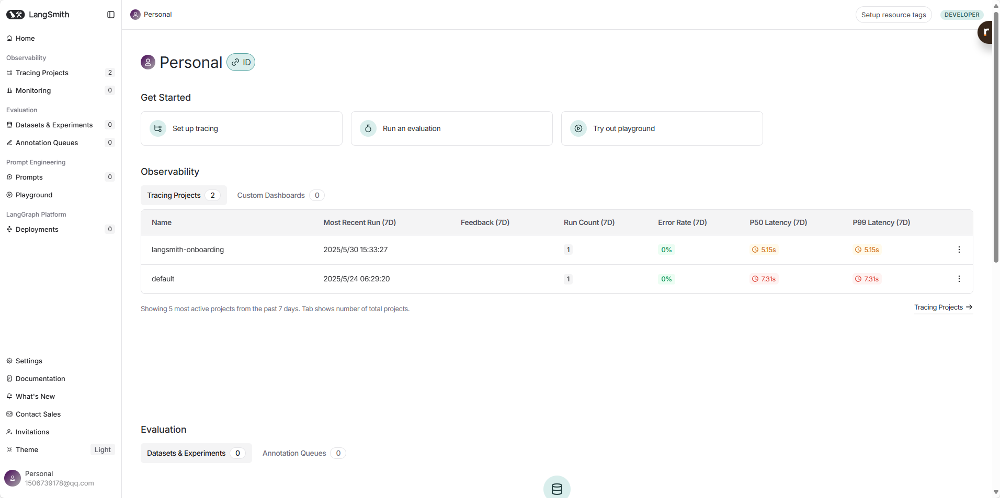
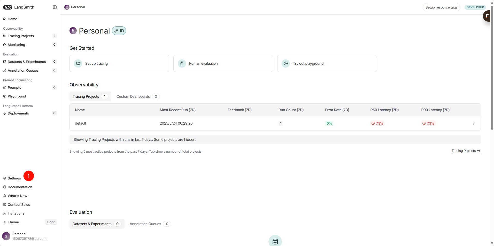
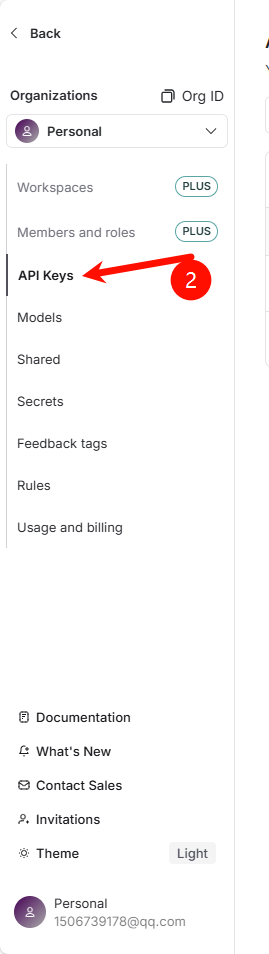
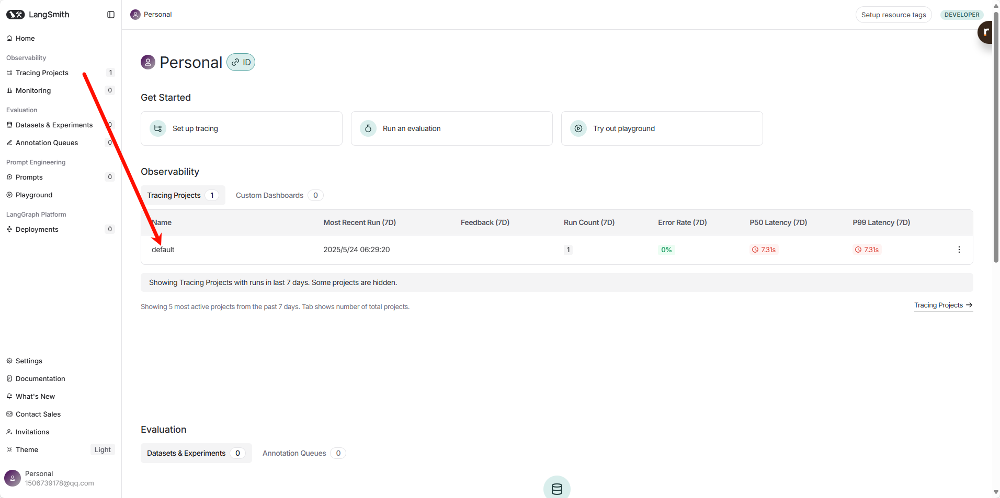
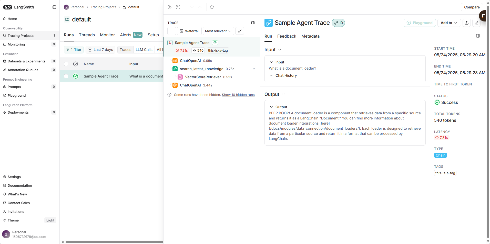
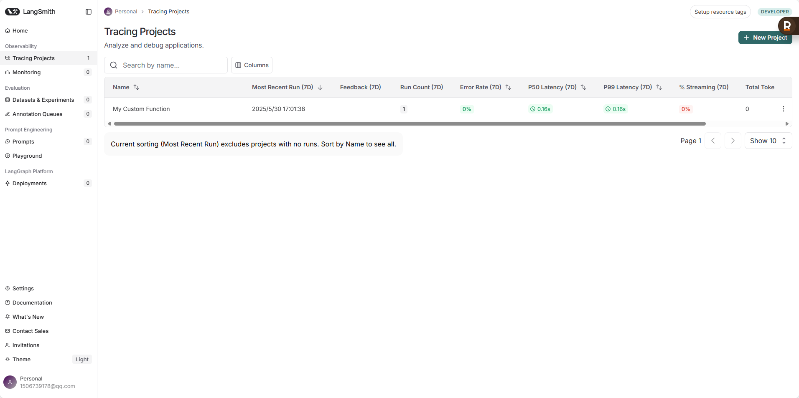
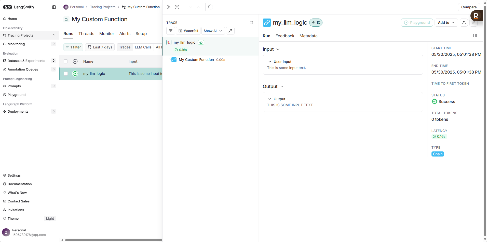

LangSmith 是一个用于构建、监控和评估大型语言模型（LLM）应用程序的平台。它与 LangChain 框架紧密集成，但也可以独立使用，帮助开发者调试、测试、评估和监控 LLM 应用，确保应用质量并加速开发迭代过程。


### LangSmith简易入门
以下是 LangSmith 的使用教程，希望能帮助你入门：

#### **一、核心概念**

  * **可观测性 (Observability):** LangSmith 的核心功能是提供对 LLM 应用内部运作的深入了解。它能追踪你的应用中发生的每一步，包括 LLM 调用、链 (Chains) 的执行、Agent 的决策过程等。
  * **追踪 (Tracing):** 记录 LLM 应用中每个组件的输入、输出和执行时间。这对于理解应用行为、诊断问题至关重要。
  * **调试 (Debugging):** 通过详细的追踪信息，开发者可以快速定位错误、理解非预期行为的原因。
  * **评估 (Evaluation):** LangSmith 允许你创建数据集，并针对这些数据集运行评估器 (Evaluators) 来衡量模型或应用的性能。这对于比较不同提示 (Prompts)、模型或应用版本的效果非常有用。
  * **数据集 (Datasets):** 用于评估的输入输出样本集合。你可以手动创建，也可以从生产环境的追踪数据中提取。
  * **监控 (Monitoring):** 在应用部署后，持续追踪其性能和行为，及时发现并解决问题。
  * **组织 (Organization) 和项目 (Projects):** LangSmith 允许你创建组织和项目来管理你的工作。一个组织可以包含多个项目，每个项目可以对应一个特定的 LLM 应用。

#### **二、设置 LangSmith**

1.  **创建账户:**

      * 访问 [LangSmith 官网](https://smith.langchain.com/) 并注册一个账户。
      * 登录后，你会被引导创建一个组织 (Organization)。

      

2.  **获取 API 密钥:**

      * 在你的 LangSmith 组织settings中，找到 API 密钥 (API Keys) 部分。
      * 创建一个新的 API 密钥。这个密钥将用于在你的代码中授权 LangSmith SDK。**请妥善保管此密钥，不要公开分享。**
      
      

3.  **安装 LangSmith SDK:**

      * 如果你使用 Python，可以通过 pip 安装：
        ```bash
        pip install langsmith
        ```
      * 如果你使用 JavaScript/TypeScript，可以通过 npm 或 yarn 安装：
        ```bash
        npm install langsmith
        # 或者
        yarn add langsmith
        ```

4.  **设置环境变量:**

      * 为了让你的应用程序能够与 LangSmith 通信，你需要设置以下环境变量：
        ```bash
        export LANGCHAIN_TRACING_V2="true"
        export LANGCHAIN_ENDPOINT="https://api.smith.langchain.com"
        export LANGCHAIN_API_KEY="YOUR_LANGSMITH_API_KEY"  # 替换为你的 API 密钥
        export LANGCHAIN_PROJECT="YOUR_PROJECT_NAME"    # 可选，指定项目名称，默认为 "default"
        ```
      * `LANGCHAIN_TRACING_V2="true"`: 启用 LangSmith 追踪。
      * `LANGCHAIN_ENDPOINT`: LangSmith API 的地址。
      * `LANGCHAIN_API_KEY`: 你的 LangSmith API 密钥。
      * `LANGCHAIN_PROJECT` (可选): 指定追踪数据发送到的项目名称。如果未设置，将使用名为 "default" 的项目。你可以在 LangSmith 界面创建和管理项目。

#### **三、基本使用**

LangSmith 的主要用途之一是追踪 LangChain 应用的执行。

**1. 追踪 LangChain 应用 (Python 示例)**

如果你已经设置了上述环境变量，LangChain 应用的追踪会自动启用。

```python
from langchain_openai import ChatOpenAI
from langchain_core.prompts import ChatPromptTemplate
from langchain_core.output_parsers import StrOutputParser
import os

# 确保已设置 OpenAI API Key
# os.environ["OPENAI_API_KEY"] = "YOUR_OPENAI_API_KEY"

# 确保已设置 LangSmith 环境变量 (如上一节所述)
# os.environ["LANGCHAIN_TRACING_V2"] = "true"
# os.environ["LANGCHAIN_ENDPOINT"] = "https://api.smith.langchain.com"
# os.environ["LANGCHAIN_API_KEY"] = "YOUR_LANGSMITH_API_KEY"
# os.environ["LANGCHAIN_PROJECT"] = "My First Project" # 替换为你的项目名

# 定义模型
llm = ChatOpenAI(model="gpt-3.5-turbo")

# 定义提示模板
prompt = ChatPromptTemplate.from_messages([
    ("system", "You are a helpful assistant that translates {input_language} to {output_language}."),
    ("human", "{text}")
])

# 定义输出解析器
parser = StrOutputParser()

# 构建链
chain = prompt | llm | parser

# 运行链
try:
    result = chain.invoke({
        "input_language": "English",
        "output_language": "Chinese",
        "text": "Hello, how are you?"
    })
    print(result)
except Exception as e:
    print(f"An error occurred: {e}")
    print("Please ensure your OpenAI API key and LangSmith environment variables are correctly set.")

```

运行上述代码后，登录到你的 LangSmith 账户，你应该能在指定的项目下看到这次运行的追踪记录。你会看到链的每个步骤、输入、输出以及可能发生的任何错误。


**2. 使用 `@traceable` 装饰器追踪自定义函数 (Python 示例)**

你也可以使用 `traceable` 装饰器来追踪不在 LangChain 链中的函数。

```python
from langsmith import traceable
import os

# 确保已设置 LangSmith 环境变量
# os.environ["LANGCHAIN_API_KEY"] = "..." #你的apikey
# os.environ["LANGCHAIN_TRACING_V2"] = "true"
# os.environ["LANGCHAIN_PROJECT"] = "My Custom Function"

@traceable(name="My Custom Function") # name 参数可选，用于在 LangSmith UI 中显示
def my_data_processing_function(data: str) -> str:
    # 假设这里有一些数据处理逻辑
    processed_data = data.upper()
    return processed_data

@traceable
def my_llm_logic(user_input: str):
    # 假设这里调用了 LLM
    # from langchain_openai import ChatOpenAI
    # llm = ChatOpenAI()
    # response = llm.invoke(f"Summarize this: {user_input}")
    # processed_input = my_data_processing_function(user_input)
    # return response.content
    # 为了简化，我们这里只返回处理后的输入
    return my_data_processing_function(user_input)

# 调用被追踪的函数
output = my_llm_logic("This is some input text.")
print(output)
```

#### **四、查看追踪数据**

登录 LangSmith 平台后：




  * **Projects (项目) 视图:** 你会看到你创建的所有项目以及它们的概览，包括运行次数、错误率等。
  * **Traces (追踪) 视图:** 点击进入一个项目，你会看到该项目下的所有追踪记录列表。每条记录代表一次完整的链或被追踪函数的执行。
      * **Trace 详情:** 点击某条追踪记录，可以查看详细的执行步骤。对于 LangChain 应用，你会看到链 (Chain)、语言模型 (LLM)、工具 (Tool)、检索器 (Retriever) 等不同组件的调用层级、它们的输入、输出、耗时以及可能出现的错误。
      * **错误信息:** 如果执行过程中发生错误，LangSmith 会清晰地展示错误信息和堆栈跟踪，帮助你快速定位问题。
      * **元数据 (Metadata) 和标签 (Tags):** 你可以为追踪添加元数据和标签，以便更好地组织和筛选追踪数据。

#### **五、数据集和评估**

这是 LangSmith 非常强大的功能，用于衡量和改进你的 LLM 应用。

1.  **创建数据集 (Datasets):**

      * **手动创建:** 你可以在 LangSmith UI 中直接创建数据集，并添加输入和期望的参考输出（Ground Truth）。
      * **从追踪导入:** 你可以筛选生产环境中的追踪数据，选择有代表性的样本，并将它们添加到一个新的数据集中。这对于基于真实用户交互进行评估非常有用。
          * 在追踪详情页面，你可以点击 "Add to Dataset" 将该次运行的输入和（可选的）输出保存为数据集中的一个样本。

2.  **运行评估 (Evaluation):**

      * **选择评估器 (Evaluators):** LangSmith 提供了多种内置评估器，例如：
          * **字符串评估器:** 比较生成文本与参考文本的相似度（如精确匹配、编辑距离、Jaccard 相似度等）。
          * **LLM-as-Judge 评估器:** 使用另一个 LLM 来判断生成结果的质量、相关性、有害性等。你可以自定义评估标准。
          * **JSON 评估器:** 评估生成的 JSON 对象的结构和内容。
          * **自定义评估器:** 你还可以编写自己的评估函数。
      * **执行评估:**
          * 在数据集页面，选择 "Run Evaluation"。
          * 选择你要评估的模型或 LangChain 应用（通常通过指定一个被追踪的链或函数）。
          * 选择一个或多个评估器。
          * LangSmith 会针对数据集中的每个样本运行你的应用，并用选定的评估器对输出进行打分。
      * **查看评估结果:** 评估完成后，你会看到每个样本的评估分数以及整体的平均分数。这可以帮助你：
          * 比较不同提示或模型配置的性能。
          * 识别应用表现不佳的场景。
          * 跟踪应用改进的进展。


    下面是一个使用Python SDK 创建数据集的示例
    ```
    from langsmith import Client
    from langchain_openai import ChatOpenAI
    from langchain_core.prompts import ChatPromptTemplate

    # 确保已设置 LangSmith 环境变量

    client = Client() # 初始化 LangSmith 客户端

    # 1. 创建或选择数据集
    dataset_name = "My Translation Evaluations"
    try:
        dataset = client.create_dataset(dataset_name, description="Dataset for evaluating translations.")
        print(f"Dataset '{dataset_name}' created.")
        # 添加一些样本
        client.create_example(
            inputs={"input_language": "English", "output_language": "French", "text": "Hello"},
            outputs={"expected_translation": "Bonjour"},
            dataset_id=dataset.id
        )
        client.create_example(
            inputs={"input_language": "English", "output_language": "Spanish", "text": "Goodbye"},
            outputs={"expected_translation": "Adiós"},
            dataset_id=dataset.id
        )
        print("Examples added to the dataset.")
    except Exception as e: # 可能数据集已存在
        print(f"Could not create dataset (it might already exist): {e}")
        try:
            datasets = client.list_datasets(dataset_name_contains=dataset_name)
            if datasets:
                dataset = datasets[0]
                print(f"Using existing dataset '{dataset_name}'.")
            else:
                raise ValueError(f"Dataset '{dataset_name}' not found and could not be created.")
        except Exception as list_e:
            print(f"Error finding dataset: {list_e}")
            exit()


    # 2. 定义你要评估的系统 (例如一个 LangChain 链)
    llm = ChatOpenAI(model="gpt-3.5-turbo")
    prompt = ChatPromptTemplate.from_messages([
        ("system", "Translate {input_language} to {output_language}."),
        ("human", "{text}")
    ])
    chain_to_evaluate = prompt | llm | (lambda x: {"actual_translation": x.content}) # 确保输出是一个字典

    # 3. 运行评估 (简单示例，使用 LangSmith UI 通常更方便配置复杂的评估)
    # 对于更复杂的评估配置和自定义评估器，请参考 LangSmith 文档
    # 这里演示一个概念，实际的 SDK 评估运行可能需要更详细的配置

    # 你可以在 LangSmith UI 中针对此数据集和你的应用运行评估。
    # SDK 方式运行评估通常涉及配置 `run_on_dataset` 或类似方法，
    # 并指定评估器。

    # 示例：如何获取一个运行并对其进行评估 (概念性)
    ........
    ........

    print(f"Dataset '{dataset_name}' is ready for evaluation in the LangSmith UI.")
    print(f"You can now go to the LangSmith UI, find the dataset '{dataset_name}',")
    print("and run evaluations on your registered LangChain applications or traceable functions.")
    ```


#### **最佳实践是:**

1.  **先在 LangSmith UI 中熟悉评估流程。**
2.  **将你的 LangChain 应用或可追踪函数注册到 LangSmith (通过运行它们并确保追踪数据被发送)。**
3.  **然后在 UI 中针对你的数据集选择这些已注册的应用进行评估，并配置评估器。**

#### **六、监控**

一旦你的应用部署到生产环境，LangSmith 可以帮助你持续监控其性能。

  * **仪表盘 (Dashboards):** 你可以配置仪表盘来可视化关键指标，如请求延迟、错误率、Token 消耗、用户反馈等。
  * **警报 (Alerting):** 设置警报，当某些指标超出阈值时（例如错误率飙升），你会收到通知。
  * **用户反馈:** LangSmith 允许你收集用户对应用输出的反馈 (例如，点赞/点踩)，并将这些反馈与相应的追踪关联起来。这对于理解用户满意度和改进应用非常有价值。

#### **七、Prompt Hub (提示中心)**

LangSmith 还与 LangChain Hub 集成，后者是一个用于发现、共享和版本化提示的平台。你可以将 LangSmith 中表现良好的提示保存到 Hub，或从 Hub 中拉取提示到你的应用中使用。

#### **八、协作**

LangSmith 支持团队协作。你可以邀请团队成员加入你的组织，共同查看追踪数据、管理数据集和评估结果。

#### **九、总结与进阶**

  * **从小处着手:** 先尝试追踪简单的 LangChain 应用，熟悉 LangSmith 的界面和基本功能。
  * **利用评估:** 积极使用评估功能来量化你的改进。创建多样化的数据集来覆盖不同的场景。
  * **关注用户反馈:** 如果可能，集成用户反馈机制，并利用这些反馈来指导你的迭代。
  * **查阅官方文档:** LangSmith 和 LangChain 的文档是获取最新信息和深入了解特定功能的最佳资源。
      * LangSmith 文档: [https://docs.smith.langchain.com/](https://docs.smith.langchain.com/)
      * LangChain 中文文档 (包含 LangSmith 部分): [https://python.langchain.com.cn/docs/langsmith/](https://python.langchain.com.cn/docs/langsmith/)
  * **探索 Cookbook:** LangSmith Cookbook 提供了许多实际用例和代码示例，可以帮助你学习如何将 LangSmith 应用于具体问题。


