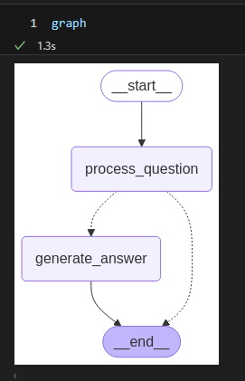
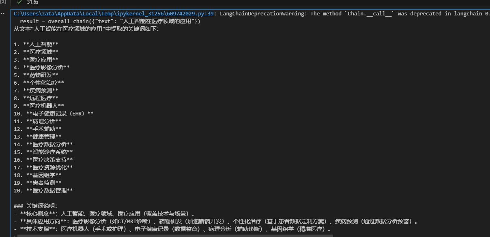

LangChain 是一个强大的开源框架，用于构建基于大型语言模型（LLM）的应用程序。它简化了开发流程，支持上下文感知、外部数据源集成以及复杂的工作流编排。以下是一个最新的入门教程概览，适用于2025年3月的背景：

---

## LangChain 简易教程

### 安装 LangChain
确保您已经安装了 Python（建议使用 3.9 或更高版本）。通过以下命令安装 LangChain 的核心库：
```bash
pip install langchain
```
如果您需要特定的集成（例如 OpenAI、Anthropic 等），可以安装对应的合作伙伴包：
```bash
pip install langchain-openai
pip install langchain-anthropic
```

### 基础概念
LangChain 的核心包括以下几个模块：
- **模型 I/O（Model I/O）**：与 LLM 交互，发送提示并获取输出。
- **内存（Memory）**：保留对话上下文，例如使用 `ConversationBufferMemory`。
- **链（Chains）**：组合提示、模型和外部工具，例如 `LLMChain` 或 `SequentialChain`。
- **检索（Retrieval）**：通过向量数据库（如 Qdrant 或 FAISS）实现检索增强生成（RAG）。
- **代理（Agents）**：让 LLM 根据工具动态决策。

### 3. 快速上手示例：构建一个简单的问答系统


首先再项目路径下面创建一个.env文件，并添加以下内容：
```bash
# 阿里云
## qwq-32b
api_key = "sk-..." # your-api-key
model = "qwq-32b"
base_url = "https://dashscope.aliyuncs.com/compatible-mode/v1"

# openai
....
```


以下是一个使用 LangChain 与 OpenAI 模型构建简单问答系统的代码示例：
```python
from langchain_openai import ChatOpenAI
from langchain.prompts import PromptTemplate
from langchain.chains import LLMChain
from dotenv import load_dotenv
import os
load_dotenv()
# 初始化模型
# 可以使用OpenAI的API
# llm = ChatOpenAI(model="gpt-4", api_key="your-openai-api-key")
# 或者可以用其他的API，比如阿里云的
api_key = os.getenv("api_key")
base_url = os.getenv("base_url")
model = os.getenv("model")
llm = ChatOpenAI(api_key=api_key, base_url=base_url,model=model,  streaming=True)

# 定义提示模板
prompt = PromptTemplate(
    input_variables=["question"],
    template="请简洁回答以下问题：{question}"
)

# 创建链
chain = LLMChain(llm=llm, prompt=prompt)

# 运行链
question = "2025年的技术趋势是什么？"
response = chain.run(question)
print(response)
```

**输出示例**（假设模型预测）：  
2025年的技术趋势将聚焦以下方向：  
1. **人工智能与生成式AI**：生成式AI（如大模型）在内容创作、医疗诊断、客户服务等领域广泛应用，推动自动化与个性化服务。  
2. **量子计算**：实用化进展加速，可能在密码学、材料科学和药物研发中解决复杂问题。  
3. **可持续技术**：绿色能源（如高效太阳能、储能技术）、碳捕捉及电动汽车技术进一步成熟，助力碳中和目标。  
4. **扩展现实（XR）与元宇宙**：AR/VR在教育、远程协作和虚拟经济中的渗透率提升，推动沉浸式体验场景。  
5. **生物科技**：基因编辑（如CRISPR）、合成生物学和个性化医疗将革新疾病治疗与生物制造。  
6. **物联网与边缘计算**：5G/6G网络与边缘计算结合，优化工业自动化、智慧城市和实时数据分析。  
7. **网络安全**：零信任架构与AI驱动的安全系统成为应对网络威胁的核心，保护关键基础设施。  

这些趋势将重塑产业、生活方式及全球竞争力。

### 进阶功能：RAG 系统
检索增强生成（RAG）是 LangChain 的强大功能，可结合外部数据回答问题。以下是一个简单示例：
```python
from langchain_openai import OpenAIEmbeddings
from langchain.vectorstores import FAISS
from langchain.chains import RetrievalQA
from langchain.document_loaders import TextLoader
from langchain_community.embeddings import DashScopeEmbeddings
from dotenv import load_dotenv
load_dotenv()
# 加载文档
loader = TextLoader("example_doc.txt")
documents = loader.load()

api_key = os.getenv("api_key")
base_url = os.getenv("base_url")


embeddings = DashScopeEmbeddings(
    model="text-embedding-v3",
    dashscope_api_key=api_key,
    # base_url=base_url
)


vector_store = FAISS.from_documents(documents, embeddings)

# 初始化检索链
qa_chain = RetrievalQA.from_chain_type(
     
    llm=ChatOpenAI(api_key=api_key, base_url=base_url,model="qwq-32b",streaming=True),
    chain_type="stuff",
    retriever=vector_store.as_retriever()
)

# 查询
response = qa_chain.run("文档中提到的重要内容是什么？")
print(response)
```

### 使用 LangGraph 构建复杂代理

#### 1. 什么是 LangGraph？
LangGraph 是由 LangChain 团队开发的一个工具，用于构建和管理多步骤的工作流或代理状态机。它允许你定义状态、节点和边来描述一个复杂的过程。非常适合需要状态管理和多步骤推理的任务。

---

#### 2. 安装必要的库
首先，确保你已经安装了 LangGraph。如果你还没有安装，可以通过以下命令安装：

```bash
pip install langgraph
```

---

#### 3. 代码逐步解析

以下是你提供的代码，我会逐行解释：

```python
from langgraph.graph import StateGraph, END
from typing import TypedDict

# 定义状态
class AgentState(TypedDict):
    question: str
    answer: str
```
- **`StateGraph`**：这是 LangGraph 的核心类，用于构建状态图。
- **`END`**：一个内置的终点标记，表示工作流结束。
- **`TypedDict`**：Python 的类型提示工具，用于定义状态的结构。这里定义了一个 `AgentState`，它有两个字段：`question`（问题）和 `answer`（回答）。

```python
# 定义节点函数
def question_node(state: AgentState) -> AgentState:
    state["answer"] = f"回答：{state['question']}"
    return state
```
- **`question_node`**：这是一个节点函数，接收当前状态 (`state`)，并返回更新后的状态。
- 在这个例子中，节点简单地将输入的问题前面加上“回答：”作为输出。

```python
# 创建状态图
workflow = StateGraph(AgentState)
```
- **`workflow`**：实例化一个状态图，指定状态类型为 `AgentState`。

```python
# 添加节点
workflow.add_node("process_question", question_node)
```
- **`add_node`**：向状态图添加一个节点，节点名称是 `"process_question"`，对应的处理函数是 `question_node`。
- 注意：节点名称不能与状态的键名（如 `question` 或 `answer`）冲突。

```python
# 设置入口点
workflow.set_entry_point("process_question")
```
- **`set_entry_point`**：指定工作流的起点，即从哪个节点开始执行。

```python
# 添加边
workflow.add_edge("process_question", END)
```
- **`add_edge`**：定义从 `"process_question"` 节点到 `END` 的边，表示处理完问题后工作流结束。

```python
# 编译并运行
graph = workflow.compile()
result = graph.invoke({"question": "今天天气如何？"})
print(result["answer"])
```
- **`compile`**：将工作流编译为可执行的图。
- **`invoke`**：运行图，传入初始状态（这里是 `{"question": "今天天气如何？"}`）。
- **`result["answer"]`**：输出最终状态中的 `answer` 字段，结果为 `回答：今天天气如何？`。

---

#### 4. 扩展示例：添加更多功能

下面是一个更复杂的示例，展示如何添加多个节点和条件分支：

```python
from langgraph.graph import StateGraph, END
from typing import TypedDict

# 定义状态
class AgentState(TypedDict):
    question: str
    answer: str
    processed: bool

# 节点1：处理问题
def process_question_node(state: AgentState) -> AgentState:
    state["answer"] = f"正在处理你的问题：{state['question']}  state[\"processed\"] = False 直接结束 "
    # state["processed"] = True
    return state

# 节点2：生成最终回答
def generate_answer_node(state: AgentState) -> AgentState:
    if "天气" in state["question"]:
        state["answer"] = "今天天气晴朗，温度25摄氏度。"
    else:
        state["answer"] = "这是一个好问题，但我需要更多信息来回答。"
    return state

# 条件函数：决定下一步
def decide_next(state: AgentState):
    if state["processed"]:
        return "generate_answer"
    return END

# 创建状态图
workflow = StateGraph(AgentState)

# 添加节点
workflow.add_node("process_question", process_question_node)
workflow.add_node("generate_answer", generate_answer_node)

# 设置入口点
workflow.set_entry_point("process_question")

# 添加边
workflow.add_conditional_edges(
    "process_question",
    decide_next,
    {
        "generate_answer": "generate_answer",
        END: END
    }
)
workflow.add_edge("generate_answer", END)

# 编译并运行
graph = workflow.compile()
result = graph.invoke({"question": "今天天气如何？", "processed": True})
print(result["answer"])
```

**输出：**
```
今天天气晴朗，温度25摄氏度。
```

---

#### 5. 关键概念

- **状态 (State)**：工作流中的数据载体，所有节点共享并更新。
- **节点 (Node)**：执行具体任务的函数，接收状态并返回更新后的状态。
- **边 (Edge)**：定义节点之间的流向，可以是直接边 (`add_edge`) 或条件边 (`add_conditional_edges`)。
- **条件分支**：通过函数（如 `decide_next`）动态决定下一个节点。

---

#### 6. 调试和可视化

如果你想调试或可视化状态图，可以尝试以下方法：

```python
# 在jupyter中直接打印检查图的结构
graph
```




---

#### 7. 常见问题

- **状态未更新？**  
  确保节点函数返回了修改后的状态。如果直接修改 `state` 但不返回，可能不会生效。
  
- **节点名称冲突？**  
  检查节点名称是否与状态字段重名，避免混淆。

---

#### 8. 更多资源

- **LangGraph 官方文档**：https://langchain-ai.github.io/langgraph/
- **GitHub 仓库**：https://github.com/langchain-ai/langgraph
- **社区示例**：搜索 LangChain 或 LangGraph 的教程，YouTube 上也有许多视频。


### 最新资源推荐
截至2025年3月11日，以下资源可能是最新的学习途径：
- **LangChain 官方文档**：访问 [python.langchain.com](https://python.langchain.com) 获取最新 API 参考和指南。
- **LangChain 中文社区**：如 [www.langchain.com.cn](https://www.langchain.com.cn) 或 [www.langchain.asia](https://www.langchain.asia)，提供中文教程和文档。
- **GitHub 仓库**：查看 [github.com/langchain-ai/langchain](https://github.com/langchain-ai/langchain) 获取最新代码和示例。
- **X 上的更新**：关注 @LangChainAI，获取最新集成和教程。例如，2025年3月9日的帖子提到 Deno 与 LangChain.js 的本地 LLM 集成教程。

### 下一步
- **尝试 LangSmith**：用于调试和监控您的 LangChain 应用。
- **部署**：使用 LangServe 将链部署为 REST API。
- **探索多模态**：结合图像或音频输入，扩展应用场景。

---

## LangChain 模块化教程

LangChain 的核心功能可以分为以下几个模块：
1. **模型 I/O（Model I/O）** - 与语言模型交互
2. **内存（Memory）** - 管理对话上下文
3. **链（Chains）** - 组合提示和逻辑
4. **检索（Retrieval）** - 外部数据增强生成
5. **代理（Agents）** - 动态工具调用
6. **LangGraph** - 复杂工作流和多代理系统

以下是每个模块的教程：

---

### 1. 模型 I/O（Model I/O）
**功能**：与 LLM 交互，包括输入提示、调用模型和处理输出。

**教程**：
```python
from langchain_openai import ChatOpenAI
from langchain.prompts import PromptTemplate
import os
from dotenv import load_dotenv
load_dotenv()

# 初始化模型
llm = ChatOpenAI(model="gpt-4", api_key="your-openai-api-key")
# 或者可以用其他的API，比如阿里云的
api_key = os.getenv("api_key")

base_url = "https://dashscope.aliyuncs.com/compatible-mode/v1"
llm = ChatOpenAI(api_key=api_key, base_url=base_url,model="qwq-32b",  streaming=True,)

# 定义提示模板
prompt = PromptTemplate.from_template("请用简洁的语言回答：{question}")

# 调用模型
question = "2025年的 AI 趋势是什么？"
response = llm.invoke(prompt.format(question=question))
print(response.content)

```
**输出示例**：  
"2025年的 AI 趋势包括多模态模型和自动化代理的广泛应用。"

**要点**：
- 支持多种模型（OpenAI、Anthropic、Hugging Face 等）。
- 可调整温度（temperature）和最大 token 数等参数。

---

### 2. 内存（Memory）
**功能**：保存和管理对话历史，提供上下文支持。

**教程**：
```python
from langchain.memory import ConversationBufferMemory
from langchain.chains import ConversationChain
from langchain_openai import ChatOpenAI
import os
from dotenv import load_dotenv
load_dotenv()
# 初始化模型

api_key = os.getenv("api_key")

llm = ChatOpenAI(model="qwq-32b", api_key=api_key, base_url="https://dashscope.aliyuncs.com/compatible-mode/v1", streaming=True)

# 创建内存
memory = ConversationBufferMemory()

# 创建对话链
conversation = ConversationChain(llm=llm, memory=memory)

# 第一轮对话
print(conversation.run("我叫张三，今年30岁。"))
# 输出：好的，张三，很高兴认识你！你今天过得怎么样？

# 第二轮对话
print(conversation.run("你还记得我多大吗？"))
# 输出：当然记得，你今年30岁！

```
**要点**：
- `ConversationBufferMemory` 存储完整历史。
- 其他选项如 `ConversationSummaryMemory` 可总结对话以节省 token。

---

### 3. 链（Chains）
**功能**：将提示、模型和逻辑组合成可重复使用的流程。

**教程**：
```python
from langchain_openai import ChatOpenAI
from langchain_core.prompts import PromptTemplate
from langchain.chains import LLMChain, SequentialChain
import os
from dotenv import load_dotenv
load_dotenv()
# 初始化模型


api_key = os.getenv("api_key")
base_url = os.getenv("base_url")
model = os.getenv("model")

# 初始化语言模型
llm = ChatOpenAI(model=model, api_key=api_key,base_url=base_url,streaming=True)

# 第一步：提取关键词
prompt1 = PromptTemplate(
    input_variables=["text"],
    template="从以下文本中提取关键词：{text}"
)
chain1 = LLMChain(llm=llm, prompt=prompt1, output_key="keywords")

# 第二步：基于关键词生成回答
prompt2 = PromptTemplate(
    input_variables=["keywords"],
    template="根据以下关键词生成一段话：{keywords}"
)
chain2 = LLMChain(llm=llm, prompt=prompt2, output_key="response")

# 创建顺序链
overall_chain = SequentialChain(
    chains=[chain1, chain2],
    input_variables=["text"],
    output_variables=["keywords", "response"]
)

# 运行链
result = overall_chain({"text": "人工智能在医疗领域的应用"})
print(result["keywords"])  # 可能是：“人工智能, 医疗, 应用”
print(result["response"])  # 可能是：“人工智能在医疗领域的应用包括疾病诊断、药物开发等。”
```
**输出示例**：  



**要点**：
- `SequentialChain` 可连接多个链。
- 支持条件分支和自定义逻辑。

---

### 4. 检索（Retrieval）
**功能**：通过向量数据库从外部文档中检索相关信息。

**教程**：
```python
from langchain_openai import OpenAIEmbeddings
from langchain.vectorstores import FAISS
from langchain.chains import RetrievalQA
from langchain.document_loaders import TextLoader
from langchain_community.embeddings import DashScopeEmbeddings
from langchain_openai import ChatOpenAI


import os
from dotenv import load_dotenv
load_dotenv()
# 初始化模型


api_key = os.getenv("api_key")
base_url = os.getenv("base_url")
model = os.getenv("model")

# 初始化语言模型

# 加载文档
loader = TextLoader("example_doc.txt")  # 假设文件内容为技术趋势
documents = loader.load()

# 创建嵌入和向量存储

embeddings = DashScopeEmbeddings(
    model="text-embedding-v3",
    dashscope_api_key=api_key,
    # other params...
)

vector_store = FAISS.from_documents(documents, embeddings)

# 创建检索链
qa_chain = RetrievalQA.from_chain_type(
    llm = ChatOpenAI(model=model, api_key=api_key,base_url=base_url,streaming=True),
    chain_type="stuff",
    retriever=vector_store.as_retriever()
)

# 查询
response = qa_chain.run("2025年的技术趋势是什么？")
print(response)

```
**输出示例**：  
"根据文档，2025年的技术趋势包括量子计算和 AI 驱动的自动化。"

**要点**：
- 支持多种向量存储（如 FAISS、Qdrant、Pinecone）。
- 可用于问答、文档搜索等场景。

---

### 5. 代理（Agents）


**什么是 LangChain Agent？**

在 LangChain 中，`Agent` 是一个结合语言模型（LLM）和外部工具的智能实体。它能够：
1. **理解用户输入**：分析任务需求。
2. **制定计划**：决定是否需要调用工具。
3. **执行动作**：使用工具获取信息或完成任务。
4. **生成答案**：基于工具结果和推理给出最终回答。

代理的工作流程通常基于 **ReAct 框架**（Reasoning + Acting），即通过思考（Thought）、行动（Action）和观察（Observation）循环解决问题。

**功能**：让 LLM 使用工具动态解决问题。

#### **步骤1：基本代理实现**：
```python
from langchain_openai import ChatOpenAI
from langchain.agents import initialize_agent, Tool
from langchain.utilities import WikipediaAPIWrapper

# 初始化模型


import os
from dotenv import load_dotenv
load_dotenv()
# 初始化模型


api_key = os.getenv("api_key")
base_url = os.getenv("base_url")
model = os.getenv("model")
llm = ChatOpenAI(model=model, api_key=api_key,base_url=base_url,streaming=True)

# 定义工具
wikipedia = WikipediaAPIWrapper()
tools = [
    Tool(
        name="Wikipedia",
        func=wikipedia.run,
        description="用于查询维基百科的信息",
        handle_parsing_errors=True  # 当解析失败时，代理会将错误反馈给模型，要求其重新生成符合预期的输出格式。
    )
]

# 创建代理
agent = initialize_agent(tools, llm, agent_type="zero-shot-react-description")

# 运行代理
response = agent.run("告诉我关于 LangChain 的信息")
print(response)

```
##### 输出解释
- `verbose=True` 会显示代理的思考过程，例如：
  ```
  Thought: 我需要了解 LangChain 的定义和功能，可以使用 Wikipedia 工具。
  Action: Wikipedia
  Action Input: LangChain
  Observation: [Wikipedia 返回的信息]
  Thought: 我已经获得了足够的信息，可以总结。
  Final Answer: [总结的答案]
  ```

##### 关键点
- `agent_type="zero-shot-react-description"`：这是最简单的代理类型，基于工具描述动态决定行动，无需预训练。
- `WikipediaAPIWrapper`：一个预构建的工具，直接调用 Wikipedia API 获取信息。

---

#### 步骤 2：处理输出解析错误
在你的问题中提到过 `OutputParserException`，我们可以通过设置 `handle_parsing_errors=True` 来避免这种情况。

```python
# 修改后的初始化代理部分
agent = initialize_agent(
    tools=tools,
    llm=llm,
    agent_type="zero-shot-react-description",
    verbose=True,
    handle_parsing_errors=True  # 自动处理解析错误
)

response = agent.run("告诉我关于 LangChain 的信息")
print(response)
```

##### 效果
如果模型输出格式不符合预期（例如同时包含 `Action` 和 `Final Answer`），代理会将错误反馈给模型，要求其重试。

---

#### 步骤 3：自定义提示模板
默认的提示可能不够精确，我们可以通过自定义提示模板来优化代理行为。

```python
from langchain.prompts import PromptTemplate

# 自定义提示模板
custom_prompt = PromptTemplate(
    input_variables=["input", "intermediate_steps", "agent_scratchpad"],
    template="""你是一个智能助手，按照以下步骤回答用户问题：
1. 分析用户输入，确定是否需要调用工具。
2. 如果需要工具，只输出 [Action: 工具名] 和 [Action Input: 输入内容]。
3. 在收到工具结果后，分析并总结。
4. 只有在无需进一步动作时，输出 [Final Answer: 答案]。
不要同时输出 Action 和 Final Answer。

用户输入：{input}
中间步骤：{intermediate_steps}
思考过程：{agent_scratchpad}
请继续。
"""
)

# 初始化代理时使用自定义提示
agent = initialize_agent(
    tools=tools,
    llm=llm,
    agent_type="zero-shot-react-description",
    prompt=custom_prompt,  # 使用自定义提示
    verbose=True,
    handle_parsing_errors=True
)

response = agent.run("告诉我关于 LangChain 的信息")
print(response)
```
---

### 6. LangGraph（看上面的1.5）
**功能**：构建复杂的工作流或多代理系统。

**教程**：
```python
from langgraph.graph import StateGraph, END
from typing import TypedDict

# 定义状态
class AgentState(TypedDict):
    question: str
    answer: str
    processed: bool

# 节点1：处理问题
def process_question_node(state: AgentState) -> AgentState:
    state["answer"] = f"正在处理你的问题：{state['question']}  state[\"processed\"] = False 直接结束 "
    # state["processed"] = True
    return state

# 节点2：生成最终回答
def generate_answer_node(state: AgentState) -> AgentState:
    if "天气" in state["question"]:
        state["answer"] = "今天天气晴朗，温度25摄氏度。"
    else:
        state["answer"] = "这是一个好问题，但我需要更多信息来回答。"
    return state

# 条件函数：决定下一步
def decide_next(state: AgentState):
    if state["processed"]:
        return "generate_answer"
    return END

# 创建状态图
workflow = StateGraph(AgentState)

# 添加节点
workflow.add_node("process_question", process_question_node)
workflow.add_node("generate_answer", generate_answer_node)

# 设置入口点
workflow.set_entry_point("process_question")

# 添加边
workflow.add_conditional_edges(
    "process_question",
    decide_next,
    {
        "generate_answer": "generate_answer",
        END: END
    }
)
workflow.add_edge("generate_answer", END)

# 编译并运行
graph = workflow.compile()
result = graph.invoke({"question": "今天天气如何？", "processed": False})
print(result["answer"])
```
**输出示例**：  
"答案是：如何学习 LangChain 的解决方案。"

**要点**：
- LangGraph 适合循环逻辑或多步骤任务。
- 可扩展为多代理协作。

---

### 综合示例：结合所有模块
假设我们要构建一个回答技术问题的系统：
```python
from langchain_openai import ChatOpenAI, OpenAIEmbeddings
from langchain.prompts import PromptTemplate
from langchain.memory import ConversationBufferMemory
from langchain.chains import LLMChain
from langchain.vectorstores import FAISS
from langchain.document_loaders import TextLoader
from langchain.agents import initialize_agent, Tool
from langchain_community.embeddings import DashScopeEmbeddings
import os
from dotenv import load_dotenv
load_dotenv()
# 初始化模型


api_key = os.getenv("api_key")
base_url = os.getenv("base_url")
model = os.getenv("model")
llm = ChatOpenAI(model=model, api_key=api_key,base_url=base_url,streaming=True)

memory = ConversationBufferMemory()

# 加载外部文档
loader = TextLoader("example_doc.txt")
documents = loader.load()
embeddings = DashScopeEmbeddings(
    model="text-embedding-v3",
    dashscope_api_key=api_key,
    # other params...
)
vector_store = FAISS.from_documents(documents, embeddings)

# 定义工具
def search_docs(query):
    return vector_store.similarity_search(query)[0].page_content

tools = [Tool(name="DocumentSearch", func=search_docs, description="搜索文档")]

# 创建代理
agent = initialize_agent(tools, llm, agent_type="zero-shot-react-description", memory=memory)

# 运行
response = agent.invoke("2025年的技术趋势是什么？")
print(response)
```

---

### 学习资源
- **官方文档**：https://python.langchain.com
- **GitHub**：https://github.com/langchain-ai/langchain
- **X 更新**：关注 @LangChainAI 获取最新动态。

如果您想深入某个模块或需要更具体示例，请告诉我！