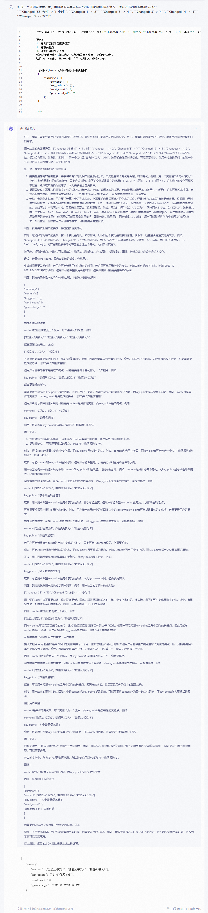
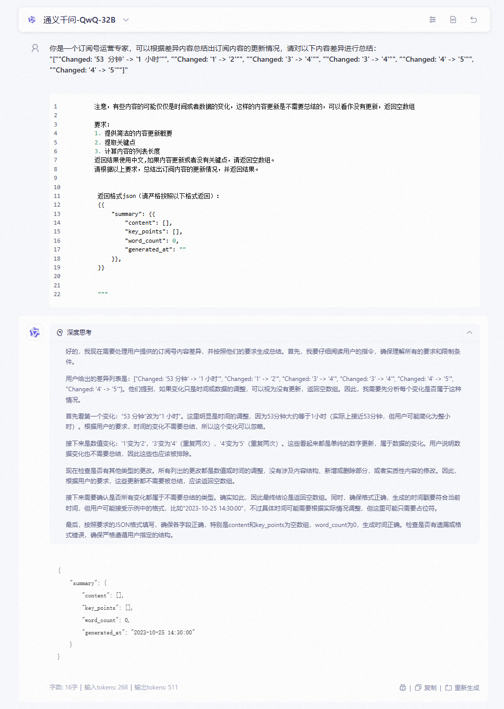
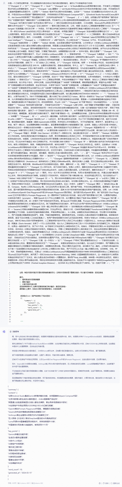

### Langchin提示词模版


### 提示词的重要性

<span style="color:red;">我之前都是认为描述，只要模型好，提示词随便写一写，模型都能返回差不多的内容。 实际上，对于人来说是差不多的，因为人的大脑可以进一步理解内容。但是，如果开发agent就不一样了 ！！！</span>

最近我在开发一个订阅系统的agent，任务是我给这个agent一些内容，然后让它总结这段时间更新了什么内容，当然由于文本长度等等的一些限制，肯定不能把历史的文本也都给他，我只要给他当前更新了哪些文本就可以。

然后我遇到一个问题，对于下面的差异文本：

```
"[""Changed: '53  分钟' -> '1  小时'"", ""Changed: '1' -> '2'"", ""Changed: '3' -> '4'"", ""Changed: '3' -> '4'"", ""Changed: '4' -> '5'"", ""Changed: '4' -> '5'""]"
```

**人一眼就能看出来，这个内容实际上是没有变化的，因为变化的只不过是网站上内容的间隔时间，但是agent却认为有变化。  我的提示词如下写道：**

```json
你是一个订阅号运营专家，可以根据差异内容总结出订阅内容的更新情况，请对以下内容差异进行总结：
            {contentdiff}

            注意，有些内容的更新可能仅仅是由于时间的变化，比如[""Changed: '33' -> '40'"", ""Changed: '58  分钟' -> '1  小时'""]，这样的内容更新是不需要总结的，可以看作没有更新

            要求：
            1. 提供简洁的内容更新概要
            2. 提取关键点
            3. 计算内容的列表长度
            返回结果使用中文,如果内容更新或者没有关键点，请返回空数组。
            请根据以上要求，总结出订阅内容的更新情况，并返回结果。
            

            返回格式json（请严格按照以下格式返回）：
            {{
                "summary": {{
                    "content": [],
                    "key_points": [],
                    "word_count": 0,
                    "generated_at": ""
                }},
            }}
            

            """
```


然后看qwq-32b和grok3输出：




可以看到他们都没给我想要的输出，我想要的就是一个空的数组，因为没有更新，但是它们给我返回的是....


然后我把提示词改成这样：

```json
你是一个订阅号运营专家，可以根据差异内容总结出订阅内容的更新情况，请对以下内容差异进行总结：
            {contentdiff}

            注意，有些内容的可能仅仅是时间或者数据的变化，这样的内容更新是不需要总结的，可以看作没有更新，返回空数组

            要求：
            1. 提供简洁的内容更新概要
            2. 提取关键点
            3. 计算内容的列表长度
            返回结果使用中文,如果内容更新或者没有关键点，请返回空数组。
            请根据以上要求，总结出订阅内容的更新情况，并返回结果。
            

            返回格式json（请严格按照以下格式返回）：
            {{
                "summary": {{
                    "content": [],
                    "key_points": [],
                    "word_count": 0,
                    "generated_at": ""
                }},
            }}
```


就这一点点的改动：    
** 注意，有些内容的可能仅仅是时间或者数据的变化，这样的内容更新是不需要总结的，可以看作没有更新，返回空数组**

但是效果：




我感觉没什么问题


再来试试其他的


```json

你是一个订阅号运营专家，可以根据差异内容总结出订阅内容的更新情况，请对以下内容差异进行总结：
            "[""Changed: '2' -> '33'"", ""Changed: 'Fl' -> 'Andr'"", ""Changed: 'we' -> 'id Studio集成Gemini新增多模态功能，开发者可上传图像获取UI代码\n谷歌最新宣布，And'"", ""Changed: ' Labs 颠覆AI' -> 'oid Studio中的Gemini助手已升级支持多模态输入功能，开发者现在可以直接将图像附加到提示中，以获取'"", ""Added: '程序开发过程中的视觉辅助。这项多'"", ""Added: '态功能最初在I/O2024大会上亮相，升级后的Gemini现能够\""理解简单的线框，并将其转换为可用的Jetpack Compose代码\""。在Android Studio Narwal的Canary版本中，Ask Gemini字段新增了\""附加图像文件\""（支持JPEG或PNG格'"", ""Changed: '，2' -> '）选项。谷歌建议用户使用具有\""强烈色彩对比\""的图像并提供\""清晰的提示\""以获得最佳效果。开发者可以上传从简单线框到高保真模型\n58  分钟前\n.\nAIbase\n北京新增'"", ""Changed: '60万美元打造首个全开放混合计算平台\n' -> '4款已完成登记的生成式AI服务，小米AI搜索、Monica在列\n网信北京发布了最新北京市生成式'"", ""Changed: '正在以前所未' -> '服务已登记信息公告，公称，根据《生成式人工智能服务管理暂行办法》及'"", ""Changed: '的速度融入我们的日常' -> '关规定，对于通过API接口或其他方式直接调用已备案大模型能力的生成式人工智能'"", ""Changed: '，而一家名为Flower Labs的初创公司正以革命性的' -> '或功能，采用登记管理'"", ""Changed: '改变AI模型的部署和运行方' -> '，允许上线提供服务。截至3月14日，我市新增34款已完成登记的生成'"", ""Changed: '。这家获得Y C' -> '人工智能服务，累计已完成46款生成式人工智能服务登记。其中，小米AI搜索、小米AI写作、M'"", ""Changed: 'mb' -> 'n'"", ""Deleted: 'nator支持的新锐企业近日推出了Flower Intelligen'"", ""Changed: 'e，一个创新的分布' -> 'a等产品在列。已上线的生成'"", ""Deleted: '云平台，专为在移动设备、个'"", ""Changed: '电脑和网络' -> '工智能'"", ""Added: '或功能，应在显著位置或产品详情页面，公示所取\n1  小时前\n.\nAIbase\n阿里通义实验室语音团队负责人鄢志杰离职\n据tech星球消息，阿里通义实验室语音团队负责人鄢志杰已于 2 月 15 日正式离职，其职级为阿里原P序列体系'"", ""Changed: '提供AI模型服务而设计。Flower Intelligence的核心优势在于其独特的混合计算策略。该平台允许应用程序在本地设备上运行AI模型，既保证了速度，又增强了隐私保护。当需要更强大的计算' -> '的P10 级别。鄢志杰是智'"", ""Changed: '力时，系统会在获得用户同意的情况下，无\n7  分钟前\n.\nAIbase\n调查：5' -> '语音领域专家， '"", ""Changed: '%美国成' -> '003 '"", ""Changed: '人使用过AI聊天机器人\n美国埃隆大学的一项调查显示，52%的美国成年人都曾使用过像ChatGPT、Gemini、Claude这样的AI' -> '进入中科'"", ""Changed: '言模型。这项由北卡罗来纳州埃隆' -> '音实验室攻读博士，师从科'"", ""Changed: '学“想象数字未来中心”在1月份开展的调查，选取了5' -> '讯飞创始人王仁华教授。 2'"", ""Changed: '名受访者。结果' -> '8 年获博士学位后，他在微软亚洲研究院语音组担任主管研究员至 2015 年，主要研究语音识别、语音合成等领域。学术上，他'"", ""Deleted: '现，在使用过AI的人群中，34%的人'"", ""Changed: '示至少每天会使用一次大语言模型。其中，ChatGPT最受欢迎，72%的受访者都用过;谷歌的Gemini位居第二，使用率为50% ' -> '多篇顶级论文，拥有多项专利'"", ""Deleted: '越来越多的人开始和AI聊天机器人建立起特殊的关系。调查显示，38%的用户认为大语言模\n'"", ""Changed: '7  分钟前\n.\nAIbase\n北京将在中小学打造' -> '0'"", ""Changed: '1个人工' -> '5 年加入阿里巴巴后，鄢志杰曾担任IDST'"", ""Changed: '应用场景，启动7个\""京娃\""智能体\n据央视新闻报道，北京市教委宣布，今年将在中小学重点打造首批' -> '语音交互\n'"", ""Changed: '1个人工智能应用场景，并启动培育建设7个\""京娃\""智能体，旨在以人工智能技术赋能五育融合培养体系，助力学生个性化、多样化发展。这些应用场景涵盖了\""AI助教\""的智能备课、智能课堂质量监测、智慧作业/命题;\""AI助学\""的智能错题分析及资源推荐、自主写作批改、外语学习助手;\""AI助育\""的智慧体育、心理健康助手;\""AI助评\""的智慧综合素质评价;\""AI助研\""的智能教师专业发展平台;以及\""AI助管\""的智慧校园。随着场景落地，7个各具\n39  分钟前\n.\nAIbase\n百万成本揭秘LLM训练黄金法则，阶跃星辰推出全领域适用的超参数优化工具\n在人工智能的激烈竞争中，一场耗资百万美元的大规模实验正悄然改变着大语言模型的训练方式。阶跃星辰研究团队日前发布重磅研究成果，他们通过耗费近100万NVIDIA H800GPU' -> '  '"", ""Deleted: '的算力，从零开始训练了3，700个不同规模的模型，累计训练了惊人的100万亿个token，揭示出一条被称为\""Step Law\""的普适性缩放规律，为大语言模型的高效训练提供了全新指南。这项研究不仅仅是对超参数优化的探索，更是第一个全面考察模型最优超参在不同形状、稀疏度和数据分布下稳定性的工作。研究结果表明，无\n55  分钟'"", ""Changed: 'AI“天眼”再进化！YOLOE破壳而出：' -> '论文阅读噩梦'"", ""Deleted: '物体检测“刻板印象”，万物皆可实时识别'"", ""Changed: '\n曾几何时，AI的“眼睛”还带着厚重的“滤镜”，只能识别预设好的“剧本”。 但现在，游戏规则彻底改写! 一种名为YOLOE的全新AI模型破空问世，它像一位打破枷锁的“视觉艺术家”，挥别了传统物体检测的“僵化教条”，宣告了一个“万物皆可实时识别”的全新纪元! 想象一下，AI不再需要“死记硬背”类别标签，而是像人类一样，仅凭文本描述、模糊图像，甚至在毫无线索的情况下，就能“秒懂”眼前的一切。 这种颠覆性的突破，正是YOLOE带来的震撼变革!YOLOE的' -> 'AI神器'"", ""Changed: '，宛' -> '： arXiv论文一键变博客，科研效率火箭式飙升！\n你是否还在论文的海洋里苦苦挣扎?面对学术网站 arXiv 上堆积'"", ""Changed: '给AI装上\n1' -> '山的论文，是不是也感到头皮发麻，无从下手? 那些晦涩难懂的术语，曲折冗长的段落，复杂烧脑的图表，简直像一道道 impenetrable 的高墙，将求知的心牢牢阻隔在外。 对于科研爱好者、莘莘学子，甚至是专业人士来说，啃下一篇论文，往往需要耗费数小时的精力，甚至要查阅海量资料才能勉强摸到门道，这效率，简直让人抓狂!但!是! 所有挣扎，都将成为过去式! 一款横空出世的AI神器—— alphaXiv，要来彻底拯救你于论文苦海!\n3'"", ""Changed: '英国首相计划' -> '​一男子因'"", ""Changed: 'AI替代部分公务员工作\n英国' -> ' AI 撰写色情小说被判刑十个月，非法获利超两万元\n近期，湖北省大冶市人民法院对一起'"", ""Changed: '相基尔・斯塔默（Keir Starmer）近日提出了一项新的计划，旨在通过数字化和' -> '例利用'"", ""Deleted: '来提高政府工作的效率。他将在周四的演讲中详细阐述这一构想，表示希望能够在公务员的工作中，尽可能地用数字化和 AI 替代那些可以以相同标准完成的任务。他强调，公务员的时间应该优先用于更需要人类判断和创造力的工作。斯塔默认为，英国政府通过更广泛地采用数字化方法，可以在未来节省超过 450 亿英镑的开支，并计划招募 2000 名新的'"", ""Changed: '学' -> '撰写色情小说并进行牟利的案件作出判决。被告人柯某因制作、贩卖、传播淫秽物品牟利罪，被判处有期'"", ""Changed: '来充实公务员队伍。他表示，这些措\n1  小时前\n.\nAIbase\n英矽智能完成1.1亿美' -> '刑十个月，并处罚金人民币五千'"", ""Changed: 'E轮融资 推动AI平台升级\n​今日，英矽智能，一家专注于生成式人工智能技术的生物医药科技公司，正式对外宣布，已成功完成1.1亿美元的E轮融资。本轮融资由惠理集团（HKG:0806）旗下的私募股权基金、浦东创投、浦发集团、锡创投以及宜兴国控联合领投。此外，' -> '，退'"", ""Changed: '有多位专注于行业和科技领域的新晋投资者参与本轮融资，同时' -> '违法所'"", ""Changed: '到了现有投资者的鼎力支持。\n1  小时前\n.\nAIbase\n报道称MiniMax 意向收购AI视频创业公司鹿影科技\n' -> '。'"", ""Changed: '蓝鲸新闻独家消息' -> '公诉机关的'"", ""Changed: '出，人工智能视频初创公司鹿影科技（Avolution.ai）或将被知名人工智能公司MiniMax收购。据多位知情人士透露，双方已就收购达成初步意向，相关流程正在进行中。截至发稿，MiniMax尚未对此消息做出回应。据悉，鹿影科技' -> '控，柯某'"", ""Changed: '4' -> '2'"", ""Deleted: '天使轮融资时的估值约为'"", ""Changed: '亿人民币左右，低于2000万美元。知情人士表示，鹿影科技自去年起寻求第二轮融资并不顺利，而其在AI视频领域的技术积累最终促成了与MiniMax的合作，这被认为是双赢的选择。公开资料显示，鹿影科技成立于' -> '1月至'"", ""Changed: '9' -> '3'"", ""Changed: '\n2' -> '期间，作为一名大专文化的网络文学作者，利用 AI 程序撰写色情小说，并通过在境外黄色网站上发布，同时在其他网站进行销售。在短短五个月的时间内，柯某发布了数十篇色情小说，非法获利超过两万元。检方送检的\n3'"", ""Added: 'AI助力房地产市场'"", ""Changed: '讯' -> '飞，预计2030年规模将达1803.45亿美'"", ""Changed: '宝' -> '\n全球人工智能（AI）在房地产市场的应用正在迅速崛起，预计到2030年将达到1803.45亿美元，年均增长率高达35%。这一市场的快速发展得益于机器学习、预测分析等技术的进步，以及房地产管理对自动化的日益需求。在这一市场中，主要参'"", ""Changed: '腾讯' -> '者包括 Zillow 集团、Compass、Redfin 公司和 Reonomy 等。它们正在利用 AI 驱动的工具，提升客户体验，并优化物业管理流程。图源备注：图片由AI生成，图片授权服务商Midjourney美国市场是该领域的佼佼者，因其 AI 技术的快速采纳和健全的房地产基础设施。近期，\n4  小时前\n.\nAIbase\nOpenAI Chat Playground升级为Prompts Playground 更好测试、迭代提示词\nOpenAI 宣布，其广受欢迎的 Chat Playground 正式升级并更名为 Prompts Playground。这一更新带来了全新的设计和功能，旨在为用户提供更强大的工具，以便更好地测试、比较和迭代提示（prompts）。根据 OpenAI 在 X 平台上的最新介绍，此次重新设计整合了包括 Web 搜索和'"", ""Changed: '档打通' -> '件搜索在内的高级工具，进一步提升了用户体验和创作灵活性。据 OpenAI 开发团队透露，Prompts Playground 的核心目标是让用户能够更高效地探索和优化 AI 模型的交互方式。除了保留原有的对话功能外，新平台还允许用户保存和共享特定\n4  小时前\n.\nAIbase\nSesame发布CSM模型'"", ""Changed: '支持一键上传和导出为腾讯文档' -> '实时情感定制 AI语音合成迈向新高度'"", ""Changed: '腾讯' -> 'Sesame公司推出其最新语音合成模型CSM，引发业界关注。据官方介绍，CSM采用端到端基于Transformer的多模态学习架构，能够理解上下文信息，生成自然且富有情感的语音，声音效果贴近真人，令人惊艳。该模型支持实时语音生成，可处理文本和音频输入，用户还能通过调整参数控制语气、语调、节奏及情感等特性，展现高度灵活性。CSM被认为是AI语音技术的重要突破。其语音自然度极高，甚至“无法分辨是人工合成还是真人”。有用户录制视频展示CSM几近无延迟的表现，称其为“体验\n4  小时前\n.\nAIbase\nAnthropic、IBM 和 Meta 的技术领导者警告称，人工智能将取代软件开发人员的工作\n在最近一次国际会议上，Anthropic 首席执行官达里奥・阿莫迪（Dario Amodei）发表了一个引人注目的预测，他认为人工智能将在未来三到六个月内承担90% 的代码编写工作。阿莫迪表示，如果这一趋势持续下去，到了12个月后，AI 可能将几乎完全取代人类程序员的工作。他指出，尽管程序员仍需为 AI 设定特定的条件和目标，但未来这一过程也可能被技术所取代。阿莫迪认为，尽管人工智能将逐渐取代人类的某些工作，但这也将促使我们重新审视人力资源的有效利用。他指出，当前的思维模式已\n5  小时前\n.\nAIbase\n巨人网络发布行业首个DeepSeek原生游戏玩法 太空杀推出内鬼挑战\n巨人网络'"", ""Changed: '智' -> '社交推理游戏《太空杀》正式接入DeepSeek大模型，并推出基于该技术的原生游戏玩法“内鬼挑战”，目前该玩法已开启灰度测试，后续将面向全量用户开放。这标志着业内首次将DeepSeek大模型'"", ""Changed: '助手腾讯元宝与腾讯文档实现' -> '力'"", ""Changed: '打通，这一升级为' -> '应'"", ""Changed: '户带来了更加便捷高效的办公' -> '于游戏玩法创新，以AI驱动游戏核心玩法，重塑游戏的竞技和交互'"", ""Changed: '，有望改变现有的办公协作模式。在以往的工作场景中，用户需要在文档编辑与智能助手之间频繁进行复制粘贴操作，流程繁琐且易出错。而此次腾讯元宝的升级，成功解决了这一痛点。上传指引:移动端点击右下角“+”后选择腾讯文档;Web端点击“上传文档-上传腾讯文档”;现在，用户不仅可以从元宝一键上传腾讯文档，支持表格、文档、PPT、PDF、思维导图等多种格式，无需\n2  小时前\n.\nAIbase\nLuma开源图像模型预训练技术IMM 采样效率提高10倍\n人工智能初创公司Luma近日在X平台宣布，其开源了一项名为Inductive Moment Matching（IMM）的图像模型预训练技术。这一突破性技术以其高效和稳定的特性引发了广泛关注，被认为是生成式AI领域的一次重要进步。据X用户linqi_zhou透露，IMM是一种全新的生成范式，能够以单模型和单一目标从零开始稳定训练，同时在采样效率和样本质量上超越传统方法。他在帖子中兴奋地表示:“IMM在ImageNet256×256上仅用8步就达到了1.99FID（Fréchet Inception Distance），在CIFAR-10上仅用2步就达到了1.98FID。”这一性能不仅刷' -> '。'""]"

            注意，有些内容的可能仅仅是时间或者数据的变化，这样的内容更新是不需要总结的，可以看作没有更新，返回空数组

            要求：
            1. 提供简洁的内容更新概要
            2. 提取关键点
            3. 计算内容的列表长度
            返回结果使用中文,如果内容更新或者没有关键点，请返回空数组。
            请根据以上要求，总结出订阅内容的更新情况，并返回结果。
            

            返回格式json（请严格按照以下格式返回）：
            {{
                "summary": {{
                    "content": [],
                    "key_points": [],
                    "word_count": 0,
                    "generated_at": ""
                }},
            }}
            

            """

```




这个感觉也没什么问题，qwq-32b的效果更好


