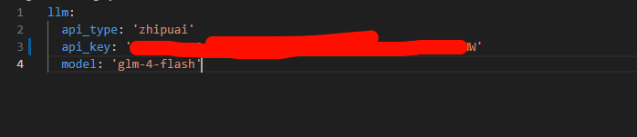

## 开始

### 去申请智谱ai的apikey然后在项目根目录创建cofig/config2.yaml文件


### 导入预设的智能体
```py
import asyncio
from metagpt.roles import (
    Architect,
    Engineer,
    ProductManager,
    ProjectManager,
)
from metagpt.team import Team
```


### 定义团队
```
async def startup(idea: str):
    company = Team()
    company.hire(
        [
            ProductManager(),
            Architect(),
            ProjectManager(),
            Engineer(),
        ]
    )
    company.invest(investment=3.0)
    company.run_project(idea=idea)

    await company.run(n_round=5)

```

### 运行
```
history = await startup(idea="write a 2048 game")  # 这是jupyter代码
```


## 介绍
### 什么是Agent？
在计算机科学和人工智能领域，**Agent**（代理）通常指的是一个能够感知环境并采取行动以实现特定目标的实体或程序。Agent可以是软件、机器人，甚至是模拟的智能体。它的核心特点包括：

1. **自主性**：Agent能够在一定程度上独立运行，不需要持续的人类干预。
2. **感知与行动**：通过传感器（或输入）感知环境，并通过执行器（或输出）采取行动。
3. **目标导向**：Agent通常被设计来完成某个任务或优化某个结果。
4. **适应性**：一些高级Agent还能学习和调整策略，以更好地应对复杂或变化的环境。

例如，在AI领域，一个聊天机器人（如我这样的Grok）可以被看作一种简单的Agent，它感知用户输入并生成回应。而在多Agent系统中，多个代理可能协作或竞争来解决问题，比如自动驾驶汽车与交通管理系统中的其他车辆交互。

### 什么是MetaGPT？
**MetaGPT** 是一个相对较新的概念，通常与人工智能和生成式模型相关联。它是由一些研究者和开发者提出的一个框架或工具，旨在利用大语言模型（如GPT架构）来模拟多Agent协作。具体来说：

1. **核心思想**：MetaGPT将复杂的任务分解为多个子任务，并模拟一群“虚拟Agent”以类似人类团队的方式协作完成。例如，一个Agent可能负责需求分析，另一个负责代码生成，还有一个负责测试。
2. **基于GPT**：它建立在像GPT这样的大型语言模型基础上，利用自然语言处理能力来生成代码、文档或其他输出。
3. **应用场景**：MetaGPT常用于自动化软件开发、项目管理或创意生成等领域。例如，你可以给它一个任务描述，它会“扮演”不同角色（如产品经理、程序员）来输出完整的解决方案。
4. **开源项目**：MetaGPT作为一个具体实现（例如GitHub上的某个项目），已经被一些开发者社区广泛讨论和使用。它强调高效性和实用性。

简单来说，MetaGPT可以看作是一个“超级Agent”，通过模拟多个Agent的协作来解决复杂问题，而不仅仅是单一功能的AI工具。

### 两者的关系
- **Agent**是基础概念，强调单个智能体的行为。
- **MetaGPT**则是更高层次的应用，利用语言模型实现多个Agent的协同工作，解决更复杂的需求。

