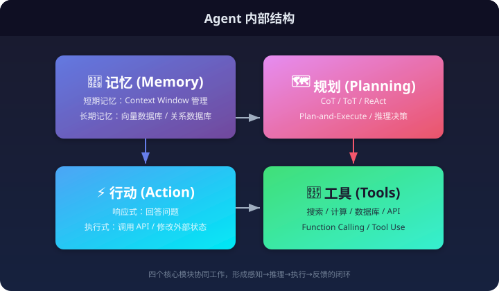
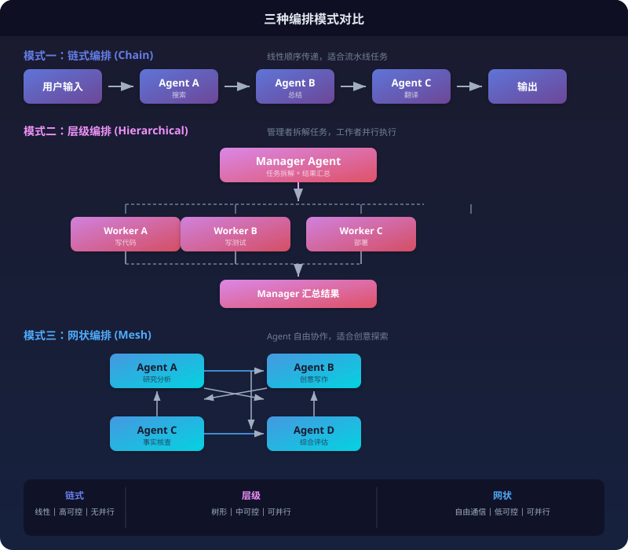
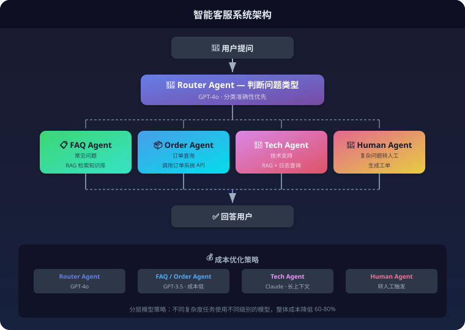
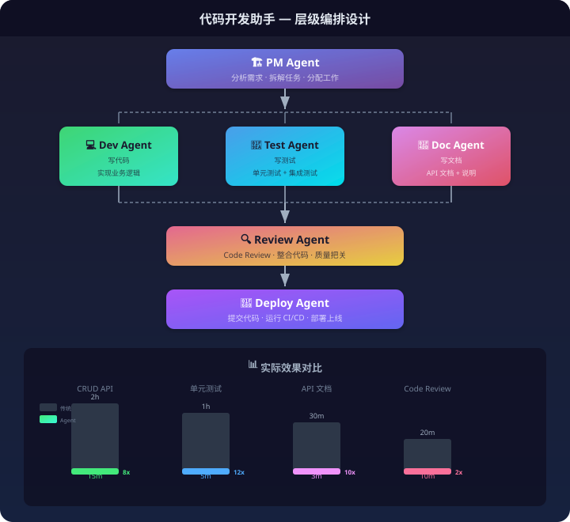
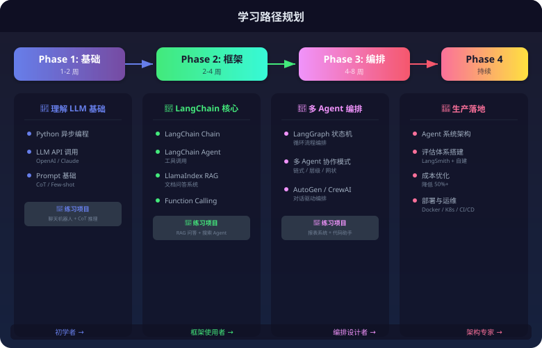
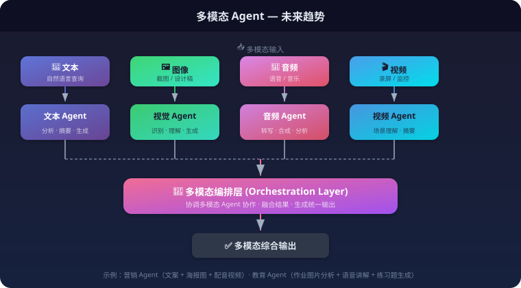

## 什么是智能体编排设计工程师？

**智能体编排设计工程师**是一个随着大模型（LLM）技术落地而新兴的热门岗位。它介于算法工程师、全栈开发工程师和产品经理之间，核心目标是**让多个 AI 智能体协同工作，解决复杂问题**。

可以把它看作是 **AI 时代的"系统架构师"**。

### 为什么这个岗位会出现？

传统软件开发中，系统架构师负责设计模块划分、接口定义、通信协议。当系统从"人写代码"变成"AI 写代码 + AI 执行任务"时，架构师的角色自然演化为：

- 不再设计模块间调用，而是设计 **Agent 间协作**
- 不再定义 API 接口，而是设计 **Prompt 接口**
- 不再关注性能瓶颈，而是关注 **Token 成本和推理延迟**

2023 年以前，做 AI 应用的人主要是"调 API"——把用户输入发给模型，拿到输出返回。但随着任务复杂度提升，单个模型无法完成长流程任务，**多 Agent 编排**成为刚需。

---

## Agent 的内部结构

理解编排之前，先要理解单个 Agent 的内部结构。一个标准 Agent 包含四个核心模块：



### 1. 记忆（Memory）

记忆是 Agent 最核心的模块之一，决定了 Agent 能否"记住"用户、保持上下文连续性、从历史中学习。记忆系统分为两大类：

| 类型 | 说明 | 实现方式 |
|------|------|----------|
| **短期记忆** | 当前对话上下文，存储在 LLM 的 Context Window 中 | 滑动窗口、摘要压缩、Token 限制截断 |
| **长期记忆** | 跨对话的知识存储，需要外部数据库 | 向量数据库（Milvus、Pinecone、ChromaDB）或 关系数据库 |

**短期记忆的核心挑战**：LLM 有 Token 限制（GPT-4 约 128K），长对话会超出限制。LangChain 提供了多种短期记忆策略：

```python
# 策略 1：滑动窗口 — 只保留最近 K 轮
from langchain.memory import ConversationBufferWindowMemory
memory = ConversationBufferWindowMemory(k=5)

# 策略 2：Token 限制截断 — 精确控制 Token 消耗
from langchain.memory import ConversationTokenBufferMemory
memory = ConversationTokenBufferMemory(llm=llm, max_token_limit=2000)

# 策略 3：摘要压缩 — 用摘要替代原始对话
from langchain.memory import ConversationSummaryMemory
memory = ConversationSummaryMemory(llm=llm)

# 策略 4：混合策略 — 摘要 + 最近完整对话
from langchain.memory import ConversationSummaryBufferMemory
memory = ConversationSummaryBufferMemory(llm=llm, max_token_limit=2000)
```

**长期记忆的实现**：

```python
# 向量数据库存储对话历史
from langchain.memory import VectorStoreRetrieverMemory
from langchain.vectorstores import ChromaDB

vectorstore = ChromaDB(embedding_function=embeddings)
memory = VectorStoreRetrieverMemory(retriever=vectorstore.as_retriever())
```

> 📖 **记忆模块的完整技术文档**（包括多级记忆架构、向量数据库选型、嵌入模型对比、遗忘机制、知识图谱增强记忆、性能优化等）请参考：[记忆模块技术文档](./记忆模块技术文档.md)

### 2. 规划（Planning）

规划是 Agent 的"大脑"，决定下一步做什么。主流方法：

| 方法 | 原理 | 适用场景 |
|------|------|----------|
| **CoT（思维链）** | 让模型逐步推理，输出中间步骤 | 数学、逻辑推理 |
| **ToT（思维树）** | 多路径探索，选择最优分支 | 复杂决策问题 |
| **ReAct** | Reasoning + Acting，推理与行动交替 | 需要调用工具的任务 |
| **Plan-and-Execute** | 先生成完整计划，再逐步执行 | 长流程任务 |

**ReAct 模式示例**：

```
用户：北京今天天气怎么样？

Agent 内部过程：
Thought: 用户想知道北京的天气，我需要调用天气 API
Action: call_weather_api(city="北京")
Observation: 北京今天晴，气温 25°C，湿度 40%
Thought: 已经获取天气信息，可以回答用户了
Answer: 北京今天晴天，气温 25 度，湿度较低，适合外出活动。
```

### 3. 工具（Tools）

工具是 Agent 的"手"，让它能执行实际操作。常见工具类型：

| 工具类型 | 示例 | 用途 |
|----------|------|------|
| **搜索类** | Google Search、Wikipedia API | 获取外部信息 |
| **计算类** | Python REPL、Calculator | 数学计算 |
| **数据类** | SQL Database、Vector Store | 查询数据 |
| **操作类** | HTTP API、文件操作 | 执行动作 |

**Function Calling 实现**：

```python
from langchain.tools import Tool

# 定义工具
search_tool = Tool(
    name="web_search",
    description="搜索互联网获取信息，输入搜索关键词",
    func=search_function
)

# Agent 使用工具
from langchain.agents import AgentExecutor

agent = AgentExecutor.from_agent_and_tools(
    agent=llm_agent,
    tools=[search_tool, calculator_tool, weather_tool]
)
```

### 4. 行动（Action）

行动是 Agent 的最终输出。两种模式：

- **响应式**：回答用户问题，不改变外部状态
- **执行式**：调用 API、写入数据库、发送邮件等，改变外部状态

---

## 多智能体编排模式

单个 Agent 能力有限，复杂任务需要多个 Agent 协作。主流编排模式：



### 模式一：链式编排（Chain）

任务按顺序传递，每个 Agent 处理一个步骤。

**适用场景**：流水线任务，如"搜索 → 总结 → 翻译"

**LangGraph 实现**：

```python
from langgraph.graph import StateGraph

# 定义状态
class ChainState(TypedDict):
    input: str
    search_result: str
    summary: str
    translation: str

# 构建 DAG
graph = StateGraph(ChainState)
graph.add_node("search", search_agent)
graph.add_node("summarize", summarize_agent)
graph.add_node("translate", translate_agent)

graph.add_edge("search", "summarize")
graph.add_edge("summarize", "translate")
graph.set_finish_point("translate")
```

**缺点**：无法并行，延迟累加。

### 模式二：层级编排（Hierarchical）

一个"管理者 Agent"拆解任务，分配给"工作者 Agent"，汇总结果。

**适用场景**：复杂项目，如"写代码 + 测试 + 部署"全流程

**AutoGen 实现**：

```python
from autogen import AssistantAgent, UserProxyAgent

# 管理者
manager = AssistantAgent(
    name="Manager",
    system_message="你是项目经理，负责拆解任务并分配给合适的工程师"
)

# 工作者
coder = AssistantAgent(name="Coder", system_message="你负责写代码")
tester = AssistantAgent(name="Tester", system_message="你负责测试")
deployer = AssistantAgent(name="Deployer", system_message="你负责部署")

# 组建团队
groupchat = GroupChat(
    agents=[manager, coder, tester, deployer],
    messages=[]
)
```

**优点**：并行执行，效率高；职责清晰，便于调试。

### 模式三：网状编排（Mesh）

所有 Agent 地位平等，可以自由通信。适合创意性、探索性任务。

**适用场景**： brainstorming、创意写作、复杂问题讨论

**缺点**：通信复杂，难以预测结果，调试困难。

### 三种模式对比

| 模式 | 结构 | 并行能力 | 可控性 | 适用场景 |
|------|------|----------|--------|----------|
| **链式** | 线性 | ❌ 无 | ⭐⭐⭐ 高 | 流水线任务 |
| **层级** | 树形 | ✅ 有 | ⭐⭐ 中 | 项目管理 |
| **网状** | 图形 | ✅ 有 | ⭐ 低 | 创意探索 |

---

## 企业级落地案例

### 案例 1：智能客服系统

**需求**：处理用户咨询，复杂问题转人工

**Agent 设计**：



**关键技术点**：

- Router Agent：分类模型（GPT-4 或微调小模型）
- FAQ Agent：RAG 检索知识库
- Order Agent：调用订单系统 API
- Tech Agent：RAG + 工具调用（日志查询、配置修改）
- Human Agent：判断是否需要转人工，生成工单

**成本优化**：

| 模型选择 | 适用 Agent | 原因 |
|----------|------------|------|
| GPT-4o | Router Agent | 分类准确性最重要 |
| GPT-3.5 | FAQ Agent | 简单问答，成本低 |
| Claude | Tech Agent | 长上下文，技术文档理解强 |

### 案例 2：自动化报表生成

**需求**：每周自动生成销售报表，包含数据查询、图表生成、文字总结

**Agent 设计**：

```python
# 链式编排
workflow = [
    ("sql_agent", "查询数据库获取销售数据"),
    ("analysis_agent", "分析数据趋势"),
    ("chart_agent", "生成可视化图表"),
    ("writer_agent", "撰写报表文字说明")
]
```

**实际代码**：

```python
from langgraph.graph import StateGraph

class ReportState(TypedDict):
    raw_data: list      # SQL 查询结果
    analysis: dict      # 分析结论
    charts: list        # 图表文件路径
    report: str         # 最终报表文本

graph = StateGraph(ReportState)

# SQL Agent
def sql_agent(state):
    query = "SELECT date, revenue FROM sales WHERE date >= '2024-01-01'"
    data = db.execute(query)
    return {"raw_data": data}

# Analysis Agent
def analysis_agent(state):
    data = state["raw_data"]
    # 计算增长率、异常点等
    analysis = analyze_sales_data(data)
    return {"analysis": analysis}

# Chart Agent
def chart_agent(state):
    charts = generate_charts(state["raw_data"])
    return {"charts": charts}

# Writer Agent
def writer_agent(state):
    report = write_report(state["analysis"], state["charts"])
    return {"report": report}

# 构建流程
graph.add_node("sql", sql_agent)
graph.add_node("analysis", analysis_agent)
graph.add_node("chart", chart_agent)
graph.add_node("writer", writer_agent)

graph.add_edge("sql", "analysis")
graph.add_edge("analysis", "chart")
graph.add_edge("chart", "writer")
```

### 案例 3：代码开发助手

**需求**：从需求描述到代码提交的完整流程

**层级编排设计**：



**实际效果对比**：

| 任务 | 传统开发 | Agent 辅助 | 提升 |
|------|----------|------------|------|
| 写 CRUD API | 2 小时 | 15 分钟 | 8x |
| 写单元测试 | 1 小时 | 5 分钟 | 12x |
| 写 API 文档 | 30 分钟 | 3 分钟 | 10x |
| Code Review | 20 分钟 | 10 分钟 | 2x |

---

## 核心技术栈详解

### LangChain：最全生态的 LLM 框架

**核心模块**：

```
LangChain
├── langchain-core      # 核心抽象（Chain、Agent、Tool）
├── langchain-community # 社区集成（各种 API、数据库）
├── langchain-openai    # OpenAI 专用集成
├── langchain-anthropic # Anthropic 专用集成
└── langgraph           # 状态机编排（独立包）
```

**必学概念**：

| 概念 | 说明 | 学习优先级 |
|------|------|------------|
| **Chain** | 顺序执行的调用链 | ⭐⭐⭐ |
| **Agent** | 自主决策的执行单元 | ⭐⭐⭐ |
| **Tool** | Agent 可调用的工具 | ⭐⭐⭐ |
| **Memory** | 对话历史管理 | ⭐⭐ |
| **Retriever** | RAG 检索器 | ⭐⭐⭐ |
| **Callback** | 执行过程监听 | ⭐ |

**学习资源**：

- 官方文档：https://python.langchain.com/
- LangChain v0.3 API 文档（本项目已收录）：[langchain_v0.3_API](../LangChain/langchain_v0.3_API/)
- LangSmith 使用教程：[LangSmith使用教程](../LangChain/LangSmith使用教程/)

### LangGraph：状态机编排

LangGraph 是 LangChain 团队推出的**循环图编排框架**，核心概念：

```python
from langgraph.graph import StateGraph, END

# 定义状态（在节点间传递的数据）
class AgentState(TypedDict):
    messages: list
    next_action: str

# 定义节点（Agent 或函数）
def agent_node(state):
    response = llm.invoke(state["messages"])
    return {"messages": state["messages"] + [response]}

def tool_node(state):
    tool_result = execute_tool(state["messages"][-1])
    return {"messages": state["messages"] + [tool_result]}

# 构建图
graph = StateGraph(AgentState)
graph.add_node("agent", agent_node)
graph.add_node("tool", tool_node)

# 定义边（条件分支）
def should_continue(state):
    if state["messages"][-1].tool_calls:
        return "tool"
    return END

graph.add_conditional_edges("agent", should_continue)
graph.add_edge("tool", "agent")

# 运行
app = graph.compile()
result = app.invoke({"messages": ["帮我查北京天气"]})
```

**与 LangChain Chain 的区别**：

| 特性 | Chain | LangGraph |
|------|-------|-----------|
| 结构 | 线性 | 循环图 |
| 状态管理 | 无 | 有（TypedDict） |
| 条件分支 | ❌ | ✅ |
| 持久化 | ❌ | ✅（可中断恢复） |
| 适用场景 | 简单流程 | 复杂流程、对话循环 |

**学习资源**：

- 官方文档：https://langchain-ai.github.io/langgraph/
- LangGraph 使用教程（本项目已收录）：[Langgraph使用教程](../LangChain/Langgraph使用教程/)

### AutoGen：微软多智能体框架

**核心特点**：

- Agent 之间通过**对话**协作
- 支持**人类介入**（Human-in-the-loop）
- 内置**代码执行沙箱**

**快速示例**：

```python
import autogen

# 配置 LLM
config_list = [{"model": "gpt-4", "api_key": "your-key"}]

# 创建 Agent
assistant = autogen.AssistantAgent(
    name="Assistant",
    llm_config={"config_list": config_list}
)

user_proxy = autogen.UserProxyAgent(
    name="User",
    human_input_mode="TERMINATE",  # 人类只在结束时介入
    code_execution_config={"work_dir": "coding"}
)

# 开始对话
user_proxy.initiate_chat(
    assistant,
    message="写一个 Python 函数计算斐波那契数列"
)
```

**与 LangGraph 对比**：

| 特性 | AutoGen | LangGraph |
|------|---------|-----------|
| 编排方式 | 对话驱动 | 状态机驱动 |
| 控制流 | 隐式（Agent 自主决定） | 显式（开发者定义图） |
| 可控性 | ⭐ 低 | ⭐⭐⭐ 高 |
| 灵活性 | ⭐⭐⭐ 高 | ⭐⭐ 中 |
| 适用场景 | 创意、探索性任务 | 流程化、工程化任务 |

---

## 提示词工程核心技巧

提示词是 Agent 的"编程语言"，掌握核心技巧至关重要。

### 1. CoT（思维链）

让模型**逐步推理**，输出中间步骤。

**普通提示词**：
```
问：小明有 5 个苹果，给了小红 2 个，又买了 3 个，现在有多少个？
答：6 个
```

**CoT 提示词**：
```
问：小明有 5 个苹果，给了小红 2 个，又买了 3 个，现在有多少个？
请逐步思考：
1. 初始有多少？
2. 给出去多少？
3. 又买了多少？
4. 最终有多少？

答：
1. 初始有 5 个苹果
2. 给小红 2 个，剩下 5-2=3 个
3. 又买了 3 个，现在有 3+3=6 个
4. 最终有 6 个苹果
```

**效果**：复杂问题上准确率提升 30-50%。

### 2. Few-shot Prompting

给模型**几个示例**，让它学习模式。

```python
prompt = """
任务：将句子翻译成 SQL

示例：
句子：查询所有年龄大于 20 的用户
SQL：SELECT * FROM users WHERE age > 20

句子：查询订单金额超过 1000 的订单
SQL：SELECT * FROM orders WHERE amount > 1000

现在请翻译：
句子：查询最近一周登录过的用户
SQL：
"""
```

### 3. Structured Output

让模型输出**结构化数据**（JSON），便于程序解析。

```python
from langchain.output_parsers import PydanticOutputParser
from pydantic import BaseModel

class AnalysisResult(BaseModel):
    sentiment: str      # positive/negative/neutral
    topics: list[str]   # 主题列表
    summary: str        # 总结

parser = PydanticOutputParser(pydantic_object=AnalysisResult)

prompt = f"""
分析以下文本的情感和主题：
{text}

{parser.get_format_instructions()}
"""
```

### 4. ReAct 模板

结合推理和行动的标准模板：

```python
react_prompt = """
你是一个智能助手，可以使用工具完成任务。

可用工具：
- search: 搜索互联网
- calculator: 数学计算
- weather: 查询天气

思考过程格式：
Thought: 思考下一步做什么
Action: 调用什么工具（tool_name）
Action Input: 工具输入参数
Observation: 工具返回结果
...（重复直到完成任务）
Answer: 最终答案

开始！
用户问题：{question}
"""
```

---

## 评估与优化

### 评估指标

| 指标 | 说明 | 计算方式 |
|------|------|----------|
| **任务完成率** | Agent 是否成功完成任务 | 人工标注 或 规则判断 |
| **响应准确率** | 输出内容是否正确 | 人工评估 或 LLM-as-Judge |
| **Token 成本** | 每次调用的 Token 消耗 | 直接从 API 返回获取 |
| **延迟** | 从输入到输出的时间 | 计时统计 |
| **工具调用成功率** | Agent 调用工具是否正确 | 检查工具返回 |

### LangSmith：调试与监控平台

LangSmith 是 LangChain 官方的调试平台：

```python
import os
os.environ["LANGCHAIN_API_KEY"] = "your-key"
os.environ["LANGCHAIN_TRACING_V2"] = "true"

# 所有 LangChain 调用都会记录到 LangSmith
from langchain.agents import AgentExecutor

agent = AgentExecutor.from_agent_and_tools(...)
result = agent.invoke({"input": "hello"})
# 在 LangSmith 网站查看完整调用链、Token 消耗、耗时等
```

### 成本优化策略

| 策略 | 说明 | 效果 |
|------|------|------|
| **分层模型** | 分类用小模型，复杂任务用大模型 | 成本降低 60-80% |
| **Prompt 精简** | 去除冗余描述，压缩 Token | 成本降低 20-30% |
| **缓存** | 相似问题复用答案 | 成本降低 40-50% |
| **并行调用** | 多 Agent 同时执行 | 延迟降低 50-70% |

---

## 学习路径详细规划



### 第一阶段：基础（1-2 周）

**目标**：理解 LLM 基础，掌握 API 调用

| 内容 | 学习资源 | 验收标准 |
|------|----------|----------|
| Python 异步编程 | 官方文档、asyncio 教程 | 能写异步 API 服务 |
| LLM API 调用 | OpenAI 文档、Claude 文档 | 能调用并处理返回 |
| Prompt 基础 | Learn Prompting 网站 | 能写 CoT、Few-shot |

**练习项目**：
- 写一个聊天机器人（调用 OpenAI API）
- 实现简单的 CoT 推理（数学问题）

### 第二阶段：框架（2-4 周）

**目标**：掌握 LangChain 核心用法

| 内容 | 学习资源 | 验收标准 |
|------|----------|----------|
| LangChain Chain | 官方文档 + 本项目教程 | 能构建顺序调用链 |
| LangChain Agent | 官方文档 + 本项目教程 | 能让 Agent 使用工具 |
| LlamaIndex RAG | 官方文档 + 本项目 RAG 系列 | 能构建文档问答系统 |
| Function Calling | OpenAI 文档 | 能定义和使用工具 |

**练习项目**：
- 构建一个文档问答系统（RAG）
- 构建一个能搜索互联网的 Agent

### 第三阶段：编排（4-8 周）

**目标**：掌握多 Agent 编排

| 内容 | 学习资源 | 验收标准 |
|------|----------|----------|
| LangGraph 状态机 | 官方文档 + 本项目教程 | 能构建循环流程 |
| 多 Agent 协作模式 | AutoGen/CrewAI 文档 | 能设计协作架构 |
| AutoGen 实践 | 微软官方教程 | 能构建对话式多 Agent |

**练习项目**：
- 构建一个自动化报表生成系统（链式编排）
- 构建一个代码开发助手（层级编排）

### 第四阶段：工程化（持续）

**目标**：生产环境落地能力

| 内容 | 学习资源 | 验收标准 |
|------|----------|----------|
| Agent 系统架构 | 架构设计书籍 + 实战经验 | 能设计高可用系统 |
| 评估体系搭建 | LangSmith + 自建评估 | 能监控 Agent 性能 |
| 成本优化 | 实战经验积累 | 能降低 50%+ 成本 |
| 部署与运维 | Docker/K8s + CI/CD | 能部署到生产环境 |

---

## 发展趋势与前景

### 从"对话"走向"行动"

2023 年的 Agent 主要做"问答"。2024-2025 年的 Agent 开始**执行操作**：

| 能力 | 2023 年 | 2025 年 |
|------|---------|---------|
| 回答问题 | ✅ | ✅ |
| 搜索信息 | ✅ | ✅ |
| 写代码 | ⭐ 需人工复制 | ✅ 自动执行 |
| 调用 API | ❌ | ✅ |
| 修改文件 | ❌ | ✅ |
| 发送邮件 | ❌ | ✅ |

**典型案例**：
- **Devin**：AI 软件工程师，能独立完成开发任务
- **Claude Code**：能直接在终端执行开发任务
- **GPT-4o + Actions**：能直接调用外部服务

### 低代码化趋势

编排工具正在从"写代码"向"画流程图"转变：

| 工具 | 编排方式 | 技能要求 |
|------|----------|----------|
| LangGraph | 写 Python 代码 | ⭐⭐⭐ 高 |
| Flowise | 拖拽可视化 | ⭐ 低 |
| Dify | 拖拽 + 配置 | ⭐ 低 |
| LangFlow | 拖拽可视化 | ⭐ 低 |

**对工程师的影响**：
- 简单编排将被低代码平台取代
- 高阶工程师需深入：算法优化、模型微调、复杂架构设计

### 企业级落地爆发

2024-2025 年是 Agent 落地元年。行业需求：

| 行业 | Agent 应用 | 人才需求 |
|------|------------|----------|
| 金融 | 自动化投研、风控分析 | ⭐⭐⭐ 高 |
| 医疗 | 病历分析、诊断辅助 | ⭐⭐⭐ 高 |
| 法律 | 合同审查、案例分析 | ⭐⭐ 中 |
| 客服 | 智能客服、工单处理 | ⭐⭐⭐ 高 |
| 制造 | 生产调度、质量控制 | ⭐⭐ 中 |

**薪资水平**（2024 年中国市场参考）：

| 级别 | 经验 | 薪资范围 |
|------|------|----------|
| 初级 | 0-2 年 | 15-25k/月 |
| 中级 | 2-4 年 | 25-40k/月 |
| 高级 | 4-6 年 | 40-60k/月 |
| 专家 | 6+ 年 | 60-100k/月 |

### 多模态编排

未来 Agent 需要处理多种模态：



**示例场景**：
- 营销 Agent：写文案 → 生成海报图 → 合成配音视频
- 教育 Agent：分析学生作业图片 → 语音讲解 → 生成练习题

---

## 核心竞争力总结

> **不在于你会调某个 API，而在于你能否设计出一套机制，让不完美的模型通过工具和协作，输出稳定、可靠的结果。**

核心能力拆解：

| 能力 | 说明 | 如何培养 |
|------|------|----------|
| **架构设计** | 设计 Agent 结构和协作模式 | 实战项目 + 参考优秀案例 |
| **Prompt 工程** | 精准控制模型行为 | 大量练习 + 持续迭代 |
| **成本优化** | 在效果和成本间找到平衡 | 实战数据 + 对比实验 |
| **评估能力** | 判断 Agent 是否达到目标 | 建立评估体系 + 数据驱动 |
| **业务理解** | 把业务问题转化为 Agent 流程 | 深入业务 + 持续沟通 |

---

## 适合人群

- **有后端开发背景**，对 AI 算法感兴趣的工程师
- **善于逻辑拆解**，懂技术的产品型工程师
- **希望从传统开发转型 AI 应用落地**的开发者
- **有数据/算法背景**，想往工程化方向发展的人

---

## 常见问题

### Q1：需要学机器学习/深度学习吗？

**不需要深入**。这个岗位侧重**应用落地**，不是模型研发。但需要理解：
- LLM 的基本原理（Token、Context Window、Temperature）
- 模型的能力边界（幻觉、遗忘、推理能力）
- 如何评估模型效果

### Q2：Python 不熟怎么办？

**必须补**。LangChain、LangGraph、AutoGen 都是 Python 框架。建议：
- 先学基础语法（1 周）
- 重点学异步编程、API 开发（FastAPI）
- 边做项目边学，不要光学不练

### Q3：如何选择 LangGraph vs AutoGen？

| 你的情况 | 推荐 |
|----------|------|
| 需要可控流程、工程化项目 | LangGraph |
| 需要灵活对话、创意任务 | AutoGen |
| 初学者 | LangGraph（文档更清晰） |

### Q4：Agent 和传统自动化有什么区别？

| 特性 | 传统自动化 | Agent |
|------|------------|-------|
| 规则 | 人工硬编码 | 模型自主决策 |
| 灵活性 | ❌ 低 | ✅ 高 |
| 错误处理 | 需人工编码 | 模型可自主处理 |
| 适用场景 | 固定流程 | 不确定任务 |

---

## 参考资料

### 官方文档

- [LangChain 官方文档](https://python.langchain.com/)
- [LangGraph 官方文档](https://langchain-ai.github.io/langgraph/)
- [AutoGen - 微软多智能体框架](https://microsoft.github.io/autogen/)
- [LlamaIndex 官方文档](https://docs.llamaindex.ai/)
- [CrewAI 官方文档](https://docs.crewai.com/)

### 本项目相关文章

- [LangChain 系列教程](../LangChain/)
- [RAG 系列教程](../RAG/)
- [LangGraph 使用教程](../LangChain/Langgraph使用教程/)
- [LangSmith 使用教程](../LangChain/LangSmith使用教程/)

### 学习网站

- [Learn Prompting](https://learnprompting.org/) - Prompt 工程教程
- [DeepLearning.AI](https://www.deeplearning.ai/) - Andrew Ng 的 AI 课程
- [HuggingFace Course](https://huggingface.co/learn) - NLP 和 Transformers 课程

### 社区与资讯

- [LangChain Discord](https://discord.gg/langchain)
- [AI 相关 Arxiv 论文](https://arxiv.org/list/cs.AI/recent)
- [Hacker News AI 板块](https://news.ycombinator.com/)