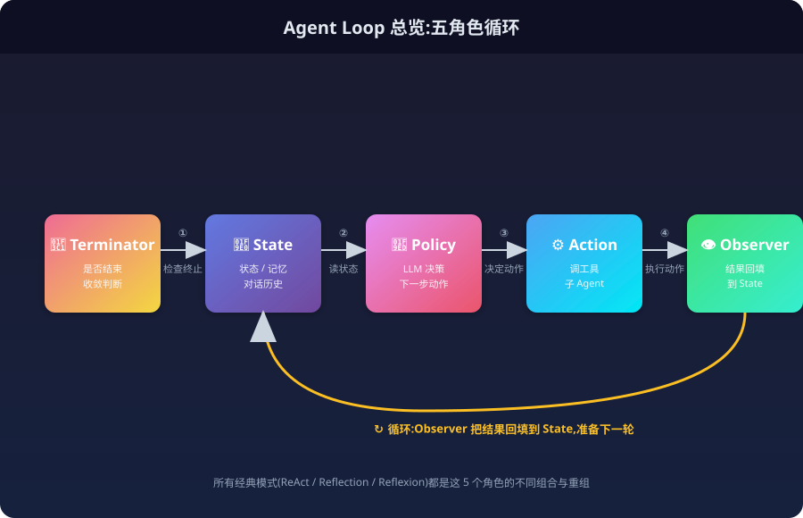
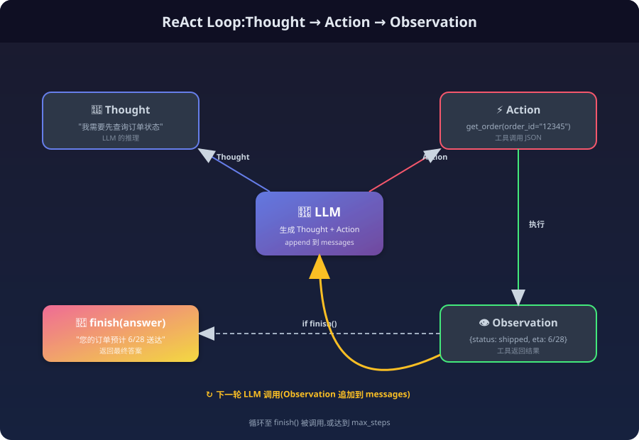
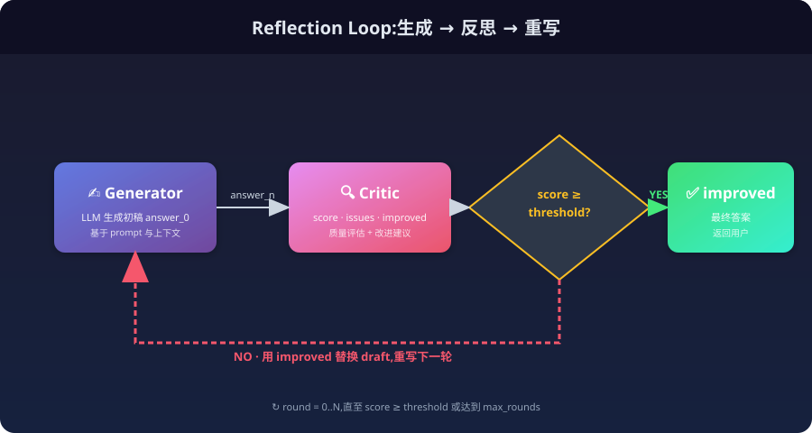
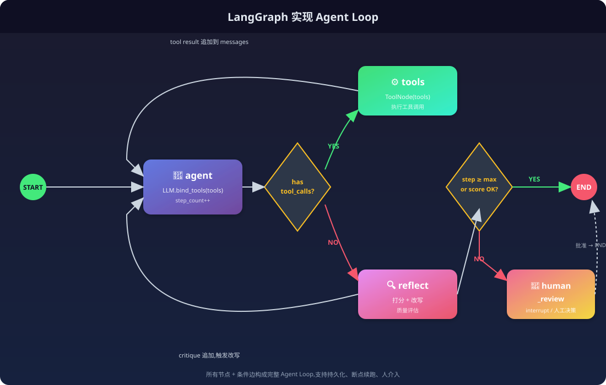

> 一句话概括 Agent 工程的核心:**把 LLM 放进一个可控的循环里,让它在"思考—行动—观察—反思"之间反复迭代,直到任务收敛。** 这个"循环"——也就是 Agent Loop——就是本文的主角。

---

## 0. 为什么是 "Loop"?

如果你把 LLM 当成"一个函数 `f(prompt) -> response`",那你写出的就是 prompt 工程;但如果你把 LLM 当成"一个可以被调用的决策者",你就会发现:**几乎所有复杂的 Agent 行为,本质上都是一个循环**。

| 场景 | 单次调用能做到吗? | 为什么需要 Loop? |
|------|------------------|----------------|
| 让模型查今天北京天气 | ✅ | 一次生成即可 |
| 让模型读完 50 页 PDF 后回答 | ❌ | 需要循环:分块 → 读取 → 累计 → 汇总 |
| 让模型调用 5 个 API 完成订单 | ❌ | 需要循环:规划 → 调 API → 处理异常 → 重试 |
| 让模型写出能跑通的代码 | ❌ | 需要循环:写代码 → 执行 → 报错 → 修正 |
| 让模型通过多轮对话解决开放问题 | ❌ | 需要循环:追问 → 反思 → 补充 → 收敛 |

**Loop 是 Agent 与"普通 LLM 应用"的分水岭**。没有循环的 LLM 只是个文本生成器;有了循环,它才有机会成为"会思考、会试错、会自我修正"的智能体。



---

## 1. Agent Loop 的解剖

无论你用 ReAct、Reflection 还是 LangGraph,一个标准的 Agent Loop 都由 5 个固定角色组成:

| 角色 | 作用 | 工程实现 |
|------|------|---------|
| **State(状态)** | 当前任务的所有上下文:目标、历史、记忆、工具结果 | 一个 `TypedDict` / Pydantic 模型 |
| **Policy(策略)** | 决定下一步该做什么 | 通常是一次 LLM 调用 + 结构化输出 |
| **Action(动作)** | 执行策略选定的动作 | 工具调用 / 子 Agent 调用 / 写文件 |
| **Observer(观察)** | 把动作结果回填到状态 | `tool_result` 追加到 messages |
| **Terminator(终止器)** | 判断循环是否该结束 | 显式 finish / 步数上限 / 置信度阈值 |

把这 5 个角色串起来,就是最经典的循环骨架:

```python
state = init_state(user_goal)
for step in range(max_steps):
    decision = policy(state)        # LLM 决定下一步
    if terminator(decision):         # 是否结束?
        return final_answer(decision)
    observation = action(decision)   # 调工具 / 子 Agent
    state = update(state, observation)  # 更新状态
return forced_finish(state)          # 兜底:步数耗尽
```

后续所有"花式"Loop(ReAct、Reflection、Reflexion、Plan-and-Execute)都只是**对这 5 个角色的不同实现与重组**。

---

## 2. 经典 Loop 模式

### 2.1 ReAct:Reason + Act(推理与行动交替)

**ReAct**(Yao et al., 2022)是最广为人知的 Agent Loop 范式,它强制让 LLM 在每一步都按 "Thought → Action → Observation" 的格式输出:

```
Thought 1: 我需要先查一下用户的订单状态
Action 1:  get_order(order_id="12345")
Observation 1: {"status": "shipped", "tracking": "SF123..."}

Thought 2: 订单已发货,接下来需要根据物流信息估算送达时间
Action 2:  get_eta(tracking="SF123...")
Observation 2: {"eta": "2026-06-28"}

Thought 3: 信息齐全,可以回答用户了
Action 3:  finish(answer="您的订单预计 6 月 28 日送达")
```

**Loop 视角的关键点**:ReAct 的循环不是"调 LLM 一次",而是**"调 LLM → 解析动作 → 执行 → 把结果塞回 prompt → 再调 LLM"**。LLM 本身是无状态的,Loop 才是它"持续思考"的载体。



**最小可运行的 ReAct Loop**:

```python
import json, re
from openai import OpenAI

client = OpenAI()
TOOLS = {
    "get_weather": lambda city: f"{city} 今天晴, 25°C",
    "get_time":   lambda _: "现在是 2026-06-26 15:00",
}

SYSTEM = """你是一个 Agent。每轮必须严格输出:
Thought: <你的推理>
Action: <JSON,形如 {"name": "工具名", "args": {...}} 或 {"name": "finish", "args": {"answer": "..."}}>
"""

def react_loop(user_goal, max_steps=8):
    messages = [
        {"role": "system", "content": SYSTEM},
        {"role": "user",   "content": user_goal},
    ]
    for step in range(max_steps):
        resp = client.chat.completions.create(
            model="gpt-4o-mini", messages=messages
        )
        text = resp.choices[0].message.content
        messages.append({"role": "assistant", "content": text})

        # 解析 Action
        m = re.search(r"Action:\s*(\{.*\})", text, re.S)
        if not m:
            raise ValueError(f"step {step}: 模型未输出 Action")
        action = json.loads(m.group(1))

        if action["name"] == "finish":
            return action["args"]["answer"], messages

        # 执行工具 → Observation
        obs = TOOLS[action["name"]](**action["args"])
        messages.append({"role": "user", "content": f"Observation: {obs}"})

    raise TimeoutError("超过最大步数,未收敛")
```

### 2.2 Reflection:让模型对自己的输出打分并改写

**Reflection**(Shinn et al., 2023)把 Loop 从"短反馈"升级成"长反馈":

```
[生成阶段]  LLM 生成初稿 answer_0
[反思阶段]  LLM(可以是同一个,也可以是更强的 critic)输出:
            - score: 0~10
            - critique: 具体问题清单
            - improved_answer: 改进版
[循环 N 次] 或 直至 score >= threshold
```

**Loop 的关键差异**:ReAct 的循环驱动来自"环境反馈"(工具返回),Reflection 的循环驱动来自"自我反馈"(LLM 评价自己)。

```python
def reflection_loop(draft_prompt, max_rounds=3, threshold=8):
    draft = llm(draft_prompt)
    history = []
    for r in range(max_rounds):
        critique = critic_llm(f"""
            请评估以下回答,输出 JSON:
            {{"score": 0-10, "issues": [...], "improved": "..."}}
            原题: {draft_prompt}
            当前回答: {draft}
        """)
        score, improved = parse(critique)["score"], parse(critique)["improved"]
        history.append({"round": r, "score": score})
        if score >= threshold:
            return improved, history
        draft = improved
    return draft, history  # 兜底:返回最后一轮
```



### 2.3 Reflexion:把反思结果"沉淀"到长期记忆

Reflexion 是 Reflection 的进化:它不只是"当场改",还会把反思结果**写入长期记忆**,让下次遇到类似问题时少走弯路:

```
Trajectory  → Reflector  → Self-Critique
                                    ↓
                          Memory Store (vector db)
                                    ↓
            下次同类任务 ← 检索相关反思 ←┘
```

工程上常见的实现:用一个独立的 `MemoryStore` 对象,每次反射后写入 `{situation, lesson, score_delta}`,在新任务的 system prompt 里通过 RAG 检索 top-k 相关反思塞进去。

### 2.4 Plan-and-Execute:先想清楚,再动手

Plan-and-Execute 把 Loop 拆成**两个嵌套循环**:

```
外层 Planner Loop:   任务 → 计划(步骤列表)
内层 Executor Loop:  对计划中每个 step 反复 ReAct,直至完成
外层 Replanner:      若某个 step 失败,回到 Planner 重新规划
```

适合**长流程、阶段性强**的任务(比如"调研 → 写作 → 校对 → 发布"),能让 Plan 阶段用更强的模型(慢但准),Execute 阶段用更便宜的模型(快且糙)。

### 2.5 CAMEL:多智能体角色扮演循环

**CAMEL**(Communicative Agents for "Mind" Exploration of LLMs)用两个 Agent(User Proxy + Assistant)在 Loop 中互相对话,中间插入"Inception Prompt"防止角色漂移:

```
User Proxy  ──►  Assistant  ──►  User Proxy  ──►  Assistant ...
   ↑                                                    │
   └──────────── Critic/Inception Prompt ←──────────────┘
```

适合**对话式博弈、谈判模拟、教学场景**等"两个角色反复讨论"的场景。

---

## 3. Loop 的 4 大工程问题

把 Loop 从论文搬到生产,真正难的是下面 4 个问题。

### 3.1 状态管理:Loop 的"内存"

**State 是 Loop 工程的命门**。常见的 State 设计:

```python
from typing import TypedDict, Annotated, List
from langgraph.graph.message import add_messages

class AgentState(TypedDict):
    # 对话历史(自带 reducer,自动追加)
    messages: Annotated[List[dict], add_messages]
    # 当前计划(Plan-and-Execute 用)
    plan: List[str]
    # 已执行的步骤与结果
    past_steps: List[tuple[str, str]]
    # 反思/记忆
    reflections: List[str]
    # 控制字段
    step_count: int
    is_finished: bool
```

**设计原则**:
- **State 必须可序列化**:能 `pickle` / 写 Redis,这是断点续跑、调试回放的前提。
- **State 必须有 schema**:用 TypedDict 或 Pydantic,避免字段拼写错误。
- **State 的写入要走 reducer**:特别是 `messages`,不能简单覆盖,而要 append,否则 Loop 会"失忆"。

### 3.2 终止条件:Loop 不能"停不下来"

没有终止条件的 Loop 就是个无底洞。**生产中至少要有 3 重保险**:

```python
def should_continue(state) -> Literal["continue", "end"]:
    # 1. 显式 finish(由 LLM 主动调用 finish 工具)
    if state["is_finished"]:
        return "end"
    # 2. 步数硬上限(防止 token 爆炸)
    if state["step_count"] >= 20:
        return "end"
    # 3. 步数软上限 + 强制收敛(兜底,走 LLM 总结)
    if state["step_count"] >= 15:
        return "force_summarize"
    # 4. 重复检测(防止模型在两个动作间反复横跳)
    if state["messages"][-1].content == state["messages"][-3].content:
        return "end"
    return "continue"
```

**真实生产事故**经常源于:忘了设上限,或者上限设了但没接 billing 报警,一夜烧掉几千美元 Token。

### 3.3 记忆机制:Loop 跨轮次"活下来"

Loop 内部的 state 是**短期记忆**,跨会话需要**长期记忆**:

| 类型 | 存储 | 写入时机 | 检索时机 |
|------|------|---------|---------|
| 短期(Scratchpad) | In-memory state | 每一步 | 每一步 |
| 程序性(Procedural) | 系统 prompt | 启动时 | 启动时 |
| 语义性(Semantic) | Vector DB | 反思后/总结后 | 新任务开始 |
| 情节性(Episodic) | 时序 DB | 任务结束时 | 反思阶段 |

```python
class LongTermMemory:
    def __init__(self, vector_store, embedder):
        self.vs, self.emb = vector_store, embedder

    def write(self, situation: str, lesson: str):
        self.vs.add(
            text=f"情境: {situation}\n教训: {lesson}",
            embedding=self.emb.embed(situation),
        )

    def recall(self, current_situation: str, k=3):
        q = self.emb.embed(current_situation)
        return self.vs.search(q, top_k=k)
```

### 3.4 工具调用:Loop 与现实世界的接口

Loop 里 80% 的 Action 都是"调工具"。工具设计要点:

1. **工具描述即 Prompt**——LLM 选错工具,90% 是工具描述写得烂。
2. **工具要返回结构化数据**(JSON)而非自然语言,便于程序解析。
3. **工具有超时和重试**,避免一个慢工具把整个 Loop 拖死。
4. **危险操作(写库、发邮件、删文件)走二次确认分支**,而不是直接执行。

```python
@tool
def send_email(to: str, subject: str, body: str) -> str:
    """发送邮件(危险操作,需要 confirm=true 才真正发送)。"""
    if not confirm:
        return f"[DRY-RUN] 将发送邮件给 {to},主题: {subject}"
    return _smtp_send(to, subject, body)
```

---

## 4. 用 LangGraph 把 Loop 工程化

手写 ReAct Loop 在 demo 阶段可以,但生产中你需要:可视化、断点续跑、人介入、可观测——这些 LangGraph 已经帮你做好。

### 4.1 最小的 LangGraph Agent Loop

```python
from typing import Literal, Annotated, List
from typing_extensions import TypedDict
from langgraph.graph import StateGraph, START, END
from langgraph.graph.message import add_messages
from langchain_openai import ChatOpenAI
from langchain_core.tools import tool
from langgraph.prebuilt import ToolNode

@tool
def search(query: str) -> str:
    """模拟搜索工具。"""
    return f"关于 '{query}' 的搜索结果: ..."

tools = [search]
llm = ChatOpenAI(model="gpt-4o-mini").bind_tools(tools)

class State(TypedDict):
    messages: Annotated[List, add_messages]
    step_count: int

def agent(state: State):
    return {
        "messages": [llm.invoke(state["messages"])],
        "step_count": state.get("step_count", 0) + 1,
    }

def should_continue(state: State) -> Literal["tools", END]:
    last = state["messages"][-1]
    if last.tool_calls:
        return "tools"
    return END

graph = (
    StateGraph(State)
    .add_node("agent", agent)
    .add_node("tools", ToolNode(tools))
    .add_edge(START, "agent")
    .add_conditional_edges("agent", should_continue)
    .add_edge("tools", "agent")
    .compile()
)

for chunk in graph.stream({"messages": [("user", "查一下 LangGraph 最新版本")]}):
    print(chunk)
```

### 4.2 加 Reflection 节点

在上面的图里多加一个 `reflect` 节点和一条边:

```python
def reflect(state: State):
    last_answer = state["messages"][-1].content
    critique = llm.invoke([
        {"role": "system", "content": "你是质检员,打分 0-10,并指出问题。"},
        {"role": "user",   "content": f"评价: {last_answer}"},
    ])
    score = parse_score(critique.content)
    if score >= 8 or state["step_count"] >= 10:
        return END
    return "agent"  # 不满意,把 critique 塞回 messages 让 agent 重写
```

完整图就是:**agent → tools → agent → ... → reflect → (END | agent)**。



### 4.3 加人介入(Human-in-the-Loop)

生产中,任何高风险分支都该有"暂停等人确认"的节点:

```python
graph.add_node("human_review", lambda s: s)  # 实际是中断点
graph.add_edge("agent", "human_review",
               condition=lambda s: "send_email" in str(s["messages"][-1]))
```

部署时打开 `interrupt_before=["human_review"]`,LangGraph 会在该节点暂停,把当前 state 持久化,等人通过 API 决策后再 resume。

### 4.4 测试:比"人介入"更重要的一环

人介入(Human-in-the-Loop)常被当作安全兜底,但它不是目的,而是**过渡手段**。真正能让 Agent Loop 规模化运转的,是**把"人测"变成"自动测"**。

如果测试做得好,Loop 在每一轮迭代后都能自动验证中间产物(代码是否编译、单测是否通过、API 返回是否符合 schema、生成内容是否满足评分标准),那么大量原本需要人工复核的环节就会被自动化覆盖,人工介入才会被压缩到真正的"异常"和"边界"上。反之,如果测试缺位,Loop 跑完后人还是要从头到尾做验收,Agent 带来的效率提升会被人工测试抵消大半。

所以 Agent Loop 工程里真正值得重点设计的,其实是两个节点:

1. **需求提出**:人把目标、验收标准、约束说清楚——这是 Loop 的输入。
2. **测试介入**:用可执行、可自动化的测试把输出验回来——这是 Loop 的收敛判据。

这个思路其实来源于**芯片设计**的理念:芯片一旦流片,发现问题就是天价损失;但如果前期验证(仿真、形式验证、原型测试)做得充分,就能把风险挡在量产之前。AI 时代的 Agent 部署也类似——Loop 里多跑几轮测试,多消耗一些 token,边际成本几乎为零;可一旦把有缺陷的产出发布上线,修复成本和业务影响会大得多。

因此,不要把测试看成"额外的开销",而要把它当成**用廉价 token 换取上线确定性**的投资。其余环节(规划、执行、反思)都应该朝着"让需求端到测试端之间的循环尽量少依赖人工"去优化。

---

## 5. Loop 的可观测性

Loop 跑起来后,**你必须能回答这三个问题**:

1. **它在每一步想了什么、做了什么?** → 记录完整的 messages / tool_calls / observations。
2. **它为什么没收敛?** → 终止时把"最后 3 步状态"dump 出来。
3. **它花了多少钱/多少时间?** → 每个 step 单独计费。

LangGraph 与 LangSmith 集成最省事:

```python
import os
os.environ["LANGSMITH_TRACING"] = "true"
os.environ["LANGSMITH_API_KEY"] = "..."

# 之后每次 graph.invoke() 都会自动 trace 到 LangSmith
```

自建可观测栈的话,关键埋点:

```python
with tracer.start_as_current_span("agent_loop") as span:
    span.set_attribute("goal", user_goal)
    for step in range(max_steps):
        with tracer.start_as_current_span(f"step_{step}") as s:
            s.set_attribute("messages_count", len(state["messages"]))
            s.set_attribute("tokens_in",  usage.prompt_tokens)
            s.set_attribute("tokens_out", usage.completion_tokens)
            ...
```

---

## 6. Loop 的反模式

写了几年 Agent Loop 后,我总结出**最常踩的几个坑**:

### 6.1 无限循环 / 上限过高

```python
# 反例
for step in itertools.count():  # 真的无限
    ...
```

**一定要设硬上限**,而且上限要和 budget 系统联动。

### 6.2 把所有上下文都塞进 Prompt

Loop 跑 20 步,prompt 里堆 20 轮对话 + 10 个工具结果,Token 直接爆炸。要么用**摘要压缩**,要么用**外部状态机**把历史写到外部存储,prompt 里只保留"最近 K 步 + 关键事件"。

### 6.3 没有 fallback 工具调用失败

工具超时 / 5xx / 返回错误 JSON 都太常见。**Action 层必须包一层 retry + fallback**,而不是直接把异常抛给 LLM 让它自己"看着办"。

### 6.4 终止条件依赖 LLM 自报

```python
# 反例
done = llm("请判断任务是否完成,只回答 yes/no") == "yes"
```

LLM 自报"完成"非常不可靠,**用结构化 finish 工具 + 外部校验**双保险。

### 6.5 跨任务共享同一个 LongTerm Memory 不做清理

记忆库会越积越杂,质量会越来越差。定期做**记忆蒸馏**:把多条相似记忆合并成一条;对引用次数为 0 的记忆做 GC。

---

## 7. 一个生产级 Agent Loop 的参考骨架

综合前文,生产里我推荐的 Agent Loop 骨架长这样:

```text
┌─────────────────────────────────────────────────┐
│                  主循环 (Agent Loop)              │
│                                                 │
│   ┌────────┐    ┌────────┐    ┌─────────────┐   │
│   │ Planner│───►│Executor│───►│  Reflector  │   │
│   └────────┘    └────┬───┘    └──────┬──────┘   │
│        ▲             │              │          │
│        │             ▼              ▼          │
│        │        ┌────────┐    ┌─────────────┐   │
│        └────────│Replanner│    │Memory Writer│   │
│                 └────────┘    └─────────────┘   │
│                                                 │
│   三重保险:Step 上限 / Token 上限 / 重复检测      │
│   三层记忆:State / Vector DB / External Store   │
└─────────────────────────────────────────────────┘
```

对应到 LangGraph,就是带分支的图 + 多个子节点 + 持久化 checkpointer。**所有"花式"Agent 框架的差异,本质上都是这个骨架的不同拓扑**。

---

## 8. 总结

- **Agent Loop = 状态 + 策略 + 动作 + 观察 + 终止器** 的循环。
- 经典模式:**ReAct**(环境反馈)、**Reflection**(自我反馈)、**Reflexion**(反馈入长期记忆)、**Plan-and-Execute**(嵌套循环)、**CAMEL**(双角色循环)。
- 工程化的 4 大难题:**状态管理、终止条件、记忆机制、工具设计**。
- 落地推荐 **LangGraph**:它把 Loop 的节点、边、终止、持久化、人介入都做成了原生能力。
- **可观测性和硬上限是 Loop 工程的生死线**——没有它们,Agent 就是个会烧钱、会失控的黑盒。

掌握了 Agent Loop,你就不再是"在调 LLM",而是在**设计一个由 LLM 驱动的分布式系统**——这正是"智能体编排设计工程师"的核心能力。

---

## 参考资料

- Yao et al., **ReAct: Synergizing Reasoning and Acting in Language Models**, 2022.
- Shinn et al., **Reflexion: Language Agents with Verbal Reinforcement Learning**, 2023.
- Wei et al., **Chain-of-Thought Prompting Elicits Reasoning in Large Language Models**, 2022.
- LangGraph Documentation, <https://langchain-ai.github.io/langgraph/>
- 《[智能体编排设计工程师学习指南](/p/智能体编排设计工程师学习指南/)》(本系列前篇)