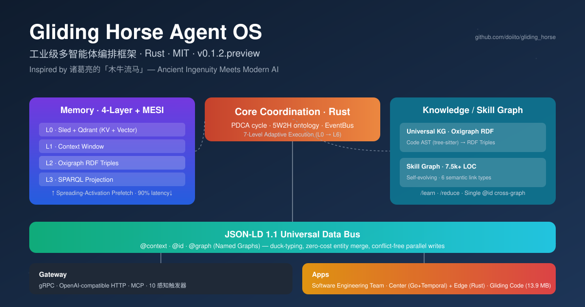
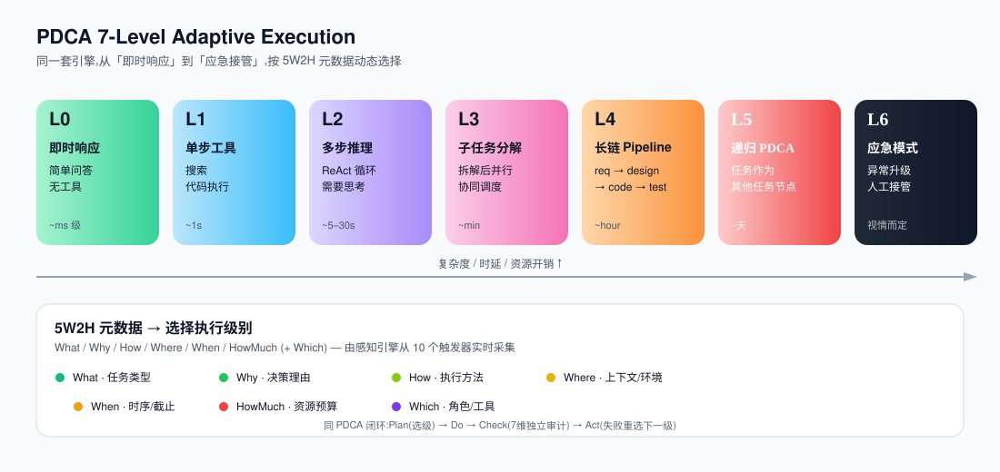
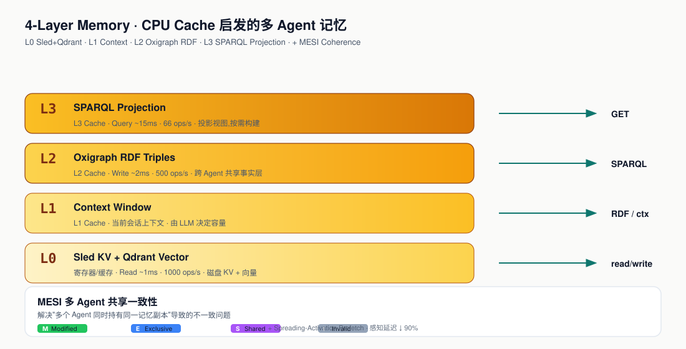

## 项目概览



**Gliding Horse Agent OS** 是由 [doiito](https://github.com/doiito) 在 GitHub 上开源的 **Rust 编写的工业级 AI Agent 操作系统**。项目名称源自三国时期诸葛亮发明的"**木牛流马**"——一种能在险峻山路上自主运输粮草的机械装置,象征"以基础设施驾驭集体智能":不仅构建 Agent,更构建**让多个 Agent 协同调度、自主演化、可审计**的底层系统。

- **仓库**:[doiito/gliding_horse](https://github.com/doiito/gliding_horse)
- **许可**:MIT
- **当前版本**:`v0.1.2.preview`(2026-06 发布)
- **语言占比**:Rust ≈ 80.9%
- **定位**:面向企业级 AI Agent 系统的多智能体编排框架,提供完整的中文文档

> "We don't just build agents; we build the **infrastructure that harnesses their collective intelligence**."

---

## 设计哲学

借鉴"木牛流马"的范式:古代机械并不是替换人力,而是**把人从机械性劳动中解放出来**。Gliding Horse 同样不追求把 Agent 框死在某种刚性流程里,而是提供一套**自适应任务复杂度**的编排基础设施——从一次性的即时查询,到多周的长流程项目,同一套引擎都能覆盖。

核心理念可以概括为一句话:

> **"灵活编排适应任务复杂度,而非刚性框架强迫任务就范"**(The wise adapt their methods to circumstances, just as water shapes its course according to the ground over which it flows.)

---

## 整体架构

仓库分为多个 Workspace,核心层次按职能拆分:

| 层级 | 目录 | 技术栈 | 职责 |
|------|------|--------|------|
| **核心调度** | `crates/` · `src/` | Rust 2021 · PDCA · 5W2H · EventBus | Agent 编排与生命周期 |
| **应用层** | `apps/software_engineering_team/` | Center (Go+Temporal) + Edge (Rust+axum) + VS Code Plugin | 完整 SDLC 联邦 |
| **终端助手** | `crates/gliding_code/` | Rust (musl 静态二进制) | 零依赖命令行 AI 助手 |
| **技能定义** | `skills/` | RDF / YAML | 可插拔的 Skill 描述 |
| **数据契约** | `proto/` · `workflow.jsonld` | gRPC Proto · JSON-LD 1.1 | 跨进程/跨语言接口 |
| **文档** | `docs/` | Markdown (中英双语) | 设计文档与设计哲学 |

---

## 核心机制详解

### 1. 广义 PDCA —— 7 级自适应执行

PDCA(Plan-Do-Check-Act)是经典的戴明环。Gliding Horse 将其**广义化为 7 级复杂度**,通过任务的 `5W2H` 元数据动态选择:

| 级别 | 含义 | 触发场景 |
|------|------|----------|
| **L0** | 即时响应 | 简单问答、不需要工具 |
| **L1** | 单步工具调用 | 单次搜索、单次代码执行 |
| **L2** | 多步推理 | 多轮 ReAct,需要思考 |
| **L3** | 子任务分解 | 任务拆解后并行执行 |
| **L4** | 长链 Pipeline | 多阶段流水线 |
| **L5** | 递归 PDCA | 任务作为其他任务的子节点 |
| **L6** | 应急模式 | 异常升级、人工接管 |

**一个引擎覆盖从 L0 的即时查询到 L6 的应急处置**——这是 Gliding Horse 区别于其他编排框架的关键:不要求开发者为不同复杂度写不同框架。



### 2. 5W2H 本体级审计 —— 告别黑盒 PASS/FAIL

传统 Agent 评测只给一个"通过/不通过"的二值信号。Gliding Horse 对每一次执行结果按 **5W2H 七个维度**独立审计:

| 维度 | 失败时动作 |
|------|------------|
| **What**(产物对不对) | 重新生成 |
| **Why**(决策理由是否充分) | 重新分析 |
| **How**(方法是否合理) | 重新规划 |
| **Where**(执行环境/上下文是否合适) | 重新规划 |
| **When**(时序/截止日期) | 有条件放行 |
| **HowMuch**(资源消耗是否在预算内) | 有条件放行 |
| **(附加)Who/Which** | 角色/工具匹配 |

这让**精确回滚**成为可能——你可以精准定位"哪一维度出问题",而不是把整个流程推倒重做。

### 3. CPU 缓存启发的 4 层记忆 + MESI 一致性

Gliding Horse 最具创新性的设计之一是**把 CPU 缓存架构搬到多 Agent 记忆系统中**:



| 层 | 类比 | 技术实现 | 性能指标 |
|----|------|----------|----------|
| **L0** | 寄存器/缓存 | `Sled` KV + `Qdrant` 向量库 | 读取 ~1ms · 1000 ops/sec |
| **L1** | L1 缓存 | 上下文窗口 / 最近对话 | 由 LLM 决定 |
| **L2** | L2 缓存 | `Oxigraph` RDF 三元组存储 | 写入 ~2ms · 500 ops/sec |
| **L3** | L3 缓存 / 内存 | `SPARQL 1.1` 投影视图 | 查询 ~15ms · 66 ops/sec |

更关键的是引入了 CPU 的 **MESI 缓存一致性协议**(Modified / Exclusive / Shared / Invalid)的记忆改造版,解决多 Agent 共享记忆时的不一致问题。配合**扩散激活式预取**(Spreading Activation),常用记忆提前加载,**感知延迟下降约 90%**。

### 4. JSON-LD 1.1 通用数据总线

Agent 之间共享数据时,字段命名冲突是隐形大坑。Gliding Horse 用 [JSON-LD 1.1](https://www.w3.org/TR/json-ld11/) 作为**跨子系统、跨语言的通用数据契约**:

- `@context` —— 鸭子类型,消除字段命名冲突
- `@id` —— 零成本跨 Agent 实体合并(同一个对象在不同子系统里指向同一 `@id` 即视为同一对象)
- `@graph` (Named Graphs) —— 命名图机制,允许不同子系统并行写入而不冲突

> 配套的 `workflow.jsonld` 把"工作流描述"也建模为带 `@id` 的实体,可以直接写入 RDF 图并被 SPARQL 查询。

### 5. 统一知识图谱 —— Oxigraph RDF

所有子系统(技能、记忆、任务、代码知识)**共享同一个 `Oxigraph` RDF 存储**,通过命名图隔离,通过 `@id` 互联:

- **代码 AST** 由 `tree-sitter` 自动解析为 RDF 三元组入图
- 跨子系统的 **SPARQL JOIN** 让"代码模块 ↔ 任务 ↔ 记忆"可以一次性查询
- 单一 `@id` 保证实体在所有上下文中的身份一致

这一设计的核心收益是**消除信息孤岛**:跨子系统的关联不再需要额外的 ETL 管道,直接在图上做关联查询即可。

### 6. 自演化 Skill Graph

Skill 不是一个静态的 YAML 列表,而是一张**自演化的认知网络**:

- 约 **7,500+ LOC** 的动态 RDF 网络
- **6 种语义链接**:Prerequisite(前置)、Composition(组合)、Related(相关)、Conflict(冲突)、Refine(精炼)、Deprecate(废弃)
- **任务后学习**:`/learn` 机制根据执行结果创建新知识片段与新链接
- **去重压缩**:`/reduce` 机制定期合并冗余节点

简单说,系统跑得越多,这张"能力地图"**自动生长**得越完备。

### 7. 主动感知引擎

不是等任务失败再处理,Gliding Horse 内置**主动监控**:

- **10 类执行触发器**:截止日期、Token 预算超 80%、角色失配、环境冲突、循环检测……
- **60 秒异常去重窗**:避免同一异常反复打扰
- **自动升级人工**:超出 Agent 能力的异常自动升级到人介入

### 8. 微工具系统(Micro-Tool)

当 Agent 输出超过 **8 KB** 的结果时,Gliding Horse 自动把它**包装为一组对话式微工具**(例如 `search_in_results`、`summarize_section`)。原本 50 KB+ 难以一次性塞进上下文的结果,变成可在上下文里**交互式查询**的对象——极大降低 LLM 上下文压力。

### 9. MCP 协议接入

原生支持 [Model Context Protocol](https://modelcontextprotocol.io/),**一个协议接入 GitHub、Slack、Jira 等所有 MCP 兼容服务**,运行时动态发现工具,告别"每接一个外部服务就写一套对接代码"。

### 10. 检查点与恢复

长任务最怕崩溃丢失进度。Gliding Horse 在关键节点**对会话状态打快照**:

- 崩溃后**完整恢复**到最近检查点,无需重头开始
- 支持**事后回放调试**(post-mortem replay)
- 支撑小时级甚至天级的 Agent 长任务

---

## Center + Edge 联邦架构

这是一个独立于以上机制之上的**部署拓扑**,值得单独说。

```
VS Code Plugin (TypeScript)
       │ WebSocket / REST
       ▼
   Edge Daemon (Rust · axum)
   ├─ API Server (ws / chat / health)
   ├─ Agent Core (SupervisorAgent · DoAgent · LLM Client)
   ├─ Docker Sandbox (安全执行: 编译 / 测试)
   └─ Graph Layer (本地 Sled + Delta Sync)
       │ gRPC + REST
       ▼
       Center (Go · Gin)
   ├─ HTTP API (/api/v1/* · /ws)
   ├─ Temporal Workflow (编排引擎)
   ├─ Agent Manager (注册 · 心跳 · 派发)
   ├─ Executors (req → design → coding → review → test → cicd → deploy)
   └─ Store (SQLite · gRPC Client · Graph Sync)
```

| 角色 | 语言 / 框架 | 核心职责 |
|------|------------|----------|
| **Center** | Go + Gin + Temporal | 全局工作流编排、项目生命周期、Agent 注册中心、图谱同步 |
| **Edge** | Rust + axum | 本地 LLM 执行、Docker 沙箱、VS Code WebSocket 桥 |
| **VS Code Plugin** | TypeScript | Chat Panel + Graph View + Task Panel,实时呈现 Agent 协作 |

设计哲学:**Center 负责编排,Edge 负责执行,VS Code 负责感知**——三者解耦,任一节点宕机不影响其他局部。

---

## 两个旗舰应用

### 1. Software Engineering Team

最完整的多 Agent 协作**软件工程团队**:

```
需求 → 设计 → 编码 → 评审 → 测试 → CI/CD → 部署
```

提供完整 Dashboard(项目总览、Agent 状态、Pipeline 进度)以及 VS Code 插件(Chat Panel / Graph View / Task Panel),让开发者可以**实时看到多个 Agent 在背后协作**。

> 这种"联邦式"设计的好处是:Center/Edge 可以独立扩展,VS Code 插件可以独立演进,核心调度引擎不必关心 UI 细节。

### 2. Gliding Code

**零依赖终端 AI 编码助手**——Gliding Horse 知识图谱与编排能力的"轻量入口":

| 平台 | 包大小 | 说明 |
|------|--------|------|
| Linux (x86_64, musl) | 13.9 MB | 完全静态链接 |
| Linux (aarch64, musl) | 12.9 MB | - |
| macOS (Apple Silicon) | 12.1 MB | - |
| Windows (x86_64) | 11.6 MB | - |

```bash
# 下载即用,无需安装任何依赖
tar xzf glidingcode-*.tar.gz

# 设置 API Key(支持 DeepSeek 或任意 OpenAI 兼容端点)
export DEEPSEEK_API_KEY="sk-..."

# 交互式会话
./glidingcode

# 或一次性任务
./glidingcode "Explain how Rust's borrow checker works"
```

它的特点是**把整套"知识图谱 + Agent 编排"塞进一个 13 MB 的二进制**——这是 musl 全静态链接的功劳。对于想体验 Gliding Horse 但又不想搭建完整 Center/Edge 的开发者,**Gliding Code 是最佳入口**。

---

## 性能基线

| 操作 | 延迟 | 吞吐 |
|------|------|------|
| L2 节点写入 (Oxigraph) | ~2 ms | 500 ops/sec |
| L3 SPARQL 投影 | ~15 ms | 66 ops/sec |
| L0 Sled KV 读取 | ~1 ms | 1000 ops/sec |
| Agent ReAct 一轮 | 1–5 s | 0.2–1 turns/sec |
| **空闲内存** | ~200 MB | 随任务规模线性增长 |

> 注意:吞吐数据为仓库 README 公布的基线,实际表现取决于 LLM 调用频次与上下文长度。

---

## 上手指南

### 快速体验:Gliding Code(零依赖)

```bash
git clone https://github.com/doiito/gliding_horse.git
cd gliding_horse
# 在 releases 页面下载对应平台的预编译包
./glidingcode --help
```

### 完整搭建:Software Engineering Team

前置依赖:

- **Rust ≥ 1.94**
- **Go ≥ 1.24**
- **Docker**
- **Temporal Server**(本地或远端)
- 一个 **OpenAI 兼容的 LLM API Key**(DeepSeek、OpenAI、本地 vLLM 均可)

启动步骤:

```bash
# 1) 启动 Center
cd apps/software_engineering_team/center
cp center/config.yaml center/config.local.yaml
# 编辑 config.local.yaml,填入 LLM Key、Temporal 地址
go run ./cmd/server/...    # API server on :8080
go run ./cmd/worker/...    # Temporal worker

# 2) 启动 Edge Daemon
cd ../edge/daemon
cargo run -- daemon start  # Agent daemon on :7890

# 3) 安装 VS Code 插件
code --install-extension apps/software_engineering_team/edge/vscode/
```

也可以**直接调用 API**:

```bash
curl http://localhost:8080/api/v1/projects \
  -X POST -H "Content-Type: application/json" \
  -d '{"name":"My Project","description":"Build a microservice"}'
```

---

## 路线图

**核心 OS(持续推进)**:

- 扩展 MCP 工具生态与动态发现
- 多模型路由优化(成本感知调度)
- 知识图谱查询性能与规模优化
- 带版本化 Prompt 继承的模板引擎
- 细粒度订阅过滤的事件系统

**应用层(未来)**:

| 时间 | 内容 |
|------|------|
| **Q3 2026** | 原生 Web 仪表板 · Python/TypeScript SDK |
| **Q4 2026** | Kubernetes Operator · 多轮对话记忆压缩 · Skill Marketplace 原型 |
| **2027** | 跨 Edge 节点的分布式 Agent Mesh · 多模态 Agent(视觉/音频) · 社区插件注册中心 |

---

## 一些深度观察

作为一份完整的概览,以下是我认为 Gliding Horse 与同类项目相比的几个显著差异点:

- **PDCA 7 级自适应**让它对"什么算 Agent 框架"的定义更宽泛——同一套引擎既可做即时问答,又可跑周级项目,这种"弹性"是 LangChain / AutoGen 目前都没做到的。
- **CPU 缓存架构 + MESI 一致性**是从硬件架构借来的概念,工程上不是新东西,但**移植到多 Agent 记忆**是很新鲜的一手;若实现得当,能极大缓解"Agent 之间互相覆盖记忆"的常见 bug。
- **JSON-LD 作为跨子系统数据总线**使得"技能/记忆/任务/代码"得以在 RDF 图层统一——这一点与 [GraphRAG 全景](../../GraphRAG开源项目全景：从微软GraphRAG到LightRAG/index.md) 思路一脉相承,但走得更远。
- **OpenAI 兼容 API + MCP 双协议**意味着开发者不强制绑定任何单一模型生态,DeepSeek、Qwen、本地 vLLM 都可以无缝接入,适合国内闭源/开源混合场景。

**目前的不确定性**:

- 项目仍处 `v0.1.2.preview`,**生产环境稳定性未充分验证**
- 官方 Issue 中已有用户反馈"流程太繁琐、跑半天没结果、重问又从头开始"(Issue #3),**会话连续性与状态恢复**仍是体验痛点
- 实时统计(stargazer_count / watcher_count)GitHub API 返回 `null`,需访问仓库页确认当前社区热度

> 适合谁:正在搭建**多 Agent 协作平台 / 企业级 Agent 工作流 / 知识密集型 Agent 系统**的团队。
> 不适合谁:只要做一次性 prompt 调用或单 Agent RAG 的项目(用 LangChain / LlamaIndex 更轻)。

---

## 相关资源

- **项目主页**:[github.com/doiito/gliding_horse](https://github.com/doiito/gliding_horse)
- **中文 README**:`README.zh.md`(仓库根目录)
- **设计文档**:`docs/DESIGN_DETAIL.md` · `docs/DESIGN_DETAIL.zh.md`
- **核心哲学**:`docs/CORE_DESIGN_PHILOSOPHY.md` · `docs/CORE_DESIGN_PHILOSOPHY.zh.md`
- **gRPC 协议定义**:`proto/pdca_core.proto`
- **作者博客**:
    - Medium(英文):[medium.com/@doiito-sun](https://medium.com/@doiito-sun)
    - 掘金:[juejin.cn/column/7647868075887165450](https://juejin.cn/column/7647868075887165450)
    - SegmentFault:[segmentfault.com/u/doiito](https://segmentfault.com/u/doiito/articles)
    - CSDN:[blog.csdn.net/2604_96270735](https://blog.csdn.net/2604_96270735)
    - B 站:[space.bilibili.com/1547455799](https://space.bilibili.com/1547455799/lists)

---

## 系列文章

- [智能体编排设计工程师学习指南](../01-智能体编排设计工程师学习指南/index.md)
- [AI Agent Loop 工程:原理、模式与实现](../AI%20Agent%20Loop%20工程：原理、模式与实现/index.md)
- [记忆模块技术文档](../记忆模块技术文档/index.md)
- [GraphRAG 开源项目全景](../../GraphRAG开源项目全景：从微软GraphRAG到LightRAG/index.md)

> 注:Hugo 的相对路径解析对含空格目录使用 URL 编码(`%20`);若仍出现 broken 链接,请以博客最终渲染为准。
