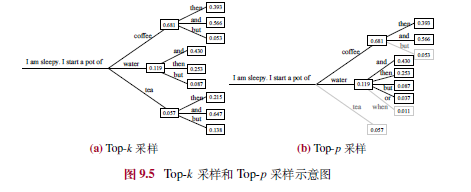

## 第九章 解码与部署

以下是第九章“解码与部署”的内容总结，涵盖了解码策略、解码加速算法及低资源部署策略的核心要点：

---

### **9.1 解码策略**
大语言模型通过自回归生成文本，解码策略决定输出质量与多样性。

#### **9.1.1 背景**
- **自回归解码流程**：模型基于上下文逐词生成概率分布，选择下一词元，迭代至结束。
- **基本策略**：
  - **贪心搜索**：每步选概率最高词元，适合翻译/摘要，但开放任务易生成重复、不自然文本。
  - **概率采样**：按概率分布采样，增加多样性，但可能引入无关词元。

#### **9.1.2 贪心搜索改进**
- **束搜索**：保留Top-k候选句子（束大小3-6），选整体概率最高者，避免局部最优。
- **长度惩罚**：归一化概率（惩罚因子0.6-0.7），鼓励长句生成。
- **重复惩罚**：如n-gram惩罚（3-5）、出现/频率惩罚（0.1-1），减少重复。

#### **9.1.3 随机采样改进**
- **温度采样**：调整softmax温度（<1集中分布，>1均匀化），控制随机性。
- **Top-k采样**：从Top-k词元采样，减少低概率词影响。
- **Top-p采样**：从累积概率≥p的词元集采样，适应上下文变化。
- **对比解码**：利用大/小模型概率差值，提升重要词元影响力。

#### **9.1.4 实际设置**
- **T5**：贪心/束搜索（束大小4，惩罚0.6）。
- **GPT-3**：束搜索（4，0.6）。
- **Alpaca**：Top-k（50）、Top-p（0.9）、温度0.7。
- **LLaMA**：任务相关（如贪心、温度0.1/0.8）。
- **OpenAI API**：支持多种策略及惩罚参数。

---

### **9.2 解码加速算法**
自回归解码效率低，需优化全量解码（初始计算）和增量解码（逐词生成）阶段。

| **参考** |
|----------|
| [全量解码与增量解码原理区别以及应用](../../p/全量解码与增量解码原理区别以及应用/) |

#### **9.2.1 解码效率分析**
- **阶段**：
  - **全量解码**：一次性计算输入状态，缓存键值。
  - **增量解码**：仅计算新词元状态，更新缓存。
- **效率指标**：GPU算力（FLOP/s）、带宽（byte/s）、计算强度（FLOP/byte）。
- **瓶颈**：
  - 全量解码：计算瓶颈（算力限制）。
  - 增量解码：带宽瓶颈（内存墙）。

#### **9.2.2 系统级优化**
- **FlashAttention**：分块融合注意力计算，减少访存量，提速10倍。
- **PagedAttention**：分页管理键值缓存，优化拼接与注意力并行。
- **批次管理**：
  - **vLLM连续批处理**：动态拆分请求，增大批次。
  - **DeepSpeed-MII动态分割**：融合全量/增量解码，提升吞吐。

#### **9.2.3 解码策略优化**
- **推测解码**：小模型预测、大模型验证，加速2倍。
- **级联解码**：按请求难度分配模型，分类器判断结果。
- **非自回归解码**：并行生成（如Medusa），需验证质量。
- **早退机制**：熵阈值或混合深度跳层计算，提效。

#### **9.2.4 代码实践**
- **常见库**：llama.cpp（跨平台量化）、vLLM（高效解码）、DeepSpeed-MII（动态分割）、FlexFlow（推测优化）。
- **vLLM示例**：加载LLaMA-2-7b，支持贪心搜索、网络服务。

---

### **9.3 低资源部署策略**
模型压缩减少显存占用，适应资源受限环境。

#### **9.3.1 量化基础**
- **量化**：浮点数映射为整数（如INT8），缩放因子S、零点Z控制范围。
- **类型**：
  - **均匀/非均匀**：间隔是否固定。
  - **对称/非对称**：零点是否为0。
  - **粒度**：张量、通道、组，精度与开销权衡。
- **示例**：非对称/对称量化8-bit，误差分析。

#### **9.3.2 训练后量化**
- **权重量化**：
  - **GPTQ**：逐层分组量化，3-4bit有效。
  - **AWQ**：激活感知缩放，关注关键权重。
- **权重+激活量化**：
  - **细粒度**：异常值用FP16，正常值INT8。
  - **SmoothQuant**：平衡量化难度，转移至权重。
- **其他**：
  - **QLoRA**：4-bit量化+16-bit适配器微调。
  - **量化感知训练**：蒸馏压缩权重/激活/缓存。

#### **9.3.3 经验分析**
- **结论**：
  - INT8权重影响小，4-bit需优化策略。
  - 激活值难量化，需混合精度。
  - 轻量化微调（如QLoRA）补偿损失。
- **实验**：LLaMA 4/8-bit量化性能接近16-bit，显存降至3.94-7.34GB。

---

### **9.4 其他压缩方法**
- **模型蒸馏**：
  - **传统**：反馈（logits）、特征（中间层）。
  - **大模型**：白盒（MINILLM）、黑盒（思维链蒸馏）。
- **模型剪枝**：
  - **传统**：结构化（删组件）、非结构化（掩码0）。
  - **大模型**：Sheared LLaMA动态剪枝至2.7B，恢复87.8%精度。

---

### **总结**
本章探讨了大语言模型的解码与部署技术。解码策略平衡质量与多样性，加速算法优化效率，低资源策略通过量化、蒸馏、剪枝减少资源需求。未来需进一步提升效率与真实场景适配性。

## 第十章 提示学习

以下是第十章“提示学习”的内容总结，涵盖基础提示、上下文学习和思维链提示的核心要点：

---

### **10.1 基础提示**
提示学习通过自然语言接口与大语言模型交互，是解决下游任务的主要方法。提示质量直接影响模型表现，设计方法分为人工设计和自动优化。

#### **10.1.1 人工提示设计**
- **关键要素**：
  - **任务描述**：清晰具体，如“回答问题”或“补全代码”，可用符号（如###）强调格式。
  - **输入数据**：自然语言或线性化结构化数据（如表格、图）。
  - **上下文信息**：提供参考文档或示例，提升复杂任务能力。
  - **提示策略**：如“逐步思考”前缀或专家角色，提升推理或领域表现。
- **设计原则**：
  - **清晰表达目标**：明确任务、格式和限制（如“50字摘要”）。
  - **分解子任务**：将复杂任务拆分为有序子步骤。
  - **少样本示例**：提供输入-输出对，增强语义映射。
  - **模型友好格式**：用特殊符号分隔，优先英语指令。

#### **10.1.2 自动提示优化**
- **离散提示优化**（自然语言词元）：
  - **梯度方法**：用梯度搜索最佳词元，或优化“软词元”嵌入。
  - **强化学习**：将提示生成视为策略网络，基于奖励优化。
  - **编辑方法**：迭代修改提示，适配API调用场景。
  - **大模型方法**：用大模型生成提示，蒙特卡洛搜索筛选。
- **连续提示优化**（嵌入向量）：
  - **监督学习**：微调前缀/输入层提示向量，节省参数。
  - **迁移学习**：共享源任务提示，或加权组合适配目标实例。
- **局限性**：大模型参数量大，传统优化方法适用性有限。

---

### **10.2 上下文学习 (In-context Learning, ICL)**
上下文学习通过任务描述和示例提示大模型，无需微调即可处理新任务。

#### **10.2.1 形式化定义**
- **形式**：提示 = 任务描述 + 示例（可选） + 测试输入，模型生成输出。
- **与指令微调区别**：ICL仅靠提示调用，微调提升零样本能力。

#### **10.2.2 示例设计**
- **示例选择**：
  - **相关度排序**：用k-NN检索相似示例。
  - **集合多样性**：MMR/DPP算法平衡相关性和多样性。
  - **大模型评分**：评估示例增益，或训练分类器筛选。
- **示例格式**：
  - **人工标注**：输入-输出对，或加任务描述/思维链。
  - **自动生成**：用大模型基于种子示例扩展模板。
- **示例顺序**：
  - **候选顺序**：语义相似度排序，靠近测试样本优先。
  - **质量评估**：用任务表现或预测熵值筛选。

#### **10.2.3 底层机制**
- **预训练阶段**：
  - **任务设计**：元训练（如MetaICL）增强示例学习能力。
  - **数据选择**：多样性及长程依赖提升ICL，长尾词汇关键。
- **推理阶段**：
  - **任务识别**：利用预训练知识识别任务。
  - **任务学习**：隐式梯度下降或复杂算法学习新任务。
  - **规模效应**：小模型偏任务识别，大模型强于任务学习。

---

### **10.3 思维链提示 (Chain-of-Thought, CoT)**
思维链通过中间推理步骤增强复杂推理任务表现。

#### **10.3.1 基本形式**
- **结构**：⟨输入，思维链，输出⟩，提供逻辑推理过程。
- **简单方法**：如“Let’s think step by step”诱导推理。

#### **10.3.2 优化策略**
- **示例设计**：
  - **复杂化**：增加推理步骤或问题长度。
  - **多样化**：聚类选择多样示例，减弱错误影响。
- **生成方法**：
  - **采样法**：Self-consistency生成多路径，投票集成。
  - **验证法**：DIVERSE用验证器检查推理路径/步骤。
- **拓展结构**：
  - **思维树 (ToT)**：树形搜索，支持前瞻和回溯。
  - **思维图 (GoT)**：图结构，节点汇聚复杂推理。

#### **10.3.3 进一步讨论**
- **能力来源**：
  - **训练数据**：局部变量重叠支持推理。
  - **函数学习**：分解为信息聚焦和单步组合。
- **模型影响**：
  - **符号与模式**：表达任务意图为主。
  - **推理生成**：含推理路径的序列更准确。

---

### **总结**
提示学习是高效利用大模型的关键。基础提示依赖人工设计或自动优化，上下文学习通过示例实现无微调任务适应，思维链提示增强复杂推理。未来需优化示例设计、推理结构及模型稳定性。

## 第十一章 规划与智能体
---

### **11.1 基于大语言模型的规划**
规划是大语言模型解决复杂问题和自主智能体的核心能力，通过分解任务并制定动作序列来简化问题求解。

#### **11.1.1 整体框架**
- **核心组件**：
  1. **任务规划器（Task Planner）**：由大语言模型担任，生成解决方案（动作序列），可引入存储机制管理长期任务。
  2. **规划执行器（Plan Executor）**：执行动作，可由大语言模型或物理实体（如机器人）实现。
  3. **环境（Environment）**：动作执行的场景（如Web、虚拟世界）。
- **工作流程**：任务规划器生成方案，执行器在环境中执行，环境提供反馈，规划器根据反馈优化方案，迭代进行。

#### **11.1.2 方案生成**
- **形式**：自然语言（直观但不严谨）或代码（规范、可执行）。
- **方法**：
  1. **一次性方案生成**：生成完整动作序列，简单但容错性低，适合逻辑性强的任务（代码表达）或非形式化任务（自然语言）。
  2. **迭代式方案生成**：逐步生成下一步动作，结合环境反馈调整。
     - **ReAct方法**：模拟“思考-决策”，生成决策理由和动作，迭代推进。
     - **回溯策略**：如思维树，通过回退优化方案，避免次优结果。

#### **11.1.3 反馈获取**
- **外部反馈**：
  - **物理工具**：如代码解释器，提供执行结果。
  - **人类**：在具身智能中提供实时环境信息。
  - **虚拟环境**：如游戏，提供动作反馈。
- **内部反馈**：
  - 大语言模型自我判断动作正确性。
  - **Reflexion方法**：将简单反馈转为详细反思，优化方案。

---

### **11.2 基于大语言模型的智能体**
智能体是具备感知、决策、执行能力的自主系统，大语言模型提升其在开放动态环境中的表现。

#### **11.2.1 智能体概述**
- **发展历程**：
  - **规则智能体**：依赖预定义规则，适应性低。
  - **模型智能体**：如强化学习，通过试错学习策略。
  - **大语言模型智能体**：利用语言理解和规划能力，处理复杂任务。

#### **11.2.2 大语言模型智能体的构建**
- **核心组件**：
  1. **记忆组件**：
     - **短期记忆**：上下文窗口，临时存储近期信息。
     - **长期记忆**：持久存储知识、经验，外部存储实现。
  2. **规划组件**：分解任务，生成并优化动作方案。
  3. **执行组件**：执行规划，与环境交互，可借助外部工具。
- **工作流程**：感知环境→检索记忆→规划策略→执行动作→获取反馈→更新记忆，动态调整行为。
- **示例**：RecAgent推荐系统智能体，用户Bob通过记忆、规划、执行完成观影及社交行为。

#### **11.2.3 多智能体系统的构建**
- **构建方法**：定义目标→创建多智能体（不同角色）→设计交互机制→考虑可扩展性等。
- **通讯协同机制**：
  - **通讯机制**：协议（交换规则）、拓扑（连接关系）、内容（传输信息）。
  - **协同机制**：协作（共享资源）、竞争（博弈优化）、协商（冲突解决）。

#### **11.2.4 典型应用**
1. **WebGPT**：单智能体，增强信息检索，提供准确回答。
2. **MetaGPT**：多智能体，模拟软件开发团队，高效协作但代码成功率待提升。
3. **西部世界沙盒模拟**：生成式智能体，社会仿真，支持复杂交互。

#### **11.2.5 待解决的关键技术问题**
- **资源消耗**：模型调用成本高，多智能体系统难以扩展。
- **工具使用**：适配性不足，可扩展性需加强。
- **多智能体交互**：通信协调复杂，需高效机制。
- **模型适配**：指令理解、长期记忆、行为一致性待优化。
- **真实世界应用**：硬件限制、信息超载、安全性要求高。

---

### **总结**
本章介绍了基于大语言模型的规划框架（方案生成与反馈获取）及智能体系统（单智能体与多智能体）的构建与应用。规划通过任务分解和反馈优化解决复杂问题，智能体则整合记忆、规划、执行能力适应动态环境。未来需解决资源效率、工具适配、交互机制及真实世界应用的挑战，以推动智能体技术发展。
