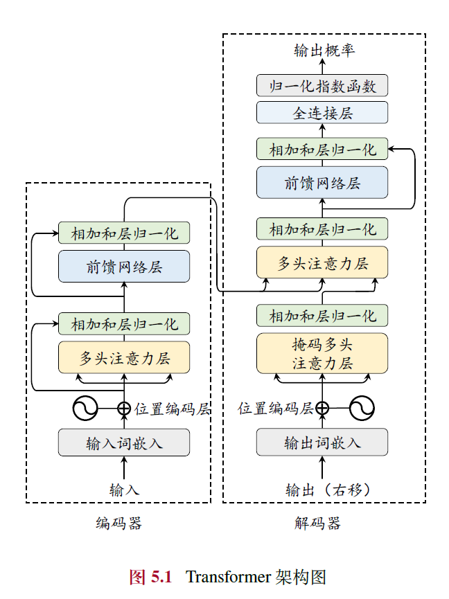

### **第4章： 预训练**

预训练是研发大语言模型的第一个训练阶段，也是最为重要的一个阶段。有效的预训练能够为大语言模型的能力奠定坚实的基础：通过在大规模语料上进行预训练，大语言模型可以获得通用的语言理解与生成能力，掌握较为广泛的世界知识，具备解决众多下游任务的性能潜力。在这一过程中，预训练语料的规模和质量对于提升大语言模型的能力至关重要。

#### 4.1 数据来源
- **重要性**：预训练是构建大语言模型的关键阶段，数据的规模和质量直接影响模型的语言理解与生成能力。
- **数据类型**：
  - **通用文本数据**：包括网页（主要来源数据集，如C4、RefinedWeb）、书籍（数据集，Books3、Bookcorpus2）、对话文本，提供广泛的世界知识。
  - **专用文本数据**：如多语文本（提升跨语言能力，如BLOOM、PaLM）、科学文本（增强科学推理，如arXiv）、代码（提高编程能力，如GitHub、StackExchange）。

  

- **图4.1**：展示了不同模型（如LLaMA、GPT-3、CodeGen等）的预训练数据来源比例，网页数据通常占主导地位。

#### 4.2 数据预处理
- **目标**：通过质量过滤、敏感内容过滤和去重，确保数据的高质量和安全性。
- **质量过滤**：
  - **启发式规则**：基于语种（如过滤非目标语言）、统计指标（如困惑度、符号比例）、关键词（如HTML标签）。
  - **分类器方法**：训练分类器（如FastText、BERT）识别低质量数据，需平衡效率与准确性。
- **敏感内容过滤**：
  - **有毒内容**：使用分类器（如Jigsaw数据集训练）过滤攻击性文本。
  - **隐私内容**：通过规则（如正则表达式）去除PII（如邮箱、电话号码）。
- **数据去重**：
  - **粒度**：句子、文档、数据集级别。
  - **方法**：精确匹配（后缀数组）、近似匹配（MinHash）。
- **影响**：
  - **数据数量**：符合扩展法则（如Chinchilla的20:1比例），更多数据提升性能。
  - **数据质量**：高质量数据（如Phi-1的“教科书级”数据）显著提高效率，低质量数据导致“幻象”等问题。
  - **重复数据**：可能引发双下降现象，需精细去重。
  - **数据集污染**：需避免训练与测试数据重叠，确保评估公平性。

#### 4.3 词元化（分词）
- **目标**：将文本转化为模型可处理的词元序列。
- **方法**：
  - **BPE**：基于频率合并词元（如GPT-2的Byte-level BPE），解决未登录词问题。
  - **WordPiece**：基于似然性增量合并（如BERT），使用前缀标记子词。
  - **Unigram**：从大词表迭代删除词元（如T5），基于一元语言模型。
- **选用**：定制化分词器（如SentencePiece）更高效，需考虑无损重构和高压缩率。

#### 4.4 数据调度
- **数据混合**：
  - **典型分布**：如LLaMA以网页为主，CodeGen增加代码比例。
  - **策略**：增加多样性、优化配比（如DoReMi）、针对特定能力调整（如数学、代码）。
- **数据课程**：
  - **顺序安排**：从通用到专业化（如CodeLLaMA：通用→代码→Python）。
  - **应用**：提升代码、数学、长文本能力。
- **YuLan模型示例**：
  - **数据收集**：网页、书籍、代码等多源数据。
  - **清洗**：质量过滤、去重（MinHash）、隐私去除。
  - **调度**：通过小模型测试确定1:8中英文比例，最终使用1,680B词元。

### **第5章：模型架构**

#### **5.1 Transformer模型**

- **核心结构**：Transformer由多层多头自注意力（Multi-head Self-attention）和前馈网络（FFN）组成，分为编码器和解码器两部分，可独立使用（如BERT用编码器，GPT用解码器）。
- **输入编码**：词元序列通过嵌入模块转为词向量，加入位置编码（Position Embedding, PE）以捕捉序列顺序信息。
- **多头自注意力**：通过查询（Query）、键（Key）、值（Value）计算注意力分数，支持长距离依赖建模，计算高效且并行性强。
- **前馈网络层**：引入非线性变换，提升模型表达能力。
- **编码器与解码器**：编码器用双向注意力生成上下文表示，解码器用掩码自注意力自回归生成序列，解码器还可通过交叉注意力关注编码器输出。

#### **5.2 详细配置**
- **归一化方法**：包括LayerNorm、RMSNorm（提高训练速度）和DeepNorm（稳定深层模型训练）。
- **归一化位置**：分为Post-Norm（原始设计，收敛快但不稳定）、Pre-Norm（稳定但性能稍逊）和Sandwich-Norm（结合两者，灵活性高但可能不稳定）。
- **激活函数**：从ReLU（简单但有神经元失效问题）发展到GELU、Swish及GLU变体（如SwiGLU、GeGLU），后者性能更优但计算复杂。
- **位置编码**：
  - **绝对位置编码**：如正余弦编码或可学习嵌入，局限于训练长度。
  - **相对位置编码**：如Transformer-XL、T5偏置，引入相对距离信息，支持一定外推。
  - **RoPE**：用旋转矩阵融合绝对与相对位置信息，广泛应用（如LLaMA）。
  - **ALiBi**：通过距离惩罚增强外推能力，无需额外参数。
- **注意力机制**：
  - **完整自注意力**：计算复杂度高（O(T²)）。
  - **稀疏注意力**：如滑动窗口注意力，降低复杂度至O(wT)。
  - **多查询/分组查询**：共享键值矩阵，提高效率。
  - **硬件优化**：如FlashAttention和PagedAttention，提升计算和内存效率。
- **混合专家模型（MoE）**：通过路由网络选择激活专家（如Mixtral 8×7B），在低计算成本下提升性能。
- **LLaMA配置**：推荐Pre-RMSNorm、SwiGLU、RoPE，代码实现展示了其解码器结构。

#### **5.3 主流架构**
- **编码器-解码器**：如T5，双向编码+自回归解码，适用于理解与生成任务。
- **因果解码器**：如GPT-3，单向掩码注意力，主流架构，擅长生成任务。
- **前缀解码器**：如GLM-130B，前缀双向编码+输出单向解码，参数共享，灵活性强。

#### **5.4 长上下文模型**
- **挑战**：传统模型受限于上下文窗口（如LLaMA-2的4096词元），需扩展以处理长文本。
- **扩展位置编码**：
  - **直接微调**：用长文本训练，但收敛慢。
  - **位置索引修改**：如位置内插（缩放索引）、位置截断（限制远距离角度）。
  - **基修改**：调整RoPE底数或截断关键子空间，提升外推能力。
- **调整上下文窗口**：
  - **并行上下文窗口**：分段编码，顺序关系弱。
  - **Λ形窗口**：关注起始和邻近词元，适合流式生成。
  - **词元选择**：基于相似度选关键词元或分块，优化效率。
- **长文本数据**：需少量多样化数据（1B词元即可），领域分布应与预训练匹配，优先整体型文本。

#### **5.5 新型模型架构**
- **问题**：Transformer自注意力复杂度高（O(T²)），不适合超长序列。
- **状态空间模型（SSM）**：结合RNN和CNN优点，支持并行训练和高效解码。
- **变种**：
  - **Mamba**：输入选择机制，性能强但无并行卷积。
  - **RWKV**：词元偏移+时间/频道混合，效率高但训练非并行。
  - **RetNet**：多尺度保留机制，支持并行与循环计算。
  - **Hyena**：长卷积替换注意力，训练高效但解码复杂度随序列增长。

---

#### **关键点与趋势**
1. **Transformer主导地位**：因果解码器（如GPT系列）因生成能力强成为主流，长上下文和效率优化是当前重点。
2. **配置优化**：归一化、激活函数和位置编码的改进显著提升稳定性和性能。
3. **长文本建模**：位置编码扩展和上下文窗口调整并行发展，数据质量至关重要。
4. **新型架构**：SSM及其变种（如Mamba）在效率和长序列建模上挑战Transformer。

---

以下是对您提供的《第六章 模型预训练》内容的总结，涵盖主要概念和关键点，便于快速理解和回顾：

---

### **第6章 模型预训练总结**

本章详细阐述了大语言模型预训练的流程，包括预训练任务设计、优化参数设置、可扩展训练技术、效率分析及代码实践。以下是各节的核心内容：

#### **6.1 预训练任务**
预训练任务旨在通过自监督学习从海量无标注数据中提取语义和世界知识，常见任务分为三类：
1. **语言建模 (LM)**  
   - **核心思想**：预测下一个词元，基于自回归方式优化似然函数$LLM(\mathbf{u}) = \sum_{t=1}^T \log P(u_t | \mathbf{u}_{<t}) $。  
   - **应用**：广泛用于解码器模型（如GPT-3、PaLM），通过预测词元学习语言生成规律。  
   - **变种**：
     - **前缀语言建模**：基于前缀预测后缀，仅计算后缀损失，适用于前缀解码器架构。  
     - **中间填充任务**：调整序列顺序，训练模型填补中间缺失信息，常用于代码补全。  
   - **特点**：任务简单但效果显著，可隐式学习多任务能力（如情感分析、算术推理）。

2. **去噪自编码 (DAE)**  
   - **目标**：从损坏文本 $\mathbf{\tilde{u}}$ 恢复原始文本 $\mathbf{u}$，优化 $ L_{DAE}(\mathbf{u}) = \log P(\mathbf{\tilde{u}} | \mathbf{u} \setminus \mathbf{\tilde{u}}) $。  
   - **应用**：常见于BERT、T5，通过随机替换或删除词元训练模型。  
   - **特点**：实现复杂，需设计替换策略，较少单独用于大模型预训练。

3. **混合去噪器 (MoD)**  
   - **思想**：统一语言建模和去噪自编码，定义 S（前缀）、R（短片段）、X（长片段）三种去噪器。  
   - **应用**：用于UL2、PaLM 2，输入以特殊标记（如 [S], [R], [X]）区分任务类型。  
   - **优势**：增强模型对不同损坏模式的适应性。

#### **6.2 优化参数设置**
为确保大模型训练稳定性和性能，需优化以下参数：
1. **批次大小**：通常为1M-4M词元，动态调整（如GPT-3从32K增至3.2M）以提升稳定性。  
2. **学习率**：采用预热（0.1%-0.5%步数）+衰减策略（如余弦衰减），最大值一般为 $5 \times 10^{-5}$  至 $1 \times 10^{-4}$ 。  
3. **优化器**：常用Adam/AdamW（超参数 $\beta_1=0.9, \beta_2=0.95, \epsilon=10^{-8}$ ）或Adafactor（节省显存）。  
4. **稳定技术**：
   - 梯度裁剪（阈值1.0）防止损失突增；
   - 权重衰减（系数0.1）增强泛化；
   - 训练恢复设置存档点应对异常。

#### **6.3 可扩展的训练技术**
针对大模型的计算资源挑战，提出以下高效训练技术：
1. **3D 并行训练**：
   - **数据并行**：复制模型到多GPU，均分数据计算梯度后平均。
   - **流水线并行**：将模型层分配到不同GPU，配合梯度累积提升效率。
   - **张量并行**：分解参数矩阵（如注意力层 $ W_Q, W_K, W_V $），并行计算。
2. **零冗余优化器 (ZeRO)**：分片模型参数、梯度、优化器状态，减少显存冗余（ZeRO-3可降至 $ 1/N_D $）。  
3. **激活重计算**：仅保存部分激活值，反向传播时重算，节省显存但增加计算开销。  
4. **混合精度训练**：结合FP16/BF16（16位）和FP32（32位），提升效率并减少显存占用。

#### **6.4 模型参数量计算与效率分析**
1. **参数量计算**：以LLaMA为例，公式为 $ 2VH + H + L \cdot (4H^2 + 3HH' + 2H) $，如LLaMA-7B约为67亿参数。  
2. **训练运算量**：近似为 $ 6CP $（未用激活重计算）或 $ 8CP $（使用时），C为词元总数，P为参数量。  
3. **训练时间**：基于 $ \text{时间} = \frac{\text{运算量}}{\text{GPU数} \times \text{GPU浮点运算能力}} $，如LLaMA-65B约21天。  
4. **显存估计**：
   - 模型参数与优化器：ZeRO-3下为 $ 16P/N_D $ 字节。
   - 激活值：受批次大小 $ B $、序列长度 $ T $、层数 $ L $ 等影响。
   - 总显存：如LLaMA-7B每GPU约66GB。

#### **6.5 预训练代码实践**
基于Transformers和DeepSpeed，提供LLaMA-7B预训练示例：
- **代码结构**：包括模型加载、分词器初始化、数据处理（PTDataset类）和训练循环。
- **关键参数**：支持BF16、ZeRO-3、激活重计算等优化。
- **运行方式**：使用torchrun实现多GPU训练，DeepSpeed配置文件设置并行策略。

---

#### **总结要点**
- **任务设计**：语言建模为主流，辅以去噪任务提升多样性。
- **优化策略**：动态批次、学习率调度和Adam优化器是关键。
- **训练技术**：3D并行和混合精度显著提升效率。
- **资源估算**：参数量、运算量和显存需求可量化分析。
- **实践支持**：提供可运行代码，适配中小规模模型训练。

