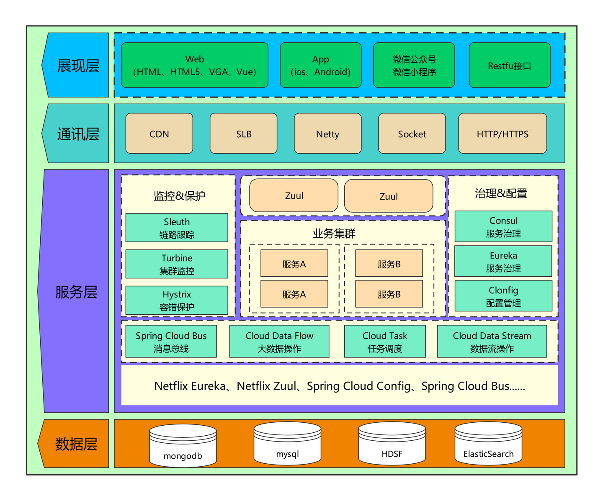
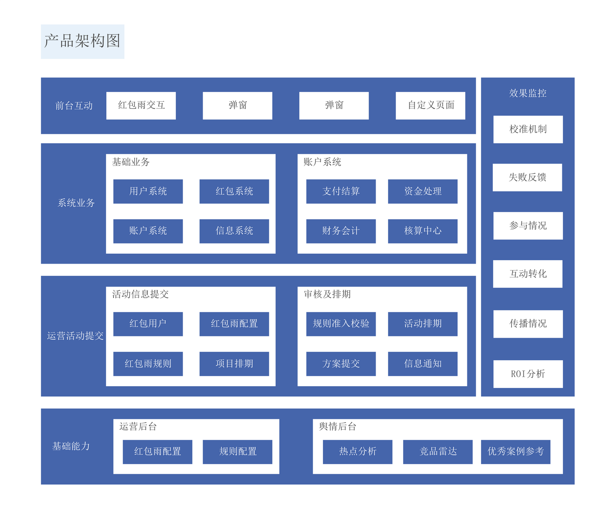
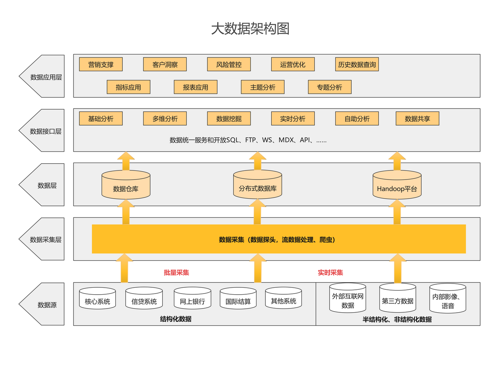

## 软件架构图示例


参考
[知乎 - 亿图](https://zhuanlan.zhihu.com/p/269201440)







## 第一部分：软件架构基础

### 1. 什么是软件架构？

软件开发早期阶段！！！


软件架构设计是一个在软件开发早期阶段进行的关键过程，软件架构是软件系统的高层次结构，定义了系统的组件、它们之间的关系以及指导系统设计和演化的原则。架构关注系统的非功能性需求（如性能、可扩展性、安全性）和功能性需求。

- **核心目标**：
  - 满足功能需求
  - 确保系统质量（如可维护性、可靠性）
  - 平衡开发成本和长期维护成本

### 2. 软件架构设计的重要性

软件架构设计的重要性主要体现在以下几个方面：

- 沟通的桥梁： 架构为不同的利益相关者（如开发人员、项目经理、客户等）提供了一个共同理解系统的基础，方便沟通和协作。
- 早期决策： 架构设计涉及一系列关键决策，这些决策在项目早期做出，对后续的开发、部署和维护产生深远影响。正确的架构决策可以避免后期昂贵的修改和返工。
- 质量属性的保障： 架构设计直接影响系统的各种质量属性，如性能、安全性、可伸缩性、可靠性、可维护性、可扩展性等。通过合理的架构设计，可以更好地满足这些非功能性需求。
- 系统演进的基础： 良好的架构能够适应需求的变化和技术的发展，支持系统的长期演进和维护。
- 风险规避： 通过架构设计，可以识别潜在的技术风险和挑战，并提前制定应对策略。
- 指导开发： 架构为开发团队提供了清晰的指导和约束，确保各个模块能够有效地集成和协同工作。

### 3. 架构师的角色

架构师负责：
- 定义系统结构和技术选型。
- 平衡业务需求与技术约束。
- 与开发团队、产品经理等沟通，确保架构落地。
- 持续优化架构以适应变化。

---

## 第二部分：软件架构设计原则


### 软件架构设计的核心要素通常包括：

组件（Components）： 系统中的主要计算单元或数据存储。

连接器（Connectors）： 组件之间交互的机制，如函数调用、消息传递、共享数据等。

配置（Configuration）： 组件和连接器的特定组织方式，描述了系统的整体结构。

约束（Constraints）： 对架构设计选择的限制，可能来自技术、业务或组织等方面。

原理（Principles）： 指导设计决策的基本规则和信念。


软件架构设计的核心原则包括：

关注点分离 (Separation of Concerns): 将系统的不同功能或职责划分到不同的模块或组件中，降低耦合度。

高内聚低耦合 (High Cohesion, Low Coupling): 模块内部的功能应该紧密相关（高内聚），模块之间的依赖关系应该尽可能少（低耦合）。

单一职责原则 (Single Responsibility Principle): 每个模块或组件应该只负责一项特定的功能。

抽象 (Abstraction): 隐藏底层的复杂实现细节，提供简洁易懂的接口。

模块化 (Modularity): 将系统划分为独立的、可替换的模块，便于开发、测试和维护。

可扩展性 (Scalability): 系统应能够方便地进行横向或纵向扩展，以应对不断增长的用户量和数据量。

可测试性 (Testability): 架构设计应便于对各个组件和整个系统进行测试。

可维护性 (Maintainability): 清晰、文档化的架构使得系统更容易被理解、修改和维护。

安全性 (Security): 从架构层面考虑系统的安全需求，构建安全的系统。

合适性原则 (Suitability): 架构设计应根据项目的具体需求、资源和环境选择最合适的方案，而非盲目追求最新或最复杂的技术。

简单性原则 (Simplicity): 在满足需求的前提下，应尽量保持架构的简单性，避免过度设计。

演化性原则 (Evolution): 架构应该能够适应未来的变化和发展，支持逐步演进。

### 1. SOLID 原则
SOLID 是面向对象设计的五大原则，同样适用于架构设计：
- **单一职责原则（SRP）**：一个模块或类只负责一个功能。
- **开闭原则（OCP）**：对扩展开放，对修改关闭。
- **里氏替换原则（LSP）**：子类可以替换父类而不影响系统行为。
- **接口隔离原则（ISP）**：客户端不应被迫依赖不需要的接口。
- **依赖倒置原则（DIP）**：高层模块不应依赖低层模块，二者都应依赖抽象。

### 2. 其他关键原则
- **KISS（Keep It Simple, Stupid）**：保持设计简单，避免不必要的复杂性。
- **DRY（Don’t Repeat Yourself）**：避免代码和设计的重复。
- **YAGNI（You Aren’t Gonna Need It）**：只实现当前需求的功能，避免过度设计。
- **关注点分离（Separation of Concerns）**：将系统划分为独立的功能模块。

---

## 第三部分：常见架构模式

### 1. 分层架构（Layered Architecture）
- **定义**：将系统分为多个层次（如表示层、业务逻辑层、数据访问层），每层负责特定功能。
- **优点**：结构清晰，易于维护和测试。
- **缺点**：可能导致性能瓶颈，扩展性受限。
- **适用场景**：传统企业应用、Web 应用。
- **示例**：
  ```
  表示层（UI） -> 业务逻辑层 -> 数据访问层 -> 数据库
  ```

### 2. 微服务架构（Microservices Architecture）
- **定义**：将系统拆分为小型、独立的服务，每个服务专注于单一功能，通过 API 通信。
- **优点**：高扩展性、独立部署、团队自治。
- **缺点**：分布式系统复杂性、部署和监控成本高。
- **适用场景**：大型分布式系统、快速迭代的产品。
- **示例**：Netflix、Amazon 的服务架构。

### 3. 事件驱动架构（Event-Driven Architecture）
- **定义**：组件通过事件（消息）异步通信，事件生产者与消费者解耦。
- **优点**：高响应性、松耦合、易于扩展。
- **缺点**：事件追踪和调试复杂。
- **适用场景**：实时处理系统、物联网。
- **示例**：Kafka 或 RabbitMQ 驱动的系统。

### 4. 领域驱动设计（DDD, Domain-Driven Design）
- **定义**：以业务领域为核心，设计模型和架构，强调领域模型的清晰表达。
- **优点**：贴近业务需求，易于维护。
- **缺点**：学习曲线陡峭，初期投入高。
- **适用场景**：复杂业务系统。

### 5. 其他模式
- **模型-视图-控制器（MVC（Model-View-Controller）**：分离数据、界面和控制逻辑，常见于 Web 开发。
- **CQRS（Command Query Responsibility Segregation）**：读写分离，优化性能和扩展性。
- **Serverless 架构**：基于云函数，按需运行，降低运维成本。
- 管道-过滤器架构 (Pipe and Filter Architecture): 将数据处理过程分解为一系列独立的过滤器，数据通过管道在过滤器之间流动。

---

## 第四部分：架构设计流程

### 1. 需求分析
- **功能需求**：明确系统需要实现的功能。
- **非功能需求**：性能、可靠性、可扩展性、安全性等。
- **约束条件**：预算、技术栈、团队能力等。

### 2. 系统分解
- 将系统划分为模块或服务。
- 使用 UML 图（如类图、序列图）或 C4 模型描述系统结构。
- 定义模块间的接口和通信方式。

### 3. 技术选型
- **编程语言**：根据团队经验和项目需求选择（如 Java、Python、Go）。
- **框架**：选择合适的框架（如 Spring、Django）。
- **数据库**：关系型（MySQL）还是非关系型（MongoDB）？
- **基础设施**：云服务（AWS、Azure）还是本地部署？

### 4. 架构验证
- **原型验证**：开发最小可行原型（MVP）测试架构可行性。
- **性能测试**：模拟高负载场景，验证系统性能。
- **安全评估**：检查潜在安全漏洞。

### 5. 文档化
- 编写架构设计文档，包含：
  - 系统概述
  - 架构图（C4 模型、UML 图）
  - 技术选型理由
  - 模块职责和接口定义
  - 部署和维护指南

---

## 第五部分：工具与技术

### 1. 建模工具
- **UML 工具**：Enterprise Architect、StarUML。
- **C4 模型工具**：Structurizr、Draw.io。
- **流程图工具**：Lucidchart、Visio。

### 2. 架构描述语言
- **Archimate**：企业架构建模语言。
- **ADL（Architecture Description Language）**：用于形式化描述架构。

### 3. 部署与监控
- **容器化**：Docker、Kubernetes。
- **CI/CD**：Jenkins、GitHub Actions。
- **监控**：Prometheus、Grafana。

---

## 第六部分：案例分析

### 案例：设计一个电商平台架构
#### 需求
- 支持用户注册、商品浏览、订单处理、支付。
- 高并发（双11促销）。
- 可扩展以支持新功能（如推荐系统）。

#### 架构设计
- **模式**：微服务架构 + 事件驱动。
- **服务拆分**：
  - 用户服务：管理用户注册、登录。
  - 商品服务：商品目录、库存管理。
  - 订单服务：订单创建、状态管理。
  - 支付服务：对接支付网关。
  - 推荐服务：个性化推荐。
- **技术栈**：
  - 后端：Spring Boot（Java）。
  - 数据库：MySQL（订单、用户）、MongoDB（商品目录）。
  - 消息队列：Kafka（异步事件处理）。
  - 缓存：Redis（高频数据）。
  - 部署：Kubernetes + AWS。
- **架构图**（C4 模型简化版）：
  ```
  用户 -> API 网关 -> [用户服务, 商品服务, 订单服务, 支付服务]
  订单服务 -> Kafka -> 推荐服务
  所有服务 -> MySQL/MongoDB/Redis
  ```

#### 验证
- 性能测试：模拟 10 万并发用户，确保响应时间 < 200ms。
- 安全：使用 OAuth2 认证，加密支付数据。

---

## 第七部分：常见挑战与解决方案

### 1. 可扩展性
- **问题**：系统无法应对用户增长。
- **解决方案**：使用微服务、分布式数据库、负载均衡。

### 2. 性能瓶颈
- **问题**：响应时间过长。
- **解决方案**：引入缓存（Redis）、CDN，优化数据库查询。

### 3. 维护复杂性
- **问题**：代码和架构过于复杂。
- **解决方案**：遵循 KISS 和 DRY 原则，定期重构。

### 4. 分布式系统一致性
- **问题**：数据一致性难以保证。
- **解决方案**：使用分布式事务（如 Saga 模式）或最终一致性。

---

## 第八部分：学习资源与进阶

### 1. 推荐书籍
- 《软件架构模式》（Mark Richards）
- 《领域驱动设计》（Eric Evans）
- 《微服务架构设计模式》（Chris Richardson）

### 2. 在线课程
- Coursera：软件架构与设计
- Udemy：微服务架构实战

### 3. 实践建议
- 参与开源项目，学习真实架构。
- 设计小型项目（如博客系统、聊天应用）并优化架构。
- 关注行业案例（如 Netflix、Uber 的架构分享）。

---

## 总结
软件架构设计是一门结合技术和业务的艺术。通过掌握架构原则、模式和流程，开发者可以设计出满足需求、易于维护的系统。持续学习和实践是成为优秀架构师的关键。


