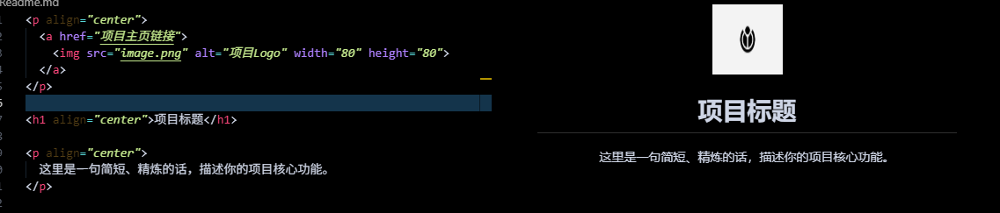
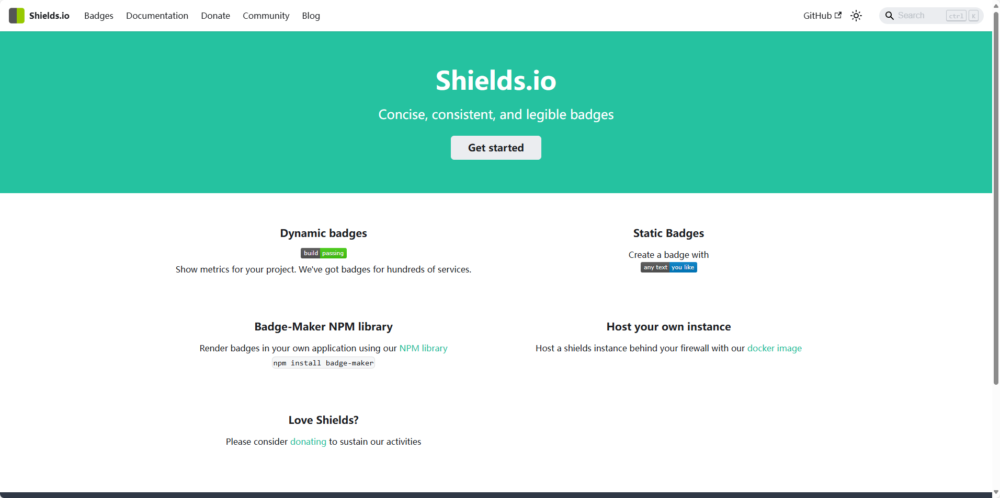
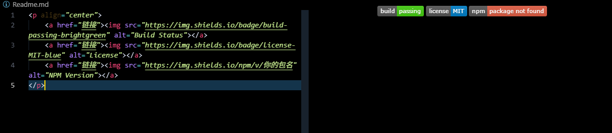
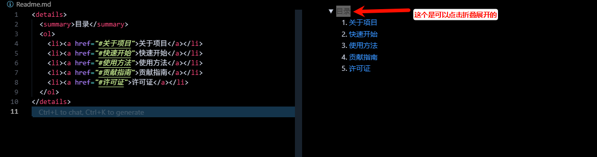
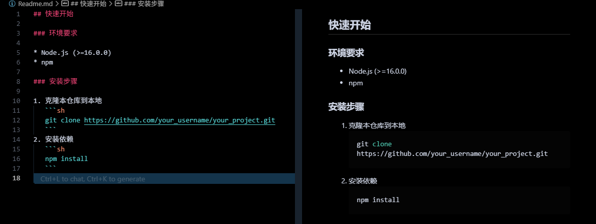
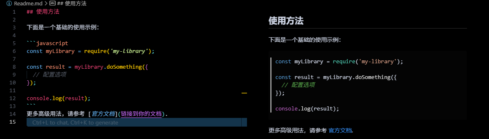
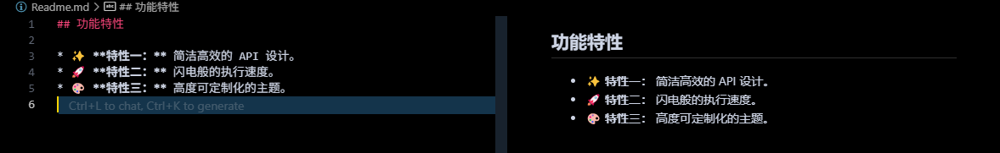

### 为什么需要一份漂亮的 README？

  * **第一印象：** 吸引用户和潜在贡献者的关键。
  * **清晰文档：** 帮助他人（以及未来的你）快速理解项目的用途、安装和使用方法。
  * **提升专业性：** 一份结构良好、内容详尽的 README 体现了开发者的严谨和专业。
  * **降低沟通成本：** 提前回答了用户可能遇到的常见问题。

-----

### 一份优秀 README 的核心组成部分

下面是一个推荐的 README 结构，你可以根据自己项目的具体情况进行增删。

#### 1\. 项目标题和 Logo (Header)

  * **标题 (`#`)：** 清晰、简洁的项目名称。
  * **Logo (可选)：** 一个精心设计的 Logo 能极大地提升项目的品牌感和辨识度。将 Logo 居中放置效果更佳。
  * **一句话简介 (Tagline)：** 用一句话精准地概括你的项目是做什么的。

**示例：**

```markdown
<p align="center">
  <a href="项目主页链接">
    
  </a>
</p>

<h1 align="center">项目标题</h1>

<p align="center">
  这里是一句简短、精炼的话，描述你的项目核心功能。
</p>
```



#### 2\. 徽章 (Badges)

徽章是简洁传达项目状态的小图标，通常放在标题下方。它们提供了诸如构建状态、代码覆盖率、开源协议、版本号等元信息。

  * **常用徽章：**

      * **构建状态 (Build Status):** Travis CI, GitHub Actions
      * **代码覆盖率 (Code Coverage):** Codecov
      * **版本号 (Version):** NPM, PyPI, NuGet
      * **许可证 (License):** MIT, Apache 2.0
      * **下载量 (Downloads):** GitHub, NPM
      * **语言 (Language):** 项目主要开发语言

  * **如何生成徽章？**

      * **[Shields.io](https://shields.io/)** 是最流行的徽章生成服务。你可以根据需要定制各种徽章。
    
**示例：**

```markdown
<p align="center">
    <a href="链接"></a>
    <a href="链接"></a>
    <a href="链接"></a>
</p>
```


#### 3\. 项目介绍 (Introduction)

详细介绍你的项目。

  * **它解决了什么问题？** (Why?)
  * **它有什么核心功能和亮点？** (What?)
  * **它的目标用户是谁？** (Who?)

可以配上项目的截图或 GIF 动图，让介绍更生动。

#### 4\. 目录 (Table of Contents) (可选)

如果你的 README 很长，一个目录能帮助用户快速导航到感兴趣的部分。

**示例 (使用 HTML `details` 标签创建可折叠目录):**

```markdown
<details>
  <summary>目录</summary>
  <ol>
    <li><a href="#关于项目">关于项目</a></li>
    <li><a href="#快速开始">快速开始</a></li>
    <li><a href="#使用方法">使用方法</a></li>
    <li><a href="#贡献指南">贡献指南</a></li>
    <li><a href="#许可证">许可证</a></li>
  </ol>
</details>
```


#### 5\. 快速开始 (Getting Started / Installation)

这是 README 中最重要的部分之一。提供清晰、分步的安装和设置指南。

  * **先决条件 (Prerequisites):** 运行你的项目需要哪些环境或依赖？（例如：Node.js v16+, Python 3.9+）
  * **安装步骤 (Installation):**
    1.  克隆仓库: `git clone https://github.com/your_username/your_project.git`
    2.  进入目录: `cd your_project`
    3.  安装依赖: `npm install` 或 `pip install -r requirements.txt`

**使用代码块 (` ``` `) 来展示命令，并指明语言类型以获得语法高亮。**

**示例：**

````markdown
## 快速开始

### 环境要求

* Node.js (>=16.0.0)
* npm

### 安装步骤

1. 克隆本仓库到本地
   ```sh
   git clone https://github.com/your_username/your_project.git
   ```
2. 安装依赖
   ```sh
   npm install
   ```
````



#### 6\. 使用方法 (Usage / Examples)

展示如何使用你的项目。提供清晰的代码示例，并对关键部分加以解释。如果可能，提供一个动态演示（GIF）。

**示例：**

````markdown
## 使用方法

下面是一个基础的使用示例：

```javascript
const myLibrary = require('my-library');

const result = myLibrary.doSomething({
  // 配置选项
});

console.log(result);
```
更多高级用法，请参考 [官方文档](链接到你的文档).
````


#### 7\. 功能特性 (Features)

使用列表清晰地展示项目的主要功能。

**示例：**

```markdown
## 功能特性

* ✨ **特性一：** 简洁高效的 API 设计。
* 🚀 **特性二：** 闪电般的执行速度。
* 🎨 **特性三：** 高度可定制化的主题。
```


*(使用 Emoji 可以让列表更生动)*

#### 8\. 贡献指南 (Contributing)

如果你希望这是一个开源项目，并欢迎他人贡献，请提供明确的指南。

  * 说明你欢迎什么样的贡献（Bug 修复、新功能、文档改进等）。
  * 提供贡献流程（Fork -\> Create Branch -\> Commit -\> Pull Request）。
  * 链接到 `CONTRIBUTING.md` 文件以获取更详细的说明。

**示例：**

```markdown
## 贡献指南

我们欢迎任何形式的贡献！请阅读我们的 **[CONTRIBUTING.md](CONTRIBUTING.md)** 文件来了解我们的代码规范和提交流程。
```

#### 9\. 许可证 (License)

明确你的项目使用的开源许可证。这对于使用者和贡献者都至关重要。

**示例：**

```markdown
## 许可证

本项目使用 MIT 许可证。详情请见 [LICENSE](LICENSE) 文件。
```

#### 10\. 致谢与联系方式 (Acknowledgments & Contact)

  * **致谢 (Acknowledgments):** 感谢那些为你项目提供过帮助的个人、项目或资源。
  * **联系方式 (Contact):** 提供你的联系方式，如邮箱或社交媒体链接。

-----

### Markdown 美化技巧

  * **代码块语法高亮：** 在 ` ``` ` 后面添加语言名称，如 `javascript`, `python`, `sh`。
  * **表格 (Tables):** 用于展示结构化数据。
    ```markdown
    | 功能 | 描述 |
    | :--- | :--- |
    | A | 功能A的详细描述 |
    | B | 功能B的详细描述 |
    ```
  * **折叠区域 (Collapsible Sections):** 使用 HTML 的 `<details>` 和 `<summary>` 标签来隐藏长段落或代码块。
    ```markdown
    <details>
      <summary>点击查看错误日志</summary>
      <pre><code>
      ... 大段的日志内容 ...
      </code></pre>
    </details>
    ```
  * **引用 (Blockquotes):** 使用 `>` 来突出显示重要说明。
    ```markdown
    > **注意：** 这是一个重要的提示。
    ```
  * **使用 Emoji：** 适当地使用 Emoji (如 ✨, 🚀, 💡, 🐛) 可以让你的 README 更具活力和可读性。

-----

### 实用工具推荐

  * **README 模板生成器:**
      * **[readme.so](https://readme.so/editor):** 一个非常棒的在线编辑器，可以让你通过点击和填写来生成一个结构完整的 README。
      * **[Make a README](https://www.makeareadme.com/):** 提供最佳实践指导和模板。
  * **徽章生成:**
      * **[Shields.io](https://shields.io/):** 生成各种状态徽章的首选。
  * **GIF 录制工具:**
      * **Windows/macOS:** **[ScreenToGif](https://www.screentogif.com/)**, **[LICEcap](https://www.cockos.com/licecap/)**, **Giphy Capture**
  * **Markdown 编辑器:**
      * **VS Code:** 内置强大的 Markdown 预览功能。
      * **Typora:** 所见即所得的 Markdown 编辑器，非常优雅。

-----

### 优秀 README 案例学习

没有什么比直接看好的例子更有效了。去看看这些 GitHub 上的项目，学习它们的优点：

  * **[Vue.js](https://github.com/vuejs/vue)**
  * **[VS Code](https://github.com/microsoft/vscode)**
  * **[Awesome-Selfhosted](https://github.com/awesome-selfhosted/awesome-selfhosted)**
  * **[Fig](https://github.com/withfig/fig)**

希望这份教程能帮助你打造出既漂亮又实用的 `README.md`！祝你编码愉快！