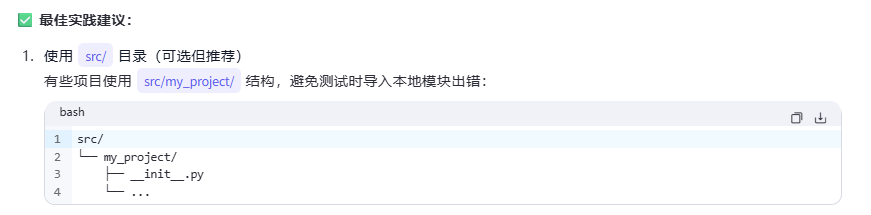

## 核心结构概览

在深入探讨每个部分之前，这里是一个标准项目结构的高度概括，分为“基础必备”和“推荐包含”两部分。

```plaintext
/my-awesome-project
├── .gitignore          # 必备：告诉 Git 忽略哪些文件
├── LICENSE             # 必备：项目许可证
├── README.md           # 必备：项目介绍和说明
├── package.json        # 必备：依赖管理 (示例为 Node.js)
├── src/                # 必备：存放所有源代码
│   └── ...
└── tests/              # 必备：存放所有测试代码
    └── ...

├── .github/            # 推荐：CI/CD 工作流 (例如 GitHub Actions)
├── config/             # 推荐：存放配置文件
├── dist/               # 推荐：存放编译后的输出文件
├── docs/               # 推荐：存放项目文档
└── scripts/            # 推荐：存放自动化脚本
```

---

一个标准的软件项目结构，能够帮助团队成员快速理解项目，降低维护成本，并促进协作。虽然不同语言和框架的项目结构有所差异，但一些通用的最佳实践和目录结构是相通的。本文将介绍一个典型的、与语言无关的软件项目结构。

## 为什么项目结构很重要？

一个良好定义的项目结构可以：

*   **提高可读性**：新人可以快速找到他们需要的文件。
*   **促进协作**：统一的结构让团队成员更容易协作开发和进行代码审查。
*   **简化维护**：当所有东西都在可预测的位置时，调试和添加新功能会更容易。
*   **自动化**：清晰的结构便于设置构建、测试和部署的自动化脚本。

---

## 顶层文件

项目根目录通常包含一些元数据文件，用于描述项目、配置环境和定义依赖。

*   `README.md`：项目的入口。它应该包含项目的简介、如何安装和运行、如何贡献等信息。这是一个项目最重要的文档。
*   `LICENSE`：软件许可证文件，例如 MIT、Apache 2.0 或 GPL。它告诉其他人他们可以使用你的代码做什么。
*   `.gitignore`：告诉 Git 哪些文件或目录应该被忽略，不纳入版本控制。例如编译产生的文件（`build/`, `dist/`）、依赖包（`node_modules/`）和敏感信息（`.env`）。
*   **依赖管理文件**：
    *   `package.json` (Node.js)
    *   `requirements.txt` or `pyproject.toml` (Python)
    *   `pom.xml` or `build.gradle` (Java/Kotlin)
    *   `go.mod` (Go)
    *   `Cargo.toml` (Rust)
    这个文件定义了项目所需的第三方库和依赖项。
*   **CI/CD 配置文件**:
    *   `.github/workflows/` (GitHub Actions)
    *   `.gitlab-ci.yml` (GitLab CI/CD)
    *   `Jenkinsfile` (Jenkins)
    这些文件定义了持续集成和持续部署的流程。

---

## 核心目录结构

### 1. `src` 或 `lib` - 源代码

这是项目的心脏，包含了所有的核心业务逻辑。

*   **`src` (Source)**: 这个命名最常见。所有你写的源代码都应该放在这里。
*   **`lib` (Library)**: 在某些项目中（特别是库项目）会使用 `lib`。

`src` 目录内部的组织方式通常有两种：

*   **按层组织 (Layer-based)**:
    ```
    src/
    ├── controllers/  # 或 routes/ - 处理HTTP请求
    ├── services/     # 业务逻辑
    ├── models/       # 数据模型或数据库实体
    ├── repositories/ # 数据访问层
    └── utils/        # 通用工具函数
    ```
*   **按功能组织 (Feature-based)**:
    ```
    src/
    ├── user/
    │   ├── user.controller.ts
    │   ├── user.service.ts
    │   └── user.model.ts
    ├── product/
    │   ├── product.controller.ts
    │   ├── product.service.ts
    │   └── product.model.ts
    └── auth/
        ├── auth.controller.ts
        └── auth.service.ts
    ```
    对于大型项目，按功能组织通常更具扩展性。

### 2. `tests` - 测试代码

测试是保证软件质量的关键。`tests` 目录存放所有的测试代码。

```
tests/
├── unit/         # 单元测试，测试单个函数或模块
│   ├── services/
│   └── utils/
├── integration/  # 集成测试，测试多个模块协同工作
└── e2e/          # 端到端测试，模拟真实用户场景
```

有些项目会将测试文件和源代码文件放在一起，例如 `user.service.ts` 和 `user.service.spec.ts`。这两种方式各有优劣，关键是保持一致性。

### 3. `docs` - 文档

存放项目的所有文档。

*   **API 文档**: 使用 Swagger/OpenAPI 规范自动生成，或手动编写。
*   **架构设计**: 描述系统架构、组件和数据流。
*   **贡献指南**: `CONTRIBUTING.md` 也可以放在根目录。
*   **用户手册**: 如果是提供给最终用户的软件。

### 4. `dist` 或 `build` - 构建输出

存放编译、打包或压缩后的文件。这些文件是最终部署到生产环境或分发给用户的。这个目录通常会被添加到 `.gitignore` 中，因为它可以从源代码重新生成。

### 5. `config` - 配置文件

存放项目的配置文件。一个好的实践是为不同环境（开发、测试、生产）提供不同的配置文件。

```
config/
├── default.json
├── development.json
├── production.json
└── test.json
```
**注意**：永远不要将密码、API 密钥等敏感信息硬编码在代码或配置文件中，并提交到版本库。使用环境变量（如 `.env` 文件）来管理这些信息。`.env` 文件应该被添加到 `.gitignore` 中，但可以提供一个 `.env.example` 文件作为模板。

### 6. `scripts` - 脚本

存放用于自动化任务的脚本。

*   `build.sh`: 构建项目。
*   `deploy.sh`: 部署项目。
*   `db_migration.sh`: 数据库迁移。
*   `ci_check.sh`: CI/CD 流程中运行的检查。

### 7. `assets` 或 `public` - 静态资源

对于 Web 应用，这个目录用于存放静态文件，如图片、CSS 和 JavaScript 文件。

### 8. `examples` - 示例代码

如果你的项目是一个库或框架，提供一个 `examples` 目录会非常有帮助。它向用户展示了如何使用你的库。

---

## 完整的项目结构示例

### 通用 Web 应用项目结构示例：

```
my-awesome-project/
├── .github/
│   └── workflows/
│       └── ci.yml
├── config/
│   ├── default.json
│   └── production.json
├── docs/
│   ├── api/
│   └── architecture.md
├── scripts/
│   ├── build.sh
│   └── deploy.sh
├── src/
│   ├── auth/
│   │   ├── auth.controller.js
│   │   └── auth.service.js
│   ├── user/
│   │   ├── user.controller.js
│   │   ├── user.service.js
│   │   └── user.model.js
│   └── app.js
├── tests/
│   ├── integration/
│   │   └── auth.integration.test.js
│   └── unit/
│       └── user.service.test.js
├── .env.example
├── .gitignore
├── LICENSE
├── package.json
└── README.md
```

### 通用python应用项目结构示例


```text
my_project/
│
├── my_project/                  # 源代码包（Python 包）
│   ├── __init__.py             # 使目录成为 Python 包
│   ├── main.py                 # 应用入口（可选）
│   ├── cli.py                  # 命令行接口（可选）
│   ├── config.py               # 配置文件
│   ├── models/                 # 数据模型（如数据库模型）
│   │   └── __init__.py
│   ├── services/               # 业务逻辑
│   │   └── __init__.py
│   ├── utils/                  # 工具函数
│   │   └── __init__.py
│   └── tests/                  # 单元测试（可选放外面，见下）
│       ├── __init__.py
│       ├── test_models.py
│       └── test_services.py
│
├── tests/                       # 推荐：测试放在项目根目录下
│   ├── __init__.py
│   ├── test_main.py
│   └── test_cli.py
│
├── docs/                        # 文档
│   └── index.rst
│
├── scripts/                     # 部署或辅助脚本
│   └── deploy.sh
│
├── examples/                    # 使用示例
│   └── example_usage.py
│
├── .gitignore                   # Git 忽略文件
├── .python-version              # pyenv 使用（可选）
├── pyproject.toml               # 推荐：现代 Python 项目配置（替代 setup.py）
├── setup.cfg                    # 或 setup.py（传统方式）
├── requirements.txt             # 依赖列表（开发/生产）
├── requirements-dev.txt         # 开发依赖
├── README.md                    # 项目说明
├── LICENSE                      # 开源许可证
└── CHANGELOG.md                 # 版本变更日志（可选）
```

## 结论

一个清晰、一致的项目结构是成功软件项目的基石。它不仅能让当前项目受益，还能为未来的项目提供一个良好的模板。虽然本文提供了一个通用的指南，但最重要的是根据你的项目类型、团队规模和技术栈来调整和优化，并确保整个团队都遵循这个约定。
