## Qwen - chat
### 模型部署
1. 下载源码    项目地址：https://github.com/QwenLM/Qwen

git clone https://github.com/QwenLM/Qwen.git
2. 配置环境   
  - 虚拟环境
  - 安装相关的库
pip install -r requirements.txt    
3.  去modelspace或者github下面模型文件
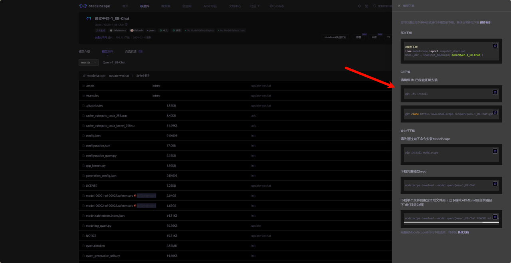
git lfs install  # 首先需要确保git lfs已经安装，安装方式：apt-get install git-lfs
git clone https://www.modelscope.cn/qwen/Qwen-1_8B-Chat.git


4. 修改web_demo.py中的模型文件地址，然后运行  python web_demo.py
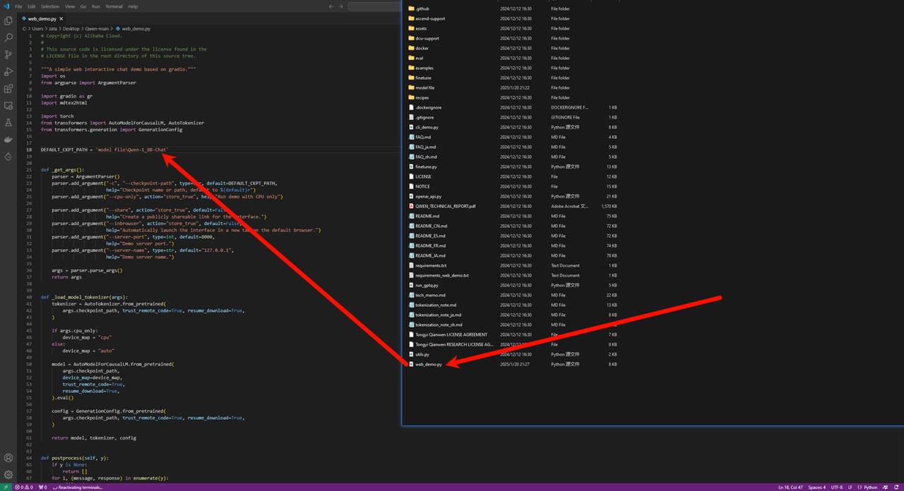

注意，可能碰到问题：
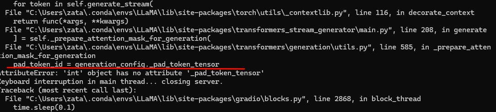
这个问题是由于安装的库不对导致的


### 模型微调
1. 找到对应的数据集
这里使用的是法律的数据集：https://modelscope.cn/datasets/Robin021/DISC-Law-SFT/files
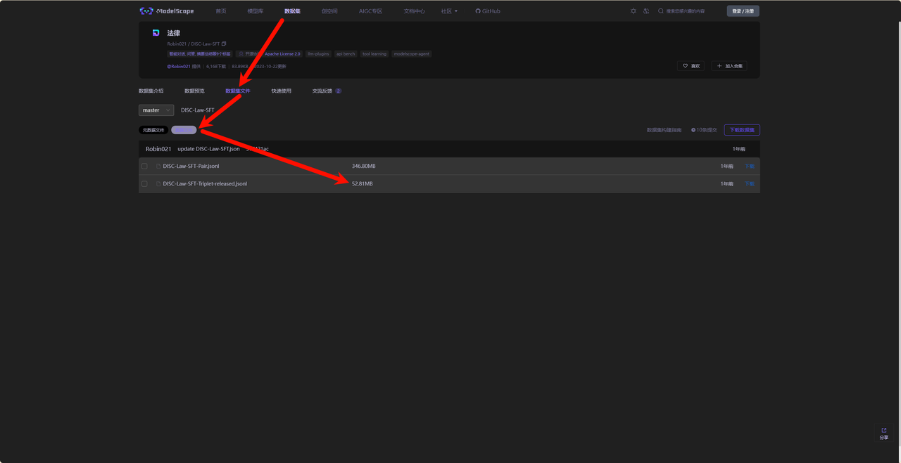
2. 在Qwen的文件里面新建一个Data文件夹
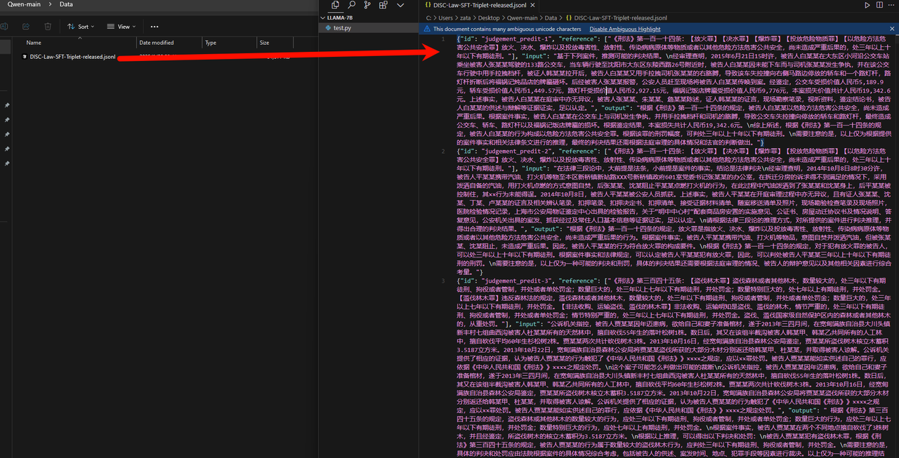
3. 使用脚本把数据重新处理
``` py

import json
json_data = []
with open('DISC-Law-SFT-Triplet-released.jsonl', 'r', encoding='utf-8') as f:
    for line in f:
        json_data.append(json.loads(line))

template = []

for idx, data in enumerate(json_data):
    conversation = [
        {
            "from": "user",
            "value": data['input']
        },
        {
            "from": "assistant",
            "value": data['output']
        }
    ]
    template.append({
                     "id":f"identity_{idx}",
                     "conversations": conversation
                     })
    
print(len(template))
print(json.dumps(template[2], indent=2, ensure_ascii=False))
output_file = 'DISC-train-data.json'
with open(output_file, 'w', encoding='utf-8') as f:
    json.dump(template, f, indent=2, ensure_ascii=False)
print(f"Data saved to {output_file}")

```

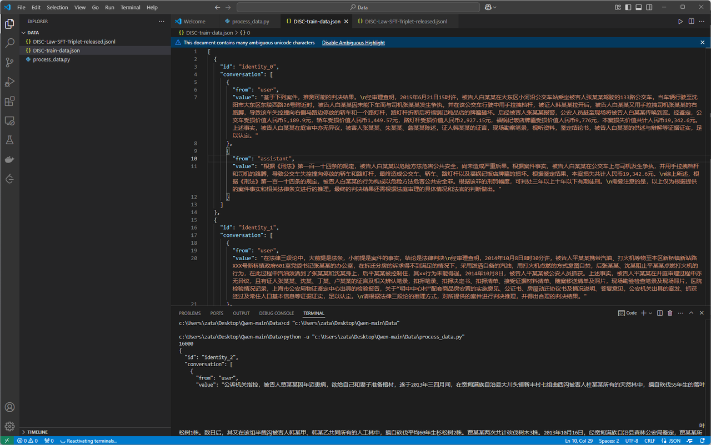
4. 安装模型训练用的依赖
pip install "peft<0.8.0" deepspeed
注意：可能会安装失败（一般是在Windows系统里面或者没有GPU）
  1. 缺失cpuinfo ： pip install py-cpuinfo
  2. aio.lib 缺失   参考：https://blog.csdn.net/dalaomanzou/article/details/137188431

```bash
set DS_BUILD_AIO=0
set DS_BUILD_EVOFORMER_ATTN=0
set DS_BUILD_OPS=0
set DS_BUILD_SPARSE_ATTN=0
pip install deepspeed==0.3.16  # 注意版本，新版本不支持了
```


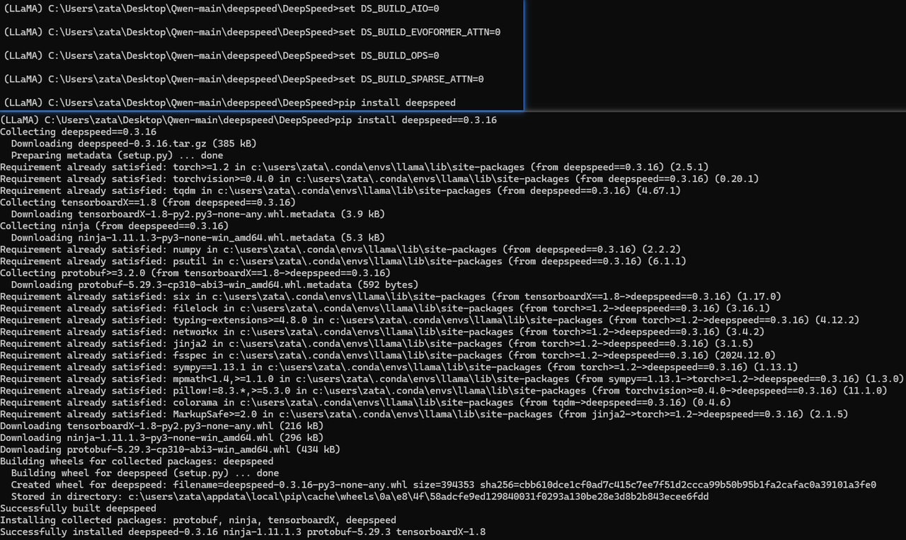
如果还是会出现问题，就换环境吧

5. 修改微调文件  finetune\finetune_lora_single_gpu.sh 中的MODEL和DATA变量
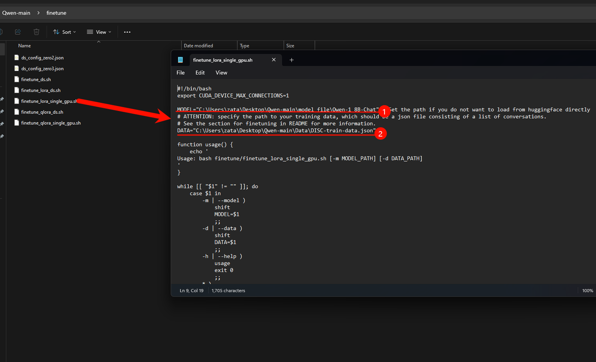

6. 运行 bash  finetune\finetune_lora_single_gpu.sh 就可以开始微调了（这个微调就必须要硬件设备达到，达不到硬件设备是跑不起来的）
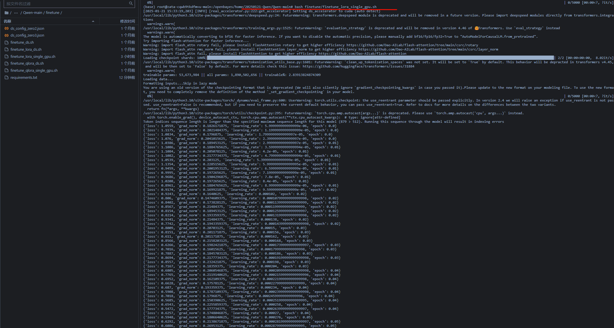
7. 微调好之后的模型会存储在项目文件夹下的output_qwen文件夹下面，会按照epoch次数存储多个检查点文件夹
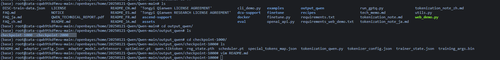
8. 下一步需要把训练好的lora模型和原始模型合并，这里我写了一个用于合并的代码
```py
# 导入PEFT库中的AutoPeftModelForCausalLM类，用于加载和合并模型
from peft import AutoPeftModelForCausalLM

# 设置adapter模型的路径
path_to_adapter = "/openbayes/home/20250121-Qwen/Qwen-main/output_qwen/checkpoint-1000"
# 设置合并后模型的保存路径
new_model_path = "/openbayes/home/20250121-Qwen/Qwen-main/law_model-chat"  # load model

# 加载adapter模型，设置device_map为auto自动分配设备，允许使用远程代码，并设置为评估模式
model = AutoPeftModelForCausalLM.from_pretrained(path_to_adapter, device_map="auto",trust_remote_code=True).eval()
# 合并adapter和基础模型
merged_model = model.merge_and_unload()

# 保存合并后的模型，设置最大分片大小为2048MB，使用安全序列化
merged_model.save_pretrained(new_model_path,max_shard_size="2048MB",safe_serialization=True)

# 保存分词器
# 导入AutoTokenizer用于处理分词
from transformers import AutoTokenizer
# 从adapter模型路径加载分词器，允许使用远程代码
tokenizer = AutoTokenizer.from_pretrained(path_to_adapter,trust_remote_code=True)
# 将分词器保存到新模型路径
tokenizer.save_pretrained(new_model_path)

```

创建merge_model.py,运行代码
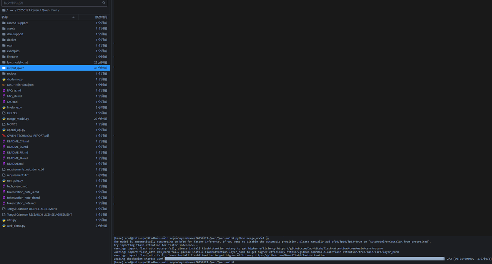
9. 然后修改推理模型进行推理
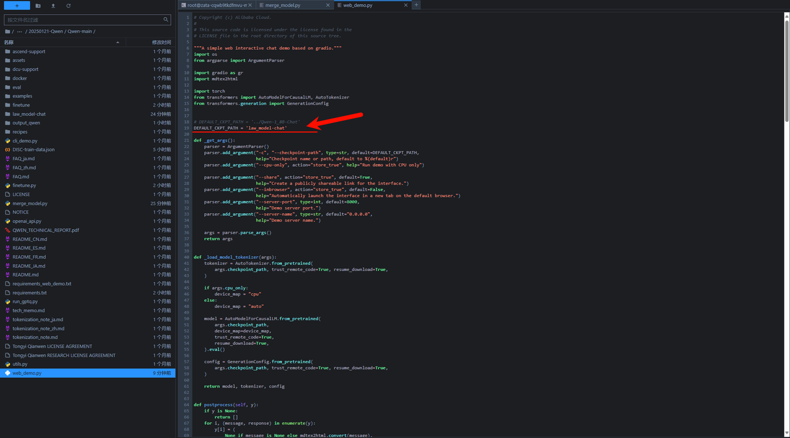
还是和之前一样，运行python web_demo.py

- 在这个过程中我遇到了一个问题，发现是transformers-stream-generator库的问题，在微调的时候我安装的这个库和推理的时候这个库不一致
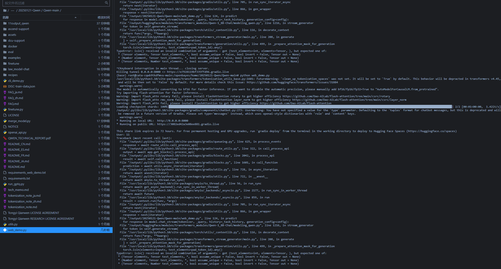