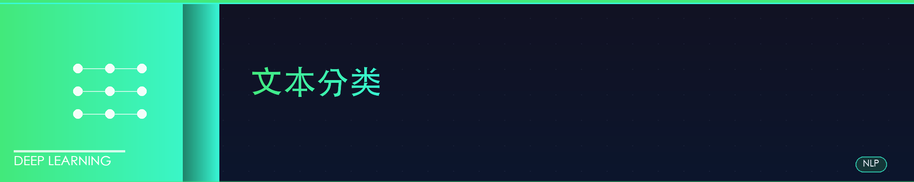
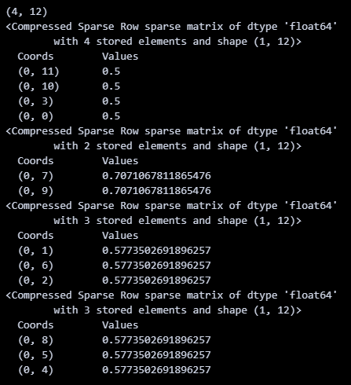

## 基础概念


### **什么是文本分类？**
文本分类是自然语言处理（NLP）中的一个核心任务，目的是将一段文本分配到一个或多个预定义的类别中。例如：
- **情感分析**：判断文本是“正面”、“负面”还是“中性”。
- **垃圾邮件检测**：判断邮件是“垃圾邮件”还是“正常邮件”。
- **主题分类**：将新闻分为“体育”、“科技”、“政治”等。

---

### **文本分类的基本流程**
1. **数据准备**：收集并标注文本数据。
2. **文本预处理**：清洗和转换文本，使其适合机器学习模型。
3. **特征提取**：将文本转化为数值形式（如词袋模型或词嵌入）。
4. **模型训练**：选择并训练一个分类模型。
5. **评估与优化**：测试模型性能并改进。

---

## scikit-learn 框架

### **步骤详解与代码示例**
以下基于 Python，使用 `scikit-learn` 库实现一个简单的文本分类任务。我们以情感分析为例，区分“正面”和“负面”评论。

#### **1. 数据准备**
假设我们有以下小型数据集：
```python
# 示例数据
texts = [
    "这个电影太棒了，值得一看！",
    "服务很好，我很满意。",
    "剧情很无聊，太差了。",
    "浪费时间，完全不好看。"
]
labels = ["正面", "正面", "负面", "负面"]  # 对应的标签
```

#### **2. 文本预处理**
中文文本需要分词（英文通常只需小写化和去标点）。我们使用 `jieba` 库进行中文分词。
```python
import jieba

# 分词函数
def preprocess(text):
    return " ".join(jieba.cut(text))  # 分词后用空格连接

# 应用到数据
processed_texts = [preprocess(text) for text in texts]
print(processed_texts)
# 输出示例: ['这个 电影 太棒了 ， 值得 一看 ！', ...]
```



#### **3. 特征提取**
将文本转化为数值表示。这里使用 TF-IDF（词频-逆文档频率）方法。
```python
from sklearn.feature_extraction.text import TfidfVectorizer

# 初始化 TF-IDF 向量化器
vectorizer = TfidfVectorizer()

# 转换为 TF-IDF 特征矩阵
X = vectorizer.fit_transform(processed_texts)
print(X.shape)  # 输出矩阵形状，例如 (4, 15)
print(X[0])
print(X[1])
print(X[2])
print(X[3])
```



#### **4. 模型训练**
使用一个简单的分类器，比如逻辑回归。
```python
from sklearn.linear_model import LogisticRegression

# 初始化模型
model = LogisticRegression()

# 训练模型
model.fit(X, labels)
```

#### **5. 测试与预测**
用训练好的模型预测新文本的情感。
```python
# 新文本
new_texts = ["这个产品真不错！", "太差了，不推荐。"]
new_processed = [preprocess(text) for text in new_texts]
new_X = vectorizer.transform(new_processed)

# 预测
predictions = model.predict(new_X)
print(predictions)  # 输出: ['正面', '负面']
```

#### **6. 评估模型（可选）**
如果有更多数据，可以拆分为训练集和测试集，用准确率等指标评估模型。
```python
from sklearn.model_selection import train_test_split
from sklearn.metrics import accuracy_score

# 拆分数据
X_train, X_test, y_train, y_test = train_test_split(X, labels, test_size=0.25, random_state=42)

# 训练与预测
model.fit(X_train, y_train)
y_pred = model.predict(X_test)

# 计算准确率
print("准确率:", accuracy_score(y_test, y_pred))
```

---

### **进阶建议**
1. **更复杂的模型**：
   - 试试支持向量机（SVM）：`from sklearn.svm import SVC`
   - 或深度学习模型（如 LSTM），使用 `TensorFlow` 或 `PyTorch`。
2. **词嵌入**：
   - 用预训练模型（如 `word2vec` 或 `BERT`）替代 TF-IDF，提升效果。
   - 对于中文，可以用 `transformers` 库加载中文 BERT。
3. **中文处理优化**：
   - 去停用词（如“的”、“了”），提高特征质量。
   - 使用更大的数据集，比如从网络爬取评论。

---

### **工具与资源**
- **Python 库**：`scikit-learn`, `jieba`, `transformers`
- **数据集**：可以从 Kaggle 或中文 NLP 数据集（如微博情感数据集）获取。
- **学习资料**：推荐《Natural Language Processing with Python》或在线课程。

---


## transformers 框架


---

### 中文情感分类实例

示例文件：

[ChnSentiCorp_htl_all.csv](images/ChnSentiCorp_htl_all.csv)    
[metric_f1](images/metric_f1.py)   
[metric_accuracy](images/metric_accuracy.py)


#### 1. 环境准备
确保已安装必要的库。如果没有安装，请运行以下命令：

```bash
pip install transformers torch datasets evaluate
```

- `evaluate`: 用于加载和计算评估指标（如准确率和F1分数）。

#### 2. Step 1: 导入相关包
我们需要导入Transformers的核心模块、`datasets`用于数据加载，以及`torch`用于张量操作。

```python
from transformers import AutoTokenizer, AutoModelForSequenceClassification, Trainer, TrainingArguments, DataCollatorWithPadding, pipeline
from datasets import load_dataset
import torch
import evaluate
```

#### 3. Step 2: 加载数据集
你提供的代码使用本地CSV文件`ChnSentiCorp_htl_all.csv`，这是一个中文酒店评论情感分类数据集。我们假设CSV文件格式为：

- `review`: 评论文本。
- `label`: 情感标签（0表示差评，1表示好评）。

加载并过滤掉`review`为空的数据：

```python
dataset = load_dataset("csv", data_files="./ChnSentiCorp_htl_all.csv", split="train")
dataset = dataset.filter(lambda x: x["review"] is not None)
print(dataset)
```

输出示例：
```
Dataset({
    features: ['review', 'label'],
    num_rows: 7766  # 数据行数取决于你的文件
})
```

#### 4. Step 3: 划分数据集
将数据集分为训练集和测试集（例如90%训练，10%测试）：

```python
datasets = dataset.train_test_split(test_size=0.1)
print(datasets)
```

输出示例：
```
DatasetDict({
    train: Dataset({
        features: ['review', 'label'],
        num_rows: 6989
    })
    test: Dataset({
        features: ['review', 'label'],
        num_rows: 777
    })
})
```

#### 5. Step 4: 数据集预处理
使用`hfl/chinese-macbert-large`的预训练分词器对中文文本进行分词和编码。

```python
tokenizer = AutoTokenizer.from_pretrained("hfl/chinese-macbert-large")

def process_function(examples):
    tokenized_examples = tokenizer(examples["review"], max_length=32, truncation=True, padding="max_length")
    tokenized_examples["labels"] = examples["label"]  # 将"label"重命名为"labels"，Trainer需要此字段
    return tokenized_examples

tokenized_datasets = datasets.map(process_function, batched=True, remove_columns=datasets["train"].column_names)
print(tokenized_datasets)
```

- `max_length=32`: 限制输入长度为32个token，适合短文本任务，可根据需要调整。
- `remove_columns`: 删除原始列（如`review`和`label`），保留分词后的字段（如`input_ids`、`attention_mask`和`labels`）。

输出示例：
```
DatasetDict({
    train: Dataset({
        features: ['input_ids', 'token_type_ids', 'attention_mask', 'labels'],
        num_rows: 6989
    })
    test: Dataset({
        features: ['input_ids', 'token_type_ids', 'attention_mask', 'labels'],
        num_rows: 777
    })
})
```

#### 6. Step 5: 创建模型
加载`hfl/chinese-macbert-large`预训练模型，指定分类任务的类别数（2类：差评和好评）。

```python
model = AutoModelForSequenceClassification.from_pretrained("hfl/chinese-macbert-large", num_labels=2)
```

#### 7. Step 6: 创建评估函数
使用`evaluate`库加载准确率和F1分数指标，并定义评估函数。

```python
acc_metric = evaluate.load("accuracy")  # 如果网络不好，可用本地文件加载
f1_metric = evaluate.load("f1")

def eval_metric(eval_predict):
    predictions, labels = eval_predict
    predictions = predictions.argmax(axis=-1)  # 取最大概率的类别
    acc = acc_metric.compute(predictions=predictions, references=labels)
    f1 = f1_metric.compute(predictions=predictions, references=labels, average="binary")
    return {"accuracy": acc["accuracy"], "f1": f1["f1"]}
```

- 如果网络不佳，可以下载`metric_accuracy.py`和`metric_f1.py`脚本本地加载（从Hugging Face的`evaluate`库获取）。

#### 8. Step 7: 创建TrainingArguments
定义训练参数，控制训练过程。

```python
train_args = TrainingArguments(
    output_dir="./results",              # 模型保存路径
    evaluation_strategy="epoch",         # 每轮评估一次
    save_strategy="epoch",               # 每轮保存一次
    learning_rate=2e-5,                  # 学习率
    per_device_train_batch_size=16,      # 训练批次大小
    per_device_eval_batch_size=16,       # 验证批次大小
    num_train_epochs=3,                  # 训练轮数
    weight_decay=0.01,                   # 权重衰减
    logging_dir="./logs",                # 日志保存路径
    logging_steps=10,                    # 每10步记录一次日志
    load_best_model_at_end=True,         # 训练结束时加载最佳模型
    metric_for_best_model="f1",          # 以F1分数选择最佳模型
)
```

- `load_best_model_at_end=True`: 确保训练结束后加载在验证集上表现最好的模型。

#### 9. Step 8: 创建Trainer
初始化`Trainer`，并结合参数冻结和数据整理器。

```python
# 参数冻结（可选，仅微调分类头）
for name, param in model.bert.named_parameters():
    param.requires_grad = False  # 冻结BERT部分参数，节省计算资源

# 数据整理器，动态填充批次
data_collator = DataCollatorWithPadding(tokenizer=tokenizer)

trainer = Trainer(
    model=model,
    args=train_args,
    train_dataset=tokenized_datasets["train"],
    eval_dataset=tokenized_datasets["test"],
    data_collator=data_collator,
    compute_metrics=eval_metric,
)
```

- **参数冻结**: 冻结BERT主干，仅训练分类层，适合资源有限或数据量较小的场景。若需全参数微调，可删除冻结代码。
- `DataCollatorWithPadding`: 动态填充批次中的序列长度，提高效率。

#### 10. Step 9: 模型训练与评估
开始训练并在测试集上评估模型。

```python
# 训练模型
trainer.train()

# 评估模型
eval_results = trainer.evaluate(tokenized_datasets["test"])
print("评估结果:", eval_results)

# 预测测试集
predictions = trainer.predict(tokenized_datasets["test"])
print("预测结果示例:", predictions.predictions[:5])  # 查看前5个预测logits
```

#### 11. Step 10: 模型预测
对新句子进行推理，提供两种方式：手动推理和使用`pipeline`。

**手动推理**：
```python
sen = "我觉得这家酒店不错，饭很好吃！"
id2_label = {0: "差评！", 1: "好评！"}
model.eval()
with torch.inference_mode():
    inputs = tokenizer(sen, return_tensors="pt")
    inputs = {k: v.to("cuda") for k, v in inputs.items()}  # 如果有GPU
    logits = model(**inputs).logits
    pred = torch.argmax(logits, dim=-1)
    print(f"输入：{sen}\n模型预测结果:{id2_label[pred.item()]}")
```

**使用Pipeline**：
```python
model.config.id2label = id2_label  # 为pipeline设置标签映射
pipe = pipeline("text-classification", model=model, tokenizer=tokenizer, device=0)  # device=0表示GPU
result = pipe(sen)
print(f"输入：{sen}\nPipeline预测结果:{result}")
```

输出示例：
```
输入：我觉得这家酒店不错，饭很好吃！
模型预测结果:好评！
Pipeline预测结果:[{'label': '好评！', 'score': 0.95}]
```

#### 12. 完整代码示例
以下是将所有步骤整合的完整脚本：

```python
from transformers import AutoTokenizer, AutoModelForSequenceClassification, Trainer, TrainingArguments, DataCollatorWithPadding, pipeline
from datasets import load_dataset
import torch
import evaluate

# Step 2: 加载数据集
dataset = load_dataset("csv", data_files="./ChnSentiCorp_htl_all.csv", split="train")
dataset = dataset.filter(lambda x: x["review"] is not None)

# Step 3: 划分数据集
datasets = dataset.train_test_split(test_size=0.1)

# Step 4: 数据集预处理
tokenizer = AutoTokenizer.from_pretrained("hfl/chinese-macbert-large")
def process_function(examples):
    tokenized_examples = tokenizer(examples["review"], max_length=32, truncation=True, padding="max_length")
    tokenized_examples["labels"] = examples["label"]
    return tokenized_examples
tokenized_datasets = datasets.map(process_function, batched=True, remove_columns=datasets["train"].column_names)

# Step 5: 创建模型
model = AutoModelForSequenceClassification.from_pretrained("hfl/chinese-macbert-large", num_labels=2)

# Step 6: 创建评估函数
acc_metric = evaluate.load("accuracy")
f1_metric = evaluate.load("f1")
def eval_metric(eval_predict):
    predictions, labels = eval_predict
    predictions = predictions.argmax(axis=-1)
    acc = acc_metric.compute(predictions=predictions, references=labels)
    f1 = f1_metric.compute(predictions=predictions, references=labels, average="binary")
    return {"accuracy": acc["accuracy"], "f1": f1["f1"]}

# Step 7: 创建TrainingArguments
train_args = TrainingArguments(
    output_dir="./results",
    evaluation_strategy="epoch",
    save_strategy="epoch",
    learning_rate=2e-5,
    per_device_train_batch_size=16,
    per_device_eval_batch_size=16,
    num_train_epochs=3,
    weight_decay=0.01,
    logging_dir="./logs",
    logging_steps=10,
    load_best_model_at_end=True,
    metric_for_best_model="f1",
)

# Step 8: 创建Trainer
for name, param in model.bert.named_parameters():
    param.requires_grad = False  # 参数冻结
data_collator = DataCollatorWithPadding(tokenizer=tokenizer)
trainer = Trainer(
    model=model,
    args=train_args,
    train_dataset=tokenized_datasets["train"],
    eval_dataset=tokenized_datasets["test"],
    data_collator=data_collator,
    compute_metrics=eval_metric,
)

# Step 9: 模型训练与评估
trainer.train()
eval_results = trainer.evaluate(tokenized_datasets["test"])
print("评估结果:", eval_results)

# Step 10: 模型预测
sen = "我觉得这家酒店不错，饭很好吃！"
id2_label = {0: "差评！", 1: "好评！"}
model.eval()
with torch.inference_mode():
    inputs = tokenizer(sen, return_tensors="pt")
    inputs = {k: v.to("cuda") for k, v in inputs.items()}
    logits = model(**inputs).logits
    pred = torch.argmax(logits, dim=-1)
    print(f"输入：{sen}\n模型预测结果:{id2_label[pred.item()]}")

# 使用Pipeline预测
model.config.id2label = id2_label
pipe = pipeline("text-classification", model=model, tokenizer=tokenizer, device=0)
print(f"Pipeline预测结果:{pipe(sen)}")
```

---

#### 补充说明
1. **数据集下载**: 如果没有`ChnSentiCorp_htl_all.csv`，可从网上下载（如https://github.com/pengming617/bert_classification）。
2. **硬件需求**: `chinese-macbert-large`模型较大，建议使用GPU运行。若无GPU，可减小`max_length`或使用更小的模型（如`bert-base-chinese`）。
3. **参数调整**: 若数据量较大，可取消参数冻结（删除`requires_grad = False`），进行全参数微调。
4. **保存模型**: 训练完成后，模型会自动保存到`./results`目录，可用`trainer.save_model()`手动保存。

---
