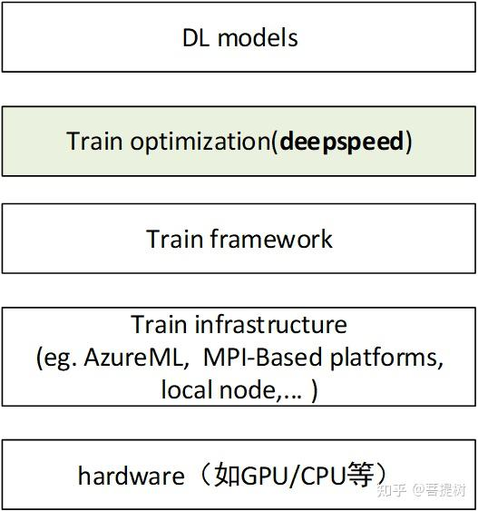

### DeepSpeed 教程

#### 什么是 DeepSpeed？

DeepSpeed 是一个开源深度学习优化库，专为分布式训练和大规模模型设计。它提供了多种工具和技术，如 ZeRO（零冗余优化器）、混合精度训练和高效的并行策略，帮助开发者在 GPU 上更快、更高效地训练模型。DeepSpeed 的主要目标是降低内存占用并提升训练速度，特别适用于超大型语言模型（LLM）。   
deepspeed在深度学习模型软件体系架构中所处的位置是？



#### 核心功能

- **ZeRO（零冗余优化器）**：通过分割优化器状态、分梯度和参数，减少内存冗余，支持更大的模型。
- **混合精度训练**：结合 FP16 和 BF16，加速计算并减少内存需求。
- **分布式训练支持**：支持数据并行、模型并行和流水线并行。
- **高效激活检查点**：优化内存使用，允许更大的批量大小。
- **超大模型支持**：能够训练超过千亿参数的模型。

#### 安装 DeepSpeed

在开始使用 DeepSpeed 之前，需要安装它。以下是安装步骤：

1. **确保环境准备**：
   - Python 3.6 或更高版本
   - PyTorch（建议最新稳定版）
   - CUDA（与 PyTorch 兼容的版本）

2. **通过 pip 安装 DeepSpeed**：
   ```bash
   pip install deepspeed
   ```

3. **验证安装**：
   运行以下命令检查是否成功安装：
   ```bash
   ds_report
   ```
   这将显示 DeepSpeed 的配置信息和环境兼容性。

#### 集成 DeepSpeed 到 PyTorch

以下是一个简单的例子，展示如何将 DeepSpeed 集成到 PyTorch 训练代码中。

##### 示例代码

```python
import torch
import torch.nn as nn
import deepspeed

# 定义一个简单的模型
class SimpleModel(nn.Module):
    def __init__(self):
        super(SimpleModel, self).__init__()
        self.fc1 = nn.Linear(10, 10)
        self.fc2 = nn.Linear(10, 2)

    def forward(self, x):
        x = torch.relu(self.fc1(x))
        x = self.fc2(x)
        return x

# 初始化模型和数据
model = SimpleModel()
data = torch.randn(32, 10)  # 批量大小 32，输入维度 10
labels = torch.randint(0, 2, (32,))

# 定义 DeepSpeed 配置
ds_config = {
    "train_batch_size": 32,
    "gradient_accumulation_steps": 1,
    "fp16": {
        "enabled": True  # 启用混合精度训练
    },
    "optimizer": {
        "type": "Adam",
        "params": {
            "lr": 0.001
        }
    }
}

# 初始化 DeepSpeed
model_engine, optimizer, _, _ = deepspeed.initialize(
    model=model,
    model_parameters=model.parameters(),
    config=ds_config
)

# 前向传播和反向传播
outputs = model_engine(data)
loss = nn.CrossEntropyLoss()(outputs, labels)
model_engine.backward(loss)
model_engine.step()
```

##### 代码说明

1. **模型定义**：这里使用了一个简单的两层全连接神经网络。
2. **DeepSpeed 配置**：`ds_config` 是一个字典，指定训练参数，如批量大小、优化器类型和混合精度选项。
3. **初始化 DeepSpeed**：`deepspeed.initialize` 将模型和优化器包装为 DeepSpeed 引擎。
4. **训练步骤**：使用 `model_engine` 替代原始 PyTorch 模型进行前向传播、反向传播和参数更新。

#### 配置文件的替代方式

除了在代码中定义 `ds_config`，你还可以创建一个 JSON 文件（例如 `ds_config.json`）：

```json
{
    "train_batch_size": 32,
    "gradient_accumulation_steps": 1,
    "fp16": {
        "enabled": true
    },
    "optimizer": {
        "type": "Adam",
        "params": {
            "lr": 0.001
        }
    }
}
```

然后在初始化时加载：
```python
model_engine, optimizer, _, _ = deepspeed.initialize(
    model=model,
    model_parameters=model.parameters(),
    config="ds_config.json"
)
```

#### 运行分布式训练

要使用多个 GPU 运行训练，只需通过 `deepspeed` 命令启动脚本：
```bash
deepspeed train.py --deepspeed --deepspeed_config ds_config.json
```

确保你的脚本支持分布式环境（例如，使用 `torch.distributed.launch` 或 DeepSpeed 的内置分布式支持）。

#### 高级功能：ZeRO 优化

ZeRO 有三个阶段，可以通过配置启用：
- **ZeRO-1**：分割优化器状态。
- **ZeRO-2**：分割优化器状态和梯度。
- **ZeRO-3**：分割优化器状态、梯度和参数。

示例配置：
```json
{
    "zero_optimization": {
        "stage": 2,
        "allgather_partitions": true,
        "reduce_scatter": true
    }
}
```

#### 注意事项

- **硬件要求**：DeepSpeed 需要 GPU 支持，建议使用 NVIDIA GPU。
- **调试**：如果遇到问题，可以检查 `ds_report` 输出或启用详细日志（`"verbose": true`）。
- **文档参考**：查看 [DeepSpeed 官方文档](https://www.deepspeed.ai/) 获取更多高级用法。

---

