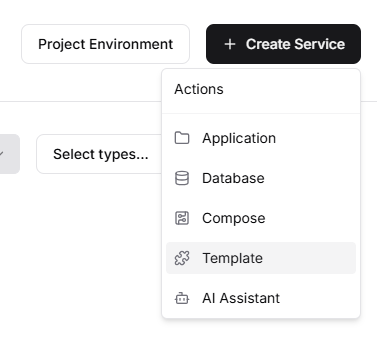
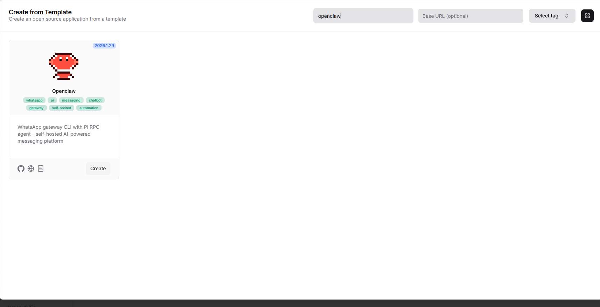
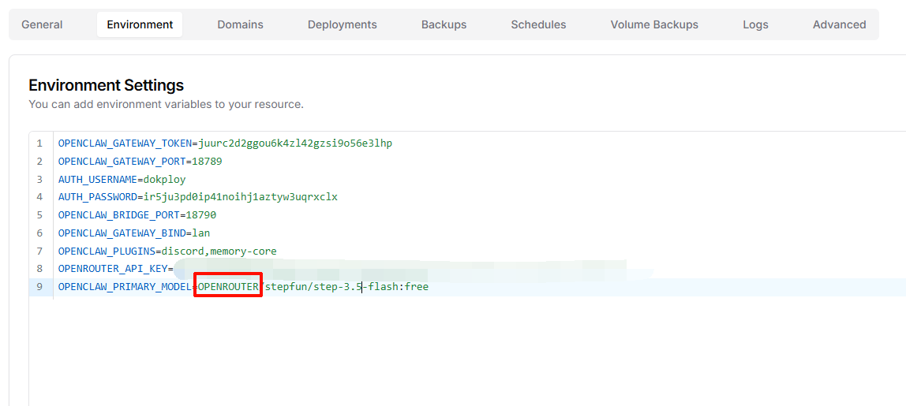

# 部署

**dokploy**

修改env,记得,选择了那个提供商就要写  "提供商/模型名" 

# OpenClaw 能做什么：2026 年顶级 AI 生产力助手

**一、核心能力：它如何彻底改变工作方式**

OpenClaw 不是一个简单的聊天机器人，而是一个**多智能体协作平台**，可以同时协调多个 AI 专家为你工作。

1. **自动化复杂工作流**
   - **智能任务分解**：给它一个复杂项目，它能自动拆解成可执行步骤
   - **并行处理**：多个 AI Agent 同时处理不同子任务
   - **结果整合**：自动汇总所有结果，生成完整交付物

2. **记忆与学习能力**
   - **长期记忆**：记住你的工作习惯、偏好、历史问题
   - **智能检索**：需要时自动调用相关历史信息
   - **持续优化**：越用越了解你，越用越高效

**二、具体能做什么：八大生产力场景**

**场景 1：** **智能编程与代码开发**

它能：
- 编写完整项目代码（全栈开发）
- 自动代码审查和优化
- 生成单元测试（覆盖率 85%+）
- 技术文档自动生成
- Bug 智能诊断和修复建议
- 代码重构和架构优化

> 实例：你说"帮我开发一个电商网站"，它能：
> 1. 设计数据库架构
> 2. 编写后端 API
> 3. 开发前端界面
> 4. 配置部署脚本
> 5. 编写测试用例
> 6. 生成用户手册

**场景 2：** **智能分析与报告生成**

它能：
- 自动收集网络信息（新闻、社交媒体、竞品数据）
- 情感分析和趋势预测
- 生成专业分析报告（市场分析、竞品分析）
- 数据可视化图表生成
- 实时监控和预警

> 实例：你说"分析一下最近 AI 行业的发展趋势"，它能：
> 1. 收集最新行业新闻
> 2. 分析技术发展路径
> 3. 评估市场机会
> 4. 生成图文并茂的报告
> 5. 提供投资建议

**场景 3：** **会议与沟通效率提升**

它能：
- 会议自动转录和摘要（1 小时会议→5 分钟要点）
- 提取行动项并分配责任人
- 自动生成会议纪要
- 后续跟进提醒
- 跨语言实时翻译

> 实例：一次国际团队会议后：
> - 自动生成中英双语纪要
> - 提取 10 个行动项分配给对应人员
> - 同步到 Jira/Trello
> - 设置跟进提醒

**场景 4：** **文档处理自动化**

它能：
- 合同自动审查（找风险条款）
- 技术文档自动编写
- 多格式转换（Word→PDF→Markdown）
- 内容摘要生成
- 多语言翻译

> 实例：一份 50 页技术文档：
> - 5 分钟生成执行摘要
> - 自动检查一致性
> - 生成常见问题解答
> - 翻译成 3 种语言

**场景 5：** **学习与研究加速**

它能：
- 学术论文自动阅读和摘要
- 研究趋势分析
- 知识点脑图生成
- 个性化学习计划
- 智能问答导师

> 实例：研究一个新领域时：
> - 自动阅读 50 篇相关论文
> - 提取核心观点
> - 构建知识图谱
> - 设计学习路线图

**场景 6：** **项目管理自动化**

它能：
- 项目计划自动生成
- 任务分解和排期
- 进度跟踪和预警
- 风险评估
- 资源分配优化

> 实例：启动一个新项目：
> - 自动创建项目计划
> - 分解成 100+ 具体任务
> - 分配时间线
> - 监控风险点
> - 每周自动报告进度

**场景 7：** **创意与内容创作**

它能：
- 营销文案自动生成
- 社交媒体内容规划
- 视频脚本创作
- 广告创意生成
- 品牌故事编写

> 实例：产品发布前：
> - 生成发布会演讲稿
> - 创作 10 篇宣传文章
> - 设计社交媒体活动
> - 编写用户案例研究
> - 生成 FAQ 文档

**场景 8：** **个人效率助手**

它能：
- 日报/周报自动生成
- 邮件智能分类和回复
- 日程智能安排
- 会议准备材料整理
- 旅行计划制定

> 实例：每天工作开始：
> - 自动生成今日重点任务
> - 处理未读邮件（分类 + 草拟回复）
> - 提醒重要会议和准备材料
> - 晚上自动总结日报

**三、跨平台协作能力**

1. **通讯工具集成**
   - **飞书/钉钉**：直接在群里@它完成任务
   - **Slack**：实时协作和提醒
   - **微信/Telegram**：移动端随时使用

2. **开发工具集成**
   - **GitHub**：自动代码审查、PR 处理
   - **Jira/Trello**：任务自动创建和更新
   - **Docker/K8s**：部署脚本自动生成

3. **办公软件集成**
   - **Google Docs/Office**：文档协作
   - **Notion/Confluence**：知识管理
   - **Calendar**：日程管理

**四、多 Agent 团队协作模式**

1. **专家团队模式**
   > 你有专属的专家团队：
   > - 技术专家：负责技术问题
   > - 业务专家：负责商业分析
   > - 设计专家：负责 UI/UX
   > - 文案专家：负责内容创作
   > - 项目经理：协调所有工作

2. **流水线模式**
   > 复杂任务自动流水线处理：
   > 输入 → 分析 → 设计 → 执行 → 测试 → 交付
   > 每个环节由专门 Agent 负责

3. **辩论模式**
   > 重要决策时：
   > - 多个 Agent 从不同角度分析
   > - 进行虚拟"辩论"
   > - 最终给出最优方案

**五、实际应用案例**

1. **案例 1：** **创业公司 CTO 的一天**
   > 早上 9:00：
   > - OpenClaw 自动生成昨日技术日报
   > - 列出今日技术风险点
   >
   > 上午：
   > - 自动审查团队代码提交
   > - 生成架构优化建议
   > - 处理技术债务
   >
   > 下午：
   > - 参与产品讨论，自动记录和总结
   > - 编写技术方案文档
   > - 准备技术分享材料
   >
   > 结果：技术管理工作效率提升 300%

2. **案例 2：** **市场总监的营销活动**
   > 活动前：
   > - 自动分析目标用户画像
   > - 生成营销策略方案
   > - 创作各类宣传素材
   >
   > 活动中：
   > - 实时监控社交媒体反馈
   > - 自动调整投放策略
   > - 生成每日效果报告
   >
   > 活动后：
   > - 自动生成 ROI 分析报告
   > - 总结成功经验和教训
   > - 归档所有素材和文档
   >
   > 结果：营销效果分析时间减少 80%

3. **案例 3：** **学术研究者的研究过程**
   > 文献调研：
   > - 自动搜索相关论文
   > - 提取核心观点和结论
   > - 构建研究脉络图
   >
   > 实验设计：
   > - 协助设计实验方案
   > - 生成实验代码
   > - 设计数据收集方法
   >
   > 论文写作：
   > - 自动生成论文大纲
   > - 协助写作各章节
   > - 格式检查和优化
   >
   > 结果：研究效率提升 200%

**六、独特的竞争优势**

1. **真·智能协作**
   - 不是简单问答，而是真正的团队协作
   - 多个 AI Agent 各司其职
   - 像有了一整个专业团队

2. **记忆与学习**
   - 长期记忆你的偏好
   - 越用越懂你的需求
   - 工作质量持续提升

3. **企业级可靠性**
   - 多模型备份（一个挂了自动切另一个）
   - 任务状态持久化（断电不丢数据）
   - 完整审计日志

**七、适合谁用？**

- ✅ **非常适合**：
  - 创业者/企业家：一人顶一个团队
  - 开发者/工程师：编码效率翻倍
  - 管理者/领导：决策支持 + 团队管理
  - 研究人员/学者：研究加速器
  - 创作者/营销人：内容生产机器

- ⚠️ **需要注意**：
  - 需要一定的技术理解能力
  - 关键决策仍需人工审核
  - 涉及安全信息需谨慎配置

**八、开始使用建议**

- **新手入门（第 1 周）**：
  1. 从**一个具体任务**开始
  2. 体验**智能分解**的能力
  3. 感受**多 Agent 协作**的效果

- **进阶使用（1 个月后）**：
  1. 配置**专属工作流**
  2. 建立**记忆库**
  3. 集成**外部工具**

- **专家级（3 个月后）**：
  1. 定制**专属 Agent 团队**
  2. 自动化**复杂业务流程**
  3. 建立**企业级应用**

---

**一句话总结**：OpenClaw 就像给你配备了一个 24 小时待命的**AI 专家团队**，把一个人变成一个高效的组织，让复杂变简单，让耗时变即时。

**想先了解哪个场景的具体应用？我可以详细介绍那个场景的实战操作。**

