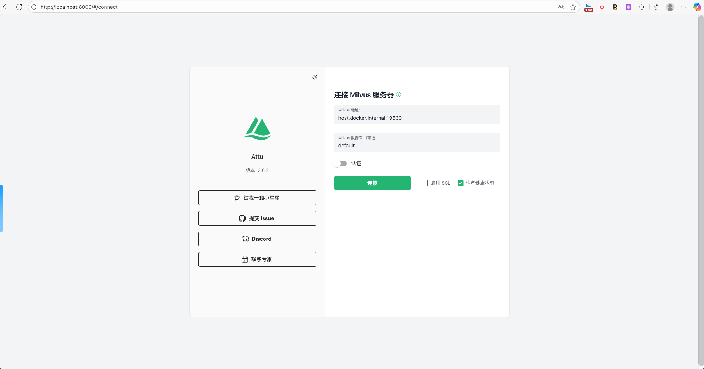
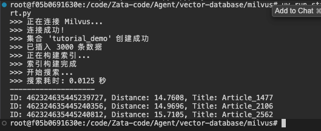
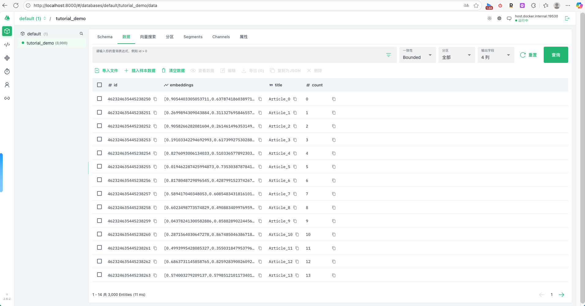
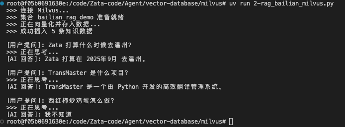
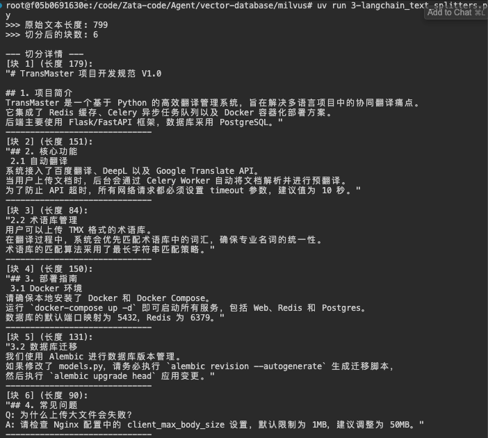
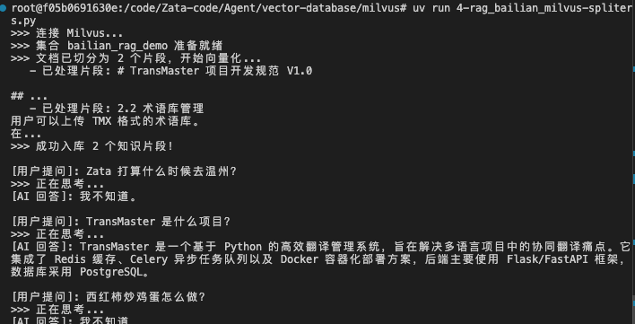

# 向量数据库的教程

[松果](https://www.pinecone.io/learn/vector-database/)


# AI 的“海马体”选型指南：2026 年主流向量数据库全景对比

> **摘要**：在构建 RAG（检索增强生成）和 AI Agent 系统时，向量数据库（Vector Database）充当着“长期记忆”的关键角色。面对市场上琳琅满目的选项——Milvus、Qdrant、Weaviate、pgvector……架构师该如何抉择？本文将从架构轻重、运维成本和适用场景三个维度，为您深度解析主流向量数据库的优劣势。

在构建 RAG（检索增强生成）和 AI Agent 系统时，向量数据库（Vector Database）充当着“长期记忆”的关键角色。通过将文本、图片等非结构化数据转化为高维向量（Embeddings），向量数据库允许我们进行语义搜索。当用户问“还是老规矩”时，系统能从数据库中检索出该用户过去的行为偏好，而不是仅仅匹配关键词。但在 2026 年的今天，选型变得异常困难：是追求极致性能？还是追求开发效率？

我们来聊聊主流的向量数据库，它们各有特色，也有不同的适用场景。以下是第一梯队的原生向量数据库：

Milvus 是全球最流行的开源向量数据库之一，由 Zilliz 主导。

* **核心定位**：企业级、云原生、追求极致扩展性。
* **✅ 核心优势**：
* 十亿级吞吐：分布式架构极其成熟，轻松支撑 Billion-scale（十亿级）向量存储。
* 生态完善：国内社区最活跃，文档支持最好，索引类型（HNSW, IVF 等）丰富。


* **❌ 潜在短板**：
* 架构极重：标准版部署依赖 Etcd（元数据）、MinIO（存储）和 Pulsar/Kafka（消息流）。在 `docker-compose` 中启动它需要拉起 4-5 个容器，运维成本高。
* 资源门槛：起步资源要求较高，不适合 MVP（最小可行性产品）阶段的小微项目。


* **适用场景**：大型互联网应用、核心推荐系统、海量知识库。

Qdrant 是用 Rust 编写的新一代向量数据库，也是许多 Agent 框架的首选。

* **核心定位**：兼顾高性能与易用性，开发者友好。
* **✅ 核心优势**：
* 架构轻量：Rust 编写，内存安全且高效。部署只需**一个 Docker 容器**，无外部依赖。
* 元数据过滤：它的 Payload Filtering 机制非常强大，支持像 MongoDB 一样灵活地过滤 JSON 字段（例如：“查找昨天情绪为‘开心’的对话记忆”）。
* 本地模式：支持 Python 本地内存模式，开发阶段甚至无需启动服务。


* **❌ 潜在短板**：
* 超大规模验证：虽然支持分布式，但在百亿级规模的公开案例略少于 Milvus。


* **适用场景**：AI Agent 记忆系统、中大型 RAG 应用、快速迭代的初创项目。

Weaviate 是一款 AI 原生的向量数据库，具有模块化特性。

* **核心定位**：模块化、对象存储风格。
* **✅ 核心优势**：
* 内置模块：可直接集成 OpenAI/HuggingFace 模型，自动处理 Embedding，无需应用层操心。
* 混合搜索：原生支持 BM25（关键词）+ 向量的混合检索，搜索效果通常优于纯向量。


* **❌ 潜在短板**：
* 学习曲线：使用 GraphQL 接口查询，Schema 定义方式独特，需要一定的上手时间。


* **适用场景**：Notebook 演示、Hackathon、个人知识库。

Chroma 是一款面向 Python 全栈开发者的向量数据库，设计极简。

* **核心定位**：面向 Python 全栈开发者，极简。
* **✅ 核心优势**：
* 上手最快：`pip install chromadb` 即可，API 设计极其简单。


* **❌ 潜在短板**：
* 性能瓶颈：在大规模并发和分布式能力上弱于上述三位“老大哥”。


* **适用场景**：Notebook 演示、Hackathon、个人知识库。

如果你的技术栈已经很成熟，不想引入新的组件，传统数据库的扩展方案可能是更好的选择。

PostgreSQL (pgvector) 是全球最强开源关系型数据库的插件。

* **定位**：全球最强开源关系型数据库的插件。
* **优点**：**单一数据源**。无需在 SQL 数据库和向量库之间同步数据，完美支持 ACID 事务。如果你的数据量在百万级以内，直接开插件是最省事的选择。
* **缺点**：在高并发 QPS 或超高维向量场景下，索引构建速度和查询延迟不如原生向量库。

Elasticsearch (ES) / OpenSearch 是全文检索的王者。

* **定位**：全文检索的王者。
* **优点**：如果你需要极强的**关键词搜索**（BM25）能力，向量检索只是辅助，ES 是不二之选。
* **缺点**：Java 编写，资源消耗大（内存吞噬者），纯向量检索性能并非顶尖。

Redis (RediSearch) 是一款基于内存的数据库。

* **定位**：基于内存的极致速度。
* **优点**：亚毫秒级延迟，适合高频读写的**短期记忆**缓存。
* **缺点**：内存昂贵，存储海量历史数据成本太高。

为了方便大家决策，我整理了这份决策矩阵：

| 你的需求场景 | 推荐选型 | 核心理由 |
| --- | --- | --- |
| **MVP 原型 / 个人开发** | **Chroma** / **Qdrant (Local)** | 代码量最少，环境搭建最快。 |
| **中型生产环境 / 追求性价比** | **Qdrant** | **Rust 高效、Docker 单容器部署、Filter 语法极佳。** (这也是我们 V1.2 架构的首选) |
| **超大规模 / 十亿级数据** | **Milvus** | 经过大规模验证的分布式能力，Zilliz 企业级支持。 |
| **已有 Postgres 且数据量不大** | **pgvector** | 架构最简单，不用维护新数据库。 |
| **强依赖关键词搜索** | **Elasticsearch** | 混合检索生态最强。 |

没有“最好”的数据库，只有“最适合”的架构。

在我们的**“变色龙”进化型对话系统**项目中，我们最终选择了 **Qdrant**。原因很简单：在快速迭代阶段，我们需要一个**部署足够轻量**（不拖累 Docker Compose）、**查询足够灵活**（处理复杂的记忆元数据）且**性能足够强**的组件。Qdrant 完美击中了这三个甜点。


# tutorial

## Milvus

Milvus 专为大规模向量数据的存储、索引和搜索而设计，常用于构建 RAG（检索增强生成）、图像检索、推荐系统等应用。

以下教程将涵盖：**环境部署**、**核心概念**、以及**完整的 Python 代码实战**。

-----

1\. 什么是 Milvus？

Milvus 是一款云原生的向量数据库。它的核心作用是存储“向量”（Embeddings，即由 AI 模型生成的浮点数数组），并利用算法快速找出与查询向量“最相似”的数据。

  * **非结构化数据处理：** 它可以让图片、视频、文本等非结构化数据通过向量化后进行语义搜索。
  * **高性能：** 支持十亿级向量规模的毫秒级搜索。

-----

2\. 环境部署 (基于 Docker)

使用 Docker 是运行 Milvus 最简单、最标准的方式。

 第一步：下载 Docker Compose 文件

在你的终端中执行以下命令，下载官方的单机版配置文件：

```bash
curl -L https://github.com/milvus-io/milvus/releases/download/v2.4.0/milvus-standalone-docker-compose.yml -o docker-compose.yml
```

 第二步：启动 Milvus

```bash
docker-compose up -d
```

启动后，Milvus 会暴露以下端口：

  * **19530**: gRPC 端口（主要用于代码连接）。
  * **9091**: 管理端口。

> **推荐工具：** 建议安装 **Attu** (Milvus 的官方可视化管理界面)，可以通过 Docker 一并安装，方便查看数据。

docker run -p 8000:3000 -e MILVUS_URL=localhost:19530 zilliz/attu:v2.6

[桌面端安装](https://milvus.io/docs/zh/quickstart_with_attu.md)

如果你是使用docker 容器安装在mac或者windows的docker desktop里面，你可以使用host.docker.internal:19530连接



-----

 3\. Python 代码实战

我们将使用 Python SDK (`pymilvus`) 来完成从连接、建表、插入数据到相似度搜索的全过程。

 0\. 安装 SDK

```bash
uv add pymilvus
```

 1\. 完整代码示例

这个脚本模拟了一个场景：我们有 10,000 条文本数据（已转化为向量），我们要找出与某条查询最相似的 3 条数据。

```python
import random
import time
import numpy as np
from pymilvus import (
    connections,
    utility,
    FieldSchema,
    CollectionSchema,
    DataType,
    Collection,
)

# ==========================================
# 1. 连接 Milvus
# ==========================================
print(">>> 正在连接 Milvus...")
connections.connect("default", host="host.docker.internal", port="19530")
print(">>> 连接成功！")

# ==========================================
# 2. 定义集合 (Schema)
# ==========================================
# 类似于关系型数据库中的“表”
collection_name = "tutorial_demo"
dim = 128  # 向量维度 (根据你的 Embedding 模型决定，如 OpenAI text-embedding-3 是 1536)

# 如果集合已存在，先删除（为了演示方便）
if utility.has_collection(collection_name):
    utility.drop_collection(collection_name)

# 定义字段
fields = [
    # 主键 ID (自动增长)
    FieldSchema(name="id", dtype=DataType.INT64, is_primary=True, auto_id=True),
    # 向量字段 (FLOAT_VECTOR)，必须指定维度
    FieldSchema(name="embeddings", dtype=DataType.FLOAT_VECTOR, dim=dim),
    # 元数据字段 (例如文章标题、日期等)
    FieldSchema(name="title", dtype=DataType.VARCHAR, max_length=200),
    FieldSchema(name="count", dtype=DataType.INT64),
]

schema = CollectionSchema(fields, description="Milvus 基础教程演示")
collection = Collection(name=collection_name, schema=schema)

print(f">>> 集合 '{collection_name}' 创建成功")

# ==========================================
# 3. 插入数据 (Insert)
# ==========================================
num_entities = 3000  # 插入 3000 条数据

# 生成随机向量数据模拟 Embeddings
rng = np.random.default_rng(seed=19530)
vectors = rng.random((num_entities, dim), dtype=np.float32) # 生成随机浮点数

# 生成一些元数据
titles = [f"Article_{i}" for i in range(num_entities)]
counts = [i for i in range(num_entities)]

# 组织数据 (列表的顺序必须与 Schema 定义的顺序一致，排除 auto_id 的主键)
# 注意：Milvus 插入数据是列式存储格式 [Column1_List, Column2_List, ...]
data = [
    vectors, # 对应 embeddings
    titles,  # 对应 title
    counts,  # 对应 count
]

insert_result = collection.insert(data)
# 即使插入了，数据还在内存缓冲区，需要 flush 到磁盘才能确保立即可见（生产环境通常不需要手动频繁 flush）
collection.flush() 

print(f">>> 已插入 {insert_result.insert_count} 条数据")

# ==========================================
# 4. 创建索引 (Indexing)
# ==========================================
# 向量搜索如果是暴力搜索 (Flat) 会很慢，必须建立索引。
# IVF_FLAT 是一种基于倒排文件的常见索引。
index_params = {
    "metric_type": "L2",        # 距离度量：L2 (欧氏距离) 或 IP (内积/余弦相似度)
    "index_type": "IVF_FLAT",   # 索引类型
    "params": {"nlist": 128},   # nlist 是聚类中心的数量
}

print(">>> 正在构建索引...")
collection.create_index(field_name="embeddings", index_params=index_params)
print(">>> 索引构建完成")

# ==========================================
# 5. 加载集合 (Load)
# ==========================================
# *关键步骤*：Milvus 必须将集合加载到内存中才能进行搜索
collection.load()

# ==========================================
# 6. 向量搜索 (Search)
# ==========================================
# 模拟一个查询向量
search_vectors = rng.random((1, dim), dtype=np.float32)

# 搜索参数
search_params = {
    "metric_type": "L2", 
    "params": {"nprobe": 10}, # nprobe: 在多少个聚类中心里搜索，值越大越准但越慢
}

print(">>> 开始搜索...")
start_time = time.time()

results = collection.search(
    data=search_vectors,       # 查询向量
    anns_field="embeddings",   # 在哪个字段搜索
    param=search_params,       # 搜索参数
    limit=3,                   # Top K：返回最相似的 3 个
    output_fields=["title", "count"] # 同时返回这些元数据字段
)

end_time = time.time()

# ==========================================
# 7. 解析结果
# ==========================================
print(f">>> 搜索耗时: {end_time - start_time:.4f} 秒")
print("-" * 20)
for hits in results:
    for hit in hits:
        # hit.id 是主键, hit.distance 是距离, hit.entity.get() 获取元数据
        print(f"ID: {hit.id}, Distance: {hit.distance:.4f}, Title: {hit.entity.get('title')}")

# ==========================================
# 8. 清理 (可选)
# ==========================================
# collection.drop()
# connections.disconnect("default")
```




-----

 4\. 关键概念详解

为了用好 Milvus，你需要理解以下几个核心参数：

 A. Metric Type (距离度量)

这是衡量两个向量“相似度”的标准，必须在建立索引和搜索时保持一致。

  * **L2 (欧氏距离):** 也就是几何距离。值**越小**表示越相似。适用于大多数场景。
  * **IP (内积):** 如果向量已归一化，它等同于余弦相似度。值**越大**表示越相似。适用于文本语义搜索。

 B. Index Type (索引类型)

  * **FLAT:** 暴力搜索，准确率 100%，但速度最慢。仅适用于少量数据 (\<1万)。
  * **IVF\_FLAT / IVF\_SQ8:** 基于倒排聚类。速度快，但在召回率上有一点点损失。最常用。
  * **HNSW:** 基于图的索引。性能极高，是目前最流行的索引算法，但内存占用比 IVF 大。

 C. Consistency Level (一致性级别)

Milvus 是分布式的，搜索时可以指定一致性：

  * **Strong:** 保证刚插入的数据立马能搜到（性能最慢）。
  * **Bounded:** 允许几秒钟的延迟（性能最好，默认推荐）。

-----

 5\. 进阶：结合 RAG 的应用流程

如果你在做 AI 应用，Milvus 的工作流通常是这样的：

1.  **Embedding:** 用户输入问题 -\> 调用 OpenAI/HuggingFace API -\> 获得向量 `[0.1, 0.5, ...]`.
2.  **Search:** 将这个向量传给 Milvus (`collection.search`)。
3.  **Context:** Milvus 返回 Top 3 相似的文本片段 (通过 `output_fields` 返回文本内容)。
4.  **Generation:** 将 "用户问题 + Milvus 返回的文本片段" 拼成 Prompt，发给 ChatGPT。
5.  **Answer:** ChatGPT 根据参考资料回答问题。

-----

 6\. 常见问题 (FAQ)

1.  **为什么搜索报错 `Collection not loaded`？**
      * Milvus 为了性能，搜索前必须显式调用 `collection.load()` 将数据加载到内存。
2.  **向量维度不匹配？**
      * 创建集合时的 `dim` 必须与你的 Embedding 模型输出维度完全一致（例如 BERT 是 768，OpenAI `text-embedding-3-small` 是 1536）。
3.  **如何删除数据？**
      * 使用 `collection.delete("id in [1, 2]")`。注意，删除操作是软删除，物理空间不会立即释放。

---

以下是一个非常实用的企业级开发场景。**阿里云百炼 (DashScope)** 提供了强大的通义千问 (Qwen) 大模型和文本向量化服务，结合 **Milvus** 的存储检索能力，可以快速搭建一个私有知识库问答系统。

以下是完整的 **Python 代码示例**，涵盖了从“文本向量化”到“存入 Milvus”，再到“检索并生成回答”的全流程。

**前置准备**

1.  **获取 API Key**：你需要去 [阿里云百炼控制台](https://bailian.console.aliyun.com/) 开通服务并获取 API Key。
2.  **安装依赖库**：
    你需要安装阿里云的官方 SDK `dashscope` 和 Milvus SDK `pymilvus`。

<!-- end list -->

```bash
pip install dashscope pymilvus
```

-----

**完整代码示例**

新建一个 Python 文件（例如 `rag_bailian_milvus.py`），填入你的 API Key 即可运行。

```python
import dashscope
from dashscope import Generation
from pymilvus import (
    connections,
    utility,
    FieldSchema,
    CollectionSchema,
    DataType,
    Collection,
)
from http import HTTPStatus

# ==========================================
# 0. 配置部分
# ==========================================

# 【重要】请替换为你的阿里云百炼 API Key
dashscope.api_key = "sk-xxxxxxxxxxxxxxxxxxxxxxxxxxxx"

# Milvus 配置
MILVUS_HOST = "localhost"  # 如果在 Docker 内运行且用 host 模式，或者是本地运行
MILVUS_PORT = "19530"

# 模型配置
EMBEDDING_MODEL = "text-embedding-v2"  # 阿里云通用文本向量模型
LLM_MODEL = "qwen-turbo"              # 通义千问-Turbo (性价比高)
VECTOR_DIM = 1536                     # text-embedding-v2 的维度是 1536

# ==========================================
# 1. 辅助函数：调用百炼 API
# ==========================================

def get_embedding(text: str):
    """调用阿里云百炼 Embedding API 将文本转换为向量"""
    resp = dashscope.TextEmbedding.call(
        model=EMBEDDING_MODEL,
        input=text
    )
    
    if resp.status_code == HTTPStatus.OK:
        # 获取向量数据
        return resp.output['embeddings'][0]['embedding']
    else:
        print(f"Embedding API 报错: {resp}")
        raise Exception("Failed to generate embedding")

def call_llm(prompt: str):
    """调用通义千问生成回答"""
    messages = [{'role': 'user', 'content': prompt}]
    resp = Generation.call(
        model=LLM_MODEL,
        messages=messages,
        result_format='message',  # 设置返回格式为 message
    )
    
    if resp.status_code == HTTPStatus.OK:
        return resp.output.choices[0]['message']['content']
    else:
        print(f"LLM API 报错: {resp}")
        return "抱歉，生成回答时出错了。"

# ==========================================
# 2. 初始化 Milvus 集合
# ==========================================
print(">>> 连接 Milvus...")
connections.connect("default", host=MILVUS_HOST, port=MILVUS_PORT)

collection_name = "bailian_rag_demo"

# 如果存在旧集合则删除，保证每次运行都是干净的环境
if utility.has_collection(collection_name):
    utility.drop_collection(collection_name)

# 定义 Schema
fields = [
    FieldSchema(name="id", dtype=DataType.INT64, is_primary=True, auto_id=True),
    FieldSchema(name="vector", dtype=DataType.FLOAT_VECTOR, dim=VECTOR_DIM),
    FieldSchema(name="text", dtype=DataType.VARCHAR, max_length=2048) # 存储原始文本用于构建 Prompt
]
schema = CollectionSchema(fields, description="阿里云百炼 RAG 演示")
collection = Collection(name=collection_name, schema=schema)

# 创建索引 (IVF_FLAT 适合大多数场景)
index_params = {
    "metric_type": "L2", # 欧氏距离 (阿里云 Embedding 推荐用 Cosine，但在归一化后 L2 效果也能接受，这里演示用 L2)
    "index_type": "IVF_FLAT",
    "params": {"nlist": 1024}
}
collection.create_index(field_name="vector", index_params=index_params)
collection.load() # 加载到内存
print(f">>> 集合 {collection_name} 准备就绪")

# ==========================================
# 3. 模拟私有数据并入库 (Ingestion)
# ==========================================
# 假设这是一些只有你知道，ChatGPT 此时此刻可能不知道的“私有知识”
knowledge_base = [
    "TransMaster 项目是一个由 Python 开发的高效翻译管理系统。",
    "Zata 计划在 2025年9月 去温州旅行。",
    "Milvus 是一款高性能的开源向量数据库，支持十亿级数据检索。",
    "在 Python 中使用 Celery 可以轻松处理异步任务队列。",
    "阿里云百炼是阿里巴巴推出的一站式大模型服务平台。"
]

print(">>> 正在向量化并存入数据...")
data_vectors = []
data_texts = []

for text in knowledge_base:
    vec = get_embedding(text)
    data_vectors.append(vec)
    data_texts.append(text)

# 插入 Milvus
collection.insert([data_vectors, data_texts])
collection.flush()
print(f">>> 成功插入 {len(knowledge_base)} 条知识数据")

# ==========================================
# 4. RAG 核心流程：检索 + 生成
# ==========================================

def rag_chat(user_query):
    print(f"\n[用户提问]: {user_query}")
    
    # A. 检索 (Retrieval)
    # 1. 把用户的问题变成向量
    query_vector = get_embedding(user_query)
    
    # 2. 在 Milvus 中搜最相似的 2 条
    search_params = {"metric_type": "L2", "params": {"nprobe": 10}}
    results = collection.search(
        data=[query_vector],
        anns_field="vector",
        param=search_params,
        limit=2, # Top 2
        output_fields=["text"] # 记得把原始文本拿回来
    )
    
    # 3. 提取上下文
    retrieved_texts = []
    for hits in results:
        for hit in hits:
            # print(f"   (命中参考资料: {hit.entity.get('text')} - 距离: {hit.distance})")
            retrieved_texts.append(hit.entity.get("text"))
    
    context_str = "\n".join(retrieved_texts)
    
    # B. 生成 (Generation)
    # 4. 组装 Prompt
    prompt = f"""
    请根据以下参考资料回答用户的问题。如果参考资料中没有答案，请回答“我不知道”。
    
    【参考资料】：
    {context_str}
    
    【用户问题】：
    {user_query}
    """
    
    # 5. 调用大模型
    print(">>> 正在思考...")
    answer = call_llm(prompt)
    print(f"[AI 回答]: {answer}")

# ==========================================
# 5. 测试运行
# ==========================================

# 测试 1: 问一个库里有的私有知识
rag_chat("Zata 打算什么时候去温州？")

# 测试 2: 问一个库里有的技术知识
rag_chat("TransMaster 是什么项目？")

# 测试 3: 问一个库里没有的无关问题
rag_chat("西红柿炒鸡蛋怎么做？")
```




-----

 代码核心逻辑解析

1.  **统一模型：**

      * 入库时：使用 `text-embedding-v2` 将知识转为向量。
      * 搜索时：使用**同一个** `text-embedding-v2` 将用户问题转为向量。这是向量搜索准确的前提。

2.  **Schema 设计：**

      * 我们在 Milvus 中定义了 `text` 字段。这是 RAG 的关键技巧：向量数据库不仅存向量，最好也存一份**原始文本**。这样搜索到向量后，直接就能取出对应的文字喂给大模型，不需要再去查 MySQL。

3.  **Prompt 组装：**

      * 代码中的 `prompt` 变量展示了经典的 RAG 提示词模板。强制要求 AI 基于【参考资料】回答，可以有效减少大模型的“幻觉”（胡说八道）。

 可能遇到的问题

1.  **Dimension 错误：**
    如果你换了模型（比如换成了 `text-embedding-v1`），请务必确认它的维度。`v2` 是 1536 维，如果报错 `dimension mismatch`，请检查 Milvus 建表时的 `dim` 参数。

2.  **DashScope API 报错：**
    如果提示 `InvalidApiKey`，请检查环境变量或代码中 Key 是否复制完整。

 下一步

现在你已经跑通了最核心的流程。如果你想把这个应用到实际的 **TransMaster** 项目中，下一步通常是\*\*“文档切分”\*\*：

  * **任务：** 把长的 PDF 或 Markdown 文档切成 500 字左右的小块。
  * **工具：** 可以使用 `LangChain` 的 `RecursiveCharacterTextSplitter` 来做切分，然后再传给这个脚本入库。

---

演示如何用 Python 切分长文本

在实际的 RAG 应用（比如你的 TransMaster 项目）中，直接把整篇几千字的文章扔给 Embedding 模型是不行的，因为：

1.  **模型限制**：Embedding 模型通常有 Token 长度限制（比如 8192 token）。
2.  **搜索精度**：如果一段文本太长，里面包含的信息太杂，搜索匹配的精准度会下降。

因此，我们需要**切分 (Chunking)**。

业界最常用的是 **LangChain** 提供的 `RecursiveCharacterTextSplitter`（递归字符文本分割器）。它很聪明，会优先在段落（`\n\n`）处切分，如果不行再在换行（`\n`）切，尽量保证句子的完整性。

-----

 1\. 安装必要的库

为了轻量化，我们只安装 LangChain 的文本切分组件，不需要安装整个庞大的 LangChain。

```bash
uv add langchain-text-splitters
```

-----

 2\. 独立演示代码：长文本切分

这个脚本演示了如何把一篇关于“TransMaster 项目开发规范”的长文档，切分成适合入库的小块。

```python
from langchain_text_splitters import RecursiveCharacterTextSplitter

# 1. 模拟一个长文档 (假设这是你项目里的 README 或需求文档)
long_text = """
# TransMaster 项目开发规范 V1.0

## 1. 项目简介
TransMaster 是一个基于 Python 的高效翻译管理系统，旨在解决多语言项目中的协同翻译痛点。
它集成了 Redis 缓存、Celery 异步任务队列以及 Docker 容器化部署方案。
后端主要使用 Flask/FastAPI 框架，数据库采用 PostgreSQL。

## 2. 核心功能
 2.1 自动翻译
系统接入了百度翻译、DeepL 以及 Google Translate API。
当用户上传文档时，后台会通过 Celery Worker 自动将文档解析并进行预翻译。
为了防止 API 超时，所有网络请求都必须设置 timeout 参数，建议值为 10 秒。

 2.2 术语库管理
用户可以上传 TMX 格式的术语库。
在翻译过程中，系统会优先匹配术语库中的词汇，确保专业名词的统一性。
术语库的匹配算法采用了最长字符串匹配策略。

## 3. 部署指南
 3.1 Docker 环境
请确保本地安装了 Docker 和 Docker Compose。
运行 `docker-compose up -d` 即可启动所有服务，包括 Web、Redis 和 Postgres。
数据库的默认端口映射为 5432，Redis 为 6379。

 3.2 数据库迁移
我们使用 Alembic 进行数据库版本管理。
如果修改了 models.py，请务必执行 `alembic revision --autogenerate` 生成迁移脚本，
然后执行 `alembic upgrade head` 应用变更。

## 4. 常见问题
Q: 为什么上传大文件会失败？
A: 请检查 Nginx 配置中的 client_max_body_size 设置，默认限制为 1MB，建议调整为 50MB。
"""

# 2. 初始化切分器
text_splitter = RecursiveCharacterTextSplitter(
    # chunk_size: 每个块的目标大小（字符数）。
    # 设置为 100-500 之间通常比较适合做 Embedding。
    chunk_size=200,
    
    # chunk_overlap: 重叠部分。
    # 这是一个关键技巧！让两个块之间有重叠，防止切分时把一句话切断，导致上下文丢失。
    chunk_overlap=50,
    
    # separators: 切分优先级。先试着按双换行切，不行就按单换行，再不行按空格。
    separators=["\n\n", "\n", " ", ""]
)

# 3. 执行切分
chunks = text_splitter.create_documents([long_text])

# 4. 打印结果
print(f">>> 原始文本长度: {len(long_text)}")
print(f">>> 切分后的块数: {len(chunks)}\n")

print("--- 切分详情 ---")
for i, chunk in enumerate(chunks):
    content = chunk.page_content
    print(f"[块 {i+1}] (长度 {len(content)}):")
    print(f"\"{content}\"") # 打印内容
    print("-" * 30)
```

 运行结果分析

 

你会发现，它不会在“TransMaster”这个词中间切开，而是尽量在段落结束的地方切开。同时，由于设置了 `chunk_overlap=50`，你可以观察到**块1的结尾和块2的开头会有部分重复的内容**。

-----

 3\. 如何集成到刚才的 RAG 代码中？

把你刚才那个 `rag_bailian_milvus.py` 的 **“3. 模拟私有数据并入库”** 部分替换为下面的逻辑：

```python
# ... (前面的代码保持不变) ...
from langchain_text_splitters import RecursiveCharacterTextSplitter

# 假设这是从文件读取出来的超长内容
raw_content = "......这里是很长的 TransMaster 项目文档......" 

# 1. 切分
splitter = RecursiveCharacterTextSplitter(chunk_size=500, chunk_overlap=100)
split_docs = splitter.create_documents([raw_content])

print(f">>> 文档已切分为 {len(split_docs)} 个片段，开始向量化...")

data_vectors = []
data_texts = []

# 2. 遍历切分后的片段进行 Embedding
for doc in split_docs:
    chunk_text = doc.page_content
    
    # 调用百炼 API 获得向量
    try:
        vec = get_embedding(chunk_text)
        
        data_vectors.append(vec)
        data_texts.append(chunk_text)
        print(f"   - 已处理片段: {chunk_text[:30]}...") # 打印前30个字示意
    except Exception as e:
        print(f"   x 跳过出错片段: {e}")

# 3. 批量插入 Milvus
if data_vectors:
    collection.insert([data_vectors, data_texts])
    collection.flush()
    print(f">>> 成功入库 {len(data_vectors)} 个知识片段！")

# ... (后面的搜索代码保持不变) ...
```



 总结：最佳实践参数

对于中文技术文档（如你的 Python 后端开发文档），我推荐以下参数：

  * **Model**: 阿里云 `text-embedding-v2`
  * **Chunk Size**: `300 - 500` 字符 (中文含金量高，不需要太长)
  * **Overlap**: `50 - 100` 字符 (保证上下文连续)
  * **Separators**: `["\n\n", "\n", "。", "！", "？"]` (优先按段落切，其次按句号切)

这样切分后存入 Milvus，当你问“TransMaster 用什么数据库？”时，RAG 就能精准定位到包含“PostgreSQL”的那一小段文字，而不是把整篇文档都拉出来。