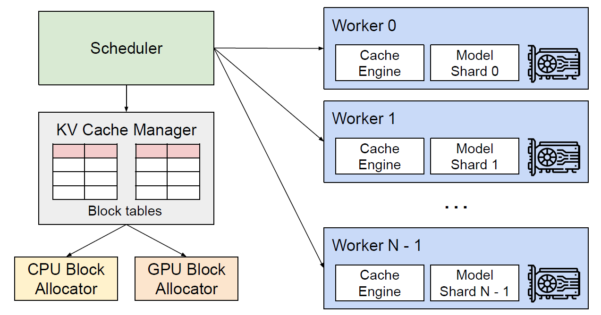

vLLM 是一个非常流行的高性能大语言模型（LLM）推理和服务库。它之所以速度快，关键在于它采用了 **PagedAttention** 和**持续批处理 (Continuous Batching)** 等先进技术，极大提高了 GPU 内存的利用率和吞吐量。




这是一个详细的 vLLM 使用教程，分为几个关键步骤。

### 1\. 什么是 vLLM？

  * **高性能**：vLLM 的吞吐量远高于传统的 Hugging Face Transformers 实现（快几十倍）。
  * **高效内存管理**：通过 PagedAttention，vLLM 像操作系统管理虚拟内存一样管理注意力机制中的 Key 和 Value（KV 缓存），减少了内存浪费和碎片。
  * **OpenAI 兼容**：它提供了一个与 OpenAI API 完全兼容的服务器，让您可以无缝替换原有的 API 调用。

-----

### 2\. 🔧 安装

vLLM 的安装非常简单，但它有一个关键的**前提条件**：

  * **您必须有一块支持 CUDA 的 NVIDIA GPU**。
  * 需要安装 Python 3.8 或更高版本。

您可以使用 `pip` 直接安装：

```bash
pip install vllm
```

-----

### 3\. 🚀 核心用法一：使用 Python API (离线推理)

这是最直接的使用方式，适合在 Python 脚本中进行批量推理。

您只需要导入 `LLM` 和 `SamplingParams` 这两个核心类。

  * `LLM`：用于加载模型。
  * `SamplingParams`：用于指定生成文本时的参数（如温度、top\_p 等）。

**示例代码：**

```python
from vllm import LLM, SamplingParams

# 准备提示词列表
prompts = [
    "Hello, my name is",
    "The president of the United States is",
    "The capital of France is",
    "The future of AI is",
]

# 准备采样参数
# 您可以为所有提示词设置一组参数
sampling_params = SamplingParams(
    temperature=0.8, 
    top_p=0.95, 
    max_tokens=100
)

# 初始化 LLM 类，指定要加载的模型
# vLLM 会自动从 Hugging Face Hub 下载模型
# 第一次加载模型可能需要一些时间
print("正在加载模型...")
llm = LLM(model="meta-llama/Llama-2-7b-chat-hf")
print("模型加载完毕。")

# 运行批量推理
print("正在生成文本...")
outputs = llm.generate(prompts, sampling_params)
print("生成完毕。")

# 打印输出结果
for output in outputs:
    prompt = output.prompt
    generated_text = output.outputs[0].text
    
    print(f"--- 提示词 (Prompt) ---")
    print(prompt)
    print(f"--- 生成结果 (Generated) ---")
    print(generated_text)
    print("\n")
```

-----

### 4\. 🚀 核心用法二：部署 OpenAI 兼容 API 服务器

这是 vLLM 最强大的功能之一：将任何开源大模型部署为一个高速的、与 OpenAI API 格式一致的 API 服务。

#### 第 1 步：启动服务器

您只需要一行命令即可启动服务器。vLLM 推荐使用 `vllm serve` 命令。

（请注意：`meta-llama/Llama-2-7b-chat-hf` 是一个需要授权的门控模型，您需要先登录 `huggingface-cli login` 才能下载。您也可以换成其他开放模型，如 `Qwen/Qwen2-1.5B-Instruct`）。

```bash
# 启动服务器，加载 Llama-2-7b-chat 模型
# 服务器默认运行在 http://localhost:8000
vllm serve meta-llama/Llama-2-7b-chat-hf
```

服务器启动后，您会看到类似以下的日志：

```
...
INFO 10-29 10:00:00 server.py:98] Uvicorn running on http://0.0.0.0:8000 (Press CTRL+C to quit)
INFO 10-29 10:00:00 utils.py:322] Using Eager mode.
INFO 10-29 10:00:00 utils.py:537] Effectively using 1 GPUs.
...
```

#### 第 2 步：查询服务器 (使用 Python)

现在，您可以使用任何 HTTP 客户端来调用它。最简单的方法是使用 `openai` 官方 Python 库。

首先，请确保您已安装 `openai` 库：
`pip install openai`

然后，运行以下 Python 脚本：

```python
from openai import OpenAI

# 1. 初始化 OpenAI 客户端
# 指向您本地 vLLM 服务器的地址
client = OpenAI(
    base_url="http://localhost:8000/v1",
    api_key="vllm" # API 密钥不是必需的，但 OpenAI 库要求填写
)

# 2. 调用聊天接口 (Chat Completions)
print("正在调用 vLLM 服务器...")
chat_response = client.chat.completions.create(
    model="meta-llama/Llama-2-7b-chat-hf", # 确保这里的模型名与服务器加载的_一致
    messages=[
        {"role": "system", "content": "You are a helpful assistant."},
        {"role": "user", "content": "What is the capital of France?"}
    ],
    max_tokens=50,
    temperature=0.7
)

print("--- 服务器响应 ---")
print(chat_response.choices[0].message.content)

# 3. (可选) 调用文本补全接口 (Completions)
# print("\n--- 调用文本补全接口 ---")
# completion_response = client.completions.create(
#     model="meta-llama/Llama-2-7b-chat-hf",
#     prompt="The capital of France is",
#     max_tokens=50,
#     temperature=0.7
# )
# print(completion_response.choices[0].text)
```

-----

### 5\. 📚 关键概念：`SamplingParams`

在用法一中，`SamplingParams` 对象是控制文本生成的关键。以下是一些常用参数：

  * `temperature` (浮点数): 控制随机性。0 表示确定性输出，更高的值（如 0.8）表示更多样化的输出。
  * `top_p` (浮点数): 核采样 (Nucleus sampling)。仅从累积概率超过 `top_p` 的最小标记集中进行采样。
  * `max_tokens` (整数): 生成的最大 token 数量。
  * `n` (整数): 为每个提示词生成多少个独立的输出。
  * `stream` (布尔值): 是否以流式（逐个 token）返回结果。
  * `stop` (字符串列表): 遇到列表中的任何字符串时停止生成。

### 6\. 🔗 官方资源

vLLM 发展非常快，最准确的信息始终来自官方：

  * **官方文档**: [https://docs.vllm.ai/](https://docs.vllm.ai/)
  * **GitHub 仓库**: [https://github.com/vllm-project/vllm](https://github.com/vllm-project/vllm)

-----
