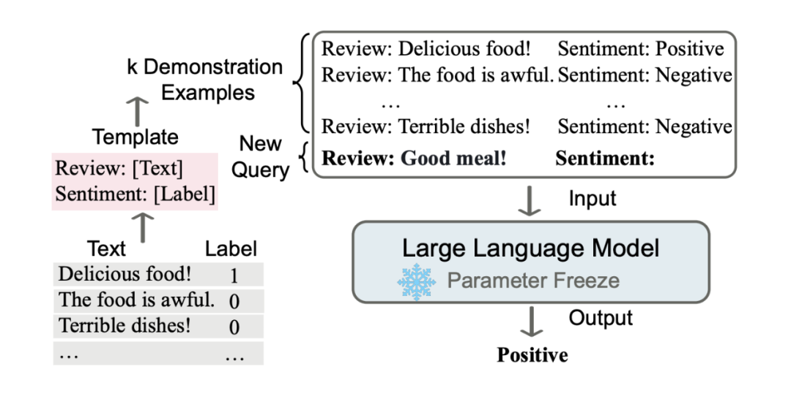

参考：

https://zhuanlan.zhihu.com/p/611217770





### 什么是上下文学习（ICL）？
上下文学习是指一种机器学习模型（尤其是大语言模型，LLM）在无需显式调整模型参数（即不进行传统意义上的微调）的情况下，通过提供任务相关的上下文信息（通常是输入中的示例或描述），就能完成特定任务的能力。这种能力通常出现在像 GPT 系列或类似的 transformer 模型中。

简单来说，ICL 是模型利用提示（prompt）中的信息“即时学习”的过程。它不需要通过梯度下降等方法重新训练模型，而是直接从输入的上下文中提取模式或规则，然后应用到新任务上。

---

### ICL 的核心机制
1. **提示（Prompt）的作用**：
   - 在 ICL 中，用户通过输入一段文字（即提示）来告诉模型任务是什么。例如，可以给模型几个示例（few-shot learning），或者直接描述任务（zero-shot learning）。
   - 示例：如果你想让模型翻译句子，可以在提示中写：
     ```
     翻译以下句子：
     1. The cat is on the mat. -> 猫在垫子上。
     2. I like to eat apples. -> 我喜欢吃苹果。
     请翻译：The dog runs fast.
     ```
     模型会根据前面的例子推断出任务是翻译，并输出：狗跑得快。

2. **无参数更新**：
   - 与传统的监督学习不同，ICL 不需要改变模型的权重。模型完全依赖预训练时学到的知识和提示中的上下文来推理。

3. **灵活性**：
   - ICL 的一个显著特点是它对任务的适应性极强。只要提示设计得当，同一个模型可以处理多种任务，比如翻译、问答、文本生成等。

---

### ICL 的类型
根据提示中提供的信息量，ICL 可以分为以下几种情况：
1. **Zero-Shot Learning（零样本学习）**：
   - 模型只接收任务描述，没有具体示例。
   - 示例：
     ```
     将这句话翻译成中文：The sun is shining brightly.
     ```
     输出：太阳明亮地照耀着。

2. **Few-Shot Learning（少样本学习）**：
   - 模型接收任务描述外加几个示例，帮助它理解任务。
   - 示例：
     ```
     翻译成中文：
     1. The bird sings. -> 鸟儿在唱歌。
     2. The flower blooms. -> 花儿盛开。
     请翻译：The wind blows.
     ```
     输出：风在吹。

3. **One-Shot Learning（单样本学习）**：
   - 介于两者之间，只给一个示例。
   - 示例：
     ```
     翻译成中文：The tree grows tall. -> 树长得很高。
     请翻译：The river flows fast.
     ```
     输出：河水流得快。

---

### ICL 的工作原理
ICL 的成功依赖于以下几个因素：
1. **大规模预训练**：
   - 大语言模型在海量文本数据上预训练，积累了丰富的语言模式和知识。这些知识使得模型能够在提示中找到规律并应用到新任务。

2. **注意力机制（Attention Mechanism）**：
   - Transformer 架构中的注意力机制让模型能够动态聚焦提示中的关键信息。例如，在 few-shot 示例中，模型会关注输入和输出之间的对应关系。

3. **泛化能力**：
   - 模型通过预训练学会了泛化，即使面对全新的任务，只要提示足够清晰，它就能推断出正确的行为。

---

### ICL 的优势
1. **无需额外训练**：
   - 不需要为每个新任务准备标注数据或重新训练模型，节省时间和计算资源。
2. **任务无关性**：
   - 一个模型可以处理多种任务，只需调整提示即可。
3. **用户友好**：
   - 对于不懂机器学习的用户，只需提供自然语言描述或示例，模型就能工作。

---

### ICL 的局限性
1. **对提示敏感**：
   - 提示的质量和清晰度直接影响模型表现。如果提示模糊或不一致，输出可能不准确。
   - 示例：如果提示是“翻译成中文：The cat”，但之前没说明任务，模型可能不知道是翻译还是其他操作。
2. **上下文窗口限制**：
   - 模型能处理的上下文长度有限。如果提示太长，早期信息可能被忽略。
3. **性能不如微调**：
   - 对于特定任务，ICL 的表现通常不如专门微调过的模型，尤其在数据量大时。

---

### ICL 在实际中的应用
1. **自然语言处理**：
   - 用于问答、文本生成、翻译、摘要等任务。
2. **教育**：
   - 可以作为学习工具，帮助学生通过示例理解概念。
3. **自动化**：
   - 在客服机器人、代码生成等领域，ICL 能快速适应新需求。

---

### 与传统学习的对比
| 特性                | 传统机器学习         | 上下文学习 (ICL)      |
|--------------------|---------------------|----------------------|
| 训练方式           | 需要标注数据和微调   | 无需微调，依赖提示   |
| 任务适应性         | 任务特定            | 高度灵活            |
| 计算成本           | 高（训练阶段）       | 低（推理阶段）       |
| 用户门槛           | 高（需专业知识）     | 低（只需写提示）     |

---

### 总结
上下文学习（ICL）是大语言模型的一项强大能力，它让模型通过提示中的上下文“即时学习”并完成任务，而无需额外的训练。它的核心在于利用预训练知识和注意力机制，适用于零样本、单样本和少样本场景。虽然它对提示设计敏感且有上下文长度限制，但其灵活性和易用性使其在实际应用中非常有价值。
