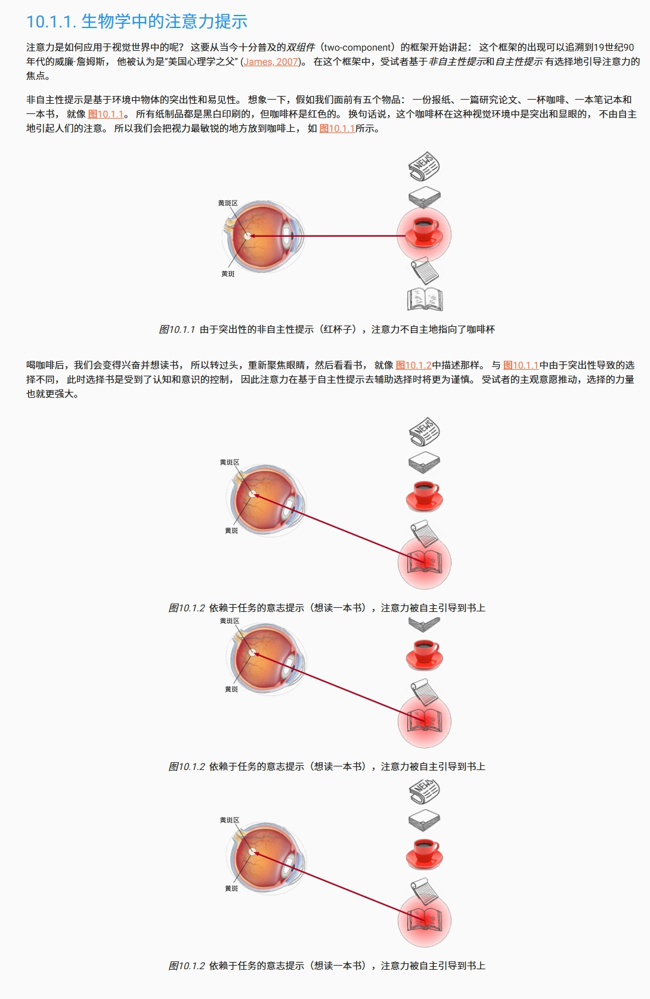
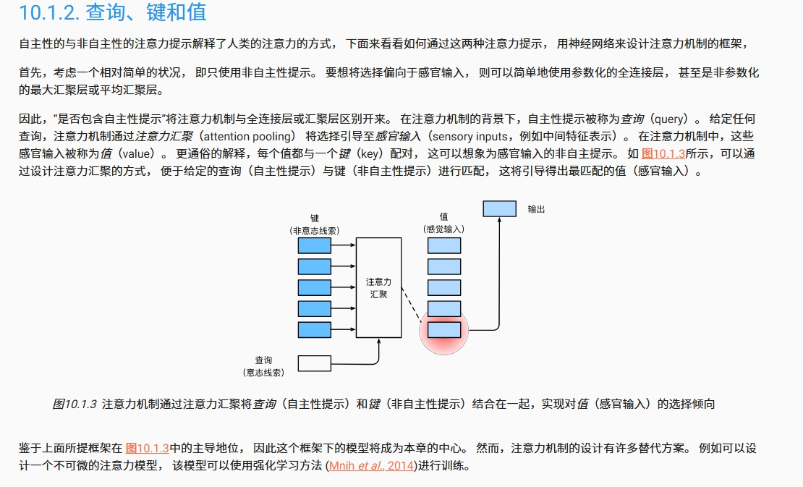

# 注意力机制（Attention Mechanism）详解

注意力机制是深度学习领域中一种重要的技术，广泛应用于自然语言处理（NLP）、计算机视觉（CV）、语音识别等领域。它通过模拟人类的注意力选择过程，使模型能够专注于输入数据中的重要部分，从而提升模型的性能和效率。

---

## 一、背景与动机

在传统的序列建模任务中（如机器翻译），RNN（循环神经网络）及其变体（LSTM、GRU）被广泛使用。然而，这些模型存在以下问题：
1. **长距离依赖问题**：RNN难以捕捉长序列中的远距离依赖关系。
2. **固定长度上下文限制**：编码器通常将整个输入序列压缩为一个固定长度的向量，这可能导致信息丢失。
3. **计算效率低**：RNN需要按顺序处理序列，无法并行化。

为了解决这些问题，注意力机制应运而生。它允许模型动态地关注输入序列的不同部分，而不是依赖单一的固定表示。

---

## 二、注意力机制的核心思想

首先我们可以看看李沐老师在《动手学深度学习》这么书中做的一些介绍

其中一句话比较吸引注意力：“受试者基于非自主性提示和自主性提示 有选择地引导注意力的焦点。”

实际上，注意力机制的核心思想是：**让模型学会根据当前任务的需求，分配不同的权重给输入的不同部分**。换句话说，模型可以“聚焦”于输入中最相关的信息，而忽略无关的部分。

例如，在机器翻译任务中，当生成目标语言的一个单词时，模型可以根据源语言句子中的不同单词的重要性，动态调整它们对当前输出的影响。

---

## 三、注意力机制的基本原理

我感觉《动手学深度学习》中的介绍，很清楚的把注意力机制的机制介绍了

### 1. 基本组成
注意力机制通常由以下几个关键部分组成：
- **Query（查询）**：表示当前需要关注的内容或任务需求。
- **Key（键）**：表示输入数据的特征表示。
- **Value（值）**：表示输入数据的实际内容。
- **Score Function（评分函数）**：用于衡量Query与每个Key之间的相关性。
- **Softmax**：将评分归一化为概率分布。
- **加权求和**：根据归一化的权重对Value进行加权求和，得到最终的输出。

### 2. 数学公式
假设输入序列为 $ X = \{x_1, x_2, ..., x_n\} $，其对应的Key和Value分别为 $ K = \{k_1, k_2, ..., k_n\} $ 和 $ V = \{v_1, v_2, ..., v_n\} $。Query为 $ q $。注意力机制的计算过程如下：

1. **计算相似度得分**：
   使用评分函数（如点积、加性注意力等）计算Query与每个Key的相似度：
   $$
   e_i = \text{Score}(q, k_i)
   $$
   常见的评分函数包括：
   - 点积注意力（Scaled Dot-Product Attention）：
     $$
     e_i = \frac{q \cdot k_i}{\sqrt{d_k}}
     $$
     其中 $ d_k $ 是Key的维度。
   - 加性注意力（Additive Attention）：
     $$
     e_i = v^T \tanh(W_q q + W_k k_i)
     $$

2. **归一化得分**：
   使用Softmax函数将得分归一化为概率分布：
   $$
   \alpha_i = \text{Softmax}(e_i) = \frac{\exp(e_i)}{\sum_{j=1}^n \exp(e_j)}
   $$

3. **加权求和**：
   根据归一化后的权重对Value进行加权求和，得到最终的输出：
   $$
   \text{Output} = \sum_{i=1}^n \alpha_i v_i
   $$

---

## 四、注意力机制的分类

根据应用场景和实现方式，注意力机制可以分为以下几种类型：

### 1. **自注意力机制（Self-Attention）**
自注意力机制是一种特殊的注意力机制，其中Query、Key和Value都来自同一个输入序列。它常用于Transformer模型中，用于捕捉序列内部的关系。

#### 特点：
- 输入序列中的每个元素都可以与其他元素交互。
- 能够捕捉全局依赖关系，而不受序列长度的限制。

#### 应用：
- Transformer模型中的多头自注意力（Multi-Head Self-Attention）。
- BERT、GPT等预训练语言模型。

### 2. **交叉注意力机制（Cross-Attention）**
交叉注意力机制用于两个不同序列之间的交互。例如，在机器翻译任务中，解码器通过交叉注意力机制关注编码器的输出。

#### 特点：
- Query来自一个序列，Key和Value来自另一个序列。
- 适用于序列到序列的任务。

#### 应用：
- 机器翻译。
- 图像描述生成。

### 3. **多头注意力（Multi-Head Attention）**
多头注意力是自注意力机制的一种扩展，它通过多个独立的注意力头并行计算，然后将结果拼接起来。这种方式可以捕捉输入序列中不同子空间的关系。

#### 特点：
- 每个注意力头可以关注输入的不同方面。
- 提高了模型的表达能力。

#### 应用：
- Transformer模型。
- 多模态任务（如图文匹配）。

### 4. **局部注意力（Local Attention）**
局部注意力机制只关注输入序列的一部分，而不是整个序列。这种方式可以降低计算复杂度，同时保留局部信息。

#### 特点：
- 计算效率高。
- 适合处理长序列。

#### 应用：
- 长文本处理。
- 视频分析。

### 5. **缩放点积注意力**

缩放点积注意力也就是前面最开始说的注意力，只是前面的公式中加入了一个缩放因子，防止点积的数值过大，导致梯度消失或梯度爆炸。

---

## 五、注意力机制的优势

1. **灵活性**：注意力机制可以根据任务需求动态调整输入的重要性。
2. **捕捉长距离依赖**：相比RNN，注意力机制可以直接建模输入序列中任意两个位置之间的关系。
3. **可解释性**：通过注意力权重，可以直观地看到模型关注了哪些部分。
4. **并行化**：注意力机制的计算可以完全并行化，提高了训练效率。

---

## 六、注意力机制的应用

### 1. 自然语言处理（NLP）
- **机器翻译**：Transformer模型利用注意力机制实现了端到端的翻译。
- **文本生成**：GPT系列模型通过自注意力机制生成高质量的文本。
- **问答系统**：BERT模型利用双向自注意力机制理解问题和文档的关系。

### 2. 计算机视觉（CV）
- **图像描述生成**：通过交叉注意力机制，模型可以根据图像内容生成描述文字。
- **目标检测**：注意力机制可以帮助模型聚焦于图像中的特定区域。

### 3. 语音识别
- **语音转文字**：注意力机制可以捕捉语音信号中的重要片段。

### 4. 推荐系统
- **用户行为建模**：通过注意力机制，模型可以关注用户历史行为中的重要部分。

---

## 七、总结

注意力机制是一种强大的工具，它通过动态分配权重的方式，使模型能够更好地捕捉输入数据中的重要信息。随着Transformer模型的普及，注意力机制已经成为深度学习领域的核心技术之一。未来，随着研究的深入，注意力机制将在更多领域发挥重要作用。

如果你对某个具体应用场景或实现细节感兴趣，可以进一步探讨！