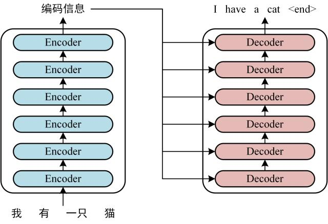
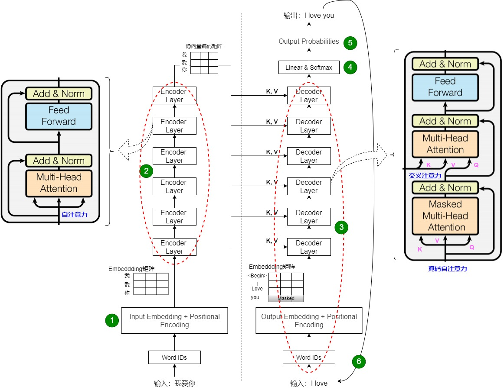
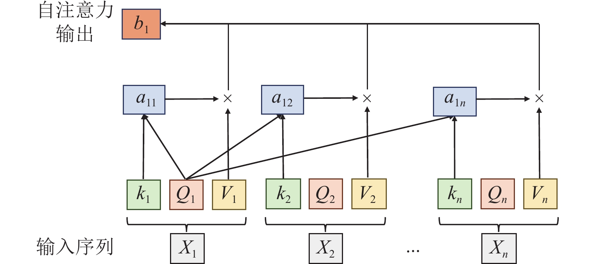

目录

- [Transformer 模型原理和代码实现](#Transformer-模型原理和代码实现教程)
- [GPT系列模型](#GPT系列模型)


参考：

https://zhuanlan.zhihu.com/p/338817680


## Transformer 模型原理和代码实现教程

### 一、Transformer 模型简介
Transformer 是一种基于注意力机制的深度学习模型，由 Vaswani 等人在 2017 年的论文《Attention is All You Need》中提出。它抛弃了传统 RNN 的循环结构，完全依赖自注意力机制实现序列建模，广泛应用于 NLP 和其他领域。

---

### 二、Transformer 模型结构

#### 1. 整体架构
Transformer 由编码器和解码器组成，通常堆叠 6 层，用于序 列到序列任务。  


*上图展示了编码器和解码器的堆叠结构及数据流向。*

#### 2. 编码器（Encoder）
每个编码器层包含：
1. 多头自注意力机制  
2. 前馈神经网络  
加上残差连接和层归一化。

#### 3. 解码器（Decoder）
解码器多了掩码自注意力，用于防止未来信息泄露。  

*上图详细展示了编码器和解码器层的子模块及连接方式。*

#### 4. 输入嵌入与位置编码
位置编码通过正弦和余弦函数加入序列位置信息：
\[
PE_{(pos, 2i)} = \sin(pos / 10000^{2i/d_{model}})
\]
\[
PE_{(pos, 2i+1)} = \cos(pos / 10000^{2i/d_{model}})
\]

---

### 三、自注意力机制（Self-Attention）详解

#### 1. 计算过程
自注意力通过查询 \(Q\)、键 \(K\)、值 \(V\) 计算相关性：  
\[
\text{Attention}(Q, K, V) = \text{softmax}(\frac{QK^T}{\sqrt{d_k}})V
\]  

*上图展示了自注意力的计算步骤。*

#### 2. 多头机制
将注意力分成多个子空间并行计算，最后拼接结果。

---

### 四、代码实现（基于 PyTorch）
以下是简化的编码器实现：

```python
import torch
import torch.nn as nn
import math

# 位置编码
class PositionalEncoding(nn.Module):
    def __init__(self, d_model, max_len=5000):
        super(PositionalEncoding, self).__init__()
        pe = torch.zeros(max_len, d_model)
        position = torch.arange(0, max_len, dtype=torch.float).unsqueeze(1)
        div_term = torch.exp(torch.arange(0, d_model, 2).float() * (-math.log(10000.0) / d_model))
        pe[:, 0::2] = torch.sin(position * div_term)
        pe[:, 1::2] = torch.cos(position * div_term)
        pe = pe.unsqueeze(0)
        self.register_buffer('pe', pe)

    def forward(self, x):
        return x + self.pe[:, :x.size(1), :]

# 多头自注意力
class MultiHeadAttention(nn.Module):
    def __init__(self, d_model, num_heads):
        super(MultiHeadAttention, self).__init__()
        assert d_model % num_heads == 0
        self.d_k = d_model // num_heads
        self.num_heads = num_heads
        self.q_linear = nn.Linear(d_model, d_model)
        self.k_linear = nn.Linear(d_model, d_model)
        self.v_linear = nn.Linear(d_model, d_model)
        self.out_linear = nn.Linear(d_model, d_model)

    def forward(self, q, k, v, mask=None):
        batch_size = q.size(0)
        q = self.q_linear(q).view(batch_size, -1, self.num_heads, self.d_k).transpose(1, 2)
        k = self.k_linear(k).view(batch_size, -1, self.num_heads, self.d_k).transpose(1, 2)
        v = self.v_linear(v).view(batch_size, -1, self.num_heads, self.d_k).transpose(1, 2)
        scores = torch.matmul(q, k.transpose(-2, -1)) / math.sqrt(self.d_k)
        if mask is not None:
            scores = scores.masked_fill(mask == 0, -1e9)
        attn = torch.softmax(scores, dim=-1)
        context = torch.matmul(attn, v)
        context = context.transpose(1, 2).contiguous().view(batch_size, -1, self.num_heads * self.d_k)
        return self.out_linear(context)

# Transformer 编码器层
class EncoderLayer(nn.Module):
    def __init__(self, d_model, num_heads, d_ff, dropout=0.1):
        super(EncoderLayer, self).__init__()
        self.self_attn = MultiHeadAttention(d_model, num_heads)
        self.ffn = nn.Sequential(
            nn.Linear(d_model, d_ff),
            nn.ReLU(),
            nn.Dropout(dropout),
            nn.Linear(d_ff, d_model)
        )
        self.norm1 = nn.LayerNorm(d_model)
        self.norm2 = nn.LayerNorm(d_model)
        self.dropout = nn.Dropout(dropout)

    def forward(self, x, mask=None):
        attn_output = self.self_attn(x, x, x, mask)
        x = self.norm1(x + self.dropout(attn_output))
        ffn_output = self.ffn(x)
        x = self.norm2(x + self.dropout(ffn_output))
        return x

# 测试
d_model, num_heads, d_ff, seq_len, batch_size = 512, 8, 2048, 10, 2
encoder_layer = EncoderLayer(d_model, num_heads, d_ff)
x = torch.randn(batch_size, seq_len, d_model)
output = encoder_layer(x)
print(output.shape)  # torch.Size([2, 10, 512])
```

---


## GPT系列模型

- [从GPT-1到GPT-4，GPT系列模型详解](https://zhuanlan.zhihu.com/p/627901828)


### GPT 模型介绍

作为面试官，您好！下面我将从定义、历史发展、架构原理、工作机制、应用场景以及优缺点等方面，系统地介绍 GPT（Generative Pre-trained Transformer）模型。这是一个由 OpenAI 开发的生成式预训练 Transformer 模型系列，是当今大语言模型（LLM）的代表作之一。 我会尽量保持简洁明了，如果您有特定焦点（如某个版本），可以进一步追问。

#### 1. 什么是 GPT 模型？
GPT 是一种基于 Transformer 架构的深度学习模型，专为自然语言处理（NLP）设计。它能够理解和生成人类般的文本，通过预测序列中的下一个词（token）来实现“生成”功能。 核心理念是“预训练 + 微调”：先在海量无标签数据上预训练模型学习语言模式，再针对特定任务微调。

#### 2. 历史发展
GPT 系列从 2018 年起步，已迭代至 2025 年的 GPT-5，每代模型参数规模和能力大幅提升。以下是关键版本的简要比较（使用表格便于查看）：

| 版本     | 发布年份 | 参数规模       | 关键创新与特点                                                                 |
|----------|----------|----------------|--------------------------------------------------------------------------------|
| GPT-1   | 2018    | 1.17 亿       | 首次引入生成式预训练 Transformer，奠基架构；主要用于文本生成基准测试。 |
| GPT-2   | 2019    | 15 亿         | 参数增加 10 倍，支持更连贯的文本生成；因潜在滥用风险，OpenAI 延迟完整发布。 |
| GPT-3   | 2020    | 1750 亿       | 革命性规模，支持零样本/少样本学习；ChatGPT 的基础，推动 AI 应用爆发。 |
| GPT-4   | 2023    | 未公开（估超万亿） | 多模态支持（文本+图像）；更强推理能力，集成于 Bing 等产品。 |
| GPT-5   | 2025    | 未公开（更大规模） | 进一步提升多模态和实时交互；聚焦安全与效率优化。 |

这一演进反映了从简单生成向复杂智能的转变，受 Transformer 论文（2017 年）启发。

#### 3. 架构原理
GPT 基于 Transformer 的解码器（Decoder-only）架构，主要组件包括：
- **自注意力机制（Self-Attention）**：允许模型并行处理序列，捕捉长距离依赖（如句子上下文）。
- **多头注意力（Multi-Head Attention）**：多个注意力头并行工作，提升表示能力。
- **前馈网络（Feed-Forward）** 和 **层归一化（Layer Normalization）**：用于非线性变换和稳定训练。
- **位置编码（Positional Encoding）**：处理序列顺序信息。

整体结构是堆叠多个 Transformer 块，输入文本被转化为 token 嵌入（Embedding），输出是概率分布，用于预测下一个 token。 例如，输入“今天天气”，模型会计算每个词的上下文权重，生成“很好”作为续接。

#### 4. 工作机制
- **预训练阶段**：在互联网规模的文本语料（如 Common Crawl）上，使用无监督学习（掩码语言建模或因果语言建模）训练。目标：最大化预测下一个词的似然。
- **微调阶段**：使用监督数据（如问答对）调整模型，适应下游任务（如翻译、摘要）。
- **推理过程**：给定提示（Prompt），模型自回归生成（Autoregressive），逐步输出 token，直到结束符。

#### 5. 应用场景
GPT 已广泛应用于：
- **内容生成**：写作助手、代码补全（e.g., GitHub Copilot）。
- **对话系统**：ChatGPT、客服机器人。
- **多模态任务**：图像描述、语音转文本（GPT-4 后扩展）。
- **其他**：教育（个性化学习）、医疗（辅助诊断）、娱乐（故事创作）。

#### 6. 优势与局限
- **优势**：生成流畅、自然；泛化强，支持零样本学习；开源部分模型促进生态。
- **局限**：易产生“幻觉”（虚假信息）；训练成本高（能源消耗大）；潜在偏见（继承训练数据偏差）；隐私与伦理风险。

总之，GPT 模型标志着 AI 从规则驱动向数据驱动的范式转变，推动了生成式 AI 的普及。到 2025 年，它已成为行业标准，但也引发了对 AI 安全的讨论。 如果您想深入某个方面（如代码实现或未来趋势），我可以扩展！


## Llama

https://zhuanlan.zhihu.com/p/643894722


Llama (拉玛) 是由 Meta (前 Facebook) 开发的一系列大型语言模型 (LLM) 的总称。自推出以来，它因其强大的性能和相对开放的许可政策，对整个人工智能领域产生了巨大影响。

以下是 Llama 系列模型的主要特点：

### 核心特点

1.  **开放性（"社区许可"）**：
    * 这可能是 Llama 最显著的特点。与 GPT-4 等闭源模型不同，Meta 向公众发布了 Llama 模型的权重（尤其是 Llama 2 和 Llama 3），并提供了“社区许可”。
    * 这意味着研究人员、初创公司和大型企业（在一定限制内，例如月活用户超过7亿的公司需要额外许可）都可以**免费使用、修改和分发**这些模型及其衍生品，极大地推动了 LLM 领域的创新和应用普及。

2.  **高性能与高效率**：
    * Llama 系列模型在各种规模（例如 8B、70B、405B 参数）上都表现出了与顶级闭源模型相竞争甚至超越的性能。
    * 它们在推理、编码、常识推理和问答等标准基准测试中得分很高。
    * Llama 的设计注重效率，使其在同等性能下所需的计算资源相对较少，更容易部署。

3.  **先进的架构**：
    * Llama 采用的是“仅解码器”（decoder-only）的 Transformer 架构，这是当今主流 LLM 的标准配置。
    * 不过，它也包含了一些关键的架构改进，使其区别于早期的模型（如 GPT-3）：
        * **SwiGLU 激活函数**：代替标准的 ReLU，以提高性能。
        * **旋转位置编码 (RoPE)**：使用相对位置编码来更好地处理序列中Token的相对关系，有助于提升长文本理解能力。
        * **RMSNorm 归一化**：使用均方根层归一化 (Root Mean Square Layer Normalization) 来代替标准 LayerNorm，以提高训练稳定性和效率。

---

### 主要版本演进

Llama 系列在不断迭代，每一代都在性能、功能和训练数据上进行重大升级：

#### 🐐 Llama 1 (2023年2月)
* **定位**：基础研究模型。
* **特点**：最初仅以非商业许可形式提供给研究社区。它证明了在相对“较小”的规模（最大 65B 参数）上，使用海量的、高质量的数据（1.4 万亿个 Token）进行训练，可以达到顶尖的性能。它的发布意外地“泄露”并引爆了开源 LLM 社区。

#### 🐐🐐 Llama 2 (2023年7月)
* **定位**：首个可商用版本。
* **特点**：
    * **社区许可**：正式开放给商业和研究使用。
    * **更大的训练数据**：在比 Llama 1 多 40% 的数据上进行预训练。
    * **更长的上下文窗口**：上下文长度翻倍，达到 4,096 个 Token。
    * **强化的人类反馈 (RLHF)**：Llama 2-Chat 版本经过了严格的监督微调 (SFT) 和基于人类反馈的强化学习 (RLHF)，使其在对话、遵循指令和安全性方面表现更佳。

#### 🐐🐐🐐 Llama 3 (2024年4月)
* **定位**：当前一代的旗舰模型。
* **特点**：
    * **卓越的性能**：目前发布的 8B 和 70B 版本，在其同等规模上被认为是性能最强的开放模型，其性能可与 GPT-4 等顶尖闭源模型的中等版本相媲美。
    * **海量训练数据**：在一个超过 15 万亿 (15T) Token 的庞大数据集上进行训练，数据质量也经过了严格筛选。
    * **更强的多语言能力**：训练数据中包含超过 5% 的非英语高质量数据，覆盖 30 多种语言，显著提升了其多语言处理能力。
    * **更大的上下文窗口**：基础上下文窗口增加到 8,192 个 Token，并且有能力扩展到更长（例如 Llama 3.1 405B 版本支持 128K 上下文）。
    * **未来的多模态**：Meta 已经宣布 Llama 3 将具备多模态能力（理解图像和文本），未来版本（如传闻中的 Llama 4）将集成文本、图像和可能的音频输入。


## deepseek

DeepSeek（深度求索）是一家成立于2023年的中国人工智能公司，正迅速成为全球AI领域的重要力量。与 Llama 类似，DeepSeek 以其**高性能、模型开源和极具竞争力的成本**而闻名，其重点是开发顶尖的通用人工智能（AGI）基础模型。

DeepSeek 的特点可以从其公司理念和其多样化的模型系列中看出来。

### 核心理念与特点

1.  **开源与开放**：
    * DeepSeek 效仿 Llama 2 和 Llama 3，将其许多强大的模型（包括模型权重）开源，供研究和商业使用。这极大地推动了AI社区的发展，允许开发者在他们的模型基础上进行构建和微调。

2.  **高性能与高效率**：
    * DeepSeek 的模型在各大AI性能排行榜（如 LLM 排行榜）上经常名列前茅，其性能在同等规模下可与全球顶尖的闭源模型（如 OpenAI 的 GPT 系列）和开源模型（如 Llama 系列）相媲美。

3.  **专注于“效率”与“智能”**：
    * DeepSeek 不仅追求模型“大”，更追求“高效”。他们率先在开源社区推出了先进的 **MoE（Mixture-of-Experts，混合专家）** 架构。这种架构允许模型在推理时只激活一部分“专家”参数，而不是全部参数，从而在保持极高性能的同时，大幅降低了推理成本和速度。

4.  **技术垂直细分**：
    * 与 Llama 相对统一的系列不同，DeepSeek 推出了一系列针对特定任务深度优化的模型家族，每个家族都有其独特专长。

---

### DeepSeek 的主要模型系列

DeepSeek 并不是单一的模型，而是一个包含多个专业分支的大家族。

#### 1. 旗舰通用模型 (DeepSeek-V3 系列)
这是 DeepSeek 目前的旗舰产品，对标 Llama 3 和 GPT-4。

* **架构**：采用高效的 MoE 架构（如 V3.2-Exp 版本）。
* **特点**：
    * **"Thinking Mode"（思考模式）**：这是其API中的一个独特功能。用户可以选择是否开启“思考模式”（`deepseek-reasoner`），该模式下模型会调用更强的推理能力来处理复杂问题，而“非思考模式”（`deepseek-chat`）则响应更快，成本更低，适用于简单对话。
    * **成本效益**：由于采用了 MoE 和稀疏注意力（Sparse Attention）等技术，其 API 服务的价格极具竞争力，大幅降低了开发者使用高性能AI的门槛。
* **适用场景**：复杂对话、内容创作、通识问答、API 集成。

#### 2. 专项推理模型 (DeepSeek-R1)
这是一个专注于“推理”能力的模型家族，在逻辑、数学和编程问题上表现出色。

* **训练**：通过大规模的强化学习（RL）进行训练，使其擅长解决需要逐步思考的复杂问题。
* **特点**：在数学（MATH）、编程（HumanEval）和逻辑推理的基准测试中得分极高。
* **适用场景**：数学解题、代码逻辑分析、科学推理、撰写技术文档。

#### 3. 专项编码模型 (DeepSeek-Coder)
这是 DeepSeek 专门为程序员打造的模型系列，直接对标 Llama Code 和 GitHub Copilot。

* **训练数据**：从头开始在海量代码数据（超过2万亿 Token，其中87%是代码）上进行训练。
* **特点**：
    * **"Fill-in-the-Blank"（代码填空）**：不仅仅是代码补全，还能根据上下文填充代码的中间部分，非常适合辅助编程。
    * **多语言**：支持包括 Python, Java, C++, JavaScript 在内的多种主流编程语言。
    * **高性能**：其 33B（330亿参数）模型在性能上超越了许多同类开源模型。
* **适用场景**：编写代码、调试 Bug、学习编程、代码翻译。

#### 4. 多模态模型 (DeepSeek-VL & DeepSeek-OCR)
这是 DeepSeek 的“视觉”分支，使其具备了理解图像和文档的能力。

* **DeepSeek-VL (视觉语言)**：这是通用的视觉语言模型，可以像 GPT-4V 一样“看图说话”，理解图表、网页截图、照片等，并回答相关问题。
* **DeepSeek-OCR (光学字符识别)**：这是一个更专业的模型，专注于从图像中提取文字。它能高效处理高分辨率文档，支持100多种语言，并能精确解析复杂的表格、数学公式和手写体。
* **适用场景**：文档自动化、图表分析、图像内容问答、票据识别。