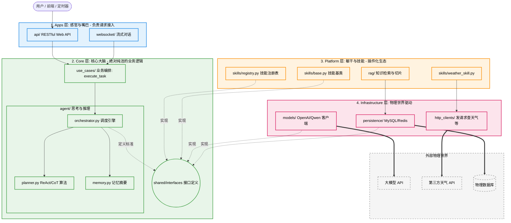

在 AI 应用爆发的今天，写一个大模型对话脚本只需要 50 行代码。但如果你要开发一个企业级的 Agent 管理平台（支持复杂任务编排、多模型无缝切换、RAG 知识库、数十种动态拔插的 Skill 工具），那 50 行脚本很快就会演变成无法维护的"屎山代码"。

**痛点极其明显：**

- 大模型 API 换了（比如从 OpenAI 换到 DeepSeek），整个系统要大改。
- 加一个新工具（Skill），由于和核心逻辑严重耦合，不小心把之前的流式输出改崩了。
- 系统无法进行单元测试，每次测试都得真金白银地消耗 Token。

为了解决这些问题，结合**领域驱动设计 (DDD)** 和 Uncle Bob 的**整洁架构 (Clean Architecture)** 原则，我们设计了一套**"四层模块化单体架构"**。

本文将通过深度图解与真实代码，带你一步步落地这个现代 Agent 平台架构。

---

## 一、架构蓝图：Agent 的"数字仿生体"

我们不把系统看作一堆代码的集合，而是将它隐喻为一个**"数字员工"**。以下是系统的全局架构图：



**项目目录结构（与四层架构严格对应）：**

```text
agent-platform/
│
├── frontend/                      # [独立] 前端层：四层架构的消费者，与后端并列存在
│   ├── src/
│   │   ├── pages/                 # 页面（对话页、任务历史、技能管理）
│   │   ├── components/            # UI 组件
│   │   └── api/                   # 封装对 apps/ 层的 HTTP/WebSocket 调用
│   └── package.json
│
├── apps/                          # [第1层] Apps 层：请求接入，最薄的一层
│   ├── api/
│   │   ├── router.py              # FastAPI 路由，只做参数校验和调用用例
│   │   └── schemas.py             # 请求/响应 Pydantic 模型
│   └── websocket/
│       └── handler.py             # WebSocket 流式对话处理器
│
├── core/                          # [第2层] Core 层：纯洁的业务大脑，禁止导入外部库
│   ├── agent/
│   │   ├── orchestrator.py        # Agent 编排引擎，驱动 ReAct 循环
│   │   ├── planner.py             # 思考算法（ReAct / CoT / ToT）
│   │   └── memory.py              # 对话记忆与摘要压缩
│   ├── use_cases/
│   │   └── execute_task.py        # 业务用例入口：接收请求，返回结果
│   └── shared/
│       └── interfaces.py          # 🔑 核心契约：ILLMInterface / ISkill / ISkillRegistry
│
├── platform/                      # [第3层] Platform 层：插件生态，实现 Core 的接口
│   ├── skills/
│   │   ├── base.py                # 技能基类（对 ISkill 的便捷封装）
│   │   ├── registry.py            # 技能注册表（实现 ISkillRegistry）
│   │   ├── weather_skill.py       # 天气查询技能
│   │   ├── email_skill.py         # 发邮件技能（未来扩展）
│   │   └── code_skill.py          # 代码执行技能（未来扩展）
│   └── rag/
│       ├── retriever.py           # 向量检索
│       └── chunker.py             # 文本切片
│
├── infrastructure/                # [第4层] Infrastructure 层：脏活累活，对接物理世界
│   ├── models/
│   │   ├── openai_client.py       # OpenAI 实现（实现 ILLMInterface）
│   │   └── deepseek_client.py     # DeepSeek 实现（未来扩展，换这里即可）
│   ├── persistence/
│   │   ├── mysql_repo.py          # MySQL 数据访问
│   │   └── redis_cache.py         # Redis 缓存
│   └── http_clients/
│       └── weather_api.py         # 第三方天气 API 封装
│
├── tests/                         # 测试目录（Core 层可纯 Mock 测试，无需消耗 Token）
│   ├── unit/
│   │   └── test_orchestrator.py   # 单元测试：Mock LLM 和 Skill
│   └── integration/
│       └── test_weather_flow.py   # 集成测试：端到端流程
│
└── main.py                        # 依赖注入组装入口：将四层粘合成完整系统
```

**架构四大层级剖析（依赖箭头永远向内或靠接口反转）：**

| 层级 | 职责 | 禁止事项 |
|---|---|---|
| **Frontend（前端，独立）** | 渲染 UI、发起 HTTP/WebSocket 请求，只与 Apps 层通信 | 不得直接调用 Core 或 Platform 的任何逻辑 |
| **Apps（请求接入层）** | 接收 HTTP/WebSocket 请求，参数校验，转发给 Core | 不得包含业务逻辑 |
| **Core（核心大脑层）** | Agent 思考逻辑（ReAct 循环）、业务编排 | 禁止 `import requests` 或任何外部库 |
| **Platform（平台服务层）** | 技能市场、RAG 知识库，动态注册 Skill | 不得直接访问物理数据库 |
| **Infrastructure（基础设施层）** | 调用 OpenAI SDK、查 MySQL、读文件等脏活 | 不得包含业务逻辑 |

> **前端的角色定位：** `frontend/` 是整个系统的"嘴脸"，但它不属于后端四层中的任何一层。它是架构的**消费者**，只能通过 `apps/` 层暴露的 API/WebSocket 接口与系统交互，对 `core/`、`platform/`、`infrastructure/` 的存在一无所知。如果项目规模扩大，前端可以直接拆分为独立仓库单独部署，后端四层结构无需任何改动。

---

## 二、代码级穿越：以"帮我查一下杭州明天天气"为例

接下来，严格按照目录结构，用 Python 代码走通一笔真实业务流，体会依赖倒置带来的窒息级优雅。

### 1. 定义防腐接口 `core/shared/interfaces.py`

这是整个系统架构的"契约"，Core 层需要的工具箱全在这里定义。

```python
# core/shared/interfaces.py
from abc import ABC, abstractmethod
from typing import List, Dict, Any

class ILLMInterface(ABC):
    """大模型提供商的抽象接口"""
    @abstractmethod
    def generate(self, prompt: str, tools: List[Dict] = None) -> Dict:
        pass

class ISkill(ABC):
    """所有平台技能的抽象基类"""
    name: str
    description: str

    @abstractmethod
    def execute(self, **kwargs) -> Any:
        pass

class ISkillRegistry(ABC):
    """技能注册表的抽象接口"""
    @abstractmethod
    def get_skill(self, name: str) -> ISkill:
        pass

    @abstractmethod
    def get_all_schemas(self) -> List[Dict]:
        pass
```

### 2. 编写核心大脑 `core/agent/orchestrator.py`

这里是 Agent 的思考流，它**只依赖刚才定义的接口**，与任何具体实现完全解耦。

```python
# core/agent/orchestrator.py
from core.shared.interfaces import ILLMInterface, ISkillRegistry

class AgentOrchestrator:
    """Agent 编排引擎 (纯业务逻辑)"""

    # 依赖注入：在初始化时，只接收接口，不知道底层是谁
    def __init__(self, llm: ILLMInterface, skill_registry: ISkillRegistry):
        self.llm = llm
        self.skill_registry = skill_registry

    def run(self, user_query: str) -> str:
        print(f"[Core] 收到任务: {user_query}")

        # 1. 获取系统目前所有可用的技能说明书
        available_tools = self.skill_registry.get_all_schemas()

        # 2. 让 LLM 思考意图
        print("[Core] 正在调用大脑(LLM)分析意图...")
        llm_response = self.llm.generate(prompt=user_query, tools=available_tools)

        # 3. 解析 LLM 返回结果，判断是否需要调用工具
        if llm_response.get("tool_call"):
            tool_name = llm_response["tool_call"]["name"]
            tool_args = llm_response["tool_call"]["args"]
            print(f"[Core] 大脑决定调用技能: {tool_name}, 参数: {tool_args}")

            # 4. 去平台层获取具体技能并执行
            skill = self.skill_registry.get_skill(tool_name)
            observation = skill.execute(**tool_args)
            print(f"[Core] 技能执行结果: {observation}")

            # 5. 拿着结果进行二次总结
            final_prompt = f"用户问:{user_query}\n工具返回:{observation}\n请给出最终人类可读回答。"
            final_answer = self.llm.generate(prompt=final_prompt)["text"]
            return final_answer

        return llm_response["text"]
```

```python
# core/use_cases/execute_task.py
from core.agent.orchestrator import AgentOrchestrator

def execute_chat_task(query: str, orchestrator: AgentOrchestrator) -> str:
    """业务用例：执行对话任务"""
    return orchestrator.run(query)
```

### 3. 构建平台生态与技能 `platform/skills/`

跳出核心大脑，来到 platform 层，实现具体的技能插件。

```python
# platform/skills/weather_skill.py
from core.shared.interfaces import ISkill
import requests  # Platform/Infra 层允许导入外部库

class WeatherSkill(ISkill):
    name = "weather_skill"
    description = "查询指定城市的天气。参数包含 city: 城市名"

    def execute(self, city: str) -> str:
        print(f"[Platform] 正在查询物理世界 {city} 的天气...")
        # 模拟调用外部 HTTP API (严格来说 HTTP 调用也可抽离到 infra 层)
        # response = requests.get(f"http://weather-api.com?city={city}")
        return f"{city}明天晴，25摄氏度，适合出行。"
```

```python
# platform/skills/registry.py
from core.shared.interfaces import ISkillRegistry, ISkill
from typing import List, Dict
from platform.skills.weather_skill import WeatherSkill

class LocalSkillRegistry(ISkillRegistry):
    """技能注册表的具体实现"""
    def __init__(self):
        self._skills = {
            "weather_skill": WeatherSkill()
            # 未来可以在这里无缝插入 code_skill, search_skill
        }

    def get_skill(self, name: str) -> ISkill:
        return self._skills.get(name)

    def get_all_schemas(self) -> List[Dict]:
        return [{"name": s.name, "description": s.description} for s in self._skills.values()]
```

### 4. 接入基础设施 `infrastructure/models/`

老板要求这次用 OpenAI 实现大脑。我们去 infra 搬砖。

```python
# infrastructure/models/openai_client.py
from core.shared.interfaces import ILLMInterface
from typing import List, Dict

class OpenAIClient(ILLMInterface):
    """大模型接口的具体实现"""
    def __init__(self, api_key: str):
        self.api_key = api_key
        # openai.api_key = api_key

    def generate(self, prompt: str, tools: List[Dict] = None) -> Dict:
        # 这里模拟 OpenAI Function Calling 的真实返回结构
        if "天气" in prompt:
            return {
                "text": "",
                "tool_call": {
                    "name": "weather_skill",
                    "args": {"city": "杭州"}
                }
            }
        return {"text": "这是一个普通的聊天回复"}
```

### 5. 大一统：应用入口与依赖注入 `main.py`

这是最外层的框架代码，将灵魂、躯干、基础设施组装成一个完整的生命体。

```python
# main.py (或 apps/api/router.py)
from core.agent.orchestrator import AgentOrchestrator
from core.use_cases.execute_task import execute_chat_task
from platform.skills.registry import LocalSkillRegistry
from infrastructure.models.openai_client import OpenAIClient

# ==========================================
# 依赖注入 (DI) - 组装数字人
# 如果明天换成 Qwen 模型，只需改下面这一行，其他代码一行不动！
# ==========================================
llm_client = OpenAIClient(api_key="sk-xxxx")
skill_registry = LocalSkillRegistry()

# 将外部躯干注入到大脑中
orchestrator = AgentOrchestrator(llm=llm_client, skill_registry=skill_registry)

def mock_websocket_request():
    user_input = "帮我查一下杭州明天的天气"
    print("--- 请求开始 ---")

    # Apps 层将请求交给 Core 层的用例
    final_result = execute_chat_task(user_input, orchestrator)

    print("--- 最终输出给用户 ---")
    print(final_result)

if __name__ == "__main__":
    mock_websocket_request()
```

---

## 三、终端运行效果（日志穿透层级）

运行 `main.py`，你将清晰地看到请求是如何穿透这四个架构层的：

```text
--- 请求开始 ---
[Core] 收到任务: 帮我查一下杭州明天的天气
[Core] 正在调用大脑(LLM)分析意图...
[Core] 大脑决定调用技能: weather_skill, 参数: {'city': '杭州'}
[Platform] 正在查询物理世界 杭州 的天气...
[Core] 技能执行结果: 杭州明天晴，25摄氏度，适合出行。
--- 最终输出给用户 ---
用户问:帮我查一下杭州明天的天气
工具返回:杭州明天晴，25摄氏度，适合出行。
请给出最终人类可读回答。
```

---

## 四、为什么一定要这样设计？（灵魂三问）

### 1. Platform 扩展的威力

仔细看 `platform/skills/` 目录。这就是你系统的"外挂市场"。当业务需要增加一个"一键发送邮件"的功能时：

> 你只需要写一个 `email_skill.py`，实现 `ISkill` 接口，然后在 `registry.py` 里注册即可。系统的核心大脑（Core）完全不需要重构，它甚至不需要重新启动，就能在下一次请求中知道并使用这个新工具。

如果配合最新的 MCP (Model Context Protocol)，你甚至可以动态加载全网的开源工具。

### 2. 抵御大模型迭代的降维打击

今天 OpenAI 是最强的，明天 DeepSeek 放出了更便宜更好的模型。在面条代码里，这意味着重写几千行的 Prompt 和调用逻辑。

在这个架构里，你只需要：
1. 在 `infrastructure/models/` 建一个 `deepseek_client.py`，实现 `ILLMInterface`
2. 在 `main.py` 里换一行依赖注入

你的核心 Agent 推理逻辑毫发无损。

### 3. 坚守"整洁"生命线

在代码审查（Code Review）时，团队必须立下一条死规矩：

> **绝对不允许 `core/` 目录下的任何文件，直接 `import platform/` 或 `infrastructure/` 目录下的代码。**

Core 是系统的心脏，必须保持纯净。这条规矩可以通过 `pylint`、`import-linter` 等工具强制执行。

---

## 结语

模块化单体结合整洁架构，是目前应对复杂 AI 业务的最佳实践。它既避免了微服务（Microservices）早期带来的分布式运维灾难，又保持了代码的极度解耦。

这不仅是代码结构的胜利，更是软件工程艺术的胜利。
