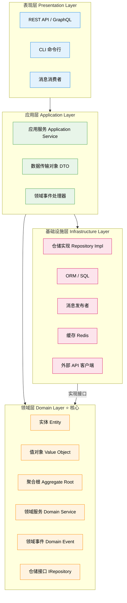

## 什么是领域驱动设计？

**领域驱动设计（Domain-Driven Design，DDD）** 由 Eric Evans 在 2003 年提出。它的核心思想是：**让软件模型与业务模型保持一致**——代码中的术语、结构、行为，应该直接反映业务专家的语言。

DDD 不是一套框架，而是一套**思想方法**，包含两大部分：
- **战略设计**：划分限界上下文（Bounded Context）、定义通用语言（Ubiquitous Language）
- **战术设计**：实体、值对象、聚合、仓储、领域服务、领域事件等构建块

本文聚焦**战术设计**，以分层架构为核心，展示 DDD 如何在代码中落地。

---

## DDD 四层架构



**关键约束**：领域层不依赖任何其他层，是整个系统的核心。

---

## 战术设计核心概念

### 1. 实体（Entity）

实体具有**唯一标识**，通过 ID 区分，即使属性完全相同，两个不同 ID 的实体也是不同的对象。实体的生命周期内状态可以改变。

```python
# domain/model/user.py
from dataclasses import dataclass, field
from uuid import UUID, uuid4
from datetime import datetime


@dataclass
class User:
    """用户实体 - 通过 user_id 唯一标识"""
    username: str
    email: str
    user_id: UUID = field(default_factory=uuid4)
    created_at: datetime = field(default_factory=datetime.utcnow)
    _is_active: bool = field(default=True, repr=False)

    @property
    def is_active(self) -> bool:
        return self._is_active

    def deactivate(self) -> None:
        if not self._is_active:
            raise ValueError("用户已经处于停用状态")
        self._is_active = False

    def change_email(self, new_email: str) -> None:
        if "@" not in new_email:
            raise ValueError(f"无效的邮件地址: {new_email}")
        self.email = new_email

    def __eq__(self, other: object) -> bool:
        if not isinstance(other, User):
            return False
        return self.user_id == other.user_id  # 实体相等性基于 ID

    def __hash__(self) -> int:
        return hash(self.user_id)
```

---

### 2. 值对象（Value Object）

值对象**没有唯一标识**，通过所有属性值来判断相等性，且是**不可变的**。值对象描述"是什么"，而不是"是哪个"。

```python
# domain/model/money.py
from dataclasses import dataclass
from decimal import Decimal


@dataclass(frozen=True)  # frozen=True 确保不可变
class Money:
    """金额值对象 - 金额+货币的组合"""
    amount: Decimal
    currency: str

    def __post_init__(self):
        if self.amount < 0:
            raise ValueError("金额不能为负数")
        if len(self.currency) != 3:
            raise ValueError("货币代码必须是 3 位（如 CNY、USD）")

    def add(self, other: "Money") -> "Money":
        if self.currency != other.currency:
            raise ValueError(f"不能将 {self.currency} 与 {other.currency} 相加")
        return Money(self.amount + other.amount, self.currency)

    def multiply(self, factor: Decimal) -> "Money":
        return Money(self.amount * factor, self.currency)

    def __str__(self) -> str:
        return f"{self.currency} {self.amount:.2f}"


# 值对象的相等性基于值，而不是内存地址
price1 = Money(Decimal("99.00"), "CNY")
price2 = Money(Decimal("99.00"), "CNY")
assert price1 == price2  # True！两个不同对象但值相同


# domain/model/address.py
@dataclass(frozen=True)
class Address:
    """地址值对象"""
    province: str
    city: str
    district: str
    street: str
    postal_code: str

    @property
    def full_address(self) -> str:
        return f"{self.province}{self.city}{self.district}{self.street}"
```

---

### 3. 聚合根（Aggregate Root）

聚合是**一组紧密关联的对象**的集合，聚合根是这个集合的入口点和守卫者。外部代码只能通过聚合根访问聚合内的对象，聚合根负责**维护聚合内的不变性规则（Invariants）**。

```python
# domain/model/order.py
from dataclasses import dataclass, field
from decimal import Decimal
from uuid import UUID, uuid4
from datetime import datetime
from domain.model.money import Money
from domain.model.address import Address
from domain.events.order_events import OrderConfirmedEvent, OrderCancelledEvent


@dataclass
class OrderLine:
    """订单行 - 聚合内的实体，只能通过 Order 操作"""
    product_id: UUID
    product_name: str
    quantity: int
    unit_price: Money
    line_id: UUID = field(default_factory=uuid4)

    @property
    def subtotal(self) -> Money:
        return self.unit_price.multiply(Decimal(self.quantity))


@dataclass
class Order:
    """订单聚合根 - 维护订单的所有不变性规则"""
    customer_id: UUID
    shipping_address: Address
    order_id: UUID = field(default_factory=uuid4)
    _lines: list[OrderLine] = field(default_factory=list, repr=False)
    _status: str = field(default="draft", repr=False)
    _domain_events: list = field(default_factory=list, repr=False)
    created_at: datetime = field(default_factory=datetime.utcnow)

    # ---- 业务行为 ----

    def add_item(self, product_id: UUID, name: str, qty: int, price: Money) -> None:
        """添加订单行（聚合内的不变性：每种商品只能有一行）"""
        if any(line.product_id == product_id for line in self._lines):
            raise ValueError(f"商品 {product_id} 已在订单中，请修改数量而非重复添加")
        if qty <= 0:
            raise ValueError("商品数量必须大于 0")
        self._lines.append(OrderLine(product_id, name, qty, price))

    def remove_item(self, product_id: UUID) -> None:
        self._lines = [l for l in self._lines if l.product_id != product_id]

    def confirm(self) -> None:
        """确认订单，触发领域事件"""
        if self._status != "draft":
            raise ValueError(f"只有草稿状态的订单可以确认，当前: {self._status}")
        if not self._lines:
            raise ValueError("订单中没有商品，无法确认")
        self._status = "confirmed"
        # 发布领域事件
        self._domain_events.append(OrderConfirmedEvent(
            order_id=self.order_id,
            customer_id=self.customer_id,
            total_amount=self.total_amount,
        ))

    def cancel(self, reason: str) -> None:
        if self._status in ("cancelled", "shipped"):
            raise ValueError(f"当前状态 {self._status} 无法取消")
        self._status = "cancelled"
        self._domain_events.append(OrderCancelledEvent(
            order_id=self.order_id,
            reason=reason,
        ))

    # ---- 查询属性 ----

    @property
    def total_amount(self) -> Money:
        if not self._lines:
            return Money(Decimal("0"), "CNY")
        result = self._lines[0].subtotal
        for line in self._lines[1:]:
            result = result.add(line.subtotal)
        return result

    @property
    def status(self) -> str:
        return self._status

    @property
    def lines(self) -> list[OrderLine]:
        return list(self._lines)  # 返回副本，防止外部修改

    def pop_domain_events(self) -> list:
        """消费领域事件（应用层负责分发）"""
        events = list(self._domain_events)
        self._domain_events.clear()
        return events
```

---

### 4. 仓储（Repository）

仓储提供了一个**类似集合的接口**来访问聚合根，屏蔽了底层存储细节。**接口定义在领域层，实现在基础设施层**。

```python
# domain/repositories/order_repository.py  （领域层，只有接口）
from abc import ABC, abstractmethod
from uuid import UUID
from domain.model.order import Order


class IOrderRepository(ABC):

    @abstractmethod
    def add(self, order: Order) -> None:
        """将新订单加入仓储"""
        ...

    @abstractmethod
    def get(self, order_id: UUID) -> Order | None:
        """根据 ID 获取订单，不存在返回 None"""
        ...

    @abstractmethod
    def list_by_customer(self, customer_id: UUID) -> list[Order]:
        """获取某客户的所有订单"""
        ...

    @abstractmethod
    def update(self, order: Order) -> None:
        """更新已有订单"""
        ...
```

```python
# infrastructure/repositories/sql_order_repository.py  （基础设施层，具体实现）
from uuid import UUID
from sqlalchemy.orm import Session
from domain.model.order import Order
from domain.repositories.order_repository import IOrderRepository
from infrastructure.orm.order_orm import OrderORM
from infrastructure.mappers.order_mapper import OrderMapper


class SqlOrderRepository(IOrderRepository):

    def __init__(self, session: Session):
        self._session = session

    def add(self, order: Order) -> None:
        orm = OrderMapper.to_orm(order)
        self._session.add(orm)

    def get(self, order_id: UUID) -> Order | None:
        orm = self._session.get(OrderORM, str(order_id))
        return OrderMapper.to_domain(orm) if orm else None

    def list_by_customer(self, customer_id: UUID) -> list[Order]:
        orms = self._session.query(OrderORM).filter_by(
            customer_id=str(customer_id)
        ).all()
        return [OrderMapper.to_domain(orm) for orm in orms]

    def update(self, order: Order) -> None:
        orm = self._session.get(OrderORM, str(order.order_id))
        if not orm:
            raise ValueError(f"订单 {order.order_id} 不存在")
        OrderMapper.update_orm(orm, order)
```

---

### 5. 领域服务（Domain Service）

当某个业务操作**跨越多个聚合**，或者不自然地归属于某个实体时，应使用领域服务。

```python
# domain/services/pricing_service.py
from decimal import Decimal
from domain.model.money import Money
from domain.model.order import Order


class PricingService:
    """定价领域服务：计算跨聚合的折扣规则（不属于 Order 或 Customer 单独负责）"""

    def calculate_discount(self, order: Order, customer_tier: str) -> Money:
        """根据客户等级计算折扣金额"""
        discount_rates = {
            "bronze": Decimal("0.00"),
            "silver": Decimal("0.05"),
            "gold": Decimal("0.10"),
            "platinum": Decimal("0.15"),
        }
        rate = discount_rates.get(customer_tier, Decimal("0.00"))
        return order.total_amount.multiply(rate)

    def apply_coupon(self, order: Order, coupon_code: str) -> Money:
        """应用优惠券（实际场景中还需查询优惠券仓储）"""
        fixed_coupons = {
            "SAVE20": Money(Decimal("20"), "CNY"),
            "SAVE50": Money(Decimal("50"), "CNY"),
        }
        return fixed_coupons.get(coupon_code, Money(Decimal("0"), "CNY"))
```

---

### 6. 领域事件（Domain Event）

领域事件表示**领域中发生了某件重要的事情**，是聚合之间解耦通信的核心机制。

```python
# domain/events/order_events.py
from dataclasses import dataclass
from uuid import UUID
from datetime import datetime
from domain.model.money import Money


@dataclass(frozen=True)
class DomainEvent:
    occurred_at: datetime = None

    def __post_init__(self):
        object.__setattr__(self, 'occurred_at', datetime.utcnow())


@dataclass(frozen=True)
class OrderConfirmedEvent(DomainEvent):
    """订单确认后发布，通知库存服务、积分服务、通知服务等"""
    order_id: UUID = None
    customer_id: UUID = None
    total_amount: Money = None


@dataclass(frozen=True)
class OrderCancelledEvent(DomainEvent):
    """订单取消后发布，触发退款流程"""
    order_id: UUID = None
    reason: str = ""
```

---

### 7. 应用服务（Application Service）

应用服务是**领域层的编排者**，它不包含业务逻辑，只负责：加载聚合、调用领域方法、持久化、分发领域事件。

```python
# application/services/order_application_service.py
from dataclasses import dataclass
from decimal import Decimal
from uuid import UUID
from domain.model.order import Order
from domain.model.money import Money
from domain.model.address import Address
from domain.repositories.order_repository import IOrderRepository
from domain.services.pricing_service import PricingService
from application.event_bus import EventBus


@dataclass
class PlaceOrderCommand:
    customer_id: UUID
    customer_tier: str
    shipping_address: dict
    items: list[dict]
    coupon_code: str | None = None


class OrderApplicationService:
    def __init__(
        self,
        order_repo: IOrderRepository,
        pricing_service: PricingService,
        event_bus: EventBus,
    ):
        self._order_repo = order_repo
        self._pricing = pricing_service
        self._event_bus = event_bus

    def place_order(self, cmd: PlaceOrderCommand) -> UUID:
        # 1. 构建地址值对象
        address = Address(**cmd.shipping_address)

        # 2. 创建订单聚合根
        order = Order(customer_id=cmd.customer_id, shipping_address=address)

        # 3. 添加商品
        for item in cmd.items:
            order.add_item(
                product_id=item["product_id"],
                name=item["name"],
                qty=item["quantity"],
                price=Money(Decimal(str(item["unit_price"])), "CNY"),
            )

        # 4. 应用折扣（领域服务）
        discount = self._pricing.calculate_discount(order, cmd.customer_tier)
        if cmd.coupon_code:
            coupon_discount = self._pricing.apply_coupon(order, cmd.coupon_code)
            discount = discount.add(coupon_discount)

        # 5. 确认订单（触发领域事件）
        order.confirm()

        # 6. 持久化
        self._order_repo.add(order)

        # 7. 分发领域事件（通知其他限界上下文）
        for event in order.pop_domain_events():
            self._event_bus.publish(event)

        return order.order_id
```

---

## 完整项目结构

```plaintext
ecommerce/
├── domain/                         # 领域层（纯业务，零外部依赖）
│   ├── model/
│   │   ├── order.py                # Order 聚合根 + OrderLine 实体
│   │   ├── user.py                 # User 实体
│   │   ├── money.py                # Money 值对象
│   │   └── address.py              # Address 值对象
│   ├── repositories/
│   │   ├── order_repository.py     # IOrderRepository 接口
│   │   └── user_repository.py      # IUserRepository 接口
│   ├── services/
│   │   └── pricing_service.py      # 领域服务
│   └── events/
│       └── order_events.py         # 领域事件定义
│
├── application/                    # 应用层（编排，不含业务规则）
│   ├── services/
│   │   └── order_application_service.py
│   ├── commands/                   # 命令对象（写操作）
│   │   └── place_order_command.py
│   ├── queries/                    # 查询对象（读操作，可绕过领域层）
│   │   └── get_order_query.py
│   └── event_bus.py                # 领域事件总线接口
│
├── infrastructure/                 # 基础设施层（技术实现）
│   ├── repositories/
│   │   └── sql_order_repository.py
│   ├── orm/
│   │   └── order_orm.py            # SQLAlchemy ORM 模型
│   ├── mappers/
│   │   └── order_mapper.py         # 领域对象 ↔ ORM 模型映射
│   ├── messaging/
│   │   └── rabbitmq_event_bus.py   # 领域事件总线实现
│   └── config/
│       └── database.py
│
├── presentation/                   # 表现层（HTTP / CLI / MQ）
│   ├── api/
│   │   ├── routers/
│   │   │   └── order_router.py
│   │   └── schemas/                # Pydantic 请求/响应模型
│   │       └── order_schema.py
│   └── cli/
│       └── admin_commands.py
│
└── main.py                         # 应用入口 + 依赖注入组装
```

---

## DDD 核心概念速查表

| 概念 | 特征 | 判断标准 |
|------|------|----------|
| **实体（Entity）** | 有唯一 ID，状态可变 | 问：同样属性的两个对象是"同一个"还是"两个"？如果是"两个"→ 实体 |
| **值对象（Value Object）** | 无 ID，不可变，值相等即相等 | 问：它描述的是"某物的特征"而不是"某物本身"？→ 值对象 |
| **聚合根（Aggregate Root）** | 一组对象的唯一入口，维护不变性 | 问：这组对象需要"整体保持一致"吗？→ 聚合 |
| **领域服务（Domain Service）** | 无状态，跨聚合操作 | 问：这个操作属于哪个实体？如果不属于任何实体 → 领域服务 |
| **领域事件（Domain Event）** | 不可变，描述已发生的事 | 问：业务上"某件重要的事发生了"，需要通知其他系统？→ 领域事件 |
| **仓储（Repository）** | 集合语义，只处理聚合根 | 一个聚合根对应一个仓储接口 |
| **应用服务（Application Service）** | 编排，无业务逻辑 | 只调用领域对象，不写 if/else 业务判断 |

---

## 何时选择 DDD 分层架构？

**适合使用 DDD 的场景**：
- 业务规则复杂，存在大量"不变性约束"（如订单状态机）
- 需要多个团队协作，需要清晰的限界上下文划分
- 系统需要长期演进，希望业务逻辑不被技术细节污染
- 与领域专家深度合作，需要共享通用语言

**不适合 DDD 的场景**：
- 简单 CRUD 系统（用 MVC 三层就够了）
- 快速原型验证，后期再演进
- 团队对 DDD 概念不熟悉且没有时间学习

---

## 参考资料

- Eric Evans - *Domain-Driven Design: Tackling Complexity in the Heart of Software* (2003)
- Vaughn Vernon - *Implementing Domain-Driven Design* (2013)
- Vaughn Vernon - *Domain-Driven Design Distilled* (2016)
