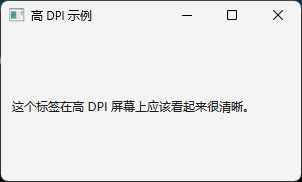

### 让Qt应用在高DOI或者高分辨率显示器上看起来更加清晰  （最新pyqt6已经不需要设置）


QApplication.setAttribute(Qt.AA_EnableHighDpiScaling, True)
QApplication.setAttribute(Qt.AA_UseHighDpiPixmaps, True)


**目的**

这两行代码的目的是让你的 Qt 应用程序在高 DPI（Dots Per Inch，每英寸点数）或高分辨率显示器（例如 Retina 屏、4K 显示器）上看起来更清晰、大小更合适。

**代码解释**

1.  `QApplication.setAttribute(Qt.AA_EnableHighDpiScaling, True)`
    * `QApplication`: 这是你的 Qt 应用程序的核心类。
    * `setAttribute`: 这是设置应用程序级别属性的方法。
    * `Qt.AA_EnableHighDpiScaling`: 这是一个枚举值（属性标志）。当它被设置为 `True` 时，它告诉 Qt 启用基于显示器 DPI 的自动缩放。这意味着 Qt 会尝试自动调整窗口、控件（按钮、文本框等）的大小以及字体大小，使它们在不同 DPI 的屏幕上看起来比例一致。
    * `True`: 启用这个属性。

2.  `QApplication.setAttribute(Qt.AA_UseHighDpiPixmaps, True)`
    * `Qt.AA_UseHighDpiPixmaps`: 这是另一个属性标志。当它被设置为 `True` 时，它告诉 Qt 在高 DPI 显示器上使用高分辨率版本的像素图（pixmaps），也就是图标和图片。如果你为图标提供了 `@2x` 或类似的高分辨率版本（例如 `icon.png` 和 `icon@2x.png`），设置此项能让 Qt 自动选择合适的版本，从而在高 DPI 屏幕上显示清晰的图标，而不是模糊的低分辨率版本。
    * `True`: 启用这个属性。

**何时以及如何使用**

这两行代码**非常重要**的一点是：它们**必须**在创建 `QApplication` 实例**之前**被调用。因为它们影响应用程序如何初始化以及如何与操作系统的显示设置交互。

**简单示例 (以 PyQt5 为例)**

```python
import sys

# 导入你需要的 PyQt 或 PySide 模块
# 可能是 PyQt5, PyQt6, PySide2, PySide6
# 这里以 PyQt6 为例
# from PyQt6.QtWidgets import QApplication, QWidget, QLabel, QVBoxLayout
# from PyQt6.QtCore import Qt # Qt 模块包含枚举值


from PyQt5.QtWidgets import (
    QMainWindow, QWidget, QVBoxLayout, QHBoxLayout, 
    QTabWidget, QAction, QFileDialog, QMessageBox,
    QSplitter, QToolBar, QStatusBar, QLabel, QComboBox,QApplication
)
from PyQt5.QtCore import Qt


# --- 关键步骤 ---
# 在创建 QApplication 实例之前设置高 DPI 属性
# 注意: 在 Qt 6 已经自动支持了， 所以不需要单独写代码


#       在 Qt 5 中，通常直接是 Qt.AA_...
# 设置高 DPI 支持
# PyQt5 需要显式启用高 DPI 缩放
QApplication.setAttribute(Qt.AA_EnableHighDpiScaling, True)
QApplication.setAttribute(Qt.AA_UseHighDpiPixmaps, True)
# --- 关键步骤结束 ---

# 创建 QApplication 实例
# sys.argv 允许你传递命令行参数给应用程序
app = QApplication(sys.argv)

# 创建一个简单的窗口
window = QWidget()
window.setWindowTitle('高 DPI 示例')

# 添加一些控件
layout = QVBoxLayout()
label = QLabel('这个标签在高 DPI 屏幕上应该看起来很清晰。')
layout.addWidget(label)
window.setLayout(layout)

# 设置窗口大小并显示
window.resize(300, 150)
window.show()

# 启动应用程序的事件循环
# 程序会在这里等待用户交互，直到窗口关闭
sys.exit(app.exec())

```




**总结**

* 为了让你的 PyQt/PySide 应用在现代高分辨率屏幕上获得良好的视觉效果（避免元素过小或图像模糊），请在创建 `QApplication` 对象之前添加这两行代码（pyqt5）。
* `AA_EnableHighDpiScaling` 主要负责 UI 元素（控件、字体、布局）的缩放。
* `AA_UseHighDpiPixmaps` 主要负责图像和图标的清晰度。

在较新的 Qt 版本（尤其是 Qt 6）中，`AA_EnableHighDpiScaling` 可能已经是默认启用的，但显式设置它是一个好的实践，可以确保跨版本和平台的兼容性。而 `AA_UseHighDpiPixmaps` 通常仍然需要显式设置以加载高分辨率图像资源。


### 设备像素比

除了之前提到的 `AA_EnableHighDpiScaling` 和 `AA_UseHighDpiPixmaps` 这两个用于**自动**处理高 DPI 的应用程序属性之外，还有一些相关的函数和概念，它们允许你**查询** DPI 信息或进行更手动的控制。

最接近且常用的相关功能是查询**设备像素比 (Device Pixel Ratio)**。

**核心概念：设备像素比 (Device Pixel Ratio)**

* **定义**：设备像素比是指物理像素（屏幕上实际的光点）与设备无关像素（也称为逻辑像素，是应用程序绘制时使用的标准坐标单位，通常基于 96 DPI）之间的比例。
* **意义**：
    * 在标准 DPI 显示器上，这个比例通常是 1.0。
    * 在高 DPI 显示器（如 Retina 或 4K 屏）上，这个比例会大于 1.0（例如 1.5, 2.0, 2.5 等），表示一个逻辑像素对应了多个物理像素。
* **用途**：你可以使用这个比率来：
    1.  **手动缩放**：在需要精确控制像素的情况下（例如自定义绘图 `paintEvent`），将逻辑坐标或尺寸乘以这个比率来得到物理像素尺寸。
    2.  **加载资源**：根据比率选择不同分辨率的图像资源（虽然 `AA_UseHighDpiPixmaps` 通常会自动处理）。
    3.  **调试**：检查应用程序当前的缩放状态。

**相关函数和类**

1.  `QWidget.devicePixelRatio() -> int` / `QWidget.devicePixelRatioF() -> float`
    * 获取**控件（Widget）当前所在屏幕**的设备像素比。
    * 返回整数版本 (`devicePixelRatio`) 或更精确的浮点数版本 (`devicePixelRatioF`)。
    * 这是最常用的，因为它直接关联到你正在操作的那个窗口或控件。

2.  `QScreen` 类
    * 代表一个物理显示屏幕。
    * `QGuiApplication.primaryScreen()`: 获取系统的主屏幕对象。
    * `QWidget.screen()`: 获取控件当前所在的 `QScreen` 对象。
    * `QScreen.devicePixelRatio() -> float`: 获取**这个特定屏幕**的设备像素比。
    * `QScreen.logicalDotsPerInch() -> float`: 获取屏幕的逻辑 DPI (通常是 96 DPI，但也可能被系统设置为其他值)。
    * `QScreen.physicalDotsPerInch() -> float`: 获取屏幕的物理 DPI (实际硬件的像素密度)。
    * `QScreen.geometry() -> QRect`: 获取屏幕的几何尺寸（使用逻辑像素）。
    * `QScreen.availableGeometry() -> QRect`: 获取屏幕的可用几何尺寸（排除任务栏等，使用逻辑像素）。

**教程和示例**

下面的示例展示了如何获取窗口和屏幕的设备像素比以及其他相关信息，并包含了一个简单的自定义绘图控件，演示如何在 `paintEvent` 中考虑像素比。

```python
import sys
from PyQt6.QtWidgets import (QApplication, QMainWindow, QWidget, QLabel,
                             QVBoxLayout, QTextEdit)
# QGuiApplication 用于获取屏幕信息
from PyQt6.QtGui import QGuiApplication, QPainter, QColor, QFont, QPaintEvent
from PyQt6.QtCore import Qt, QRectF, QSize

# --- 依然建议先设置自动缩放属性 ---
# 这让 Qt 框架自动处理大部分 UI 元素的缩放
try:
    # Qt 6 风格
    QApplication.setAttribute(Qt.ApplicationAttribute.AA_EnableHighDpiScaling, True)
    QApplication.setAttribute(Qt.ApplicationAttribute.AA_UseHighDpiPixmaps, True)
except AttributeError:
    # Qt 5 风格
    QApplication.setAttribute(Qt.AA_EnableHighDpiScaling, True)
    QApplication.setAttribute(Qt.AA_UseHighDpiPixmaps, True)
# ---

# 自定义绘图控件，演示如何在 paintEvent 中使用 devicePixelRatio
class DrawingWidget(QWidget):
    def minimumSizeHint(self) -> QSize:
        # 提供一个基于逻辑像素的最小尺寸提示
        return QSize(200, 100)

    # 重写 paintEvent 进行自定义绘图
    def paintEvent(self, event: QPaintEvent):
        painter = QPainter(self)
        painter.setRenderHint(QPainter.RenderHint.Antialiasing) # 让绘制更平滑

        # 获取当前控件的设备像素比 (浮点数版本更精确)
        ratio = self.devicePixelRatioF()

        # 准备绘制信息
        text = f"Device Pixel Ratio: {ratio:.2f}"
        logical_rect = QRectF(10.0, 10.0, 180.0, 50.0) # 使用逻辑像素定义矩形

        # 绘制背景矩形 (QPainter 默认使用逻辑坐标)
        painter.setBrush(QColor(230, 240, 255)) # 淡蓝色背景
        painter.setPen(Qt.PenStyle.NoPen)       # 无边框
        painter.drawRoundedRect(logical_rect, 5.0, 5.0) # 圆角矩形

        # 绘制文字 (QPainter 会根据 Qt 的缩放设置自动处理字体大小)
        # 但如果你需要基于物理像素精确控制，可能需要手动计算
        painter.setPen(QColor("black"))
        font = QFont()
        # 你可以尝试设置逻辑点大小，Qt 会处理缩放
        font.setPointSizeF(10)
        painter.setFont(font)

        # 在矩形内绘制文本 (文本位置也是逻辑坐标)
        painter.drawText(logical_rect.adjusted(5, 5, -5, -5), Qt.AlignmentFlag.AlignCenter, text)

        # 示例：如果需要绘制一个固定物理像素大小的线条 (需要手动计算)
        # 假设需要绘制一条 2 个物理像素宽的线
        physical_line_width = 2
        logical_line_width = physical_line_width / ratio # 计算对应的逻辑宽度

        pen = painter.pen() # 获取当前画笔
        pen.setColor(QColor("red"))
        pen.setWidthF(logical_line_width) # 设置逻辑宽度
        painter.setPen(pen)

        # 绘制线条 (坐标仍是逻辑像素)
        painter.drawLine(int(logical_rect.left()), int(logical_rect.bottom()) + 10,
                         int(logical_rect.right()), int(logical_rect.bottom()) + 10)

        painter.end() # 结束绘制

# 主窗口类
class MainWindow(QMainWindow):
    def __init__(self):
        super().__init__()
        self.setWindowTitle("查询 DPI 和设备像素比")
        self.setGeometry(100, 100, 500, 450) # 初始位置和大小 (逻辑像素)

        # 用于显示信息的文本框
        self.info_display = QTextEdit()
        self.info_display.setReadOnly(True)
        self.info_display.setLineWrapMode(QTextEdit.LineWrapMode.NoWrap) # 不自动换行

        # 自定义绘图控件实例
        self.drawing_widget = DrawingWidget()

        # 布局
        central_widget = QWidget()
        layout = QVBoxLayout(central_widget)
        layout.addWidget(QLabel("信息查询结果:"))
        layout.addWidget(self.info_display)
        layout.addWidget(QLabel("自定义绘图区域:"))
        layout.addWidget(self.drawing_widget)

        self.setCentralWidget(central_widget)

        # 在窗口显示后查询信息会更可靠
        self.initial_query_done = False

    # 查询并显示 DPI 和屏幕信息
    def query_and_display_info(self):
        info = []

        # 1. 获取窗口自身的设备像素比
        #    注意: 最好在窗口实际显示到屏幕上之后获取 (例如在 showEvent 或 moveEvent 中)
        window_dpr = self.devicePixelRatio()
        window_dpr_f = self.devicePixelRatioF()
        info.append(f"--- 窗口 (Window) ---")
        info.append(f"devicePixelRatio(): {window_dpr} (int)")
        info.append(f"devicePixelRatioF(): {window_dpr_f:.2f} (float)")

        # 2. 获取窗口所在的屏幕信息
        current_screen = self.screen() # QWidget.screen() 获取当前屏幕
        if not current_screen:
            # 如果窗口还没显示或找不到屏幕，尝试获取主屏幕
            current_screen = QGuiApplication.primaryScreen()

        if current_screen:
            screen_name = current_screen.name()
            screen_dpr = current_screen.devicePixelRatio()
            logical_dpi_x = current_screen.logicalDotsPerInchX()
            logical_dpi_y = current_screen.logicalDotsPerInchY()
            physical_dpi_x = current_screen.physicalDotsPerInchX()
            physical_dpi_y = current_screen.physicalDotsPerInchY()
            geometry = current_screen.geometry() # 逻辑像素矩形
            available_geometry = current_screen.availableGeometry() # 可用逻辑像素矩形

            info.append(f"\n--- 当前屏幕 (Screen: {screen_name}) ---")
            info.append(f"devicePixelRatio(): {screen_dpr:.2f}")
            info.append(f"logicalDotsPerInch (X, Y): {logical_dpi_x:.1f}, {logical_dpi_y:.1f}")
            info.append(f"physicalDotsPerInch (X, Y): {physical_dpi_x:.1f}, {physical_dpi_y:.1f}")
            info.append(f"geometry (逻辑像素): {geometry.width()}x{geometry.height()} @ ({geometry.x()},{geometry.y()})")
            info.append(f"availableGeometry (逻辑像素): {available_geometry.width()}x{available_geometry.height()}")

            # 计算物理像素尺寸
            physical_width = geometry.width() * screen_dpr
            physical_height = geometry.height() * screen_dpr
            info.append(f"物理像素 (计算): {int(physical_width)}x{int(physical_height)}")
        else:
            info.append("\n无法获取屏幕信息。")

        self.info_display.setText("\n".join(info))
        # 更新自定义绘图区域，因为它依赖于 devicePixelRatio
        self.drawing_widget.update()

    # 重写 showEvent，在窗口首次显示时查询信息
    def showEvent(self, event):
        super().showEvent(event)
        if not self.initial_query_done:
            self.query_and_display_info()
            self.initial_query_done = True

    # 重写 moveEvent，当窗口移动（可能移动到不同 DPI 的屏幕）时更新信息
    def moveEvent(self, event):
        super().moveEvent(event)
        # 只有在窗口可见时移动才更新，避免初始化时多次调用
        if self.isVisible():
            self.query_and_display_info()

# --- 主程序入口 ---
app = QApplication(sys.argv)
main_window = MainWindow()
main_window.show()
sys.exit(app.exec())
```

**代码解释**

1.  **`AA_` 属性设置**：我们仍然保留了开头的 `AA_EnableHighDpiScaling` 和 `AA_UseHighDpiPixmaps` 设置，因为它们是让 Qt 框架自动处理大部分 UI 缩放的基础，推荐使用。
2.  **`DrawingWidget`**：这是一个自定义控件，重写了 `paintEvent`。
    * 在 `paintEvent` 内部，我们首先通过 `self.devicePixelRatioF()` 获取当前控件的设备像素比 `ratio`。
    * 我们使用 `QPainter` 进行绘图。`QPainter` 的坐标系统默认是基于**逻辑像素**的。当你调用 `drawRect`, `drawText` 等函数时，你提供的坐标和尺寸是逻辑单位。
    * Qt 的渲染引擎在启用了高 DPI 缩放后，会自动将这些逻辑坐标映射到物理像素上进行绘制。因此，对于标准的控件和文本绘制，你通常**不需要**手动乘以 `ratio`。
    * **手动缩放场景**：示例中演示了如果你需要绘制一个具有**固定物理像素宽度**的线条（例如 2 像素），你需要用物理宽度除以 `ratio` 得到对应的逻辑宽度，然后设置给 `QPen`。这是手动控制像素级细节的一个例子。
3.  **`MainWindow`**：
    * `query_and_display_info` 方法：
        * 获取窗口自身的 `devicePixelRatio()` 和 `devicePixelRatioF()`。
        * 通过 `self.screen()` 或 `QGuiApplication.primaryScreen()` 获取当前的 `QScreen` 对象。
        * 从 `QScreen` 对象获取更详细的信息，如屏幕的 `devicePixelRatio`, 逻辑 DPI, 物理 DPI, 几何尺寸（逻辑像素）等。
        * 计算并显示屏幕的物理像素尺寸。
    * `showEvent` 和 `moveEvent`：重写这两个事件处理函数，确保在窗口首次显示或移动到新屏幕时，调用 `query_and_display_info` 来更新显示的信息，并触发 `DrawingWidget` 的重绘 (`update()`)。

**总结**

* `AA_EnableHighDpiScaling` 和 `AA_UseHighDpiPixmaps` 是实现**自动**高 DPI 适应性的关键属性，适用于大多数标准 UI 元素。
* `QWidget.devicePixelRatio()`, `QWidget.devicePixelRatioF()` 和 `QScreen` 类及其方法允许你**查询**当前的缩放比例和屏幕信息。
* 查询到的 `devicePixelRatio` 对于需要**手动控制像素级细节**的场景（如自定义绘图、与需要物理像素坐标的库交互）非常有用。
* 对于标准的 `QPainter` 绘图操作，通常使用逻辑坐标即可，Qt 的自动缩放机制会处理好物理像素的映射。只有在需要精确控制物理尺寸或绘制像素对齐的图形时，才需要手动介入计算。
