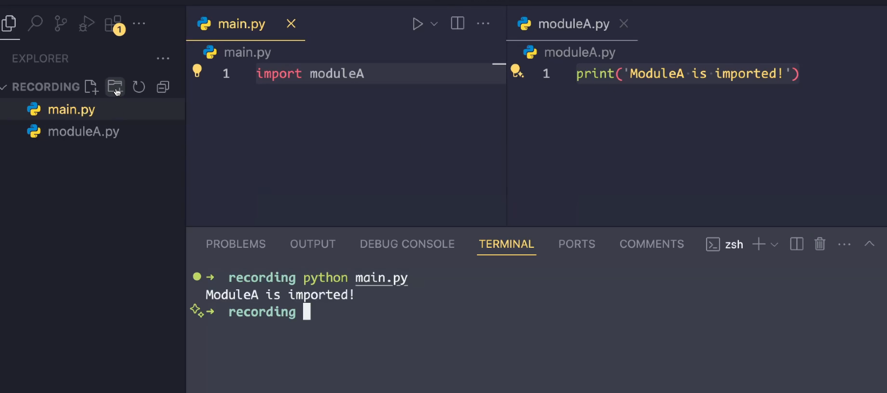
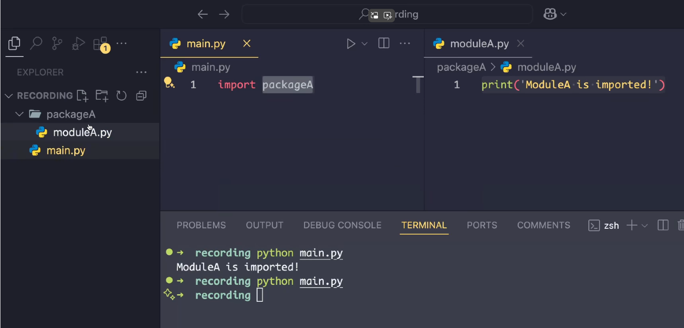
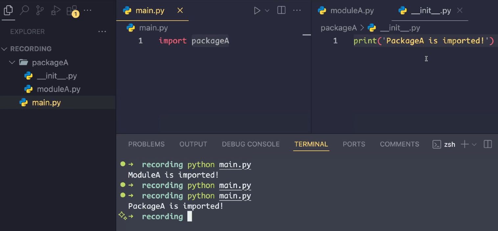

参考：

https://www.bilibili.com/video/BV1QA94YPEMK


### 特性


1. 如果两个文件在同一个路径下，这里是一个main，一个moduleA，当main中import moduleA，那么moduleA中的代码就会执行。




2. 但是如果ModelA在一个package里面，然后main中import packageA，那么modelA中的代码不会执行。




3. 如果package中有一个__init__.py，那么import package，__init__.py中的代码就会执行。




### 说明

在 Python 中，`__init__.py` 文件的主要作用是标记一个目录为 Python 的包（package）。它的存在告诉 Python 解释器，这个目录不仅仅是一个普通的文件夹，而是包含模块（modules）或子包的集合，可以被导入使用。以下是一些具体原因和用途：

1. **包的标识**  （只在py3.3之前）
   如果一个目录里没有 `__init__.py`，Python 不会把它当作包，你就无法通过 `import` 语句导入里面的模块。比如说，有个目录结构：
   ```
   my_package/
       __init__.py
       module1.py
       module2.py
   ```
   因为有 `__init__.py`，你可以用 `import my_package.module1` 来导入 `module1.py`。

2. **初始化代码**  
   `__init__.py` 可以包含代码，在包被导入时自动执行。比如，你可以在里面定义一些变量、函数，或者导入子模块，方便用户使用。例如：
   ```python
   # my_package/__init__.py
   from .module1 import some_function
   version = "1.0"
   ```
   这样，导入包时就能直接用 `my_package.some_function()` 或 `my_package.version`。

3. **控制导入行为**  
   你可以通过 `__init__.py` 指定当用户用 `from my_package import *` 时暴露哪些内容，用 `__all__` 变量来定义：
   ```python
   # my_package/__init__.py
   __all__ = ['module1', 'module2']
   from . import module1, module2
   ```

4. **历史背景**  
   在 Python 3.3 之前，`__init__.py` 是必须的，不然目录不会被识别为包。从 Python 3.3 开始引入了“命名空间包”（namespace packages），允许没有 `__init__.py` 的目录也能作为包的一部分，但 `__init__.py` 仍然是组织代码的常用方式。

**为什么需要写它？**  
简单来说，写 `__init__.py` 是为了让你的代码更有结构化、可重用性更强，尤其是在开发大型项目或库时。它就像一个“门面”，帮你管理模块的组织和初始化。

如果你只是随便写点小脚本，可能用不到它。但要是想把代码打包分享给别人，或者维护一个复杂的项目，`__init__.py` 就很有必要了。

有啥具体场景困扰你吗？可以告诉我，我帮你细化一下！