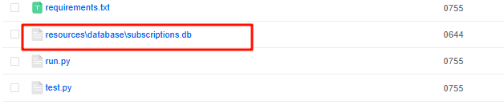

虽然也是老生常态的事情了，无论是把代码打包成exe还是在多平台的迁移上，经常会涉及到这个问题，原本我以为我已经不会再犯错了，没想到今天还是又犯错了，算是给自己提一个醒吧。

具体描述一下遇到了什么问题：

我写了一个项目，在项目中，我使用了绝对路径定义了一个sqlite数据库，如下：


在windows平台上运行没有问题，然后放到Linux上，重要的是！！！  它也不报错，然后我部署好之后我也没有看文件路径，心想没有报错能有什么事情，然后第二天发现没有按照原本方式执行，这时候就感觉有问题了，然后进入docker一看，生成了这么一个文件：



笑死了....


---

## 如何在python中定义文件路径

在项目中定义文件路径时，尤其是涉及到像 SQLite 数据库这样的资源，关键是要确保路径的**可移植性**和**可靠性**。以下是一些建议和操作步骤，帮助你在项目中合理定义和管理文件路径：

### 1. 理解相对路径和绝对路径
- **绝对路径**：从文件系统的根目录开始，例如 `/home/user/project/db/mydatabase.db`（Linux/Mac）或 `C:\Users\user\project\db\mydatabase.db`（Windows）。这种方式依赖具体的文件系统结构，不利于跨平台或项目迁移。
- **相对路径**：相对于当前工作目录或项目根目录，例如 `./db/mydatabase.db`。这种方式更灵活，推荐在项目中使用。

为了让项目更健壮，建议使用**相对路径**，并结合编程语言提供的工具动态生成路径。

---

### 2. SQLite 数据库路径的定义方法
假设你的项目结构如下：
```
project/
├── src/
│   └── main.py
├── db/
│   └── mydatabase.db
└── README.md
```

#### Python 示例
在 Python 中，可以使用 `os` 或 `pathlib` 模块来动态构建路径，确保跨平台兼容：

```python
import os
from pathlib import Path

# 方法 1：使用 os 模块
BASE_DIR = os.path.dirname(os.path.abspath(__file__))  # 获取当前脚本所在目录
DB_PATH = os.path.join(BASE_DIR, "..", "db", "mydatabase.db")  # 构建数据库路径
DB_PATH = os.path.normpath(DB_PATH)  # 规范化路径，处理斜杠差异

# 方法 2：使用 pathlib（更现代的方式）
BASE_DIR = Path(__file__).resolve().parent  # 当前脚本目录
DB_PATH = BASE_DIR / ".." / "db" / "mydatabase.db"  # 使用 / 拼接路径

# 连接 SQLite 数据库
import sqlite3
conn = sqlite3.connect(DB_PATH)
print(f"数据库路径: {DB_PATH}")
```

- **`__file__`**：表示当前脚本的文件路径。
- **`os.path.abspath`** 或 **`Path.resolve()`**：将路径转换为绝对路径，避免相对路径的歧义。
- **`os.path.join` 或 `Path` 的 `/` 操作符**：跨平台拼接路径，自动处理 Windows 和 Unix 的斜杠差异。

---

### 3. 最佳实践
#### a. 将路径定义为配置
将文件路径集中管理，避免硬编码。例如：
```python
# config.py
from pathlib import Path
BASE_DIR = Path(__file__).resolve().parent.parent  # 项目根目录
DB_PATH = BASE_DIR / "db" / "mydatabase.db"

# main.py
from config import DB_PATH
import sqlite3
conn = sqlite3.connect(DB_PATH)
```

#### b. 检查文件是否存在
在连接数据库前，确保文件存在：
```python
if not DB_PATH.exists():
    raise FileNotFoundError(f"数据库文件不存在: {DB_PATH}")
conn = sqlite3.connect(DB_PATH)
```

#### c. 考虑打包或部署
- 如果项目会被打包（如用 PyInstaller），相对路径可能失效。可以用以下方式动态检测：
```python
import sys
if getattr(sys, 'frozen', False):  # 如果是打包后的可执行文件
    BASE_DIR = Path(sys.executable).parent
else:
    BASE_DIR = Path(__file__).resolve().parent.parent
DB_PATH = BASE_DIR / "db" / "mydatabase.db"
```

#### d. 数据库初始化
如果数据库文件不存在，可以在代码中创建：
```python
if not DB_PATH.exists():
    conn = sqlite3.connect(DB_PATH)  # 创建空数据库
    # 这里可以添加表结构初始化代码
else:
    conn = sqlite3.connect(DB_PATH)
```

---

### 4. 注意事项
- **权限问题**：确保程序对目标路径有读写权限，尤其是部署到服务器时。
- **跨平台兼容**：始终使用 `os.path.join` 或 `pathlib` 处理路径，避免手动写斜杠。
- **安全性**：不要将数据库放在公开访问的目录（如 web 服务器的根目录），建议放在项目专用目录中。

---

### 5. 总结
对于你的 SQLite 数据库，推荐的做法是：
1. 将数据库放在项目目录的子文件夹中（如 `db/mydatabase.db`）。
2. 使用 `pathlib` 或 `os` 动态构建路径，基于项目根目录。
3. 将路径定义在配置文件中，方便维护。
4. 在代码中检查文件是否存在并处理异常。


