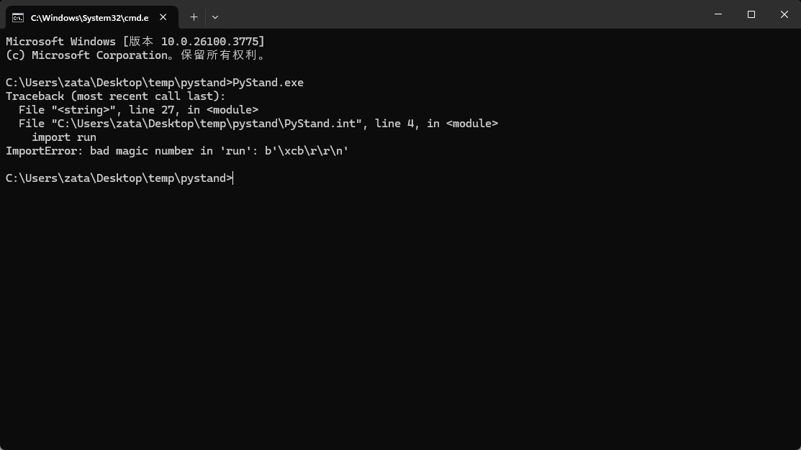
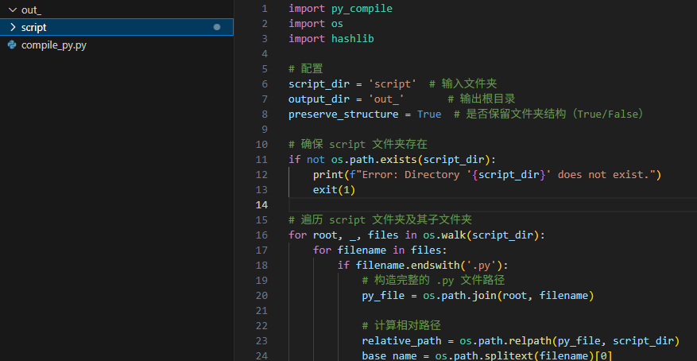
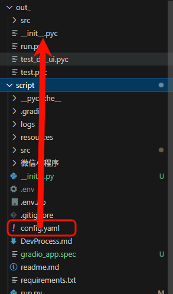
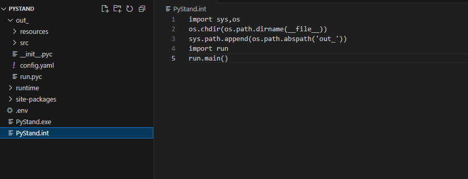

## py编译为pyc(为了代码加密)


### 问题提醒

#### 1. 版本号问题：编译版本和runtime版本不一致会导致报错




### 打包过程


我在2025年5月左右开发了一个软件项目，想要将其发布，代码中有我的api-key，因此我需要将代码进行加密。

（打包我使用的是PyStand项目，他最简单的方式当然是直接粘贴源码了。）

---

项目结构如下：

实际上必要的程序是我用红框圈起来的，src是放了我的核心代码，run.py是入口程序，然后config.yaml是配置文件


#### **1. 新建compile_py.py文件并填入代码**



其中script文件夹就是源码，out_文件夹用来防止编译后的文件，可以手动创建一下

<span style="corlor : red">需要注意的是，运行这边编译代码的py版本和runtime的嵌入版本要一致，大版本一致就行了，比如编译是3.11.16和runtime3.11.15好像没什么影响</span>


```py

import py_compile
import os
import hashlib

# 配置
script_dir = 'script'  # 输入文件夹
output_dir = 'out_'       # 输出根目录
preserve_structure = True  # 是否保留文件夹结构（True/False）

# 确保 script 文件夹存在
if not os.path.exists(script_dir):
    print(f"Error: Directory '{script_dir}' does not exist.")
    exit(1)

# 遍历 script 文件夹及其子文件夹
for root, _, files in os.walk(script_dir):
    for filename in files:
        if filename.endswith('.py'):
            # 构造完整的 .py 文件路径
            py_file = os.path.join(root, filename)
            
            # 计算相对路径
            relative_path = os.path.relpath(py_file, script_dir)
            base_name = os.path.splitext(filename)[0]
            
            if preserve_structure:
                # 保留文件夹结构：输出到 output_dir 下的相对路径
                pyc_relative_dir = os.path.dirname(relative_path)
                pyc_dir = os.path.join(output_dir, pyc_relative_dir)
                os.makedirs(pyc_dir, exist_ok=True)
                pyc_filename = f"{base_name}.pyc"
                pyc_file = os.path.join(pyc_dir, pyc_filename)
            else:
                # 不保留结构：平铺到 output_dir，使用哈希前缀避免冲突
                hash_prefix = hashlib.md5(relative_path.encode()).hexdigest()[:8]
                pyc_filename = f"{hash_prefix}_{base_name}.pyc"
                pyc_file = os.path.join(output_dir, pyc_filename)
            
            try:
                # 编译 .py 文件为 .pyc 文件
                py_compile.compile(py_file, cfile=pyc_file)
                print(f"Compiled {py_file} to {pyc_file}")
            except Exception as e:
                print(f"Failed to compile {py_file}: {e}")
```

#### **2. 不编译py外文件，手动修改**





因为不编译py文件以外的，但是需要用到配置文件，就手动移动一下，然后把整个文件夹移动到PyStand的分发包里面


（其中我把两个test文件删除了）




