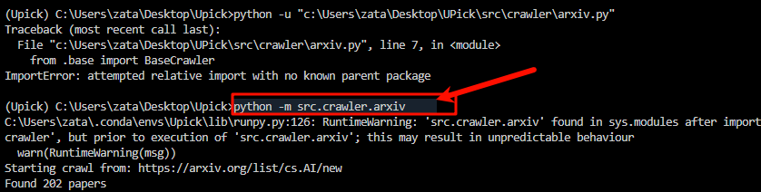

下面是一个简洁的教程，旨在帮助读者理解并解决你在运行 `arxiv.py` 时遇到的 `ImportError: attempted relative import with no known parent package` 错误。这个教程将从问题背景开始，逐步分析原因，并提供多种解决方案。

---

# 教程：解决 Python 相对导入错误 - "attempted relative import with no known parent package"

## 背景
假设你有一个 Python 项目，目录结构如下：
```
Upick/
├── src/
│   ├── crawler/
│   │   ├── arxiv.py
│   │   └── base.py
```
在 `arxiv.py` 中，你尝试使用相对导入：
```python
from .base import BaseCrawler
```
然后在命令行中运行：
```
python -u "c:\Users\zata\Desktop\UPick\src\crawler\arxiv.py"
```
结果却报错：
```
Traceback (most recent call last):
  File "c:\Users\zata\Desktop\UPick\src\crawler\arxiv.py", line 7, in <module>
    from .base import BaseCrawler
ImportError: attempted relative import with no known parent package
```
这个错误困扰了许多 Python 开发者。本教程将解释其原因并提供解决方案。

## 问题原因
在 Python 中，相对导入（例如 `from .base import BaseCrawler`）依赖于包结构。当你直接运行一个 `.py` 文件（例如 `python arxiv.py`），Python 会将其视为独立脚本，而不是包的一部分。这时，相对导入无法解析，因为 Python 不知道当前文件所属的包。

在这个例子中：
- `arxiv.py` 使用 `.base` 表示从同一目录（`crawler`）导入 `base.py`。
- 但直接运行 `arxiv.py` 时，Python 不认为 `crawler` 是一个包，因此无法找到 `.base`。

## 前置条件
要解决这个问题，确保你的项目满足以下条件：
1. `base.py` 存在于 `crawler` 目录下，并且定义了 `BaseCrawler` 类。
2. 你希望保持模块化的代码结构，而不是硬编码绝对路径。

## 解决方案

### 方法 1：以模块方式运行 (推荐)
Python 提供了 `-m` 参数，允许你以模块方式运行脚本，这样可以正确解析包结构。

#### 步骤：
1. **添加包标志文件**  
   确保 `crawler` 目录下有一个空的 `__init__.py` 文件。这是 Python 识别包的标志。更新后的结构：
   ```
   Upick/
   ├── src/
   │   ├── crawler/
   │   │   ├── __init__.py
   │   │   ├── arxiv.py
   │   │   └── base.py
   ```

2. **切换到项目根目录**  
   在命令行中进入 `Upick` 目录：
   ```
   cd C:\Users\zata\Desktop\Upick
   ```

3. **运行模块**  
   使用以下命令运行：
   ```
   python -m src.crawler.arxiv
   ```
   `-m` 表示将 `src.crawler.arxiv` 作为模块运行，而不是直接运行文件。

#### 为什么有效？
以模块方式运行时，Python 会从 `Upick` 开始解析包结构，识别 `src` 和 `crawler` 作为包，因此相对导入 `from .base import BaseCrawler` 可以正常工作。

---

### 方法 2：调整 PYTHONPATH
如果你希望直接运行文件，可以通过设置 `PYTHONPATH` 来告诉 Python 包的根目录。

#### 步骤：
1. **设置 PYTHONPATH**  
   将 `PYTHONPATH` 设置为包含 `src` 的父目录：
   ```
   set PYTHONPATH=C:\Users\zata\Desktop\Upick\src
   ```

2. **运行文件**  
   在命令行中运行：
   ```
   python -u "c:\Users\zata\Desktop\UPick\src\crawler\arxiv.py"
   ```

#### 注意：
- 仍然需要在 `crawler` 目录下有 `__init__.py` 文件。
- 这种方法不如方法 1 优雅，因为它依赖于环境变量。

---

### 方法 3：改为绝对导入
如果你不想依赖包结构，可以将相对导入改为绝对导入。

#### 步骤：
1. **修改导入语句**  
   编辑 `arxiv.py`，将：
   ```python
   from .base import BaseCrawler
   ```
   改为：
   ```python
   from src.crawler.base import BaseCrawler
   ```

2. **设置 PYTHONPATH**  
   在命令行中运行：
   ```
   set PYTHONPATH=C:\Users\zata\Desktop\Upick
   python -u "c:\Users\zata\Desktop\UPick\src\crawler\arxiv.py"
   ```

#### 优点与缺点：
- 优点：无需依赖包结构和 `__init__.py`。
- 缺点：代码中硬编码了路径，移植性较差。

---

### 方法 4：检查文件和结构
有时问题出在文件本身。确保以下几点：
- `base.py` 存在于 `crawler` 目录下。
- `base.py` 中正确定义了 `BaseCrawler` 类，例如：
  ```python
  # base.py
  class BaseCrawler:
      def __init__(self):
          print("BaseCrawler initialized")
  ```
- `crawler` 目录下有 `__init__.py`。

## 推荐方案
**方法 1（以模块方式运行）** 是最符合 Python 标准的做法：
- 简单且直观。
- 不需要修改代码。
- 保持了包结构的完整性。

执行以下步骤即可：
```
cd C:\Users\zata\Desktop\Upick
python -m src.crawler.arxiv
```

## 测试与验证
运行后，如果没有错误，`arxiv.py` 将成功导入 `BaseCrawler` 并执行后续逻辑。如果仍有问题，可以检查：
- 是否遗漏了 `__init__.py`。
- `base.py` 中的类名是否拼写正确。

## 总结
Python 的相对导入依赖于包结构，直接运行脚本会导致 `ImportError`。通过以模块方式运行（`python -m`）、调整 `PYTHONPATH` 或改为绝对导入，你可以轻松解决问题。根据项目需求选择适合的方法，但通常以模块方式运行是最优解。

