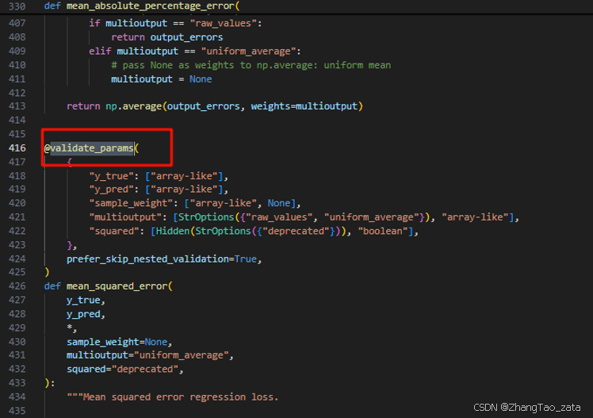
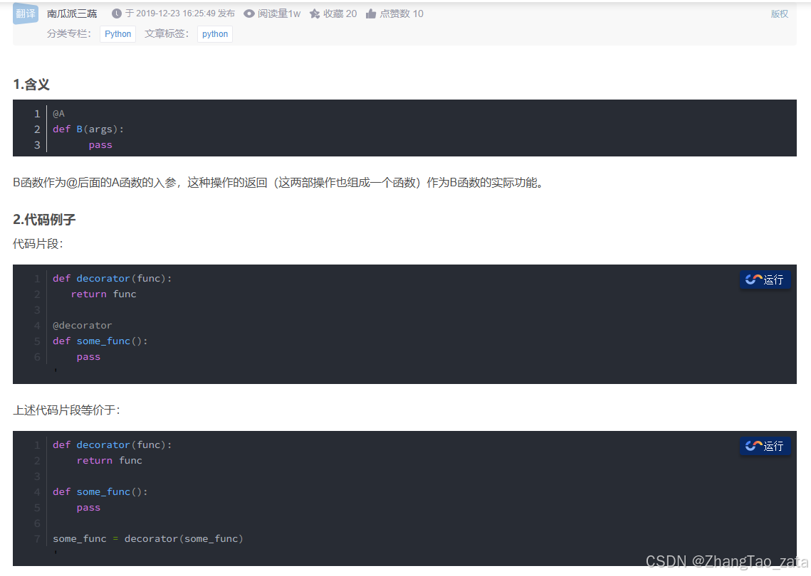
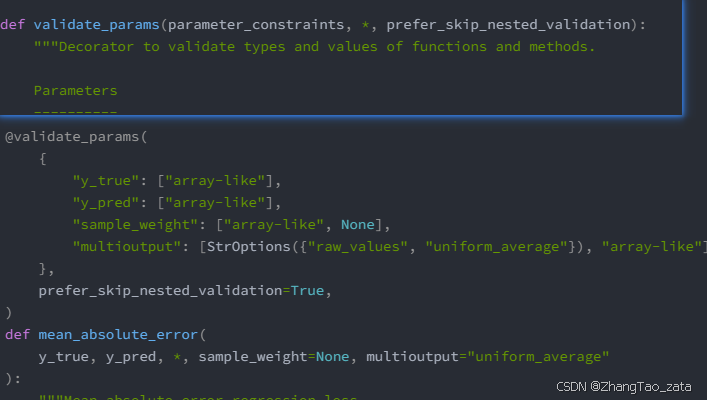
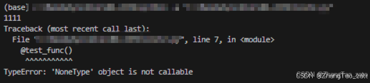

<!--  -->

## 功能实现和知识点


### python程序后台运行

python后台运行

1. linux 

```py 
# 1. 使用nohup
nohup python3 script.py > output.log 2>&1 &

# 你也可以把上面这个代码放入.sh文件中
echo 'nohup python3 script.py > output.log 2>&1 &' >> run_script.sh

chmod +x script.py 

./script.py 


# 2. 使用tmux

sudo apt install tmux  # Ubuntu/Debian
# 或
sudo yum install tmux  # CentOS/RHEL

tmux new -s my_session # 创建会话

python3 your_script.py  # 在会话中运行 Python 脚本

# 按 Ctrl+B，然后按 D   # 断开会话（脚本继续运行）

---

tmux attach -t my_session  #  恢复会话
tmux kill-session -t my_session  # 终止会话

```

**nohup详细解释**

    nohup python3 script.py > output.log 2>&1 &

        作用：使 Python 脚本在终端关闭后继续运行。
    解释：
        nohup：忽略挂起信号（HUP），防止终端关闭导致进程终止。
        python3 script.py：运行你的 Python 脚本。
        > output.log：将标准输出重定向到 output.log。
        2>&1：将标准错误输出也重定向到 output.log。
        &：将进程放入后台运行。


### Python 函数定义教程


什么是函数？
函数是一段可重用的代码块，用于执行特定任务。它可以接受输入（参数），处理逻辑，并返回输出（返回值）。函数使代码更模块化、可读和可维护。

函数的基本定义
在 Python 中，函数使用 `def` 关键字定义，基本语法如下：
```python
def function_name(parameters):
    """Docstring: 函数的说明文档"""
    # 函数体
    # 执行具体逻辑
    return result  # 可选的返回值
```

- `def`: 定义函数的关键字。
- `function_name`: 函数的名称，遵循变量命名规则（小写字母、单词用下划线分隔）。
- `parameters`: 函数的输入参数（可选）。
- `:`: 表示函数体开始。
- 函数体: 缩进的代码块，包含函数的逻辑。
- `return`: 返回结果（可选），如果没有 `return`，函数默认返回 `None`。
- 文档字符串（Docstring）: 用三引号 `"""` 包裹，描述函数的作用、参数和返回值（推荐使用）。

示例：
```python
def greet(name):
    """返回对指定用户的问候语。
    
    参数:
        name (str): 用户的姓名。
    
    返回:
        str: 格式化的问候语。
    """
    message = f"你好，{name}！"
    return message

# 调用函数
print(greet("Alice"))  # 输出: 你好，Alice！
```

参数的类型
Python 函数支持多种参数类型，帮助灵活处理输入：

位置参数
按顺序传递参数，调用时必须按照定义的顺序提供。

示例：
```python
def add(a, b):
    """返回两个数的和。"""
    return a + b

print(add(3, 5))  # 输出: 8
```

关键字参数
调用时指定参数名，顺序不重要，增强代码可读性。

示例：
```python
def introduce(name, age):
    """介绍一个人。"""
    return f"{name} 是 {age} 岁。"

print(introduce(age=25, name="Bob"))  # 输出: Bob 是 25 岁。
```

默认参数
为参数设置默认值，如果调用时不提供该参数，则使用默认值。

示例：
```python
def greet(name, greeting="你好"):
    """返回问候语，带有默认问候词。"""
    return f"{greeting}，{name}！"

print(greet("Alice"))  # 输出: 你好，Alice！
print(greet("Bob", "Hi"))  # 输出: Hi，Bob！
```

可变参数：`*args`
`*args` 允许函数接受任意数量的位置参数，参数被收集为一个元组。

示例：
```python
def sum_numbers(*args):
    """返回所有输入数字的和。"""
    return sum(args)

print(sum_numbers(1, 2, 3))  # 输出: 6
print(sum_numbers(1, 2, 3, 4, 5))  # 输出: 15
```

关键字可变参数：`**kwargs`
`**kwargs` 允许函数接受任意数量的关键字参数，参数被收集为一个字典。

示例：
```python
def print_info(**kwargs):
    """打印所有关键字参数。"""
    for key, value in kwargs.items():
        print(f"{key}: {value}")

print_info(name="Alice", age=25, city="Shanghai")
# 输出:
# name: Alice
# age: 25
# city: Shanghai
```

编写出色的函数：最佳实践
要编写高质量的函数，遵循以下原则：

单一职责原则
一个函数只做一件事，保持逻辑简单。例如，计算面积的函数不应同时打印结果。

示例：
```python
def calculate_circle_area(radius):
    """计算圆的面积。"""
    return 3.14159 * radius ** 2

def print_area(area):
    """打印面积。"""
    print(f"面积是: {area}")

# 使用
area = calculate_circle_area(5)
print_area(area)  # 输出: 面积是: 78.53975
```

使用有意义的函数和参数名
函数名应清晰描述其功能，参数名应直观。例如，`calculate_circle_area(radius)` 比 `calc(x)` 更清晰。

始终添加文档字符串
文档字符串（Docstring）描述函数的作用、参数和返回值，方便他人理解和使用。

示例：
```python
def divide(a, b):
    """将两个数相除并返回结果。
    
    参数:
        a (float): 被除数。
        b (float): 除数，不能为 0。
    
    返回:
        float: 除法结果。
    
    抛出:
        ZeroDivisionError: 当 b 为 0 时抛出。
    """
    return a / b
```

处理异常
在函数中处理可能的错误，增强健壮性。

示例：
```python
def divide_safe(a, b):
    """安全地执行除法操作。
    
    参数:
        a (float): 被除数。
        b (float): 除数。
    
    返回:
        float 或 None: 除法结果，如果除数为 0 则返回 None。
    """
    try:
        return a / b
    except ZeroDivisionError:
        print("错误：除数不能为 0！")
        return None

print(divide_safe(10, 0))  # 输出: 错误：除数不能为 0！ None
print(divide_safe(10, 2))  # 输出: 5.0
```

限制函数长度
函数体应尽量简短（建议不超过 20-30 行）。如果逻辑复杂，拆分为多个小函数。

使用类型提示（Type Hints）
Python 3.5+ 支持类型提示，增强代码可读性和 IDE 支持。

示例：
```python
def add_numbers(a: float, b: float) -> float:
    """返回两个数的和。"""
    return a + b
```

高级函数技巧
使用 lambda 函数
`lambda` 用于定义简短的匿名函数，常用于一次性或简单逻辑。

示例：
```python
# 定义一个 lambda 函数
square = lambda x: x ** 2
print(square(5))  # 输出: 25

# 在 sorted 中使用 lambda
names = ["Alice", "Bob", "Charlie"]
sorted_names = sorted(names, key=lambda x: len(x))
print(sorted_names)  # 输出: ['Bob', 'Alice', 'Charlie']
```

函数作为参数
函数可以作为参数传递给其他函数，常见于回调函数。

示例：
```python
def apply_operation(numbers, operation):
    """对数字列表应用指定操作。"""
    return [operation(x) for x in numbers]

def double(x):
    return x * 2

numbers = [1, 2, 3]
result = apply_operation(numbers, double)
print(result)  # 输出: [2, 4, 6]
```

装饰器
装饰器是函数的高级用法，用于在不修改函数代码的情况下添加功能。

示例：
```python
def log_function(func):
    """记录函数调用信息。"""
    def wrapper(*args, **kwargs):
        print(f"调用函数: {func.__name__}，参数: {args}, {kwargs}")
        return func(*args, **kwargs)
    return wrapper

@log_function
def add(a, b):
    """返回两个数的和。"""
    return a + b

print(add(3, 5))  
# 输出:
# 调用函数: add，参数: (3, 5), {}
# 8
```

实践：编写一个出色的函数
任务：编写一个函数，计算一个数的阶乘，支持输入验证和异常处理。

示例：
```python
def factorial(n: int) -> int:
    """计算 n 的阶乘。
    
    参数:
        n (int): 非负整数。
    
    返回:
        int: n 的阶乘。
    
    抛出:
        ValueError: 如果 n 不是非负整数。
    """
    if not isinstance(n, int):
        raise ValueError("输入必须是整数")
    if n < 0:
        raise ValueError("输入必须是非负整数")
    if n == 0 or n == 1:
        return 1
    result = 1
    for i in range(2, n + 1):
        result *= i
    return result

# 测试
try:
    print(factorial(5))  # 输出: 120
    print(factorial(-1))  # 抛出 ValueError
except ValueError as e:
    print(f"错误: {e}")
```

总结
- 函数使用 `def` 定义，包含函数名、参数、函数体和返回值。
- 使用 `*args` 和 `**kwargs` 处理可变参数。
- 编写出色的函数需要：单一职责、有意义的命名、文档字符串、异常处理、类型提示等。
- 高级技巧如 lambda 函数、函数作为参数和装饰器可以进一步提升代码灵活性。


### 从.py文件中获取函数对象和参数 的字典

在给定的Python脚本中，通过模块导入和反射机制，如何动态获取包含模型函数的模块中的函数及其默认参数，并构建一个字典以便后续使用？

**解决方案**

`test.py`
```python
# test.py
import numpy as np
def return_inputs(*args):
    return args
# 前处理   要求输入为 X, y, **params  输出为 X_new, y_new
def mahalanobis(X, y,threshold=95):
    mahal_X = np.asarray(X)
    x_mu = mahal_X - np.mean(mahal_X, axis=0)
    cov = np.cov(mahal_X.T)
    inv_covmat = np.linalg.inv(cov)
    left_term = np.dot(x_mu, inv_covmat)
    mahal = np.dot(left_term, x_mu.T)
    d = mahal.diagonal()
    threshold = np.percentile(d, threshold)
    mahal_x = mahal_X[d < threshold]
    return mahal_x, y[d < threshold]
```

` main.py`
```python

import test as AF  # 导入包含模型函数的模块
import inspect
def getModelParamsFromAF():

    # 获取模块中的所有成员
    module_members = AF.__dict__.items()

    # 构建models字典
    models = {}
    for name, member in module_members:
        if callable(member):  # 检查成员是否为函数
            # 使用inspect模块获取函数的参数信息
            params = inspect.signature(member).parameters
            default_params = {param: params[param].default for param in params if params[param].default != inspect.Parameter.empty}

            models[name] = (member, default_params)
    return models

print(getModelParamsFromAF())
```

` 总结`

本问题涉及在Python脚本中通过模块导入和反射机制，动态获取包含模型函数的模块中的函数及其默认参数，并将其构建成一个字典。通过利用inspect模块获取函数参数信息，作者实现了一个函数getModelParamsFromAF()，该函数返回一个包含模型函数及其默认参数的字典。这种动态获取参数的方法可以方便后续使用，提高代码的灵活性和可维护性。最后，通过print语句输出获取到的模型函数及其默认参数，以便进行进一步的分析和使用。


### Python 多进程

|相关问题| 地址 |
|--------------|--|
| python使用进程池多进程时，如何打印错误信息|[博客园](https://www.cnblogs.com/jaysonteng/p/12156609.html)  |


在python机器学习中，我想要进行自动调参，这需要比较大的运算能力，但是我发现cpu的性能总是不能跑满，原来是我用了多线程，python对于多线程的支持并不是很好可以看[廖雪峰](https://www.liaoxuefeng.com/wiki/1016959663602400/1017629247922688)

`python多线程为什么不能把多核CPU的性能吃满？`
因为Python的线程虽然是真正的线程，但解释器执行代码时，有一个GIL锁：Global Interpreter Lock，任何Python线程执行前，必须先获得GIL锁，然后，每执行100条字节码，解释器就自动释放GIL锁，让别的线程有机会执行。这个GIL全局锁实际上把所有线程的执行代码都给上了锁，所以，多线程在Python中只能交替执行，即使100个线程跑在100核CPU上，也只能用到1个核。

GIL是Python解释器设计的历史遗留问题，通常我们用的解释器是官方实现的CPython，要真正利用多核，除非重写一个不带GIL的解释器。

所以，在Python中，可以使用多线程，但不要指望能有效利用多核。如果一定要通过多线程利用多核，那只能通过C扩展来实现，不过这样就失去了Python简单易用的特点。

不过，也不用过于担心，Python虽然不能利用多线程实现多核任务，但可以通过多进程实现多核任务。多个Python进程有各自独立的GIL锁，互不影响。

> 目前python团队已经计划在3.13版本以后删除GIL锁[CSDN链接](https://blog.csdn.net/amusi1994/article/details/132074492)

`把多线程改成多线程`
一个例子，根据自己核心数创建进程，然后把数据写入json文件中最后合并

```python
from multiprocessing import Pool
import multiprocessing
import os, time, random
import json

def long_time_task(name):
    print('Run task %s (%s)...' % (name, os.getpid()))
    start = time.time()
    # 需要保存的数据
    data = {
        "name": str(name)
    }

    # 将数据写入JSON文件
    with open('data'+str(name)+'.json', 'w') as f:
        json.dump(data, f, indent=4)
    end = time.time()
    print('Task %s runs %0.2f seconds.' % (name, (end - start)))

if __name__=='__main__':
    print('Parent process %s.' % os.getpid())
    p = Pool()
    # 获取CPU的核心数
    cpu_cores = multiprocessing.cpu_count()
    print(cpu_cores)
    for i in range(cpu_cores):
        p.apply_async(long_time_task, args=(i,))
    print('Waiting for all subprocesses done...')
    p.close()
    p.join()


    files = []
    file_path = os.path.dirname(__file__)
    for file in os.listdir(file_path):
        if file.find('data') != -1:
            files.append(file)
    merged_data = []

    # 遍历每个文件，读取并解析 JSON 数据，然后添加到合并后的数据列表中
    for file_name in files:
        with open(file_name, 'r') as file:
            print(file_name)
            data = json.load(file)
            merged_data.append(data)

    # 将合并后的数据写入新的 JSON 文件
    with open('merged.json', 'w') as merged_file:
        json.dump(merged_data, merged_file, indent=4)

    print('JSON 文件已合并完成。')

    print('All subprocesses done.')
```

`加进程锁`

```python
from multiprocessing import Process, Queue, Pool
import multiprocessing
import os, time, random

def write1(q, lock):
    lock.acquire()  # 加上锁
    for value in ['A', 'B', 'C']:
        print('Put %s to queue...' % value)
        q.put(value)
        time.sleep(random.random())
    lock.release()

def write2(q, lock):
    lock.acquire()  # 加上锁
    for value in ['D', 'E', 'F']:
        print('Put %s to queue...' % value)
        q.put(value)
        time.sleep(random.random())
    lock.release()

if __name__ == '__main__':
    q = Queue()
    manager = multiprocessing.Manager()
    lock = manager.Lock()
    pw1 = Process(target=write1, args=(q, lock))
    pw2 = Process(target=write2, args=(q, lock))
    # 启动子进程pw，写入:
    pw1.start()
    pw2.start()
    # pr.start()
    pw1.join()
    pw2.join()
    # pr.join()
    print('所有数据都写入并且读完')


```


总结

`


写过另外一个程序

```cpp
collection_lock = Lock()
def collect_with_retry():
      if collection_lock.acquire(blocking=False):
          try:
              main()
              # break
          except Exception as e:
              self.logger.error(f"Collection failed: {str(e)}")
          finally:
              collection_lock.release()
      else:
          self.logger.warning("Failed to acquire lock for collection after multiple attempts")
if not hasattr(self, 'collection_thread') or not self.collection_thread.is_alive():
    self.collection_thread = Thread(target=collect_with_retry)
    self.collection_thread.daemon = True
    self.collection_thread.start()
else:
    self.logger.warning("Collection is already in progress")
```


---
---
---

### 文件所在文件夹外的另一文件导入函数或类


要在一个Python文件中从位于该文件所在文件夹外的另一个文件导入函数或类，你需要确保两个文件都在Python的搜索路径中。假设你有如下的目录结构：

```
project/
│
├── utils.py
│
└── subfolder/
    └── myfile.py
```

在这种情况下，`utils.py` 文件位于 `subfolder` 文件夹的外面。要从 `myfile.py` 中导入 `utils.py` 中的内容，你可以使用几种方法：

` 方法1:` 修改系统路径
在 `myfile.py` 中，你可以添加代码来修改系统路径，这样 Python 就可以找到 `utils.py` 文件。示例如下：

```python
import sys
sys.path.insert(0, '../')

from utils import *
```

这里 `sys.path.insert(0, '../')` 将 `utils.py` 文件所在的上级目录添加到 Python 搜索路径的开始处，确保 Python 可以找到并导入 `utils.py`。

`方法2: `使用相对导入
如果你的项目结构适合使用包的结构（即目录中有 `__init__.py` 文件），你可以使用相对导入。首先，确保每个需要作为包处理的目录中都有一个空的 `__init__.py` 文件：

```
project/
│
├── utils.py
│
└── subfolder/
    ├── __init__.py
    └── myfile.py
```

然后，在 `myfile.py` 中使用相对导入：

```python
from ..utils import *
```

注意，使用相对导入时，你的脚本必须作为包的一部分运行，不能直接作为主脚本运行，否则会出错。
即，你需要这样的方式执行代码：

```python
python -m myproject.submodule1.myscript
```

` 方法3: `使用环境变量
你可以设置 `PYTHONPATH` 环境变量，使其包括 `utils.py` 所在的目录。这样，当你运行 Python 时，它会自动将该目录添加到搜索路径中。

在 Unix-like 系统中，你可以在终端中这样设置：

```bash
export PYTHONPATH="/path/to/project:$PYTHONPATH"
```

在 Windows 系统中，你可以在命令提示符中这样设置：

```cmd
set PYTHONPATH=C:\path\to\project;%PYTHONPATH%
```

这样设置之后，你可以在 `myfile.py` 中正常导入：

```python
from utils import *
```

选择最适合你项目结构和需求的方法来导入模块。如果你正在开发一个较大的项目，考虑使用环境变量或确保你的项目可以作为包运行，这通常更为稳定和灵活。

### OS库常用函数


1. **获取当前工作目录**：
   ```python
   import os
   current_directory = os.getcwd()
   print(current_directory)
   ```

2. **改变工作目录**：
   ```python
   os.chdir('/path/to/directory')
   ```

3. **列出目录中的文件**：
   ```python
   files = os.listdir('/path/to/directory')
   print(files)
   ```

4. **创建新目录**：
   ```python
   os.mkdir('new_directory')
   ```

5. **删除目录**：
   ```python
   os.rmdir('new_directory')
   ```

6. **检查文件或目录是否存在**：
   ```python
   exists = os.path.exists('/path/to/file_or_directory')
   print(exists)
   ```

7. **获取文件大小**：
   ```python
   file_size = os.path.getsize('/path/to/file')
   print(file_size)
   ```

### 如何避免类重复创建实例

在 Python 中，为了避免一个类重复创建实例（例如，确保某个类在程序运行中只存在一个实例），可以使用 **单例模式（Singleton Pattern）**。单例模式是一种设计模式，保证一个类只有一个实例，并提供一个全局访问点。以下是实现单例模式的几种方法，以及如何避免类重复创建的说明：

 方法 1：使用类方法和类属性
通过在类中维护一个静态变量（类属性）来保存唯一实例，并在实例化时检查是否已存在实例。

```python
class Singleton:
    _instance = None  # 类属性，用于存储唯一实例

    def __new__(cls):
        if cls._instance is None:
            cls._instance = super().__new__(cls)  # 创建新实例
        return cls._instance

# 测试
s1 = Singleton()
s2 = Singleton()
print(s1 is s2)  # 输出: True，说明是同一个实例
```

**说明**：
- `__new__` 方法在对象创建时被调用，用于控制实例的创建。
- `_instance` 保存类的唯一实例，如果已存在则直接返回，不重复创建。
- `is` 运算符验证 `s1` 和 `s2` 是同一个对象。

---

 方法 2：使用装饰器
通过装饰器实现单例模式，适用于多个类需要单例逻辑的情况。

```python
def singleton(cls):
    instances = {}  # 存储类与实例的映射

    def get_instance(*args, **kwargs):
        if cls not in instances:
            instances[cls] = cls(*args, **kwargs)
        return instances[cls]
    
    return get_instance

@singleton
class Singleton:
    def __init__(self):
        print("实例化 Singleton")

# 测试
s1 = Singleton()
s2 = Singleton()
print(s1 is s2)  # 输出: True
```

**说明**：
- 装饰器 `singleton` 维护一个字典 `instances`，存储类的唯一实例。
- 每次调用类时，检查是否已有实例，若无则创建，若有则返回现有实例。
- `@singleton` 装饰器使类自动具备单例行为。

---

 方法 3：使用元类（Metaclass）
通过自定义元类来控制类的实例化过程，实现单例模式。

```python
class SingletonMeta(type):
    _instances = {}

    def __call__(cls, *args, **kwargs):
        if cls not in cls._instances:
            cls._instances[cls] = super().__call__(*args, **kwargs)
        return cls._instances[cls]

class Singleton(metaclass=SingletonMeta):
    def __init__(self):
        print("实例化 Singleton")

# 测试
s1 = Singleton()
s2 = Singleton()
print(s1 is s2)  # 输出: True
```

**说明**：
- `SingletonMeta` 是一个元类，控制类的创建过程。
- `__call__` 方法在类被调用（实例化）时触发，检查是否已有实例。
- 通过 `metaclass=SingletonMeta`，类自动实现单例模式。

---

 方法 4：模块级单例
Python 的模块本身就是单例的（模块只导入一次），因此可以在模块级别定义一个全局对象来模拟单例。

```python
# singleton.py
class Singleton:
    def __init__(self):
        print("实例化 Singleton")

singleton_instance = Singleton()

# 使用时
from singleton import singleton_instance
```

**说明**：
- Python 模块在程序运行期间只加载一次，因此 `singleton_instance` 是唯一的。
- 这种方式简单，但不够灵活，适合简单的全局对象需求。

---

 注意事项
1. **线程安全**：上述方法在多线程环境中可能不安全，可能导致多个实例被创建。如果需要线程安全，可以使用锁机制。例如：

```python
import threading

class Singleton:
    _instance = None
    _lock = threading.Lock()

    def __new__(cls):
        with cls._lock:
            if cls._instance is None:
                cls._instance = super().__new__(cls)
            return cls._instance
```

2. **单例的适用场景**：
   - 需要全局唯一实例的场景，如配置管理器、日志记录器、数据库连接池等。
   - 不适合所有类，滥用单例可能导致代码难以测试和维护。

3. **替代方案**：
   - 如果不需要严格的单例，可以使用全局变量或工厂模式。
   - 在某些情况下，依赖注入（Dependency Injection）可能比单例更适合。

4. **测试单例**：
   - 使用 `is` 运算符检查两个实例是否相同。
   - 确保单例的属性在所有实例中共享。

---

 总结
- **推荐方法**：方法 1（`__new__`）最简单直接，适合大多数场景。
- **灵活性**：方法 2（装饰器）适合多个类复用单例逻辑。
- **高级需求**：方法 3（元类）适合需要深度控制类行为的场景。
- **模块级单例**：方法 4 适合简单的全局对象需求。
- **线程安全**：在多线程环境中，添加锁机制以避免竞争条件。


### 装饰器函数 @....



> 在sklearn中看到红框中的函数，于是好奇是什么东西，查到[python-函数前一行加@xxxx的含义](https://blog.csdn.net/qq_36810398/article/details/103667836)





>于是找到函数定义：`def validate_params(parameter_constraints, *, prefer_skip_nested_validation): `
>

>但是，里面没有定义`func参数`
>于是再看到下面，原来这个函数下面又定义了一个`def decorator(func):`
>这样是可以的嘛？
>于是去尝试

```python
def test_func():
    print(1111)
    def inner_func(func):
        func()
        return 

@test_func()
def some_func():
    print("pp")
    return
some_func()
```


> 这也不行啊



> 进一步了解到，原来：它是通过 ` functools ` 重写了装饰器函数，
> 你要这样写才行

```python
import functools
def test_func():
    print(1111)
    ### 装饰器函数
    def decorator(func):
        @functools.wraps(func)
        def wrapper(*args, **kwargs):
            return func(*args, **kwargs)
        return wrapper
    return decorator

@test_func()
def some_func():
    print("pp")
    return

some_func()
```


 **`下面是具体介绍`**

>
> 
> 
>  `@validate_params` 装饰器的运作原理
> 
> 1. **装饰器定义**：
>    - `validate_params` 是一个装饰器函数。它的作用是用于验证被装饰函数的参数类型是否符合预设的约束条件。
> 
> 2. **参数约束**：
>    - `parameter_constraints` 是一个字典，用于定义每个参数的允许类型。例如，可以指定某个参数可以是列表或 NumPy 数组。
> 
> 3. **内部装饰器**：
>    - `decorator` 是 `validate_params` 内部定义的装饰器函数。它接受被装饰的函数 `func` 作为参数。
> 
> 4. **参数绑定**：
>    - 在 `wrapper` 函数中，使用 `signature(func).bind(*args, **kwargs).arguments` 将传入的参数与函数的签名进行绑定，生成一个包含所有参数及其值的字典 `params`。
> 
> 5. **参数验证**：
>    - 对字典中的每个参数进行检查。使用 `any()` 函数来判断该参数的值是否符合定义的约束条件。如果不符合，则抛出一个自定义的异常 `InvalidParameterError`，并提供错误信息。
> 
> 6. **调用原函数**：
>    - 如果所有参数都通过了验证，`wrapper` 函数就会调用原始的被装饰函数 `func`，并返回其结果。
> 
> 
> `@validate_params`
> 装饰器的核心功能是自动检查函数参数的类型。这可以帮助开发者在调用函数之前发现潜在的错误，增强代码的健壮性和可维护性。通过这种方式，确保了函数在执行时获得正确类型的输入，从而减少了运行时错误的风险。
>我写了一个示例代码：

```python
import functools
import numpy as np
from inspect import signature

class InvalidParameterError(ValueError):
    pass

def validate_params(parameter_constraints, *, prefer_skip_nested_validation):
    """装饰器用于验证函数和方法的参数类型和值。"""
    
    def decorator(func):
        setattr(func, "_parameter_constraints", parameter_constraints)

        @functools.wraps(func)
        def wrapper(*args, **kwargs):
            params = signature(func).bind(*args, **kwargs).arguments
            to_ignore = ["self", "cls"]
            params = {k: v for k, v in params.items() if k not in to_ignore}

            validate_parameter_constraints(parameter_constraints, params, caller_name=func.__qualname__)

            return func(*args, **kwargs)

        return wrapper

    return decorator

def validate_parameter_constraints(parameter_constraints, params, caller_name):
    for param, constraints in parameter_constraints.items():
        if param not in params:
            continue
        value = params[param]
        valid = False
        for constraint in constraints:
            # 检查是否为类型
            if isinstance(constraint, type):
                if isinstance(value, constraint):
                    valid = True
                    break
            # 检查是否为 None
            elif constraint is None and value is None:
                valid = True
                break

        if not valid:
            expected_types = ', '.join(c.__name__ if isinstance(c, type) else str(c) for c in constraints)
            raise InvalidParameterError(f"{caller_name}: '{param}' must be one of types: {expected_types}.")

@validate_params(
    {
        "y_true": [list, np.ndarray],
        "y_pred": [list, np.ndarray],
        "sample_weight": [list, np.ndarray, None],
    },
    prefer_skip_nested_validation=True,
)
def mean_squared_error(y_true, y_pred, *, sample_weight=None):
    """计算均方误差 (MSE)。"""

    if sample_weight is not None:
        sample_weight = np.array(sample_weight)
    
    y_true = np.array(y_true)
    y_pred = np.array(y_pred)

    if sample_weight is not None:
        return np.average((y_pred - y_true) ** 2, weights=sample_weight)
    else:
        return np.mean((y_pred - y_true) ** 2)

# 示例用法
y_true = [3, -0.5, 2, 7]  # 真实值
y_pred = [2.5, 0.0, 2, 8]  # 预测值
print(mean_squared_error(y_true, y_pred))  # 输出均方误差

```
结果


`sklearn中源码`
```python

def validate_params(parameter_constraints, *, prefer_skip_nested_validation):
    """Decorator to validate types and values of functions and methods.

    Parameters
    ----------
    parameter_constraints : dict
        A dictionary `param_name: list of constraints`. See the docstring of
        `validate_parameter_constraints` for a description of the accepted constraints.

        Note that the *args and **kwargs parameters are not validated and must not be
        present in the parameter_constraints dictionary.

    prefer_skip_nested_validation : bool
        If True, the validation of parameters of inner estimators or functions
        called by the decorated function will be skipped.

        This is useful to avoid validating many times the parameters passed by the
        user from the public facing API. It's also useful to avoid validating
        parameters that we pass internally to inner functions that are guaranteed to
        be valid by the test suite.

        It should be set to True for most functions, except for those that receive
        non-validated objects as parameters or that are just wrappers around classes
        because they only perform a partial validation.

    Returns
    -------
    decorated_function : function or method
        The decorated function.
    """

    def decorator(func):
        # The dict of parameter constraints is set as an attribute of the function
        # to make it possible to dynamically introspect the constraints for
        # automatic testing.
        setattr(func, "_skl_parameter_constraints", parameter_constraints)

        @functools.wraps(func)
        def wrapper(*args, **kwargs):
            global_skip_validation = get_config()["skip_parameter_validation"]
            if global_skip_validation:
                return func(*args, **kwargs)

            func_sig = signature(func)

            # Map *args/**kwargs to the function signature
            params = func_sig.bind(*args, **kwargs)
            params.apply_defaults()

            # ignore self/cls and positional/keyword markers
            to_ignore = [
                p.name
                for p in func_sig.parameters.values()
                if p.kind in (p.VAR_POSITIONAL, p.VAR_KEYWORD)
            ]
            to_ignore += ["self", "cls"]
            params = {k: v for k, v in params.arguments.items() if k not in to_ignore}

            validate_parameter_constraints(
                parameter_constraints, params, caller_name=func.__qualname__
            )

            try:
                with config_context(
                    skip_parameter_validation=(
                        prefer_skip_nested_validation or global_skip_validation
                    )
                ):
                    return func(*args, **kwargs)
            except InvalidParameterError as e:
                # When the function is just a wrapper around an estimator, we allow
                # the function to delegate validation to the estimator, but we replace
                # the name of the estimator by the name of the function in the error
                # message to avoid confusion.
                msg = re.sub(
                    r"parameter of \w+ must be",
                    f"parameter of {func.__qualname__} must be",
                    str(e),
                )
                raise InvalidParameterError(msg) from e

        return wrapper

    return decorator


@validate_params(
    {
        "y_true": ["array-like"],
        "y_pred": ["array-like"],
        "sample_weight": ["array-like", None],
        "multioutput": [StrOptions({"raw_values", "uniform_average"}), "array-like"],
    },
    prefer_skip_nested_validation=True,
)
def mean_absolute_error(
    y_true, y_pred, *, sample_weight=None, multioutput="uniform_average"
):
    """Mean absolute error regression loss.

    Read more in the :ref:`User Guide <mean_absolute_error>`.

    Parameters
    ----------
    y_true : array-like of shape (n_samples,) or (n_samples, n_outputs)
        Ground truth (correct) target values.

    y_pred : array-like of shape (n_samples,) or (n_samples, n_outputs)
        Estimated target values.

    sample_weight : array-like of shape (n_samples,), default=None
        Sample weights.

    multioutput : {'raw_values', 'uniform_average'}  or array-like of shape \
            (n_outputs,), default='uniform_average'
        Defines aggregating of multiple output values.
        Array-like value defines weights used to average errors.

        'raw_values' :
            Returns a full set of errors in case of multioutput input.

        'uniform_average' :
            Errors of all outputs are averaged with uniform weight.

    Returns
    -------
    loss : float or ndarray of floats
        If multioutput is 'raw_values', then mean absolute error is returned
        for each output separately.
        If multioutput is 'uniform_average' or an ndarray of weights, then the
        weighted average of all output errors is returned.

        MAE output is non-negative floating point. The best value is 0.0.

    Examples
    --------
    >>> from sklearn.metrics import mean_absolute_error
    >>> y_true = [3, -0.5, 2, 7]
    >>> y_pred = [2.5, 0.0, 2, 8]
    >>> mean_absolute_error(y_true, y_pred)
    0.5
    >>> y_true = [[0.5, 1], [-1, 1], [7, -6]]
    >>> y_pred = [[0, 2], [-1, 2], [8, -5]]
    >>> mean_absolute_error(y_true, y_pred)
    0.75
    >>> mean_absolute_error(y_true, y_pred, multioutput='raw_values')
    array([0.5, 1. ])
    >>> mean_absolute_error(y_true, y_pred, multioutput=[0.3, 0.7])
    0.85...
    """
    y_type, y_true, y_pred, multioutput = _check_reg_targets(
        y_true, y_pred, multioutput
    )
    check_consistent_length(y_true, y_pred, sample_weight)
    output_errors = np.average(np.abs(y_pred - y_true), weights=sample_weight, axis=0)
    if isinstance(multioutput, str):
        if multioutput == "raw_values":
            return output_errors
        elif multioutput == "uniform_average":
            # pass None as weights to np.average: uniform mean
            multioutput = None

    return np.average(output_errors, weights=multioutput)


```
### from abc import ABC, abstractmethod  关于抽象基类

在 Python 中，`from abc import ABC, abstractmethod` 是用于实现抽象基类（Abstract Base Class, ABC）的导入语句。让我们逐步解析它的含义和作用：

 1. **模块 `abc`**
`abc` 是 Python 的标准库模块，全称是 **Abstract Base Classes**，用于定义抽象基类。抽象基类是一种不能直接实例化的类，通常用于定义一组子类必须实现的接口或方法。

 2. **`ABC`**
`ABC` 是 `abc` 模块中的一个类，任何继承自 `ABC` 的类都会被标记为抽象基类。抽象基类不能被直接实例化，必须通过子类继承并实现其抽象方法后才能使用。

 3. **`abstractmethod`**
`abstractmethod` 是 `abc` 模块中的一个装饰器，用于将方法标记为抽象方法。抽象方法是子类必须实现的方法，否则子类也会被视为抽象类，无法实例化。

 4. **代码示例**
以下是一个使用 `ABC` 和 `abstractmethod` 的简单例子：

```python
from abc import ABC, abstractmethod

# 定义一个抽象基类
class Animal(ABC):
    @abstractmethod
    def make_sound(self):
        """子类必须实现这个方法"""
        pass

# 定义一个具体子类
class Dog(Animal):
    def make_sound(self):
        return "Woof!"

# 定义另一个具体子类
class Cat(Animal):
    def make_sound(self):
        return "Meow!"

# 测试代码
dog = Dog()
print(dog.make_sound())  # 输出: Woof!

cat = Cat()
print(cat.make_sound())  # 输出: Meow!

# 试图实例化抽象基类会报错
# animal = Animal()  # TypeError: Can't instantiate abstract class Animal with abstract methods make_sound
```

 5. **代码解析**
- **`Animal` 类**：通过继承 `ABC`，它成为一个抽象基类。
- **`make_sound` 方法**：被 `@abstractmethod` 装饰，表示子类必须实现这个方法。
- **子类 `Dog` 和 `Cat`**：它们继承了 `Animal`，并实现了 `make_sound` 方法，因此可以被实例化。
- **不能实例化 `Animal`**：如果尝试直接创建 `Animal` 的实例，会抛出错误，因为它是一个抽象类，且包含未实现的抽象方法。

 6. **用途**
- **接口定义**：确保子类实现特定的方法，强制执行某种契约。
- **代码规范**：提高代码的可维护性和可读性，明确子类的行为要求。
- **多态性**：支持多态设计，允许不同的子类以自己的方式实现抽象方法。

 7. **注意事项**
- 如果子类没有实现抽象基类中的所有抽象方法，实例化该子类会抛出 `TypeError`。
- 抽象基类可以包含普通方法（非抽象方法），这些方法可以有默认实现。
- `@abstractmethod` 必须与 `ABC` 一起使用，否则不会强制要求子类实现。

 总结
`from abc import ABC, abstractmethod` 是 Python 中用于定义抽象基类的工具。`ABC` 是一个基类，用于创建抽象类；`abstractmethod` 是一个装饰器，用于标记必须由子类实现的方法。这种机制在面向对象编程中非常有用，尤其是在需要定义统一接口或强制子类实现特定方法时。


### 函数名前不同下划线'_'数量所代表的含义

在 Python 中，函数名前加下划线（`_`）通常是为了表示特定的命名约定或用途，主要与代码的可读性、访问控制和命名空间管理有关。以下是函数名前加单下划线（`_`）和双下划线（`__`）以及不加下划线的区别和含义：

 1. **不加下划线的函数（普通函数）**
- **含义**：这是最常见的函数命名方式，表示函数是公开的（public），可以被模块内外任意访问和调用。
- **用途**：用于定义模块或类的公共接口，任何代码都可以直接调用这些函数。
- **示例**：
  ```python
  def public_function():
      print("这是一个公开函数")
  ```
  - 任何地方都可以调用 `public_function()`，没有任何访问限制。

 2. **单下划线开头的函数（`_function`）**
- **含义**：以单下划线 `_` 开头的函数表示它是**受保护的（protected）**或**内部使用的**。这是 Python 的命名约定，提示开发者这个函数主要用于模块或类内部，不建议外部直接调用。
- **实际效果**：并没有真正的访问限制，外部代码仍然可以访问和调用，只是约定上表示“这个函数是内部实现细节，最好不要直接使用”。
- **用途**：
  - 用于模块内部的辅助函数，提示用户不要直接调用。
  - 在类中表示受保护的方法，建议子类或内部逻辑使用。
- **示例**：
  ```python
  class MyClass:
      def _protected_method(self):
          print("这是一个受保护的方法")

  obj = MyClass()
  obj._protected_method()   可以调用，但不推荐
  ```
  - 虽然可以调用 `_protected_method`，但开发者看到单下划线会知道这是内部方法，不建议直接使用。

 3. **双下划线开头的函数（`__function`）**
- **含义**：以双下划线 `__` 开头的函数表示**私有（private）**，用于实现 Python 的**名称改写（name mangling）**机制。这是 Python 中一种更强的封装方式，旨在防止外部代码直接访问这些方法。
- **实际效果**：Python 会将 `__function` 的名称改写为 `_ClassName__function`，以避免子类或外部代码意外覆盖或调用。这种机制并不是完全禁止访问，而是增加了访问难度。
- **用途**：
  - 用于类的私有方法，确保方法不会被子类意外重写或被外部直接调用。
  - 强调方法是类的内部实现细节。
- **示例**：
  ```python
  class MyClass:
      def __private_method(self):
          print("这是一个私有方法")

  obj = MyClass()
   obj.__private_method()   会报错：AttributeError
  obj._MyClass__private_method()   可以这样访问，但不推荐
  ```
  - 直接调用 `__private_method` 会失败，因为名称被改写为 `_MyClass__private_method`。
  - 仍然可以通过改写后的名称访问，但这违背了封装的意图。

 4. **双下划线开头和结尾的函数（`__function__`）**
- **含义**：以双下划线开头和结尾的函数是 Python 的**特殊方法（magic methods 或 dunder methods）**，用于定义类的特殊行为或内置功能。这些方法由 Python 解释器在特定场景下自动调用。
- **用途**：
  - 实现类的内置行为，例如 `__init__`（构造函数）、`__str__`（字符串表示）、`__len__`（长度）等。
  - 这些方法是公开的，但通常由 Python 内部调用，而不是开发者直接调用。
- **示例**：
  ```python
  class MyClass:
      def __init__(self, name):
          self.name = name
      
      def __str__(self):
          return f"MyClass with name: {self.name}"

  obj = MyClass("Test")
  print(obj)   自动调用 __str__，输出: MyClass with name: Test
  ```

 5. **单下划线作为函数名（`_`）**
- **含义**：单独使用 `_` 作为函数名或变量名，通常用于表示**临时或占位符**，在代码中不打算实际使用。
- **用途**：
  - 在循环或解包中忽略不需要的值。
  - 有时在模块中定义 `_` 作为临时函数名（不常见）。
- **示例**：
  ```python
  for _ in range(5):   忽略循环变量
      print("Hello")
  ```

 6. **总结对比**
| 前缀 | 含义 | 访问限制 | 典型用途 |
|------|------|----------|---------|
| `function` | 公开函数 | 无限制 | 模块或类的公共接口 |
| `_function` | 受保护函数 | 约定限制（可访问） | 模块或类内部的辅助方法 |
| `__function` | 私有函数 | 名称改写（难以直接访问） | 类内部的私有实现 |
| `__function__` | 特殊方法 | 无限制（由 Python 自动调用） | 定义类的内置行为 |
| `_` | 占位符 | 无限制 | 忽略变量或临时函数 |

 7. **注意事项**
- **约定 vs. 强制**：Python 的下划线命名是**约定**而非强制。单下划线是提示，开发者应尊重但可以绕过；双下划线通过名称改写提供更强的封装，但仍可通过改写后的名称访问。
- **代码风格**：遵循 Python 的 PEP 8 命名规范，使用下划线来提高代码可读性和维护性。
- **文化习惯**：在 Python 社区中，尊重下划线约定是良好编程习惯的体现，避免直接访问 `_` 或 `__` 开头的方法。

 示例综合对比
```python
class Example:
    def public_method(self):
        print("公开方法")
    
    def _protected_method(self):
        print("受保护方法")
    
    def __private_method(self):
        print("私有方法")
    
    def __init__(self):
        print("特殊方法：初始化")

obj = Example()   调用 __init__
obj.public_method()   正常调用
obj._protected_method()   可以调用，但不推荐
 obj.__private_method()   报错
obj._Example__private_method()   可以访问，但不推荐
```

通过这些命名约定，Python 提供了灵活的封装机制，同时保持了语言的简洁性和开放性。


### 函数中的*号和**号
在 Python 中，`*` 和 `**` 是用于处理函数参数的特殊符号。它们分别表示不同的含义，主要用于处理可变数量的参数和解包操作。以下是详细的介绍：

---

` 1. **单星号 `*` 的作用**`
`*` 主要用在以下两种场景：

 (1) **定义可变位置参数（*args）**
在函数定义中，`*args` 用于接收任意数量的位置参数。这些参数会被打包成一个元组（tuple），供函数内部使用。

```python
def my_function(*args):
    print(args)  # args 是一个元组

my_function(1, 2, 3)
# 输出: (1, 2, 3)
```

- `*args` 中的 `args` 只是一个约定俗成的名字，你可以使用其他名字，比如 `*values`。
- 这些参数是按位置传递的，调用时不需要指定参数名。

 (2) **解包可迭代对象**
在函数调用时，`*` 可以用来解包一个可迭代对象（如列表、元组等），将其元素作为独立的位置参数传递给函数。

```python
def add(a, b, c):
    return a + b + c

numbers = [1, 2, 3]
result = add(*numbers)  # 等价于 add(1, 2, 3)
print(result)
# 输出: 6
```

---

` 2. **双星号 `**` 的作用**`
`**` 主要用在以下两种场景：

 (1) **定义可变关键字参数（**kwargs）**
在函数定义中，`**kwargs` 用于接收任意数量的关键字参数。这些参数会被打包成一个字典（dictionary），供函数内部使用。

```python
def my_function(**kwargs):
    print(kwargs)  # kwargs 是一个字典

my_function(a=1, b=2, c=3)
# 输出: {'a': 1, 'b': 2, 'c': 3}
```

- `**kwargs` 中的 `kwargs` 同样只是一个约定俗成的名字，你可以使用其他名字，比如 `**options`。
- 这些参数是通过键值对传递的，调用时需要指定参数名。

 (2) **解包字典**
在函数调用时，`**` 可以用来解包一个字典，将其键值对作为独立的关键字参数传递给函数。

```python
def greet(name, age):
    print(f"Hello {name}, you are {age} years old.")

info = {"name": "Alice", "age": 25}
greet(**info)  # 等价于 greet(name="Alice", age=25)
# 输出: Hello Alice, you are 25 years old.
```

---

` 3. **`*` 和 `**` 的结合使用**`
在一个函数定义中，可以同时使用 `*args` 和 `**kwargs`，分别处理位置参数和关键字参数。

```python
def my_function(*args, **kwargs):
    print("Positional arguments:", args)
    print("Keyword arguments:", kwargs)

my_function(1, 2, 3, a=4, b=5)
# 输出:
# Positional arguments: (1, 2, 3)
# Keyword arguments: {'a': 4, 'b': 5}
```

---

` 4. **注意事项**`
- **顺序规则**：在函数定义中，参数的顺序必须是：
  1. 普通参数
  2. `*args`
  3. 带默认值的参数
  4. `**kwargs`

  示例：
  ```python
  def example(a, b, *args, c=10, **kwargs):
      pass
  ```

- **强制关键字参数**：从 Python 3 开始，可以通过在 `*` 后面添加参数来强制要求某些参数必须通过关键字传递。例如：
  ```python
  def example(a, *, b):
      print(a, b)

  example(1, b=2)  # 正确
  example(1, 2)    # 错误，TypeError
  ```

---

` 总结`
- `*` 用于处理可变数量的位置参数或解包可迭代对象。
- `**` 用于处理可变数量的关键字参数或解包字典。
- 它们可以单独使用，也可以结合使用，提供了灵活的函数参数处理方式。

如果你有更多具体问题，欢迎继续提问！


###  Pydantic 的Filed函数
Pydantic 的Filed函数，用于在数据模型中定义字段的额外信息、验证和约束。它可以用于设置字段的默认值、限制字段的取值范围、添加字段描述等。以下是一些常用的 Field 用法：

`设置默认值`

```python
from pydantic import BaseModel, Field

class MyClass(BaseModel):
    my_field: str = Field(default="Hello, World!")

```

`添加描述：`

```cpp
from pydantic import BaseModel, Field

class MyClass(BaseModel):
    my_field: str = Field(..., description="This is a sample field.")
```

在这个例子中，为 my_field 添加了描述 “This is a sample field.”。

`添加验证约束：`

```cpp
from pydantic import BaseModel, Field

class MyClass(BaseModel):
    my_field: int = Field(..., gt=0, lt=10)
```

在这个例子中，my_field 的值必须大于 0 且小于 10，否则会引发验证错误。

`使用自定义验证器：`

```cpp
from pydantic import BaseModel, Field, validator

class MyClass(BaseModel):
    my_field: str = Field(...)

    @validator("my_field")
    def check_length(cls, value):
        if len(value) < 5:
            raise ValueError("The length of my_field must be at least 5 characters.")
        return value
```

在这个例子中，添加了一个自定义验证器 check_length，用于检查 my_field 的长度。如果长度小于 5 个字符，将引发一个值错误。

这些只是 Field 的一些基本用法。使用 Pydantic，您可以根据需要添加更多自定义验证和约束，以确保数据模型中的字段符合预期。

### python 中的`async` 和 `await` （异步编程）
异步操作（Asynchronous Operation）是指一种非阻塞的操作方式，允许程序在等待某些耗时任务（如 I/O 操作、网络请求等）完成的同时，继续执行其他任务。

在 Python 中，`async` 和 `await` 是用于处理异步编程的关键字。它们允许你编写非阻塞的代码，特别适用于 I/O 密集型任务（如网络请求、文件读写等），以提高程序的并发性能。

`1. async的作用`
`async` 关键字用于定义一个**异步函数**（也称为协程）。异步函数与普通函数不同，它不会立即执行，而是返回一个协程对象，该对象可以在事件循环中被调度执行。
 示例：
```python
import asyncio

async def my_coroutine():
    print("Hello")
    await asyncio.sleep(1)  # 模拟异步操作
    print("World")

# 调用异步函数并不会直接执行它，而是返回一个协程对象
coro = my_coroutine()

# 需要通过事件循环来运行协程
asyncio.run(coro)
```

在这个例子中，`my_coroutine` 是一个异步函数，使用 `async` 定义。调用 `my_coroutine()` 并不会立即执行函数体中的代码，而是返回一个协程对象。要真正执行这个协程，你需要使用 `asyncio.run()` 或者将其放入事件循环中。

---

`2. await 的作用`
`await` 关键字用于等待一个异步操作完成。它只能在 `async` 函数内部使用，并且后面必须跟一个**可等待对象**（如协程、任务、Future 等）。当遇到 `await` 时，当前协程会暂停执行，直到等待的操作完成。

**示例：**
```python
import asyncio

async def fetch_data():
    print("开始获取数据...")
    await asyncio.sleep(2)  # 模拟耗时的 I/O 操作
    print("数据获取完成")
    return {"data": "some data"}

async def main():
    result = await fetch_data()  # 等待 fetch_data 协程完成
    print(f"结果: {result}")

asyncio.run(main())
```

在这个例子中，`await fetch_data()` 会让 `main` 协程暂停，直到 `fetch_data` 协程完成并返回结果。

---

` 3. 其他类似的参数或概念`
除了 `async` 和 `await`，Python 的异步编程还涉及以下几个重要概念和工具：

1. **`asyncio` 模块**
`asyncio` 是 Python 标准库中的一个模块，提供了实现异步编程所需的基础设施，包括事件循环、任务调度等。常见的功能包括：
- `asyncio.run()`：运行顶层的协程。
- `asyncio.create_task()`：创建一个任务，用于并发执行多个协程。
- `asyncio.gather()`：并发运行多个协程并收集结果。
- `asyncio.sleep()`：模拟异步延迟。

示例：
```python
import asyncio

async def task1():
    print("Task 1 开始")
    await asyncio.sleep(1)
    print("Task 1 完成")

async def task2():
    print("Task 2 开始")
    await asyncio.sleep(2)
    print("Task 2 完成")

async def main():
    # 并发执行两个任务
    await asyncio.gather(task1(), task2())

asyncio.run(main())
```

---

2. **`async for` 和 `async with`**
- **`async for`**：用于异步迭代器，适用于需要异步生成数据的场景。
- **`async with`**：用于异步上下文管理器，适用于需要异步资源管理的场景。

示例：`async for`
```python
import asyncio

class AsyncIterable:
    def __aiter__(self):
        self.data = [1, 2, 3]
        return self

    async def __anext__(self):
        if not self.data:
            raise StopAsyncIteration
        await asyncio.sleep(1)  # 模拟异步操作
        return self.data.pop(0)

async def main():
    async for item in AsyncIterable():
        print(item)

asyncio.run(main())
```

示例：`async with`
```python
import asyncio

class AsyncContextManager:
    async def __aenter__(self):
        print("进入上下文")
        await asyncio.sleep(1)
        return self

    async def __aexit__(self, exc_type, exc_val, exc_tb):
        print("退出上下文")
        await asyncio.sleep(1)

async def main():
    async with AsyncContextManager() as manager:
        print("在上下文中执行")

asyncio.run(main())
```

---

 3. **`concurrent.futures` 模块**
虽然不属于 `async`/`await` 的范畴，但 `concurrent.futures` 提供了另一种实现并发的方式，特别是通过线程池或进程池执行任务。

 示例：
```python
from concurrent.futures import ThreadPoolExecutor
import time

def blocking_task(seconds):
    print(f"开始阻塞任务 {seconds} 秒")
    time.sleep(seconds)
    print(f"阻塞任务完成")
    return seconds

def main():
    with ThreadPoolExecutor() as executor:
        future = executor.submit(blocking_task, 2)
        print("主线程继续执行其他任务")
        result = future.result()  # 阻塞等待结果
        print(f"结果: {result}")

main()
```

---

总结
- `async` 用于定义异步函数，返回协程对象。
- `await` 用于等待异步操作完成，只能在 `async` 函数中使用。
- 其他相关概念包括 `asyncio` 模块、`async for`、`async with` 等，它们共同构成了 Python 异步编程的核心工具。


### Python项目生成requirements.txt文件


1.使用pipreqs生成requirement.txt

    ```python
    pip install pipreqs
    pipreqs .  # .表示当前路径
    ```
    遇到问题
    **1. 遇到编码错误问题**

    > 
    > 解决方法 
    > ```python pipreqs --encoding=iso-8859-1 ```

    **2. 遇到'pipreqs' is not recognized as an internal or external command,operable program or batch file.** 
    > 使用以下命令：
    > `python -m pipreqs.pipreqs . --encoding=utf8 --force`


2. pipreqs --help

    ```bash
    pipreqs - Generate pip requirements.txt file based on imports

    Usage:
        pipreqs [options] [<path>]

    Arguments:
        <path>                The path to the directory containing the application
                            files for which a requirements file should be
                            generated (defaults to the current working
                            directory).

    Options:
        --use-local           Use ONLY local package info instead of querying PyPI.
        --pypi-server <url>   Use custom PyPi server.
        --proxy <url>         Use Proxy, parameter will be passed to requests
                            library. You can also just set the environments
                            parameter in your terminal:
                            $ export HTTP_PROXY="http://10.10.1.10:3128"
                            $ export HTTPS_PROXY="https://10.10.1.10:1080"
        --debug               Print debug information
        --ignore <dirs>...    Ignore extra directories, each separated by a comma
        --no-follow-links     Do not follow symbolic links in the project
        --encoding <charset>  Use encoding parameter for file open
        --savepath <file>     Save the list of requirements in the given file
        --print               Output the list of requirements in the standard
                            output
        --force               Overwrite existing requirements.txt
        --diff <file>         Compare modules in requirements.txt to project
                            imports
        --clean <file>        Clean up requirements.txt by removing modules
                            that are not imported in project
        --mode <scheme>       Enables dynamic versioning with <compat>,
                            <gt> or <non-pin> schemes.
                            <compat> | e.g. Flask~=1.1.2
                            <gt>     | e.g. Flask>=1.1.2
                            <no-pin> | e.g. Flask
        --scan-notebooks      Look for imports in jupyter notebook files.
    ```


---
---
---
---
---
---


## 遇到的问题
### 导入路径问题（原本main函数调用它，现在直接运行该文件，导包路径变化）

`问题描述`
在运行 Python 文件时，可能会遇到以下错误：
```
ModuleNotFoundError: No module named 'utils'
```
`原因：`
- Python 的模块导入机制依赖于当前工作目录和 `sys.path` 中的路径。
- 当直接运行某个文件时，Python 会将该文件所在目录添加到 `sys.path`，而不是项目的根目录，导致无法正确导入其他模块。

---

` 解决方法   (一般再临时调试时候会出现，我推荐使用方法三）`

`方法 1：`修改 `sys.path`
在代码中手动将项目的根目录添加到 `sys.path`：
```python
import sys
import os

current_dir = os.path.dirname(os.path.abspath(__file__))
project_root = os.path.abspath(os.path.join(current_dir, '..'))

if project_root not in sys.path:
    sys.path.append(project_root)

from utils.subgraph_extraction import *
```
**优点**：简单直接，适合快速调试。  
**缺点**：不够优雅，可能不适合复杂项目。

---

` 方法 2：`使用相对导入
如果项目是一个包（包含 `__init__.py`），可以使用相对导入：
```python
from ..utils.subgraph_extraction import *
```
然后从项目的根目录运行脚本：
```bash
python -m utils.Core_functions
```
**优点**：符合 Python 包管理规范，适合大型项目。  
**缺点**：不能直接运行单个文件，需要调整运行方式。

---

`方法 3：`设置环境变量 `PYTHONPATH`
在运行脚本前，设置环境变量 `PYTHONPATH` 指向项目的根目录。
比如这样，我原本再根目录调用这个文件，没有问题，但是现在我想要进入这个文件里面运行它

就会报错：

这样再运行就没问题了


- **Linux/MacOS**：
  ```bash
  export PYTHONPATH=/path/to/your/project
  python utils/Core_functions.py
  ```
- **Windows（命令提示符）**：
  ```cmd
  set PYTHONPATH=C:\path\to\your\project
  python utils\Core_functions.py
  ```
- **Windows（PowerShell）**：
  ```powershell
  $env:PYTHONPATH = "C:\path\to\your\project"
  python utils\Core_functions.py
  ```

**优点**：无需修改代码，适合团队协作。  
**缺点**：需要每次运行前设置环境变量。

`方法 4`：使用 IDE 配置工作目录
通过 IDE 配置运行时的工作目录为项目的根目录。

- **PyCharm**：
  1. 打开运行配置（Run/Debug Configurations）。
  2. 设置 `Working Directory` 为项目的根目录。

- **VSCode**：
  在 `.vscode/launch.json` 中添加以下配置：
  ```json
  {
      "version": "0.2.0",
      "configurations": [
          {
              "name": "Run Core_functions",
              "type": "python",
              "request": "launch",
              "program": "utils/Core_functions.py",
              "cwd": "${workspaceFolder}"
          }
      ]
  }
  ```

**优点**：适合开发环境，无需修改代码。  
**缺点**：仅适用于特定 IDE。

---

` 方法 5`：重构项目结构
将所有模块组织为一个包，并通过入口脚本（如 `main.py`）统一调用。例如：
```
project/
├── main.py
├── utils/
│   ├── __init__.py
│   ├── Core_functions.py
│   └── subgraph_extraction.py
```
在 `main.py` 中：
```python
from utils.Core_functions import some_function

if __name__ == "__main__":
    some_function()
```
然后始终通过 `main.py` 运行项目：
```bash
python main.py
```

**优点**：规范项目结构，避免路径问题。  
**缺点**：需要对项目进行一定的重构。

---

` 总结`
- **临时调试**：推荐 **方法 1** 或 **方法 3**。
- **长期维护**：推荐 **方法 2** 或 **方法 5**。
- **IDE 开发**：推荐 **方法 4**。

根据具体需求选择合适的方法即可！

---
---
---


