## 目录
#### 百科知识/信息资讯

-[中国气候系统中的季节性风向及其物理驱动机制：海陆、洋流与高原的综合作用](#中国气候系统中的季节性风向及其物理驱动机制海陆洋流与高原的综合作用)
- [法西斯主义-历史和发展](#法西斯主义-历史和发展)
- [中国所有丧权辱国的条约](#中国所有丧权辱国的条约)
- [历史上租界的形成和历史](https://zh.wikipedia.org/wiki/%E7%A7%9F%E7%95%8C)
- [基本公积金和补充公积金有什么区别](#基本公积金和补充公积金有什么区别)
- [关于皮质醇的知识要点总结](#关于皮质醇的知识要点总结)
- [杠杆率的概念](#杠杆率的概念)
- [公司认缴资本与债务责任](#公司认缴资本与债务责任)
- [PRD（产品需求文档）](#prd产品需求文档)
- [英伟达的技术壁垒：不止是芯片，更是"护城河"](#英伟达的技术壁垒不止是芯片更是护城河)
- [本福特定律](#本福特定律)
- [期货和股票交易中的做多和做空](#期货和股票交易中的做多和做空)
- [AFC主动射流飞控技术](#AFC主动射流飞控技术)
- [战斗机发动机的分类](#战斗机发动机的分类)
- [爆震发动机](#爆震发动机)
- [中国军事实力](#中国军事实力)
- [期货交易与股票交易的差别](#期货交易与股票交易的差别)
- [比特币与以太坊的对比](#比特币与以太坊的对比)
- [WAN、LAN、WLAN和VLAN 是啥](#wan-lan-wlan和vlan-是啥)
- [如何看是不是ECC内存](#如何看是不是ecc内存)
- [什么是附属安装包](#什么是附属安装包)
- [什么是预训练，预训练和训练的区别](#什么是预训练预训练和训练的区别)
- [什么是痢疾](#什么是痢疾)
- [红酒的知识](#红酒的知识)
- [酒的知识](#酒的知识)
- [雅鲁藏布江下游水电工程](#雅鲁藏布江下游水电工程)
- [快门速度为什么可以影响亮度](#快门速度为什么可以影响亮度)
- [日月地的相对运动](#日月地的相对运动)

#### 食物相关
- [中国几大主要菜系的特色菜介绍](#中国几大主要菜系的特色菜介绍)
- [常见的香料的区别和作用](#常见的香料的区别和作用)
- [牛肉和牛排的介绍](#牛肉和牛排的介绍)

#### 计算机相关
- [AC、AP和路由器的区别与联系](#ac-ap和路由器的区别与联系)  
- [蒙特卡洛算法原理与应用](#蒙特卡洛算法)  
- [遗传算法的基本思想与实现](#遗传算法)  
- [模拟退火算法详解](#模拟退火算法)  
- [Gradio简介及其在AI项目中的应用](#gradio简介及其在ai项目中的应用)  
- [WAN、LAN、WLAN与VLAN的概念解析](#wan-lan-wlan与vlan的概念解析)  
- [如何判断内存是否为ECC类型](#如何判断内存是否为ecc类型)  
- [什么是附属安装包](#什么是附属安装包)  
- [预训练的含义及与普通训练的区别](#什么是预训练_预训练和训练的区别)
- [如何参与开源项目 - 细说 GitHub 上的 PR 全过程](https://zhuanlan.zhihu.com/p/538667999)


#### 光学相关
- [菲涅耳透镜](#菲涅耳透镜)
- [几种可显著增强光的机制与材料](#几种可显著增强光的机制与材料)  
- [阵列光波导、几何光波导、衍射光波导与全息光波导、多层光波导](#阵列光波导,几何光波导,衍射光波导,全息光波导,多层光波导)  
- [光耦合器（光电隔离器）的工作原理与应用](#光耦合器的工作原理与应用)  
- [光纤亲和力（Fiber Affinity）的含义与影响因素](#什么叫做光纤亲和力)  
- [低相干度（Low Coherence）光的特性与应用场景](#低相干度low-coherence光的特性与应用场景)  
- [LD（Laser Diode）光源的原理与特点](#laser-diode-光源的原理与特点)  
- [LED（Light Emitting Diode）光源的基本特性与用途](#ledlight-emitting-diode-光源的基本特性与用途)  
- [SLD（超辐射发光二极管）光源的技术优势与应用](#sld超辐射发光二极管-光源的技术优势与应用)


#### 硬件相关
- [光电二极管的PN和PIN结构](#光电二极管的pn和pin结构)
- [什么是TIA电路](#什么是tia电路)
- [什么是光电二极管（简称PD）](#什么是光电二极管简称pd)
- [什么是串口通信](#什么是串口通信)
- [AC和DC](#ac和dc)
- [NAS中的RAID技术应用](#NAS中的RAID技术应用)
- [扭力扳手的工作原理](#扭力扳手的工作原理)
- [固态电池](#固态电池)


#### 历史知识
- [日本关键发展转折点分析](#日本关键发展转折点分析)


#### 历史人物
- [王阳明](#王阳明)
- [张居正](#张居正)
- [申时行](#申时行)


#### 地理知识
- [中国高铁网络](#中国高铁网络)
- [淮河](#淮河)
- [雅鲁藏布江下游水电工程](#雅鲁藏布江下游水电工程)


#### 选购指南
- [茶叶](#茶叶)
- [CPU](#CPU)
- [显示器](#显示器)
- [键盘](#键盘)
- [电饭锅选购指南](#电饭锅选购指南)


## 百科知识/信息资讯


### 中国气候系统中的季节性风向及其物理驱动机制：海陆、洋流与高原的综合作用
[中国气候系统中的季节性风向及其物理驱动机制：海陆、洋流与高原的综合作用](./images/index/中国季风成因与风向分析.pdf)

### 中国近代史

https://www.gov.cn/guoqing/2021-04/09/content_5555766.htm


### 法西斯主义-历史和发展

**定义**：  
法西斯主义（Fascism）是一种极右翼的政治意识形态，强调民族主义、集权主义、反自由主义、反共产主义和反个人主义。它通过强有力的中央集权政府、领袖崇拜、军事扩张和压制异见来实现国家统一和社会秩序。

1. **起源（19世纪末至20世纪初）**  
   法西斯主义的思想根源可以追溯到19世纪末的民族主义、帝国主义和社会达尔文主义。意大利民族主义者如加布里埃尔·邓南遮（Gabriele D’Annunzio）通过宣传强硬的民族主义和反民主思想为法西斯主义奠定了基础。第一次世界大战后的社会动荡、经济危机和对共产主义的恐惧进一步催化了法西斯主义的兴起。

2. **意大利法西斯主义（1919-1945）**  
   - **兴起**：1919年，贝尼托·墨索里尼（Benito Mussolini）在意大利创立“法西斯战斗团”（Fasci di Combattimento），以对抗社会主义和自由主义。1922年，墨索里尼通过“向罗马进军”夺取政权，建立法西斯政权。  
   - **特点**：意大利法西斯主义强调“领袖”（Il Duce）崇拜、国家至上、经济统制（法团主义）和对外扩张（如入侵埃塞俄比亚）。  
   - **影响**：墨索里尼的政权成为其他法西斯运动的模板，但其统治在二战期间因军事失败和内部反对而崩溃。

3. **纳粹德国（1933-1945）**  
   - **兴起**：阿道夫·希特勒（Adolf Hitler）领导的纳粹党（国家社会主义德国工人党）在魏玛共和国经济崩溃和战后不满中崛起，1933年上台。  
   - **特点**：纳粹主义是法西斯主义的一个极端变种，结合种族主义（反犹主义）、极端民族主义和“生存空间”（Lebensraum）理念，推动侵略扩张和大屠杀（Holocaust）。  
   - **影响**：纳粹德国的侵略引发二战，最终在1945年被盟军击败。

4. **其他国家的法西斯运动**  
   - **西班牙**：弗朗西斯科·佛朗哥（Francisco Franco）的法西斯式独裁通过西班牙内战（1936-1939）上台，维持至1975年。  
   - **葡萄牙**：安东尼奥·萨拉查（António de Oliveira Salazar）的“新国家”政权（1932-1968）具有法西斯特征，但更强调保守主义。  
   - **日本**：战时日本的军国主义虽不完全等同于法西斯主义，但具有类似特征，如天皇崇拜和帝国扩张。  
   - **其他地区**：法西斯主义影响了东欧（如罗马尼亚的铁卫团）、拉美（如巴西的整合主义）和中国（如汪精卫政权的部分意识形态）。

5. **二战后的衰落与影响**  
   - 二战后，法西斯主义因其与战争暴行和种族灭绝的关联而名誉扫地，主要政权被摧毁。  
   - 然而，法西斯主义的某些元素在后来的新法西斯主义（Neo-Fascism）或极右翼运动中存续，如意大利的社会运动党（MSI）和法国的国民阵线（现为国民联盟）。  
   - 当代极右翼民粹主义有时被认为继承了法西斯主义的部分特征，如反移民、民族主义和反全球化。

6. **思想特征与批判**  
   - **核心思想**：法西斯主义崇尚暴力、纪律、等级制和民族优越感，否定个人自由和民主制度。它通过宣传和神话（如“罗马复兴”或“第三帝国”）来动员群众。  
   - **批判**：法西斯主义被广泛批评为压制人权、导致战争和种族灭绝。其经济政策（如意大利的法团主义）效率低下，军事冒险（如纳粹的扩张）导致毁灭性后果。

---

** 维基百科链接**
- 中文维基百科：[法西斯主义](https://zh.wikipedia.org/wiki/法西斯主义)  
- 英文维基百科（更详细的历史背景）：[Fascism](https://en.wikipedia.org/wiki/Fascism)  
- 相关条目：
  - [意大利法西斯主义](https://zh.wikipedia.org/wiki/意大利法西斯主义)  
  - [纳粹主义](https://zh.wikipedia.org/wiki/纳粹主义)  
  - [西班牙内战](https://zh.wikipedia.org/wiki/西班牙内战)  
  - [新法西斯主义](https://zh.wikipedia.org/wiki/新法西斯主义)


### 中国所有丧权辱国的条约

| 条约名称                  | 签订时间 | 主要内容简述                                                                 | 维基百科链接                                      |
|---------------------------|----------|-----------------------------------------------------------------------------|--------------------------------------------------|
| 南京条约                  | 1842年8月29日-道光二十二年  | 割让香港岛给英国，开放广州、福州、厦门、宁波、上海五处为通商口岸，赔款2100万银元，英国获得片面最惠国待遇。 | [南京条约](https://zh.wikipedia.org/wiki/南京条约) |
| 五口通商附粘善後條款（虎门条约） | 1843年  | 补充南京条约，规定英国在通商口岸的领事裁判权、租地建屋权等特权。             | [五口通商附粘善後條款](https://zh.wikipedia.org/wiki/五口通商附粘善後條款) |
| 望廈條約                  | 1844年  | 美国获得与英国类似的通商权、领事裁判权、片面最惠国待遇等特权。               | [望廈條約](https://zh.wikipedia.org/wiki/望廈條約) |
| 黄埔条约                  | 1844年  | 法国获得与英国类似的通商权、领事裁判权、传教权等特权。                       | [黄埔条约](https://zh.wikipedia.org/wiki/黄埔条约) |
| 北京条约                  | 1860年  | 割让九龙半岛南端给英国，开放天津为通商口岸，赔款800万两银元，允许外国人在内地自由行动。 | [北京条约](https://zh.wikipedia.org/wiki/北京条约) |
| 烟台条约                  | 1876年  | 开放宜昌、芜湖、温州、北海为通商口岸，英国获得内河航行权，赔款增加。         | [烟台条约](https://zh.wikipedia.org/wiki/烟台条约) |
| 中法新约                  | 1885年  | 承认法国对越南的保护权，清政府赔款，开放云南、广西部分地区为通商口岸。       | [中法新约](https://zh.wikipedia.org/wiki/中法新约) |
| 中日天津会议专条          | 1885年  | 规定清朝与日本在朝鲜问题上的撤军及互不干涉政策。                             | [中日天津会议专条](https://zh.wikipedia.org/wiki/中日天津会议专条) |
| 马关条约                  | 1895年  | 割让台湾及澎湖列岛给日本，赔款2亿两白银，开放沙市、重庆、苏州、杭州为通商口岸。 | [马关条约](https://zh.wikipedia.org/wiki/马关条约) |
| 辛丑条约                  | 1901年  | 赔款4.5亿两白银，允许外国在北京至天津驻兵，拆毁大沽炮台，限制清政府军备。   | [辛丑条约](https://zh.wikipedia.org/wiki/辛丑条约) |
| 中苏友好同盟条约          | 1945年  | 苏联承认外蒙古独立，苏联获得旅顺军港使用权及大连商港特权，规定中东铁路共管等。 | [中苏友好同盟条约](https://zh.wikipedia.org/wiki/中苏友好同盟条约) |

**说明**：此列表聚焦于最主要的条约，涵盖鸦片战争后至二战结束的时期。如果需要更详细的条约内容或其他相关历史事件，可参考主页面：[不平等条约](https://zh.wikipedia.org/wiki/不平等条约)。

### 租界的形成和历史

https://zh.wikipedia.org/wiki/%E7%A7%9F%E7%95%8C

### 基本公积金和补充公积金有什么区别
1. 缴存比例不同：
- 基本公积金：一般为工资的5%-12%
- 补充公积金：一般个人不超过7％，单位不小于1％。

2. 强制性不同：
- 基本公积金：法定强制缴存
- 补充公积金：企业自愿选择是否缴存

3. 使用范围不同：
- 基本公积金：可用于购房、装修、租房、医疗等
- 补充公积金：主要用于购房，使用范围相对较窄

4. 政策依据不同：
- 基本公积金：《住房公积金管理条例》规定
- 补充公积金：由地方政府或企业自行制定政策

5. 提取条件不同：
- 基本公积金：符合规定条件即可提取
- 补充公积金：提取条件可能更为严格

6. 缴纳时间不同：
- 基本公积金：从参加工作开始缴纳，直至退休
- 补充公积金：根据企业规定的期限缴纳，可能随企业政策调整

总的来说，基本公积金是强制性的基础保障，补充公积金则是一种额外福利。

### 关于皮质醇的知识要点总结

 **一、 什么是皮质醇？**

* **核心定义**：皮质醇是肾上腺分泌的一种激素，被称为"压力荷尔蒙"，对身体的多种功能至关重要。
* **分泌机制**：其分泌由大脑的"下丘脑-垂体-肾上腺轴（HPA轴）"精确调控，形成一个应对压力和维持稳态的反馈系统。
* **分泌节律**：具有明显的**昼夜节律**，通常在**清晨（约6-8点）达到峰值**，帮助身体苏醒并提供能量；在夜间降至最低，以利于休息和修复。

---
 **二、 皮质醇的核心功能：一把双刃剑**

皮质醇对生存至关重要，但其作用具有两面性。

* **正面作用（短期、适量）：**
    * **应对压力**：在"战或逃"反应中，迅速提升血糖，为大脑和肌肉提供能量。
    * **调节代谢**：管理身体对碳水化合物、脂肪和蛋白质的利用。
    * **抗炎作用**：抑制免疫系统，防止在应激时出现过度的炎症反应。
    * **维持血压**：帮助调节血压和心血管功能。

* **负面影响（长期、过量）：**
    * **脂肪堆积**：导致脂肪，尤其是**腹部脂肪**的储存（向心性肥胖）。
    * **肌肉分解**：分解肌肉蛋白以获取能量，阻碍肌肉增长。
    * **代谢紊乱**：可能导致高血糖、高血压和胰岛素抵抗。
    * **免疫抑制**：长期过高会削弱免疫力，使人更容易生病。
    * **影响情绪与睡眠**：导致焦虑、抑郁、失眠和认知问题。

---

 **三、 皮质醇与健身的关系：关键在于"度"**

健身对皮质醇的影响是双向的，取决于运动方式和恢复情况。

* **健身作为"解药"（正面影响）：**
    * **适度、规律的运动**（如快走、瑜伽、中等强度力量训练）能有效**降低慢性压力**，稳定皮质醇的日常水平，改善睡眠和情绪。
    * 它能训练身体的压力应对系统，使其变得更高效，不易因小事而"反应过度"。

* **健身成为"毒药"（负面影响）：**
    * **过度、高强度的训练**（如长时间HIIT、力竭式举重）本身就是一种强烈的身体压力，会导致皮质醇**急性飙升**。
    * 如果**缺乏足够恢复**（休息不足、营养不够），这种急性的升高会演变为**慢性的高皮质醇水平**，进入"过度训练"状态，其症状包括：**腹部肥胖、肌肉流失、极度疲劳、失眠和免疫力下降**。

---

 **四、 如何智慧地管理皮质醇水平？**

管理皮质醇的核心是管理生活方式和压力。

1.  **智慧健身**：
    * **平衡强度与恢复**：将高强度训练与中低强度有氧和放松性运动结合。
    * **保证休息日**：每周至少安排1-2天完全休息，让身体修复。
    * **控制时长**：高强度训练课建议在45-60分钟内完成。
    * **聆听身体**：出现持续疲劳、睡眠变差等信号时，要主动减少强度。

2.  **保证睡眠**：
    * 这是调节皮质醇节律的**基石**。目标是每晚7-9小时的高质量睡眠。

3.  **均衡饮食**：
    * 避免高糖和精加工食品。摄入足够的蛋白质、健康脂肪和复合碳水化合物。

4.  **主动管理压力**：
    * 通过冥想、深呼吸、接触大自然、培养兴趣爱好等方式，主动为自己的压力水平"降温"。
    
### 杠杆率的概念

杠杆率是衡量债务风险的重要指标，用于反映主体的还款能力，其计算方式为权益资本与总资产的比率。杠杆率的倒数称为杠杆倍数。例如，当一个人用200万元自有资金加上800万元贷款购买一套1000万元的房产时，相当于使用了5倍的杠杆，即用200万元撬动了1000万元的资产。

杠杆率可分为宏观和微观两个层面。微观层面主要指企业杠杆率，当企业的投资回报率高于贷款利率时，适度的债务可以促进盈利增长，但过高或过低的债务水平都可能带来风险。宏观层面则通常指某个经济部门的总债务与GDP的比率，可以细分为非金融企业、金融机构、居民和政府等不同部门。

2006年爆发的美国次贷危机就是一个典型的高杠杆率引发金融危机的案例。自20世纪70年代初期，美国金融证券化快速发展，但同时也埋下了风险隐患。宽松的信贷政策导致许多家庭和企业背负超出偿还能力的债务，金融机构追求高杠杆运营（1978年至2007年间，金融部门债务总额达到36万亿美元，超过GDP的一倍），评级机构为追求利润而给出过高评级，这些因素最终导致了次贷危机的爆发。


### 公司认缴资本与债务责任
```json
公司认缴资本与债务责任
一、认缴资本基础知识
1. 认缴资本与实际融资的区别
认缴资本：公司在工商登记时承诺投入的资金额度
实际融资：通过各种渠道（如风投）实际获得的资金
认缴小额而融资大额是正常现象
2. 为什么选择较低认缴资本
降低注册成本和税收负担
提高资本金使用效率
符合法律最低要求即可
方便后期股权结构调整
3. 认缴期限
可以设置较长期限（如2029年）
符合《公司法》规定
给予公司和股东资金灵活性
可根据经营状况分期缴纳
二、公司倒闭的责任承担
1. 一般情况下的责任承担
股东需在未实缴的认缴出资额度内承担责任
债权人可要求股东在认缴范围内承担清偿责任
需执行正常清算程序
2. 认缴人为公司的特殊情况
如认缴公司已注销，其股东可能需在未分配财产范围内承担责任
可追究实际控制人责任
破产清算时未缴纳的认缴出资列入破产财产
3. 连环控股情况的责任承担
责任追究遵循从直接责任公司到最终控制人的顺序
可能突破有限责任（公司人格混同、资本显著不足等）
债权人可申请"揭开公司面纱"
三、特殊情况分析：大额融资的责任承担
1. 基本责任范围
原则上股东以认缴出资额为限承担责任
已获融资属于公司债务，原则上由公司承担
2. 可能需承担更多责任的情况
欺诈融资
挪用或转移公司资产
故意逃避债务
个人提供担保
公司人格混同
未尽勤勉尽责义务
3. 破产清算顺序
支付清算费用
支付职工工资和社保
缴纳税款
清偿公司债务
剩余财产分配给股东
四、风险防范建议
1. 日常经营建议
保持公司财务独立
规范公司治理
保留完整经营记录
避免资产转移
与投资人保持良好沟通
2. 出现问题时的处理建议
及时与债权人协商
考虑破产重组
寻求专业法律顾问
避免采取加重责任的行为
保留公司独立运营证据
3. 法律风险提示
故意逃避出资义务可能承担法律责任
可能被列入失信被执行人名单
严重情况可能构成刑事犯罪
五、总结要点
认缴资本与实际融资是不同概念
正常经营失败通常以认缴额为限承担责任
特殊情况可能需承担更多责任
及时寻求专业法律意见很重要
规范经营是最好的风险防范
```

### PRD（产品需求文档）

"PRD"是一个在科技和产品开发领域广泛使用的缩写，其最常见的含义是**产品需求文档（Product Requirements Document）**。这份文档是产品开发过程中的关键文件，它清晰、详尽地定义了产品或新功能的目标、范围、功能和行为。

产品需求文档（PRD）是产品从概念走向实际开发的重要桥梁，它确保所有参与项目的团队成员——包括产品经理、设计师、工程师、测试人员和市场推广人员——对即将开发的产品有统一的理解和共同的目标。

 PRD的核心内容

一份详尽的PRD通常会包含以下几个核心部分：

* **产品概述与目标 (Product Overview and Goals):** 阐明开发该产品或功能的初衷和目的。这部分会解释产品要解决什么问题，为哪些用户群体服务，以及期望达成的业务目标或市场效果。
* **功能需求 (Functional Requirements):** 这是PRD的核心，具体描述产品需要具备的各项功能。每一项功能都会有详细的说明，包括用户如何与功能互动，以及功能的具体逻辑和规则。这部分常常通过用户故事（User Stories）或用例（Use Cases）的形式来呈现。
* **用户流程和交互设计 (User Flow and Design):** 通过流程图、线框图或原型图等方式，直观地展示用户在使用产品时的操作路径和界面布局，帮助开发和设计团队更好地理解产品逻辑。
* **非功能性需求 (Non-functional Requirements):** 定义产品在技术层面的要求，例如性能（响应速度）、安全性、兼容性（支持的操作系统或浏览器）、数据存储和处理能力等。
* **假设、限制和依赖 (Assumptions, Constraints, and Dependencies):** 列出在产品设计和开发过程中的各种假设、技术或资源上的限制，以及项目对外部因素的依赖，有助于团队进行风险评估和资源规划。
* **发布标准与衡量指标 (Release Criteria and Success Metrics):** 明确产品或功能上线需要满足的条件，以及上线后如何衡量其成功与否，例如通过用户活跃度、转化率、客户满意度等关键绩效指标（KPIs）来评估。

 PRD在产品开发流程中的位置

在典型的产品开发流程中，PRD通常承接在市场需求文档（MRD, Market Requirements Document）和商业需求文档（BRD, Business Requirements Document）之后。

* **BRD (Business Requirements Document):** 更侧重于商业目标和战略层面，回答"为什么要做"的问题。
* **MRD (Market Requirements Document):** 聚焦于市场和用户分析，定义目标用户群体和他们的需求，回答"为谁做"和"解决什么市场问题"的问题。
* **PRD (Product Requirements Document):** 将前两者的目标和需求具体化为可执行的产品功能和规格，详细说明"做什么"和"怎么做"。

 其他可能的含义

尽管产品需求文档是"PRD"最广为人知的含义，但在极少数特定语境下，它也可能有其他解释，例如：

* 在某些工程领域，可能指代"部分放电检测"（Partial Discharge Detection）。
* 在特定公司或组织内部，也可能有其独特的含义。

然而，在绝大多数情况下，尤其是在讨论互联网、软件开发和产品管理时，PRD指的就是产品需求文档。

### 英伟达的技术壁垒：不止是芯片，更是"护城河"

英伟达的领先地位并非偶然，而是其超过十年深耕细作建立起来的强大壁垒。这条"护城河"主要由以下几个部分构成：

#### 1. CUDA：难以逾越的软件生态系统

这是英伟达最核心、最坚固的壁垒。

**什么是CUDA？** CUDA（Compute Unified Device Architecture，统一计算设备架构）是英伟达推出的并行计算平台和编程模型。它允许开发者直接利用Nvidia GPU强大的并行处理能力来进行通用计算，而不仅仅是图形渲染。

**先发优势和成熟度：** CUDA早在2006年就已推出，远在当前的人工智能浪潮兴起之前。经过十几年的发展，CUDA已经极其成熟、稳定，并且功能异常丰富。对于开发者来说，这意味着有海量的现成代码库、完善的文档和教程，以及一个庞大的开发者社区可以随时提供帮助。

**生态锁定：** 所有主流的深度学习框架，包括 TensorFlow、PyTorch、Keras 等，底层都是基于CUDA开发的。这意味着，如果你想使用这些最流行、最高效的工具进行AI研究，使用Nvidia显卡是最直接、最无痛的选择。这个生态已经形成了强大的网络效应，用的人越多，支持它的工具就越多，从而吸引更多的人来用。

#### 2. Tensor Core（张量核心）：为AI而生的专用硬件

从Volta架构开始，英伟达在其GPU中加入了专门为AI计算设计的硬件单元——Tensor Core。

**作用：** 深度学习的核心是海量的矩阵运算。Tensor Core专门用于加速这些运算（特别是低精度的矩阵乘法和累加），能够以远超通用计算单元的效率来执行AI训练和推理任务。

**性能优势：** 这使得英伟达的GPU在进行AI计算时，相比于没有类似专用硬件的GPU，拥有巨大的性能优势。对于需要花费数天甚至数周来训练的大型模型而言，这种性能差异是决定性的。

#### 3. 完整的全栈式AI平台

英伟达提供的不仅仅是硬件。它提供了一个从硬件到软件、再到预训练模型的完整解决方案。例如，它提供cuDNN（用于深度神经网络的加速库）、NGC（Nvidia GPU Cloud，提供大量预训练模型和开发容器）等，极大地简化了开发者的工作流程，实现了"开箱即用"的体验。

#### 为什么很少有人用AMD显卡训练？

尽管AMD的GPU在图形和游戏性能上非常有竞争力，但在AI训练领域却举步维艰，根本原因在于其软件生态的滞后。

**1. ROCm：尚不成熟的追赶者**

AMD的对标CUDA的软件平台是 ROCm（Radeon Open Compute platform）。尽管它是开源的，理论上具有优势，但在实践中却面临诸多挑战：

- **成熟度和易用性不足：** ROCm相比CUDA要年轻得多，稳定性和易用性一直备受诟病。开发者经常需要花费大量时间来处理驱动问题、软件Bug和环境配置，而不是专注于AI模型本身。这种"折腾"的成本对于追求效率的科研和商业机构来说是难以接受的。

- **支持不一致：** 过去，ROCm对AMD自家消费级显卡的支持并不完善，甚至在不同的Linux发行版上都可能遇到问题。这使得开发者难以获得一个稳定、统一的开发环境。

- **社区和工具链薄弱：** 由于用户基数小，ROCm的社区支持、第三方库和现成解决方案远不如CUDA丰富。当开发者遇到问题时，往往很难快速找到有效的帮助。

**2. 缺乏"开箱即用"的体验**

对于AI研究人员和工程师来说，时间就是生命线。他们希望工具能够"即插即用"，让他们可以专注于算法和模型创新。英伟达的CUDA生态恰好提供了这种无缝体验。而使用AMD显卡则往往意味着需要投入额外的精力去解决底层软硬件的兼容性问题。

**3. 高昂的转换成本**

对于已经深度依赖CUDA生态的团队和个人来说，迁移到ROCm平台的成本非常高。这不仅包括重写和移植代码的工作量，还包括学习新平台、新工具的时间成本和风险。除非AMD能在性能和易用性上提供压倒性的优势，否则用户几乎没有动力去进行这种转换。


#### 在英伟达显卡上训练的框架可以迁移到其他显卡吗

是的，将在英伟达（Nvidia）显卡上训练的框架和模型迁移到其他显卡（如AMD或Intel）是可能的，但这并非一个简单的"即插即用"过程。迁移的难度和可行性取决于多种因素，核心在于如何跨越由Nvidia的CUDA软件生态构成的"护城河"。

简单来说，答案是"可以，但有代价"。这个代价可能是性能损失、不稳定性，或是需要投入大量的工程努力进行代码转换和调试。

##### 实现迁移的几种主要途径

**1. 依赖框架的原生支持（最理想的途径）**

主流的AI框架（如PyTorch和TensorFlow）自身在努力支持不同的硬件后端，充当了一个硬件抽象层。

**工作原理：** 如果您的代码完全使用框架提供的高级API（例如torch.nn, tf.keras），理论上，您只需更改指定的计算设备（例如，从'cuda:0'改为'xpu:0' для Intel 或 'rocm:0' для AMD），框架就会自动调用相应的后端来进行计算。

**现状：**
- **对于AMD (ROCm)：** PyTorch对ROCm的支持已经相当成熟，并已合入其官方主分支。AMD也在积极地与PyTorch社区合作，持续提升稳定性和性能。不过，TensorFlow对ROCm的官方支持在过去几年中略显波折，社区中仍有用户反映存在稳定性问题和对特定硬件支持不佳的情况。

- **对于Intel (oneAPI)：** Intel正大力推广其oneAPI标准，并通过intel-extension-for-pytorch等插件来为PyTorch提供原生加速。对于使用Intel Max系列GPU等数据中心产品的用户来说，这是首选路径。

**挑战：** 即使有原生支持，非CUDA后端的性能优化、算子覆盖率和稳定性往往仍落后于CUDA版本。一些最新的功能或第三方库可能无法第一时间获得支持。

**2. 使用兼容性/翻译层（新兴的解决方案）**

为了直接运行未经修改的CUDA程序，社区和企业正在开发"翻译层"，它们的目标是实时将CUDA API调用转换为目标硬件的API。

**代表项目：ZLUDA**

**工作原理：** ZLUDA是一个开源项目，旨在成为CUDA的"替代品"。当一个程序尝试调用CUDA API时，ZLUDA会拦截这些调用，并将其翻译成AMD的ROCm或Intel的oneAPI可以理解的指令。其目标是让CUDA应用在AMD和Intel的GPU上"无缝"运行。

**现状 (截至2025年中)：** ZLUDA项目正在积极开发中，并且最近扩大了开发团队，将重心放在了AI工作负载上。它已经取得了显著进展，能够在一些测试中运行部分CUDA程序，但尚未达到生产环境所需的稳定性。其长期目标是支持PyTorch和TensorFlow等主流框架，但完全兼容仍需时日。

**挑战：** 这类方案技术难度极高，需要覆盖数千个CUDA API，并保证翻译后的性能和结果的准确性，目前仍处于实验和开发阶段。

**3. 代码自动/半自动翻译（需要工程介入）**

如果代码中包含自定义的CUDA C++核函数（Kernels），则无法直接通过框架迁移。这时就需要使用代码翻译工具。

**对于AMD (使用HIPIFY)**

**工作原理：** AMD提供了一套名为HIPIFY的工具，可以将CUDA C++源代码自动转换为HIP C++代码。HIP（Heterogeneous-Compute Interface for Portability）是AMD推出的可移植计算接口，其语法与CUDA非常相似，可以被编译以在AMD或Nvidia的硬件上运行。

**现状：** HIPIFY能够自动转换大部分API和语法，对于许多项目来说，这是一个可行的迁移起点。但它通常无法做到100%的完美转换，后续仍需要工程师进行手动修改、调试和性能优化。

**对于Intel (使用SYCLomatic)**

**工作原理：** Intel提供了一个名为SYCLomatic的工具，可以将CUDA代码迁移到基于SYCL的C++代码中。SYCL是一个开放的、跨平台的异构计算标准。

**现状：** SYCLomatic声称可以自动迁移90%-95%的CUDA代码，并通过插入注释来指导开发者完成剩余的手动迁移工作。这是一个强大的工具，但同样需要后续的专业工程投入。

##### 结论与建议

总的来说，迁移路径的选择取决于您的具体应用场景：

| 迁移场景 | 最佳途径 | 备注 |
|---------|---------|------|
| 纯粹使用高级框架API | 1. 依赖框架原生支持 | 这是最简单直接的方法。只需安装对应硬件版本的PyTorch/TensorFlow，并修改设备代码。需要关注性能和稳定性。 |
| 使用了自定义CUDA核函数 | 3. 代码翻译 (HIPIFY/SYCLomatic) | 需要投入开发资源进行代码的迁移、测试和优化。这是一个复杂的工程任务。 |
| 希望不修改任何代码就运行 | 2. 兼容性层 (ZLUDA) | 目前仍处于发展阶段，是未来的一个美好愿景，但不适用于当前的生产环境。需要持续关注其项目进展。 |

因此，虽然技术上存在多种迁移的可能性，但每条路都伴随着不同程度的挑战。正是这些挑战（性能、稳定性、工程成本）构成了Nvidia CUDA生态系统的强大壁垒，也解释了为什么在需要高性能和高效率的AI训练领域，大家仍然首选Nvidia显卡。

### 本福特定律

本福特定律（Benford's Law），也称为**首位数字定律**，是一种统计学现象，描述了在许多自然数据集（如财务数据、科学测量数据等）中，数字的首位数字（1到9）出现的频率并非均匀分布，而是遵循特定的概率分布。具体来说，较小的数字（尤其是1）作为首位数字出现的概率高于较大的数字。

**本福特定律的概率公式**
根据本福特定律，首位数字 \( d \)（从1到9）出现的概率为：
\[
P(d) = \log_{10}(1 + \frac{1}{d})
\]
其中：
- \( P(d) \) 是首位数字为 \( d \) 的概率；
- \( \log_{10} \) 是以10为底的对数。

根据这个公式，首位数字的概率分布如下：
- 1: 约 30.1%
- 2: 约 17.6%
- 3: 约 12.5%
- 4: 约 9.7%
- 5: 约 7.9%
- 6: 约 6.7%
- 7: 约 5.8%
- 8: 约 5.1%
- 9: 约 4.6%

**适用场景**
本福特定律适用于许多现实世界的数据集，特别是那些跨越多个数量级的自然数据，例如：
- 财务报表（如公司账目、税务数据）
- 人口统计数据
- 自然科学中的测量数据（如河流长度、地震强度）
- 股票价格、汇率等

但它不适用于：
- 人为设定的数据（如电话号码、邮政编码）
- 数据范围受限或均匀分布的数据（如彩票号码）

**实际应用**
1. **欺诈检测**：本福特定律常用于审计和财务欺诈检测。如果某个数据集的首位数字分布显著偏离本福特定律，可能是数据被人为篡改的迹象。
2. **数据分析**：帮助验证数据集的真实性或发现异常。
3. **科学研究**：用于分析自然现象中的数字分布规律。

**为什么会这样？**
本福特定律的出现与数据的**对数分布**有关。当数据的增长呈指数或跨越多个数量级时，较小的首位数字（如1）会更频繁地出现。这种现象在数学上可以通过对数的性质解释。

简单来说，本福特定律揭示了自然数据中数字分布的非直观规律，是统计学和数据分析中的一个有趣且实用的工具。


### 期货和股票交易中的做多和做空


[做多与做空交易](https://mp.weixin.qq.com/s/oLpQ1xSoY6UHOJht2D5QUQ?token=314822730&lang=zh_CN)

> 做多与做空交易 基本概念 做多(Long Position)
> 
> 含义:买入资产并持有,预期价格上涨获利
> 
> 特点:
> 
> 最大亏损为投入资金
> 
> 理论上涨幅无限制
> 
> 需要先付出全部资金
> 
> 做空(Short Position)
> 
> 含义:先借入并卖出资产,预期价格下跌后买回获利
> 
> 特点:
> 
> 理论上最大亏损无限制(因为价格可能无限上涨)
> 
> 最大获利为资产价格跌至零
> 
> 需要支付借贷利息和保证金
> 
> 操作流程对比 做多流程:
> 
> 买入资产(股票/期货合约)
> 
> 持有等待价格上涨
> 
> 高价卖出获利
> 
> 做空流程:
> 
> 向券商借入资产
> 
> 立即以当前市价卖出
> 
> 等待价格下跌
> 
> 低价买入相同数量资产
> 
> 归还借入的资产
> 
> 
> 
> 做多做空示意图
> 
> 来创建一个直观的图表帮助你理解做多和做空的概念。
> 
> 
> 图片
> 
> 让我为你解释一下这个图表的主要部分：
> 
> 上半部分 - 交易示意图
> 
> 左侧绿色曲线展示了做多交易：在低点买入，高点卖出
> 
> 右侧红色曲线展示了做空交易：在高点借入卖出，低点买入归还
> 
> 下半部分 - 盈亏关系图
> 
> 横轴表示价格变动
> 
> 纵轴表示盈亏情况
> 
> 绿线(做多盈亏线)：价格上涨时获利，下跌时亏损
> 
> 红线(做空盈亏线)：价格下跌时获利，上涨时亏损
> 
> 关键发现
> 
> 做多的最大亏损是有限的(投入资金)，但理论上涨幅无限
> 
> 做空的最大获利是有限的(价格归零)，但理论上亏损无限
> 
> 交易时机
> 
> 做多：在绿色曲线的低点买入，高点卖出
> 
> 做空：在红色曲线的高点卖出，低点买入
> 
> 你可以看到，这两种交易策略是完全相反的投资理念，选择哪种策略主要取决于：
> 
> 对市场走势的判断
> 
> 个人的风险承受能力
> 
> 资金管理能力
> 
> 对标的物的研究深度
> 
> 
> 
> 风险分析 做多风险:
> 
> 资金占用大
> 
> 亏损有限(最多亏损所投资金)
> 
> 适合看好后市的保守投资者
> 
> 做空风险:
> 
> 理论上亏损无限
> 
> 需付出借贷成本
> 
> 时机把握要求高
> 
> 适合专业投资者
> 
> 应用场景 适合做多的情况:
> 
> 市场处于上升趋势
> 
> 基本面向好
> 
> 技术面呈现上涨形态
> 
> 长期投资
> 
> 适合做空的情况:
> 
> 市场处于下降趋势
> 
> 基本面恶化
> 
> 技术面呈现下跌形态
> 
> 对冲风险
> 
> 注意事项 做空交易门槛较高,需要较强的专业知识
> 
> 做空存在保证金追加风险
> 
> 市场监管对做空有特殊规定
> 
> 新手建议从做多交易开始学习
> 
> 要严格执行止损策略
> 
> 总结
> 做多和做空是金融市场的基本交易方式,各有特点和适用场景。做多更适合普通投资者,做空则需要更专业的知识和更强的风险控制能力。无论采用哪种方式,都需要:
> 
> 严格的交易纪律
> 
> 完善的风险控制
> 
> 理性的市场判断
> 
> 扎实的专业知识


### AFC主动射流飞控技术

```csharp
AFC(Active Flow Control)主动射流飞控技术是一种先进的飞行控制技术，主要应用于航空航天领域。其核心原理是通过在飞行器表面特定位置喷射气流，来主动控制和改变飞行器周围的气流状态，从而实现对飞行器姿态和性能的精确控制。

主要特点：
1. 快速响应：相比传统机械舵面，射流控制具有更快的响应速度
2. 重量轻：无需复杂的机械结构，可以降低飞行器重量
3. 可靠性高：减少了机械运动部件，提高了系统可靠性
4. 控制精确：可以实现更精细的流场控制

应用场景：
- 高速飞行器姿态控制
- 导弹气动控制
- 无人机精确控制
- 高机动性战斗机

关键技术：
1. 射流器设计与布局
2. 控制算法开发
3. 气源系统集成
4. 传感器系统整合

发展趋势：
- 智能化控制策略
- 多模式协同控制
- 新型射流装置研发
- 一体化设计优化

```

### 战斗机发动机的分类

```csharp

#### 1. 涡轮喷气发动机（Turbojet）
- **特点**：
  - 最早的喷气发动机类型
  - 结构相对简单
  - 适合亚音速和跨音速飞行
- **代表机型**：
  - 米格-15（VK-1发动机）
  - F-80（J33发动机）

#### 2. 涡轮风扇发动机（Turbofan）
- **特点**：
  - 目前最广泛使用的类型
  - 具有较高的推重比
  - 燃油效率好
  - 分为高涵道比和低涵道比两种
- **代表发动机**：
  - F119（F-22用）
  - AL-31F（苏-27系列用）
  - F135（F-35用）
  - RD-93（歼-31用）
  - WS-10C（歼-20用）

#### 3. 加力涡轮风扇发动机
- **特点**：
  - 配备加力燃烧室
  - 可以提供额外推力
  - 燃油消耗大
- **代表发动机**：
  - 太行发动机（歼-10用）
  - F404（F/A-18用）
  - EJ200（台风战斗机用）

#### 4. 变循环发动机
- **特点**：
  - 可根据飞行状态调整涵道比
  - 兼具高速性能和经济性
  - 技术最先进
- **代表发动机**：
  - XA100（F-35升级版考虑使用）
  - 俄罗斯izdeliye 30（苏-57计划使用）

#### 主要性能指标

1. **推重比**
   - 发动机推力与重量之比
   - 现代战斗机发动机一般>8:1

2. **耗油率**
   - 单位推力下的燃油消耗
   - 影响作战半径

3. **可靠性**
   - 平均故障间隔时间
   - 维护便利性

4. **寿命**
   - 总使用时间
   - 大修间隔

#### 发展趋势

1. **智能化**
   - 数字化控制系统
   - 自适应控制
   - 故障诊断

2. **高性能化**
   - 更高推重比
   - 更低油耗
   - 更长寿命

3. **隐身性能**
   - 红外特征降低
   - 声学特征控制

4. **综合性能提升**
   - 超巡能力
   - 矢量推力
   - 多用途适应性

#### 关键技术

1. **材料技术**
   - 高温合金
   - 陶瓷基复合材料
   - 涂层技术

2. **制造工艺**
   - 精密铸造
   - 增材制造
   - 表面处理

3. **控制技术**
   - 全权限数字控制
   - 自适应控制
   - 健康管理

#### 未来发展方向

1. **新概念发动机**
   - 组合循环发动机
   - 脉冲爆震发动机
   - 循环爆震发动机
   - 超燃冲压发动机

2. **环保要求**
   - 降低排放
   - 降低噪声
   - 提高效率

3. **智能化整合**
   - 与机载系统深度融合
   - 预测性维护
   - 自主优化控制


```

### 爆震发动机

```csharp
脉冲爆震发动机(Pulse Detonation Engine, PDE)和旋转爆震发动机(Rotating Detonation Engine, RDE)。

#### 基本概念
脉冲爆震发动机(PDE)是一种利用周期性爆震波产生推力的先进推进系统。与传统的燃气轮机发动机不同，PDE通过控制的爆震过程来实现燃料的快速燃烧。

旋转爆震发动机(RDE)则是一种更先进的爆震发动机，它利用环形燃烧室中持续旋转的爆震波来产生推力。

#### 工作原理
1. **PDE工作循环**
   - 填充：可燃混合气体注入燃烧室
   - 点火：混合气体被点燃，形成爆震波
   - 传播：爆震波在管道中高速传播
   - 排气：废气排出
   - 清除：准备下一个循环

2. **RDE工作特点**
   - 连续旋转的爆震波
   - 无需重复点火
   - 更高的运行频率
   - 更稳定的推力输出

3. **爆震过程特点**
   - 超音速燃烧
   - 高压力上升比
   - 高热效率
   - 结构简单

#### 技术优势
1. **效率高**
   - 理论热效率可达40%以上
   - 比传统涡轮发动机效率高
   - RDE比PDE效率更高

2. **结构简单**
   - 无需复杂的压气机系统
   - 维护成本低
   - 重量轻

3. **适应性强**
   - 可在较宽的速度范围内工作
   - 特别适合高超音速飞行

#### 技术挑战
1. **控制难度**
   - PDE：爆震波的稳定控制和循环频率的精确控制
   - RDE：旋转爆震波的稳定性控制

2. **材料要求**
   - 需要承受高频冲击载荷
   - 耐高温性能要求高
   - RDE对材料要求更高

3. **噪声问题**
   - 工作时噪声较大
   - 需要降噪处理

#### 应用前景
1. **航空航天**
   - 高超音速飞行器推进系统
   - 导弹推进系统
   - 航天发动机

2. **工业应用**
   - 发电系统
   - 工业加热

#### 发展趋势
1. **技术改进**
   - PDE：多管道设计优化
   - RDE：环形燃烧室优化
   - 新材料应用
   - 控制系统升级

2. **混合动力系统**
   - 与其他推进系统结合
   - 优势互补

#### 结论
脉冲爆震发动机和旋转爆震发动机代表了航空推进技术的重要发展方向。相比之下，RDE具有更高的效率和更稳定的性能，但技术要求也更高。随着技术的不断进步，这两种爆震发动机都有望在未来的航空航天领域发挥更重要的作用。


```

### 中国军事实力

 `1. 航空母舰`
- **辽宁舰 (CV-16)**
  - 类型：常规动力航空母舰
  - 排水量：约 55,000 吨
  - 舰载机：歼-15战斗机、直-18直升机等
  - 服役时间：2012年
  - 特点：基于苏联“瓦良格”号改造，具备较强的海上作战能力。

- **山东舰 (CV-17)**
  - 类型：常规动力航空母舰
  - 排水量：约 70,000 吨
  - 舰载机：歼-15战斗机、直-18直升机等
  - 服役时间：2019年
  - 特点：为中国自主设计建造的第一艘航母，采用滑跃起飞方式。

- **福建舰 (CV-18)**
 	-	类型: 电磁弹射航空母舰
	- 排水量: 约 80,000 吨（具体数据可能有所不同，尚未官方确认）
	- 服役时间: 预计在2022年或2023年正式服役（具体时间可能会有所变化）
	- 特点:1.	电磁弹射系统: 福建舰采用电磁弹射技术（EMALS），与传统的蒸汽弹射器相比，电磁弹射器具有更高的效率和更低的维护成本，能够更快地发射舰载机。2.滑跃起飞: 舰艏设计有滑跃起飞甲板，适合起飞较重的舰载机。3.舰载机: 预计将搭载歼-15战斗机、直-18直升机等多种舰载机，具备较强的空中作战能力。4.综合作战系统: 福建舰配备了先进的雷达、传感器和指挥控制系统，能够进行多种作战任务，包括空中防御、反舰作战和对地打击。
	- 主要参数
	长度: 约 320 米
	宽度: 约 78 米
	航速: 约 30 节（约 56 km/h）
	- 续航能力: 能够在海上持续作战数月，具体取决于补给和任务需求。

 `2. 驱逐舰`
 驱逐舰是现代海军中多功能的作战平台，能够执行防空、反舰、反潜、对地打击等多种任务。其灵活性和综合作战能力使其在海上作战中发挥着重要作用。
 1. 052C型驱逐舰
- **排水量**: 约 7,000 吨
- **服役时间**: 2004年
- **主要特点**:
  - 采用隐身设计，具备较强的防空能力。
  - 装备有相控阵雷达和垂直发射系统（VLS），能够发射各种导弹，包括防空导弹和反舰导弹。
  - 主要用于海上防空、反导和反舰作战。

 2. 052D型驱逐舰
- **排水量**: 约 7,500 吨
- **服役时间**: 2014年
- **主要特点**:
  - 在052C的基础上进行了改进，具备更强的综合作战能力。
  - 配备了更先进的相控阵雷达和更强的电子战系统。
  - 具备多种作战能力，包括反舰、反潜和对地打击。

 3. 055型驱逐舰
- **排水量**: 约 12,000 吨
- **服役时间**: 2019年
- **主要特点**:
  - 目前中国海军最大的驱逐舰，具备强大的综合作战能力。
  - 配备了先进的相控阵雷达、垂直发射系统（VLS），能够发射多种类型的导弹。
  - 具备强大的防空、反舰、反潜和对地打击能力，适合多种作战任务。

 4. 051型驱逐舰
- **排水量**: 约 6,000 吨
- **服役时间**: 1980年代
- **主要特点**:
  - 是中国第一代现代化驱逐舰，主要用于防空和反舰作战。
  - 逐渐被新型驱逐舰替代，但仍在部分海域服役。

 5. 051B型驱逐舰
- **排水量**: 约 6,500 吨
- **服役时间**: 1990年代
- **主要特点**:
  - 在051型的基础上进行了改进，具备更强的防空能力。
  - 装备有相控阵雷达和垂直发射系统。

 6. 052B型驱逐舰
- **排水量**: 约 6,500 吨
- **服役时间**: 2004年
- **主要特点**:
  - 052B是052C的前身，具备一定的防空和反舰能力。
  - 逐渐被052C和052D型驱逐舰替代。


 `3. 潜艇`
 
**094型战略核潜艇**
- **排水量**: 约 11,000 吨
- **服役时间**: 2004年
- **主要特点**:
  - 具备发射巨浪-2潜射弹道导弹的能力，具有战略威慑作用。
  - 采用隐身设计，能够在海上进行长期隐蔽巡逻。
  - 配备先进的声纳和指挥控制系统。

**095型战略核潜艇**
- **排水量**: 预计在 10,000 吨以上（具体数据尚未确认）
- **服役时间**: 预计在2020年代中期服役
- **主要特点**:
  - 作为094型的后续型号，预计将采用更先进的技术和更强的隐身能力。
  - 可能装备新型潜射弹道导弹，提升战略威慑能力。

**039型常规潜艇**
- **排水量**: 约 3,000 吨
- **服役时间**: 2006年
- **主要特点**:
  - 采用AIP（空气独立推进）技术，具备较强的隐蔽性和续航能力。
  - 装备鱼雷和反舰导弹，适合执行反潜和反舰任务。
  - 039A型是039型的改进版，具备更强的作战能力。

**041型常规潜艇**
- **排水量**: 约 4,000 吨
- **服役时间**: 2014年
- **主要特点**:
  - 采用AIP技术，具备较强的隐蔽性和续航能力。
  - 装备先进的声纳系统和武器系统，能够执行多种作战任务。
  - 041型潜艇在设计上更为现代化，具备更强的作战能力。

**035型常规潜艇**
- **排水量**: 约 2,000 吨
- **服役时间**: 1980年代
- **主要特点**:
  - 是中国早期的常规潜艇型号，逐渐被新型潜艇替代。
  - 主要用于反潜和海上巡逻任务。

**032型常规潜艇**
- **排水量**: 约 1,500 吨
- **服役时间**: 1960年代
- **主要特点**:
  - 主要用于训练和实验，现已逐渐退役。

 `4. 两栖攻击舰`
**071型两栖攻击舰**
- **排水量**: 约 20,000 吨
- **服役时间**: 2007年
- **主要特点**:
  - 071型是中国海军的主力两栖攻击舰，设计用于支持海军陆战队的登陆作战。
  - 具备船坞能力，可以搭载气垫登陆艇（LCAC）和其他两栖作战装备。
  - 配备直升机起降平台，能够搭载多种直升机（如直-8、直-18等）进行空中支援和运输。
  - 具备较强的指挥控制能力，能够协调多种作战行动。

 **075型两栖攻击舰**
- **排水量**: 约 40,000 吨（具体数据可能有所不同）
- **服役时间**: 预计在2020年代中期服役
- **主要特点**:
  - 075型是中国最新一代的两栖攻击舰，设计更为现代化，具备更强的作战能力。
  - 采用电磁弹射技术，能够搭载垂直起降战斗机（如F-35B）和其他舰载机。
  - 具备更大的甲板和更强的载员能力，能够支持大规模的两栖作战。
  - 预计将配备先进的指挥控制系统和多种武器系统。

 5. 支援舰
 **901型综合补给舰**
- **排水量**: 约 23,000 吨
- **服役时间**: 2017年
- **主要特点**:
  - 901型是中国海军最新一代的综合补给舰，具备为海军舰艇提供燃料、弹药和物资的能力。
  - 采用现代化设计，具备较强的续航能力和补给能力。
  - 配备多种补给系统，能够同时为多艘舰艇提供补给。

**903型补给舰**
- **排水量**: 约 10,000 吨
- **服役时间**: 2003年
- **主要特点**:
  - 903型是中国海军的主力补给舰，主要用于为水面舰艇提供燃料和物资补给。
  - 具备较强的机动性和续航能力，能够在远洋执行补给任务。

 **904型补给舰**
- **排水量**: 约 10,000 吨
- **服役时间**: 2005年
- **主要特点**:
  - 904型是903型的改进版，具备更强的补给能力和更现代化的设计。
  - 主要用于为海军舰艇提供燃料、弹药和其他物资。

 `·6. 陆军坦克· `
中国的陆军坦克种类繁多，主要包括以下几种型号：


**99A型主战坦克 (ZTZ 99A)**
- **类型**: 主战坦克
- **战斗重量**: 约 58 吨
- **服役时间**: 2014年
- **主要特点**:
  - 装备有125毫米滑膛炮，能够发射激光制导反坦克导弹。
  -  采用了更强的发动机，达到1500马力，同时采用先进的计算机控制高压共轨电喷技术，效率更高、更环保。该型发动机的使用标志着我国坦克发动机的功率第一次达到1500马力。99系列坦克车重接近55吨左右，其单位功率接近28马力/吨，达到了与M1A2、“豹”2、“勒克莱尔”等西方第三代主战坦克同等水平。
  - 采用更先进的复合装甲和反应装甲，提供更强的防护能力。
  - 配备现代化的火控系统、电子设备和主动防护系统，具备出色的作战能力。

**99式主战坦克 (ZTZ 99)**
- **类型**: 主战坦克
- **战斗重量**: 约 58 吨
- **服役时间**: 2001年
- **主要特点**:
  - 装备有125毫米滑膛炮，具备发射激光制导反坦克导弹的能力。
  - 采用复合装甲和反应装甲，具有较强的防护能力。
  - 配备先进的火控系统和电子设备，具备良好的作战能力。

 **96式主战坦克 (ZTZ 96)**
- **类型**: 主战坦克
- **战斗重量**: 约 45 吨
- **服役时间**: 1997年
- **主要特点**:
  - 装备有125毫米滑膛炮，能够发射多种类型的弹药。
  - 采用复合装甲，具备一定的防护能力。
  - 96A型是96式的改进版，配备了更先进的火控系统和电子设备。

 **T-80U型坦克**
- **类型**: 主战坦克
- **战斗重量**: 约 46 吨
- **服役时间**: 1990年代
- **主要特点**:
  - 采用俄罗斯设计，具备较强的机动性和火力。
  - 装备有125毫米滑膛炮，能够发射多种类型的弹药。
  - 主要用于快速反应和机动作战。

 **T-90S型坦克**
- **类型**: 主战坦克
- **战斗重量**: 约 46 吨
- **服役时间**: 2000年代
- **主要特点**:
  - 采用俄罗斯设计，具备较强的火力和防护能力。
  - 装备有125毫米滑膛炮，能够发射激光制导导弹。
  - 主要用于快速反应和机动作战。

**ZTZ-88型坦克**
- **类型**: 主战坦克
- **战斗重量**: 约 50 吨
- **服役时间**: 1980年代
- **主要特点**:
  - 采用较早的设计，主要用于替代老旧的坦克型号。
  - 装备有105毫米或125毫米炮，具备一定的火力。

`战斗机`
 **歼-31 (J-31)**
- **类型**: 隐身战斗机（原型机）
- **服役时间**: 仍在开发中
- **主要特点**:
  - 采用隐身设计，主要用于出口和未来的舰载机。
  - 具备较强的多用途能力，适合执行多种作战任务。

 **歼-20 (J-20)**
- **类型**: 隐身战斗机
- **服役时间**: 2017年
- **主要特点**:
  - 采用隐身设计，具备较强的空中优势和对地打击能力。
  - 装备有先进的雷达和传感器，能够进行信息战和电子战。
  - 具备超音速巡航能力，适合执行远程打击任务。

 **歼-16 (J-16)**
- **类型**: 多用途战斗机
- **服役时间**: 2015年
- **主要特点**:
  - 基于苏-30MKK设计，具备强大的空中作战和对地打击能力。
  - 装备有先进的雷达和多种导弹，能够执行多种任务。
  - 具备较强的机动性和作战灵活性。

**歼-15 (J-15)**
- **类型**: 舰载战斗机
- **服役时间**: 2013年
- **主要特点**:
  - 基于苏-33设计，适用于航母作战。
  - 装备有先进的雷达和导弹，具备空中作战和对地打击能力。
  - 具备较强的起降能力，适合在航母上操作。


 **歼-10 (J-10)**
- **类型**: 多用途战斗机
- **服役时间**: 2006年
- **主要特点**:
  - 采用轻型设计，具备良好的机动性和空中作战能力。
  - 装备有先进的火控系统和多种导弹，适合执行空中拦截和对地打击任务。
  - 具备较强的适应性，能够在多种环境中作战。

 **歼-11 (J-11)**
- **类型**: 多用途战斗机
- **服役时间**: 2006年（基于苏-27设计）
- **主要特点**:
  - 采用双发设计，具备较强的空中作战能力。
  - 装备有先进的雷达和导弹，适合执行空中拦截和对地打击任务。
  - 具备较强的续航能力，适合远程作战。

**歼-7 (J-7)**
- **类型**: 轻型战斗机
- **服役时间**: 1966年
- **主要特点**:
  - 基于米格-21设计，主要用于空中拦截和防空任务。
  - 逐渐被新型战斗机替代，但仍在部分地区服役。
  - 具备较强的机动性，适合近距离空战。


`导弹/飞行器`

**飞行器**
`**MD系列**`
- MD-19
- 类型： 高超音速飞行器
- 速度： 6.56马赫
- 服役时间：2024.12.15公布，暂未服役


 **弹道导弹**
`**东风系列 (DF)**`

- **东风-41 (DF-41)**
- **类型**: 洲际弹道导弹
- **射程**: 约 12,000-15,000 公里（具体射程可能因型号而异）
- **速度**: 约 25 马赫
- **服役时间**: 2017

> 主要特点
> 1. **发射方式**:
>    - 东风-41采用移动发射平台，具备较强的机动性和隐蔽性，能够在多种地形条件下进行发射。
>    - 该导弹可以从公路发射车上发射，增加了生存能力和反应速度。
> 
> 2. **弹头**:
>    - 东风-41可以携带多种类型的弹头，包括常规弹头和核弹头。
>    - 具备分导式多弹头技术（MIRV），能够在同一次发射中向多个目标投送多个弹头，提高打击能力。
> 
> 3. **制导系统**:
>    - 采用惯性导航和卫星导航相结合的制导系统，具备较高的打击精度。
>    - 具备抗干扰能力，能够在复杂环境中执行任务。
> 
> 4. **战略意义**:
>    - 东风-41是中国战略核威慑力量的重要组成部分，增强了中国的核打击能力。
>    - 该导弹的射程覆盖了全球大部分地区，包括美国和欧洲，提升了中国在全球战略格局中的地位。
> 
> 5. **技术特点**:
>    - 东风-41的设计采用了现代化的材料和技术，具备较高的生存能力和可靠性。
>    - 该导弹的发射准备时间短，能够快速响应突发情况。


  - **东风-31 (DF-31)**
    - 类型: 洲际弹道导弹
    - 射程: 约 8,000-11,000 公里（具体射程可能因型号而异）
    - 速度: 约 20 马赫
    - 服役时间: 2006年（正式服役）
  - **东风-26 (DF-26)**:
    - 类型: 中程弹道导弹
    - 射程: 约 3,000-4,000 公里
    - 速度: 约 18 马赫
    - 主要特点: 具备对地打击和反舰能力，能够打击陆地和海上目标。
  - **东风-21 (DF-21)**:
    - 类型: 中程弹道导弹
    - 射程: 约 1,500-2,500 公里
    - 速度: 约 10 马赫
    - 主要特点: 具备反舰能力，常被称为"航母杀手"。
  - **东风-5 (DF-5)**: 
    - 类型: 战略核弹道导弹
    - 射程: 约 5,500 公里
    - 速度: 约 22 马赫
    - 主要特点: 可携带核弹头，具备较强的战略威慑能力。

 **巡航导弹**
- **长剑系列 (CJ)**
  - **长剑-10 (CJ-10)**:
    - 类型: 远程巡航导弹
    - 射程: 约 1,500-2,000 公里
    - 速度: 约 0.8 马赫
    - 主要特点: 可从陆基、海基和空基平台发射，具备高精度打击能力。
  - **长剑-20 (CJ-20)**:
    - 类型: 远程空对地巡航导弹
    - 射程: 约 2,000 公里
    - 速度: 约 0.8 马赫
    - 主要特点: 主要用于空中打击，具备隐身设计。

 **反舰导弹**
- **鹰击系列 (YJ)**
  - **鹰击-18 (YJ-18)**:
    - 类型: 反舰巡航导弹
    - 射程: 约 540 公里
    - 速度: 末端3-4马赫，巡航0.8马赫
    - 主要特点: 具备超音速飞行能力，能够有效打击水面舰艇。
  - **鹰击-12 (YJ-12)**:
    - 类型: 超音速反舰导弹
    - 射程: 约 400-500 公里
    - 速度: 约 4 马赫
    - 主要特点: 具备高速度和高机动性，适合在复杂环境中打击目标。

**防空导弹**
- **红旗系列 (HQ)**
  - **红旗-9 (HQ-9)**:
    - 类型: 地对空导弹
    - 射程: 约 200 公里
    - 速度: 约 4.2 马赫
    - 主要特点: 具备拦截飞机和导弹的能力，常用于防空系统。
  - **红旗-16 (HQ-16)**:
    - 类型: 中程地对空导弹
    - 射程: 约 50-100 公里
    - 速度: 约 3 马赫
    - 主要特点: 适合用于保护重要目标和部队。

**战术导弹**
- **短程战术导弹**
  - **东风-15 (DF-15)**:
    - 类型: 短程弹道导弹
    - 射程: 约 600-800 公里
    - 速度: 约 6 马赫
    - 主要特点: 主要用于战术打击，具备快速反应能力。


### 期货交易与股票交易的差别
[股票与期货基础知识介绍](https://mp.weixin.qq.com/s/ZQ9NlS24yUgV3ZGGficHBA?token=314822730&lang=zh_CN)

> 由于股票交易的普及率比较高，不少投资者都有过股票交易的经历，而这两个市场既有共同之处，又有较大的差异。通过比较，认识期货交易的特点就相对容易一些。
> 
> 　　两者共同点
> 
> 　　竞价交易方式基本相同，都是采用规定时间段内集中双向竞价方式，因而仅从行情表上看，所用的术语也差不多，比如，都有开盘价、收盘价、最新价、涨跌幅、买量、卖量、交易量等，画出来的K线图也差不多一样，大量的技术分析方法和分析指标在两者之间几乎可以没有差别地被使用。
> 
> 　　两者差异
> 
> 　　1、期货交易中“持仓量”是可变的，理论上只要有资金进入开仓，期货持仓量就能无限扩大；
> 
> 　　而在股市中，股票在一级市场发行后进入二级市场，只要一级市场没有什么变化（比如增股、缩股），二级市场上的流通筹码就是恒定不变的，因而其持仓量是不会发生变化的。
> 
> 　　2、期货交易中，任何一个合约都有到期日，到时都会摘牌；而在股市中，只要上市公司本身不出问题，其股票可以永久交易下去。
> 
> 　　3、期货交易中，不仅可以做多，也可以做空，即在无货的情况下也可以卖出，因而期货交易是双向交易；
> 
> 　　而在股票交易中，只能先买后卖，即只能做多而无法真正做空，故股票交易是单向交易。双向交易显然比单向交易更灵活。
> 
> 　　在股市中，若遇熊市，市值大幅降低，投资者都难以获利，绝大部分投资者亏损是无法避免的。而在期货交易中，不论是牛市还是熊市，对投资者来说，都有赢利的机会。
> 
> 　　4、期货交易采用保证金交易方式，这是与股票交易的又一重大差别。众所周知，在股票交易中，1万元价值的股票必须要用1万元才能买，而在期货交易中，即使保证金收取比例高至10%，买卖1万元价值的期货合约也只需1000元，合约价值是保证金的10倍。
> 
> 　　显然，在期货交易中资金成本被大幅节省。而所谓杠杆机制，就是指合约价值与保证金的倍数所发挥的作用。保证金比例越低，资金的利用率也就越高。
> 
> 　　5、期货交易的资金利用率非常高，这不仅体现在保证金机制上，还体现在采用T+0交易方式上。
> 
> 　　在股票交易中，当天买进的股票当天不能卖出，而在期货交易中却没有这种限制。这意味着一笔资金在当天交易中可以反复使用。
> 
> 　　实际上，在期货交易中的确也存在着一些专做短线交易的交易者，尽管其资金量并不大，但交易量却非常可观。
> 
> 　　6、期货交易的交易手续费比股票交易的交易手续费低得多。尽管期货公司会在交易所的基础上有所增加，但增加幅度并不高。
> 
> 　　在股票交易中，交易者如果争取到万分之三的手续费就可以说已经非常低，除此之外还有双边千分之一的印花税。不难发现，同等金额的情况下两者的交易成本几乎是十倍之差。
> 
> 　　7、期货是每日无负债结算，股票则是卖出后结算盈亏。


### 比特币和以太坊

```csharp
比特币（Bitcoin）和以太坊（Ethereum）是两种主要的加密货币，尽管它们都基于区块链技术，但在设计目标、功能和应用场景上有显著差异。以下是对它们的详细解析：

#### 1. **比特币（Bitcoin）**

###### 1.1 **概述**
- **创立时间**：2009年
- **创始人**：中本聪（Satoshi Nakamoto，化名）
- **主要目标**：作为一种去中心化的数字货币，旨在提供一种不依赖传统金融机构的点对点支付系统。

###### 1.2 **技术特点**
- **区块链**：比特币使用区块链技术记录所有交易，确保透明性和不可篡改性。
- **共识机制**：采用工作量证明（Proof of Work, PoW），矿工通过解决复杂数学问题来验证交易并创建新区块。
- **供应量**：总量上限为2100万枚，具有通缩特性。
- **区块时间**：约10分钟生成一个新区块。
- **交易速度**：每秒处理约7笔交易（TPS）。

###### 1.3 **应用场景**
- **价值存储**：常被称为“数字黄金”，主要用于价值存储和避险资产。
- **支付**：可用于点对点支付，但由于交易速度较慢，更多用于大额转账。

###### 1.4 **优缺点**
- **优点**：
  - 去中心化，不受任何机构控制。
  - 安全性高，网络经过多年考验。
  - 稀缺性，具有抗通胀特性。
- **缺点**：
  - 交易速度慢，不适合高频小额支付。
  - 能源消耗大，PoW机制对环境有较大影响。

#### 2. **以太坊（Ethereum）**

###### 2.1 **概述**
- **创立时间**：2015年
- **创始人**：Vitalik Buterin等人
- **主要目标**：不仅是一种数字货币，更是一个去中心化应用（DApp）平台，支持智能合约和去中心化金融（DeFi）。

###### 2.2 **技术特点**
- **区块链**：以太坊也使用区块链技术，但更注重可编程性。
- **共识机制**：最初采用PoW，2022年升级为权益证明（Proof of Stake, PoS），即以太坊2.0。
- **供应量**：无硬性上限，但通过机制控制通胀。
- **区块时间**：约13秒生成一个新区块。
- **交易速度**：每秒处理约30笔交易（TPS），未来有望通过分片技术提升至数千笔。

###### 2.3 **应用场景**
- **智能合约**：允许开发者创建去中心化应用（DApp），涵盖金融、游戏、社交等多个领域。
- **去中心化金融（DeFi）**：提供借贷、交易、保险等金融服务，无需中介。
- **代币发行**：支持ERC-20、ERC-721等标准，便于发行新代币和NFT。

###### 2.4 **优缺点**
- **优点**：
  - 高度可编程，支持复杂应用。
  - 生态系统丰富，开发者社区活跃。
  - 升级后能源消耗大幅降低。
- **缺点**：
  - 网络拥堵时交易费用（Gas费）较高。
  - 智能合约存在安全风险，曾发生多起黑客攻击事件。

#### 3. **比特币与以太坊的比较**

| 特性            | 比特币                          | 以太坊                          |
|-----------------|---------------------------------|---------------------------------|
| **主要目标**    | 数字货币，价值存储               | 去中心化应用平台，智能合约       |
| **共识机制**    | PoW（工作量证明）                | 最初PoW，现为PoS（权益证明）     |
| **供应量**      | 2100万枚，通缩                  | 无硬性上限，通胀控制             |
| **区块时间**    | 约10分钟                        | 约13秒                          |
| **交易速度**    | 约7 TPS                        | 约30 TPS，未来有望提升           |
| **应用场景**    | 价值存储，大额支付               | 智能合约，DeFi，DApp，NFT        |
| **能源消耗**    | 高                              | 低（升级后）                     |

#### 4. **总结**
- **比特币**：更适合作为价值存储和避险资产，具有较高的安全性和稀缺性，但交易速度和扩展性有限。
- **以太坊**：更适合构建去中心化应用和智能合约，具有高度的灵活性和可扩展性，但面临网络拥堵和安全性挑战。

两者在加密货币生态系统中各有其独特地位和用途，投资者和开发者可根据需求选择适合的平台。
```


### 红酒的知识

```

# 杯中之醇：红酒世界的深度探索报告

## 引言：绯红琼浆的魅力

红酒，不仅仅是一种饮品。它是一部流动的历史，一瓶瓶液体中封存着人类文明、农业耕作与酿造艺术的演进。从格鲁吉亚高加索山麓下古老的陶罐，到罗马军团行囊中的橡木桶，再到中世纪修道院修士们精心守护的葡萄园，最终汇入现代酒庄中由科学与传统共同谱写的交响乐章，红酒的每一个细微之处都承载着千年的故事。它既是严谨科学的研究对象，也是文化传承的象征符号，更是激发感官、带来无尽愉悦的源泉。本报告旨在为您开启一扇通往红酒世界深处的大门，从其悠远的历史源头出发，系统性地剖析其酿造的奥秘，解读各大经典葡萄品种的独特个性，探索全球标志性风土的塑造之力，并传授专业品鉴、侍酒及配餐的艺术。这不仅是一次知识的汲取，更是一场关于风土、匠心与时间的壮丽旅程。

## 第一章：时光的酿造——葡萄酒历史之旅

现代杯中的每一滴葡萄酒，都是数千年演化与积淀的结晶，其发展轨迹始终贯穿着传统守护与技术革新的动态平衡。理解其历史，便是理解其灵魂。

### 酿酒文明的黎明

葡萄酒确切的起源已湮没在史前迷雾之中，但大量的考古证据将我们引向了被誉为“酿酒摇篮”的高加索地区，即今天的格鲁吉亚 $^1$。早在8000年前，当地先民便已掌握了利用野生葡萄进行发酵的秘密。他们开创了一种极为古老的酿造方法：将连梗带叶的葡萄置于巨大的陶土罐（Qvevri）中，并将陶罐深埋于地下进行发酵与陈酿 $^1$。这种与大地共生的方式，不仅利用了地底的恒温环境，也体现了人类与自然合作的原始智慧，开启了葡萄酒酿造的漫长诗篇。

### 古典时代的精进：希腊与罗马的贡献

如果说高加索地区点燃了酿酒的星星之火，那么古希腊与古罗马则将其发展成燎原之势，并系统性地传播至整个欧洲。希腊人将葡萄酒融入日常生活与哲学思辨，而罗马人则以其强大的工程与组织能力，将葡萄种植与酿酒技术推向了前所未有的高度 $^1$。
在这一时期，酿酒工艺实现了关键性的突破。人们逐渐摒弃了效率低下的徒脚踩踏，转而采用更精细的压榨方式，如埃及人使用的麻布袋扭转法，以及罗马时期借助滑轮工具的压榨机，极大地提升了葡萄汁的获取效率与品质 $^1$。更具里程碑意义的是，罗马人发现了硫的防腐作用。通过在装酒前的橡木桶内燃烧含硫蜡烛进行杀菌，他们显著降低了葡萄酒在长途运输和储存过程中的酸败风险，这一技术至今仍在现代酿酒中扮演着重要角色 $^1$。此外，罗马帝国时期对橡木桶的广泛应用，不仅解决了酒液的贮存与运送问题，其木质的微透氧性与赋予的风味，也无意间塑造了葡萄酒的口感，这一影响延续至今 $^2$。

### 中世纪修道院：风土的守护者

罗马帝国衰落后，欧洲进入中世纪的“黑暗时代”，但葡萄酒的火种却在修道院的围墙内得到了精心的呵护与传承。基督教仪式中圣餐对葡萄酒的需求，使得酿酒成为修士们的一项神圣使命 $^1$。凭借着稳定的组织、世代的传承以及细致的观察记录，修士们得以对葡萄园进行长达数百年的耕耘与研究。
正是在这一时期，“风土”（Terroir）的概念雏形得以诞生。修士们敏锐地发现，即便相隔不远，不同地块的葡萄园所酿出的酒，其风味也存在着微妙而恒定的差异。他们开始细致地划分田产，记录气候、土壤与坡向对葡萄酒品质的影响。如今法国勃艮第（Burgundy）、波尔多（Bordeaux）等世界闻名的顶级产区，其最初的声誉与版图正是在这一时期由修道院奠定的 $^1$。他们不仅仅是在酿造圣餐酒，更是在进行一场关于土地与葡萄的长期对话，为精品葡萄酒文化的诞生奠定了基石。

### 现代纪元：科学与传统的交融

文艺复兴与工业革命的浪潮，为古老的酿酒艺术注入了科学的理性之光。曾经依赖经验与直觉的技艺，开始被化学与生物学的语言所解读。巴斯德对酵母发酵原理的揭示，让酿酒师得以从根本上理解并控制发酵过程。二氧化硫作为稳定剂被广泛应用，加烈酒（Fortified Wine）的发明解决了大航海时代葡萄酒长途运输的难题，而机械化的压榨与筛选设备则极大地提升了生产效率与品质稳定性 $^1$。
进入21世纪，葡萄酒的历史演进呈现出更为复杂的面貌。一方面，以物联网、大数据为代表的“精准农业”技术，让酿酒师能够从科学角度前所未有地精细化管理葡萄园，理解并再现风土的表达 $^1$。另一方面，一股返璞归真的“自然酒”运动悄然兴起，倡导最大限度地减少人为干预，采用野生酵母发酵，不添加或极少添加二氧化硫，试图让葡萄酒回归其最原始、最纯粹的风貌 $^1$。
纵观葡萄酒数千年的历史，其发展并非一条简单的线性进步之路，而是一场在“控制自然”与“表达自然”之间的持续对话。从罗马人使用硫磺以“控制”变质，到中世纪修士们划分田块以“表达”风土，再到现代科技的精准干预与自然酒的无为而治，每一次演进都是对传统与创新关系的重新思考。正是这种永恒的张力，塑造了葡萄酒丰富、多元且充满魅力的世界。

## 第二章：从葡萄到佳酿——酿造的艺术与科学

葡萄酒的酿造是一门精妙的艺术，也是一门严谨的科学。从葡萄藤上的果实到酒杯中的琼浆，每一步都蕴含着酿酒师的哲学与抉择。其中，一个看似简单的决定——葡萄皮与汁液的接触时间，即“浸渍”（Maceration），从根本上划分了红、白、桃红葡萄酒的世界，并由此衍生出截然不同的酿造路径。

### 红葡萄酒的诞生之旅

红葡萄酒的酿造核心在于从葡萄皮中萃取颜色、风味和结构物质——单宁。整个过程如同一场精心编排的芭蕾。
1. **采摘、去梗与破碎 (Harvest, De-stemming, and Crushing):** 旅程始于葡萄园。葡萄在达到理想的酚类物质成熟度时被精心采摘。运抵酒庄后，葡萄通常会经过一个去梗机，将果实与果梗分离，以避免后者带来的生青和苦涩味。随后，葡萄果实被轻微破碎，刺破果皮，释放出果汁，为接下来的发酵做好准备 $^3$。
2. **酒精发酵与浸渍 (Alcoholic Fermentation & Maceration):** 这是红葡萄酒酿造的灵魂所在。破碎后的葡萄（包括果汁、果皮、果籽）被一同泵入发酵罐（可以是不锈钢桶、木桶或水泥罐）$^4$。酿酒师会加入特定的酵母菌，这些微生物开始将葡萄汁中的糖分转化为酒精和二氧化碳（$CO_2$）$^3$。发酵产生的$CO_2$会将固体的果皮和果籽推至液体表面，形成一层被称为“酒帽”（Cap）的厚层 $^3$。这层酒帽富含色素、单宁和风味物质，为了将其萃取到酒液中，酿酒师必须定期进行“酒帽管理”，例如通过“淋皮”（Pumping Over）将底部的酒液泵至酒帽上，或通过“压帽”（Punching Down）用工具将酒帽压入酒液中。这一与果皮接触的过程即为浸渍，其时间长短（从几天到数周不等）直接决定了葡萄酒的颜色深度、单宁强度和风味浓度 $^5$。发酵温度通常控制在较高水平（约$20-30^\circ\text{C}$），以利于这些物质的萃取 $^3$。
3. **压榨 (Pressing):** 当酿酒师认为已经萃取到足够的颜色和单宁后，会将发酵罐底部的“自流汁”（Free-run Juice）放出，这部分酒液通常品质最高。剩余的酒帽则会被送入压榨机中，通过温和的压力榨出剩余的酒液，即“压榨汁”（Press Juice）。压榨汁颜色更深，单宁更重，酿酒师会根据最终想要的风格，决定是否以及如何将其与自流汁进行调配 $^3$。
4. **苹果酸-乳酸发酵 (Malolactic Fermentation, MLF):** 几乎所有的红葡萄酒都会经历这一步。这并非由酵母主导，而是由乳酸菌完成的二次发酵。在这个过程中，口感尖锐的苹果酸（Malic Acid）被转化为更为柔和、圆润的乳酸（Lactic Acid）$^3$。MLF显著降低了葡萄酒的酸涩感，增加了质地的复杂性和稳定性，使其口感如天鹅绒般顺滑。
5. **熟成与陈酿 (Élevage - Maturation and Aging):** 这是葡萄酒“成长”的阶段。新酒会被转移到各种容器中进行熟成。不锈钢罐能保持葡萄酒纯净的果味，而橡木桶则扮演着更为复杂的角色 $^3$。橡木桶不仅会赋予葡萄酒香草、烤面包、香料等风味，其微小的孔隙还允许极少量的氧气进入，这个过程被称为“微氧化”（micro-oxygenation）。微氧化能柔化粗糙的单宁，稳定酒液的颜色，并发展出更复杂的陈年香气 $^1$。在漫长的熟成期间，酿酒师会定期进行“倒桶”（Racking），将上层清澈的酒液与底部的沉淀物（死酵母等）分离，以澄清酒体 $^8$。同时，由于部分酒液会通过木桶蒸发（这部分被称为“天使的份额”），酿酒师还需进行“添桶”（Topping Up），将酒桶加满，防止过度氧化 $^8$。
6. **澄清、过滤与装瓶 (Fining, Filtering, and Bottling):** 在装瓶前，为了让葡萄酒清澈透亮，一些酿酒师会进行澄清（如使用蛋白）和过滤，以去除悬浮的微小颗粒。最后，承载着风土与匠心的酒液被装入瓶中，或即刻上市，或在瓶中继续其生命的蜕变 $^3$。

### 三色之源：根本性的分野

红、白、桃红葡萄酒的酿造差异，根源在于对葡萄皮的不同处理方式。浸渍这一“关键性决策”，决定了葡萄酒的结构将由单宁主导还是由酸度主导，并由此引申出一系列截然不同的酿酒哲学。
* **白葡萄酒:** 酿造白葡萄酒时，葡萄（可以是白葡萄，也可以是去皮的红葡萄）在破碎后会立即进行压榨，将果汁与果皮、果籽彻底分离 $^3$。接下来的发酵完全在纯净的果汁中进行。为了最大限度地保留葡萄品种精致、易挥发的果香与花香，发酵温度通常被控制在较低的水平（约$12-18^\circ\text{C}$）$^3$。由于缺乏果皮中的单宁，白葡萄酒的结构主要由酸度支撑，因此为了保持其清爽的口感，通常会避免进行苹果酸-乳酸发酵 $^3$。
* **桃红葡萄酒:** 桃红葡萄酒是介于红白之间的艺术品。它采用红葡萄酿造，但在破碎后，果汁与果皮的接触时间极短，通常只有$12$至$36$小时 $^9$。当酒液呈现出酿酒师想要的粉红色调时，便立即将果皮分离，然后如同酿造白葡萄酒一样，在低温下对粉色的果汁进行发酵 $^3$。这种短暂的浸渍赋予了桃红葡萄酒迷人的色泽和些许红葡萄酒的果味，同时保留了白葡萄酒的清爽口感 $^10$。

这一系列决策的连锁反应清晰地揭示了浸渍的核心地位。选择长时间浸渍，就必须接受温暖的发酵环境以萃取单宁，而这种富含单宁的酒体又天然地需要MLF和橡木桶熟成来柔化和升华。反之，选择不浸渍，就必须采用低温发酵来保护脆弱的香气，从而得到一款由酸度定义、清新爽脆的葡萄酒。可以说，关于葡萄皮的每一个小时的决策，都在书写着葡萄酒最终的命运。

| 表2.1: 红、白、桃红葡萄酒酿造工艺对比 |
| :--- | :--- | :--- | :--- |
| **酿造步骤** | **红葡萄酒** | **白葡萄酒** | **桃红葡萄酒** |
| 葡萄原料 | 红葡萄 | 白葡萄或去皮的红葡萄 | 红葡萄 |
| 果皮接触 (浸渍) | 贯穿整个酒精发酵过程 (数天至数周) | 压榨后立即分离，无接触 | 短暂接触 ($12-36$小时) |
| 典型发酵温度 | 较高 ($20-30^\circ\text{C}$) | 较低 ($12-18^\circ\text{C}$) | 较低 (约$18^\circ\text{C}$) |
| 苹果酸-乳酸发酵 | 几乎全部进行 | 通常避免 | 通常避免 |
| 单宁主要来源 | 葡萄皮、籽，橡木桶 | 极少，主要来自橡木桶（若使用） | 极少 |
| 核心结构 | 单宁与酸度 | 酸度 | 酸度 |

## 第三章：红色贵族谱系——主流葡萄品种大师课

如果说风土是葡萄酒的灵魂，那么葡萄品种便是其骨血与性格的载体。每一个经典的红葡萄品种，都拥有其独特的物理特征——尤其是果皮的厚薄——这直接决定了其所酿造葡萄酒的颜色、单宁、风味与陈年潜力。了解这些“红色贵族”，是开启葡萄酒世界大门的钥匙。

### 赤霞珠 (Cabernet Sauvignon)：结构之王

作为世界上最受欢迎和种植最广泛的红葡萄品种，赤霞珠以其无与伦比的结构感、浓郁的风味和卓越的陈年潜力而闻名于世，被誉为“红葡萄之王” $^11$。
* **品种特征:** 赤霞珠的果粒小，果皮厚实，颜色深邃。这一物理特性使其天然富含色素、风味物质和大量的单宁 $^11$。
* **香气风味:** 年轻的赤霞珠葡萄酒散发着浓郁的黑色水果香气，如黑醋栗、黑樱桃和黑莓 $^12$。在较为凉爽的气候下，它还会带有一种独特的青椒气息（源于一种名为“吡嗪”的化学物质），而在炎热产区则果酱风味更为明显 $^11$。经过陈年，这些年轻的果香会演化为极为复杂和迷人的香气，包括雪松、烟草、石墨、皮革和松露 $^11$。
* **口感结构:** 高单宁和高酸度是赤霞珠的标志，它们共同构成了坚实的“骨架”，赋予酒体强劲的力量感和数十年的陈年潜力 $^11$。年轻时，其单宁可能显得紧涩，但随着时间的推移会逐渐变得柔和、精细。

### 梅洛 (Merlot)：柔情雅士

如果说赤霞珠是威严的君王，那么梅洛便是那位圆润、随和且富有魅力的贵族。它以其柔顺的口感和丰腴的果味征服了全球的葡萄酒爱好者，是波尔多种植面积最广的品种 $^15$。
* **品种特征:** 与赤霞珠相比，梅洛的果粒较大，果皮更薄，这使得其单宁含量相对较低，口感更为柔和 $^15$。
* **香气风味:** 梅洛的风味谱系同样受气候影响。在炎热气候下，它展现出成熟的黑莓、黑李子和巧克力的气息；而在温和或凉爽气候下，则偏向于草莓、红浆果等红色水果风味，有时还伴有薄荷的清香 $^17$。陈年后，则会发展出李子干、雪松和香料的复杂韵味 $^17$。
* **口感结构:** 梅洛葡萄酒通常酒体丰满，口感圆润、柔和，如丝绒般顺滑。其中等的单宁和酸度使其非常易于入口，既适合年轻时饮用，也是赤霞珠理想的“软化剂”，在波尔多混酿中扮演着不可或缺的角色 $^16$。

### 黑皮诺 (Pinot Noir)：风土的诗人

黑皮诺是葡萄世界中最令人捉摸不透的“艺术家”，它对生长环境极为挑剔，难以照料，被酿酒师们称为“心碎的葡萄” $^18$。然而，一旦在适宜的风土中得到精心的呵护，它便能酿造出世界上最雅致、最复杂、也最昂贵的葡萄酒。
* **品种特征:** 黑皮诺的果皮极薄，颜色较浅，这使得其葡萄酒色泽通透，单宁含量低 $^18$。它对气候和土壤极为敏感，能像一面镜子般精准地反映出风土的细微差别。
* **香气风味:** 黑皮诺的香气细腻而富有层次。年轻时以新鲜的红色水果为主，如樱桃、覆盆子和草莓，并伴有紫罗兰、玫瑰等花香 $^18$。随着陈年，它会发展出令人沉醉的复杂香气，包括森林地表、蘑菇、湿树叶等泥土气息，以及皮革和香料的动物感风味 $^18$。
* **口感结构:** 酒体轻盈至中等，高酸度赋予其清新活泼的口感，而单宁则如丝绸般细腻、柔滑。其优雅、精巧的结构和复杂多变的香气是其魅力所在 $^19$。

### 西拉/设拉子 (Syrah / Shiraz)：双面魅影

西拉是一个充满力量且极具表现力的品种，它在全球不同风土下展现出截然不同的两种面貌，如同拥有双重性格的魅力角色 $^20$。
* **品种特征:** 作为一个厚皮的小粒品种，西拉能够酿造出颜色深邃、单宁充沛的葡萄酒 $^21$。
* **香气风味:** 它的“双重性格”主要体现在新旧世界的风格差异上。
    * **西拉 (Syrah) - 旧世界风格:** 在其故乡法国北罗纳河谷等凉爽地区，西拉展现出克制而复杂的香气，以黑胡椒、烟熏培根、黑橄榄、紫罗兰以及黑色水果（黑莓、黑樱桃）为特征，风格优雅、结构紧致 $^21$。
    * **设拉子 (Shiraz) - 新世界风格:** 在澳大利亚巴罗萨谷等炎热产区，它则变身为热情奔放的设拉子。香气更为成熟、浓郁，充满了黑莓果酱、李子、黑巧克力和甘草的味道，口感丰满、甜美 $^21$。
* **口感结构:** 无论是哪种风格，西拉/设拉子通常都具有饱满的酒体、中等到高的单宁和良好的酸度，既能酿造出极具陈年潜力的严肃酒款，也能酿造出果味充沛、即饮性强的佳酿 $^21$。

| 表3.1: 主流红葡萄品种特性对比 |
| :--- | :--- | :--- | :--- | :--- | :--- | :--- | :--- |
| **葡萄品种** | **关键物理特征** | **典型酒体** | **单宁水平** | **酸度水平** | **主要年轻香气** | **主要陈年香气** | **标杆产区** |
| 赤霞珠 | 皮厚、粒小 | 饱满 | 高 | 中高 | 黑醋栗、黑樱桃、青椒 | 雪松、烟草、皮革、松露 | 法国波尔多 (左岸)、美国纳帕谷 |
| 梅洛 | 皮薄、粒大 | 中等到饱满 | 中等 | 中等 | 李子、黑莓、巧克力、草莓 | 李子干、雪松、香料 | 法国波尔多 (右岸)、美国加州 |
| 黑皮诺 | 皮极薄 | 轻到中等 | 低 | 高 | 樱桃、覆盆子、玫瑰、泥土 | 蘑菇、森林地表、皮革 | 法国勃艮第、美国俄勒冈州 |
| 西拉/设拉子 | 皮厚、粒小 | 饱满 | 中高 | 中高 | 黑莓、黑胡椒、烟熏肉(Syrah) / 果酱、巧克力(Shiraz) | 皮革、泥土、甘草 | 法国罗纳河谷、澳大利亚巴罗萨谷 |

## 第四章：风土的印记——探索全球经典产区

“风土”（Terroir）是葡萄酒世界中最核心也最迷人的概念。它是一个无法被精确翻译的法语词汇，囊括了影响葡萄生长的所有自然环境因素的总和：气候、土壤、地形地貌，以及与之相关的人类耕作传统。正是风土的差异，使得同一种葡萄在世界不同角落，能够绽放出千姿百态的风采。

### 新世界与旧世界：两种哲学分野

在探索全球产区之前，有必要理解“新世界”与“旧世界”这一基本框架。这不仅是地理上的划分，更代表了两种不同的酿酒哲学与风格取向。
* **旧世界 (Old World):** 主要指欧洲传统葡萄酒生产国，如法国、意大利、西班牙等。旧世界的葡萄酒哲学根植于悠久的历史与传统，极度强调风土的表达 $^24$。其风格通常更为内敛、优雅，带有更多的泥土、矿物等非水果风味，酸度较高，酒精度相对较低，更注重与食物的搭配 $^26$。
* **新世界 (New World):** 指欧洲以外的葡萄酒生产国，如美国、澳大利亚、智利、阿根廷等。新世界的酿酒历史相对较短，更少受到传统的束缚，酿酒师拥有更大的自由度进行创新与实验 $^24$。其风格通常以成熟、奔放的果香为主导，酒体更为饱满，酒精度更高，口感更直接、更具冲击力，往往由葡萄品种和酿酒师的技艺来定义风格 $^26$。

### 标杆产区深度解析

#### 法国 - 波尔多 (Bordeaux)：混酿的艺术典范

波尔多是世界上最著名的葡萄酒产区，其伟大之处在于对“混酿”艺术的极致追求。一条吉隆特河（Gironde Estuary）将其划分为风格迥异的“左岸”与“右岸”，这背后的决定性因素正是土壤。
* **左岸 (Left Bank):** 以梅多克（Médoc）和格拉夫（Graves）为代表。这里的土壤以深厚的砾石（Gravel）为主 $^29$。这种土壤贫瘠且排水性极佳，白天吸收热量并在夜间释放，为晚熟且需要充足热量的赤霞珠提供了完美的生长环境。因此，左岸的葡萄酒以赤霞珠为主导，通常混酿少量梅洛、品丽珠等。其风格是结构宏大、单宁强劲、颜色深邃，年轻时可能略显严肃，但拥有无与伦比的陈年潜力，陈年后会展现出雪松、烟草和矿物的复杂气息 $^29$。
* **右岸 (Right Bank):** 以圣埃美隆（Saint-Émilion）和波美侯（Pomerol）为代表。这里的土壤则以石灰岩（Limestone）和粘土（Clay）为主 $^29$。粘土具有良好的保水性，能为葡萄藤在干燥的夏季提供水分，且性质较为凉爽，更适合早熟、偏爱冷凉土壤的梅洛生长。因此，右岸的葡萄酒以梅洛为主导，风格与左岸截然不同：酒体更为丰满、口感柔顺圆润、果香馥郁，单宁如丝绒般柔和，更早进入适饮期，展现出李子、巧克力和松露的迷人风味 $^29$。

#### 意大利 - 托斯卡纳 (Tuscany)：桑娇维塞的故乡

托斯卡纳是意大利的明星产区，起伏的丘陵、地中海的阳光和独特的土壤，共同构成了本土之王**桑娇维塞（Sangiovese）**的理想家园。
* **风土特征:** 托斯卡纳以地中海气候为主，夏季炎热干燥，山地地形造就了较大的昼夜温差，有利于葡萄积累风味和保持酸度 $^31$。其土壤极具代表性，主要有富含石灰岩和粘土的Albarese土壤，以及一种名为Galestro的易碎泥灰岩，两者都排水性良好，非常适合桑娇维塞的生长 $^31$。
* **经典风格:**
    * **经典基安蒂 (Chianti Classico)** 和 **布鲁奈罗-蒙塔奇诺 (Brunello di Montalcino)** 是桑娇维塞最纯粹、最经典的表达。它们通常带有酸樱桃、皮革、烟草和泥土的香气，结构紧实，酸度鲜活，单宁有力，是搭配意大利美食的绝佳伴侣 $^32$。
    * **超级托斯卡纳 (Super Tuscan):** 20世纪下半叶，一群富有远见的酿酒师打破传统DOCG法规的束缚，开始将桑娇维塞与赤霞珠、梅洛等国际品种进行混酿，或酿造$100\%$的波尔多品种。这些品质卓越但“离经叛道”的酒款被称为“超级托斯卡纳”，如西施佳雅（Sassicaia）和天娜（Tignanello），它们以浓郁、复杂和强大的陈年潜力，为托斯卡纳赢得了国际声誉，展现了创新精神与风土的完美结合 $^31$。

#### 美国 - 纳帕谷 (Napa Valley)：新世界赤霞珠的巅峰

纳帕谷是美国最负盛名的葡萄酒产区，也是新世界赤霞珠的代名词。其成功的秘诀在于近乎完美的地理与气候组合。
* **风土特征:** 纳帕谷是一个东西两侧被瓦卡（Vaca）山脉和玛雅卡玛斯（Mayacamas）山脉环抱的狭长山谷 $^34$。这里属于典型的地中海气候，生长季节漫长、温暖且干燥，阳光充沛 $^34$。最关键的气候调节因素是来自南部圣帕布罗湾（San Pablo Bay）的海洋雾气。每天清晨，凉爽的雾气会深入山谷，有效降低了夜间和清晨的温度，减缓了葡萄的成熟过程，使得葡萄在积累足够糖分和酚类物质的同时，能够保持至关重要的酸度 $^34$。此外，纳帕谷的土壤极其多样，涵盖了火山岩、冲积土和海洋沉积土等多种类型，为葡萄酒增添了复杂性 $^34$。
* **标志性风格:** 这种“温暖白日与凉爽夜晚”的组合，造就了纳帕谷赤霞珠的经典风格：力量与优雅并存。其葡萄酒通常酒体饱满、果味极其浓郁集中，充满了黑醋栗、黑莓利口酒和摩卡咖啡的香气，同时结构宏大，单宁成熟而有力，余味悠长 $^34$。

#### 澳大利亚 - 巴罗萨谷 (Barossa Valley)：设拉子的力量圣殿

巴罗萨谷是澳大利亚最古老、最著名的产区之一，以其种植着世界上一些最古老的葡萄藤和酿造风格强劲的**设拉子（Shiraz）**而闻名。
* **风土特征:** 巴罗萨谷拥有典型的地中海气候，夏季温暖而干燥，冬季凉爽湿润，充足的阳光确保了葡萄能够完美成熟 $^39$。这里的地貌以连绵起伏的丘陵为主，土壤古老且肥力较低，从深厚的粘土到沙质壤土不等 $^39$。这种环境迫使葡萄藤深扎根系寻找水分和养分，自然地限制了产量，使得果实风味异常集中。
* **标志性风格:** 巴罗萨谷的设拉子是浓郁、奔放和大胆的代名词 $^39$。其风格通常是酒体饱满、口感丰腴、质地如天鹅绒般顺滑。香气充满了成熟的黑色水果风味，如黑莓、李子和黑樱桃，并常常伴有黑巧克力、摩卡和甜香料的气息 $^39$。尽管风格强劲，但其单宁通常成熟而柔和，使其在年轻时就非常迷人，同时也具备不俗的陈年潜力。

| 表4.1: 经典红酒产区的风土与风格 |
| :--- | :--- | :--- | :--- | :--- |
| **产区** | **主导气候** | **关键土壤类型** | **标志性葡萄品种** | **最终葡萄酒风格与结构** |
| 法国波尔多 (左岸) | 海洋性气候 | 砾石 (Gravel) | 赤霞珠 (Cabernet Sauvignon) | 结构宏大，单宁强劲，陈年潜力强 |
| 法国波尔多 (右岸) | 海洋性气候 | 粘土 (Clay)、石灰岩 | 梅洛 (Merlot) | 酒体丰满，口感柔顺，果香馥郁 |
| 意大利托斯卡纳 | 地中海气候 | 泥灰岩 (Galestro)、石灰岩-粘土 | 桑娇维塞 (Sangiovese) | 高酸度，单宁紧实，樱桃与皮革香气 |
| 美国纳帕谷 | 地中海气候 (受海洋雾气调节) | 多样化 (火山岩、冲积土) | 赤霞珠 (Cabernet Sauvignon) | 力量与优雅兼备，果味浓郁，结构宏大 |
| 澳大利亚巴罗萨谷 | 地中海气候 | 古老、低肥力粘土与沙土 | 设拉子 (Shiraz) | 饱满奔放，口感丰腴，黑巧克力与成熟果香 |

## 第五章：品鉴的艺术——专业人士指南

品鉴葡萄酒是一门需要调动全部感官的艺术，它将简单的“饮用”提升为一场富有逻辑与美感的探索。掌握一套系统性的品鉴方法，能够帮助我们超越主观的“好喝”与“不好喝”，深入理解杯中之物的身世、品质与潜力。这个过程，宛如一场侦探游戏，每一个感官线索都在指向最终的答案。

### 系统性品鉴三部曲 (SAT)

专业的品鉴流程通常遵循“观色、闻香、品味”的顺序，每一步都旨在收集关于葡萄酒的关键信息。

#### 第一步：观色 (Sight)

在品尝之前，首先要观察。将酒倒入杯中约三分之一，手持杯柄或杯座，将酒杯倾斜$45$度，以纯白色的背景（如一张白纸或桌布）为参照，仔细审视酒液。
* **颜色与色调:** 葡萄酒的颜色是其年龄和身份的第一个线索。年轻的红葡萄酒通常呈现出鲜艳的宝石红或紫红色；随着陈年，酒液会逐渐氧化，边缘会呈现出石榴红，最终变为砖红甚至茶色 $^42$。颜色的深浅也能暗示葡萄品种，例如皮薄的黑皮诺通常色泽较浅，而皮厚的西拉则深邃不透光。
* **清澈度:** 酒液是否清澈透亮？明亮清澈的酒通常经过了精细的澄清和过滤，而略带朦胧或浑浊可能意味着该酒采用的是极少干预的传统或自然酿造法 $^42$。
* **粘稠度 (挂杯):** 轻轻摇晃酒杯，观察酒液在杯壁上流下的痕迹，即“酒泪”或“挂杯”。挂杯的形成与酒液的酒精和糖分含量有关。密集且流速缓慢的挂杯通常预示着这款酒的酒精度较高或含有残糖，酒体可能更为饱满 $^7$。

#### 第二步：闻香 (Smell)

嗅觉是品鉴中最为关键和信息量最大的一环，人类味觉感知的$80\%$都源于嗅觉 $^42$。
1. **静止初闻:** 将酒杯置于鼻下，静止状态下闻取最易挥发的香气。这一步主要是为了判断酒的状态是否健康，有无明显的缺陷，如过度氧化（烂苹果味）或软木塞污染（湿纸板、发霉味）$^43$。
2. **摇杯深闻:** 以手腕为轴心，轻柔地摇晃酒杯，使酒液与空气充分接触，释放出更多层次的香气分子 $^42$。然后将鼻子探入杯口，深吸一口气，仔细分辨其中的香气。专业的品鉴师会将香气分为三个层次：
    * **一类香气 (Primary Aromas):** 源自葡萄品种本身，主要是各种水果、花卉和草本的香气。例如赤霞珠的黑醋栗味，黑皮诺的樱桃和玫瑰味。
    * **二类香气 (Secondary Aromas):** 源自酿造过程，如酒精发酵和苹果酸-乳酸发酵产生的酵母、黄油、奶油等气息。
    * **三类香气 (Tertiary Aromas):** 源自陈年过程，包括橡木桶陈酿带来的香草、丁香、烟熏味，以及瓶中陈年发展出的皮革、烟草、蘑菇、干树叶等复杂气息 $^42$。

#### 第三步：品味 (Taste)

最后一步是将酒液含入口中，用味觉和触觉来验证和补充嗅觉获得的信息。
* **品尝:** 轻啜一小口酒，让酒液均匀地覆盖整个口腔，包括舌面、上颚和牙龈。通过轻微吸入空气（类似发出“嘶”的声音），可以使酒液中的芳香物质再次挥发，通过口腔后部的通道进入鼻腔，这种“后置嗅觉”能让你更清晰地感知到酒的风味。
* **解构口感:** 在酒液与口腔接触的过程中，需要集中注意力评估其四大结构支柱。

### 解构味蕾：四大结构支柱

这四个核心概念是描述和评价一款红酒品质的关键。
* **酒体 (Body):** 指的是酒液在口中的重量感和质感 $^7$。它可以是轻盈的（如脱脂牛奶）、中等的（如全脂牛奶）或饱满/丰厚的（如奶油）$^42$。酒体主要由酒精度决定，但也受到单宁、糖分和萃取物含量的影响。
* **单宁 (Tannin):** 这是红葡萄酒区别于白葡萄酒的最重要特征。单宁是一种酚类物质，主要来自葡萄皮、籽和梗，它会与口腔中的蛋白质结合，产生一种收敛、紧涩、发干的感觉 $^44$。品鉴时需要评估单宁的“量”（从低到高）和“质”（是粗糙、生硬，还是细腻、成熟、如丝般顺滑）$^7$。成熟优质的单宁是构成葡萄酒骨架和陈年潜力的关键。
* **酸度 (Acidity):** 酸度是葡萄酒的“龙骨”，赋予其清新感、活力和结构 $^7$。它表现为口腔两侧的生津感，能平衡酒中的甜美果味和酒精度，并让酒在陈年后依然保持生命力 $^7$。酸度过低会使酒显得松弛、乏味；酸度过高则会尖锐、刺激。
* **余味 (Finish/Aftertaste):** 指将酒咽下或吐出后，口中香气和风味的持续时间与品质 $^44$。余味是衡量葡萄酒品质的重要指标。一款优质的葡萄酒，其复杂的风味会在口中萦绕数十秒甚至更久，这被称为“余味悠长” $^7$。

通过这套系统性的方法，品鉴不再是模糊的感觉，而是一系列逻辑推理。例如，当品鉴者观察到一杯酒色泽浅淡，闻到红色水果和泥土的香气，并在口中感受到高酸度和丝滑的单宁时，这些线索会共同指向一个结论：这很可能是一款来自凉爽产区（如勃艮第）的优质黑皮诺。每一个感官细节都是一块拼图，最终共同描绘出这瓶酒的完整画像。

## 第六章：解码酒瓶——读懂酒标与法规

一瓶葡萄酒的酒标，是它的“身份证”，包含了关于其出身、血统和身份的关键信息。然而，由于新旧世界迥异的酿酒哲学和法律体系，读懂酒标往往成为初学者的挑战。掌握解读酒标的要领，是自信选酒、精准购酒的第一步。

### 核心分野：产地 vs. 品种

酒标信息的核心差异，源于新旧世界对“什么决定了一款酒的特性”这一根本问题的不同回答。
* **旧世界（欧洲）：风土至上**
    旧世界的酒标哲学根植于“风土”理念。他们认为，一款酒的独特性主要源自其生长的土地（产区），而非仅仅是葡萄品种 $^25$。因此，酒标上最醒目的信息通常是产地名称（Appellation），如“Bordeaux”（波尔多）或“Chianti Classico”（经典基安蒂）$^25$。这个产地名称本身就受到严格的法律保护和规定，暗示了其法定的葡萄品种、酿造方法和最低品质标准。葡萄品种名称可能不会出现在正面酒标上，因为对于熟悉产区的消费者而言，这是不言而喻的知识 $^46$。
* **新世界（欧美澳等）：品种为王**
    新世界的酒标则更为直接和以消费者为导向。他们认为，葡萄品种是决定风味的最主要因素 $^46$。因此，新世界的酒标上最显著的位置通常留给了葡萄品种名称，如“Cabernet Sauvignon”或“Shiraz” $^25$。产地信息（如“Napa Valley”）同样重要，但它更多是作为对该葡萄品种风格的补充说明。这种方式清晰明了，让消费者可以根据自己对品种的偏好快速做出选择 $^48$。

### 欧洲原产地命名体系导览

欧洲的葡萄酒法律体系以保护和规范特定地理产区为核心，形成了金字塔式的等级结构。

#### 法国：AOC/AOP体系

法国拥有世界上最早、最严格的原产地命名系统，是各国效仿的蓝本 $^49$。
1. **AOP (Appellation d'Origine Protégée) - 原产地命名保护:** 这是法国葡萄酒的最高等级。酒标上会标注“Appellation [产区名] Protégée”。它对葡萄品种、种植密度、最高产量、采摘方式、酿造工艺乃至酒精含量都有着极为详尽和严格的规定。只有完全遵循这些法规的葡萄酒才能使用该产区的AOP标识 $^49$。
2. **IGP (Indication Géographique Protégée) - 地理标志保护:** 相当于之前的VDP（Vin de Pays，地区餐酒）。这一等级对产区的限制比AOP更宽泛，给予酿酒师更大的自由度，例如可以使用非法定的葡萄品种。许多高品质且富有创新精神的法国酒都属于这个级别 $^49$。
3. **VDF (Vin de France) - 法国无地理标志葡萄酒:** 相当于之前的VDT（Vin de Table，日常餐酒）。这是最基础的等级，对产区、品种和年份没有限制，可以由来自法国不同地区的葡萄混酿而成 $^49$。
* **2009年改革:** 为了与欧盟标准统一，法国在$2009$年进行了一项重要改革，将原有的AOC（Appellation d'Origine Contrôlée）体系更名为AOP，VDQS（优质地区餐酒）等级被取消，VDP更名为IGP，VDT更名为VDF $^49$。虽然名称改变，但其背后严格的法律精神和金字塔结构依然延续。

#### 意大利：DOC/DOCG体系

意大利的体系与法国类似，同样强调产地，其核心在于DOC和DOCG两个等级 $^52$。
1. **DOCG (Denominazione di Origine Controllata e Garantita) - 法定产区控制与保证级:** 这是意大利葡萄酒的最高荣誉。一个产区必须先成为DOC级别至少$10$年，并以其卓越和稳定的品质著称，才有资格申请升级为DOCG。DOCG的法规比DOC更为严苛，不仅规定了产量和酿造方法，还要求葡萄酒在上市前必须通过政府组织的化学分析和专业品鉴委员会的盲品测试 $^52$。通过审核的葡萄酒，其瓶颈处会贴上带有序列号的官方封条，作为品质的保证 $^52$。
2. **DOC (Denominazione di Origine Controllata) - 法定产区控制级:** 这是意大利葡萄酒分级的主体，相当于法国的AOP。它对产区范围、葡萄品种、酿造方法等有详细规定，是保证葡萄酒来源和典型风格的基础 $^52$。
3. **IGT (Indicazione Geografica Tipica) - 地区餐酒级:** 创立于$1992$年，旨在为那些品质优秀但因未使用法定品种或酿造方法而无法归入DOC/DOCG的葡萄酒提供一个身份。著名的“超级托斯卡纳”就大多属于这个级别，证明了IGT并非低质的代名词，反而常常是创新的舞台 $^52$。

## 第七章：鉴赏家的酒窖——储存、侍酒与配餐

一瓶佳酿的旅程，并未在装瓶那一刻结束。从酒庄到您的酒杯，正确的储存、侍酒和配餐方式，是唤醒其全部潜力、最大化品饮乐趣的最后，也是至关重要的环节。

### 佳酿的摇篮：储存的六大黄金法则

葡萄酒是有生命的，不当的储存环境会使其过早衰老甚至夭折。为您的藏酒提供一个理想的“摇篮”，遵循以下六大原则至关重要。
1. **恒定凉爽的温度:** 这是储存葡萄酒的首要原则。理想的长期储存温度是$10-15^\circ\text{C}$ $^54$。更重要的是温度的稳定性，剧烈或频繁的温度波动会导致酒液热胀冷缩，破坏软木塞的密封性，是葡萄酒的头号杀手 $^54$。对于不同类型的红酒，短期存放温度略有差异，例如干红葡萄酒可在$16-22^\circ\text{C}$，而甜型红酒则在$14-16^\circ\text{C}$ $^51$。
2. **避光:** 光线，尤其是阳光中的紫外线，会加速葡萄酒的氧化过程，破坏其精细的酚类物质，导致酒体过早老化、风味变得平淡 $^51$。因此，葡萄酒应储存在完全黑暗的环境中。
3. **静置无振动:** 持续的振动会扰乱酒中缓慢进行的化学反应，加速其成熟，并搅动老年份酒瓶底的沉淀物，影响其澄清度 $^54$。应将葡萄酒远离冰箱、洗衣机等会产生振动的家电。
4. **适宜的湿度:** 理想的相对湿度应保持在$50-80\%$之间，$70\%$左右为最佳 $^54$。适宜的湿度能保持软木塞的湿润和弹性，确保其紧密封存瓶口，防止空气进入导致氧化。湿度过低会使软木塞干缩，湿度过高则易滋生霉菌、损坏酒标 $^51$。
5. **水平放置:** 将带有软木塞的葡萄酒水平放置，可以确保酒液始终与软木塞接触，使其保持湿润，从而维持良好的密封状态 $^54$。对于螺旋盖封瓶的葡萄酒，则无此必要。
6. **洁净的空气:** 软木塞具有微弱的透气性，因此储存环境应保持空气流通，并远离洋葱、大蒜等有强烈气味的物品，以免异味通过软木塞渗透进酒中，污染其风味 $^54$。

### 完美的一杯：侍酒的艺术

正确的侍酒方式能让葡萄酒展现出最佳的风采。
* **侍酒温度:** “室温”饮用红酒是一个常见的误区，现代家居的室温（通常在$20^\circ\text{C}$以上）对大多数红酒来说都过高了。过高的温度会使酒精感突出，掩盖精致的香气。理想的侍酒温度应略低于室温，通常在$16-18^\circ\text{C}$之间 $^59$。酒体轻盈的红酒（如黑皮诺）可以稍凉一些（约$14-16^\circ\text{C}$），而酒体饱满的红酒（如赤霞珠、西拉）则可稍高一些。如果酒温过高，可以放入冰桶中（半冰半水）快速降温几分钟 $^60$。
* **醒酒（Decanting）:** 醒酒主要有两个目的。其一，对于有年份的老酒，醒酒可以将酒液与瓶底的自然沉淀物分离，保证倒入杯中的酒液清澈。其二，对于年轻、强劲、单宁厚重的红酒（如$5-10$年陈的波尔多），通过将酒液倒入醒酒器，增加其与空气的接触面积，可以加速氧化，柔化生硬的单宁，并使其封闭的香气更快地释放出来，展现出更佳的状态 $^61$。

### 餐桌上的对话：食物与葡萄酒的搭配

餐酒搭配的艺术，旨在创造一种$1+1>2$的美食体验。其核心原则并非僵化的教条，而是寻求和谐与平衡。
* **核心原则:**
    * **浓淡搭配（重量平衡）:** 这是最基本也是最重要的原则。菜肴的“重量感”应与葡萄酒的“酒体”相匹配 $^62$。清淡的菜肴（如烤鸡）应搭配酒体轻盈的红酒（如黑皮诺），而浓郁、肥美的菜肴（如红烧牛腩）则需要酒体饱满、单宁强劲的红酒（如赤霞珠）来支撑。如果一方过于强势，就会掩盖另一方的风味 $^62$。
    * **风味搭配（和谐或对比）:** 在重量感匹配的基础上，可以进一步寻求风味的呼应。和谐搭配（Congruent Pairing）指寻找食物与酒中相似的风味元素，如用带有泥土气息的勃艮第黑皮诺搭配蘑菇烩饭 $^62$。对比搭配（Contrasting Pairing）则是利用一方的特性来平衡或突出另一方，如用高酸度的葡萄酒来化解油腻菜肴的肥腻感，或用微甜的葡萄酒来搭配辛辣的食物 $^62$。
    * **“地餐配地酒”:** 这是一个源于历史的智慧。一个地区的传统菜肴与当地生产的葡萄酒经过数百年的共同演化，往往能形成天然的和谐搭配 $^63$。例如，托斯卡纳的桑娇维塞葡萄酒是搭配当地红酱意面或T骨牛排的经典选择。
* **超越“红酒配红肉”:** “红酒配红肉，白酒配白肉”是一个很好的入门法则，其背后的逻辑正是浓淡搭配 $^65$。红肉通常风味浓郁，需要单宁强劲的红酒来平衡其蛋白质和脂肪 $^66$。然而，这并非绝对。烹饪方式和酱汁往往比食材本身更能决定菜肴的“重量” $^63$。例如，一道用浓郁番茄酱汁烹制的鱼，搭配酒体轻盈的红酒可能比搭配白酒更为和谐。反之，一些酒体饱满、经过橡木桶陈酿的白葡萄酒，其浓郁度甚至超过了某些轻盈的红酒 $^63$。因此，理解搭配的底层逻辑，比死记硬背规则更为重要。

| 表7.1: 红葡萄酒实用配餐指南 |
| :--- | :--- | :--- | :--- |
| **葡萄酒风格 (酒体)** | **经典食物搭配** | **进阶创意搭配** | **核心搭配原理** |
| 轻盈型红酒 (如: 黑皮诺, 佳美) | 烤鸡、鸭肉、猪里脊、蘑菇类菜肴 | 烤三文鱼、含有甜菜根的沙拉 | 风味和谐: 酒中优雅的红色水果与泥土气息与禽肉、菌类的风味相得益彰。 |
| 中等酒体红酒 (如: 梅洛, 桑娇维塞) | 烤猪肉、番茄酱意面、汉堡、千层面 | 烤茄子、地中海风味烤蔬菜 | 酸度平衡: 酒中活跃的酸度能很好地平衡番茄酱的酸度，并化解肉类的油腻感。 |
| 饱满型红酒 (如: 赤霞珠, 西拉/设拉子) | 烤牛排、羊排、炖牛肉、陈年硬质奶酪 | 黑巧克力（高可可含量）、烟熏烧烤 | 单宁与蛋白质/脂肪的结合: 强劲的单宁能柔化红肉中的蛋白质，同时肉类的脂肪也能使单宁的口感更顺滑。 |

## 结论：一场永无止境的探索之旅

从高加索山麓下的一颗小小葡萄，到您杯中那层次丰富、演变不息的绯红液体，红酒的世界是一部宏大而精微的史诗。本报告引领您穿越了其悠久的历史长河，深入了酿造过程中的科学与艺术，结识了性格迥异的葡萄贵族，并游历了塑造其灵魂的全球风土。我们共同学习了如何像专家一样品鉴，如何解码酒标背后的语言，以及如何通过恰当的储存、侍酒和配餐，将一瓶酒的魅力发挥到极致。
然而，这份详尽的报告并非终点，而是一个起点。真正的葡萄酒知识，并非源于对规则的记忆，而是来自于亲身的体验与持续的好奇心。我们所提供的框架、原则与范例，是您开启个人探索之旅的地图与罗盘。葡萄酒最迷人之处，恰恰在于其无穷的多样性与变化。每一瓶酒，都是一个独一无二的生命体，承载着特定年份的阳光雨露，特定土地的矿物气息，以及酿酒师的匠心与哲学。
愿您以此为基石，勇敢地去尝试、去比较、去感受。不必畏惧犯错，因为每一次开瓶都是一次学习，每一次品尝都是一次对话。让知识赋予您信心，让感官引领您前行，在这场关于风土、时间与味蕾的终身探索中，发现属于您自己的那份喜悦与感动。

## 附录：进阶学习资源推荐

对于希望继续深入探索葡萄酒世界的爱好者，以下资源将是您宝贵的知识宝库：
* **权威书籍:**
    * **《牛津葡萄酒词典》(The Oxford Companion to Wine)** by Jancis Robinson: 被誉为葡萄酒世界的“圣经”，由世界顶尖酒评家杰西斯·罗宾逊主编。该书以词典形式收录了近$4000$个词条，涵盖了从葡萄品种、产区到酿酒技术、历史文化的方方面面，是所有严肃葡萄酒爱好者必备的终极参考工具书 $^67$。
    * **《世界葡萄酒地图》(The World Atlas of Wine)** by Hugh Johnson & Jancis Robinson: 这本地图集以其详尽、精准的产区地图和深入的地理风土分析而著称，能帮助读者直观地理解全球各大葡萄酒产区的地理环境与风格成因 $^70$。
* **专业杂志:**
    * **《Decanter》:** 创刊于$1975$年，是全球最具影响力的葡萄酒生活方式媒体品牌之一。该杂志每月发行，内容包括行业新闻、产区深度报道、年份指南以及权威的葡萄酒评分与推荐，是紧跟全球葡萄酒动态的绝佳窗口 $^71$。
* **线上教育资源:**
    * **Wine Folly (winefolly.com):** 由Madeline Puckette创立的葡萄酒教育网站，以其创新、直观的信息图表和通俗易懂的讲解风格而广受欢迎。它擅长将复杂的葡萄酒知识简化，非常适合初学者和希望系统化巩固知识的进阶爱好者。网站提供大量关于葡萄品种、产区、品鉴技巧和配餐的免费文章与视频 $^73$。
```


### 酒的知识


### 雅鲁藏布江下游水电工程


```csharp
#### 1. **工程背景**
- **官方核准**：中国政府近期核准了雅鲁藏布江下游水电工程，标志着这一超级工程即将进入建设阶段。
- **规划历程**：该工程早在2020年就被写入“十四五”规划和2035远景目标，与川藏铁路、星际探测等重大项目并列，显示出国家的高度重视。

#### 2. **工程规模**
- **装机容量**：预计装机容量约6000万千瓦，相当于3个三峡电站，年发电量近3000亿度。
- **投资规模**：总投资可能达到万亿级别。

#### 3. **地理位置与资源**
- **地理位置**：雅鲁藏布江下游流经西藏，形成著名的雅鲁藏布大峡谷，垂直落差高达6009米。
- **水能资源**：该地区水能资源极为丰富，理论蕴藏量近8000万千瓦，技术可开发资源约7000万千瓦。

#### 4. **战略意义**
- **能源效益**：工程建成后，年发电量可占全国总发电量的3%以上，显著减少对煤炭的依赖，助力“双碳”目标。
- **经济效益**：每年可为西藏自治区带来200亿元以上的财政收入，促进区域经济发展。
- **地缘政治**：工程涉及跨境河流，需与下游国家（如印度、孟加拉国）合作，确保水资源公平利用。

#### 5. **技术挑战**
- **施工难度**：高海拔、复杂地质条件和频繁地震增加了施工难度。
- **环境保护**：需进行严格的环境评估，采取有效措施保护生态系统。

#### 6. **国际影响**
- **下游国家关切**：印度和孟加拉国对工程可能带来的影响表示关注，中国承诺通过既有渠道与下游国家保持沟通，确保工程不会对下游产生不利影响。

#### 7. **未来展望**
- **建设进度**：工程核准后，预计将很快进入开工建设阶段。
- **全球水电市场**：中国水电技术已实现国产化，并在全球市场占据主导地位，该工程的成功将进一步巩固中国在全球水电市场的领先地位。

#### 总结
雅鲁藏布江下游水电工程是一项具有重大战略意义的超级工程，尽管面临技术和环境挑战，但其成功实施将为中国能源安全、经济发展和环境保护带来深远影响，同时提升中国在全球水电市场的影响力。

```
### 什么是痢疾

```csharp
痢疾是一种常见的肠道传染病，主要由细菌或阿米巴原虫感染引起。

#### 主要类型
1. **细菌性痢疾**
   - 由志贺氏菌引起
   - 最常见的痢疾类型
   - 通过被污染的食物或水传播

2. **阿米巴痢疾**
   - 由致病性阿米巴原虫引起
   - 传播方式与细菌性痢疾类似

#### 主要症状
- 腹痛
- 发烧
- 频繁排便
- 粘液便或血便
- 里急后重（想排便但排不出的感觉）
- 恶心呕吐
- 脱水

#### 传播途径
- 食用被污染的食物或水
- 接触带菌者的排泄物
- 使用未经消毒的餐具
- 苍蝇等昆虫传播

#### 预防方法
1. 注意个人卫生
   - 饭前便后勤洗手
   - 使用肥皂和清水
   
2. 饮食卫生
   - 食用煮熟的食物
   - 饮用安全的饮用水
   - 避免生食
   
3. 环境卫生
   - 保持厨房卫生
   - 及时处理垃圾
   - 防止苍蝇滋生

#### 治疗方法
- 及时就医
- 补充水分和电解质
- 遵医嘱服用抗生素（细菌性痢疾）
- 注意休息和饮食调理

痢疾是一种需要认真对待的疾病，如果出现相关症状，建议及时就医诊治。

```

### 快门速度为什么可以影响亮度

```bash


快门速度（曝光时间）与亮度的关系可以这样理解：

#### 1. 基本原理
- 快门速度决定了感光元件接收光线的时间长短
- 快门速度越慢（曝光时间越长），进入的光线越多，图像越亮
- 快门速度越快（曝光时间越短），进入的光线越少，图像越暗

#### 2. 具体解释
假设用水流来比喻光线：
- 快门就像水龙头
- 感光元件就像水桶
- 慢速快门 = 水龙头开很久，水桶接到更多水（更多光线）
- 快速快门 = 水龙头开很短时间，水桶接到较少水（较少光线）

#### 3. 实际应用
- 在光线不足的环境下，可以通过降低快门速度（延长曝光时间）来获得更亮的图像
- 但要注意：降低快门速度可能导致运动模糊，需要在亮度和清晰度之间找到平衡

所以说，快门速度本身并不是"提高"亮度，而是通过"降低"快门速度（延长曝光时间）来获得更多光线，从而使图像更亮。

```


### 日本关键发展转折点分析

```text


# **变革的熔炉：日本关键发展转折点分析**

## **导言：定义日本的转型轨迹**

日本的发展史并非一条平稳的线性轨迹，而是由漫长的内部酝酿期与剧烈的外部冲击所共同塑造的。其历史进程呈现出一种独特的模式：在相对隔绝的环境中，社会与文化得以深度成熟，形成强大的内部凝聚力；然而，当外部压力累积至临界点时，国家便会以惊人的速度进行彻底的自我改造。这种“长期稳定”与“急速变革”交替出现的节奏，构成了理解现代日本的钥匙。

本报告旨在深入剖析塑造日本国运的五个关键历史节点：奠定独特文化与政治基础的“锁国”时代及其终结；开启近代化大门的明治维新；二战后从废墟走向繁荣的经济奇迹；终结高速增长神话的泡沫经济崩溃；以及当前面临的、关乎国家未来的结构性挑战。

本报告的分析框架将聚焦于国内制度、民族认同与外部影响三者之间的动态博弈。正是这三股力量的相互作用，驱动了日本在每个历史十字路口的抉择，并决定了其后一个时代的走向。

**表1：日本发展关键转折点年表**

| 时期/事件 | 关键日期 | 定义性特征 | 长期意义 |
| :---- | :---- | :---- | :---- |
| 锁国时代 | 约 1639–1853年 | 有管制的孤立，内部文化与经济发展，禁绝基督教。 | 培养了独特的民族认同和中央集权的官僚国家，但造成了与西方的技术鸿沟。 |
| 明治维新 | 1868–1912年 | 幕府终结，国家主导的快速近代化，“富国强兵”的工业化。 | 奠定了现代日本的基础，并为其崛起为世界强国铺平了道路。 |
| 战后经济奇迹 | 1945–1973年 | 民主化改革，经济高速增长，和平主义外交。 | 重塑了日本的政治与社会结构，使其成为经济超级大国。 |
| 泡沫经济与崩溃 | 1985–2000年代 | 资产价格急剧膨胀与暴跌，导致长期的经济停滞。 | 终结了战后高速增长模式，引发了深刻的社会与经济结构调整。 |
| 21世纪的结构性挑战 | 2000年代至今 | 人口少子高龄化，经济增长乏力，国际地位变化。 | 迫使日本重新思考其国家发展模式和社会契约。 |

---

## **第一章 锁国的遗产：和平停滞的悖论 (约 1639–1853年)**

德川幕府长达两个多世纪的“锁国”（Sakoku）政策，是理解近代以前日本社会形态的关键。它并非简单的闭关自守，而是一套精心设计的、服务于国内政治目标的国家战略，其深远影响至今仍可探寻。

### **1.1 “闭关之国”政策的起源与机制**

“锁国”政策的建立，其核心动因在于巩固德川幕府的统治权威。17世纪初，幕府将日益扩大的基督教势力视为对社会秩序和政治稳定的巨大威胁，认为其背后隐藏着欧洲的殖民野心 1。因此，通过一系列禁令，幕府逐步驱逐了葡萄牙等天主教国家的商人和传教士 3。

然而，将这一政策仅仅理解为防御性的孤立是不全面的。它更是一种主动的国内政治控制手段。通过垄断对外贸易，幕府有效阻止了西南地区的强大藩国（如萨摩藩、长州藩）通过独立贸易积累财富、获取外部军事支持，从而冻结了国内的权力平衡，确保了德川家的绝对统治地位 3。

这套体系并非完全隔绝，而是通过“四个口岸”进行高度管制的对外交流：在长崎的出岛，允许荷兰人进行贸易，成为日本获取西方科学技术（“兰学”）的唯一窗口；同样在长崎，与中国进行贸易；通过对马藩与朝鲜进行外交和贸易；通过萨摩藩与琉球王国保持关系 3。这种设计表明，“锁国”是一套务实的、旨在维护内部稳定的国家治理工具，而非出于对外部世界的全然无知。

### **1.2 内部后果：独特文化与国内经济的孕育**

长达200余年的和平与稳定，为日本内部的社会文化发展提供了一个独特的“培养皿”。在与外部世界相对隔绝的环境中，日本文化得以“熟成”，形成了独特的审美和艺术形式，如歌舞伎、浮世绘等传统艺术在这一时期达到顶峰 1。

经济上，国内市场成为发展的重心。全国性的商业网络日趋成熟，农业生产技术不断改良，人口稳步增长 1。这段时期积累了雄厚的社会资本：较高的识字率、统一的市场、精明的商人阶层以及成熟的官僚体系。这些内部积累的要素，为日后明治维新时期的快速工业化提供了必不可少的人力与制度基础。此外，有限的对外交流也使日本在一定程度上免受了同期肆虐全球的烈性传染病的冲击，这对维持社会稳定起到了积极作用 1。

### **1.3 外部后果：技术滞后与不可避免的对抗**

然而，和平的代价是与世界主流发展的脱节。当欧洲经历工业革命的洗礼，军事与工业技术日新月异时，日本却陷入了技术停滞的困境 1。尽管通过“兰学”对西方科技有所了解，但这种有限的知识输入远不足以弥合日益扩大的国力差距 4。

19世纪初，随着英国捕鲸船等西方船只频繁出现在日本近海，外部压力与日俱增。幕府最初采取强硬姿态，于1825年颁布《异国船打払令》，命令沿海各地击退一切靠近的外国船只 4。但随着力量对比的日益悬殊，这种姿态变得越来越难以为继，为半个世纪后佩里舰队的到来以及日本被迫打开国门埋下了伏笔。

江户时代的长期和平，产生了一种“高压锅”效应。它孕育了一个文化统一、商业繁荣、识字率高的成熟社会，但这个社会在技术上却不堪一击，其治理结构也日趋僵化。这种内部实力与外部脆弱性的巨大反差，使得当外部压力最终来临时，接踵而至的变革不仅成为可能，而且其过程异常迅猛和彻底。锁国时代积累的社会能量，最终被明治时代的精英们引导向了一个全新的方向——不惜一切代价的近代化。

---

## **第二章 明治维新：一场自上而下的革命 (1853–1912年)**

19世纪中叶，日本在外部炮舰的胁迫下，开启了一场翻天覆地的社会变革。明治维新不仅是政权的更迭，更是一场由精英阶层主导，以天皇权威为旗帜，旨在实现国家生存与富强的全面近代化运动。

### **2.1 “黑船”催化剂：孤立主义的终结 (1853-1868年)**

1853年，美国海军准将马修·佩里率领的蒸汽舰队（被日本人称为“黑船”）驶入江户湾，成为终结日本锁国时代的标志性事件 7。黑船所展示的压倒性技术与军事优势，给德川幕府带来了前所未有的冲击，彻底暴露了其军事上的落后与锁国政策的不可持续性 9。

在武力威胁下，幕府被迫于1854年签订《日美和亲条约》，并在1858年签订了包含治外法权（领事裁判权）和协定关税等不平等条款的《日美修好通商条约》 8。这些条约严重损害了日本的国家主权，导致国内生丝、茶叶等商品大量出口，物价飞涨，而廉价的棉织品涌入则冲击了本土手工业，引发了广泛的经济混乱和社会不满 10。

这场外部危机迅速转化为内部的政治危机。幕府权威一落千丈，以“尊王攘夷”（尊崇天皇，驱逐外夷）为口号的政治运动席卷全国，最初旨在排外的力量，逐渐演变为旨在推翻幕府统治的倒幕运动 10。

### **2.2 锻造现代国家：核心政治改革**

随着德川幕府在1868年的戊辰战争中倒台，以萨摩、长州等藩的年轻武士为核心的明治新政府掌握了权力 7。他们迅速着手进行激进的中央集权改革。新政府的施政纲领体现在1868年颁布的《五条御誓文》中，宣示了“破除旧有之陋习”、广开言路、求知识于世界的决心 7。

关键的政治改革措施接踵而至：1869年的“版籍奉还”，各藩主将土地和人民的名义所有权归还天皇；以及1871年更为彻底的“废藩置县”，完全废除封建藩国，设立由中央政府直接管辖的府县 7。这两项举措彻底摧毁了封建割据的社会结构，建立起一个统一的、中央集权的近代民族国家。

明治维新与其说是一场大众起义，不如说是由一部分精英策划的政变。这批新的领导者巧妙地利用了天皇的崇高象征权威，为一场激进的、自上而下的革命提供了合法性。这种集权式的改革路径，绕过了冗长的社会共识建立过程，使得变革能够以惊人的速度推进，这在更为民主的进程中是难以想象的。

### **2.3 “富国强兵”：工业化与军事近代化的驱动力**

“富国强兵”是贯穿整个明治时代的核心指导思想 9。明治领导人清醒地认识到，唯有建立强大的经济和军事实力，才能修改不平等条约，赢得与西方列强平起平坐的地位，确保国家独立。

为此，政府推行了全面的经济与军事改革：

* **经济方面**：推行“殖产兴业”政策，由国家主导引进西方技术，建立铁路、电报等基础设施和纺织、军工等“模范工厂” 11。1873年，政府实施“地租改正”，将税收基础从不稳定的收成量改为固定的地价，为国家提供了稳定的财政收入 7。  
* **军事方面**：模仿西方模式，于1873年颁布《征兵令》，建立了一支效忠于天皇的现代化国家军队，取代了原有的武士阶层 7。这支新军队在后来的甲午战争（1894-95年）和日俄战争（1904-05年）中经受了检验，并取得了胜利 7。

“富国强兵”的口号，在日本的国家精神中，将经济发展与军事实力牢固地捆绑在一起。近代化本身并非最终目的，而是实现军事对等和地缘政治影响力的手段。这一 foundational ideology 为日本赢得了国家独立，但也为其在20世纪初走向扩张主义和军国主义埋下了伏笔。从明治维新到昭和时代的军国主义，并非历史的偶然，而是其建国原则在特定历史条件下的逻辑延伸。

### **2.4 “文明开化”的社会文化影响**

在“文明开化”的口号下，日本社会经历了剧烈的西化过程 11。政府大力倡导学习西方科学、技术、教育乃至生活方式。社会风貌焕然一新：国民开始采用公历，穿西装，建造西式砖瓦建筑 7。1872年建立的全国性义务教育体系，为工业化提供了大量有纪律、有文化的劳动力，对日本的崛起至关重要 7。旧有的“士农工商”四民等级制度被废除，理论上创建了一个更加平等的社会 11。

---

## **第三章 从废墟到奇迹：日本的战后蜕变 (1945–1973年)**

第二次世界大战的毁灭性失败，将日本推向了国家历史的最低谷。然而，在随后的短短二十余年间，日本从一片焦土中崛起，实现了举世瞩目的经济复兴，完成了从战败国到经济超级大国的惊人蜕变。这一时期不仅重塑了日本的经济结构，也深刻地改变了其政治体制与国民认同。

### **3.1 占领时代：被强加的民主与和平宪法 (1945-1952年)**

战后初期，在以美国为主导的同盟国占领下，日本经历了一场深刻的社会改造。占领军总司令部（GHQ）的目标是彻底的“非军事化”和“民主化”。

一系列大刀阔斧的改革得以推行：解散了控制战前经济命脉的“财阀”集团；实施土地改革，将土地从地主手中转移给佃农，创造了庞大的自耕农阶层；赋予女性选举权，提升了妇女的社会地位 16。

政治改革的核心是1947年颁布的新宪法，俗称“和平宪法”。这部在美国指导下起草的宪法，确立了三大基本原则：

1. **国民主权**：明确规定国家主权属于国民，彻底否定了战前天皇主权的体制 17。  
2. **基本人权的尊重**：保障了公民的自由、平等及各项基本权利 17。  
3. 和平主义：通过著名的宪法第九条，宣布放弃战争作为解决国际争端的手段，不保持陆海空军及其他战争力量 17。  
   天皇的地位也被重新定义为“国家与国民统合的象征”，不再拥有任何政治实权 17。

### **3.2 吉田路线：转向经济优先的战略**

在冷战加剧的背景下，美国对日政策从惩罚转向扶植，希望将日本打造成亚洲反共的桥头堡。在这一背景下，时任首相吉田茂确立了影响深远的国家战略——“吉田路线”。

该路线的核心是，在安全上完全依赖《日美安全保障条约》所提供的军事保护，从而使日本能够最大限度地压缩防卫开支，将国家资源全力投入到经济重建与发展中 19。这一务实的战略抉择，为日本之后几十年的经济高速增长提供了和平的外部环境和集中的内部资源。

### **3.3 “经济奇迹”剖析：高速增长的关键驱动力**

从1955年到1973年，日本经济进入了“高速增长期”，年均GDP增长率接近10%，创造了“东洋的奇迹” 16。这一成就由多种内外因素共同促成：

* **外部因素**：1950年爆发的朝鲜战争，为日本带来了巨额的“特需”订单。美军的军事采购极大地刺激了日本的工业生产，使其迅速摆脱了战后初期的萧条 16。同时，布雷顿森林体系下的自由贸易环境，为日本的出口导向型经济提供了广阔的国际市场 23。  
* **内部因素**：  
  * **政府与产业界的紧密合作**：以通商产业省（MITI）为代表的政府机构，通过产业政策，有效引导资源流向钢铁、汽车、电子等战略性新兴产业，同时保护国内幼稚产业免受外国竞争的冲击 16。  
  * **雄厚的人力资本**：战前就已普及的教育体系，为经济发展提供了大量高素质、有纪律且成本相对低廉的劳动力 16。  
  * **高储蓄率与高投资**：国民的高储蓄率转化为企业旺盛的资本投资，使得日本能够不断引进新技术、更新设备，迅速提升生产力 19。  
  * **技术的引进与改良**：日本企业在引进、吸收和改良西方先进技术方面表现出卓越的能力，实现了快速的技术追赶 16。

战后的经济“奇迹”，并非凭空创造。它是在特定的国际环境下，成功地将战前乃至战时积累的工业基础、技术经验和高效的官僚体系，从服务于军事目的转变为服务于商业竞争的结果 19。美国的援助、技术转移和安全保障，则为这一转型提供了催化剂和保护伞。

### **3.4 社会转型：“新中产阶级”与大众消费的兴起**

经济的飞跃彻底改变了日本的社会面貌。城市化进程加速，一个庞大的“新中产阶级”崛起，大众消费社会随之形成。电视机、洗衣机、冰箱这“三种神器”成为50、60年代富裕生活的象征 25。

这一时期也巩固了独特的日本企业文化，其特征是“终身雇佣制”、“年功序列工资制”和“企业内工会”。这种制度以牺牲部分个人自由为代价，换取了员工的忠诚和企业的稳定，成为社会安定的重要基石。以工薪族丈夫和家庭主妇为核心的“核心家庭”模式，成为被普遍接受的理想社会单元 25。

“吉田路线”与和平宪法共同塑造了一种以经济成就为核心的全新国民认同。曾经与军事实力紧密相连的国家荣誉感，被升华为成为“经济大国”的自豪感。这为以增长为导向的政策创造了强大的社会共识，但也导致日本在国际政治舞台上长期扮演着与其经济实力不相称的被动角色，这种经济与政治影响力的“落差”至今仍是其面临的挑战。

---

## **第四章 泡沫与深渊：增长神话的终结 (1985–2000年代)**

1980年代末期，日本经济经历了一场史无前例的资产价格狂潮，随即又陷入了剧烈的崩溃和长达数十年的停滞。这一转折不仅终结了战后不可阻挡的增长神话，也深刻动摇了日本的社会结构与国民心态。

### **4.1 广场协议与资产泡沫的起源 (1985年)**

泡沫经济的直接外部触发点是1985年的《广场协议》。为解决美国日益严重的贸易逆差问题，美、日、西德、英、法五国财长在纽约广场饭店达成协议，同意通过联合干预外汇市场，引导美元对主要货币贬值 26。

该协议导致日元在短时间内急剧升值，汇率从协议前的约 1美元兑240日元，飙升至1987年底的1美元兑120日元左右 27。急剧的日元升值（“円高”）沉重打击了日本的出口产业，引发了严重的“日元升值萧条” 29。

### **4.2 崩溃的机制：货币政策与投机狂热**

为应对经济衰退，日本银行采取了激进的货币宽松政策，连续下调利率至历史低点 26。这一举措与当时的金融自由化浪潮相结合，向市场注入了天量的廉价资金 29。

然而，这些过剩的流动性并未如预期那样流入实体经济的设备投资，而是涌入了投机领域，主要是股市和房地产市场 26。一个危险的自我强化循环就此形成：股价和地价的上涨推高了资产的抵押价值，这反过来又刺激银行发放更多贷款，而新增的贷款又进一步推高资产价格 26。在泡沫的顶峰时期，东京银座的土地价格被炒到天价，甚至出现了“东京市中心皇居的土地价值超过整个加州”的荒诞说法。

### **4.3 “失去的几十年”：停滞的长期创伤分析**

1990年初，为给过热的经济降温，日本银行开始收紧货币政策，大幅提高利率，这直接刺破了泡沫 29。股价和地价应声暴跌，给银行、企业和个人留下了天文数字的不良债权和巨额负债 33。

随之而来的并非一次普通的经济衰退，而是一个长期的、以通货紧缩、经济停滞和金融系统脆弱为特征的时期，最初被称为“失去的十年”，后来延伸为“失去的二十年”乃至“三十年” 33。这种长期停滞的结构性原因包括：

* **不良债权处理不力**：政府和银行系统未能果断处理坏账，导致大量“僵尸企业”和“僵尸银行”苟延残喘，占用了社会资源，阻碍了经济的新陈代谢 33。  
* **资产负债表衰退**：企业和家庭忙于偿还债务而非投资和消费，导致国内需求长期萎靡不振。  
* **结构性问题**：曾经高效的制造业生产率仍在提升，但服务业等非制造业部门的生产率增长却长期停滞，而后者在经济中的比重越来越大 37。

泡沫经济的崩溃不仅是一场金融危机，更是对整个战后日本发展模式的致命一击。那些曾经驱动经济奇迹的制度——如政府与产业界的紧密联系（“护送船团”模式）、主银行制度、以及重生产轻财务效率的经营理念——在危机面前，反而成为了阻碍改革、导致瘫痪的根源 19。

### **4.4 范式转变：战后社会契约的侵蚀**

长期的经济停滞带来了深刻的社会后果。它彻底粉碎了日本人心中“经济增长永不停止”的信念，导致了普遍的国民自信心丧失 34。

在生存压力下，企业开始 dismantling 战后雇佣制度的三大支柱。终身雇佣和年功序列工资制逐渐被绩效薪酬和更为灵活的用工形式所取代。非正式、不稳定的雇佣岗位（“非正规雇佣”）急剧增加，尤其是在年轻人中，造成了所谓的“就职冰河期” 29。

非正规雇佣的兴起，不仅仅是企业削减成本的策略，更是对日本社会结构的根本性重塑。它打破了战后“员工奉献忠诚，企业提供稳定生活”的隐性社会契约，造成了日益扩大的社会阶层固化和经济不安全感。这种变化在“失去的世代”身上留下了深刻烙印，并对婚姻、生育等社会行为产生了深远影响，直接加剧了下一章将要探讨的人口危机。

---

## **第五章 航向21世纪：一个成熟国家的结构性挑战**

进入21世纪，日本面临着一系列前所未有的结构性挑战。这些挑战的核心是深刻的人口结构变化，它与长期的经济停滞相互交织，共同构成了决定日本未来国运的关键变量。

### **5.1 人口问题的紧迫性：一个萎缩与老龄化的社会**

当前，日本最严峻的挑战无疑是其人口危机，其特征是全球最低水平的生育率和最长的国民预期寿命 38。这一现象的成因复杂，既包括泡沫经济破灭后长期的经济不安全感、高昂的育儿成本，也与社会价值观的变迁（如对婚姻和家庭态度的多样化）密切相关 38。

问题的严重性体现在数据上：总人口持续减少，而老年人口在总人口中的比例却以前所未有的速度攀升。日本社会正在从过去由多个劳动者供养一位老人的“轿子型”社会，迅速滑向由一个劳动者艰难支撑一位老人的“骑马型”甚至“肩车式”社会 38。

### **5.2 经济影响：劳动力短缺、市场萎缩与社保压力**

人口结构的剧变对经济产生了多方面的负面影响：

* **劳动力供给收缩**：劳动年龄人口的持续减少，直接构成了对潜在GDP增长的硬约束。劳动力短缺已成为许多行业的常态 39。  
* **国内市场萎缩**：人口总量的减少和老龄化，意味着国内消费市场的规模停滞甚至萎缩，这进一步抑制了企业的投资意愿和经济活力 39。  
* **社会保障体系不堪重负**：这是最尖锐的矛盾。不断缩小的劳动者基数，必须承担日益膨胀的养老金和医疗护理费用。这导致在职一代的税收和社会保险费负担持续加重，形成了代际之间的利益冲突 38。

从更深层次看，当前的人口危机，正是战后发展模式“成功”所带来的长期延迟后果。战后模式所倡导的城市化和核心家庭结构，打破了传统的多代同堂家庭养老模式 25。企业文化要求男性员工对公司全身心投入，使得女性难以在职业发展和生育子女之间取得平衡，从而抑制了生育率 38。而“失去的几十年”所带来的经济困境，则让年轻人组建家庭的门槛变得更高。因此，今天的人口悬崖，并非偶然，而是日本在20世纪所构建的社会经济结构的逻辑终点。

### **5.3 在变动的世界秩序中，日本角色的演变**

这些深刻的国内挑战，与一个正在急剧变化的国际地缘政治格局相互叠加。随着中国的崛起，日本的相对经济实力有所下降 43。人口和经济的双重制约，限制了其在国际舞台上投射影响力的能力。

面对这一复杂局面，日本国内正围绕一系列重大政策展开辩论，包括是否应大规模开放移民、如何进一步提升女性的劳动参与率，以及是否需要调整其长期以来的安全防卫政策。一个经济规模可能继续萎缩的国家，如何应对一个更加自信和强硬的周边环境，这构成了日本自二战结束以来最复杂的战略困境。

人口挑战迫使日本从根本上重新评估何为“国家实力”。以人口增长和工业产值为基础的“富国强兵”模式已然过时。未来的国家实力将更多地取决于人均生产率、技术创新能力和社会韧性。然而，讽刺的是，曾经被视为优势的社会同质性和制度刚性，如今却可能成为提升这些新实力的障碍。人口危机正像一个催化剂，迫使日本直面其传统社会模式与未来经济生存能力之间的艰难抉择。

---

## **结论：综合与持久的遗产**

纵观日本从江户时代至今的发展历程，可以发现其历史演进中贯穿着几个反复出现的主题。这些主题不仅塑造了日本的过去，也为其当下的困境和未来的抉择提供了深刻的注脚。

首先，日本展现了在面临外部危机时，由国家主导进行快速、彻底自我改造的非凡能力。无论是明治维新时期对西方制度的全面借鉴，还是战后在美国主导下进行的民主化和经济重建，日本的精英阶层总能果断地抛弃旧有模式，动员整个国家力量，以惊人的效率实现转型。这种“危机驱动型”的变革模式，是其能够后来居上、跻身世界强国之列的关键。

其次，在日本的现代化进程中，始终存在着外来影响与本土认同之间的张力。从“和魂洋才”到战后的“经济民族主义”，日本在积极吸收外来技术和制度的同时，也努力维持其文化内核的独特性。这种选择性吸收和创造性转化的能力，使其避免了在西化浪潮中完全失去自我，但也造成了某些领域的“混合”特征，如一个西方式的民主政体与一个带有浓厚集体主义色彩的社会并存。

最后，日本的发展呈现出一种“路径依赖”的模式：即在特定历史时期建立起一套极其高效但又相对僵化的系统，这套系统在创造辉一时期辉煌的同时，也往往因其自身的成功而难以适应下一个时代的挑战。德川幕府的锁国体制维持了200年的和平，却使其无法应对工业革命的浪潮；战后的“日本模式”创造了经济奇迹，其内在的结构性问题却在泡沫破灭后导致了长期的停滞；而支撑了高速增长的社会结构，又间接催生了今天难以逆转的人口危机。

综上所述，日本的历史是一部在孤立与开放、传统与现代、危机与应对之间不断循环往复的史诗。其历史遗产既是宝贵的财富，也是沉重的包袱。今天，日本再次站在一个历史的十字路口，面临着人口萎缩和经济增长乏力的双重挑战。它能否像历史上数次那样，再次进行一场深刻的社会与经济结构性变革，以应对全新的时代命题，将决定其在21世纪的世界格局中最终的位置。历史的经验表明，变革的潜力深植于这个民族的基因之中，但每一次变革都意味着对既有成功模式的痛苦告别。

#### **Works cited**

1. 良かったことが結構多い、鎖国政策の影響｜川江 羯南 \- note, accessed October 21, 2025, [https://note.com/taromaru\_otto/n/nf951a5cdd444](https://note.com/taromaru_otto/n/nf951a5cdd444)  
2. 【近世(安土桃山時代〜江戸時代)】 なぜ日本は鎖国をすることになったのか, accessed October 21, 2025, [https://chu.benesse.co.jp/qat/1021\_s.html](https://chu.benesse.co.jp/qat/1021_s.html)  
3. 鎖国 \- Wikipedia, accessed October 21, 2025, [https://ja.wikipedia.org/wiki/%E9%8E%96%E5%9B%BD](https://ja.wikipedia.org/wiki/%E9%8E%96%E5%9B%BD)  
4. 鎖国政策／奥州市公式ホームページ, accessed October 21, 2025, [https://www.city.oshu.iwate.jp/choei/shogai/2/1500.html](https://www.city.oshu.iwate.jp/choei/shogai/2/1500.html)  
5. 江戸幕府が｢鎖国｣していたという大きなウソ 歴史研究よりも一歩早い｢東大の日本史｣, accessed October 21, 2025, [https://toyokeizai.net/articles/-/129161](https://toyokeizai.net/articles/-/129161)  
6. 鎖国と文化の成熟 日本文化の黄金期：平安時代と江戸時代 \- LA BOHEME GALANTE ボエム・ギャラント, accessed October 21, 2025, [https://bohemegalante.com/2020/11/18/fermeture-pays-murissement-culturel/](https://bohemegalante.com/2020/11/18/fermeture-pays-murissement-culturel/)  
7. 歴史年表 ①, accessed October 21, 2025, [https://tsukurukai.com/\_src/sc359/nenpyo.pdf](https://tsukurukai.com/_src/sc359/nenpyo.pdf)  
8. 歴史ハックが選ぶ「日本の転換期」となった出来事・近代史ベスト5, accessed October 21, 2025, [https://rekishi-hack.com/turning-point/](https://rekishi-hack.com/turning-point/)  
9. 黒船来航｜日本を変えた衝撃と開国の真実｜歴史ラボ \- note, accessed October 21, 2025, [https://note.com/rekishi\_lab/n/na78480618c65](https://note.com/rekishi_lab/n/na78480618c65)  
10. 明治維新：近代国家への歩み | nippon.com, accessed October 21, 2025, [https://www.nippon.com/ja/views/b06902/](https://www.nippon.com/ja/views/b06902/)  
11. 幕末から明治維新へ／ホームメイト \- 中学校検索, accessed October 21, 2025, [https://www.homemate-research-junior-high-school.com/useful/20100\_junio\_study/2\_history/meiji/](https://www.homemate-research-junior-high-school.com/useful/20100_junio_study/2_history/meiji/)  
12. 日本史／明治時代 \- ホームメイト, accessed October 21, 2025, [https://www.meihaku.jp/japanese-history-category/era-meiji/](https://www.meihaku.jp/japanese-history-category/era-meiji/)  
13. 明治維新 \- Wikipedia, accessed October 21, 2025, [https://ja.wikipedia.org/wiki/%E6%98%8E%E6%B2%BB%E7%B6%AD%E6%96%B0](https://ja.wikipedia.org/wiki/%E6%98%8E%E6%B2%BB%E7%B6%AD%E6%96%B0)  
14. 明治維新：日本の近代化を促進する \- Trip To Japan \- Trip To Japan, accessed October 21, 2025, [https://www.triptojapan.com/ja/blog/the-meiji-restoration-catalyzing-japan-s-modernization](https://www.triptojapan.com/ja/blog/the-meiji-restoration-catalyzing-japan-s-modernization)  
15. 海外から見た明治維新 150年後の今と状況似ているという指摘も \- NewSphere, accessed October 21, 2025, [https://newsphere.jp/national/20180124-4/](https://newsphere.jp/national/20180124-4/)  
16. Post-war economic development of Japan | Eikleaf, accessed October 21, 2025, [https://www.eikleaf.com/ja/%E6%88%A6%E5%BE%8C%E6%97%A5%E6%9C%AC%E3%81%AE%E7%B5%8C%E6%B8%88%E7%99%BA%E5%B1%95/](https://www.eikleaf.com/ja/%E6%88%A6%E5%BE%8C%E6%97%A5%E6%9C%AC%E3%81%AE%E7%B5%8C%E6%B8%88%E7%99%BA%E5%B1%95/)  
17. 戦後の日本の発展と日本国憲法 | 社会 | 学習 \- Yahoo\!きっず, accessed October 21, 2025, [https://kids.yahoo.co.jp/study/social/soc036.html](https://kids.yahoo.co.jp/study/social/soc036.html)  
18. 第3節 日本の復興と国際社会, accessed October 21, 2025, [https://www.mext.go.jp/a\_menu/shotou/kyoukasho/kentei/opinion/12-34/12-34-119.pdf](https://www.mext.go.jp/a_menu/shotou/kyoukasho/kentei/opinion/12-34/12-34-119.pdf)  
19. 高度経済成長 \- Wikipedia, accessed October 21, 2025, [https://ja.wikipedia.org/wiki/%E9%AB%98%E5%BA%A6%E7%B5%8C%E6%B8%88%E6%88%90%E9%95%B7](https://ja.wikipedia.org/wiki/%E9%AB%98%E5%BA%A6%E7%B5%8C%E6%B8%88%E6%88%90%E9%95%B7)  
20. www.y-history.net, accessed October 21, 2025, [https://www.y-history.net/appendix/wh1602-013.html\#:\~:text=%E6%97%A5%E6%9C%AC%E7%B5%8C%E6%B8%88%E3%81%AF%EF%BC%91%EF%BC%99%EF%BC%95%EF%BC%91%E5%B9%B4,%E3%80%8D%EF%BC%88Special%20Procurement%EF%BC%89%E3%81%A8%E3%81%84%E3%81%86%E3%80%82](https://www.y-history.net/appendix/wh1602-013.html#:~:text=%E6%97%A5%E6%9C%AC%E7%B5%8C%E6%B8%88%E3%81%AF%EF%BC%91%EF%BC%99%EF%BC%95%EF%BC%91%E5%B9%B4,%E3%80%8D%EF%BC%88Special%20Procurement%EF%BC%89%E3%81%A8%E3%81%84%E3%81%86%E3%80%82)  
21. 朝鮮特需 \- 世界史の窓, accessed October 21, 2025, [https://www.y-history.net/appendix/wh1602-013.html](https://www.y-history.net/appendix/wh1602-013.html)  
22. 高度経済成長の前後, accessed October 21, 2025, [http://www2.town.nakadomari.aomori.jp/hakubutsukan/jigyou/H11/h11-s.htm](http://www2.town.nakadomari.aomori.jp/hakubutsukan/jigyou/H11/h11-s.htm)  
23. 第二次世界大戦での敗戦直後に、なぜ日本の経済は爆発的な成長を遂げたのに、他の国々は敗北や降伏後に深刻な経済不況や不景気に陥ったのでしょうか？（第一次世界大戦後のドイツなど） : r/AskHistorians \- Reddit, accessed October 21, 2025, [https://www.reddit.com/r/AskHistorians/comments/aswqd9/why\_did\_japans\_economy\_see\_massive\_growth/?tl=ja](https://www.reddit.com/r/AskHistorians/comments/aswqd9/why_did_japans_economy_see_massive_growth/?tl=ja)  
24. 戦後の日本の経済復興が奇跡って言われるのはなんで？ : r/AskEconomics \- Reddit, accessed October 21, 2025, [https://www.reddit.com/r/AskEconomics/comments/1dbyxp2/why\_is\_the\_post\_war\_japans\_economic\_recovery/?tl=ja](https://www.reddit.com/r/AskEconomics/comments/1dbyxp2/why_is_the_post_war_japans_economic_recovery/?tl=ja)  
25. 戦後日本の経済研究からみる現代経済の展望 \- 香川大学経済学部, accessed October 21, 2025, [https://www.ec.kagawa-u.ac.jp/\~tetsuta/jeps/no19/takahashi.pdf](https://www.ec.kagawa-u.ac.jp/~tetsuta/jeps/no19/takahashi.pdf)  
26. バブル景気｜証券用語解説集｜野村證券, accessed October 21, 2025, [https://www.nomura.co.jp/terms/japan/ha/bubble\_e.html](https://www.nomura.co.jp/terms/japan/ha/bubble_e.html)  
27. バブルはプラザ合意が原因ではない？経済学者が明かす真実とは \- テックジム, accessed October 21, 2025, [https://techgym.jp/column/plaza-agreement/](https://techgym.jp/column/plaza-agreement/)  
28. プラザ合意から40年：繰り返される米国のドル安誘導 \- Nomura Research Institute (NRI), accessed October 21, 2025, [https://www.nri.com/jp/media/column/kiuchi/20250917.html](https://www.nri.com/jp/media/column/kiuchi/20250917.html)  
29. 戦後 70 年 日本経済の軌跡1） \- 宮城学院女子大学, accessed October 21, 2025, [https://www.mgu.ac.jp/miyagaku\_cms/wp-content/uploads/2021/12/25\_06.pdf](https://www.mgu.ac.jp/miyagaku_cms/wp-content/uploads/2021/12/25_06.pdf)  
30. 第１章 概 観 \- 経済社会総合研究所, accessed October 21, 2025, [https://www.esri.cao.go.jp/jp/esri/prj/sbubble/history/history\_01/analysis\_01\_02\_01.pdf](https://www.esri.cao.go.jp/jp/esri/prj/sbubble/history/history_01/analysis_01_02_01.pdf)  
31. いまさら聞けない「バブル崩壊」とは？いつどうして起きたかをわかりやすく解説, accessed October 21, 2025, [https://www.am-one.co.jp/warashibe/article/chiehako-20240326-1.html](https://www.am-one.co.jp/warashibe/article/chiehako-20240326-1.html)  
32. プラザ合意｜証券用語解説集 \- 野村證券, accessed October 21, 2025, [https://www.nomura.co.jp/terms/japan/hu/plaza\_a.html](https://www.nomura.co.jp/terms/japan/hu/plaza_a.html)  
33. 第2部 日本経済の長引く停滞と再生に向けて ―1990 年代 ... \- 財務省, accessed October 21, 2025, [https://www.mof.go.jp/pri/publication/policy\_history/series/h1-12/1\_2\_1.pdf](https://www.mof.go.jp/pri/publication/policy_history/series/h1-12/1_2_1.pdf)  
34. 序 バブル／デフレ期の日本経済と経済政策（歴史記述編） \- 経済社会総合研究所, accessed October 21, 2025, [https://www.esri.cao.go.jp/jp/esri/prj/sbubble/history/history\_01/analysis\_01\_00.pdf](https://www.esri.cao.go.jp/jp/esri/prj/sbubble/history/history_01/analysis_01_00.pdf)  
35. 日本の失われた３０年は、本当に失われたのか？, accessed October 21, 2025, [https://mot.nit.ac.jp/column/nit-mot-letter/columns-20240917195548](https://mot.nit.ac.jp/column/nit-mot-letter/columns-20240917195548)  
36. 日経平均株価の振り返り…過去70年の歴史をチャート付きで解説, accessed October 21, 2025, [https://www.am-one.co.jp/warashibe/article/chiehako-20240823-1.html](https://www.am-one.co.jp/warashibe/article/chiehako-20240823-1.html)  
37. 「失われた20年」の構造的原因とアベノミクス | 時代の論点 | 一橋 ..., accessed October 21, 2025, [https://www.hit-u.ac.jp/hq-mag/research\_issues/275\_20180309/](https://www.hit-u.ac.jp/hq-mag/research_issues/275_20180309/)  
38. 日本における少子高齢化の原因と問題点とは？社会的な影響や今後の対策について解説します, accessed October 21, 2025, [https://www.bk.mufg.jp/column/events/secondlife/b0029.html](https://www.bk.mufg.jp/column/events/secondlife/b0029.html)  
39. 人口変動が日本経済に与える影響を再考する, accessed October 21, 2025, [https://www.mizuho-rt.co.jp/publication/mhri/research/pdf/policy-insight/MSI070131.pdf](https://www.mizuho-rt.co.jp/publication/mhri/research/pdf/policy-insight/MSI070131.pdf)  
40. 少子高齢化・人口減少時代に日本は成長を確保できるか, accessed October 21, 2025, [https://www.mizuho-rt.co.jp/publication/mhri/research/pdf/argument/mron0705-2.pdf](https://www.mizuho-rt.co.jp/publication/mhri/research/pdf/argument/mron0705-2.pdf)  
41. 「人口縮小社会」という未来−—持続可能な幸福社会をつくる \- 日本学術会議, accessed October 21, 2025, [https://www.scj.go.jp/ja/info/kohyo/pdf/kohyo-24-t296-1.pdf](https://www.scj.go.jp/ja/info/kohyo/pdf/kohyo-24-t296-1.pdf)  
42. 少子高齢化問題とは？現状や課題を知り、若者ができることを考えよう, accessed October 21, 2025, [https://gooddo.jp/magazine/health/low\_birthrate\_and\_aging/](https://gooddo.jp/magazine/health/low_birthrate_and_aging/)  
43. 我が国が抱える経済社会の課題例 \- 環境省, accessed October 21, 2025, [https://www.env.go.jp/content/900497784.pdf](https://www.env.go.jp/content/900497784.pdf)  
44. 総務省｜令和3年版 情報通信白書｜我が国及び世界が乗り越えるべき社会課題, accessed October 21, 2025, [https://www.soumu.go.jp/johotsusintokei/whitepaper/ja/r03/html/nd131100.html](https://www.soumu.go.jp/johotsusintokei/whitepaper/ja/r03/html/nd131100.html)
```


### 从明治到投降：日本对华战争及其历史渊源之解析


```
从明治到投降：日本对华战争及其历史渊源之解析


第一部分 冲突的起源：历史渊源（1868-1931）


第一章 帝国的铸就：明治日本的扩张主义意识形态


1.1 明治维新与“富国强兵”国策

19世纪中叶，日本在西方帝国主义炮舰的威胁下被迫打开国门，这场外部危机深刻动摇了德川幕府的统治根基 1。为求生存与自强，日本社会精英发动了旨在推翻幕府、还政于天皇的政治革命，并于1868年开启了明治维新。这场自上而下的现代化改革，其核心指导思想是“富国强兵”（Fukoku Kyōhei），即通过快速的工业化来建立一支强大的现代化军队，以抵御外侮并跻身列强之林 1。
明治政府的现代化进程并非西方式的自由化改革，而是一个由国家主导的、高度聚焦于军事和战略产业的计划性项目。政府大力扶持官营军事工业，如兵工厂、造船厂和钢铁厂，并随后将这些企业廉价转让给与政府关系密切的财阀，从而从一开始就构建了资本主义发展与军事力量建设之间密不可分的共生关系 3。这种模式揭示了日本现代化的一个核心悖论：其成功并非为了民众福祉或政治自由，而是为了建立一个足以支撑帝国扩张的工业与军事基础。
在学习西方的过程中，明治领导人有选择地吸收了他们认为最有助于实现国家目标的模式。他们尤其推崇普鲁士（后来的德意志第二帝国）的崛起道路，即一个农业国通过国家意志和军事力量迅速转变为工业强国 1。社会达尔文主义“弱肉强食”的逻辑被日本精英阶层奉为圭臬，他们认为，为了避免沦为殖民地，日本不仅要自保，更要效仿西方列强，成为一个帝国主义国家 4。德国军事顾问雅各布·梅克尔（Jakob Meckel）少校的到来，对日本陆军的塑造起到了决定性作用。他引入了普鲁士的军事制度、克劳塞维茨的军事理论以及总参谋部体系，并强调军队应独立于文官政府，直接效忠于天皇。这一理念被写入1889年颁布的《大日本帝国宪法》（即“明治宪法”），其中第11至13条明确规定天皇总揽统帅权，使得军队成为一个不受议会制约的“国中之国”，为日后军部势力的失控埋下了制度性的伏笔 1。

1.2 军国主义意识形态的构建

为了动员整个国家服务于扩张目标，明治政府着手构建一套全新的国家意识形态，其巧妙之处在于将传统观念与现代民族主义相结合，从而创造出强大的社会凝聚力和动员力。这一过程并非对传统的摒弃，而是对其进行选择性的改造和“武器化”，以服务于现代军国主义的政治议程。
首先，政府复兴并强化了古代神话，将日本描绘成由天照大神创造的“神国”（Shinkoku），而天皇则是神的直系后裔，是“现人神” 4。这种“皇国史观”被提升到国教（国家神道）的高度，向国民灌输日本民族的优越性及其统治亚洲的“天命”，为对外侵略提供了神学上的正当性 3。
其次，传统的武士道精神被重新诠释和普及化。在封建时代，武士道的核心是武士对所属藩主（封建领主）的绝对忠诚。明治政府通过废藩置县解除了武士阶级的旧有特权，但却将其“忠君”的核心价值观从对藩主的忠诚，转化为对天皇和国家的无限忠诚 2。1873年建立的普遍征兵制和1882年颁布的《军人敕谕》，成为向全体国民灌输这种新式武士道精神的主要工具。普通农民出身的士兵被要求将天皇视为至高无上的效忠对象，并将为天皇“捐躯”视为最高荣誉 1。通过教育、宣传和军事训练，这种为国牺牲的观念被内化为全体国民的道德准则，为日后发动全面战争所需的巨大人员消耗提供了心理基础。

1.3 “大陆政策”：一部征服蓝图

作为一个资源贫乏的岛国，日本的现代化进程始终面临着资源瓶颈的制约 1。因此，向资源丰富的亚洲大陆扩张，成为其国家战略的必然选择。这一野心植根于日本历史，例如16世纪末丰臣秀吉两次入侵朝鲜，意图以朝鲜为跳板征服中国，虽未成功，但其扩张思想对后世影响深远 7。
到了19世纪末，这种扩张欲望被系统化为一套清晰的战略规划，即所谓的“大陆政策”（Tairiku seisaku）。该政策为日本的侵略扩张制定了明确的步骤：第一步，吞并台湾；第二步，吞并朝鲜；第三步，吞并满蒙（中国东北和内蒙古）；第四步，征服全中国；第五步，称霸亚洲，进而征服世界 7。这一政策并非少数极端分子的狂想，而是日本军政界的核心共识。早在明治维新初期，吉田松阴等思想家就提出了“失之于欧美，补偿于邻国”的主张，即通过侵略邻国来弥补在与西方交往中的损失 9。1887年，日本陆军参谋本部制定的《清国征讨方略》，已经对侵华战争做出了详尽的作战规划 4。1890年，时任首相山县有朋正式提出了“主权线”与“利益线”的理论，主张日本不仅要保卫其本土疆域（主权线），更要将势力范围扩展至朝鲜半岛和中国大陆（利益线），这标志着“大陆政策”被正式确立为日本的基本国策 2。
以下表格概述了从1874年至1945年日本对华侵略行为的逐步升级过程，直观地展示了“大陆政策”的实施轨迹。
表1：日本对华侵略年表（1874-1945）

日期/时期
事件
意义与影响
1874年
牡丹社事件
日本首次出兵侵犯台湾，虽未占领，但通过《北京专约》迫使清政府承认其行动为“保民义举”，暴露了清朝海防的脆弱 12。
1894-1895年
甲午中日战争
日本击败清朝，签订《马关条约》，割占台湾、澎湖列岛，确立其在东亚的军事优势，并获得巨额赔款，为其进一步扩张提供资金 12。
1900年
参与八国联军侵华
日本作为主力之一侵入北京，进一步在中国扩大其军事存在和政治影响 14。
1904-1905年
日俄战争
在中国东北领土上进行的帝国主义战争，日本获胜后取代俄国，控制了南满铁路和辽东半岛租借地，为侵占整个东北奠定基础 14。
1915年
提出“二十一条”
趁第一次世界大战期间欧美列强无暇东顾，企图将中国变为其保护国，虽未完全得逞，但极大地攫取了在山东和满蒙的权益 14。
1928年
济南惨案
派遣军队干涉中国北伐，在济南制造屠杀事件，残杀中国军民及外交官蔡公时，企图阻挠中国统一 16。
1931年9月18日
九一八事变
日本关东军自行策划并发动对中国东北的全面入侵，标志着长达十四年抗日战争的开始 18。
1932年3月
建立伪“满洲国”
在中国东北建立傀儡政权，将其变为日本的殖民地和进一步侵华的战略基地 12。
1937年7月7日
卢沟桥事变
挑起全面侵华战争，战争从局部冲突升级为中日两国间的全面战争 18。
1937年12月
南京大屠杀
日军攻占中国首都南京后，进行了长达六周的大规模屠杀、强奸和抢劫，超过30万军民遇害 19。
1941年12月
偷袭珍珠港
太平洋战争爆发，第二次中日战争正式成为第二次世界大战的一部分 18。
1945年8月15日
日本宣布无条件投降
中国人民抗日战争取得最终胜利，日本的“大陆政策”彻底破产 19。

第二章 第一个转折点：甲午中日战争（1894-1895）及其后果


2.1 战争之路

甲午中日战争是日本“大陆政策”的第一次大规模实践，其根本目标是将朝鲜从清朝的宗藩体系中剥离，从而在日本与亚洲大陆之间建立一个战略跳板 13。这场战争的爆发并非偶然，而是日本长期周密准备与清朝积贫积弱的必然结果。经过明治维新，日本建立了一个高效的中央集权国家和一支现代化的军队 27。相比之下，清朝的洋务运动（或称自强运动）仅停留在器物层面，未能触及腐朽的政治体制和僵化的思想观念，导致其军事力量外强中干 27。
战争的直接导火索是1894年朝鲜爆发的东学党农民起义。清政府应朝鲜请求派兵援助，而日本则以此为借口，派遣了远超所需规模的军队进入朝鲜，并迅速挑起冲突，蓄意引爆战争 28。

2.2 《马关条约》及其深远影响

清朝在战争中一败涂地，北洋水师全军覆没，被迫于1895年4月17日签订了丧权辱国的《马关条约》。该条约的条款对中国造成了世纪性的打击 28：
承认朝鲜“独立”：这在法理上切断了中朝数百年的宗藩关系，为日本最终吞并朝鲜扫清了障碍 13。
割让领土：中国被迫将辽东半岛、台湾全岛及其附属各岛屿、澎湖列岛永久割让给日本。这是中国近代史上第一次将整个省份（台湾）割让给外国，极大地刺痛了国人的民族自尊心 13。
巨额赔款：中国需向日本赔偿军费库平银二亿两。这笔赔款相当于当时日本数年的国家财政收入 13。
开放通商口岸：增开沙市、重庆、苏州、杭州为商埠，并允许日本人在中国通商口岸设立工厂。此条款为帝国主义对华资本输出打开了大门，严重损害了中国的经济主权 30。
这场战争的后果是决定性的，它不仅是一次军事上的胜利，更是一次对日本而言极其成功的经济催化事件。日本将从中国攫取的巨额赔款系统性地投入到下一轮的军备扩张和工业发展中。条约赔款约合3.6亿日元，其中超过60%被直接用于陆海军扩张，其余大部分资金则用于建设八幡制铁所等战略性重工业，并资助了京都帝国大学等高等教育机构，为日本培养技术和管理人才 3。可以说，甲午战争的“战争红利”为日本的工业革命和军事工业复合体的成型提供了关键的启动资金，形成了一个“以战养战”的恶性循环，验证了军国主义者扩张战略的“正确性” 4。
对中国而言，甲午战争的失败标志着以中国为中心的传统东亚国际秩序（宗藩体系）的彻底崩溃 26。数千年来，东亚地区的国际关系建立在中国强大的文化和政治向心力之上。甲午一役，昔日的“学生”打败了“老师”，区域力量等级被颠覆。这一屈辱性的失败，也促使中华民族猛烈警醒，严复首次喊出“救亡”的口号，孙中山等革命者开始组织力量，旨在推翻腐朽的清政府，而康有为等改良派则发动了戊戌维新，中国旧民主主义革命由此真正拉开序幕 28。
此外，条约中割让辽东半岛的条款触动了俄国在远东的利益，引发了俄国、德国和法国的“三国干涉还辽”事件。日本在外交压力下被迫将辽东半岛归还中国，但额外勒索了三千万两白银的“赎辽费” 13。这一事件虽使日本受辱，但更坚定了其必须拥有更强大军事力量才能与西方列强抗衡的信念，并为十年后爆发的日俄战争埋下了伏笔。

第三章 步步紧逼的绞索（1900-1931）

甲午战争之后，日本并未满足，而是利用其日益增长的国力和国际地位，持续不断地侵蚀中国的主权，为发动更大规模的战争进行铺垫。这一时期的日本展现出高度的战略投机性，善于利用国际局势的变动和中国内部的混乱来推进其侵略议程。

3.1 “二十一条要求”（1915）

1914年，第一次世界大战在欧洲爆发，英、法、德、俄等主要列强深陷其中，无暇东顾。日本抓住这一千载难逢的机会，于1915年1月向袁世凯的北洋政府秘密提出了旨在灭亡中国的“二十一条要求” 15。
这些要求共分五号，其内容之苛刻，意图之险恶，昭然若揭 33：
第一号：要求中国承认日本继承德国在山东的一切权益，并进一步扩大。
第二号：要求延长日本在南满和东蒙的租借地和铁路权益至99年，并给予日本臣民在这些地区居住、拥有土地和从事工商业的特权。
第三号：要求将中国的经济命脉之一——汉冶萍公司（当时亚洲最大的钢铁联合企业）改为中日合办。
第四号：要求中国不得将任何沿海港湾、岛屿割让或租借给其他国家。
第五号：最为阴险，要求中国中央政府必须聘用日本人担任政治、财政、军事等顾问，地方警察由中日合办，且中国军队所需军械的半数以上需向日本购买。这实质上是要将中国变为日本的保护国 33。
袁世凯政府一方面与日本进行艰难谈判，另一方面巧妙地将消息泄露给媒体，希望借助国际舆论压力和国内民众的愤怒来抵制日本 36。尽管英美等国表示关切，但因深陷欧战，未能给予实质性支持 33。最终，在日本发出最后通牒和武力威胁下，袁世凯被迫接受了除第五号（声明“日后再议”）之外的大部分条款，于5月9日签订了《中日民四条约》。这一天被中国民众定为“五九国耻日”，以示警醒 15。

3.2 济南惨案（1928）

“二十一条”显示了日本利用国际权力真空进行侵略的模式，而1928年的济南惨案则暴露了其利用中国内乱进行军事干涉的策略。当时，蒋介石领导的国民革命军正在进行北伐，旨在消灭各地军阀，统一中国。当北伐军于1928年4月进抵山东时，日本以“保护侨民”为借口，派遣军队进驻济南及胶济铁路沿线，公然干涉中国内政 16。
5月1日，北伐军进入济南。5月3日，日军在济南商埠区无端向中国军民开火，并大举进攻中国军队。更令人发指的是，日军冲入山东交涉公署，残忍杀害了正在与日方进行交涉的国民政府外交官蔡公时及公署内其余17名职员 17。随后，日军在济南城内进行了大规模的屠杀和抢掠，造成数千名中国军民死亡 17。
济南惨案是日本企图阻止中国统一、维护其在华北和满蒙特殊利益的赤裸裸的军事行动 16。面对日军的挑衅，蒋介石当时的核心战略是“先安内，后攘外”，即优先完成北伐统一大业，避免与日本的全面冲突。因此，他下令北伐军撤出济南，绕道继续北上，同时通过外交途径向日本提出抗议 17。这一决策虽保存了北伐军的实力，但也助长了日本的嚣张气焰。
从甲午战争到济南惨案，日本的侵略行为呈现出一种清晰的模式：以“保护”为名，行干涉之实；以“事件”为引，行扩张之策。无论是“保护侨民”，还是寻找“失踪士兵”，日本一再地制造借口来为其预谋的军事行动提供“正当性”。这种将借口制造常态化的手法，表明其侵略行为并非孤立的、偶然的冲突，而是服务于“大陆政策”总体规划的、步步为营的系统性行动。这一系列事件不断收紧套在中国脖子上的绞索，最终在1931年将中国拖入了长达十四年的全面抵抗战争。

第二部分 抵抗之战：重要时间节点（1931-1945）


第四章 满洲的沦陷与“局部战争”（1931-1937）


4.1 九一八事变（1931年9月18日）

1931年9月18日夜，日本关东军高级参谋板垣征四郎和作战主任石原莞尔等人精心策划并实施了一起旨在侵占整个中国东北的军事行动 39。关东军铁道“守备队”在沈阳（时称奉天）北郊的柳条湖附近，自行炸毁了一小段由日本控制的南满铁路路轨，随即诬陷是中国军队所为 19。
以此为借口，早已蓄势待发的日军立即向中国东北军驻地北大营发起猛烈进攻。当时，东北边防军司令长官张学良远在北平，他误判了形势，并遵循国民政府“避免冲突”的指令，下令东北军“不准抵抗” 12。结果，驻守北大营的上万名中国官兵在仅数百名日军的攻击下迅速溃败。次日凌晨，沈阳城陷落 40。
九一八事变是日本军国主义者绕开东京文官政府的一次大胆军事冒险，其背后深刻的动因是日本国内的经济危机。1929年爆发的全球性大萧条，在日本被称为“昭和金融危机”，对日本经济造成了毁灭性打击，尤其是严重依赖出口的农业和生丝业 43。经济的崩溃和社会矛盾的激化，为军部法西斯势力的崛起提供了温床。以石原莞尔为代表的少壮派军官认为，只有夺取资源丰富的满洲，才能解决日本的生存危机，并为与美国等西方强权的最终决战奠定基础。因此，侵占满洲不仅是“大陆政策”的既定步骤，也被视为摆脱国内困境的唯一出路。
在日军的凌厉攻势和东北军的不抵抗政策下，短短四个多月内，辽宁、吉林、黑龙江三省相继沦陷，3000万中国同胞从此开始了长达14年的亡国奴生活 20。九一八事变标志着中国人民抗日战争的起点，也揭开了世界反法西斯战争的序幕 20。

4.2 伪“满洲国”的建立与国际反应

为使其侵略行为合法化，日本于1932年3月在中国东北炮制了一个傀儡政权——伪“满洲国”，并扶植清朝末代皇帝溥仪出任“执政” 12。此举意在将中国东北从中国分裂出去，使其成为日本永久的殖民地和战略后方。
面对日本的公然侵略，中国国民政府向国际联盟提出申诉 39。国联在英、法等大国主导下，派遣了以英国李顿爵士为首的调查团前往远东。1932年10月，调查团发表了《李顿报告》，报告承认日本在中国东北有特殊利益，但明确指出日本的军事行动并非合法的自卫，伪“满洲国”的建立违背了当地人民的意愿，实质上是日本军国主义的产物，并建议将东北置于国际共管之下 47。
1933年2月，国联大会依据《李顿报告》通过决议，谴责日本的侵略行为，并拒绝承认伪“满洲国”的合法性 50。然而，国联并未对日本采取任何有效的制裁措施。西方大国，特别是英国和美国，当时正深陷于大萧条的泥潭，奉行绥靖政策，不愿因中国东北问题与日本发生正面冲突，甚至幻想日本会北上进攻苏联 24。面对国联的谴责，日本的回应是于1933年3月悍然宣布退出国际联盟 42。
国际联盟在“九一八事变”中的无能为力，彻底暴露了第一次世界大战后建立的凡尔赛-华盛顿体系和集体安全制度的脆弱性。它向全世界的侵略者——特别是意大利的墨索里尼和德国的希特勒——发出了一个危险的信号：只要实力足够强大，挑战国际秩序、进行武力扩张是不会受到实质性惩罚的。从这个意义上说，从沈阳到埃塞俄比亚，再到慕尼黑，存在着一条清晰的逻辑链条。

4.3 局部冲突的升级

在侵占东北之后，日本并未停止其侵略步伐，而是通过一系列局部冲突，不断向华北地区渗透，蚕食中国领土，史称“华北事变”。
一·二八事变（1932年）：为转移国际社会对满洲问题的关注，并压迫国民政府承认伪“满洲国”，日本于1932年1月28日在上海挑起战端。国民革命军第十九路军在总指挥蒋光鼐、军长蔡廷锴的率领下，与随后增援的第五军（军长张治中）一起，对日军进行了英勇抵抗。这场又被称为“第一次淞沪会战”的战斗，是中国军队自九一八事变以来第一次大规模的正面抵抗，极大地振奋了全国的抗日士气 12。
长城抗战（1933年）：日军从已占领的热河省向长城各重要关隘发动进攻，企图打开进入华北平原的通道。中国守军在喜峰口、古北口等地与日军展开浴血奋战，第二十九军的大刀队在此役中名震中外 12。然而，由于装备和实力差距悬殊，长城防线最终被突破。同年5月，国民政府被迫与日本签订《塘沽协定》，划定了冀东非军事区，实际上默认了日本对热河的占领，并为日本势力进一步染指华北敞开了大门 12。
华北“自治”运动（1935年）：日本通过威逼利诱，策动汉奸殷汝耕在冀东地区成立了“冀东防共自治政府”，企图将河北、察哈尔、绥远、山西、山东五省从中国分离出去，实现所谓的“华北特殊化”。这一行径激起了全国人民的强烈愤慨，导致了1935年12月9日北平学生发起的“一二·九”抗日救国运动，全国抗日救亡的浪潮空前高涨 19。
从1931年到1937年，中日之间处于一种“战而不宣”的局部战争状态。日本采取“切香肠”式的渐进策略，步步紧逼；而国民政府则在“攘外必先安内”的政策指导下，一面进行有限抵抗，一面不断妥协退让，希望能争取时间，积蓄力量。然而，日本的野心并未因此收敛，一场更大规模的全面战争已是山雨欲来。

第五章 炼狱的降临：全面战争（1937-1938）

1937年7月7日，日本帝国主义最终撕下所有伪装，发动了旨在征服全中国的全面战争。战争初期，日军凭借其军事优势迅速推进，而中国则以巨大的牺牲为代价，展开了殊死的战略防御，粉碎了日本“速战速决”的企图。
表2：第二次中日战争主要战役（1937-1945）

战役/会战
日期
主要指挥官（中方/日方）
战略目标
结果与意义
淞沪会战
1937年8月-11月
蒋介石、张治中 / 松井石根
中方：将日军主力吸引至华中，粉碎其由北向南的速攻计划，争取国际干预。日方：进行决战，迅速摧毁中国军队主力。
中国军队付出惨重伤亡（约27万人），上海沦陷。但成功将战争拖入持久战，粉碎了日本“三个月灭亡中国”的狂言 21。
太原会战
1937年9月-11月
阎锡山、卫立煌、朱德 / 板垣征四郎
中方：保卫华北重镇太原，阻止日军南下。日方：占领山西，控制华北资源。
太原失守，但期间八路军取得平型关大捷，打破“日军不可战胜”的神话，极大鼓舞了全国士气 19。
南京保卫战
1937年12月
唐生智 / 松井石根
中方：保卫首都。日方：攻占中国首都，迫使国民政府投降。
南京沦陷，随后发生南京大屠杀。中国军队伤亡约5万人 54。
徐州会战
1938年2月-5月
李宗仁、汤恩伯 / 矶谷廉介、板垣征四郎
中方：阻止日军打通津浦铁路，保卫战略要地徐州。日方：南北对进，合围歼灭徐州地区的中国主力。
徐州最终失守，但期间取得了台儿庄大捷，歼敌万余人，是抗战以来正面战场的最大胜利 19。
武汉会战
1938年6月-10月
蒋介石、陈诚、李宗仁 / 冈村宁次
中方：保卫临时首都武汉，消耗日军有生力量，为后方转移争取时间。日方：攻占武汉，摧毁中国抗战中枢，结束战争。
武汉沦陷，但中国军队歼敌约10-14万人，极大消耗了日军的进攻能力。此战后，抗日战争进入战略相持阶段 20。
百团大战
1940年8月-12月
彭德怀 / 多田骏
中方：破袭华北日军交通线和据点，打击其“囚笼政策”。日方：维护占领区稳定，消灭抗日根据地。
共产党领导的八路军发动的最大规模战役，沉重打击了日军。但也招致日军更为残酷的“三光政策”报复 20。
长沙会战
1939年9月, 1941年9月, 1941年12月
薛岳 / 冈村宁次、阿南惟几
中方：保卫战略要地长沙。日方：攻占长沙，打击中国军队士气。
中国军队三次成功击退日军进攻，是战略相持阶段正面战场的重大胜利 54。
豫湘桂战役
1944年4月-12月
汤恩伯、薛岳 / 畑俊六
中方：阻止日军攻势。日方：打通纵贯中国南北的大陆交通线，摧毁盟军在华空军基地。
日军达成大部分战略目标，国民党军队遭遇严重失败，但也耗尽了日军最后的进攻力量 57。

5.1 卢沟桥事变（1937年7月7日）

1937年7月7日夜，在北平西南的卢沟桥附近进行非法演习的日军，诡称一名士兵“失踪”，要求进入宛平县城搜查 14。这一无理要求遭到中国守军第二十九军的严词拒绝。随后，日军向宛平城和卢沟桥发起了进攻。中国守军奋起抵抗，震惊中外的“七七事变”（又称“卢沟桥事变”）爆发 20。
与以往的局部冲突不同，这一次，中国最高领导人蒋介石决心不再退让。7月17日，他在庐山发表了著名的“庐山声明”，向全国宣告：“如果战端一开，那就是地无分南北，年无分老幼，无论何人，皆有守土抗战之责任，皆应抱定牺牲一切之决心。” 18。这标志着中华民族的全民族抗战正式开始。在中国共产党的积极推动下，以国共合作为基础的抗日民族统一战线正式形成 19。

5.2 战略防御阶段的主要战役

全面战争爆发后，日本的战略是“速战速决”，企图通过几次决定性的大会战，迅速摧毁中国军队主力，迫使国民政府投降 55。中国的战略则是“持久抗战”，以广阔的国土为依托，“以空间换时间”，逐步消耗日军的实力，等待国际形势的变化。
淞沪会战（1937年8月-11月）：蒋介石为打破日军从北向南进攻的计划，主动在国际大都市上海开辟第二战场，投入了最精锐的中央军约70万人。这场战役是抗日战争中规模最大、战斗最惨烈的战役之一。中国军人以血肉之躯对抗日军的飞机、大炮和军舰，坚守三个月之久，彻底粉碎了日本“三个月灭亡中国”的狂妄计划，但也付出了极其惨重的代价，德械师等精锐部队伤亡殆尽 21。
太原会战（1937年9月-11月）：在华北战场，中国军队围绕山西省会太原与日军展开激战。期间，由朱德、彭德怀指挥的中国共产党领导的八路军第一一五师，在平型关附近设伏，成功歼灭日军板垣师团第二十一旅团的一支辎重部队，缴获大批军用物资。平型关大捷是中国军队在全面抗战开始后取得的首次重大胜利，打破了“日军不可战胜”的神话，极大地鼓舞了全国军民的抗战信心 19。
徐州会战（1938年3月-5月）：为打通津浦铁路，连接华北和华中战场，日军南北对进，企图合围徐州地区的中国主力部队。在第五战区司令长官李宗仁的指挥下，中国军队在台儿庄地区精心部署，经过激烈巷战，取得了歼灭日军一万余人的重大胜利，史称“台儿庄大捷”。这是抗战以来正面战场取得的最大一次胜利 19。

5.3 南京大屠杀（1937年12月-1938年1月）

1937年12月13日，在淞沪会战后，日军攻陷了当时的中国首都南京 56。在华中方面军司令官松井石根和第六师团师团长谷寿夫等人的纵容和指挥下，侵华日军在南京及周边地区，对手无寸铁的中国平民和放下武器的战俘，进行了长达六个多星期、惨绝人寰的大规模屠杀、强奸、纵火和抢劫 56。
根据战后远东国际军事法庭和南京审判战犯军事法庭的判决，以及各种慈善机构的埋尸记录和幸存者的证词，遇难者总数超过30万人 19。南京城三分之一的建筑被焚毁，无数家庭惨遭毁灭。日军的暴行，不仅是纪律的崩溃，更是一种蓄意的、旨在摧毁中国人民抵抗意志的恐怖主义行为。然而，这种极端残暴的行径并未使中国屈服，反而激起了全民族更深沉的仇恨和更坚决的抵抗决心，成为中华民族永久的伤痛记忆 67。

5.4 武汉会战（1938年6月-10月）

南京沦陷后，国民政府迁都重庆，但将政治、军事指挥中心暂设于武汉。日本大本营认为，只要攻占武汉，就能摧毁中国的抗战中枢，从而结束战争 58。为此，日军集结了约35万兵力，沿长江两岸及大别山北麓，兵分多路进攻武汉。中国方面则调集了超过110万军队，在安徽、河南、江西、湖北四省的广阔地域上，依托山川湖沼，展开了抗战以来规模最大、时间最长、歼敌最多的一次战略性战役 20。
在长达四个半月的激战中，中国军队进行了顽强抵抗，在万家岭等地取得了歼灭日军一个师团的重大胜利（万家岭大捷） 64。尽管武汉最终于10月25日失守，但这次会战的战略意义极其重大。它极大地消耗了日军的有生力量和战争资源，使其进攻能力达到极限，再也无力发动类似规模的战略进攻 58。武汉会战以“空间换时间”的战略目标基本达成，为中国将工业设施和政府机构转移至西南大后方赢得了宝贵时间。此战之后，日本速战速决的战略彻底破产，中日战争由日军战略进攻、中方战略防御的阶段，转入了长期对峙的战略相持阶段 58。

第六章 漫长的僵持与消耗战（1938-1944）


6.1 消耗战的形成

武汉会战后，中日战争的战线基本稳定下来。日军占领了中国东部和中部的中心城市、主要交通线和沿海富庶地区，而国民政府则以重庆为战时首都，控制着广袤的西南、西北内陆地区 25。与此同时，中国共产党领导的八路军、新四军在敌后建立了广泛的抗日根据地，开展游击战争，严重威胁着日军的后方 57。
战争进入相持阶段后，日本的战略发生了转变。由于无力再发动大规模的战略进攻，其目标转为巩固占领区，并通过政治诱降、经济掠夺和军事“扫荡”相结合的方式，企图瓦解中国的抵抗。日本在中国扶植了以汪精卫为首的伪国民政府，推行“以华制华”的策略。在经济上，则疯狂掠夺占领区的资源，实施“以战养战” 25。在军事上，为了对付敌后抗日根据地，日军推行了极其残酷的“三光政策”（杀光、烧光、抢光），企图摧毁根据地的生存基础。

6.2 主要战役与事态发展

在战略相持阶段，虽然大规模的战略决战减少，但双方在关键地区的争夺依然异常激烈。
长沙会战（1939年、1941年、1942年）：长沙是连接华中和西南的战略要地。日军曾三次发动大规模攻势，企图占领长沙，但均被第九战区司令长官薛岳指挥的中国军队击退。长沙三次大捷是相持阶段正面战场的重大胜利，极大地鼓舞了人心 54。
百团大战（1940年）：为了打破日军对敌后根据地的“囚笼政策”，八路军在彭德怀的指挥下，动员了105个团（番号）约40万兵力，对华北日军的交通线、矿山和据点发动了一场大规模的破袭战。这次战役持续数月，给日军造成了沉重打击，展示了共产党领导的武装力量的强大战斗力 20。然而，百团大战也引来了日军疯狂的报复，其后对根据地的“扫荡”和“清乡”变得更加残酷。
731部队与细菌战：在被占领的中国东北，日本关东军设立了臭名昭著的第七三一部队。该部队以活人为实验对象，进行惨无人道的细菌武器和化学武器研究，并多次在中国城市（如宁波、常德）发动细菌战，造成大量平民死亡 12。

6.3 冲突的国际化

1941年12月7日（东亚时间12月8日），日本偷袭美国海军基地珍珠港，同时进攻东南亚的英美殖民地，太平洋战争爆发。这一事件标志着第二次中日战争正式与第二次世界大战合流。中国不再是孤军奋战，而是成为了同盟国的一员，与美、英、苏等国共同对抗法西斯轴心国 24。
中国的抗战地位得到国际承认。美国开始通过“驼峰航线”（飞越喜马拉雅山脉的空运）和中印公路（史迪威公路）向中国提供军事援助。为了支援盟军在东南亚的作战，并打通被日军切断的国际交通线——滇缅公路，中国组建了远征军，两次入缅作战，与盟军并肩抗击日军，为世界反法西斯战争的胜利做出了重要贡献 57。

第七章 走向胜利与投降之路（1944-1945）


7.1 “一号作战”（豫湘桂战役，1944年）

到1944年，日本在太平洋战场上节节败退，其海上交通线被美军严重威胁。为了打通从中国东北到越南的陆上交通线，并摧毁美国在华中、华南地区的空军基地（这些基地起飞的B-29轰炸机已开始轰炸日本本土），日本大本营发动了其在中国战场上最后一次大规模战略进攻，代号“一号作战”，即豫湘桂战役 57。
在这场战役中，由于国民党军队的腐败、指挥失当以及长年作战后的疲惫，防线被日军迅速突破，河南、湖南、广西大片国土沦陷，损失惨重。这是抗战后期正面战场的一次大溃败，暴露了国民政府的诸多深层次问题。尽管如此，日军也在此次强弩之末的进攻中耗尽了最后的机动兵力。

7.2 最后反攻与日本投降

进入1945年，战争形势发生了根本性逆转。在美械装备和训练的支持下，中国军队开始发动局部反攻。例如，在湘西会战（又称雪峰山战役）中，中国军队成功挫败了日军的进攻，并转入反击，取得了重大胜利，此战被视为中国军队在正面战场从防御转向反攻的标志 72。
最终决定战争结局的是国际战场的重大事件。1945年8月6日和9日，美国分别在日本广岛和长崎投下了原子弹。8月9日，苏联对日宣战，百万红军出兵中国东北，迅速摧毁了日本的精锐部队“关东军” 19。在内外交困、败局已定的情况下，日本天皇裕仁于1945年8月15日通过广播发布《终战诏书》，宣布接受《波茨坦公告》，无条件投降 19。
1945年9月2日，日本在美国“密苏里”号战列舰上签署了正式投降书。在中国的受降仪式于9月9日在南京举行。根据《开罗宣言》和《波茨坦公告》的规定，日本窃取于中国的所有领土，包括东北、台湾及澎湖列岛等，悉数归还中国 19。长达十四年的中国人民抗日战争，以中华民族的最终胜利宣告结束。

第三部分 关键背景分析


第八章 中国的内部战线

日本之所以能够在中国长期肆虐，除了其自身的军事实力外，20世纪上半叶中国内部的政治分裂和动荡是至关重要的外部条件。

8.1 从清末衰落到军阀时代

日本对华侵略的加剧，与清王朝的衰落和民国初年的政治乱局同步。清末，为镇压太平天国起义，中央政府被迫依赖地方督抚组建湘军、淮军等地方团练武装。这导致了地方势力的崛起和中央权力的削弱，为后来的军阀割据埋下了祸根 73。1911年辛亥革命后，清朝覆灭，但中国并未迎来真正的统一与稳定，反而陷入了长达十余年的军阀混战时期。各地军阀拥兵自重，互相攻伐，国家四分五裂，中央政府形同虚设 73。这种内耗极大地削弱了中国的国力，使得中国在面对日本的步步紧逼时，无法形成统一有效的国家抵抗意志和行动。

8.2 “攘外必先安内”政策

1928年北伐成功后，蒋介石领导的南京国民政府在名义上统一了中国。然而，其统治并不稳固，内部面临着两大挑战：一是中国共产党的武装革命，二是以地方实力派为代表的新军阀的离心倾向 75。面对日本侵略日益加剧的外部压力和国内复杂的政治局面，蒋介石和国民党制定了“攘外必先安内”的基本国策 18。
这一政策的逻辑是，必须先消除共产党的心腹之患，并实现国内政治和军事的真正统一，才能集中全部力量对抗日本的侵略 75。因此，在1931年九一八事变后，国民政府一方面向国际联盟申诉，另一方面则继续集中主要军事力量对江西等地的中共红军进行大规模“围剿” 76。对日本的侵略，则采取了“不抵抗”和妥协退让的方针，先后签订了《淞沪停战协定》、《塘沽协定》等一系列有损主权的协议 78。
“攘外必先安内”政策将阶级利益置于民族利益之上，严重违背了全国人民要求团结抗日的意愿，因而遭到广泛批评 78。这一政策的最终破产，源于1936年12月12日的“西安事变”。负责在西北“剿共”的东北军将领张学良和西北军将领杨虎城，发动“兵谏”，扣押了亲临西安督战的蒋介石，要求其“停止内战，一致抗日” 19。在中国共产党代表周恩来等人的斡旋下，西安事变和平解决，蒋介石被迫同意停止内战，与共产党进行第二次合作。这标志着抗日民族统一战线的初步形成，为七个月后爆发的全民族抗战奠定了政治基础 79。
日本的全面侵华，在客观上为中国共产党的最终胜利创造了条件。在长达八年的全面抗战中，国民党军队承担了正面战场的主要作战任务，其精锐部队在战争初期损失惨重，政府的财政和经济基础也因东部沿海地区的沦陷而遭受重创。与此同时，共产党领导的军队在敌后广泛开展游击战争，深入农村，发动群众，建立根据地，力量得到了空前的发展和壮大。战争极大地削弱了国民党的统治力量，却为共产党赢得了民心和实力，从根本上改变了国共两党的力量对比，最终影响了战后中国内战的结局。

第九章 国际维度

中日战争的进程和结局，深受当时国际大环境的影响。

9.1 大萧条与全球动荡

1929年从美国开始的经济大萧条席卷了整个资本主义世界，对国际政治格局产生了深远影响。经济危机加剧了各国的社会矛盾，导致极端民族主义和法西斯主义思潮泛滥。在美国，危机促使其采取孤立主义政策，专注于国内事务，不愿卷入海外冲突。在欧洲，英法等国也因经济困境而实力受损，更倾向于采取保守和退让的外交政策 51。对于日本而言，经济危机摧毁了其出口导向型经济，激化了社会矛盾，最终导致军部法西斯势力上台，将对外侵略扩张作为转嫁国内危机的唯一手段 43。

9.2 集体安全的失败与绥靖政策

面对德、意、日法西斯国家的公然侵略，以英、法、美为首的西方民主国家普遍采取了绥靖政策 24。这一政策的核心是以牺牲弱小国家的利益为代价，满足侵略者的欲望，以换取自身的暂时和平与安全 52。
在远东，西方对日绥靖表现得尤为明显。九一八事变后，美国总统胡佛认为日本在东北的行动是为了“恢复秩序”，坚决反对制裁日本 53。英国则希望利用日本作为对抗苏联共产主义在远东扩张的屏障 52。因此，尽管国际联盟谴责了日本，但并未采取任何实质性行动。在整个1930年代，即便在中国全面抗战爆发后，美国和英国仍然向日本出口大量石油、废钢铁、机床等重要战略物资，客观上为日本的战争机器提供了燃料 80。美国总统罗斯福虽对日本侵略表示不满，但也宣布不准备鼓励对日制裁 53。
这种绥靖政策极大地助长了日本的侵略野心，使其认为可以毫无顾忌地推进其征服计划。西方国家的短视和自私，最终引火烧身。日本在确立了对东亚的控制后，其“大东亚共荣圈”的野心不可避免地与英美在东南亚和太平洋的利益发生冲突。1941年日本偷袭珍珠港，将美国拖入战争，绥靖政策至此才彻底破产 24。

结论：永恒的遗产

从1894年的甲午海战到1945年的最终投降，日本对中国的侵略战争前后持续了半个世纪，其中尤以1931年至1945年的十四年战争最为惨烈。这场战争给中华民族带来了空前的灾难，据不完全统计，中国军民伤亡高达3500万人，直接和间接经济损失超过6000亿美元。
这场战争并非一系列孤立的冲突，而是日本自明治维新以来系统性、意识形态驱动的“大陆政策”的最终实践。其根源在于日本近代化过程中形成的军国主义体制、被改造用于国家动员的传统价值观，以及资源匮乏岛国对大陆的扩张渴望。从甲午战争的胜利中尝到甜头，到利用一战和中国内乱的机遇步步蚕食，再到受国内经济危机驱动而悍然发动全面入侵，日本的侵略轨迹清晰地展示了一个国家如何在其扩张主义意识形态的指引下，一步步走向战争的深渊。
中国的抵抗是世界反法西斯战争的重要组成部分。中国战场长期牵制和消耗了日本陆军的主力，为同盟国在太平洋战场和世界其他战场的胜利创造了有利条件。中国人民以巨大的民族牺牲，最终赢得了抗击外来侵略的完全胜利，洗刷了百年国耻，为中华民族的伟大复兴奠定了基础。
然而，战争的遗产是复杂而沉重的。它深刻地重塑了东亚的政治版图，直接影响了战后中国的政治走向，并为今天的中日关系留下了难以愈合的历史伤痕。对这段历史的深刻反思，不仅是对数千万逝去生命的告慰，更是对维护地区乃至世界和平的必要警示。历史证明，任何基于强权、无视正义的扩张主义企图，终将以可耻的失败告终。
Works cited
日本军国主义- 维基百科，自由的百科全书, accessed October 22, 2025, https://zh.wikipedia.org/zh-cn/%E6%97%A5%E6%9C%AC%E8%BB%8D%E5%9C%8B%E4%B8%BB%E7%BE%A9
日本军国主义思想, accessed October 22, 2025, http://dyyjy.zjgsu.edu.cn/show.asp?cid=496
试析日本军国主义的历史根源, accessed October 22, 2025, http://dyyjy.zjgsu.edu.cn/show.asp?cid=554
剖析日本军国主义的产生：好战特性从何而来 - 新浪军事, accessed October 22, 2025, https://mil.sina.cn/2017-06-29/detail-ifyhryex5390189.d.html
浅析日本大陆政策形成的, accessed October 22, 2025, http://niis.cssn.cn/webpic/web/niis/upload/2012/11/d20121129180554231.pdf
近代日本是如何走向军国主义的【2】 - 理论- 人民网, accessed October 22, 2025, http://theory.people.com.cn/n/2015/0812/c40531-27451251-2.html
大陸政策 - 民國近代史- 中國文化大學, accessed October 22, 2025, https://digroc.pccu.edu.tw/CNH/event/event.aspx?ID=0000645
日本会否重蹈历史覆辙？ - 新华网, accessed October 22, 2025, http://www.xinhuanet.com/world/2014-08/15/c_126874372_2.htm
大陆政策(大日本帝国) - 维基百科，自由的百科全书, accessed October 22, 2025, https://zh.wikipedia.org/zh-cn/%E5%A4%A7%E9%99%86%E6%94%BF%E7%AD%96_(%E5%A4%A7%E6%97%A5%E6%9C%AC%E5%B8%9D%E5%9B%BD)
日俄之战与“大陆政策--日俄战争历史地位的再认识- 政治 - 中华文史网, accessed October 22, 2025, http://www.historychina.net/zz/407336.shtml
吕耀东：军国主义阴魂不散的深刻思想根源 - 理论- 人民网, accessed October 22, 2025, http://theory.people.com.cn/n/2015/0812/c40531-27451233.html
中国抗日战争- 维基百科，自由的百科全书, accessed October 22, 2025, https://zh.wikipedia.org/zh-cn/%E4%B8%AD%E5%9B%BD%E6%8A%97%E6%97%A5%E6%88%98%E4%BA%89
甲午战争- 维基百科，自由的百科全书, accessed October 22, 2025, https://zh.wikipedia.org/zh-cn/%E7%94%B2%E5%8D%88%E6%88%98%E4%BA%89
狮醒山河——七七事变与全国性抗日战争爆发 - 求是, accessed October 22, 2025, https://www.qstheory.cn/20250618/dd69a06c8fa14d659a523ce69cf0e058/c.html
二十一條要求 - 翰林雲端學院, accessed October 22, 2025, https://www.ehanlin.com.tw/app/keyword/%E5%9C%8B%E4%B8%AD/%E6%AD%B7%E5%8F%B2/%E4%BA%8C%E5%8D%81%E4%B8%80%E6%A2%9D%E8%A6%81%E6%B1%82.html
五三慘案 - 民國近代史- 文化大學, accessed October 22, 2025, https://digroc.pccu.edu.tw/CNH/event/event.aspx?ID=0000019
五三慘案- 維基百科，自由的百科全書, accessed October 22, 2025, https://zh.wikipedia.org/zh-tw/%E4%BA%94%E4%B8%89%E6%85%98%E6%A1%88
中國抗日戰爭- 維基百科，自由的百科全書, accessed October 22, 2025, https://zh.wikipedia.org/zh-tw/%E4%B8%AD%E5%9C%8B%E6%8A%97%E6%88%98%E6%88%98%E4%BA%89
抗战大事记-中华人民共和国退役军人事务部, accessed October 22, 2025, http://www.mva.gov.cn/sy/zt/krzzsl75zn/kzdsj/202009/t20200901_41903.html
历史知识｜抗日战争时期的重大历史事件合集 - 安庆人才网, accessed October 22, 2025, http://www.aqrc.com/index/dy/show/id/150.html
中国抗日战争— Google 艺术与文化, accessed October 22, 2025, https://artsandculture.google.com/entity/m0j5ym?hl=zh
南京大屠杀- 维基百科，自由的百科全书, accessed October 22, 2025, https://zh.wikipedia.org/zh-cn/%E5%8D%97%E4%BA%AC%E5%A4%A7%E5%B1%A0%E6%AE%BA
铭记历史！关于南京大屠杀你必须知道的一组数字 - 央视网, accessed October 22, 2025, https://news.cctv.com/2021/12/13/ARTICqBUdzd0ORXhQX20fKMv211213.shtml
论中国抗日战争的世界历史意义 - 中国历史研究院, accessed October 22, 2025, http://hrczh.cass.cn/ywdt/zt/jnzgrmkrzzslzt/202508/t20250805_5909445.shtml
中国抗战胜利网-抗战历史, accessed October 22, 2025, https://www.chinavictory.com/kzslw/views/kzls/kzls.html
甲午战争前清政府对朝外交的失误, accessed October 22, 2025, http://www.historychina.net/qsyj/ztyj/zwgx/2005-05-11/25512.shtml
军事名家的甲午殇思：甲午战争惨败十大教训, accessed October 22, 2025, https://www.sastind.gov.cn/n10086205/n10086403/c10260051/content.html
甲午战争与中日关系, accessed October 22, 2025, https://oss.aisixiang.com/download/%E7%94%B2%E5%8D%88%E6%88%98%E4%BA%89%E4%B8%8E%E4%B8%AD%E6%97%A5%E5%85%B3%E7%B3%BB%E2%80%94%E2%80%94%E6%88%98%E4%BA%89%E7%88%86%E5%8F%91120%E5%B9%B4%E5%90%8E%E7%9A%84%E5%8F%8D%E6%80%9D%E4%B8%8E%E6%A3%80%E8%AE%A8.pdf
评马关谈判中的李鸿章 - 政治, accessed October 22, 2025, http://www.historychina.net/qsyj/ztyj/ztyjzz/2008-04-28/24448.shtml
马关条约- 维基百科，自由的百科全书, accessed October 22, 2025, https://zh.wikipedia.org/zh-cn/%E9%A9%AC%E5%85%B3%E6%9D%A1%E7%BA%A6
春帆楼下晚涛哀——细说《马关条约》谈判（下） - 历史学院, accessed October 22, 2025, https://history.nju.edu.cn/03/f5/c28503a459765/page.htm
中日甲午戰爭的世紀影響 - 海峽評論, accessed October 22, 2025, https://haixia-info.com/articles/6753.html
二十一條要求 - 民國近代史, accessed October 22, 2025, https://digroc.pccu.edu.tw/CNH/event/event.aspx?ID=0000087
袁世凯接受的日本提出的严重损害中国权益的“二十一条” - 国家博物馆, accessed October 22, 2025, https://www.chnmuseum.cn/WZWSREL3pwL3pwbWwvZ213dy8yMDIxMDQvdDIwMjEwNDAyXzI0OTUyNi5zaHRtbA==
日本對中國的二十一條要求 - 维基文库, accessed October 22, 2025, https://zh.wikisource.org/wiki/%E6%97%A5%E6%9C%AC%E5%B0%8D%E4%B8%AD%E5%9C%8B%E7%9A%84%E4%BA%8C%E5%8D%81%E4%B8%80%E6%A2%9D%E8%A6%81%E6%B1%82
二十一條- 維基百科，自由的百科全書, accessed October 22, 2025, https://zh.wikipedia.org/zh-tw/%E4%BA%8C%E5%8D%81%E4%B8%80%E6%9D%A1
二十一條要求與五九國恥 - 教育大市集, accessed October 22, 2025, https://market.cloud.edu.tw/resources/web/1659308
五三惨案- 维基百科，自由的百科全书, accessed October 22, 2025, https://zh.wikipedia.org/zh-cn/%E4%BA%94%E4%B8%89%E6%85%98%E6%A1%88
九一八事变是日本蓄意制造的侵华战争开端 - 中共中央党史和文献研究院, accessed October 22, 2025, https://www.dswxyjy.org.cn/n/2015/0824/c396983-27506855.html
“九一八”事变概述-华北水利水电大学党委保卫部（人民武装部, accessed October 22, 2025, https://www2.ncwu.edu.cn/baowei/info/1040/1294.htm
百年瞬间｜“九·一八”事变 - 共产党员网, accessed October 22, 2025, https://www.12371.cn/2021/09/18/VIDE1631920082122390.shtml
九一八事变- 维基百科，自由的百科全书, accessed October 22, 2025, https://zh.wikipedia.org/zh-cn/%E4%B9%9D%E4%B8%80%E5%85%AB%E4%BA%8B%E8%AE%8A
政策视域下大萧条时期的日本农业危机, accessed October 22, 2025, http://ijs.cssn.cn/xsyj/xslw/rbzz/202102/W020210202351836738775.pdf
經濟大蕭條- 維基百科，自由的百科全書, accessed October 22, 2025, https://zh.wikipedia.org/zh-tw/%E5%A4%A7%E8%90%A7%E6%9D%A1
昭和经济危机 - 东方财富, accessed October 22, 2025, https://baike.eastmoney.com/item/%E6%98%AD%E5%92%8C%E7%BB%8F%E6%B5%8E%E5%8D%B1%E6%9C%BA
九一八事变是日本蓄意制造的侵华战争开端 - 新华网, accessed October 22, 2025, http://www.xinhuanet.com/politics/2015-08/24/c_128160461.htm
檔案支援教學網>民國38年以前國家重大發展：抗日戰爭>對外關係>爭取外援：國際聯盟, accessed October 22, 2025, https://art.archives.gov.tw/Theme.aspx?MenuID=374
art.archives.gov.tw, accessed October 22, 2025, https://art.archives.gov.tw/Theme.aspx?MenuID=374#:~:text=%E4%B9%9D%E4%B8%80%E5%85%AB%E4%BA%8B%E8%AE%8A%E7%99%BC%E7%94%9F,%E5%80%8B%E5%9C%8B%E5%AE%B6%E7%9A%84%E4%BB%A3%E8%A1%A8%E7%B5%84%E6%88%90%E3%80%82
“九一八”事變發生之后中日在國聯“對決”, accessed October 22, 2025, http://dangshi.people.com.cn/BIG5/n/2014/0731/c85037-25378502.html
訴諸國際公論：, accessed October 22, 2025, https://www.mh.sinica.edu.tw/MHDocument/PublicationDetail/PublicationDetail_1383.pdf
cpc.people.com.cn, accessed October 22, 2025, https://cpc.people.com.cn/n1/2022/0627/c443712-32457115.html#:~:text=%E7%BB%A5%E9%9D%96%E6%94%BF%E7%AD%96%E6%98%AF%E8%A5%BF%E6%96%B9%E5%9B%BD%E5%AE%B6,%E4%B8%8D%E5%88%A9%E5%B7%B1%E7%9A%84%E7%BB%A5%E9%9D%96%E6%94%BF%E7%AD%96%E3%80%82
别让绥靖再把世界拖入战争 - 人民日报, accessed October 22, 2025, http://paper.people.com.cn/rmrbhwb/html/2014-01/18/content_1380397.htm
二战策源地如何形成 - 新华网, accessed October 22, 2025, http://www.xinhuanet.com/world/2015-04/30/c_127750176.htm
中国抗日战争主要战役列表 - 维基百科, accessed October 22, 2025, https://zh.wikipedia.org/zh-cn/%E4%B8%AD%E5%9B%BD%E6%8A%97%E6%97%A5%E6%88%98%E4%BA%89%E4%B8%BB%E8%A6%81%E6%88%98%E5%BD%B9%E5%88%97%E8%A1%A8
军史回眸：抗日战争中的四个关键战役 - 新浪军事, accessed October 22, 2025, https://mil.news.sina.com.cn/2005-06-06/1008294441.html
南京大屠殺- 維基百科，自由的百科全書, accessed October 22, 2025, https://zh.wikipedia.org/zh-tw/%E5%8D%97%E4%BA%AC%E5%A4%A7%E5%B1%A0%E6%AE%BA
重要战役 - 中国人民抗日战争纪念馆, accessed October 22, 2025, http://www.1937china.com/views/kzls/kzls_zyzhanyi.html
日本战争经济没有经受住武汉会战考验注定其失败命运, accessed October 22, 2025, http://www.iis.whu.edu.cn/index.php?id=2298
www.iis.whu.edu.cn, accessed October 22, 2025, http://www.iis.whu.edu.cn/index.php?id=2298#:~:text=%E6%AD%A6%E6%B1%89%E4%BC%9A%E6%88%98%E6%98%AF%E4%B8%AD%E6%97%A5,%E5%85%B7%E6%9C%89%E9%87%8D%E8%A6%81%E7%9A%84%E7%8E%B0%E5%AE%9E%E6%84%8F%E4%B9%89%E3%80%82
中国共产党抗战指导谋略的当代意义 - 光明网, accessed October 22, 2025, https://news.gmw.cn/2025-10/19/content_38351365.htm
七七事变：中国全民族抗战的开端 - 求是, accessed October 22, 2025, https://www.qstheory.cn/2021-02/19/c_1127112602.htm
（一）卢沟桥事变与全面抗战爆发| 中国文化研究院, accessed October 22, 2025, https://chiculture.org.hk/sc/photo-story/3234
抗战云课堂：七七事变 - 共产党员网, accessed October 22, 2025, https://www.12371.cn/2020/07/07/VIDE1594082401579804.shtml
法治日报--2025年07月30日--要闻--武汉会战：中国抗战的战略转折, accessed October 22, 2025, http://epaper.legaldaily.com.cn/fzrb/content/20250730/Articel02003GN.htm
盘点：抗日战争中的12个著名战役 - 党史- 人民网, accessed October 22, 2025, http://dangshi.people.com.cn/n/2013/0813/c85037-22546796.html
追忆南京大屠杀惨案审判背后故事：“百人斩”案铁证如山, accessed October 22, 2025, https://www.dswxyjy.org.cn/n1/2016/1213/c396983-28946376.html
南京大屠杀的历史记忆（1937—1985） - 国家档案局, accessed October 22, 2025, https://www.saac.gov.cn/daj/sjjygjml/202506/cbdc445297d9409482aaaaafa072412e/files/f64f6ab3061340999e531820cd0fb87a.pdf
以“数”证史，这位历史学者以新视角揭示南京大屠杀真相 - 新华网, accessed October 22, 2025, http://www.news.cn/politics/2023-12/12/c_1130021137.htm
武汉会战与持久消耗战略, accessed October 22, 2025, http://jds.cass.cn/webpic/web/jdsww/UploadFiles/zyqk/2010/12/201012091110102079.pdf
“总动员，卫武汉”：抗战时期，中国人民是怎样保卫武汉的？ - 上观, accessed October 22, 2025, https://www.jfdaily.com/wx/detail.do?id=211621
九一八事变爆发94周年 - YouTube, accessed October 22, 2025, https://www.youtube.com/watch?v=niMTqfLe1Xk
盘点：抗日战争中的12个著名战役【5】 - 党史, accessed October 22, 2025, http://dangshi.people.com.cn/n/2013/0813/c85037-22546796-5.html
军阀割据时期- 维基百科，自由的百科全书, accessed October 22, 2025, https://zh.wikipedia.org/zh-cn/%E5%86%9B%E9%98%80%E5%89%B2%E6%8D%AE%E6%97%B6%E6%9C%9F
軍閥割據時期- 維基百科，自由的百科全書, accessed October 22, 2025, https://zh.wikipedia.org/zh-tw/%E5%86%9B%E9%98%80%E5%89%B2%E6%8D%AE%E6%97%B6%E6%9C%9F
安内攘外- 维基百科，自由的百科全书, accessed October 22, 2025, https://zh.wikipedia.org/zh-cn/%E5%AE%89%E5%85%A7%E6%94%98%E5%A4%96
安內攘外- 維基百科，自由的百科全書, accessed October 22, 2025, https://zh.wikipedia.org/zh-tw/%E5%AE%89%E5%85%A7%E6%94%98%E5%A4%96
蒋介石“攘外必先安内”方针研究, accessed October 22, 2025, http://jds.cass.cn/webpic/web/jdsww/UploadFiles/zyqk/2010/12/201012071155504938.pdf
名副其实的中流砥柱--党史 - 中国共产党新闻网, accessed October 22, 2025, https://cpc.people.com.cn/n1/2025/0915/c443712-40563798.html
西安事變--中國共產黨新聞, accessed October 22, 2025, https://cpc.people.com.cn/BIG5/33837/2534330.html
日本的侵华野心与美英对日绥靖政策, accessed October 22, 2025, http://ijs.cssn.cn/xsyj/bkwz/201510/t20151026_2606697.shtml
```


### 日月地的相对运动

https://www.youtube.com/watch?v=92zG3NdHNro


## 食物相关

### 中国几大主要菜系的特色菜介绍

#### 川菜 (Sichuan Cuisine)
川菜以其麻辣、鲜香、多变的味型而闻名。"一菜一格，百菜百味"是其精髓，常用花椒、辣椒、豆瓣酱等调料。

- **麻婆豆腐 (Mapo Tofu)**：川菜中最具代表性的菜品之一。以豆腐、牛肉末（或猪肉末）、辣椒和花椒等烧制而成，口感麻、辣、烫、香、酥、嫩、鲜、活，极具风味。
- **宫保鸡丁 (Kung Pao Chicken)**：闻名中外的经典菜肴。用鸡丁、干辣椒、花生米等炒制而成，特点是辣中有甜，甜中有辣，鸡肉滑脆，花生米香脆。
- **夫妻肺片 (Fuqi Fei Pian)**：一道经典的凉菜。通常用牛头皮、牛心、牛舌、牛肚等，经精加工、卤煮后切片，佐以辣椒红油、花椒面等调料拌匀，麻辣浓香，鲜美爽口。
- **回锅肉 (Twice-Cooked Pork)**：川菜的传统名菜。以五花肉为主要原料，先煮后炒，配以青椒、蒜苗等，味道香辣，略带回甜，肥而不腻。

#### 粤菜 (Cantonese Cuisine)
粤菜注重食材的本味和鲜美，烹调方法多样，以清、鲜、爽、嫩、滑为特色，讲究“镬气”和清淡的口味。

- **白切鸡 (White Cut Chicken)**：最能体现粤菜追求食材原味特点的菜肴。将鸡浸泡在热水中至刚熟，不加复杂调料，皮爽肉滑，清淡鲜美，常蘸姜葱蓉或特制酱油食用。
- **烤乳猪 (Roast Suckling Pig)**：广东著名的宴席大菜。选用小猪，经过腌制和慢火烤制，成品色泽红润，皮薄香脆，肉质细嫩。
- **老火靓汤 (Slow-Cooked Soup)**：粤菜的灵魂所在。用各种肉类、禽类、海鲜、蔬菜、药材等，经过长时间文火慢炖而成，汤色清澈，味道浓郁，营养丰富。
- **点心 (Dim Sum)**：粤菜中不可或缺的一部分，种类繁多，制作精致。代表性的有虾饺、烧卖、叉烧包、肠粉、蛋挞等。

#### 鲁菜 (Shandong Cuisine)
鲁菜是历史最悠久的菜系之一，对北方菜系影响深远。以汤鲜、咸鲜醇厚见长，精于制汤，擅长爆、炒、烧、扒。

- **糖醋鲤鱼 (Sweet and Sour Carp)**：济南府的经典名菜。将黄河鲤鱼炸至外酥里嫩，然后浇上糖醋汁，造型美观，口感外焦内嫩，酸甜可口。
- **葱烧海参 (Braised Sea Cucumber with Scallion)**：鲁菜中的高档菜肴。以水发海参和山东大葱为主料，用浓郁的汤汁烧制，海参软糯，葱香浓郁，营养价值高。
- **九转大肠 (Nine-Turn Large Intestine)**：一道工序复杂的传统名菜。将猪大肠处理后，经过焯、炸、烧等多个步骤，口味甜、酸、苦、辣、咸五味俱全，质地软嫩。

#### 苏菜 (Jiangsu Cuisine)
苏菜，又称淮扬菜，以其精细的刀工、清新的口味和讲究的火候而著称。注重原汁原味，口味咸甜适中，南北皆宜。

- **清炖狮子头 (Braised Pork Ball in Clear Soup)**：淮扬菜的代表作。用肥瘦相间的猪肉手工斩成肉糜，制成大肉丸，经过慢火炖煮，肉质松软，肥而不腻，汤汁清澈鲜美。
- **松鼠鳜鱼 (Squirrel-Shaped Mandarin Fish)**：造型与口味俱佳的苏州名菜。将鳜鱼去骨后，在其肉上刻花纹，炸后形似松鼠，再浇上茄汁，外脆里嫩，酸甜适口。
- **盐水鸭 (Salted Duck)**：南京的特产，历史悠久。制作考究，鸭肉经过腌制和低温煮熟，皮白肉嫩，肥而不腻，香鲜味美，风味独特。

#### 浙菜 (Zhejiang Cuisine)
浙菜以江南水乡的饮食文化为基础，菜式小巧玲珑，选料讲究，注重时令，以鲜美、滑嫩、爽脆为特点。

- **西湖醋鱼 (West Lake Vinegar Fish)**：杭州的传统名菜。通常选用草鱼，烹制时火候要求非常严格，不放油，仅凭糖和醋调味，鱼肉鲜嫩，带有蟹味，酸甜清口。
- **东坡肉 (Dongpo Pork)**：以苏东坡的名字命名，闻名全国。选用上好五花肉，切成方块，用酱油、黄酒等调料慢火焖制而成，色泽红亮，酥烂而形不碎，香糯而不腻口。
- **龙井虾仁 (Shrimp Sautéed with Longjing Tea)**：将杭州特产的龙井茶叶与新鲜虾仁一同烹制。成菜后，虾仁玉白，茶叶翠绿，茶香清雅，味道鲜美。

#### 闽菜 (Fujian Cuisine)
闽菜以其丰富的海鲜和山珍、精湛的汤菜以及独特的调味（如红糟）而闻名。口味清鲜、和醇、荤香、不腻。

- **佛跳墙 (Buddha Jumps Over the Wall)**：闽菜的首席代表菜。将鲍鱼、海参、鱼翅、干贝、花胶等几十种山珍海味汇聚一坛，加入高汤和绍兴酒，慢火煨制而成，汤汁浓郁，味道极其鲜美。
- **荔枝肉 (Lychee Pork)**：福州传统名菜。将猪瘦肉切块，刻上十字花刀，炸后形似荔枝，再用糖醋汁溜炒，酸甜可口，形色俱佳。
- **鸡汤汆海蚌 (Chicken Soup with Scalded Sea Clam)**：一道对火候和汤底要求极高的菜。用滚烫的鸡汤瞬间将新鲜的海蚌肉烫熟，最大程度地保留了海蚌的鲜嫩脆爽和鸡汤的醇厚。

#### 湘菜 (Hunan Cuisine)
湘菜以其香辣、酸辣的口味而著称，讲究原料的入味，注重酸、辣、香、鲜的调和。

- **剁椒鱼头 (Steamed Fish Head with Diced Hot Red Peppers)**：湘菜的标志性菜肴。以大鱼头和湖南特产的剁辣椒为主料，上锅蒸制而成，色彩红亮，鱼肉鲜嫩，辣味十足，风味独具。
- **农家小炒肉 (Farmer's Stir-fried Pork)**：一道非常受欢迎的家常湘菜。选用新鲜的五花肉和辣椒，大火快炒，肉片香辣入味，是绝佳的下饭菜。
- **毛氏红烧肉 (Chairman Mao's Red-Braised Pork)**：因毛泽东主席喜爱而得名。与其他红烧肉不同的是，它用糖色和酱油共同上色，口味咸中带辣，肉质软烂，香气扑鼻。

#### 徽菜 (Anhui Cuisine)
徽菜起源于古徽州，擅长烧、炖、蒸，讲究火功，重油、重色、重火功。多用山珍野味，并善于保持食材的原汁原味。

- **臭鳜鱼 (Stinky Mandarin Fish)**：又称“腌鲜鳜鱼”，是徽菜的代表。将新鲜鳜鱼用淡盐水腌制数日，使其散发出似臭非臭的气味，然后红烧，鱼肉蒜瓣状，醇香入味，别具风味。
- **徽州毛豆腐 (Hairy Tofu)**：将豆腐进行人工发酵，使其表面生长出一层白色茸毛，然后用油煎至两面金黄，再用酱料烧烩。口感细腻，味道鲜美奇特。
- **火腿炖甲鱼 (Braised Turtle with Ham)**：一道滋补的传统名菜。选用徽州特产的沙地马蹄鳖和火腿一同炖煮，汤色清醇，肉质酥烂，裙边滑润，鲜美无比。


### 常见的香料的区别和作用
参考：
[知乎](https://zhuanlan.zhihu.com/p/700841071)

[中餐常用香料50种，你了解多少？ ](https://www.sohu.com/a/375837390_681212)

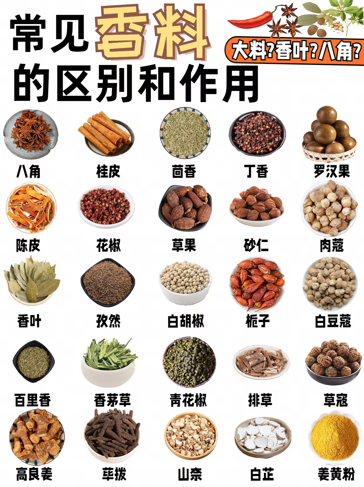

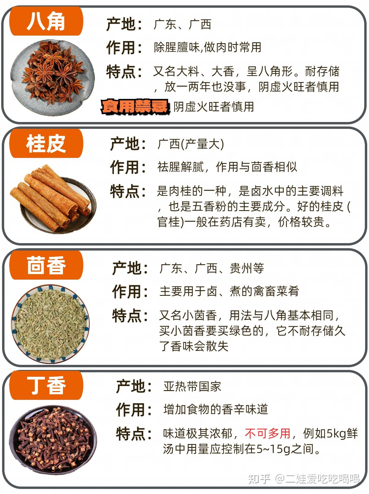
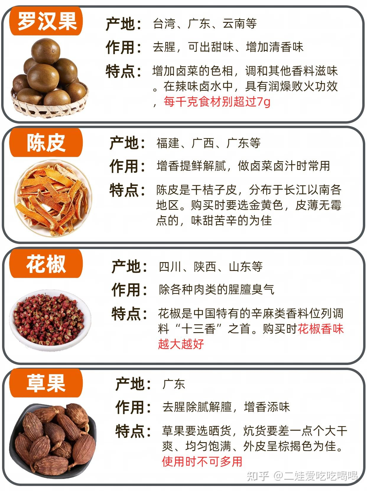
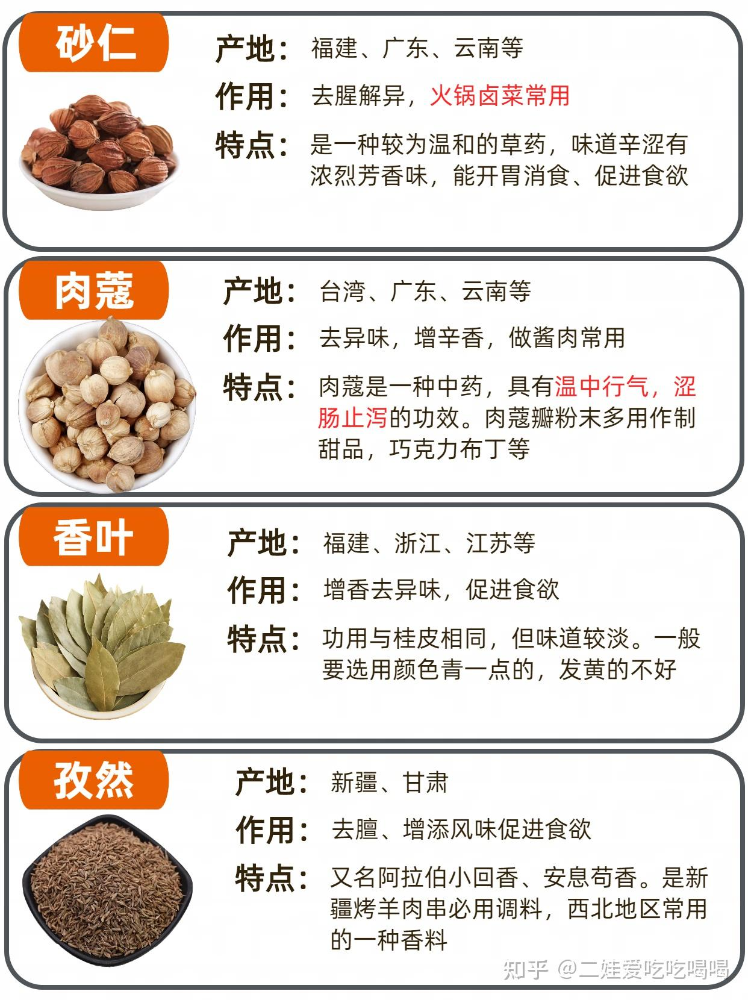
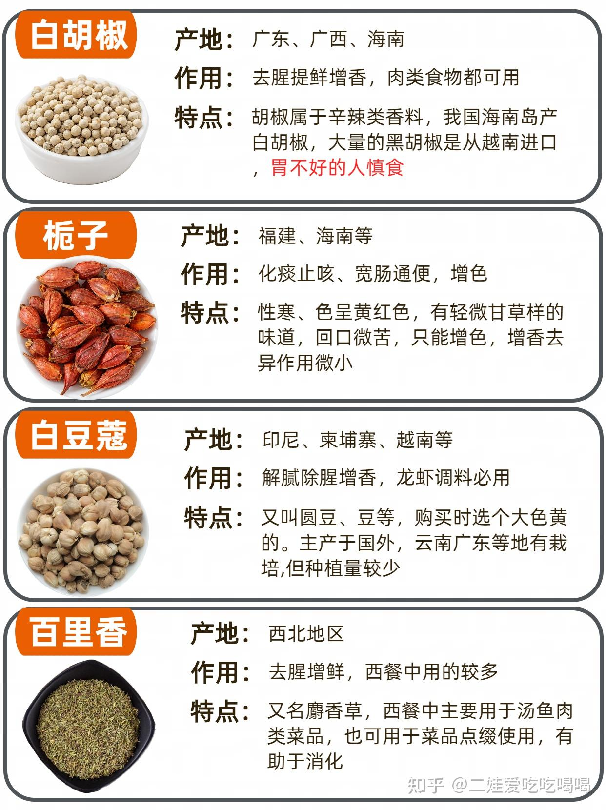
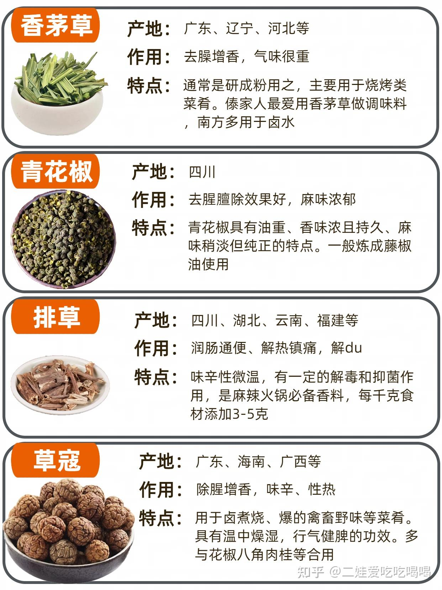
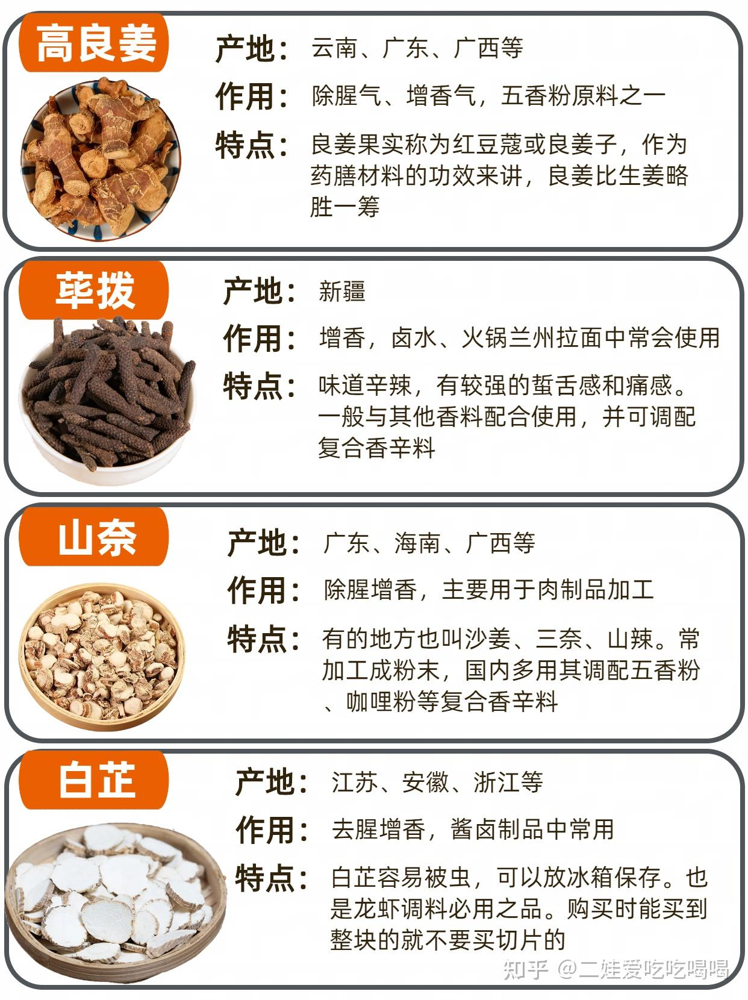
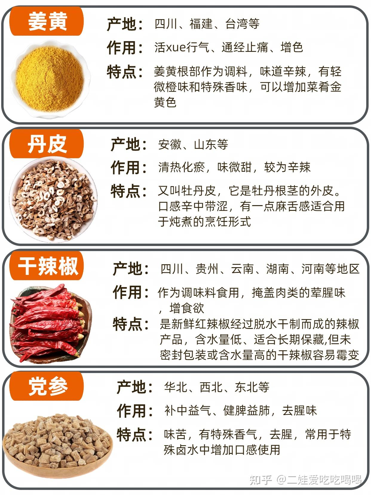


### 牛肉和牛排的介绍

- [西冷牛排](#西冷牛排)


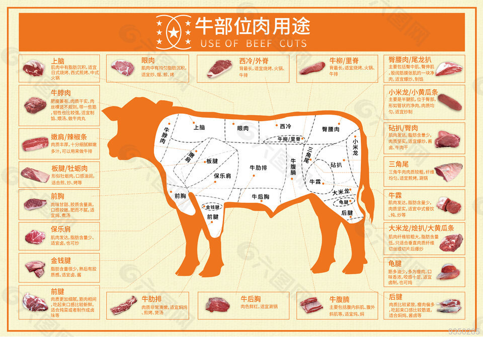

 **第一章：源头之选——“好牛”是好牛排的基石**

一块顶级牛排的诞生，远早于厨房里的烹饪。牛的品种、饲养方式、以及后续的处理，共同决定了牛肉的基础品质。

 **1. 牛的品种 (Breed)**

不同的牛种，其肉质风味和脂肪分布（油花）差异巨大。
* **和牛 (Wagyu):** 源自日本的珍稀品种，以其极致的、雪花般密集分布的大理石花纹而登峰造极。和牛的脂肪熔点极低（约25°C），入口即化，带来无与伦比的柔嫩口感和独特的奶油香气。著名的神户牛、松阪牛都属于和牛。口感属于当之无愧的第一。
* **安格斯牛 (Angus):** 这是全球最著名的肉牛品种之一，尤其是黑安格斯牛。它们以生长速度快、肉质好、大理石花纹丰富且均匀而闻名，风味浓郁，是高品质牛排的主要来源。
* **海福特牛 (Hereford):** 源自英国，是另一个非常受欢迎的肉牛品种，适应性强，肉质同样优良。
* **夏洛莱牛 (Charolais) / 利木赞牛 (Limousin):** 源自法国，这些品种以肌肉发达、脂肪含量较低（更瘦）而著称，追求纯粹肉感和嚼劲的食客可能会偏爱它们。

 **2. 饲养方式 (Feeding)**

饲料是塑造牛肉风味的关键。

* **谷饲 (Grain-fed):** 在牛只生长的后期，以玉米、大豆等谷物为主要饲料进行集中喂养。谷饲牛的脂肪含量更高，油花更丰富，肉质更嫩，口感偏甜，是我们通常在高级餐厅吃到的牛排类型。
* **草饲 (Grass-fed):** 牛只在天然牧场上以青草为食。草饲牛的脂肪含量较低，颜色偏黄（富含β-胡萝卜素），肉质更紧实，更有嚼劲，风味上带有更纯粹、略带“野性”的牛肉本味。

 **3. 熟成 (Aging)**

熟成是提升牛肉风味和嫩度的关键一步，如同美酒的陈酿。

* **湿式熟成 (Wet-Aging):** 将牛肉用真空袋包裹，在冷藏环境中（0°C左右）利用牛肉自身的天然酶分解结缔组织，从而提升嫩度。这是现代最主流的熟成方式，过程高效，能很好地保持肉的多汁性。
* **干式熟成 (Dry-Aging):** 将大块的牛肉不加任何包裹，直接暴露在严格控制温度、湿度和空气流通的熟成室中。在这个过程中，水分会蒸发，风味物质被高度浓缩；同时，天然酶的作用加上表面微生物的微妙影响，会赋予牛肉独特的坚果、奶酪甚至类似风干火腿的复合型风味。干式熟成的牛排风味极其醇厚，但因损耗大、技术要求高而价格不菲。

 #### **第二章：部位精解——牛排的“风土”与性格**

[西冷？菲力？五分熟？七分熟？牛排到底怎么选、怎么吃，进来告诉你  -- 澎湃](https://m.thepaper.cn/baijiahao_16354951)

现在，我们来到牛的分割图前，探索不同部位的“性格”。


* **菲力牛排 (Filet Mignon / Tenderloin):**
    * **位置:** 牛腰内里脊，是牛运动量最少的一块肌肉。
    * **特点:** “嫩”是其唯一的、也是极致的追求。几乎没有脂肪和筋膜，肉质如天鹅绒般细腻。
    * **风味:** 牛肉风味相对清淡，适合搭配精致的酱汁。
    * **适合人群:** 牙口不好的老人、孩子，以及追求极致嫩滑口感的美食家。
    * **烹饪建议:** 熟度不宜过高，3-5分熟（Medium Rare to Medium）最佳，以保留其柔嫩多汁的特性。过熟会使其变得干柴。

* **肉眼牛排 (Ribeye):**
    * **位置:** 牛肋脊第六至十二根肋骨之间的部位。
    * **特点:** 油花丰富且分布均匀，中心通常有一块明显的脂肪，形似眼睛。肉质柔软，油润甘美。
    * **风味:** 风味极其浓郁，烹饪时脂肪融化，香气四溢，兼具了出色的嫩度和丰富的风味。
    * **适合人群:** 大多数牛排爱好者的“梦中情人”，追求风味与嫩度完美平衡的首选。
    * **烹饪建议:** 5-7分熟（Medium to Medium Well）均可。较高的熟度能让脂肪更充分地融化，带来更焦香的口感。

* **纽约客牛排 (New York Strip / Striploin):**
    * **位置:** 牛前腰脊肉。
    * **特点:** 肉质紧实，非常有代表性的“牛排口感”，顶部通常带有一条厚厚的脂肪边。
    * **风味:** 牛肉风味非常醇厚，咀嚼时能感受到扎实的肉感和肉汁。
    * **适合人群:** 喜欢纯粹、强烈牛肉风味和扎实嚼劲的食客。
    * **烹饪建议:** 5分熟（Medium）是理想选择，能软化其肌肉纤维，同时保留足够的肉汁。

* **T骨/红坊牛排 (T-Bone / Porterhouse):**
    * **位置:** 牛背部的脊骨肉。
    * **特点:** 一块T形骨头分割开两种肉：一边是小块的菲力，另一边是较大块的纽约客。Porterhouse的菲力部分按规定必须更大。
    * **风味:** 一次品尝两种经典风味，是贪心食客的福音。
    * **适合人群:** 选择困难症患者，以及希望同时体验嫩滑与嚼劲的食客。
    * **烹饪建议:** 由于两边肉的脂肪含量和厚度不同，烹饪难度较高。建议将菲力一侧置于火力较弱区域，或在纽约客一侧多煎一会。

 **第三章：烹饪的艺术与科学**

掌握了食材，接下来就是施展魔法的时刻。

 **1. 烹饪前的准备 (Preparation)**

* **完全解冻:** 冷冻牛排必须在冷藏室中完全解冻（通常需要24小时以上），切忌用热水或微波炉，会破坏肉质。
* **回温至室温:** 这是至关重要的一步！将牛排从冰箱取出，在室温下放置至少30-60分钟（取决于厚度）。这能确保牛排内外受热均匀，不会出现外焦内冷的情况。
* **吸干表面:** 用厨房纸巾将牛排表面的血水和水分彻底吸干。干燥的表面才能在高温下迅速产生焦香四溢的“梅纳反应”（Maillard Reaction）。
* **调味 (Seasoning):**
    * **时机:** 可以在下锅前调味，也可以在煎好后调味。提前调味（特别是盐）有轻微的脱水作用，能让表皮更干爽，但也可能让肉质变紧。对于厚切牛排，提前30-40分钟撒盐，盐分有足够时间渗透进去，效果更佳。
    * **材料:** 对于高品质牛排，**粗海盐**和**现磨黑胡椒**是永恒的经典。它们的颗粒能更好地附着在牛排表面。

 **2. 核心技术：熟度控制**

| 熟度 (中文) | 核心温度 (Core Temperature) | 视觉特征 | 手指按压法 (参考) |
| :--- | :--- | :--- | :--- |
| **近生 (Blue Rare)** | 46-49°C | 仅表面微煎，内部完全是冷的生肉 | 虎口完全放松时的硬度 |
| **一分熟 (Rare)** | 50-55°C | 内部75%为红色，温热 | 拇指与食指轻触，虎口的硬度 |
| **三分熟 (Medium Rare)** | 55-59°C | 内部50%为粉红色，肉汁饱满 | 拇指与中指轻触，虎口的硬度 |
| **五分熟 (Medium)** | 60-65°C | 内部25%为粉红色，口感均衡 | 拇指与无名指轻触，虎口的硬度 |
| **七分熟 (Medium Well)** | 66-69°C | 内部仅有少量粉色，肉质开始变硬 | 拇指与小指轻触，虎口的硬度 |
| **全熟 (Well Done)** | >70°C | 内部完全为灰褐色，几乎无肉汁 | 掌心下方的肌肉硬度 |

**最精准的工具：** 一个可靠的**探针式食品温度计**是您成为牛排大师的最佳伙伴。

 **3. 烹饪方法**

* **传统煎法 (Pan-Sear):**
    1.  **选锅:** 首选**铸铁锅**或厚底不锈钢锅，它们储热性能好，能提供持续稳定的高温。
    2.  **热锅:** 大火将锅烧得滚烫，直到轻微冒烟。
    3.  **用油:** 加入烟点高的油，如葡萄籽油、牛油果油或精炼花生油。
    4.  **下锅:** 将牛排放入锅中，会发出“滋滋”声。根据厚度，每面煎1-3分钟。
    5.  **增香:** 翻面后，调至中火，加入一大块**黄油**、几瓣拍扁的**大蒜**和一枝**迷迭香/百里香**。待黄油融化后，将锅倾斜，用勺子不断将充满香气的黄油浇在牛排表面。这个过程叫**Basting**，能增加风味并帮助均匀加热。
* **先煎后烤 (Sear-Roast):** 适用于超过3厘米的厚切牛排。先在锅中将两面各煎1-2分钟形成焦壳，然后连锅带牛排（如果锅柄可入烤箱）或将牛排移至烤盘上，放入预热180°C的烤箱中，烤至所需熟度。
* **低温慢煮 (Sous Vide) / 反向炙烤 (Reverse Sear):** 这是现代精准烹饪的代表。先将牛排低温（如用烤箱或水浴）慢煮至目标温度前几度，然后再用极高温快速将表面煎脆。这样做出的牛排内外熟度极其均匀，几乎零失误。

 **4. 收尾的仪式：静置 (Resting)**

这是牛排烹饪中**绝对不可省略**的步骤。刚出锅的牛排，肉汁因高温被挤压到中心。如果马上切开，肉汁会立刻流失。将其放在烤架或温热的盘子上，静置5-10分钟（通常是烹饪时间的1/3到1/2），让肌肉纤维放松，肉汁会重新均匀分布到整块牛排中。你会得到一块鲜嫩多汁得多的牛排。

 **第四章：升华体验——酱汁、配菜与品尝**

* **经典酱汁:**
    * **法式伯那西酱 (Béarnaise Sauce):** 蛋黄、黄油、白酒醋和龙蒿草制成的乳化酱汁，口感丰厚，是菲力的经典搭配。
    * **阿根廷青酱 (Chimichurri):** 欧芹、牛至、大蒜、辣椒、橄榄油和醋的混合物，清新酸爽，能完美平衡肉眼的丰腴。
* **经典配菜:**
    * **淀粉类:** 细腻顺滑的**土豆泥**、外脆内软的**烤小土豆**、**法式炸薯条**。
    * **蔬菜类:** **奶油焗菠菜**、**蒜香烤芦笋**、**黄油炒蘑菇**、**蜂蜜烤胡萝卜**。
* **品尝的艺术:**
    * **切割:** 用锋利的刀，**逆着牛肉的纹理**（肌肉纤维的方向）切。这样可以切断长纤维，使口感更嫩。
    * **配酒:**
        * **菲力等瘦肉:** 搭配酒体中等、单宁柔和的红酒，如勃艮第的黑皮诺（Pinot Noir）。
        * **肉眼、纽约客等肥美牛排:** 搭配酒体饱满、单宁强劲的红酒，如波尔多的赤霞珠（Cabernet Sauvignon）或阿根廷的马尔贝克（Malbec），强劲的单宁可以化解脂肪的油腻感。


#### 西冷牛排


top sirloin 上腰肉/米龙/里脊

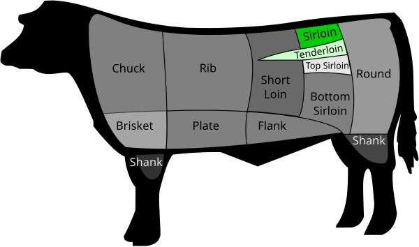
西冷牛排在美国指牛后腰脊柱两侧的肉，肉质细嫩，价格高。其中顶部（top sirloin）的肉质最好，价格最高，一般会标明。西冷牛排在英国、香港等地指牛胸脊肉部分，肉质细嫩度次于菲力牛排，售价也较低于菲力牛排，上端部分的西冷牛排较为鲜嫩，售价亦稍高。

西冷牛排是牛排世界中非常受欢迎且极具代表性的一员。相较于菲力的极嫩或肉眼的丰腴，西冷以其绝佳的平衡感和浓郁的牛肉风味，赢得了“牛排入门者”和资深食客的一致青睐。

核心解密：西冷究竟是哪块肉？

西冷（Sirloin）是一个相对较大的区域，取自牛的后腰脊部。这个部位的肌肉运动量较多，但又不像腿部肌肉那样过分结实。

位置： 紧邻着菲力（Tenderloin）和T骨（T-bone）所在的“前腰脊”（Short Loin）之后。

别称： 在不同地区，它也可能被称为“沙朗牛排”。需要注意的是，这个称呼有时会与“肋眼”混淆，但在经典的牛排分割中，Sirloin特指后腰脊肉。

口感与风味：硬汉的柔情

西冷的特点可以用几个关键词来概括：

风味浓郁： 这是西冷最大的魅力所在。由于其肌肉纤维组织较为丰富，它蕴含着非常纯粹、醇厚的牛肉本味。如果您追求的是“大口吃肉”的满足感和扎实的肉香，西冷是绝佳选择。

肉质紧实，富有嚼劲： 与菲力的入口即化不同，西冷提供了更具“肉感”的体验。它的肉质紧实，纤维略粗，咀嚼时能清晰地感受到肉的纹理和弹性质感。

脂肪适中，瘦肉为主： 西冷牛排的油花（大理石花纹）不像肉眼那样丰富，通常只在肉的一侧带有一条标志性的脂肪边。这使得它在风味浓郁的同时，不会过于油腻。

性价比高： 由于产量相对较大，西冷牛排的价格通常比菲力、肉眼等部位更加亲民，是日常享用牛排的绝佳经济之选。

烹饪指南：如何驾驭西冷牛排

要发挥西冷牛排的最大优势，关键在于避免过度烹饪。由于其脂肪含量不高，一旦过熟，肉质很容易变得干柴。

最佳熟度：三分至五分熟 (Medium Rare to Medium)

三分熟 (Medium Rare / 55°C 核心温度): 这是最能体现西冷牛排风味和多汁性的熟度。此时，牛排中心呈漂亮的粉红色，肉汁饱满，口感兼具柔嫩与嚼劲。

五分熟 (Medium / 60°C 核心温度): 如果您不太习惯吃太生的牛排，五分熟是很好的折中。中心区域仍有少量粉色，肉质更熟，但依然能保持一定的湿润度。

强烈不建议超过七分熟，否则您将失去西冷牛排最迷人的风味和口感。

家庭煎制步骤：

充分回温与擦干： 与处理所有牛排一样，提前从冰箱取出，在室温下放置30-60分钟。用厨房纸巾彻底吸干表面水分。

简单调味： 在下锅前，用足量的粗海盐和现磨黑胡椒均匀涂抹在牛排两面。

高温热锅，快速锁汁： 使用铸铁锅或厚底平底锅，大火烧热至冒烟。加入烟点高的油，放入牛排。每面大火煎60-90秒，形成漂亮的焦褐色外壳（梅纳反应）。

转中火，持续烹饪： 翻面后转中火，根据您想要的熟度继续煎制。对于一块约2.5厘米厚的西冷牛排，达到三分熟大约每面再需1-2分钟。

加入增香物（可选）： 在最后1分钟，加入黄油、拍扁的大蒜和百里香/迷迭香，用勺子将香料黄油反复浇在牛排上增香。

静置是关键： 煎好的牛排务必从锅中取出，放在烤架或温盘子上静置5-8分钟。这是保证肉汁回流、口感鲜嫩的黄金法则。

逆纹切块： 静置完毕后，找到牛排的肌肉纤维走向，用锋利的刀逆着纹理切成厚片享用。

谁会爱上西冷牛排？

牛排初学者： 价格友好，风味直接，是建立牛排风味认知的绝佳起点。

追求浓郁肉味的美食家： 如果您认为菲力“没味儿”，那么西冷的醇厚肉香一定会让您满意。

健身人士和偏好瘦肉者： 脂肪含量相对较低，蛋白质丰富，是补充优质蛋白的好选择。

家庭日常烹饪： 性价比高，适合作为家庭餐桌上频率更高的牛排选择。

总而言之，西冷牛排就像一位性格直爽、内涵丰富的朋友，它不以极致的柔嫩取胜，而是用那份扎实、纯粹、毫不掩饰的牛肉本味，为您带来最经典、最酣畅淋漓的牛排体验。

好的，我们来详细深入地剖析一下 西冷牛排（Sirloin Steak）。

与菲力的极致柔嫩和肉眼的丰腴油润不同，西冷牛排以其浓郁的牛肉风味和富有嚼劲的标志性口感，在牛排世界中占据着不可或-缺的一席之地。它是一位性格鲜明的“硬汉”，深受追求纯粹肉感和醇厚风味的食客喜爱。

一、 西冷牛排的“身份”：它来自哪里？

西冷（Sirloin）这个词源自古法语“surlonge”，意为“腰脊上方”，精准地描述了它的位置。

精确部位： 西冷牛排主要取自牛的后腰脊部（Hind Loin）。这个部位的肌肉运动量较多，但又不像腿部肌肉那样过于结实。具体来说，我们常说的西冷牛排，在美式切割中通常指上后腰脊肉（Top Sirloin），这是整个后腰脊中肉质最好的部分。而在英式或港式切割中，“西冷”有时也指前腰脊肉（Striploin），也就是我们常说的“纽约客”。因此，在购买时需要稍加注意，但它们都属于风味浓郁的腰脊肉。

标志性特征： 西冷牛排最显著的外观特征，就是其外延带有一条白色的脂肪层和肉筋。这条脂肪边在烹饪时会融化，为牛排增添独特的焦香和风味，而那条肉筋则赋予了西冷牛排独特的、富有弹性的嚼劲。

二、 口感与风味：西冷的“性格”

品尝西冷，是一场关于力度与风味的体验。

口感：肉质紧实，嚼劲十足。 这是西冷最核心的特点。它的肌肉纤维较粗，口感扎实，咀嚼时能清晰地感受到肉的纹理和力度。它不像菲力那样入口即化，而是需要用牙齿去感受和征服，每一次咀嚼都会释放出更多的肉汁和风味。

风味：牛肉味极其浓郁。 由于运动量适中，血液供应充足，西冷积聚了大量的风味物质。它的牛肉本味非常醇厚、直接，没有过多脂肪的甜腻感，是一种纯粹而强烈的肉香。

脂肪含量：相对较低。 相比于油花密布的肉眼，西冷的内部脂肪（大理石花纹）较少，整体偏瘦。主要的脂肪集中在边缘的那一条上。这使得它在提供浓郁风味的同时，不会过于油腻。

三、 为什么选择西冷牛排？

给追求“肉感”的你： 如果你觉得菲力太“柔弱”，肉眼又有些“肥腻”，那么西冷提供的扎实嚼劲和纯粹肉感，会让你大呼过瘾。

给风味至上的你： 西冷是体验牛肉原始风味的绝佳选择。

高性价比之选： 在同等级的牛肉中，西冷的价格通常比菲力和肉眼更具优势，是日常享用牛排的理想选择。

适合健身人士： 其蛋白质含量高而脂肪相对较低的特点，也使其受到健身和注重健康饮食人群的青睐。

四、 如何烹饪西冷：发挥其最佳潜力的艺术

烹饪西冷的关键在于平衡其韧性与多汁性，避免因过度烹饪而变得干柴。

最佳熟度：三至五分熟 (Medium Rare to Medium)

三分熟 (Medium Rare / 55-59°C): 此时的西冷，内部温热呈粉红色，肉汁饱满，能最好地展现其风味，同时肌肉纤维已得到适度软化，嚼劲恰到好处。

五分熟 (Medium / 60-65°C): 内部大部分为粉色，口感会更扎实一些，但依然多汁。对于不太习惯吃生肉的食客来说，这是非常安全且美味的选择。

强烈不建议超过七分熟： 过高的温度会使其肌肉纤维过度收缩，肉汁大量流失，口感变得又干又硬，难以咀嚼，完全浪费了这块牛排。

家庭煎制黄金法则：

回温与擦干： 与其他牛排一样，烹饪前务必使其恢复至室温，并用厨房纸巾彻底吸干表面水分。

处理脂肪边（关键步骤）：在热锅前，可以用刀在边缘的脂肪层上切几刀（不要切到瘦肉），防止煎制时因筋膜收缩而卷曲。

先煎脂肪边！ 用夹子夹住牛排，将脂肪边立在滚烫的锅中煎一分钟左右。这样做有两大好处：一是能逼出牛油，用这天然的牛油来煎牛排，风味会加倍香浓；二是能让脂肪边变得金黄酥脆。

高温快煎： 用逼出的牛油或补充一些植物油，将锅烧至冒烟，然后将牛排平放入锅。根据厚度（以2.5厘米为例），每面大火快煎60-90秒，形成漂亮的焦褐色外壳。

加入香料增香（Basting）： 翻面后，转中火，加入黄油、拍扁的大蒜和百里香/迷迭香。待黄油融化后，将锅倾斜，用勺子不断将香料黄油浇淋在牛排上，持续约30-60秒。

静置是灵魂： 将煎好的牛排取出，放在烤架或温盘子上，静置5-8分钟。这是锁住肉汁，让口感更多汁、柔嫩的最后一步魔法。

逆纹切块： 静置完毕后，逆着肌肉纤维的纹理将牛排切成条状，即可享用。

总而言之，西冷牛排是一位个性鲜明的实力派选手。它不以极致的嫩度取悦你，而是用它那无可替代的浓郁风味和充满力量感的嚼劲来征服你的味蕾。掌握好合适的熟度与烹饪技巧，你就能充分领略到这位“牛排硬汉”的独特魅力。


## 计算机相关
### ac-ap和路由器的区别与联系

```json
### 1. 基础概念对比

#### 路由器
- 主要功能：网络数据包转发，连接不同网络
- 特点：
  - 通常具有 WAN/LAN 口
  - 支持 NAT 转换
  - 适合家庭或小型办公室使用
  - 一般支持 10-20 台设备同时连接
  - 自带 DHCP 服务

#### AP（Access Point）
- 主要功能：提供无线网络接入
- 特点：
  - 覆盖范围更大
  - 支持更多终端同时接入
  - 稳定性更好
  - 适合大型场所使用（如商场、学校）

#### AC（Access Controller）
- 主要功能：集中管理多个 AP
- 特点：
  - 统一管理多个 AP
  - 支持无缝漫游
  - 具备路由功能
  - 支持集中化配置

### 2. AP 的两种类型

#### 胖 AP（FAT AP）
特点：
- 独立工作能力强
- 自带管理界面
- 配置独立
- 适合小规模部署
- 价格相对较高

#### 瘦 AP（FIT AP）
特点：
- 需要 AC 控制器管理
- 无独立配置界面
- 价格相对较低
- 适合大规模部署
- 便于统一管理

### 3. 典型应用场景

#### 家庭/小型办公室
推荐方案：
- 单个路由器或胖 AP
  - 覆盖范围：50-100平方米
  - 连接设备：10-20台
  - 优点：配置简单，成本低

#### 大型场所（办公楼/酒店）
推荐方案：
- AC + 多个瘦 AP
  - 覆盖范围：大面积
  - 连接设备：数百台
  - 优点：
    - 统一管理
    - 无缝漫游
    - 易于扩展
  - 典型拓扑：
    - AC（核心）
    - PoE交换机
    - 多个瘦AP

### 4. 重要概念关系
- AC 一定是路由器，但路由器不一定是 AC
- 胖 AP 可以独立工作，瘦 AP 需要 AC
- 一个 AC 可以管理多个瘦 AP
- PoE 交换机可以为 AP 供电和数据传输

### 5. 选择建议

#### 如何选择
1. 小型环境（家庭/小办公室）
   - 选择路由器或胖 AP
   - 考虑价格和易用性

2. 大型环境（企业/商场）
   - 选择 AC + 瘦 AP 方案
   - 考虑可扩展性和统一管理

#### 注意事项
- 评估覆盖范围需求
- 考虑同时接入设备数量
- 预留扩展空间
- 考虑预算成本
- 评估管理维护难度

### 6. 常见应用实例

#### 多层办公楼部署
架构示例：
- 核心层（AC）
  - 汇聚层（PoE交换机）
    - 一楼AP
    - 二楼AP
    - 三楼AP
效果：
- 统一SSID
- 无缝漫游
- 集中管理

这样的部署可以实现用户在不同楼层移动时，无需手动切换 WiFi，体验更好。

```

### 蒙特卡洛算法
[Github - 蒙特卡洛](https://github.com/zata-zhangtao/SoUseful/blob/main/%E8%AE%A1%E7%AE%97%E6%9C%BA%E7%9F%A5%E8%AF%86/%E8%92%99%E7%89%B9%E5%8D%A1%E6%B4%9B%E7%AE%97%E6%B3%95.md)

### 遗传算法
[Github - 遗传算法](https://github.com/zata-zhangtao/SoUseful/blob/main/%E8%AE%A1%E7%AE%97%E6%9C%BA%E7%9F%A5%E8%AF%86/%E9%81%97%E4%BC%A0%E7%AE%97%E6%B3%95.md)
### 模拟退火算法
[Github - 模拟退火](https://github.com/zata-zhangtao/SoUseful/blob/main/%E8%AE%A1%E7%AE%97%E6%9C%BA%E7%9F%A5%E8%AF%86/%E9%80%80%E7%81%AB%E7%AE%97%E6%B3%95.md)

### gradio简介及其在ai项目中的应用

```csharp

#### Gradio 是什么？

Gradio 是一个 Python 库，用于快速创建机器学习模型的 Web 界面。它允许您为几乎任何 Python 函数创建易于使用的 UI 界面，特别适合机器学习和数据科学项目的演示。

#### 主要特点：

1. **简单易用**
   - 只需几行代码即可创建交互式界面
   - 支持多种输入输出类型（文本、图像、音频、视频等）

2. **快速部署**
   - 可以在本地运行
   - 支持一键分享临时链接
   - 可以部署到 Hugging Face Spaces 等平台

3. **灵活性**
   - 支持自定义界面布局
   - 可以与主流机器学习框架集成（PyTorch, TensorFlow, scikit-learn等）

#### 简单示例：

"""
import gradio as gr

def greet(name):
    return "Hello " + name + "!"

demo = gr.Interface(
    fn=greet,
    inputs="text",
    outputs="text"
)

demo.launch()
"""

#### 常见应用场景：

1. 机器学习模型演示
2. 图像处理应用
3. 文本生成/处理
4. 语音识别/合成
5. 数据可视化

#### 优势：

- 零前端经验要求
- 快速原型开发
- 易于分享和部署
- 支持多种输入输出类型
- 活跃的社区支持

#### 实用链接：

- [Gradio 官方文档](https://gradio.app/docs/)
- [Gradio GitHub](https://github.com/gradio-app/gradio)
- [Hugging Face Spaces](https://huggingface.co/spaces) (用于部署 Gradio 应用)


```


### wan-lan-wlan与vlan的概念解析
（来源：知乎）
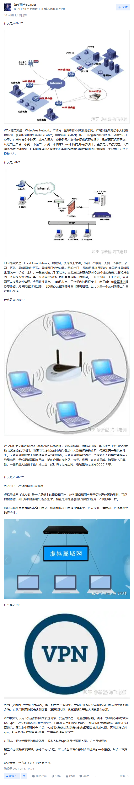
### 如何判断内存是否为ecc类型

wmic memorychip get datawidth,totalwidth
出来的二个数大于第一个一般就是ECC内存


### 什么是附属安装包
一个模型的附属包（companion package）是指与某个特定模型或框架配套使用的软件包，旨在扩展或增强其功能。以下是其主要特点：

功能扩展：提供额外的工具、函数或方法，帮助用户更好地使用主模型。

依赖关系：通常依赖于主模型或框架，不能独立运行。

特定用途：针对特定任务或领域设计，如数据处理、可视化或性能优化。

社区支持：可能由社区开发，为主模型提供更多灵活性。

示例
R语言：dplyr 是 ggplot2 的附属包，用于数据处理。

Python：scikit-learn 的 sklearn.model_selection 提供交叉验证和超参数调优功能。

深度学习：TensorFlow 的 TensorFlow Extended (TFX) 用于生产环境部署。

### 什么是预训练_预训练和训练的区别
预训练是让模型学习到一种通用的表征，往往来说标注数据是非常珍贵的，而实际上许多任务之间是有共性的，可以进行迁移学习。


ref：
https://blog.csdn.net/weixin_45325693/article/details/132084298
https://cloud.tencent.com/developer/article/2303090
## 光学相关


### 菲涅耳透镜

[菲涅爾透鏡](https://www.oslens.com/pros/fresnellens.html)
[维基百科](https://zh.wikipedia.org/wiki/%E8%8F%B2%E6%B6%85%E8%80%B3%E9%80%8F%E9%8F%A1)
[百度百科](https://baike.baidu.com/item/%E8%8F%B2%E6%B6%85%E5%B0%94%E9%80%8F%E9%95%9C/4138176)


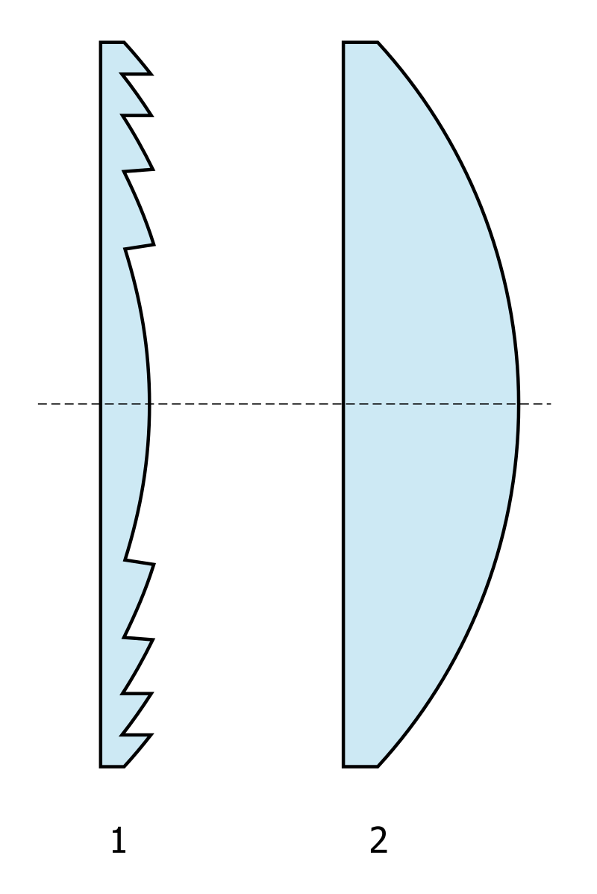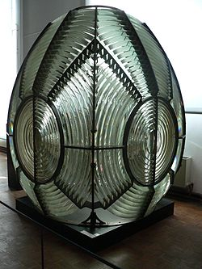

非尼尔透镜（也称弗雷斯内尔透镜）是一种特殊的复合紧凑型光学透镜，由法国物理学家奥古斯丁-让·弗雷斯内尔（Augustin-Jean Fresnel）于19世纪初发明。它通过将传统凸透镜的曲面“折叠”或分段设计成一系列同心环状结构，大大减少了透镜的厚度和材料用量，使其变得更薄、更轻便，通常呈平面状，由玻璃或塑料制成。这种设计保留了透镜的折射功能，但体积仅为传统透镜的几分之一，非常适合需要大口径或长焦距的应用。


>历史背景

非尼尔透镜的发明源于18世纪末的灯塔照明问题。当时，灯塔使用的传统玻璃透镜过于厚重，导致光线损失严重，无法有效将灯光投射到远距离的海面。早在1748年，法国博物学家乔治-路易·勒克莱尔·德·布丰（Georges-Louis Leclerc, Comte de Buffon）就提出过使用同心环状棱镜的透镜概念，用于“燃烧玻璃”（一种聚焦阳光的装置）。但真正将其应用于实际的，是弗雷斯内尔。


1811年，法国成立了“灯塔委员会”（Commission des Phares），弗雷斯内尔作为物理学家加入其中。他在1819年提出“阶梯透镜”（lentilles à échelons）的设计理念，将凸透镜切割成薄环并平铺。这种创新在1820年制作出原型，并于1823年7月25日首次安装在法国科尔杜安灯塔（Cordouan Lighthouse），灯光可见距离超过32公里。这标志着灯塔技术的革命，此后非尼尔透镜迅速推广到全球灯塔。弗雷斯内尔于1827年英年早逝后，其兄弟莱奥诺尔（Léonor）继续完善设计。到19世纪中叶，英国工程师如托马斯·史蒂文森（Thomas Stevenson）和詹姆斯·蒂明斯·钱斯（James Timmins Chance）进一步改进，开发出“全光透镜”（holophotal lens），使透镜更高效。


> 设计原理与工作方式

非尼尔透镜的核心原理是**折射光学**，类似于传统凸透镜，但通过“阶梯化”设计避免了厚重部分。传统凸透镜的中心厚、边缘薄，光线从不同位置进入时会因曲面弯曲而汇聚到一个焦点（焦平面）。非尼尔透镜将这个曲面“切片”成多个同心环（annular sections），每个环的斜面角度精确计算，确保光线以相同角度折射，就像来自完整曲面一样。

- **结构分解**：中心是一个完整的凸透镜部分，外围是越来越薄的环状段。这些段可以是纯折射型（仅弯曲光线），或猫二棱镜型（结合反射和折射，使用全内反射减少光损失）。
- **光路过程**：平行光线（如阳光或灯源）进入透镜后，每个环的斜面会将光线向中心轴弯曲，最终在焦平面上汇聚，形成强聚焦光束。焦距取决于环的曲率和间距，通常可从几厘米到数米不等。

这种设计牺牲了一些成像精度（边缘光线可能有色差），但在聚焦平行光时效率极高。


> 构造与制造

早期非尼尔透镜由手工切割玻璃棱镜组装而成，每块棱镜独立打磨，安装在金属框架中（如灯塔用的第一阶透镜，重达数吨）。现代制造则使用注塑成型（塑料）或CNC铣削（玻璃），允许批量生产微型透镜。厚度通常1-5毫米，大小从手持式（几厘米）到灯塔级（直径数米）。塑料版（如聚碳酸酯）更廉价、耐用，但玻璃版光学性能更好。

> 优点与缺点

**优点**：
- **轻薄高效**：材料用量减少90%以上，便于运输和安装。
- **大口径长焦**：适合远距离光传输，如灯塔可见数十公里。
- **多功能**：可设计成聚焦、散射或成像模式，塑料版成本低。

**缺点**：
- **成像质量差**：边缘畸变和色散，适合照明而非摄影。
- **光损失**：反射型设计可能有少量散射。
- **耐用性**：塑料版易刮花，玻璃版易碎。

> 应用领域

非尼尔透镜的应用远超灯塔，已渗透多个行业：

- **照明与信号**：经典灯塔（如夏威夷Makapuu Point灯塔的超径向透镜，高3.7米，含上千棱镜）；汽车头灯、尾灯、交通信号灯；剧场聚光灯（Fresnel lantern）和搜索灯。
- **成像与显示**：手持放大镜、投影仪（20世纪50年代的头顶投影机）、虚拟现实头显、CRT电视放大屏（如Sinclair TV80）。
- **太阳能**：聚焦阳光用于太阳能烹饪器、热水器或斯特林发动机发电，效率高、成本低。
- **其他**：飞机航母光学着陆系统、电视塔信标灯、医疗设备（如X光机聚焦）。

近年来，适应性非尼尔透镜（adaptive Fresnel lens）通过旋转组件改变焦距，用于动态光学系统。

> 示意图插入：灯塔应用
一个横截面图展示了第一代灯塔非尼尔透镜：上部和下部有斜置反射镜，中间是多层棱镜环，将灯源光线向上方聚束，形成狭窄光柱，投射到海平面数十公里外。（图像参考：https://upload.wikimedia.org/wikipedia/commons/9/9b/Fresnel_lighthouse_lens_diagram.png）

> 相关介绍：现代发展和趣闻
非尼尔透镜不仅是光学奇迹，还启发了现代科技，如全息光学和微透镜阵列。在DIY领域，它常用于太阳能烤箱或简易投影仪。趣闻：弗雷斯内尔的设计灵感来源于波动光学理论，他用它证明了光的波性。今日，许多博物馆展出这些“水晶蜂窝”，提醒我们19世纪的创新如何照亮现代世界。如果你想亲手试试，一个廉价塑料非尼尔透镜就能聚焦阳光点燃纸张——但请小心火源！


### 几种可显著增强光的机制与材料

1. **激光器（Laser）**
- 通过受激辐射实现光的相干放大：当处于激发态的原子受到与其能级差相对应的光子刺激时，会释放出与入射光子完全相同（相同频率、相位、偏振方向和传播方向）的光子，这个过程称为受激辐射。通过特定的腔体设计（如法布里-珀罗腔，由两个高反射率镜面组成，一个全反射，一个部分透射，用于输出激光）和泵浦机制（包括光泵浦如闪光灯、激光二极管泵浦，或电泵浦如气体放电，为激光介质提供能量使其处于激发态），可以实现光子的连锁反应式放大，产生相干的激光输出
- 可以产生高强度、高方向性的光束
- 增益可以达到几万甚至更高

2. **光学谐振腔**
- 利用两个高反射率镜面之间的多次反射：光在两个平行的高反射率镜面之间来回反射，每次反射都保持光的相干性。当光的波长满足谐振条件（即腔长为该波长的整数倍）时，反射光波会发生建设性干涉，从而使光强度不断增加
- 可以显著增强特定波长的光：由于谐振条件的选择性，只有特定波长的光才能在腔内形成驻波并得到增强。这种选择性使得光学谐振腔可以作为波长选择器，同时也能将特定波长的光强度提高数百甚至数千倍
- 是激光器的重要组成部分：在激光器中，光学谐振腔不仅提供了光的反馈路径，还能选择特定模式的光进行放大。通过精确控制腔长和镜面反射率，可以优化激光器的输出特性，如光束质量、线宽、输出功率等

3. **表面等离子体共振（SPR）材料**
- 主要是贵金属纳米结构（如金、银纳米颗粒）：这些纳米结构的尺寸通常在10-100纳米范围内，其特殊的光学性质源于自由电子的集体振荡。当入射光的频率与金属纳米结构中自由电子的集体振荡频率相匹配时，就会发生表面等离子体共振现象
- 在特定波长下可以产生局域场增强：当发生表面等离子体共振时，纳米结构周围会形成强烈的局域电磁场。这种局域场的强度远超过入射光场，并且高度集中在纳米结构表面附近几十纳米的范围内。这种局域场增强效应可以显著提高光与物质的相互作用强度
- 增强因子可达数千至数万倍：由于局域场效应，光强度在纳米结构表面可以被放大数千甚至数万倍。这种显著的增强效应使SPR材料在表面增强拉曼散射（SERS）、荧光增强、生物传感等领域具有重要应用。增强因子的大小与纳米结构的尺寸、形状、材料以及粒子间距等因素密切相关
- 实际应用广泛：SPR材料被广泛应用于生物传感器、分子检测、光催化、太阳能电池等领域。例如，利用SPR效应可以检测极低浓度的生物分子，实现单分子水平的检测灵敏度

4. **光子晶体**
- 具有周期性介电结构：光子晶体是由不同折射率的介质材料按照特定周期性排列构成的人工结构。这种周期性排列可以是一维、二维或三维的，类似于自然晶体中原子的周期性排列。周期性结构的尺寸通常与工作波长相当，从可见光到微波波段都可以实现
- 可以通过带隙效应和局域模式增强特定波长的光：
  - 带隙效应：由于布拉格散射，某些频率范围的光无法在光子晶体中传播，形成光子带隙。在带隙边缘，光的群速度显著降低，使得光与物质的相互作用时间延长，从而增强光的强度
  - 局域模式：通过在周期性结构中引入缺陷，可以在带隙内形成局域态，将特定频率的光限制在很小的空间范围内，实现光场的局域增强。这种局域模式的品质因子可以达到数千甚至更高
- 可调控性强：通过改变周期结构的几何参数（如周期长度、填充率）和材料参数（如折射率），可以灵活调节带隙位置和局域模式特性
- 应用广泛：被广泛应用于低阈值激光器、高效率LED、光波导、光学滤波器等光电器件中。例如，在光子晶体激光器中，可以显著降低激射阈值，提高激光效率

5. **超材料（Metamaterials）**
- 人工设计的具有特殊电磁性质的材料：超材料是由人工设计和制造的复合材料，其基本单元（meta-atoms）的尺寸远小于工作波长。这些基本单元通常由金属和介电材料按特定方式排列构成，可以表现出自然界中不存在的特殊电磁性质，如负折射率、完美吸收、电磁隐身等
- 可以通过精确设计实现多种光学效应：
  - 通过调节基本单元的几何结构和排列方式，可以实现对光的振幅、相位、偏振等特性的精确控制
  - 可以设计出具有超聚焦、超分辨率成像能力的超透镜
  - 能够实现电磁波的完美吸收或定向发射
- 增强机制多样：
  - 可以通过局域场增强效应显著提高光与物质的相互作用强度
  - 利用谐振结构可以实现特定频率光的选择性增强
  - 通过表面波和体波的耦合可以实现光场的进一步增强
- 制备和应用：
  - 制备方法包括光刻、电子束刻蚀、纳米压印等微纳加工技术
  - 在光学成像、光通信、太阳能利用、传感器等领域有重要应用
  - 可以与其他光学技术结合，如与等离子体结构结合形成等离子体超材料

这些技术在科学研究、工业应用和医疗领域都有重要应用，比如：
- 光谱分析
- 生物传感
- 光通信
- 医疗诊断和治疗


### 阵列光波导,几何光波导,衍射光波导,全息光波导,多层光波导

光波导是一种用于传输光信号的技术，广泛应用于增强现实（AR）和虚拟现实（VR）设备中。以下是几种主要的光波导类型：

。阵列光波导：通过一系列反射镜或棱镜将光信号传输到用户眼睛。它们通常用于高分辨率显示器


。几何光波导：利用几何光学原理，通过反射和折射将光信号传输到用户眼睛。几何光波导通常具有较高的光学效率
。衍射光波导：使用衍射光栅将光信号传输到用户眼睛。衍射光波导可以实现较大的视场角，但可能会有色散问题
。全息光波导：利用全息技术，通过全息光栅将光信号传输到用户眼睛。全息光波导可以实现高效的光传输和较大的视场角
。多层光波导：由多层光学材料组成，每层材料具有不同的折射率，通过多层结构实现光信号的高效传输

### 光耦合器的工作原理与应用
光耦合器（Optocoupler）是一种电子元件，用于在两个电路之间传输信号，同时保持电气隔离。它通过光信号来传递信息，通常由一个发光二极管（LED）和一个光敏器件（如光电晶体管）组成。发光二极管将电信号转换为光信号，光敏器件再将光信号转换回电信号，从而实现信号的传输。

这种技术的主要优点是能够有效地隔离输入和输出电路，防止高电压或电流对敏感电路的干扰和损坏。光耦合器广泛应用于电源管理、通信设备、工业控制等领域。

### 什么叫做光纤亲和力

> 光纤亲和力是指光源输出的光能够有效耦合进入光纤的能力。它取决于以下几个因素:
> 
> 光源的发散角与光纤的数值孔径(NA)的匹配程度 光束的空间模式与光纤模式的匹配程度 光源波长与光纤传输窗口的匹配程度
> 高光纤亲和力意味着光源更容易与光纤实现高效耦合,损耗更小。
### 低相干度low-coherence光的特性与应用场景

> 低相干度是指光源的相干性较差,具体表现为:
> 
> 时间相干性差:光波的相位关系随时间快速变化 
> 空间相干性差:不同空间位置的光波相位关系混乱 
> 光谱带宽宽:包含多个波长成分
> 典型的低相干光源包括:LED、热光源等 低相干光源在某些应用中很有用,如光学相干断层成像(OCT)

### laser-diode-光源的原理与特点
> LD是激光二极管的简称,是一种半导体激光器。其主要特点包括:
> 
> 发射单色相干光 
> 具有很窄的光谱线宽 
> 光束发散角较小 
> 调制带宽高 
> 体积小、效率高 常用于光纤通信、光存储等领域

### ledlight-emitting-diode-光源的基本特性与用途

> ED是发光二极管的简称,是一种半导体发光器件。其特点包括:
> 
> 发射非相干光 
> 光谱带宽较宽 
> 光束发散角大 
> 调制带宽较低 成本低、寿命长 
> 主要用于指示、照明等场合


### sld超辐射发光二极管-光源的技术优势与应用

> SLD（超辐射发光二极管/SLED）光源提供与激光二极管等效的输出功率和与LED（发光二极管）等效的宽振荡光谱宽度，以及低相干度。由于它发射的光具有相当于激光二极管的窄有源层，因此非常适合进入光纤，并且具有介于LD和LED之间的特性。下面给出了SLD和LD/LED的性能比较以及SLD的光谱示例。


## 硬件相关
### 光电二极管的PN和PIN结构
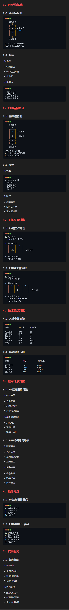

### 什么是TIA电路
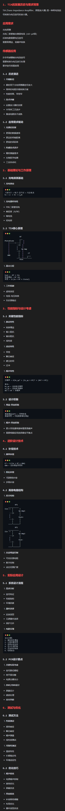

### 什么是光电二极管（简称PD）


### 什么是串口通信？

> [一文搞懂串口通信-CSDN](https://blog.csdn.net/qq_38232598/article/details/117031222)


### NAS中的RAID技术应用

在NAS（网络附加存储）中，**RAID**（Redundant Array of Independent Disks，独立磁盘冗余阵列）是一种数据存储技术，通过将多个硬盘组合在一起，以提高数据的可靠性和/或性能。RAID通过不同的配置（称为RAID级别）实现数据的冗余、容错或性能提升，常用于NAS设备中以保护数据或优化存储效率。

以下是NAS中常见的RAID级别及其特点的简要说明：

1. **RAID 0（条带化）**  
   - **特点**：将数据分成块，分布存储在多个磁盘上，以提高读写速度。  
   - **优点**：性能高，读写速度快。  
   - **缺点**：没有冗余，任何一个磁盘故障都会导致数据丢失。  
   - **适用场景**：需要高性能但对数据安全性要求不高的场景，如临时存储或缓存。

2. **RAID 1（镜像）**  
   - **特点**：数据同时写入两个或更多磁盘，创建完全相同的副本。  
   - **优点**：高可靠性，一个磁盘故障不会导致数据丢失。  
   - **缺点**：存储效率低，有效容量仅为单个磁盘容量。  
   - **适用场景**：对数据安全要求高的场景，如重要文件存储。

3. **RAID 5（分布式奇偶校验）**  
   - **特点**：数据和奇偶校验信息分布在多个磁盘上，至少需要3个磁盘。  
   - **优点**：在性能和冗余之间取得平衡，允许一个磁盘故障而不丢失数据。  
   - **缺点**：重建数据时较慢，写入性能略低于RAID 0。  
   - **适用场景**：适用于需要兼顾性能和冗余的NAS，如中小型企业存储。

4. **RAID 6（双奇偶校验）**  
   - **特点**：类似RAID 5，但使用双份奇偶校验，至少需要4个磁盘。  
   - **优点**：可容忍两个磁盘同时故障，数据安全性更高。  
   - **缺点**：写入性能稍低，成本较高。  
   - **适用场景**：对数据可靠性要求极高的场景，如关键业务数据存储。

5. **RAID 10（1+0，镜像+条带化）**  
   - **特点**：结合RAID 1和RAID 0，先镜像再条带化，至少需要4个磁盘。  
   - **优点**：兼具高性能和高可靠性，可容忍多个磁盘故障（取决于配置）。  
   - **缺点**：存储效率低，有效容量仅为总容量的一半。  
   - **适用场景**：需要高性能和高可靠性的场景，如专业NAS或高负载应用。

6. **JBOD（Just a Bunch of Disks）**  
   - **特点**：将多个磁盘组合成一个大逻辑磁盘，数据顺序存储，无冗余或性能提升。  
   - **优点**：充分利用所有磁盘容量。  
   - **缺点**：无冗余，磁盘故障可能导致数据丢失。  
   - **适用场景**：需要最大化存储空间但不关心冗余的场景。

**NAS中RAID的注意事项**
   - **选择RAID级别**：根据你的需求（性能、冗余、容量）选择合适的RAID级别。家用NAS常用RAID 1或RAID 5，企业级NAS可能选择RAID 6或RAID 10。
   - **磁盘数量**：不同RAID级别对磁盘数量有最低要求，规划NAS时需考虑。
   - **数据备份**：RAID不是备份！RAID提供冗余，但无法防止误删除、病毒或硬件完全故障，建议配合外部备份（如云存储或另一台NAS）。
   - **重建时间**：RAID 5/6在磁盘故障后重建时间较长，期间性能可能下降，且存在次生故障风险。
   - **硬件支持**：NAS设备的RAID功能可能是硬件RAID（由NAS控制器管理）或软件RAID（由操作系统管理），硬件RAID通常性能更好但成本更高。

**总结**
   RAID在NAS中是管理和优化存储的重要技术，常见级别包括RAID 0、1、5、6、10等，每种级别在性能、冗余和容量之间有不同取舍。选择时需根据实际需求（如数据安全性、性能、预算）权衡，并始终配合备份策略以确保数据安全。


### 扭力扳手的工作原理详细介绍

扭力扳手（Torque Wrench）是一种精密工具，用于施加特定扭矩（扭力）到螺栓、螺母或其他紧固件上，以确保紧固件达到制造商指定的张力，避免过紧导致损坏或过松导致松动。它广泛应用于汽车维修、机械装配、航空航天和建筑等领域。扭力扳手的基本原理基于力学定律（如胡克定律），通过内部机制测量和控制施加的旋转力（扭矩，通常以牛顿·米 N·m 或磅·英尺 lb·ft 为单位）。扭矩的计算公式为：扭矩 = 力 × 力臂长度。

扭力扳手有多种类型，每种类型的工作原理略有不同。下面我将按类型详细说明其工作原理，并结合常见结构进行描述。由于您提到希望配图，我会基于可靠来源（如维基百科）描述相关原理图。如果您需要我生成一个自定义的原理图（如简化的内部结构示意图），请确认一下，我可以进一步处理。否则，我将用文字描述现有图像来辅助说明。

#### 1. **梁式扭力扳手（Beam-Type Torque Wrench）**
   - **工作原理**：这是最基本的扭力扳手类型，由两条梁组成：一根杠杆梁（作为手柄，用于施加扭矩）和一根指示梁。杠杆梁的一端连接到扳手头，另一端是手柄。当用户施加力时，杠杆梁会根据胡克定律（Hooke's Law）成比例地弯曲（变形与施加力成正比）。指示梁固定在扳手头的一端，另一端自由悬挂，并保持直线状态。它平行于杠杆梁，当杠杆梁弯曲时，指示梁的自由端会相对于杠杆梁上的刻度移动，从而显示当前施加的扭矩值。用户通过观察刻度来停止施力。这种类型没有自动停止机制，需要用户手动监控。
   - **优点**：简单、耐用、准确性高（不易失准），适合校准其他工具。
   - **缺点**：不易在狭窄空间使用，且需要不断查看刻度。
   - **配图描述**：想象一个侧视图：扳手主体为一条长梁（杠杆梁），上方有一条较短的指示梁。梁上标有扭矩刻度（如0-200 N·m）。当施加扭矩时，杠杆梁向下弯曲，指示梁的指针指向相应刻度。根据维基百科的图像（例如一个梁式扭力扳手的侧视图），它显示扳手头连接套筒，指示梁保持直线，而主梁弯曲，刻度显示约18 N·m。 另一个详细视图显示扭矩显示刻度，指针指向160 in.lbf（约18 N·m）。

#### 2. **偏转梁式扭力扳手（Deflecting Beam Torque Wrench）**
   - **工作原理**：这种类型由澳大利亚Warren and Brown公司于1948年专利发明。它使用两条梁：一根承载梁（直接施加扭矩并偏转）和一根指示梁（保持形状不变）。承载梁从扳手头延伸到手柄，当扭矩施加时，它会偏转。指示梁与承载梁平行运行一段距离，然后以角度弯曲离开。用户通过滑动楔块在承载梁上的刻度设置预设扭矩。指示梁上有一个销钉，当达到预设扭矩时，承载梁的偏转导致销钉触发弹簧加载的机制，弹出销钉，产生响亮的“咔嗒”声，同时提供视觉和触觉反馈（可见指示梁移动）。销钉可通过按压复位。这种设计比线圈弹簧更耐用，提供更一致的读数。
   - **优点**：寿命长、安全裕度高、可同时听到声音和看到指示。
   - **缺点**：结构较复杂，成本较高。
   - **配图描述**：简化的原理图显示两条梁：承载梁直线偏转，指示梁弯曲并带有触发销钉。维基百科有一个简化图示，展示偏转梁的概念：承载梁弯曲，指示梁保持直线，销钉位置突出。 另一张图像显示两个Warren and Brown扭力扳手的外观，强调双梁结构。

#### 3. **滑动式扭力扳手（Slipper-Type Torque Wrench）**
   - **工作原理**：这种类型使用滚子和凸轮机制。凸轮连接到驱动头，滚子由可调节弹簧推动，锁定凸轮的位置。当施加的扭矩超过滚子和弹簧的保持力时，滚子滑动，扳手“滑动”脱离紧固件，防止进一步施加扭矩，从而避免过紧。预设扭矩通过调节弹簧力来设置。这种机制类似于离合器，确保在低扭矩应用中精确控制。
   - **优点**：自动防止过紧，耐用，适合低扭矩场景（如100 ft-lb以内）。
   - **缺点**：没有显示屏，无法实时监控当前扭矩，仅适用于特定应用。
   - **配图描述**：简化原理图显示凸轮和滚子：滚子压在凸轮上，当扭矩过大时滚子滑动。维基百科的图像展示滑动式头部的简化原理，凸轮呈圆形，滚子由弹簧推动。

#### 4. **点击式扭力扳手（Click-Type Torque Wrench）**
   - **工作原理**：这是最常见的类型，使用校准的离合器机制，通常包括球形止动器和弹簧。用户通过旋转手柄上的旋钮压缩弹簧，设置预设扭矩（弹簧力与扭矩成比例）。当施加扭矩时，力通过球形止动器传递，直到扭矩克服弹簧力，球“咔嗒”一声弹出其插槽，提供触觉和听觉反馈（扳手头部略微弯曲）。扳手不会滑动，但用户应在听到“咔嗒”后停止施力。这种类型常带有棘轮机制，便于在狭窄空间使用。
   - **优点**：易用、价格实惠、反馈直观，适合大多数汽车和机械应用。
   - **缺点**：可能过紧（如果用户忽略声音），需定期校准。
   - **配图描述**：图像显示点击式扭力扳手的外观，手柄上有旋钮用于调节，头部连接套筒。维基百科有一个图像，展示点击式扳手与套筒连接，通过转动手柄调节。 内部机制可想象为：弹簧压缩球形止动器，当扭矩达到时球弹出。

#### 5. **其他类型（如数字式和液压式）**
   - **数字式（Digital Torque Wrench）**：使用电子传感器测量扭矩，通过LCD屏幕显示值。原理类似于点击式，但传感器取代机械反馈，提供蜂鸣、振动或灯光警报。适合需要记录的应用。
   - **液压式（Hydraulic Torque Wrench）**：用于高扭矩场景（如工业螺栓）。液压泵提供压力，推动活塞移动棘轮，转动方形驱动轴或六角环。达到预设扭矩时，系统停止。原理基于液压压力转换为扭矩。
   - **配图描述**：液压式的图通常显示内部活塞和棘轮机制。数字式的图像显示屏幕和按钮。

#### 使用注意事项
- **校准**：扭力扳手需每年或每5000次使用后校准，以确保准确。
- **操作**：始终缓慢均匀施力，避免冲击。仅用于紧固，不用于松开。
- **维护**：存储时将扭矩设置为最低值，避免极端温度。

如果以上描述还不够直观，或者您想要一个自定义生成的原理图（如点击式扭力扳手的内部剖视图），请告诉我确认，我可以帮您生成一个。


### 固态电池

固态电池（Solid-State Battery，简称SSB）是一种新型电池技术，它使用固体电解质来取代传统锂离子电池中的液体或凝胶状电解质。这种设计从根本上改变了电池的内部结构，使其在能量密度、安全性和寿命等方面具有潜在优势。固态电池的概念早在20世纪中叶就被提出，但直到近年来，随着材料科学和纳米技术的进步，才开始进入实际研发和商业化阶段。下面，我将从定义、原理、优点、缺点、当前发展现状以及未来展望等方面进行详细介绍。

#### 1. 什么是固态电池？其工作原理
固态电池的核心在于其电解质为固体材料，通常包括硫化物、氧化物、聚合物或复合材料（如陶瓷或玻璃）。传统锂离子电池使用液体电解质（如有机溶剂），而固态电池的固体电解质可以是无机的（如锂磷氧氮化合物LiPON）或有机的（如聚合物基电解质）。

工作原理与锂离子电池类似：电池由正极（阴极，通常为锂金属氧化物）、负极（阳极，通常为锂金属或石墨）和电解质组成。在充电过程中，锂离子从正极脱离，通过电解质迁移到负极；在放电过程中，反向迁移产生电流。不同的是，固体电解质不流动，这避免了液体泄漏的风险，并允许使用纯锂金属作为负极，从而提升整体性能。

与传统锂离子电池相比，固态电池的能量密度更高（理论上可达500-700 Wh/kg，而传统锂离子电池约为250-300 Wh/kg），这意味着相同体积或重量的电池能储存更多电能。

#### 2. 固态电池的优点
固态电池被视为下一代电池技术的“圣杯”，特别是在电动汽车（EV）和可再生能源存储领域。其主要优点包括：

- **更高的能量密度**：固体电解质允许使用锂金属负极，避免了传统电池中石墨负极的容量限制。这可以使电池体积缩小30-50%，或在相同体积下提供更长的续航里程。例如，在电动汽车中，这可能将续航从当前的500km提升到800km以上。

- **更好的安全性**：液体电解质易燃且可能导致热失控（thermal runaway），而固体电解质不易燃烧或泄漏，显著降低了火灾和爆炸风险。这对电动汽车和便携设备至关重要。

- **更长的循环寿命**：固态电池的固体结构减少了电极材料的降解，循环次数可达数千次（传统锂离子电池通常为500-1000次）。这意味着电池使用寿命更长，减少更换频率。

- **更快充电速度**：一些研究显示，固态电池可支持6倍于传统电池的充电速度，因为固体电解质能更好地处理高电流密度，而不会产生过热。

- **更宽的工作温度范围**：固态电池可在-50°C到100°C的极端温度下工作，而传统电池在低温下性能下降明显。

- **环保性**：生产过程可能减少有害溶剂的使用，碳足迹更低。

这些优点使固态电池特别适合电动汽车、无人机、医疗设备和电网存储等应用。

#### 3. 固态电池的缺点与挑战
尽管前景广阔，固态电池仍面临技术瓶颈，导致其尚未大规模商用。主要缺点包括：

- **接口不稳定性**：固体电解质与电极之间的接触界面容易发生副反应，形成高阻抗层，影响离子传输效率。这可能导致电池性能衰减。

- **高制造成本**：固体电解质材料（如硫化锂）昂贵，且生产过程复杂，需要真空环境或高温处理。目前成本是传统电池的数倍。

- **锂枝晶形成**：在使用锂金属负极时，锂离子可能不均匀沉积，形成枝晶，导致短路和安全隐患。

- **较低的功率密度和耐久性**：当前原型在高功率输出时表现不佳，且在反复充放电中可能出现裂纹或机械失效。

- **材料兼容性问题**：固体电解质的离子导电率通常低于液体（尽管一些新型材料如硫化物已接近），这限制了实际应用。

这些挑战需要通过材料创新（如开发新型复合电解质）和工艺优化来解决。

#### 4. 当前发展现状
截至2025年8月，固态电池技术正处于从实验室向商业化的过渡阶段。多家公司和机构积极投入研发：

- **主要玩家**：丰田（Toyota）已投资数十亿美元，计划在2027-2028年推出搭载固态电池的电动汽车；三星（Samsung）和LG Energy Solution也在开发原型；美国公司QuantumScape和Solid Power与大众、福特等汽车巨头合作。

- **最新进展**：2024-2025年，一些原型电池已实现能量密度超过400 Wh/kg，并通过了安全测试。中国企业如比亚迪和宁德时代也在加速布局，预计2026年后进入市场。

- **应用领域**：目前主要用于小型设备（如可穿戴设备），但电动汽车是重点。2025年，一些混合固态电池（semi-solid-state）已开始小规模生产，作为过渡技术。

然而，大规模商用仍需克服成本和产量问题。全球市场预计到2030年将增长至数百亿美元。

#### 5. 未来展望
固态电池有望革新能源存储，推动电动汽车普及和可再生能源转型。如果挑战得到解决，它可能使电动汽车充电时间缩短至10-15分钟，续航超过1000km，并降低整体成本。但短期内，传统锂离子电池仍将主导市场。持续的投资和国际合作（如欧盟的电池2030+计划）将加速其发展。

总之，固态电池代表了电池技术的未来方向，但从概念到现实还需要时间。如果你对特定方面（如材料类型或某个公司的产品）感兴趣，可以提供更多细节，我可以进一步深入。


### AC和DC


` 在电子器件中`

**DC（Direct Current 直流）**

1. **特点**：
- 信号电平保持恒定不变
- 没有频率变化
- 电流/电压方向固定

2. **应用场景**：
- 器件偏置电压
- 供电电源
- 阈值电压设定

**AC（Alternating Current 交流**

1. **特点**：
- 信号随时间周期性变化
- 具有特定频率
- 电流/电压方向周期性改变

2. **应用场景**：
- 高速数据传输
- 射频信号
- 调制信号

`在光芯片中的DC` （Directional Coupler 方向耦合器）

1. **基本结构**：
- 两条平行的波导
- 通过精确控制波导间距和耦合长度
- 利用波导间的耦合效应实现光功率分配

2. **工作原理**：
- 基于光学近场耦合
- 光波在两个波导之间周期性能量交换
- 可以实现特定比例的功率分配

3. **主要参数**：
- 耦合长度
- 波导间距
- 功率分配比
- 插入损耗
- 方向性

4. **应用场景**：
- 功率分配器
- 光学分束器
- MZI（马赫-曾德尔干涉仪）的核心组件
- 波分复用器/解复用器

5. **设计考虑**：
- 波长依赖性
- 温度敏感性
- 制造工艺容差
- 偏振相关性

DC是硅光子集成电路中最基础和最重要的无源器件之一，对实现各种复杂功能至关重要。


### 英特尔第二代酷睿Ultra移动端处理器已知信息汇总

> 内容 ：[腾讯网](https://news.qq.com/rain/a/20241026A01T9P00) 以下是文章的主要内容：
> 
> - **发布时间**：英特尔第二代酷睿Ultra移动端处理器将于2025年第一季度发布。
> - **产品线布局**：包括高性能的Arrow Lake-HX、主流性能的Arrow Lake-H和低功耗的Arrow Lake-U。
> - **架构及工艺设计**：采用模块化设计和3D Foveros封装，使用多种台积电工艺节点。
> - **具体型号**：详细介绍了酷睿Ultra 200系列的HX和H型号，以及酷睿200系列的Raptor Lake Refresh-H/U型号。
> 
> 希望这些信息对你有帮助！如果你有其他问题，随时告诉我。


## 历史人物


### 王阳明

参考

[维基百科](https://zh.wikipedia.org/wiki/%E7%8E%8B%E9%99%BD%E6%98%8E)


**王阳明（1472年10月31日 - 1529年1月9日）**

名守仁，字伯安，号阳明子，谥文成，学者称之为阳明先生。浙江绍兴府余姚县（今宁波余姚市）人。他是中国明代著名的思想家、哲学家、文学家、军事家和教育家，心学的集大成者，其学术思想在中国、日本、朝鲜半岛乃至整个东亚地区都有着深远影响。

**一、 生平经历与思想形成**

王阳明的一生极富传奇色彩，其思想的形成也与其个人经历紧密相连。

* **早年立志与多方探索（1472年 - 1505年）**：
    * **家庭背景**：出身于官宦世家，父亲王华是成化十七年（1481年）状元，官至南京吏部尚书。这为他提供了良好的教育环境。
    * **“格竹”之败**：少年时代，王阳明深受程朱理学影响，为了实践朱熹“格物致知”的学说，曾与友人一起“格”院子里的竹子，希望能“格”出竹子的“理”。但连续“格”了七天七夜，一无所获，反而病倒。这件事让他对程朱理学“向外求理”的方法产生了怀疑，成为他日后转向“向内求理”的契机之一。
    * **广泛涉猎**：在科举道路之外，王阳明对辞章、骑射、兵法、道教、佛教等都有浓厚兴趣并下过功夫。他曾出游居庸关、山海关，练习骑射，学习兵法；也曾沉迷于道教的养生之术和佛教的禅定之学。这些经历虽然未能让他找到最终的安身立命之道，但开阔了他的视野，也为他日后思想体系的丰富性奠定了基础。
    * **初入仕途与忧患意识**：弘治十二年（1499年）考中进士，开始了他的仕宦生涯。期间他观察到朝政的弊端和民间的疾苦，逐渐形成了强烈的忧患意识和社会责任感。

* **龙场悟道与心学创立（1506年 - 1510年）**：
    * **仗义执言，触怒刘瑾**：正德元年（1506年），宦官刘瑾擅权，迫害忠良。王阳明上疏营救南京科道戴铣等人，触怒刘瑾，被杖四十，投入诏狱，随后被贬谪至贵州龙场驿（今贵州省修文县境内）任驿丞。
    * **“百死千难”的磨砺**：龙场是当时人迹罕至的蛮荒之地，生活条件极其艰苦，随从也多病倒。王阳明在这样的环境中，不仅要为生存奔波，还要面对死亡的威胁（刘瑾曾派人追杀他）。
    * **“吾性自足，不假外求”的顿悟**：在极度困厄之中，王阳明没有消沉，反而将此作为修行的场所。他为自己建了一个石椁，表示置生死于度外。终于在一个夜深人静的夜晚，他豁然大悟，“格物”的“物”并非外在的客观事物，而是自己内心的活动和意念；“理”也并非外在于心，而是人心本自具足的。这便是著名的“**龙场悟道**”。他认识到“**圣人之道，吾性自足，向之求理于事物者误也**”。这一顿悟标志着“心即理”思想的正式确立，也是王阳明心学体系的起点。

* **讲学传道与事功卓著（1510年 - 1529年）**：
    * **庐陵知县，初试心学**：刘瑾被诛后，王阳明得到平反，调任江西庐陵（今吉安市）知县。他运用心学理念治理地方，注重教化，取得良好成效。
    * **“知行合一”的提出**：在此期间，针对当时社会上普遍存在的知与行脱节的弊病，王阳明鲜明地提出了“**知行合一**”的观点。他认为知是行的主意，行是知的功夫；知是行之始，行是知之成。知与行是一个不可分割的统一体。
    * **平定叛乱，军事才能**：王阳明不仅是思想家，也是一位杰出的军事家。他一生中最重要的军事功绩包括：
        * **赣南剿匪**：正德十一年（1516年）起，王阳明被任命为都察院左佥都御史，巡抚赣南、汀州、漳州等地。他运用“破山中贼易，破心中贼难”的理念，采取军事打击与政治招抚、思想教化相结合的策略，成功平定了为患数十年的盗匪。
        * **平定宁王之乱**：正德十四年（1519年），宁王朱宸濠在江西起兵叛乱。王阳明在准备不足、兵力劣势的情况下，果断决策，运用计谋，仅用43天就迅速平定了叛乱，充分展现了他卓越的军事才能和“知行合一”的实践。
    * **“致良知”的成熟与传播**：在经历了种种事功和思想的深化后，王阳明晚年提出了“**致良知**”的学说。他认为“良知”是人心中固有的道德本能和是非判断能力，是天理在人心的体现。“致良知”就是去除私欲的遮蔽，将人本有的良知扩充和发扬光大。这是他心学思想的最高概括和最终归宿。他强调“良知”人人具有，不假外求，只要依良知而行，即可成圣。
    * **弟子众多，学派形成**：王阳明一生致力于讲学，无论是在龙场，还是在庐陵、赣州，乃至带兵打仗的间隙，他都与弟子们研讨学问。其弟子遍布大江南北，形成了强大的阳明学派，如钱德洪、王畿（龙溪）、王艮（心斋）、徐爱、邹守益、欧阳德等都是其重要门人。
    * **广西思田平乱与病逝**：嘉靖六年（1527年），王阳明再次被朝廷起用，前往广西平定思恩、田州土司的叛乱。他再次成功地完成了任务。但在返乡途中，于嘉靖七年十一月二十九日（1529年1月9日）病逝于江西南安府大庾县（今江西省大余县）青龙铺的船上。临终前，弟子问他有何遗言，他说：“**此心光明，亦复何言！**”这句遗言也成为他一生光明磊落、追求真理的最好写照。

**二、 核心哲学思想**

王阳明的心学体系博大精深，其核心观点可以概括为以下几个方面：

* **心即理**：
    * **内涵**：这是阳明心学的基石。它认为宇宙的根本法则、最高的道德准则（即“理”）并非存在于外在的客观事物或经典之中，而是内在于每一个人的心中。人心本身就具有判断是非善恶的本能和标准。
    * **与程朱理学的区别**：程朱理学主张“性即理”，认为“理”是客观存在的，需要通过“格物致知”（研究外在事物）来认识。王阳明则认为这种向外求索的方法容易使人迷失，真正的“理”就在自己心中，应该向内求索。
    * **意义**：强调了人的主体性和能动性，认为每个人都有成圣的潜质，只要能明辨并遵循自己内心的“理”，就能达到至善的境界。这极大地鼓舞了人们的道德自信。

* **知行合一**：
    * **内涵**：指认知与实践的统一，而不是简单的先后关系或并列关系。他认为，“知是行的主意，行是知的功夫；知是行之始，行是知之成。若会得时，只说一个知，已自有行在；只说一个行，已自有知在。”
    * **针对时弊**：这一观点是针对当时社会上普遍存在的“知而不行”或“知行脱节”的弊病而提出的。许多人空谈心性，却不去实践，或者认为先要完全“知”了才能“行”，导致理论与实际相分离。
    * **具体解释**：他以“好色”、“恶臭”为例，当你“知”道什么是好色时，你已经对它产生了喜好；当你“知”道什么是恶臭时，你已经对它产生了厌恶。这种“知”本身就包含了“行”的倾向。真正的认知必然会引导行动，而行动也是加深和检验认知的过程。
    * **实践意义**：强调了道德实践的重要性，认为只有通过实际行动，才能真正理解和体悟道德的真谛。

* **致良知**：
    * **内涵**：“良知”是王阳明晚年思想的核心概念，指的是人心中天赋的、固有的、能直接判断是非善恶的道德意识和能力。它是“天理之昭明灵觉处”，是人性的根本。所谓“致”，就是扩充、推致、发扬光大的意思。“致良知”就是要去除各种私心杂念的蒙蔽，使良知得以完全呈现和发挥作用，并按照良知的指引去行动。
    * **良知的普遍性**：王阳明认为“良知”是“千古圣贤相传的一点骨血”，人人皆有，不分圣愚，不假外求。这使得成圣的道路对每个人都是开放的。
    * **“事上磨练”**：他强调“致良知”需要在具体的日常事务和人际交往中进行磨练，即“事上磨练”。在应对各种具体情境时，省察自己的念头是否符合良知，并努力按照良知的要求去做。
    * **“万物一体之仁”**：通过“致良知”，可以达到“万物一体之仁”的境界，即体认到自己与天地万物在根本上是相通的、一体的，从而产生博大的仁爱之心。

* **四句教**：
    王阳明晚年在天泉桥上对其核心思想作了精炼的概括，即著名的“四句教”：
    * **无善无恶心之体**：心的本体是超越善恶对待的，是纯粹光明的，不落任何分别相。
    * **有善有恶意之动**：当意念发动时，才有了善恶的区别。意念符合良知即为善，背离良知即为恶。
    * **知善知恶是良知**：能够判断何为善、何为恶的能力，就是良知。
    * **为善去恶是格物**：依照良知的指引，努力行善，去除恶念，这就是“格物”的真正功夫。
    这四句教言简意赅地揭示了心、意、良知与格物的关系，是理解阳明心学的关键。

**三、 主要著作与文学成就**

* **《传习录》**：是王阳明最重要的哲学著作，由其弟子徐爱、钱德洪、王畿等人根据他的讲学语录和书信编辑而成。全书分为上、中、下三卷，集中体现了王阳明的心学思想，特别是“心即理”、“知行合一”、“致良知”等核心观点。语言生动活泼，说理深入浅出，是研究阳明心学的首选文献。
* **《王文成公全书》**（又称《阳明先生文集》）：收录了王阳明的奏疏、公文、书信、序跋、诗词、祭文等，是研究其生平事迹、政治思想、军事思想和文学成就的重要资料。
* **文学成就**：王阳明的诗文也具有较高成就。其诗歌清新自然，富有哲理；其散文则气势磅礴，论辩有力。他的文章体现了其思想的深度和人格的魅力。

**四、 历史地位与深远影响**

* **对儒学的发展**：王阳明的心学是继程朱理学之后，儒家思想发展的又一重要高峰。它强调个体的主体性、道德的自觉性和实践的重要性，对僵化保守的理学思潮起到了振聋发聩的作用，为儒学注入了新的活力。
* **思想解放**：阳明心学“人人皆可成圣”、“良知即是天理”等主张，打破了少数精英对思想的垄断，具有一定的思想解放意义，激发了个体的独立思考和道德自信。
* **社会影响**：阳明学派在明中后期迅速发展，影响遍及社会各个阶层。其门人众多，形成了不同的分支，如泰州学派等，甚至出现了较为激进的思想倾向，对当时的社会风气和价值观产生了一定冲击。
* **对后世及东亚的影响**：
    * **中国**：明末清初的许多思想家如黄宗羲、顾炎武、王夫之等都受到王阳明思想的深刻影响，尽管他们也对阳明学末流的空疏有所批判，但阳明心学的精神内核依然在后世思想中延续。晚清的维新派和革命派也从阳明学中汲取思想资源。
    * **日本**：阳明学在江户时代传入日本，对日本的武士道精神、明治维新都产生了重要影响。许多明治维新的领导人物如西乡隆盛、吉田松阴等都深受阳明学熏陶，强调行动和实践。
    * **朝鲜半岛**：阳明学在朝鲜王朝时期也得到传播和研究，对朝鲜的儒学发展产生了一定影响。
* **现代价值**：王阳明的心学思想，如强调内心的力量、知行合一的实践精神、致良知的道德自律等，在现代社会依然具有重要的启示意义，对于个人修养、企业管理、社会建设等方面都有借鉴价值。

**总结**

王阳明是一位集立德、立功、立言于一身的伟大历史人物。他的心学思想以其深刻的洞察力、强大的生命力和广泛的影响力，在中国乃至世界思想史上都占有重要地位。他所倡导的“心即理”、“知行合一”、“致良知”等观念，不仅是对传统儒学的创造性发展，也为后人提供了宝贵的精神财富。研究王阳明，不仅是了解中国思想史的需要，也是汲取智慧、提升自我的重要途径。


---

王阳明作为心学的集大成者，留下了许多充满智慧、发人深省的名言名句。这些话语不仅概括了他的核心思想，也为后人立身处世提供了宝贵的指引。以下是一些他广为流传的名言：

**一、 关于“心即理”与“致良知”：**

1.  **“心即理也，天下又有心外之事，心外之理乎？”**
    * **解说：** 这是王阳明心学的核心命题。他认为宇宙间的真理（理）就在人的心中，不必向外寻求。

2.  **“无善无恶心之体，有善有恶意之动，知善知恶是良知，为善去恶是格物。”**
    * **解说：** 这是著名的“四句教”，概括了他关于心的本体、意念的善恶、良知的作用以及如何进行道德修养（格物）的看法。

3.  **“良知是天理之昭明灵觉处，故良知即是天理。”**
    * **解说：** 强调良知就是天理的体现，人通过发现和遵循内心的良知，就能体悟天理。

4.  **“夫万事万物之理不外于吾心。”**
    * **解说：** 再次强调“心外无理”，所有事物的道理都包含在人的内心之中。

5.  **“尔未看此花时，此花与汝心同归于寂。尔来看此花时，则此花颜色一时明白起来。便知此花不在尔的心外。”**
    * **解说：** 用看花的例子来说明心与物的关系，强调心赋予事物意义和存在。

6.  **“致良知是学问大头脑，是圣人教人第一义。”**
    * **解说：** 将“致良知”视为做学问的根本和圣人教化的首要原则。

7.  **“此心光明，亦复何言？”**
    * **解说：** 这是王阳明临终前的遗言，表达了他一生追求内心光明磊落，达到通透境界的自信与坦然。

**二、 关于“知行合一”：**

8.  **“知是行的主意，行是知的工夫；知是行之始，行是知之成。”**
    * **解说：** 精辟地阐述了知与行的辩证关系，认知是行动的指导思想，行动是认知得以实现的途径；认知是行动的开端，行动是认知完成的标志。

9.  **“未有知而不行者。知而不行，只是未知。”**
    * **解说：** 强调真正的认知必然伴随着行动。如果知道了道理却不去实行，那说明还没有真正理解和掌握这个道理。

10. **“一念发动处，便即是行了。”**
    * **解说：** 认为当一个念头产生时，行动的倾向就已经存在了，强调了起心动念的重要性。

**三、 关于个人修养与学习：**

11. **“破山中贼易，破心中贼难。”**
    * **解说：** 形容克服外界的困难相对容易，而战胜自己内心的私欲、偏见等“心贼”则更加困难，强调了修心的重要性。

12. **“人须在事上磨，方能立得住，方能静亦定，动亦定。”**
    * **解说：** 强调人必须在具体的事务中磨练自己，才能站稳脚跟，无论在静态还是动态中都能保持内心的安定。

13. **“谦者众善之基，傲者众恶之魁。”**
    * **解说：** 点明了谦虚是所有善行的基础，而骄傲是所有罪恶的根源。

14. **“志不立，天下无可成之事。”**
    * **解说：** 强调立志的重要性，如果志向不能确立，那么天下任何事情都难以成功。

15. **“今人有过，不喜人规，如护疾而忌医，此甚非也。”**
    * **解说：** 批评那些有了过错却不喜欢别人规劝的人，如同生了病却回避医生一样，是非常错误的。

16. **“所以为圣者，在纯乎天理，而不在才力也。”**
    * **解说：** 成为圣贤的关键在于纯粹地遵循天理（良知），而不是仅仅依靠才能和能力。

17. **“日间工夫，觉纷扰则静坐，觉懒看书则且看书，是亦因病而药。”**
    * **解说：** 提供了日常修养的具体方法，当感觉内心纷扰时就静坐，当感觉懒得看书时就偏要去看书，这就像根据病情来用药一样。

**四、 其他富有哲理的名句：**

18. **“天地生意，花草一般。何曾有善恶之分？”**
    * **解说：** 从自然现象出发，探讨善恶的相对性，认为从宇宙的生生不息来看，事物本无绝对的善恶。

19. **“夫学贵得之心，求之于心而非也，虽其言之出于孔子，不敢以为是也。”**
    * **解说：** 强调学习贵在内心的领悟和认同，如果内心觉得不正确，即使是孔子的话，也不敢盲目认为是正确的，体现了独立思考的精神。

这些名言只是王阳明思想宝库中的一部分，但足以展现其心学的核心要义和深刻智慧。细细品味这些话语，对于我们理解他的哲学思想以及进行个人修行都有很大的帮助。


### 张居正


参考：

[维基百科](https://zh.wikipedia.org/wiki/%E5%BC%B5%E5%B1%85%E6%AD%A3)


---

张居正（1525年－1582年），字叔大，号太岳，湖广江陵（今湖北荆州）人。他是明代杰出的政治家和改革家，在明神宗万历初期担任首辅长达十年之久，对当时的明朝政治、经济和军事等各方面都产生了深远的影响。

**早年经历与入仕**

张居正出身平民，自幼聪颖好学。嘉靖二十六年（1547年）考中进士，踏入仕途。他历任翰林院编修、侍讲学士、礼部右侍郎等职。在担任裕王（后来的明穆宗）的老师期间，他尽心辅导，深受裕王赏识，为他日后的政治生涯奠定了基础。

**主要成就与改革（万历新政）**

明穆宗去世后，年仅十岁的明神宗朱翊钧即位，张居正得到神宗生母李太后和司礼监太监冯保的支持，出任内阁首辅。他以“尊主权，课吏职，信赏罚，一号令”为目标，推行了一系列大刀阔斧的改革，史称“万历新政”。其主要措施包括：

* **整顿吏治，推行“考成法”：** 这是张居正改革的核心内容之一。考成法旨在加强对各级官吏的考核，明确职责，限期完成政务。通过严格的考绩，提高了行政效率，淘汰了一批庸官冗员，使朝政焕然一新。
* **清丈土地，推行“一条鞭法”：** 为解决国家财政困难，张居正在全国范围内重新丈量土地，清查地主隐瞒的田产，在此基础上全面推行“一条鞭法”。这一改革统一了赋役征收，将各种赋税和徭役合并征收银两，简化了税制，增加了国家财政收入，也在一定程度上减轻了农民的负担。
* **加强军事，巩固边防：** 张居正重用名将戚继光、李成梁等人，整顿边防，加强军事训练，使得明朝北部边境在一段时期内相对安宁。他还下令整顿驿传制度，节省了国家开支。
* **兴修水利，治理黄河：** 他任用潘季驯治理黄河，取得了显著成效，保障了漕运畅通和农业生产。
* **整肃教育，延揽人才：** 张居正重视人才的培养和选拔，对当时的教育制度也进行了一定的改革。

**历史评价**

张居正的改革在当时取得了显著成效，有效地缓解了明朝中后期的社会矛盾，增强了国力，使得万历初年呈现出一度中兴的景象。史家普遍肯定他“通识时变，勇于任事”，“起衰振隳”的功绩。梁启超更称其为“明代唯一的大政治家”。

然而，张居正的改革也存在一些局限性。他的改革主要是在不触动封建专制制度根本的前提下进行的修补，具有浓厚的集权色彩。他行事果决，但也因此招致了不少政敌的嫉恨。在他去世后不久，明神宗亲政，在反对派的鼓动下，张居正遭到清算，家产被抄，谥号被剥夺，其改革措施也大多被废止。

尽管如此，张居正的历史功绩不容抹杀。他以其非凡的政治魄力和智慧，在明朝历史上留下了浓墨重彩的一笔。他的改革实践和思想，至今仍对后人有所启示。

总而言之，张居正是中国历史上的一位重要人物，他以卓越的才能和坚定的决心推行改革，力图挽救日趋衰落的明王朝。虽然其改革最终未能从根本上扭转明朝的命运，但他对国家和民族所作出的贡献值得肯定和研究。


----

名言名句

* **“天下之事，不难于立法，而难于法之必行。”**
    * 这句话强调了法律法规的执行力远比制定更为重要和困难。体现了他注重实践、力求实效的政治风格。

* **“君子处其实，不处其华；治其内，不治其外。”**
    * 此句大意是说，有德行的人应注重实际，不追求表面的浮华；致力于内在的修养，而不是外在的表象。这反映了他务实和注重根本的品格。

* **“综核名实，信赏必罚。”**
    * 这是他推行改革时的重要指导思想，意在考察言论与实际是否相符，做到有功必赏，有罪必罚，以整顿吏治，提高行政效率。

* **“得庸相百，不若得救时相一也。”**
    * 这句话（后人评价他时常用，也反映了他的重要性）意为得到一百个平庸的宰相，不如得到一个能够挽救时局的宰相。这突显了在关键时刻杰出人才对于国家的重要性。

* **“使吾为刽子手，吾亦不离法场而证菩提。”**
    * 这句话表达了他无论身处何种境地，都会坚守自己的职责和信念，有所作为的决心。

* **“古之为国者，使商通有无，农力本穑，商不得通有无以利农，则农病；农不得力本穑以资商，则商病。故商农之势，常若权衡。”**
    * 这段话体现了他对农商关系的深刻认识，强调农商并重、互为补充的重要性，具有朴素的经济学思想。

张居正的这些名言，不仅反映了他的个人品格和政治抱负，也凝聚了他在复杂政治环境中的经验与智慧，至今仍能给人们带来启发。如果您想更深入地了解他的思想，可以阅读《张居正集》或相关的历史研究著作。


### 申时行
申时行（1535年－1614年），字汝默，号瑶泉，晚号休休居士，南直隶苏州府长洲县（今江苏苏州）人，是明代中后期重要的政治家、内阁首辅，也是万历年间最具影响力的文官之一。他一生历仕嘉靖、隆庆、万历三朝，官至内阁首辅，以温和稳健、善于调和著称，在晚明政坛上扮演了承前启后的关键角色。

---

 一、生平事迹

  1. 早年经历与科举入仕
申时行出生于书香门第，自幼聪慧，勤奋好学。嘉靖四十一年（1562年），他在殿试中高中状元，授翰林院修撰，正式步入仕途。这一科进士中人才济济，而申时行以状元身份脱颖而出，显示出其才学出众。

  2. 隆庆年间：稳步升迁
在隆庆帝（明穆宗）时期，申时行逐渐崭露头角。他历任翰林院侍读、右春坊右中允等职，参与编修《世宗实录》，表现出良好的史才与政治素养。隆庆六年（1572年），张居正任首辅，申时行被提拔为礼部右侍郎兼翰林院学士，进入权力核心圈。

  3. 万历初年：依附张居正
万历初年，张居正推行改革，申时行虽非改革派核心人物，但态度谨慎，支持张居正的施政，因而得到重用。万历五年（1577年），张居正丁忧，引发“夺情”之争，申时行支持张居正留任，被视为张的盟友之一。

张居正死后（1582年），朝局剧变，张居正被清算，许多曾依附他的人遭到贬斥。但申时行因处事圆融、不树敌，未被牵连过深，反而因“识大体”“不结党”受到万历帝信任。

  4. 入阁与任首辅（1583–1591）
- 万历十一年（1583年），申时行入阁，成为内阁大学士。
- 万历十三年（1585年），接替余有丁任内阁首辅，成为实际上的政府首脑。

在首辅任上，申时行秉持“调和鼎鼐”的施政理念，主张稳定政局、缓和矛盾。他试图在皇帝、宦官、言官和文官集团之间维持平衡，避免激烈冲突。

  5. 国本之争与辞官
申时行任首辅期间，最棘手的政治问题是“国本之争”——即关于立太子的争议。万历帝宠爱郑贵妃，欲立其子朱常洵为太子，而群臣坚持立长子朱常洛（后来的明光宗）为储君。

申时行起初试图以温和方式劝说皇帝早立太子，但万历帝态度强硬。万历二十年（1592年），申时行暗中授意言官上疏请立太子，但奏疏内容泄露，万历帝大怒，认为申时行“欺君误国”，申时行被迫上疏辞职。

最终，他于万历十九年（1591年）致仕归乡，结束政治生涯。

  6. 晚年生活
归隐苏州后，申时行闭门著述，自号“休休居士”，过着闲适的文人生活。他著有《赐闲堂集》《召对录》《纶扉奏草》等，记录其政治经历与思想。万历四十二年（1614年），申时行去世，享年79岁，追赠太师，谥号“文定”。

---

 二、政治思想与施政风格

1. **调和持重，稳健务实**  
   申时行的政治风格以“和衷共济”为核心。他不主张激进改革，也不轻易挑战皇权，而是注重维持朝廷稳定。在张居正死后政局动荡的背景下，他的“稳中求治”策略有助于缓解党争与政治清洗。

2. **注重调和君臣关系**  
   他认为“君臣一体”，主张以柔克刚，通过劝谏而非对抗的方式影响皇帝。他对万历帝多以温和进言，避免正面冲突，体现了典型的“士大夫劝谏艺术”。

3. **反对激烈党争**  
   申时行虽身处权力中心，却力图避免结党营私。他曾说：“吾但欲安国家，不欲树私恩。”他对后来东林党等政治派系的兴起持保留态度，担心党争会动摇国本。

4. **在国本之争中的困境**  
   尽管申时行试图以折中方式解决立储问题，但最终失败。他既不愿违逆群臣公议，又不敢强硬对抗皇帝，陷入两难。这一事件暴露了晚明文官集团与皇权之间的深刻矛盾，也反映出申时行“调和”策略的局限性。

---

 三、历史评价

  1. 正面评价
- **《明史》评价**：“时行以文字受知主上，始终一节，有古大臣风。”  
  肯定了他忠诚、稳健的品格。
- 清代学者赵翼称：“申时行相业，以安静为宗，虽无赫赫之功，然维持国体，调和上下，亦不易得。”
- 现代史学家黄仁宇在《万历十五年》中评价申时行为“调和者”，认为他在制度僵化、皇权与文官系统对立的背景下，试图以“技术性妥协”维持帝国运转，虽未能根本解决问题，但体现了现实政治智慧。

  2. 负面批评
- 一些批评者认为他“柔懦无为”“明哲保身”，在重大问题上缺乏担当。尤其是在国本之争中，他未能坚持原则，最终退缩辞职，被视为“失职”。
- 东林党人后来指责他“阿谀上意”“苟且因循”，未能匡正君失。

  3. 综合评价
申时行是一位典型的“守成型”政治家。他生活在张居正改革后的“后张居正时代”，面对的是一个制度僵化、财政困难、党争初起的明朝。他没有能力也无意进行根本性改革，而是以“维稳”为第一要务。

他的施政风格反映了晚明官僚体系的典型特征：重视程序、强调调和、回避冲突。这种风格在短期内有助于维持秩序，但长期来看，未能解决根本矛盾，为后来的党争与衰败埋下伏笔。

---

 四、主要著作
- 《赐闲堂集》：诗文集，反映其晚年思想与生活。
- 《召对录》：记录其与万历帝的君臣对话，极具史料价值。
- 《纶扉奏草》：奏章汇编，展现其政治主张与施政理念。

---

 五、总结

申时行是明代中后期一位极具代表性的文官首辅。他以状元之才入仕，历经三朝，官至首辅，最终全身而退。他不是改革家，也不是权臣，而是一位“调和者”与“稳定器”。在万历皇帝逐渐怠政、文官集团日益分裂的背景下，他试图以温和、务实的方式维系朝廷运转。

尽管他未能扭转明朝走向衰落的趋势，但其政治智慧、人格修养与处世哲学，仍为后人所称道。他是传统儒家“中庸之道”在政治实践中的体现，也是晚明官僚政治的一个缩影。

> **历史定位**：申时行或许不是最杰出的宰相，但他是在一个动荡时代中，努力维持秩序与体面的“最后一位温和的首辅”。


## 地理知识


### 中国高铁网络

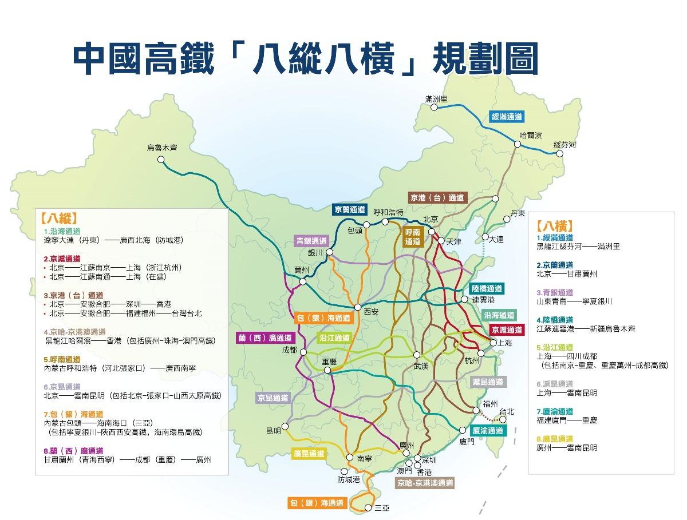

参考：

[人民网 - 复兴号来了](http://cpc.people.com.cn/n1/2017/0626/c412690-29361573.html)

[百度百科-八纵八横](https://baike.baidu.com/item/%E4%B8%AD%E5%9B%BD%E2%80%9C%E5%85%AB%E7%BA%B5%E5%85%AB%E6%A8%AA%E2%80%9D%E9%AB%98%E9%80%9F%E9%93%81%E8%B7%AF%E7%BD%91/23742590)

---

中国高铁是当今世界规模最大、技术最先进、运营经验最丰富的高速铁路网络。自21世纪初起步以来，中国高铁以惊人的速度发展，深刻改变了中国的经济地理格局、社会交往方式和民众的出行体验，成为中国现代化建设的亮丽名片。

**一、发展历程与辉煌成就**

* **早期探索与技术引进（20世纪90年代末 - 2007年）：** 中国高铁的探索起步于既有线的提速改造。通过引进、消化、吸收国际先进技术（如日本、德国、法国等），为后续的自主研发奠定了基础。标志性的事件包括秦沈客运专线的建设，以及“和谐号”CRH系列动车组的初步研制。
* **快速建设与跨越式发展（2008年 - 2016年）：** 2008年北京奥运会前夕，中国第一条具有完全自主知识产权、设计时速350公里的高速铁路——**京津城际铁路**通车运营，标志着中国高铁发展进入新纪元。此后，一系列重要干线如**武广高铁**、**郑西高铁**、**京沪高铁**等相继建成通车，中国高铁网络迅速铺开。
* **全面自主创新与智能升级（2017年至今）：** 以具有完全自主知识产权的“复兴号”系列动车组投入运营为标志，中国高铁在技术标准、运营速度、智能化水平等方面达到世界领先。“复兴号”在京沪高铁等线路实现了时速350公里的商业运营。同时，中国高铁在复杂地质条件（如高原、高寒）下的建设和运营技术也取得了重大突破。

**二、网络规模与“八纵八横”主骨架**

截至2023年末，中国高铁运营里程已超过4.5万公里，稳居世界第一，并已覆盖绝大多数百万人口以上的城市。中国高铁网络的规划核心是**“八纵八横”高速铁路主通道**，这是国家中长期铁路网规划的蓝图，旨在构建覆盖广泛、互联互通的高效铁路网络。

**“八纵”高速铁路主通道：**

1.  **沿海通道：** 北起大连（丹东），南至防城港（北部湾）。连接中国东部沿海主要城市群，如辽中南、京津冀、山东半岛、长三角、海峡西岸、珠三角、北部湾等。主要途经城市包括大连、秦皇岛、天津、青岛、上海、杭州、宁波、福州、厦门、深圳、湛江等。
2.  **京沪通道：** 北起北京，南至上海。连接京津冀和长三角两大核心经济区。这是中国最繁忙、效益最好的高铁线路之一。
3.  **京港（台）通道：** 北起北京，南至香港（九龙），并规划连接至台湾（台北）。主线途经雄安、合肥、南昌、赣州、深圳等。这条通道对促进大陆与港澳台地区的交流具有重要意义。
4.  **京哈-京港澳通道：** 北起哈尔滨，经济南连接至北京，再南下经石家庄、郑州、武汉、长沙、广州，最终抵达香港和澳门。这是贯穿中国东北、华北、华中、华南的核心大动脉。
5.  **呼南通道：** 北起内蒙古呼和浩特，南至广西南宁。途经大同、太原、郑州、襄阳、常德、益阳、邵阳、桂林等城市，连接华北、中原、华中、华南地区。
6.  **京昆通道：** 北起北京，西南至云南昆明。途经石家庄、太原、西安、成都（或重庆）等城市，是连接华北与西南地区的重要通道。
7.  **包（银）海通道：** 北起内蒙古包头（或宁夏银川），南至海南海口。途经延安、西安、重庆、贵阳、南宁、湛江等城市，连接西北、西南、华南地区。
8.  **兰（西）广通道：** 北起甘肃兰州（或青海西宁），南至广东广州。途经成都（或重庆）、贵阳等城市，是连接西北、西南与珠三角地区的重要通道。

**“八横”高速铁路主通道：**

1.  **绥满通道：** 东起黑龙江绥芬河，西至内蒙古满洲里。连接黑龙江东部和内蒙古东北部的主要口岸城市。
2.  **京兰通道：** 东起北京，西至甘肃兰州。途经呼和浩特、银川等城市，是连接华北与西北地区的重要通道。
3.  **青银通道：** 东起山东青岛，西至宁夏银川。途经济南、石家庄、太原等城市，连接华东、华北与西北地区。
4.  **陆桥通道（新亚欧大陆桥）：** 东起江苏连云港，西至新疆阿拉山口（或霍尔果斯）。途经徐州、郑州、西安、兰州、乌鲁木齐等城市，是中国连接中亚、欧洲的重要运输走廊的一部分。
5.  **沿江通道：** 东起上海，西至四川成都。沿长江经济带布局，途经南京、合肥、武汉、重庆等核心城市，对促进长江经济带发展具有战略意义。
6.  **沪昆通道：** 东起上海，西至云南昆明。途经杭州、南昌、长沙、贵阳等城市，横贯中国东、中、西部，是东西向客运大动脉。
7.  **厦渝通道：** 东起福建厦门，西至重庆。途经长沙、常德、黔江等城市，连接海峡西岸、中西部地区。
8.  **广昆通道：** 东起广东广州，西至云南昆明。途经南宁等城市，是连接珠三角与西南地区的重要通道。

**三、著名高铁线路举例（除上述骨干通道的组成部分外）**

* **京津城际铁路：** 中国首条设计时速350公里的高速铁路，连接北京和天津，开启了中国高铁时代。
* **沪宁城际铁路、沪杭高速铁路：** 长三角区域内重要的高铁线路，极大促进了区域一体化发展。
* **哈大高速铁路：** 世界上第一条在高寒地区运营的高速铁路，连接哈尔滨、长春、沈阳和大连，攻克了低温环境下高铁运营的技术难题。
* **兰新高速铁路（兰州至乌鲁木齐段）：** 世界上一次性建成通车里程最长的高速铁路，穿越戈壁、沙漠等复杂地形。
* **广深港高速铁路：** 连接广州、深圳和香港，实现了内地高铁网络与香港的便捷连接。
* **成渝客运专线（成渝中线高铁）：** 大幅缩短成都与重庆之间的时空距离，助力成渝地区双城经济圈建设。

**四、技术特点与创新**

* **“和谐号”与“复兴号”动车组：** 从引进吸收到自主创新，中国研发了具有世界先进水平的“和谐号”和“复兴号”系列动车组。“复兴号”在智能化、舒适性、节能环保、运营速度等方面均达到国际领先。
* **无砟轨道技术：** 广泛应用于中国高铁线路，确保了线路的平顺性和稳定性，为高速运行提供了保障。
* **先进的列车运行控制系统（CTCS）：** 中国自主研发的CTCS-3级列控系统，能够满足时速350公里及以上的高速安全运营需求。
* **复杂环境建设运营能力：** 成功攻克了高原缺氧、冻土、大风、强沙尘、湿陷性黄土等复杂地质和气候条件下的高铁建设与运营难题。

**五、深远影响与未来展望**

* **经济引擎：** 高铁极大地促进了人流、物流、信息流的快速流动，优化了资源配置，带动了沿线地区经济发展和产业升级，催生了“高铁经济带”。
* **社会变革：** “同城效应”日益显现，改变了人们的出行观念和生活半径，促进了区域协调发展和城镇化进程。
* **国家名片：** 中国高铁以其先进的技术、庞大的规模和高效的运营，成为中国走向世界的一张亮丽名片，并积极推动高铁技术和标准“走出去”。

未来，中国高铁将继续向着更广覆盖、更高质量、更智能化的方向发展。根据规划，到2035年，中国将基本建成现代化高速铁路网，主要城市间的旅行时间将进一步缩短，高铁将更好地服务于国家经济社会发展和人民群众的美好出行需求。


### 淮河

[参考](https://baike.baidu.com/item/%E6%B7%AE%E6%B2%B3/230880)

淮河（Huaihe River） ，古称淮水，与长江、黄河、济水并称“四渎”，当代已被列为我国七大江河之一，是中国南北地理分界线“秦岭-淮河线”的重要组成部分。淮河发源于河南省南阳市桐柏县桐柏山太白顶西北侧河谷，干流流经河南、安徽、江苏三省，于江苏省扬州市三江营入江，流域地跨湖北、河南、安徽、江苏、山东五省。以废黄河为界，分成淮河和沂沭泗河两大水系。淮河干流全长约为1000千米，流域面积约为27万平方千米，其中沂沭泗流域面积约为8万平方千米。
淮河发源于河南省南阳市桐柏山区，由西向东，流经湖北、河南、安徽、江苏四省， [13]干流在江苏扬州三江营入长江，全长约1000公里。淮河下游主要有入江水道、入海水道、苏北灌溉总渠和分淮入沂四条出路。沂沭泗河水系位于淮河东北部，由沂河、沭河、泗河组成，均发源于沂蒙山区，主要流经山东、江苏两省，经新沭河、新沂河东流入海。


*淮河的地理与文化意义*

地理分界：淮河与秦岭共同构成中国南北地理、气候和文化的分界线。北方以黄土高原和干旱气候为主，南方则多为湿润的亚热带气候，农业和生活方式也有显著差异。
经济作用：淮河流域自古是农业重地，灌溉发达，盛产水稻、小麦等作物。流域内的城市如淮安、宿迁等，因河运而兴盛。
治水历史：由于淮河下游地势平坦，河道淤积严重，历史上洪水泛滥频繁，治理淮河成为历代王朝的重大工程。现代中国也投入大量资源修建水利设施，如南水北调工程的部分设施与淮河相关。

*现代淮河*

现代淮河的治理是中国水利工程的重要课题。20世纪以来，中国政府修建了大量水库、堤坝和引水工程，如洪泽湖、淮河入海水道等，以控制洪水、改善航运和灌溉。尽管如此，淮河仍时有洪涝灾害，治理工作仍在持续。


*南北分界*

中国的地理学家把长江与黄河之间的秦岭、淮河看作是中国东部地区的一条南北方分界线。这条分界在甘肃、陕西、河南境内，基本上沿秦岭、伏牛山呈东西走向，到方城县折向东南、经板桥往东进入安徽，然后大致沿淮河干流，至江苏的苏北灌溉总渠延伸入海，全长约1700公里。这条线的南北两侧无论在气候、水文、土壤、植被以及农业生产、人民习俗等方面都有明显的差异。从气候方面来看，它是我国亚热带和暖温带的分界线（零度等温线）。其南侧属亚热带范围，最冷月平均气温不低于0℃，且雨季较长，年平均降水量为750～1300毫米，以北属暖温带范围，冬冷夏热，四季分明，日平均气温低于0℃的寒冷期，普遍在30天以上，雨季较短，年降水量一般不超过800毫米。按气候学角度看，中国南北方的分界线也并非一成不变的。气候专家预测，原因是由于由于全球性气候变暖。


## 选购指南

### 红酒


#### 一、选购红酒时应关注的7大核心要素

##### 1. 葡萄品种（Grape Variety）
不同葡萄品种带来不同的风味特征：

- **赤霞珠（Cabernet Sauvignon）**：结构强劲，单宁重，黑醋栗、雪松、烟草味，适合陈年。
- **梅洛（Merlot）**：口感柔顺，果味浓郁（李子、黑樱桃），适合新手。
- **黑皮诺（Pinot Noir）**：优雅细腻，酸度高，红果、泥土、花香，难种但迷人。
- **西拉/设拉子（Syrah/Shiraz）**：浓郁饱满，黑莓、胡椒、烟熏味，澳洲设拉子尤其奔放。
- **歌海娜（Grenache）**：酒精度高，红色水果香，常与其他品种混酿。
- **仙粉黛（Zinfandel）**：美国特色，果酱味浓，酒精高，风格多样。
- **内比奥罗（Nebbiolo）**：意大利贵族，高酸高单宁，玫瑰、焦油、皮革味，陈年潜力强。

👉 建议：新手可从梅洛、黑皮诺入门；喜欢重口味选赤霞珠、西拉。

---

##### 2. 产区（Region）
产区决定风土（Terroir），影响风味：

- **法国**：
  - 波尔多（Bordeaux）：以赤霞珠+梅洛混酿为主，结构宏大。
  - 勃艮第（Burgundy）：黑皮诺/霞多丽圣地，优雅复杂。
  - 罗讷河谷（Rhône Valley）：西拉/歌海娜主导，热情奔放。
- **意大利**：
  - 皮埃蒙特（Piedmont）：内比奥罗（巴罗洛、巴巴莱斯科）。
  - 托斯卡纳（Tuscany）：桑娇维塞（基安蒂、布鲁内罗）。
- **西班牙**：
  - 里奥哈（Rioja）：丹魄为主，橡木桶陈酿风格明显。
  - 杜埃罗河岸（Ribera del Duero）：更浓郁的丹魄。
- **美国**：
  - 纳帕谷（Napa Valley）：赤霞珠世界顶级产区。
  - 索诺玛（Sonoma）、俄勒冈（黑皮诺）。
- **澳大利亚**：
  - 巴罗萨谷（Barossa Valley）：设拉子之王。
  - 库纳瓦拉（Coonawarra）：赤霞珠优质产区。
- **智利**：
  - 迈坡谷（Maipo Valley）：赤霞珠经典。
  - 科尔查瓜谷（Colchagua Valley）：饱满型红葡萄酒。
- **阿根廷**：
  - 门多萨（Mendoza）：马尔贝克（Malbec）之都，果味爆炸。

👉 建议：想体验经典选法国/意大利；追求性价比选智利/阿根廷；喜欢果味选澳洲/美国。

---

##### 3. 年份（Vintage）
年份指葡萄采摘的年份，影响品质：

- 气候好的年份 → 葡萄成熟度高 → 酒质更佳。
- 波尔多、勃艮第等传统产区对年份敏感；新世界（如澳洲、智利）年份差异较小。
- 可查“年份评分表”（如Robert Parker, Wine Spectator）辅助判断。

⚠️ 注意：不是越老越好！大部分红酒适饮期在3–8年，只有顶级酒适合长期陈年。

---

##### 4. 酒精度（ABV）
- 通常在12%–15%之间。
- 酒精度高（>14%）：酒体饱满、果味浓，可能来自炎热产区（如澳洲、加州）。
- 酒精度低（<13%）：酒体轻盈、酸度高，如勃艮第黑皮诺、意大利北部酒款。

---

##### 5. 橡木桶使用（Oak Aging）
- 橡木桶赋予香草、烟熏、烘烤、咖啡等风味。
- “过桶”时间越长，风味越重。
- 不喜欢橡木味？可选标注“Unoaked”或新世界清新风格酒款。

---

##### 6. 甜度与单宁
- **甜度**：干型（Dry）最常见，半干、甜型较少（如波特酒）。
- **单宁**：来自葡萄皮/籽，带来涩感。高单宁=结构感强，适合配红肉；低单宁=顺滑易饮。

👉 新手建议从“中低单宁+果味主导”酒款开始，如梅洛、马尔贝克。

---

##### 7. 价格与性价比
- **100元以下**：入门级，智利、南非、国产张裕/长城部分产品。
- **100–300元**：性价比较高，可买到不错的澳洲、智利、西班牙酒。
- **300–800元**：精品酒款，波尔多中级庄、纳帕精品、里奥哈珍藏级。
- **800元以上**：名庄酒、勃艮第一级园、巴罗洛等收藏级。

⚠️ 警惕“假名庄”或山寨酒，认准正规渠道购买。

---

#### 二、世界知名红酒品牌/酒庄推荐（按国家分类）

##### 🇫🇷 法国

- **拉菲古堡（Château Lafite Rothschild）** – 波尔多一级庄，优雅细腻。
- **拉图酒庄（Château Latour）** – 强劲有力，陈年潜力强。
- **玛歌酒庄（Château Margaux）** – 香气复杂，女性化风格。
- **木桐酒庄（Château Mouton Rothschild）** – 艺术酒标，风格华丽。
- **罗曼尼·康帝（Domaine de la Romanée-Conti, DRC）** – 勃艮第之王，天价稀有。
- **勒桦酒庄（Domaine Leroy）** – 生物动力法先锋，勃艮第顶级。
- **吉佳乐世家（E. Guigal）** – 罗讷河谷教皇新堡、拉慕斯（La Mouline）等“三剑客”。

##### 🇮🇹 意大利

- **嘉雅（Gaja）** – 皮埃蒙特传奇，革新派代表。
- **安东尼世家（Antinori）** – 托斯卡纳贵族，天娜（Tignanello）、索拉雅（Solaia）。
- **西施佳雅（Sassicaia）** – “超级托斯卡纳”鼻祖。
- **嘉雅巴巴莱斯科（Gaja Barbaresco）** – 内比奥罗典范。
- **贝加西西里亚（Vega Sicilia）** – 西班牙国宝级（虽属西班牙，常被误认意大利）。

##### 🇪🇸 西班牙

- **贝加西西里亚（Vega Sicilia）** – 西班牙酒王，尤尼科（Unico）系列。
- **平古斯（Dominio de Pingus）** – 膜拜酒，产量稀少。
- **橡树河畔（La Rioja Alta）** – 传统里奥哈风格，890、904珍藏系列。
- **康塔多（Bodegas Contador）** – 新派斗罗河岸代表。

##### 🇺🇸 美国

- **作品一号（Opus One）** – 木桐+罗伯特·蒙大维合作，纳帕传奇。
- **啸鹰（Screaming Eagle）** – 膜拜酒，一瓶难求。
- **哈兰酒庄（Harlan Estate）** – 纳帕“第一增长级”。
- **山脊酒庄（Ridge Vineyards）** – 蒙特贝罗（Monte Bello）媲美一级庄。
- **肯德杰克逊（Kendall-Jackson）** – 大众畅销品牌，Vintner's Reserve系列性价比高。

##### 🇦🇺 澳大利亚

- **奔富（Penfolds）** – 国宝级，葛兰许（Grange）是澳洲酒王。
- **翰斯科（Henschke）** – 神恩山（Hill of Grace）顶级设拉子。
- **双掌（Two Hands）** – 专注设拉子，风格鲜明。
- **托布雷（Torbreck）** – “老藤”设拉子专家。

##### 🇦🇷 阿根廷

- **卡氏家族（Catena Zapata）** – 马尔贝克标杆，金字塔酒标。
- **阿查法尔（Achaval-Ferrer）** – 高海拔马尔贝克，优雅风格。
- **特诺酒庄（Terrazas de los Andes）** – 高端马尔贝克，风土表达强。

##### 🇨🇱 智利

- **活灵魂（Almaviva）** – 木桐+干露合作，智利“酒王”。
- **干露魔爵（Don Melchor）** – 赤霞珠标杆。
- **桑雅（Seña）** – 罗斯柴尔德+干露，波尔多风格混酿。
- **伊拉苏（Errazuriz）** – 查威克（Chadwick）曾击败拉菲。

---

#### 三、新手选购实用建议

✅ 从“国家+品种”入手：如“智利赤霞珠”、“澳洲设拉子”、“法国梅洛”。

✅ 看酒标关键词：
- 法国：Grand Cru（特级园）、Premier Cru（一级园）、Réserve（珍藏）
- 西班牙：Crianza（陈酿）、Reserva（珍藏）、Gran Reserva（特级珍藏）
- 意大利：Riserva（珍藏）、Classico（经典产区）

✅ 选择正规渠道：大型商超、专业酒窖、京东自营、天猫国际、也买酒、醉鹅娘等。

✅ 尝试小瓶装或组合套装：降低试错成本。

✅ 学会保存：避光、恒温（12–18℃）、横放、避免震动。

---

#### 四、推荐入门酒款（百元级高性价比）

| 国家 | 品牌/酒款 | 品种 | 特点 |
|------|-----------|------|------|
| 智利 | 干露 红魔鬼赤霞珠 | Cabernet Sauvignon | 果味浓，易饮，百搭 |
| 澳洲 | 黄尾袋鼠 西拉 | Shiraz | 甜美顺滑，超市常见 |
| 西班牙 | 爱博得里奥哈 | Tempranillo | 传统橡木桶，烟熏味 |
| 法国 | 狼图腾波尔多AOC | Bordeaux Blend | 经典混酿，结构平衡 |
| 阿根廷 | 卡氏家族 马尔贝克 | Malbec | 紫罗兰香，果酱味浓 |

---

#### 五、进阶建议

- 参加品酒会或WSET课程系统学习。
- 使用 Vivino、CellarTracker 等APP扫码查评分和风味笔记。
- 记录品酒笔记，建立个人口味档案。
- 关注“风土”、“有机/生物动力法”、“单一园”等进阶概念。

---

#### 总结口诀：

> **“看品种、挑产区、查年份、品风格、选渠道、重体验”**

红酒世界博大精深，不必追求昂贵，适合自己口味的才是最好的。从百元酒开始探索，逐步进阶，你会发现每一瓶酒背后都有风土、匠心与故事。


### ==茶叶==

> 茶叶是从山茶科植物茶树的嫩叶或芽中采摘，经不同加工工艺制作而成的饮品。作为世界上最受欢迎的天然饮料之一，茶叶含有多种活性成分，如茶多酚、咖啡因和氨基酸，具有清香的香气和独特的口感。`根据加工方式和发酵程度的不同`，茶叶主要分为绿茶、白茶、黄茶、青茶、红茶和黑茶等多种类型，各具风味。茶叶无高低贵贱之分，`自己喜欢的茶就是好茶`。
 
 `分类` 
| 茶叶种类       | 发酵程度          | 特点                               | 代表               | 
|----------------|------------------|-----------------------------------|--------------------| 
| 绿茶           | 发酵率 0%        | 保持天然绿色，味清香爽口            | 龙井、碧螺春      | 
| 白茶           | 发酵率 0-10%     | 微发酵，味清淡         | 白毫银针、白牡丹     | 
| 黄茶           | 发酵率 10-20%    | 轻发酵，滋味醇厚，带独特黄汤香      | 君山银针、蒙顶黄芽   | 
| 青茶（乌龙茶） | 发酵率 30-60%    | 半发酵，口感丰富，香气浓郁          | 铁观音、大红袍       | 
| 红茶           | 发酵率 80-100%   | 全发酵，汤色红亮，味甘醇、回甘      | 祁门红茶、滇红       | 
| 黑茶           | 微生物深度发酵    | 沤堆发酵，`非传统茶种类`         | 普洱茶              |


> `茶叶的味道来源`
>  涩味来自茶多酚（功效：抗氧化、保健作用） 
>  苦味来自咖啡因（刺激中枢神经，提神） 
>  香味（酮类、脂类、醇类） 
>  甜味（氨基酸） 
>  色素（花青素花黄素等）
>  `茶叶制作步骤`
>   主要步骤有：
> 1.采摘 i.采摘的位置，是叶芽还是叶子，采摘的时间（春茶最好）和天气
> 2.杀青 a.短时间高温处理防止发酵
> 3.萎凋 a.让茶叶自然失水，为后续揉捻和发酵做准备（对于白茶红茶乌龙茶等等发酵茶叶非常重要）
> 4.揉捻 a.通过大力揉捻促进茶叶细胞壁破裂，释放香气
> 5.发酵 a.除了黑茶，主要是生物氧化（多酚类物质被氧化
> 6.干燥 a.固定茶叶的香气和风味  

*`名茶`* 
主要和地区气候有关，具体哪个好喝看个人口味，没有高低贵贱 
`其他一些茶叶的知识`
> 1. 为什么有些茶叶要做成卷曲形或者球形？
> 
> > 茶叶被制成卷曲形或球形主要出于以下几个原因：
> > 
> > 1. **提高茶叶的耐泡性**：卷曲或球形的茶叶由于表面积相对较小，在冲泡时茶叶不会一次性完全释放内部的物质，茶汤会在逐次冲泡中逐渐释放香气和滋味，这使得茶叶能够多次冲泡而不失味道。这对于像**铁观音**等乌龙茶尤为重要。
> > 
> > 2. **便于保存和运输**：茶叶制成紧实的卷曲或球形，有利于节省空间，方便包装和储存。由于茶叶体积减少，包装效率提高，储存时也更加稳定。紧实的形状还减少了茶叶与空气的接触，延缓氧化，保持新鲜。
> > 
> > 3. **保护茶叶品质**：在卷曲或揉成球形的过程中，茶叶会经过**揉捻**，这有助于破坏细胞壁，释放内含的香气和滋味成分。成形后的茶叶更能保留其香气和营养成分，也不易在运输和储存过程中破碎。
> > 
> > 4. **冲泡时的视觉效果**：卷曲或球形茶叶在热水中慢慢舒展，逐渐释放香气和茶汁，这不仅增强了味觉体验，也带来了独特的视觉享受。茶叶在水中展开的过程常常被形容为"茶舞"，尤其在透明茶具中显得十分美观。
> > 
> > 5. **传统工艺和特色**：制作卷曲或球形茶叶是一些传统制茶工艺的体现，尤其在某些名茶中，卷曲或球形外形成为其标志性特点。比如，**铁观音**以其紧实的球形著称，而**碧螺

春**则以卷曲螺旋状的形态闻名。

### == CPU ==
天梯图
[超能网CPU天梯](https://topic.expreview.com/CPU/)
[便民查询网](https://cpu.bmcx.com/)


`AMD`
`INTEL`
英特尔终结了以往的数字命名，现在以Ultra 命名
 Ultra 200S （能耗和生产力有所进步，游戏性能降低）


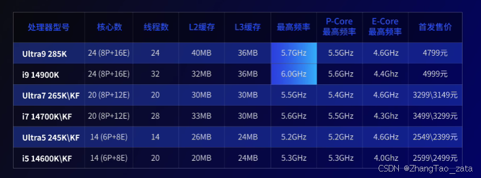

Utral9 285K （8P+16E) ：取消了P核心的超线程功能


### == 显示器 == 
 1. **显示器分辨率**
   - **1080p **：性价比高，但画面分辨率低。
   - **1440p (2K)**：画面更清晰，适合图像处理、视频编辑和游戏。
   - **2160p (4K)**：适合高精度工作如视频剪辑、设计等，但需要更高性能的显卡支持。

2. **刷新率**
   - **60Hz**：适合办公、轻度娱乐。
   - **75Hz到120Hz**：适合轻度游戏玩家。
   - **144Hz及以上**：适合电竞玩家，可以提供更流畅的游戏体验。

 3. **屏幕尺寸**
   - **21-24英寸**：适合桌面空间有限的用户，适合办公和日常使用。
   - **27-32英寸**：适合多任务处理和游戏，27寸的1440p或32寸的4K可以带来更舒适的视野，但是32寸对于一般玩家可能会比较大，谨慎购买。
   - **34英寸及以上**（带鱼屏、超宽屏）：适合多任务处理或需要更宽视野的用户，适合图像/视频编辑或专业设计。

4. **屏幕面板类型**
   - **TN面板**：响应速度快，适合电竞，但色彩和视角表现一般。
   - **IPS面板**：色彩准确，视角宽，适合设计和图像处理。
   - **VA面板**：对比度高，适合看电影和显示深色场景。

这几种面板的区别可以看这里：[TN、IPS和VA面板有什么分別?应该如何选择?](https://www.openshop.com.hk/article-1063/?srsltid=AfmBOoo9iGv0RVaXnml3MOiCuTgw1B9Q8z3eHt1hCgFy_lhenWPWD27a) 总的来说，目前买IPS屏幕比较合适
5. **HDR支持**
[【科普】HDR是什么？HDR为什么能够提升我们的观感体验](https://www.bilibili.com/video/BV1qp4y1g7FN)
[【科普】小白必看：电脑显示器的HDR到底是什么，HDR10 和 HDR400 什么关系？如何选择？](https://post.smzdm.com/p/aqq604g7/)
- HDR400：这是HDR的入门级别，通常亮度达到400尼特（nits），适合一般娱乐和办公，但效果较为基础。
- HDR600：中级HDR，亮度达600尼特，能够展现更明显的HDR效果，适合游戏和视频播放。
- HDR1000：高端HDR，亮度达1000尼特，能够提供更高的动态范围和真实的画面效果，适合专业视频剪辑和电影制作。
- HDR10：这是目前较为普遍的HDR标准，支持较高的动态范围，色彩更丰富。
- Dolby Vision（杜比视界）：比HDR10更高的HDR标准，提供更优质的视觉体验，主要用于高端显示器和电视。
6. **响应时间**
[【科普】高刷显示器必学小知识！Test UFO小飞碟拖影鬼影测试手把手教程，帮你找到显示器最佳OD档位，直观了解显示器响应速度！](https://www.bilibili.com/video/BV1xQ1zY6EFg)
[【科普】显示器响应时间有什么意义，会影响显示器的什么方面？](https://post.smzdm.com/p/a5dd5kq3/)
   - 响应时间一般意义上指的是灰阶响应时间，它的快慢决定对于显示器的拖影会有影响。愈高的刷新率可以带来愈低的响应时间，而用户自己也可以通过向显示器加压（Overdrive）来进一步降低响应时间，但加压愈多愈有可能出现逆残影。1ms响应时间未必为假，但大部分都是牺牲画面换来的。

 7. **接口**
   - **HDMI和DisplayPort（DP）** 是常见的视频输入接口，如果有多台设备连接需求，可以关注接口数量。
   - **type-C**：如果你使用笔记本电脑，type-C可以同时传输视频信号和供电，简化连接。

8. **调节功能**
   - **升降、旋转、倾斜**：这些功能可以让你更灵活地调整显示器，获得更舒适的观看角度。

9. **色域和色准**
[【科普】如何选择显示器色域？适合你的主流标准解析](https://post.smzdm.com/p/azo3v76n/)
   - 对于设计、视频编辑和摄影，选择具有更高色域覆盖（如sRGB、Adobe RGB或DCI-P3）且色准高的显示器会更合适。

 10. DIC动态模糊消除
“DIC动态模糊消除”实际上是HKC自己推出的技术

其实针对动态模糊的效果各大厂商都已经针对性的研究了很久，有些已经上市并应用，日常我们也能看到一些显示器搭载了类似技术，包括硬件和软件都有。

显示器上常见的减少动态模糊的技术包括：

> 高速响应时间：提高液晶面板的响应速度（如GTG，即灰阶到灰阶的响应时间），可以更快地切换像素颜色，从而减少运动画面的拖影。
> 
> 插黑帧技术（Black Frame Insertion, BFI）：在连续的图像帧之间插入黑色帧，利用人眼视觉暂留效应减少感知到的模糊。
> 
> 背光闪烁技术：调整背光源的闪烁频率来与屏幕刷新率同步，有助于提高运动画面的清晰度。
> 
> 同步技术：如AMD的FreeSync和NVIDIA的G-SYNC，这些技术通过让显示器的刷新率与显卡的输出帧率同步，减少画面撕裂和模糊。
> 
> 高刷新率：提供高于传统60Hz的刷新率，如120Hz、144Hz甚至更高，能更流畅地显示动态内容。
> 
> 运动补偿技术（Motion Estimation/Motion Compensation,
> MEMC）：通过算法预测并生成额外的过渡帧插入到原始帧之间，以平滑快速移动的画面。

 11.暗场亮效
在显示器实际使用场景中会经常忽略的点就是暗部的显示效果;

> 第一个就是在某些电影的昏暗场景中，如果显示器无法还原这部分的细节，往往我们就无法获取推动故事发展的关节信息，会使整个情节变得不那么连贯而降低整部电影的观影体验；
> 
> 第二个就是更为重要的游戏场景，老玩家应该都会尝试各种不同的游戏类型和游戏模式，而在游戏中往往昏暗场景出现的概率还非常高。RPG游戏的暗场可能放置了关键的任务物品；RTS游戏中的暗场中可能潜伏着对手的一组偷家小队；FPS游戏里的暗场中可能蹲守着对方的一个卡点枪手。

### 键盘
`【轴体】樱桃轴体 （Cherry MX 原厂轴）`


1. 黑轴(Cherry MX Black) 压力克数80g，键程1.5mm，寿命5000万
   - 特点: 线性开关,按键压下没有明显的触感点,压力感比较重。
   - 触感: 较重,但是比较平滑顺滑,不会有任何"咔哒"声音。
   - 适用场景: 适合喜欢较重按键手感的用户,例如打游戏、编程等需要大力按压的场景。由于没有明显的触感反馈,不太适合需要快速打字的场景。

2. 茶轴(Cherry MX Brown) 压力克数为60g，触发行程为2mm，点击寿命约为5000万次。
   - 特点: 触觉开关,在按键到中间位置会有明显的触感点。
   - 触感: 有中等强度的反馈触感,按键压力相对较轻。
   - 适用场景: 较为平衡的选择,可以满足日常办公、游戏、打字等多种需求。对于需要快速连续输入的用户来说也是不错的选择。

3. 红轴(Cherry MX Red) 压力克数为40g，触发行程为2mm，点击寿命约为5000万次。
   - 特点: 线性开关,完全没有任何明显的触感点。
   - 触感: 非常轻巧顺滑,压力非常轻。
   - 适用场景: 适合喜欢轻快手感的用户,特别适合游戏和快速打字。但因为没有明显的反馈,不太适合需要一定触感反馈的场景。

4. 青轴(Cherry MX Blue) 压力克数为60g，触发键程为2.4mm，点击寿命约为2000万次。
   - 特点: 触觉开关,按键到中间位置会有明显的"咔哒"声音和触感。
   - 触感: 压力较轻,中途有明显的触感点和"咔哒"声音。
   - 适用场景: 适合需要良好触感反馈的场景,如打字、编程等。但由于噪音较大,不太适合安静的办公环境使用。

5. 银轴(Cherry MX Speed Silver) 压力克数为45g，触发键程为1.2mm，点击寿命约为5000万次。
   - 特点: 线性开关,按键距离较短,压力较轻。
   - 触感: 非常轻快顺滑,压力很轻,行程很短。
   - 适用场景: 非常适合游戏及快速输入场景,但同样由于没有明显反馈,不太适合需要一定触感反馈的场景。

`【键帽】材质`

1. ABS塑料
   - 最常见的键帽材质
   - 优点:成本低廉、加工容易
   - 缺点:耐用性和手感较差,容易发黄
   - 应用:大众化机械键盘常用

2. PBT塑料 
   - 优点:耐用性好、手感细腻、不易发黄
   - 缺点:制造成本较高
   - 应用:高端机械键盘常用

3. POM塑料
   - 优点:手感出众、耐用性极佳
   - 缺点:价格较贵
   - 应用:高端定制键盘使用
   
4. 金属
   - 材质包括铝合金、不锈钢等
   - 优点:手感重厚、视觉效果高端
   - 缺点:生产成本更高
   - 应用:奢华定制键盘

5. 树脂
   - 一种半透明的有机合成材料
   - 优点:手感细腻、视觉效果独特
   - 缺点:成本高、易沾油
   - 应用:特殊定制键盘使用

`【键帽】键帽工艺`

1. 注塑成型
   - 最常见的键帽制造工艺
   - 将塑料原料(如ABS、PBT等)加热熔融,注入模具中冷却成型
   - 可以一次性制造整个键帽,包括键盖和刻字部分
   - 成本低、生产效率高

2. 双色注塑
   - 在注塑过程中使用两种不同颜色的塑料材料
   - 可以制造出键帽表面和内部刻字使用不同颜色的效果
   - 刻字部分颜色牢固耐用

3. 激光雕刻
   - 在键帽表面使用激光进行刻字
   - 刻字部分会呈现透光效果
   - 刻字清晰美观,但成本较高

4. 热转印
   - 将图案转印到键帽表面
   - 成本较低,但耐用性较差
   - 转印效果可能不如其他方式清晰
   
5. CNC加工
   - 使用数控机床对金属键帽进行精密加工
   - 可以制造出复杂造型和高精度的金属键帽
   - 适用于高端定制键盘

总的来说,注塑成型是最常见的键帽制造工艺,可以批量高效地生产普通键帽。而双色注塑、激光雕刻等工艺则适用于制造更高端的键帽产品。CNC加工则主要用于定制金属键帽。


### 电饭锅选购指南


**1. 内胆：核心部件，关乎健康与口感**

参考：

[知乎--2025电饭锅推荐](https://zhuanlan.zhihu.com/p/372380519)


* **材质：**

    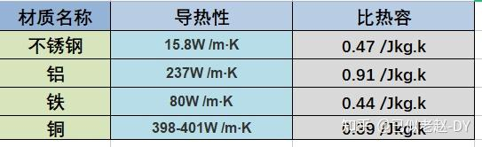

    - 不锈钢：不锈钢的导热性太差，蓄能又太高，不建议选购。常用于多层内胆的蓄能层和导磁层。
    - 铝和铜材质：导热性和比热容都很好，但材质软，一般做成铝合金（导热性有所下降，也是好事，比热容更适中），铝合金不导磁，只能底盘加热。铝和铜一般作为多层内胆的导热层，提升内胆导热性。
    - 铁质：现阶段较好的内胆材质，导热性适中，蓄能保温性好，一般做成厚胆，多用于高端IH电饭煲。
    - 多层复合材质：主流内胆材质，它综合了各项材质的优点，平衡了内胆的导热性和蓄能性。 例如：用铝材质作为导热层，提高热效率，用不锈钢或铁质平衡蓄能性，让内胆受热更均匀，保温性提高。
* **涂层：** 
    - PTFE是特氟龙的一种，是最常见的不粘涂层，三种里面成本最低的一种。
    - PFA实际上是PTFE与PPVE的共聚物，性质比PTFE更稳定，低表面张力等多项性质上优于PTFE，成本是PTFE的10倍左右（现阶段PTFE乳液大概50元一个单位，而PFA大概是500元）。由于PFA价格太贵，一般是混用，以提高涂层的使用寿命和性能。
    - PEEK涂层材料在三种材料里面资历比较新，注意PEEK并不是面料，而是底料，给涂层提供更好的粘附能力，可以提高涂层的使用寿命，耐磨性等。

    一定要给涂层定个排名的话：PEEK+PFA、PFTE>PFA>PFA+PTFE>PTFE

* **形状：**
    * **传统圆柱形：** 底部平坦，米饭上下翻动，吸水效果一般。
    * **球釜/本釜（宽口浅底）：** 球形或底部有弧度的设计，能让米饭在锅内形成环流状滚动，受热更均匀，米饭口感更Q弹。本釜的内胆弧度则旨在扩大受热范围。
* **厚度：** 一般来说，内胆越厚，储热性能越好，受热也更均匀。

**2. 加热方式：影响米饭口感的关键技术**


IH为什么好，原因是它对温度的控制可以更加精准

* **底盘加热：** 传统的加热方式，通过底部的加热盘将热量传导至内胆。技术成熟，价格相对便宜，但可能存在受热不均的情况。
* **IH电磁加热：** 通过电磁线圈直接对内胆进行加热，升温迅速，火力更猛，米饭受热更均匀，口感通常更好。这是目前中高端电饭锅的主流技术。
* **多段IH加热/压力IH加热：** 更高级的加热技术，能实现更精准的温度和压力控制，模拟柴火饭的烹煮过程，进一步提升米饭的口感和营养。如果预算充足，可以优先考虑。

**3. 容量选择：满足家庭需求**

* 根据家庭人口和日常用饭量来确定。一个简单的参考公式是：**吃饭人数 × 0.75升 = 电饭锅容量**。
* 例如，2-3人家庭可选3升左右，4-5人家庭可选4-5升。适当留些余量，以备不时之需。

**4. 功能配置：实用便捷是王道**

* **基础功能：** 精煮饭、快煮饭、煮粥、煲汤、蒸煮是基本功能。
* **高级功能：**
    * **针对不同米种的程序：** 如糙米饭、杂粮饭、寿司米等。
    * **口感选择：** 如标准、稍软、稍硬等。
    * **特色烹饪：** 如煲仔饭、蛋糕、酸奶等。
    * **预约功能：** 方便设定开饭时间。
    * **保温功能：** 注意保温时长和效果。
    * **智能控制：** 部分高端产品具备智能APP控制、根据米种自动调节烹饪程序等功能。
* 按需选择，并非功能越多越好，实用才是关键。

