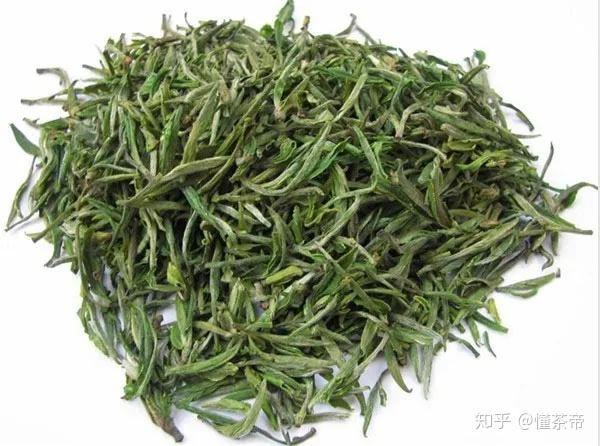
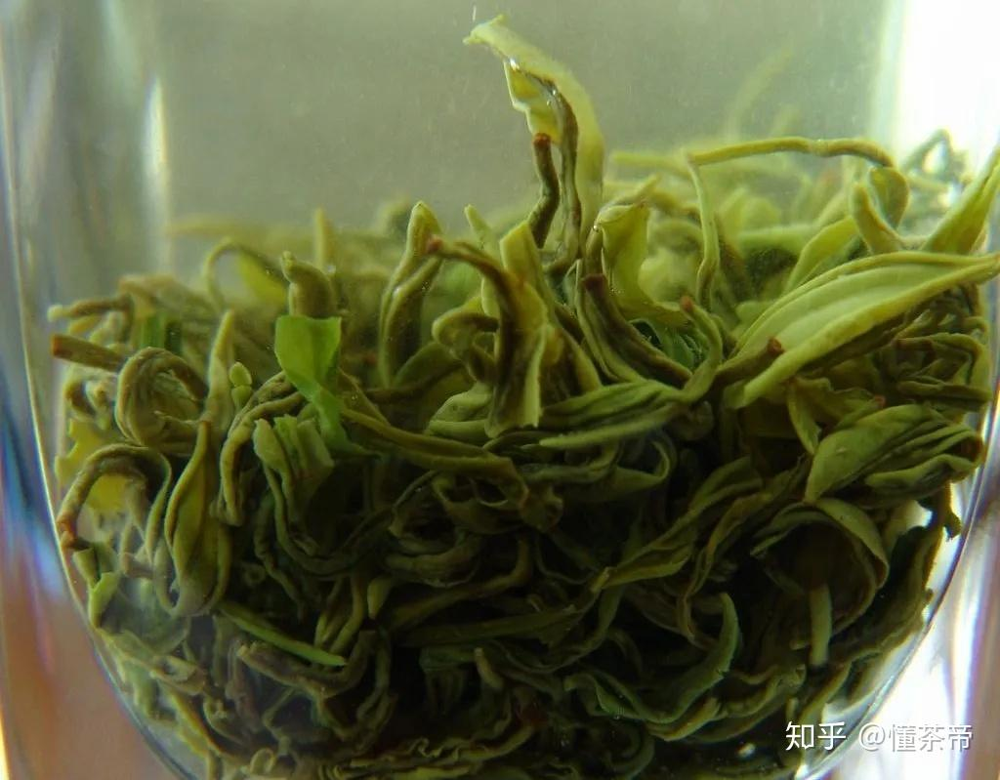
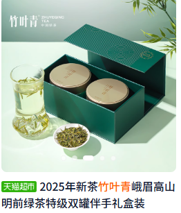
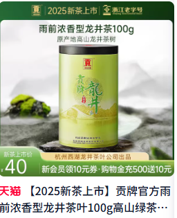

## ==茶叶==

1. 茶叶的基础知识

茶叶来源于茶树（学名：Camellia sinensis），是一种通过采摘、加工而成的饮品原料。茶叶的风味受茶树品种、产地、气候、土壤和制作工艺的综合影响。以下是茶叶知识的三大核心方面：类别、茶种和制作工艺。

1.1 茶叶的类别

茶叶根据发酵程度和加工工艺主要分为六大类，每类有独特风味和特点：

    绿茶：不发酵，保留清新草香和绿色。代表：西湖龙井、碧螺春。
    红茶：全发酵，汤色红艳，滋味醇厚。代表：祁门红茶、正山小种。
    乌龙茶（青茶）：半发酵，香气复杂，介于绿茶和红茶之间。代表：铁观音、大红袍。
    白茶：微发酵，工艺简单，清甜柔和。代表：白毫银针、白牡丹。
    黄茶：轻发酵，通过“闷黄”工艺形成黄汤黄叶。代表：君山银针、霍山黄芽。
    黑茶：后发酵，适合陈化，滋味醇厚。代表：普洱茶、安化黑茶。

此外，还有花茶（如茉莉花茶）、紧压茶（如普洱茶饼）和调味茶（如伯爵红茶）等衍生类型。

1.2 茶树品种（茶种）

茶树品种决定了茶叶的内含物质（如茶多酚、氨基酸、芳香物质），影响风味基础和适制性。主要分类包括：

    小叶种：叶片小，香气清高，适合绿茶和部分乌龙茶。例：龙井43号、福鼎大白茶。
    中叶种：叶片大小适中，适制性广，可制多种茶类。例：铁观音品种、水仙。
    大叶种：叶片大，内质浓烈，适合红茶和黑茶。例：云南大叶种。
    地方品种与杂交种：如凤凰水仙、福云6号，适应当地环境，风味独特。

茶种决定了茶叶的潜在风味，但通过不同工艺，同一茶种可制成不同茶类。例如，云南大叶种可制成普洱茶（黑茶）、滇红（红茶）或绿茶。

1.3 茶叶的制作工艺

茶叶制作工艺包括以下关键步骤，不同茶类组合不同：

    采摘：选择单芽、一芽一叶等标准，春茶品质最佳。
    萎凋：鲜叶失水，软化叶片，激发香气。白茶和红茶萎凋时间长，绿茶基本无萎凋。
    杀青：高温破坏酶活性，固定绿色。绿茶、黄茶需杀青，白茶无此步骤。
    揉捻：形成条索状，促进内含物质释放。白茶不揉捻，红茶重揉。
    发酵：控制氧化程度，红茶全发酵，乌龙茶部分发酵，黑茶靠微生物后发酵。
    干燥：去除水分，固定形状和风味。方法包括烘干、晒干、炒干。

特殊工艺如黄茶的“闷黄”、乌龙茶的“摇青”、黑茶的“渥堆”赋予各茶类独特风味。

3. 茶叶的保存与选购

绿茶、白茶、黄茶：密封、低温（0-5°C）、避光保存，保鲜为主。
乌龙茶（如铁观音）、红茶：密封、常温、干燥环境，避免异味。
黑茶：通风存放，越陈越香。

选购铁观音：选择安溪产地，观察条索紧结、色泽乌润，闻干茶香气，优先选择春茶。

4. 总结

茶叶类别：六大茶类各有特色，铁观音作为乌龙茶代表，兼具清香与醇厚。
茶种：茶树品种决定风味基础，铁观音品种最适合制作正宗铁观音，其他品种可仿制但风味有别。
制作工艺：铁观音的摇青和烘焙是关键，工艺与品种的适配性决定品质。
实践建议：尝试冲泡不同发酵度的铁观音（清香型、浓香型），体会工艺与品种的微妙影响。

通过了解茶种与工艺的交互作用，你可以更好地欣赏铁观音的独特魅力，并探索其他茶类的丰富世界！

> 茶叶是从山茶科植物茶树的嫩叶或芽中采摘，经不同加工工艺制作而成的饮品。作为世界上最受欢迎的天然饮料之一，茶叶含有多种活性成分，如茶多酚、咖啡因和氨基酸，具有清香的香气和独特的口感。`根据加工方式和发酵程度的不同`，茶叶主要分为绿茶、白茶、黄茶、青茶、红茶和黑茶等多种类型，各具风味。茶叶无高低贵贱之分，`自己喜欢的茶就是好茶`。
 
 `分类` 
| 茶叶种类       | 发酵程度          | 特点                               | 代表               | 
|----------------|------------------|-----------------------------------|--------------------| 
| 绿茶           | 发酵率 0%        | 保持天然绿色，味清香爽口            | 龙井、碧螺春、峨眉山茶      | 
| 白茶           | 发酵率 0-10%     | 微发酵，味清淡         | 白毫银针、白牡丹     | 
| 黄茶           | 发酵率 10-20%    | 轻发酵，滋味醇厚，带独特黄汤香      | 君山银针、蒙顶黄芽   | 
| 青茶（乌龙茶） | 发酵率 30-60%    | 半发酵，口感丰富，香气浓郁          | 铁观音、大红袍       | 
| 红茶           | 发酵率 80-100%   | 全发酵，汤色红亮，味甘醇、回甘      | 祁门红茶、滇红       | 
| 黑茶           | 微生物深度发酵    | 沤堆发酵，`非传统茶种类`         | 普洱茶              |

> `茶叶的味道来源`
>  涩味来自茶多酚（功效：抗氧化、保健作用） 
>  苦味来自咖啡因（刺激中枢神经，提神） 
>  香味（酮类、脂类、醇类） 
>  甜味（氨基酸） 
>  色素（花青素花黄素等）
>  `茶叶制作步骤`
>   主要步骤有：
> 1.采摘 i.采摘的位置，是叶芽还是叶子，采摘的时间（春茶最好）和天气
> 2.杀青 a.短时间高温处理防止发酵
> 3.萎凋 a.让茶叶自然失水，为后续揉捻和发酵做准备（对于白茶红茶乌龙茶等等发酵茶叶非常重要）
> 4.揉捻 a.通过大力揉捻促进茶叶细胞壁破裂，释放香气
> 5.发酵 a.除了黑茶，主要是生物氧化（多酚类物质被氧化
> 6.干燥 a.固定茶叶的香气和风味  

*`名茶`* 
主要和地区气候有关，具体哪个好喝看个人口味，没有高低贵贱 
`其他一些茶叶的知识`
> 1. 为什么有些茶叶要做成卷曲形或者球形？
> 
> > 茶叶被制成卷曲形或球形主要出于以下几个原因：
> > 
> > 1. **提高茶叶的耐泡性**：卷曲或球形的茶叶由于表面积相对较小，在冲泡时茶叶不会一次性完全释放内部的物质，茶汤会在逐次冲泡中逐渐释放香气和滋味，这使得茶叶能够多次冲泡而不失味道。这对于像**铁观音**等乌龙茶尤为重要。
> > 
> > 2. **便于保存和运输**：茶叶制成紧实的卷曲或球形，有利于节省空间，方便包装和储存。由于茶叶体积减少，包装效率提高，储存时也更加稳定。紧实的形状还减少了茶叶与空气的接触，延缓氧化，保持新鲜。
> > 
> > 3. **保护茶叶品质**：在卷曲或揉成球形的过程中，茶叶会经过**揉捻**，这有助于破坏细胞壁，释放内含的香气和滋味成分。成形后的茶叶更能保留其香气和营养成分，也不易在运输和储存过程中破碎。
> > 
> > 4. **冲泡时的视觉效果**：卷曲或球形茶叶在热水中慢慢舒展，逐渐释放香气和茶汁，这不仅增强了味觉体验，也带来了独特的视觉享受。茶叶在水中展开的过程常常被形容为"茶舞"，尤其在透明茶具中显得十分美观。
> > 
> > 5. **传统工艺和特色**：制作卷曲或球形茶叶是一些传统制茶工艺的体现，尤其在某些名茶中，卷曲或球形外形成为其标志性特点。比如，**铁观音**以其紧实的球形著称，而**碧螺春**则以卷曲螺旋状的形态闻名。

### 黄茶

参考：
[参考](https://www.hanyitea.tw/single-post/yellow-tea/)

### 几种制作步骤详解

茶叶的制作过程因茶叶种类的不同而有很大差异，但总体上可以概括为几个核心步骤。下面我将详细介绍这些主要步骤，并针对不同茶类（如绿茶、红茶、乌龙茶、白茶、黄茶、黑茶）的特殊工艺进行说明。

**茶叶制作的核心步骤：**

#### 1.  **采摘 (Plucking/Harvesting)**
    * **详解：** 这是茶叶制作的第一步，也是至关重要的一步。采摘的嫩度、时节、标准直接影响茶叶的品质和风味。
        * **采摘标准：** 根据不同的茶叶种类，采摘标准也不同。常见的有：
            * **芽茶：** 只采摘茶树顶端的嫩芽，如一些高级绿茶、白毫银针等。
            * **一芽一叶：** 采摘一个嫩芽和其下第一片嫩叶。
            * **一芽二三叶：** 采摘一个嫩芽和其下第二或第三片嫩叶，这是最常见的采摘标准，适用于大多数茶叶。
            * **成熟叶片：** 一些特定茶叶如普洱茶的某些原料会采摘相对成熟的叶片。
        * **采摘时间：** 通常在清晨或上午进行，此时茶叶的含水量和芳香物质较为理想。不同季节采摘的茶叶品质也不同，如春茶鲜爽，夏茶苦涩，秋茶香气平和。
        * **采摘方式：** 有手工采摘和机器采摘。手工采摘能保证采摘的精准度和茶叶的完整性，品质较高，但成本也高。机器采摘效率高，成本低，但茶叶完整性稍差，多用于制作大宗茶。
    * **注意事项：** 采摘下来的鲜叶要轻放，避免挤压损伤，并尽快运往茶厂进行下一步处理，防止鲜叶变质。

#### 2.  **萎凋 (Withering)**

    刚采摘下来的新鲜茶叶水分含量高达75%～80%，"萎凋"的目的是为了降低含水量，让新鲜茶叶和枝梗的水分可以适度蒸发，促进茶叶的化学变化，为后续的制茶过程准备良好的茶青品质。
    * **详解：** 萎凋是使鲜叶失去一部分水分，叶片变软，韧性增加，为后续的揉捻和发酵（氧化）做准备的过程。同时，萎凋过程中，茶叶内部的化学成分也会发生一些初步转化，如部分大分子物质分解，芳香物质开始形成。
        * **方式：**
            * **日光萎凋：** 将鲜叶摊放在阳光下，利用自然光照和通风使水分蒸发。需要控制好时间和光照强度，避免晒伤。
            * **室内萎凋：** 将鲜叶摊放在萎凋槽或萎凋架上，通过鼓风、加温等方式控制环境的温度和湿度，使水分缓慢均匀地散失。这是目前更常用且可控性更高的方式。
        * **程度：** 萎凋程度根据茶叶种类和后续工艺要求而定。例如，红茶萎凋程度较高，白茶萎凋时间较长且程度较重，而绿茶通常不进行或仅进行轻微萎凋。
    * **对茶叶的影响：**
        * **物理变化：** 叶片失水变软，体积缩小，叶色由鲜绿转为暗绿。
        * **化学变化：** 蛋白质水解产生氨基酸，淀粉水解产生可溶性糖，多酚类物质发生轻微氧化，芳香物质的含量和种类发生变化。

#### 3.  **杀青 (Fixation / Kill-green)**
    * **详解：** 这是绿茶、黄茶和部分乌龙茶制作的关键步骤。目的是利用高温快速破坏鲜叶中酶的活性，特别是多酚氧化酶的活性，从而阻止多酚类物质的酶促氧化，保持茶叶的绿色，并散发部分青草气，形成茶叶特有的香气。
        * **方式：**
            * **炒青：** 将鲜叶放入热锅中进行翻炒。有手工炒制和机器炒制。锅温和时间控制非常重要。
            * **蒸青：** 利用蒸汽来加热鲜叶。蒸青的茶叶颜色更翠绿，但香气可能不如炒青浓郁。日本的玉露、抹茶多用蒸青。
            * **烘青：** 用烘干机进行杀青。
            * **滚筒杀青：** 使用滚筒杀青机，效率较高。
        * **程度：** 杀青要适度，杀青不足，酶活性未完全破坏，茶叶易变红；杀青过度，茶叶焦糊，失去鲜爽味。
    * **对茶叶的影响：**
        * **停止发酵：** 酶活性被破坏，防止叶片变红。
        * **去除青草气：** 鲜叶中的一些低沸点青草气味物质挥发。
        * **转化香气：** 在高温作用下，一些香气物质发生转化，形成绿茶特有的清香或板栗香。
        * **叶片变软：** 便于后续的揉捻造型。

#### 4.  **揉捻 (Rolling / Shaping)**
    * **详解：** 揉捻是通过外力作用，使萎凋或杀青后的茶叶叶片卷曲成条，破坏叶细胞组织，使茶汁溢出附着于叶表面，便于冲泡时茶汤内含物的浸出。同时，揉捻也能使茶叶初步成型。
        * **方式：**
            * **手工揉捻：** 将茶叶置于揉捻工具（如竹匾）中，用手掌施加压力进行揉捻。
            * **机器揉捻：** 使用揉捻机进行揉捻，效率高，压力均匀。
        * **程度：** 揉捻程度根据茶叶种类而定。
            * **绿茶：** 一般揉捻较轻，以保持条索的完整和美观。
            * **红茶：** 揉捻程度较重，目的是充分破坏叶细胞，促进发酵（氧化）。
            * **乌龙茶：** 揉捻是其塑形的重要步骤，根据不同乌龙茶的形状要求（如条形、半球形、球形）进行多次、不同方式的揉捻和包揉。
    * **对茶叶的影响：**
        * **塑造外形：** 使茶叶卷曲成特定的形状，如条形、珠形等。
        * **破坏叶细胞：** 使茶汁溢出，增加茶汤浓度和滋味。
        * **促进内含物转化：** 对于需要发酵的茶叶，揉捻能促进多酚类物质与多酚氧化酶的接触，加速氧化过程。

#### 5.  **发酵 (Oxidation / Fermentation)**
    * **详解：** 严格来说，茶叶的发酵指的是“酶促氧化”。这是红茶和部分乌龙茶制作特有的关键工序，也是形成其色、香、味特征的主要过程。在适宜的温湿度条件下，茶叶中的多酚类物质在多酚氧化酶的作用下发生氧化聚合反应，生成茶黄素、茶红素等物质，使茶叶色泽变红，滋味醇厚。
        * **对于红茶：** 揉捻后的茶叶摊放在发酵框或发酵车间内，控制好温度（通常20-30℃）和湿度（相对湿度90%以上），并保持空气流通。发酵时间根据茶叶嫩度、揉捻程度以及期望的品质特征而定，一般几个小时。
        * **对于乌龙茶：** 乌龙茶的发酵程度介于绿茶和红茶之间，属于半发酵茶。其“做青”工序包含了萎凋和发酵（摇青和静置交替进行），通过摇动叶片使叶缘细胞受损，促进氧化，而叶片中心部分的氧化程度较低。
        * **对于黑茶：** 黑茶的“发酵”则更为复杂，除了酶促氧化外，还有微生物的参与，属于后发酵。其渥堆工序是利用湿热作用和微生物活动，使茶叶内含物发生剧烈转化，形成黑茶特有的陈香和醇厚滋味。
    * **对茶叶的影响：**
        * **色泽变化：** 叶色由绿变红（红茶）或黄褐（乌龙茶）。
        * **香气变化：** 青草气减少，花香、果香、蜜糖香等成熟香气显现。
        * **滋味变化：** 苦涩味降低，滋味趋于醇厚、甜爽。
        * **内含物变化：** 多酚类物质氧化，生成茶黄素、茶红素、茶褐素等。

#### 6.  **干燥 (Drying)**
    * **详解：** 干燥是茶叶制作的最后一道主要工序。目的是蒸发茶叶中多余的水分，将其含水量降低到一定标准（通常5%-7%），以抑制酶的活性，固定茶叶品质，防止霉变，并使茶叶外形固定，便于贮藏和运输。同时，干燥过程中的热作用也会进一步促进茶叶香气的形成。
        * **方式：**
            * **炒干：** 在锅中翻炒，温度逐渐降低，适用于一些名优绿茶。
            * **烘干：** 使用烘干机，通过热风进行干燥，是目前最常用的干燥方式，温度和时间易于控制。
            * **晒干：** 利用日光进行干燥，成本低，但受天气影响大，干燥不均匀，主要用于一些白茶和普洱生茶的毛茶干燥。
        * **注意事项：** 干燥的温度和时间需要精确控制。温度过高或时间过长容易产生焦味，影响品质；温度过低或时间不足则水分含量超标，茶叶易变质。通常采用“高温快速，低温慢焙”的原则，分次进行干燥，以达到最佳效果。
    * **对茶叶的影响：**
        * **降低含水量：** 防止霉变，延长保质期。
        * **固定品质：** 终止酶促反应，稳定茶叶的色、香、味。
        * **发展香气：** 高温下，一些香气物质进一步转化和挥发，形成“火功香”。
        * **固定外形：** 使茶叶外形稳定。

#### **不同茶类的特殊工艺：**

* **绿茶 (Green Tea):**
    * **核心工艺：** 杀青、揉捻、干燥。
    * **特点：** 不发酵。通过高温杀青抑制酶活性，保持茶叶的绿色和清爽的口感。
    * **典型工艺：** 鲜叶 → (萎凋，可选) → 杀青 → 揉捻 → 干燥。
* **红茶 (Black Tea):**
    * **核心工艺：** 萎凋、揉捻（或揉切）、发酵、干燥。
    * **特点：** 全发酵。通过充分的酶促氧化，形成红汤红叶和醇厚滋味。
    * **典型工艺：** 鲜叶 → 萎凋 → 揉捻/揉切 → 发酵 → 干燥。
* **乌龙茶 (Oolong Tea / Blue Tea):**
    * **核心工艺：** 萎凋、做青（摇青与静置交替）、杀青、揉捻、干燥。
    * **特点：** 半发酵。发酵程度介于绿茶和红茶之间，兼具绿茶的清香和红茶的醇厚，香气馥郁多变（花香、果香）。
    * **典型工艺：** 鲜叶 → 萎凋 → 做青（摇青、晾青）→ 杀青 → 揉捻 → 干燥 → (烘焙，可选)。
* **白茶 (White Tea):**
    * **核心工艺：** 萎凋、干燥。
    * **特点：** 微发酵（自然萎凋过程中的轻微氧化）。工艺最简单，最大限度保留了茶叶的天然风味，滋味清淡甘甜，毫香显露。
    * **典型工艺：** 鲜叶 → 萎凋（长时间，室内或日光）→ 干燥。
* **黄茶 (Yellow Tea):**
    * **核心工艺：** 杀青、揉捻、闷黄、干燥。
    * **特点：** 轻发酵（通过闷黄工序促进非酶促自动氧化）。品质特点是黄汤黄叶，滋味甘醇。
    * **典型工艺：** 鲜叶 → 杀青 → 揉捻 → 闷黄 → 干燥。
* **黑茶 (Dark Tea / Post-fermented Tea):**
    * **核心工艺：** 杀青、揉捻、渥堆（湿热堆积发酵）、干燥。
    * **特点：** 后发酵。除了酶促氧化，还有微生物参与发酵，形成独特的陈香和醇厚滑腻的口感。可以长期存放，并有“越陈越香”的特点。
    * **典型工艺（以普洱熟茶为例）：** 鲜叶 → 杀青 → 揉捻 → 晒干（制成毛茶）→ 渥堆 → 干燥 → (紧压成型，可选)。

#### **其他可能的步骤：**

* **筛选/分级 (Sorting/Grading):** 在干燥后，通过筛分、风选、拣剔等方法，去除茶梗、黄片、碎末等杂质，并将茶叶按外形、嫩度等进行分级，以保证成品茶的匀净度和商品价值。
* **精制/拼配 (Refining/Blending):** 对毛茶进行进一步加工，如去梗、去片、整形、匀堆、拼配等，以提高茶叶的品质和稳定性。拼配是将不同产地、不同季节、不同等级的茶叶按一定比例混合，以形成特定风味和稳定品质的产品。
* **烘焙/复火 (Baking/Refiring):** 一些茶叶（如乌龙茶、部分绿茶）在干燥后或储藏一段时间后会进行烘焙或复火，目的是进一步降低水分，去除杂味，提升香气（如火功香），改善滋味。
* **紧压成型 (Pressing):** 一些茶叶（如普洱茶、部分黑茶、白茶）会通过蒸汽软化后用模具压制成各种形状，如饼茶、砖茶、沱茶等，便于运输和长期储存。
* **陈化 (Aging):** 特指普洱茶、部分黑茶和白茶，在适宜的条件下（温度、湿度、通风）长期存放，使其内含物持续转化，风味不断改善的过程。

总而言之，茶叶的制作是一个复杂而精细的过程，每一步都对最终的茶叶品质产生重要影响。不同茶类的独特风味正是源于其制作工艺的差异。

#### “明前茶”、“雨前茶”和“雨后茶”的区别

“清明前后”是茶叶采摘中一个非常重要的时间节点，尤其对于绿茶和一些对嫩度要求高的茶叶来说，意义非凡。这涉及到两个关键概念：“明前茶”和“雨前茶”。

这里的“清明”指的是中国的二十四节气之一的**清明节**，通常在公历的4月4日、5日或6日。

**1. 明前茶 (Pre-Qingming Tea)**

* **采摘时间：** 指在清明节之前采摘的茶叶。
* **详解：**
    * **生长环境的独特性：** 经过一个漫长冬季的休养生息，茶树体内的养分得到充分积累。春季气温回升缓慢，尤其在清明前，大部分茶区的平均气温仍然较低。这种低温环境使得茶树生长速度相对缓慢，有利于茶叶中营养物质的积累，特别是氨基酸等鲜爽滋味物质的形成。
    * **芽叶特征：** 明前茶的芽叶通常非常幼嫩、肥硕，叶片较小，茸毛（茶毫）也比较丰富。这是因为低温下细胞分裂和生长较慢，芽叶发育细致。
    * **内含物质：**
        * **高氨基酸：** 这是明前茶最显著的特点。氨基酸是构成茶叶鲜爽味的主要成分。低温有利于氨基酸的合成与积累，同时日照时间相对较短，也减缓了氨基酸向茶多酚的转化。
        * **低茶多酚和咖啡碱：** 相对而言，明前茶的茶多酚和咖啡碱含量较低。茶多酚是构成茶汤涩味的主要物质，咖啡碱则带来苦味。因此，明前茶的滋味通常更为鲜爽、甘甜，苦涩感较低。
        * **香气物质：** 香气清幽、高雅，带有清新的嫩香或豆香。
    * **产量稀少：** 由于清明前气温低，茶树发芽数量有限，且生长缓慢，因此明前茶的产量非常稀少，正所谓“明前茶，贵如金”。
    * **品质上乘：** 因其独特的鲜爽口感和高雅香气，明前茶通常被认为是春茶中的上品，尤其是一些名优绿茶，如西湖龙井、碧螺春、黄山毛峰、信阳毛尖等，都以明前采制的为最佳。
* **缺点：** 由于采摘过嫩，有时茶汤的浓度和耐泡度可能略逊于稍后采摘的茶叶。价格也相对昂贵。

**2. 雨前茶 (Yǔqián Chá - Pre-Rain Tea)**

* **采摘时间：** 指在清明节之后、谷雨节（通常在公历4月19日、20日或21日）之前采摘的茶叶。
* **详解：**
    * **生长环境变化：** 清明过后，气温明显回升，雨水也逐渐增多（“谷雨”即“雨生百谷”之意），茶树进入快速生长期。
    * **芽叶特征：** 相较于明前茶，雨前茶的芽叶会稍大一些，叶片也略厚，但仍然保持着春茶的鲜嫩度。
    * **内含物质：**
        * **氨基酸含量仍然较高：** 虽然略低于明前茶，但仍保持在较高水平，因此茶汤依然鲜爽。
        * **茶多酚和咖啡碱含量上升：** 随着气温升高和日照增强，茶叶中的茶多酚和咖啡碱含量开始增加，这使得雨前茶的滋味比明前茶更为浓郁、饱满，耐泡度也相对更好。
        * **香气浓郁：** 香气也更为浓烈一些。
    * **产量增加：** 由于茶树生长加快，雨前茶的产量比明前茶要高得多。
    * **性价比高：** 雨前茶兼具了较好的鲜爽度和一定的浓强度，且价格通常比明前茶亲民，因此是很多茶客追求性价比的选择。品质上佳的雨前茶也是非常优秀的。

**总结清明前后的区别：**

| 特点         | 明前茶 (Pre-Qingming)                        | 雨前茶 (Pre-Rain / Post-Qingming, Pre-Guyu)      |
| :----------- | :------------------------------------------- | :----------------------------------------------- |
| **采摘时间** | 清明节前                                     | 清明后至谷雨前                                   |
| **芽叶嫩度** | 极嫩，芽小叶细，茸毛多                         | 较嫩，芽叶稍大，叶片略厚                         |
| **氨基酸** | 含量最高，滋味鲜爽甘甜                         | 含量较高，滋味鲜爽，略带醇厚                     |
| **茶多酚** | 含量较低，苦涩味弱                             | 含量有所增加，滋味更浓郁，略带收敛性             |
| **香气** | 清幽、高雅，嫩香                               | 浓郁，鲜灵                                       |
| **产量** | 稀少                                         | 较高                                             |
| **价格** | 昂贵                                         | 相对适中                                         |
| **主要优点** | 鲜爽度极致，香气清雅                           | 滋味浓醇，性价比高，耐泡度相对好                 |
| **适合茶类** | 顶级名优绿茶，部分白茶（如白毫银针）             | 大部分优质绿茶，部分白茶                         |

**过了谷雨节之后采摘的茶叶呢？**

谷雨之后，气温更高，雨量更充沛，茶树生长速度非常快，叶片也变得更大更粗老。此时茶叶中的茶多酚含量会显著增加，而氨基酸含量则大幅下降，因此茶叶的苦涩味会比较重，鲜爽度降低，香气也不如明前茶和雨前茶细腻。这类茶叶通常用于制作中低档绿茶、红茶或作为其他茶类的原料。

因此，“清明”这个时间节点，对于追求茶叶极致鲜嫩和独特风味的品饮者来说，具有非常重要的参考价值。它不仅仅是一个时间标记，更是茶叶品质和风味特征的一个分水岭。

### 几款茶叶的详细介绍 （主要是产地和制作方式的区别）

#### 铁观音：（半球形）乌龙茶的代表
铁观音是乌龙茶的代表品种，产于福建安溪，以兰花香和“观音韵”著称。以下详细介绍铁观音的制作工艺、茶树品种选择及其影响。
1 铁观音的特性

类别：乌龙茶（半发酵，10%-70%发酵度）。
风味：清香型（轻发酵）有兰花香，浓香型（重发酵）带焙火香，滋味醇厚，回甘明显。
产地：福建安溪（地理标志保护产品）。
茶树品种：传统使用铁观音品种（中叶种），叶片肥厚，适制乌龙茶。

2 铁观音的制作工艺
铁观音的制作工艺复杂，需精细控制以下步骤：

采摘  

标准：一芽二叶或一芽三叶，春茶（4-5月）品质最佳。
要求：选择成熟但不过老的叶片，确保内含物质丰富。

萎凋  

目的：让鲜叶失水，软化叶片，激发香气物质。
方法：室内自然萎凋或阳光萎凋，时间约2-4小时。
特点：铁观音萎凋适中，保留叶片活性，为后续摇青做准备。

摇青  

核心步骤：通过摇动茶叶，使叶缘轻微氧化，形成“绿叶红镶边”。
工艺：反复摇青（3-5次，每次5-10分钟）与摊凉交替，促进香气生成。
效果：赋予铁观音独特的兰花香和“观音韵”。

杀青  

目的：高温（约250°C）停止氧化，固定香气和形状。
方法：炒青，使用炒锅快速翻炒。
特点：控制杀青时间，避免过熟或生青味。

揉捻  

目的：形成紧结的条索状，促进茶汁释放。
方法：手工或机械揉捻，铁观音多为半球形或龙珠形。

烘焙  

目的：去除水分，固定风味，增强香气。
类型：
清香型：低温慢烘（约80°C），保留花香。
浓香型：高温烘焙（约120°C），带焙火香。

时间：数小时至一天，根据风格调整。

3 茶树品种对铁观音的影响
铁观音传统使用铁观音茶树品种，但其他品种是否适合制作铁观音？以下是分析：

铁观音品种  

特点：叶片肥厚，内含茶多酚和芳香物质高，适合多次摇青，易形成兰花香和醇厚滋味。
优势：与铁观音工艺高度适配，产出经典“观音韵”。

其他品种  

黄旦：香气高扬但持久性稍逊，制成清香型乌龙茶后类似铁观音，但滋味较薄。
本山：与铁观音品种接近，香气稍淡，缺乏厚重感。
毛蟹：叶片小，香气清鲜，但难以呈现铁观音的醇厚韵味。
大叶种（如云南大叶种）：内质浓烈，适合红茶或黑茶，制成乌龙茶后滋味偏涩，香气偏木质，难达铁观音标准。

结论理论上，任何茶树品种可通过铁观音工艺制成乌龙茶，但风味差异明显。铁观音品种因其基因特性（高芳香物质、适中发酵性）是最佳选择。其他品种（如黄旦、本山）常用于生产“铁观音风格茶”，但品质和正宗性不及传统铁观音。

4 铁观音的冲泡与品饮

水温：95-100°C，激发香气。
茶具：宜用紫砂壶或盖碗，展现“观音韵”。
投茶量：每100ml水约7-8g茶叶。
冲泡时间：第一泡10-15秒，后续逐渐延长。
品饮要点：观汤色（金黄或绿黄）、闻香气（兰花香或焙火香）、尝滋味（醇厚、回甘）、赏叶底（绿叶红镶边）。

#### 龙井 （叶子扁平，口味较浓但爽口） 分类：绿茶

龙井茶叶（西湖龙井）是中国绿茶的代表，其主要特点包括：

1. 外形：扁平光滑，形似雀舌，挺直匀整，色泽嫩绿或翠绿。
2. 香气：清香或栗香，带花果香，幽雅持久。
3. 滋味：鲜爽甘醇，入口柔和，回甘明显。
4. 汤色：清澈明亮，呈嫩绿色或黄绿色。
5. 叶底：细嫩成朵，均匀鲜活，呈嫩绿色。
6. 产地：主要产于浙江杭州西湖周边，如狮峰、梅家坞、龙井村等地。
7. 工艺：采用传统手工炒制，注重“抓、抖、搭、拓”等技法，保留茶叶鲜爽特性。

龙井茶以“色绿、香郁、味甘、形美”四绝著称，品质优异，深受茶友喜爱。

#### 峨眉山茶 （茶叶细嫩似雀舌，汤色嫩绿清亮）分类：绿茶

峨眉山茶以其独特的品质和风味著称，主要特点包括：

1. **外形**：峨眉山茶（以竹叶青为代表）外形扁平光滑，形似雀舌或竹叶，条索挺直匀整，色泽嫩绿或翠绿，整体美观精致。

2. **香气**：清香高扬，常带兰花香或栗香，部分高端茶品带有幽雅的花果香，香气持久，令人愉悦。

3. **滋味**：入口鲜爽甘醇，柔和顺滑，回甘明显，带有高山茶特有的清新感和层次感。

4. **汤色**：汤色清澈明亮，呈嫩绿色或浅黄绿色，晶莹剔透，视觉上极具吸引力。

5. **叶底**：叶底细嫩成朵，均匀鲜活，呈嫩绿色，展现出茶叶的优良品质和鲜嫩特性。

6. **产地**：主要产于四川峨眉山，海拔800-1500米的高山茶区，如黑水寺、万年寺、雷洞坪等地，环境云雾缭绕，土壤肥沃。

7. **工艺**：采用传统手工或半手工炒制，注重“抖、抓、压、磨”等技法，精准控制火候和时间，以保留茶叶的鲜爽特性和高山韵味。

#### 黄山毛峰

（毛峰指的是一种做法，）

黄山毛峰是中国最著名的绿茶之一，属于历史名茶，以其卓越的品质和独特的风味享誉海内外。它产自中国安徽省风景秀丽的黄山风景区及周边地区，是中国十大名茶之一。

**核心特点与魅力：**

黄山毛峰的魅力可以概括为其“形美、色艳、香高、味醇”四绝：

* **外形秀美（形美）：** 黄山毛峰的干茶外形细扁微卷，芽叶成朵，多呈雀舌形或略弯曲的条索状。其芽头壮实，尖端锋利，故名“毛峰”。茶叶表面遍布细密的银白色茸毛（白毫），色泽嫩绿油润，上品者常伴有金黄色的鱼叶（俗称“黄金片”），整体形态非常雅致。
* **香气清高持久（香高）：** 黄山毛峰以其独特的“兰花香”或“板栗香”而闻名，香气清幽高雅，馥郁持久。冲泡后，高锐的香气扑鼻而来，令人心旷神怡。
* **滋味鲜醇甘爽（味醇）：** 茶汤滋味鲜爽醇厚，入口柔和顺滑，几乎没有苦涩味。饮后回甘明显，喉韵悠长，带有一种独特的“山韵”，这是黄山得天独厚的自然环境赋予茶叶的特殊风味。
* **汤色清澈明亮（色艳）：** 冲泡出的茶汤清澈透亮，呈嫩绿或浅杏黄色，观之赏心悦目。

**产地与历史：**

黄山毛峰的核心产区位于安徽省黄山。这里山峦叠嶂，云雾缭绕，气候湿润，土壤肥沃，为茶树的生长提供了绝佳的自然条件。相传黄山毛峰的创制始于清朝光绪年间，至今已有一百多年的历史。

**加工工艺：**

黄山毛峰属于绿茶，其制作工艺精细，主要包括鲜叶摊放、杀青、揉捻和烘干等环节。
* **采摘：** 多在清明前后采摘肥壮的嫩芽和初展的一芽一叶或一芽二叶。
* **杀青：** 通过高温快速破坏酶的活性，保持茶叶的绿色。
* **揉捻：** 轻度揉捻，使茶叶细胞部分破碎，茶汁外溢，并塑造其特有的微卷条索。这也是其“卷曲”形态的由来。
* **烘干：** 采用烘焙工艺，降低水分，固定外形，并进一步提升香气。

**品饮与等级：**

冲泡黄山毛峰建议使用80-85℃的水温，以玻璃杯或白瓷盖碗为佳，以便欣赏其形态和汤色。其等级根据采摘时节（如明前茶、雨前茶）、鲜叶嫩度和加工精细程度划分，特级品质最佳。

**总结来说，黄山毛峰是一款集观赏与品饮价值于一体的优质绿茶。它不仅代表了中国绿茶的高超制作技艺，也承载了黄山地区的自然灵气和文化底蕴，是品味中国茶文化不可错过的一款佳茗。**

### zata觉得还不错的茶叶（zata个人喜好，不喜勿喷）
- 竹叶青眀前绿茶（峨眉山茶） 分类：绿茶  ☆☆☆☆

都是明前茶，叶子很小，看着感觉很有档次。于2024年11月购入，当时是75一罐50g，感觉口感性价比都还不错，不过现在好像涨价了很多，感觉性价比就比较低了

优点：

1. 茶叶颗颗分明，非常好看
2. 包装加分

- 贡茶龙井 （龙井） 分类：绿茶  ☆☆☆

因为是龙井茶，所以口感会比竹叶青的要浓，叶子都是偏大，不过胜在量大管饱，于2024年3月购入，当时35元100g

- 黄山毛峰

