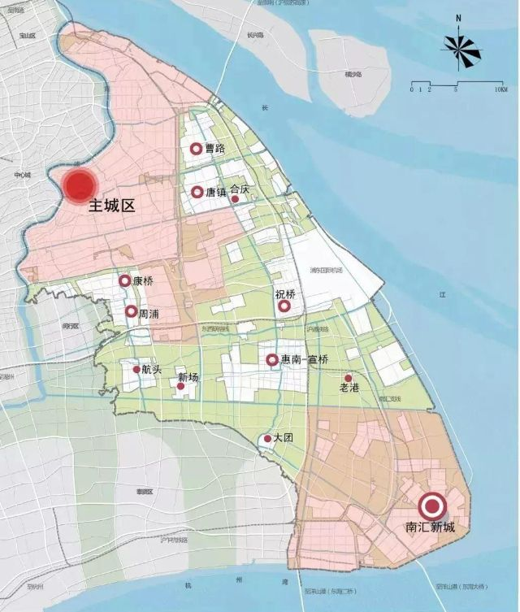
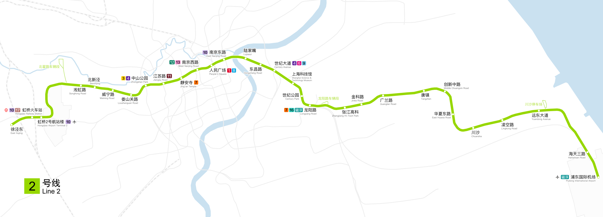
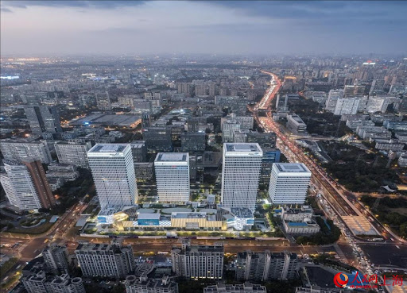
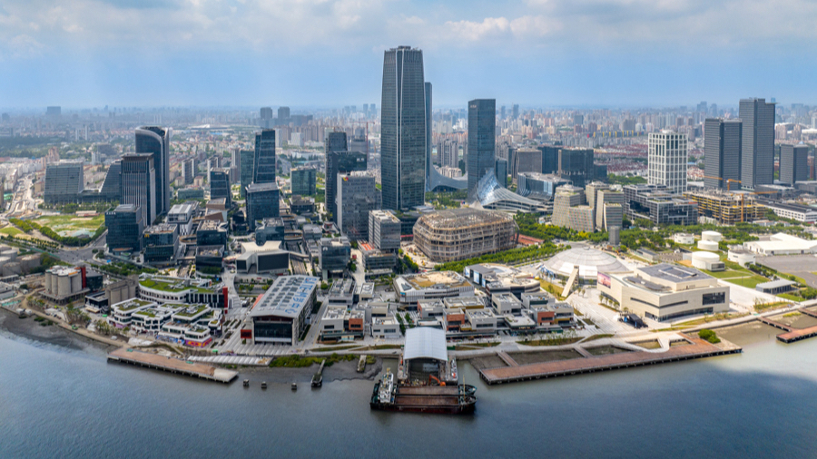

## 如何去了解上海的地理格局？

了解上海的地理格局是一项很有趣的任务，因为上海非常大，且行政区划和功能板块（如商圈、居住区）划分非常细致。

要系统地掌握上海的各个地区位置，建议你从**宏观格局、行政区划、交通骨架、生活板块**这四个维度入手。以下是具体的学习路径和查找资料的方法：

---

 第一步：建立宏观概念（一江一河与环线）

在看地图之前，先在脑海里建立两个核心坐标系，这是上海地理的“骨架”。

1.  **切分法：浦东 vs. 浦西**
    * **黄浦江**把上海切分为两半。
    * **浦西（西边）：** 老城区，历史底蕴深厚，街道密集（如黄浦、徐汇、静安）。
    * **浦东（东边）：** 新区，路宽地广，摩天大楼与高科技园区（如陆家嘴、张江）。
2.  **圈层法：内环、中环、外环**
    * 上海是典型的“摊大饼”式发展。
    * **内环内：** 核心市中心，房价最贵，资源最集中。
    * **中环间：** 成熟居住区，也就是通常说的“好地段”。
    * **外环外：** 近郊和远郊，很多大型居住社区（如也就是所谓的“睡城”）和工业区。

 第二步：善用工具查找资料（不仅仅是看地图）

不要只用一种地图，不同的APP能让你看到上海的不同面貌。

 1. 基础导航：高德地图 / 百度地图
* **怎么用：** 打开“全图模式”，缩小比例尺。
* **看什么：** 观察**黄浦江**的走向（呈W形），找到**人民广场**（由于是市中心几何中心），以此为原点去理解东南西北。

 2. 行政区划与房价：链家 (Lianjia) / 贝壳找房
* **为什么用这个：** 这是一个非常“硬核”的地理学习工具。
* **怎么用：** 打开APP的“地图找房”功能。
* **看什么：** 它会非常清晰地把上海划分为“板块”（例如：徐家汇板块、张江板块、古北板块）。这是上海人日常交流时最常用的地理概念，比单纯的行政区更有意义。

 3. 交通脉络：Metro大都会 / 上海地铁图
* **怎么用：** 下一张高清地铁线路图。
* **重点关注：**
    * **2号线：** 东西大动脉（连接虹桥机场和浦东机场，穿过南京路和陆家嘴）。
    * **1号线：** 南北大动脉（连接火车站和老居住区）。
    * **4号线：** 环线（大致沿着内环高架，圈住了市中心）。

 第三步：核心区域速记（重点关注对象）

你可以按照以下优先级去查找资料和记忆：

| 区域分类 | 代表行政区 | 关键词/特征 |
| :--- | :--- | :--- |
| **中央核心区 (CAZ)** | **黄浦区** | 外滩、南京路、人民广场。上海的门面，游客最多。 |
| **老牌富人区/小资区** | **徐汇区、静安区** | 梧桐树、洋房、精致咖啡馆。所谓的“上只角”。 |
| **金融与科技新贵** | **浦东新区** | 陆家嘴（金融）、张江（芯片/药）、金桥（制造）。 |
| **教育与居住大区** | **杨浦区、虹口区** | 高校云集（复旦同济）、生活气息浓厚。 |
| **战略副中心** | **闵行区** | 像是“第二个上海”，很大，有自己的CBD和庞大的居住区。 |
| **五大新城** | 松江、嘉定、青浦、奉贤、南汇 | 距离市中心较远，独立发展的卫星城。 |

 第四步：实战模拟（如何验证你学会了）

找资料最好的方法是带着问题去搜。你可以尝试以下几个“模拟任务”：

1.  **模拟通勤：** 假设你在“陆家嘴”上班，想租一个房租适中且通勤在45分钟内的地方，你会选哪里？（这会逼迫你去看地铁沿线的板块，如浦东的北蔡、金桥，或者宝山方向）。
2.  **寻找地标：** 在地图上找出上海的三个火车站（上海站、虹桥站、上海南站）和两个机场。它们定义了上海的对外交通方位。

---

 总结：去哪里找最直观的资料？

如果你想要图文并茂的资料，建议在**小红书**或**知乎**搜索以下关键词，效率最高：
* “上海买房板块地图” （中介做的图通常最详细，标注了地段等级）
* “上海行政区划详解”
* “上海地铁线路图高清”

**我可以为你做的下一步：**
如果你愿意，你可以告诉我你目前最关注的一个区域（比如是为了工作、旅游还是租房？），我可以利用我的知识库，为你详细拆解一下那个区域的地理特征和周边环境。

## 上海宏观概念 浦东和浦西

浦东

浦东（全称：浦东新区）非常大，它的面积约为 1200 平方公里，占了整个上海的 1/5，人口超过 500 万。

如果用“老眼光”看浦西是看文化底蕴，那么看浦东则是看**“产业功能”**。浦东的每一个板块都有非常明确的“任务分工”。

为了方便你理解和记忆，我们可以把浦东拆解为**“四大金刚”**（核心产业区）和**“南北两翼”**。

---

 一、 核心四大板块（内环与中环之间）

这四个区域是浦东的精华，也是上海经济的发动机。

 1. 陆家嘴 (Lujiazui) —— 金融与天际线
* **位置：** 黄浦江边，正对上海外滩。
* **特征：** 上海的明信片。东方明珠、上海中心、环球金融中心都在这。
* **人群：** 金融精英、投行、跨国公司总部。
* **生活感：** 房价极高，全是摩天大楼，适合工作和观光，不太适合寻找“烟火气”。

 2. 张江 (Zhangjiang) —— 科技与码农
* **位置：** 浦东的中部（主要在内中环至外环间）。
* **特征：** 被称为“中国的硅谷”。这里没有高楼大厦，全是低密度的园区。
* **关键词：** 芯片、生物医药、人工智能、程序员（传说中的“张江男”）、汇智湖。
* **地位：** 上海互联网和高科技企业最集中的地方。

 3. 金桥 (Jinqiao) —— 制造与国际社区
* **位置：** 陆家嘴的东北方向。
* **特征：** 最早是出口加工区（通用汽车等工厂），后来发展出了非常有名的**碧云国际社区**（老外很多，环境极好）。
* **现状：** 现在也在转型做研发和高端制造，生活环境比张江更宜居一些。

 4. 前滩 (Qiantan) —— “第二个陆家嘴”
* **位置：** 浦东的南边（中环线附近），黄浦江边。
* **特征：** 近5-10年才崛起的新贵。规划极其现代化，豪宅、太古里商场、惠灵顿公学（贵族学校）都在这里。
* **定位：** 它是为了承接陆家嘴溢出的功能而建的，现在是上海最热门的顶级商圈和居住区之一。

---

 二、 南北两翼与生活区

 1. 北部：外高桥 (Waigaoqiao)
* **功能：** 保税区、物流、港口。上海之所以是国际航运中心，很大程度靠这里。这里比较偏工业和贸易。

 2. 中部居住带：花木、联洋、北蔡、三林
* **功能：** 这些是围绕核心区的**纯居住板块**。
    * **花木/联洋：** 就在世纪公园旁边，是浦东传统的富人区，环境非常好。
    * **北蔡/三林：** 紧贴着中环，交通方便，是很多在陆家嘴或前滩上班的白领买房租房的首选（俗称“睡城”）。

 3. 南部远郊：川沙、周浦、康桥
* **川沙：** 著名的**上海迪士尼乐园**所在地。
* **周康（周浦/康桥）：** 所谓的“张江后花园”，因为张江房价太贵，很多程序员会选择住在这里，房价和房租相对亲民。

 4. 最东南：临港新片区 (Lingang)
* **位置：** 东海边，离市中心非常远（坐地铁要1个多小时）。
* **特征：** 滴水湖、特斯拉超级工厂、海昌海洋公园。
* **定位：** 上海面向未来的“独立城市”，政策非常优惠，很多应届生落户会首选这里。

---

 三、 浦东 vs. 浦西：生活方式的差异

在了解位置时，你也需要理解这种“氛围差”：

* **路网逻辑：**
    * **浦西：** 路窄而密，适合Citywalk（散步），路边全是小店、咖啡馆，转角有惊喜。
    * **浦东：** 路宽而直（像是美国的大道），街区尺度大，适合开车。由于规划较新，商业多集中在大型商场（Mall）里，路边小店较少。
* **交通：**
    * 浦东的地铁线路（如2号线、6号线、9号线）早晚高峰非常拥挤，因为潮汐现象明显（大家都去张江/陆家嘴上班）。

如果你要脑补浦东的地图，可以想象一条**2号线**横穿东西：
* 西头连着**陆家嘴**（钱）
* 中间穿过**世纪公园**（绿肺/富人区）
* 东边连着**张江**（科技）
* 最东头通向**浦东机场**

---

如果你把浦东看作一家“创业公司”，它的这份“简历”是上海最亮眼的。

 1. 身份与地位：不仅是一个“区”
* **行政级别：** 浦东新区是**副省级**市辖区。这意味着它拥有比普通行政区（如徐汇、黄浦）更大的管理权限和政策制定权。
* **象征意义：** 它是中国改革开放的象征。1990年以前，浦东大部分是农田，上海人常说“宁要浦西一张床，不要浦东一间房”；现在，它是上海的GDP发动机（贡献了全上海约 1/3 的经济总量）。

 2. 经济版图：三架马车
浦东的经济不仅仅靠大楼，而是靠三个核心产业支柱：

* **中国金融的“心脏” (陆家嘴)：**
    * 这里聚集了上海证券交易所、期货交易所等核心机构。
    * 如果你看到上海的宣传片，那个天际线（三件套：上海中心、环球金融、金茂）就在这里。
* **中国硬科技的“大脑” (张江)：**
    * **集成电路（芯片）：** 全国最集中的芯片研发地。
    * **生物医药：** 所谓的“药谷”。
    * **人工智能 (AI)：** 这里也是上海AI人才密度最高的地方，聚集了大量的算法公司和研究院。
* **全球贸易的“咽喉” (外高桥 & 洋山)：**
    * 依托外高桥保税区和洋山深水港，浦东支撑着上海“国际航运中心”和“国际贸易中心”的地位。特斯拉超级工厂之所以建在临港，就是为了离港口近，方便出口。

 3. 城市形态：宽阔与效率
与浦西那种“弄堂、梧桐树、小马路”的细腻感不同，浦东的城市规划带有鲜明的**功能主义**特征：
* **路网：** 道路极宽（如世纪大道），街区尺度巨大。这导致浦东更适合开车，而不那么适合步行逛街（Citywalk）。
* **居住：** 更多是封闭式的大型小区。浦东的生活方式更偏向“两点一线”的高效模式——在张江/陆家嘴高强度工作，回社区休息。

 4. 浦东的“性格”
如果把上海拟人化：
* **浦西**是一位穿着旗袍、喝着咖啡、讲究情调的**“老克勒”**。
* **浦东**则是一位穿着冲锋衣或西装、背着电脑包、讲究效率与增长的**“理工男/金融精英”**。

 总结
**浦东 = 资本 + 科技 + 速度。**
对于来上海打拼的人来说，浦西代表了“享受上海的生活”，而浦东通常代表了“参与上海的进程”。

---
这是一个非常棒的选择。把**“1990年的历史决策”**和**“今天的张江AI布局”**放在一起看，你其实是在看一部“时间穿越剧”——看一个大胆的**顶层设计**如何一步步变成精密的**产业现实**。

这就好比当年画了一张蓝图，三十年后我们来看这栋楼盖得怎么样。

 第一部分：历史的回响（1990年的关键决策）

很多人以为浦东开发只是因为“上海人住不下了”，其实当年的决策背景远比这惊心动魄。

 1. 那个特殊的时刻
**时间回到1990年初。** 那是中国改革开放面临巨大压力的时刻。国际上，苏东剧变，外部环境严峻；国内，经济面临挑战。世界都在盯着中国：**“改革开放还会继续吗？”**

 2. 邓小平的“王牌”论
1990年初，邓小平在上海过春节。他看着黄浦江对岸黑漆漆的农田，说了一句分量极重的话：
> **“上海是我们的王牌，把上海搞起来是一条捷径。”**

他认为，之前搞深圳是“特区”，现在搞上海浦东，是为了向全世界表明：**中国不仅要继续改革，而且要搞得更大！**

 3. “4.18”决策
**1990年4月18日**，李鹏总理在上海宣布：**中央决定开发开放浦东。**
这不仅仅是一个地方建设的决定，更是一个国家战略的**信号弹**。从那一刻起，浦东不再是“乡下”，而是中国连接世界的“新窗口”。

---

 第二部分：现实的投影（张江AI产业的精密布局）

当年那张“白纸”，现在被画成了什么样？以你感兴趣的**张江人工智能（AI）**为例，这绝对不是随意堆砌的公司，而是一个精心设计的**“产业生态圈”**。

如果去张江找AI，不要漫无目的地逛，要盯着这三个核心地标（我们称为“一岛、一谷、一镇”）：

 1. “最强大脑”：张江人工智能岛 (AIsland)
* **这是什么：** 这是一个真正的“岛”（三面环水），位于张江科学城的核心区，占地不大，只有6.6万平方米。
* **谁在这里：** 它是**“塔尖”**。
    * **国际巨头：** IBM、微软（Microsoft）的AI实验室是最早的“岛民”。
    * **国内巨头：** 阿里巴巴（平头哥芯片）、云从科技。
* **特点：** 这里是**“大脑中枢”**。岛上不仅有公司，连路灯、垃圾桶、灌溉系统全是AI控制的。它是上海AI密度的最高点。

 2. “机器之躯”：张江机器人谷 (Robot Valley)
* **位置：** 在张江核心区的南面（康桥一带）。
* **分工：** 如果岛是做“算法（大脑）”的，这里就是做“身体”的。
* **谁在这里：** ABB（全球机器人巨头）、微创医疗机器人。这里主要生产手术机器人、工业手臂和人形机器人。

 3. “未来孵化”：模力社区 (Moli Community)
* **这是什么：** 这是最近两年才火起来的新概念，专门针对**“大模型”**（Generative AI，像ChatGPT那样的技术）。
* **位置：** 张江核心地标“科学之门”附近。
* **特点：** 这里聚集了大量初创公司，上下楼就是上下游——楼上做算法，楼下做算力，隔壁做应用。

---

 第三部分：连接历史与未来

你看，从1990年的决策到今天的张江，你可以发现一个清晰的逻辑：

* **1990年的逻辑是“敢闯”：** 既然是王牌，就要敢于在一张白纸上画最美的图。
* **今天的逻辑是“集聚”：** 张江的AI不是散养的，而是像这就好比在这个“大厂区”里，把做大脑的、做身体的、做芯片的全部**物理距离拉近**，产生化学反应。

 接下来，你想怎么学？

既然你对“产业分布”和“历史决策”感兴趣，我可以教你两个非常实用的**“搜商”技巧**（Search Skills），这也是很多行业分析师常用的方法：

1.  **想看懂产业分布：**
    * 我可以用工具帮你查找**“张江人工智能岛的企业名单”**，或者教你如何用地图APP的“热力图”功能去看哪里公司最密集。
2.  **想深挖历史细节：**
    * 如果你对1990年的那段往事感兴趣，我可以教你搜**“浦东开发开放亲历者口述”**，这些一手资料比官方文件生动得多，里面有很多关于“为什么要建陆家嘴高楼”、“为什么要引进迪士尼”的有趣博弈故事。

你对哪一个方向更想尝试一下？

---

如果说浦东代表了**“上海的高度和速度”**，那么浦西就代表了**“上海的厚度和温度”**。

对于老上海人来说，浦西才是真正的“上海滩”。这里有梧桐树、老洋房、密集的地铁网，以及最顶级的教育和医疗资源。

要读懂浦西，不能像浦东那样看“功能区”，而要看**“圈层”**和**“文化流派”**。我们可以把浦西分为三个梯队来理解：

---

 一、 顶级核心区（所谓的“上只角”）
这三个区是上海绝对的市中心，房价最高，资源最密，也是“海派文化”的源头。

 1. 黄浦区 (Huangpu) —— 门面与底蕴
* **关键词：** 外滩、南京路、新天地、人民广场。
* **地位：** 上海的行政中心（市政府所在地）和文化原点。
* **氛围：** 游客极多，极其繁华。这里有最老的石库门（新天地），也有最高档的商业街。
* **适合：** 逛街、旅游、崇拜“老上海”情怀。

 2. 静安区 (Jing'an) —— 精致与商业
* **关键词：** 南京西路、静安寺。
* **地位：** 上海最高端的商务区（CBD）。很多顶级外企（奢侈品、咨询、法务）的总部都在这里。
* **氛围：** “洋气”。这里是上海“小资”氛围最浓的地方，街边随便一家咖啡馆可能都很贵。
* **注意：** 老闸北区并入静安后，静安区北部（上海火车站以北）稍微杂乱一些，所谓的“精致”主要指静安南部。

 3. 徐汇区 (Xuhui) —— 文化与大院
* **关键词：** 衡山路（法租界风貌）、徐家汇（商圈）、西岸（艺术与AI）。
* **地位：** 上海的文教中心（交大都在这）和政务中心。
* **特色：**
    * **衡复风貌区：** 满街梧桐树和老洋房，适合Citywalk。
    * **漕河泾开发区：** **（重点）** 浦西最大的科技园，腾讯、字节跳动、米哈游等很多互联网大厂在上海的基地都在这。
    * **徐汇滨江（西岸）：** 新兴的AI产业和艺术中心（商汤、阿里大模型多在这里）。

---

 二、 生活居住与科教区
这一圈围绕在核心区周围，生活气息更浓，是很多“新上海人”和本地土著居住的地方。

 1. 长宁区 (Changning) —— 国际化
* **关键词：** 虹桥、古北。
* **特征：** 外国人（特别是日本人、韩国人）居住密度极高。
* **氛围：** 比较低调，没有特别高的楼，但是绿化很好，居住环境安静舒适。

 2. 杨浦区 (Yangpu) —— 大学与创新
* **关键词：** 复旦、同济、五角场。
* **特征：** 上海的高校聚集地。
* **产业：** 拥有**“创智天地”**，聚集了很多创业公司和科技企业（B站总部就在这里）。相比市中心，这里年轻人更多，更有活力。

 3. 虹口区 (Hongkou) & 普陀区 (Putuo)
* **特征：** 主要是居住大区。
    * **虹口：** 也就是鲁迅公园那一带，历史文化浓厚，现在正在建设“北外滩”，试图对标陆家嘴。
    * **普陀：** 传统的工人新村较多，连接着上海的西北方向，房价在市区里相对洼地。

---

 三、 战略副中心（大浦西的外围）

 闵行区 (Minhang) —— 必须单独提
虽然闵行地跨中外环甚至外环外，但它非常重要。
* **地位：** 它是浦西人口最多、也是和市区融合最好的郊区。
* **特征：** 像一个**“微缩版上海”**。七宝、莘庄不仅是巨大的居住区，也有很强的商业活力。如果你在徐汇（漕河泾）工作，通常会首选住闵行。

---

 浦西 vs. 浦东：你要怎么选？

为了帮你构建直观的决策地图，这里有一个简单的对比逻辑：

| 维度 | 浦西 (Puxi) | 浦东 (Pudong) |
| :--- | :--- | :--- |
| **路网体验** | 路窄、密、弯曲，适合步行/骑车 | 路宽、直、大，适合开车 |
| **居住氛围** | 街边店多，下楼就是便利店，烟火气重 | 小区大而封闭，依赖商场，相对冷清 |
| **工作行业** | **广告、传媒、互联网(漕河泾/杨浦)、咨询** | **金融(陆家嘴)、芯片/医药/硬核AI(张江)** |
| **通勤逻辑** | 地铁网像蜘蛛网一样密，去哪都方便 | 严重依赖几条主干线(2号/9号)，早晚高峰挤 |

* 如果你喜欢**历史感、文艺氛围**，或者在大厂的**互联网应用层**（如游戏、电商）工作，**浦西**（特别是徐汇、杨浦）是首选。
* 如果你追求**高效率、新环境**，或者从事**硬核底层技术/金融**，**浦东**更适合。

---

漕河泾 和 徐汇滨江  这两个区域是浦西科技圈的“双子星”，但它们的气质和技术侧重点完全不同。

对于一个做算法（特别是你关注的LLM和Agent方向）的人来说，选漕河泾还是选徐汇滨江，其实是在选**“应用落地”还是“前沿探索”**。

我们可以把它们比作两家公司：漕河泾是大厂的“赚钱部门”，徐汇滨江是“研究院”。

一、 漕河泾 (Caohejing) —— 互联网的“实战修罗场”

这里是上海互联网密度最高、代码量最大的地方。

别名： 漕河泾大澡堂（因为早年某洗浴中心出名，也暗示这里加班多，像大熔炉）。

地理位置： 横跨徐汇和闵行，以地铁9号线为生命线。

1. 谁在这里？（偏应用层 & 流量变现）

这里的公司大多已经过了“烧钱”阶段，正在疯狂赚钱。

游戏圈（二次元圣地）： 米哈游 (Mihoyo) 总部就在这里（原神、崩铁的诞生地），还有莉莉丝、育碧。

互联网巨头分部： 腾讯（上海大厦）、字节跳动（很大一部分团队，特别是大力教育、电商、飞书等业务）、快手。

电商与生活： 以前的大众点评总部、现在拼多多也在附近辐射圈。

2. 算法工程师在这里做什么？

这里的AI岗位更多是为了**“业务指标”**服务的：

推荐算法： 抖音、小红书（部分）的推荐流。

广告算法： 怎么让用户多点击。

游戏AI： NPC行为、数值平衡。

特点： 极其务实，讲究高并发、高可用，对工程能力（MLOps）要求极高。

3. 生活与通勤（痛点）

地铁9号线： 上海著名的“挤人”专线。早高峰的漕河泾开发区站，进出站可能需要排队10分钟。

租房策略：

土豪版： 住公司旁边的静安新城、古美板块（老小区多，房租不便宜）。

性价比版： 沿着9号线往西去九亭、泗泾（松江区），虽然远，但便宜，是很多年轻程序员的首选。

二、 徐汇滨江 (West Bund) —— AI大模型的“名利场”

这里是上海最新的“门面”，政府正在全力把这里打造成全球AI高地。

地标： 西岸智塔 (AI Tower) —— 这栋楼是精神图腾。

地理位置： 沿着黄浦江，风景极好，靠近地铁11号线和7号线。

1. 谁在这里？（偏基础层 & 未来科技）

这里的公司很多都在做**“从0到1”**的事情，特别是大模型。

硬核AI巨头： 商汤科技 (SenseTime) 总部、阿里巴巴（部分达摩院团队）。

大模型新贵： 稀宇科技 (MiniMax)、阶跃星辰 等独角兽都在这一带。

科研国家队： 上海人工智能实验室（Shanghai AI Lab），很多顶级的Paper都是从这里发出来的。

外企研发： 微软亚洲研究院（上海）。

2. 算法工程师在这里做什么？

这里的岗位更契合你感兴趣的LLM和Agents：

基座模型训练： 搞Transformer架构优化、万卡集群调度。

前沿探索： 多模态、具身智能（Robot）。

特点： 学术氛围浓，很多人是Ph.D背景，稍微带点“高冷”的精英感。

3. 生活与通勤

环境： 极好。下楼就是江边跑道，周围全是美术馆（西岸美术馆、龙美术馆），适合在江边喝咖啡思考算法架构。

租房策略：

周边： 也就是龙华板块，房租非常贵（毕竟是豪宅区）。

过江策略： 很多人选择住在黄浦江对岸的浦东（三林、杨思），坐地铁11号线/6号线过江只要几站路，性价比高很多。

三、 总结对比（给你的决策表）

维度漕河泾 (Caohejing)徐汇滨江 (West Bund)核心关键词互联网、游戏、落地、赚钱AI大模型、艺术、愿景、烧钱技术栈偏好推荐系统、后端工程、高并发Transformer、CV、NLP、训练推理优化人群画像穿着卫衣的年轻码农，二次元含量高穿着衬衫的海归博士，精英含量高周边环境拥挤、嘈杂、充满了烟火气和加班味开阔、现代、充满了江景和咖啡味交通体验9号线（噩梦级），堵车严重11/7号线（相对舒适），路况较好建议与下一步

