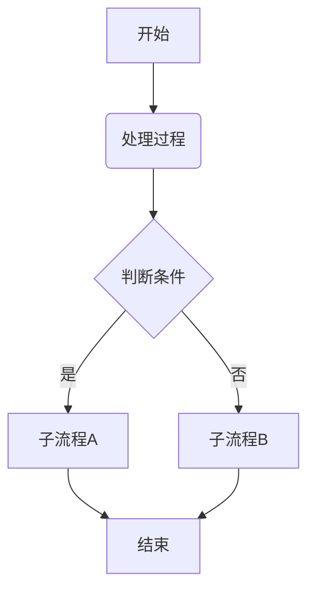

### markdown中插入流程图

#### 常见的几种方式

- 使用 Mermaid 语法：Mermaid 是一种基于文本的图表绘制工具，很多 Markdown 编辑器和平台都支持 Mermaid 语法。通过简单的文本描述，就可以生成流程图、序列图、甘特图等。

- 使用 PlantUML 语法：PlantUML 是另一个流行的基于文本的图表工具，它支持更广泛的图表类型，包括复杂的流程图。与 Mermaid 类似，许多 Markdown 环境也集成了 PlantUML。
- 使用特定 Markdown 编辑器或平台的内置功能：一些 Markdown 编辑器（如 Typora）或在线平台（如 GitLab, GitHub）提供了直接插入或渲染流程图的功能，它们可能使用上述的 Mermaid 或 PlantUML，或者有自己的实现方式。
- 插入图片：最简单直接的方法是使用专业的流程图绘制工具（如 draw.io, Lucidchart, Microsoft Visio 等）创建流程图，然后将其导出为图片（如 PNG, SVG 格式），再通过 Markdown 的图片插入语法将其插入到文档中。
-  使用 ASCII 字符画（不推荐用于复杂流程图）：对于非常简单的流程图，理论上可以用 ASCII 字符来“画”，但这非常不灵活且难以维护。

#### 使用Mermaid 语法  （目前使用，通过另外的在线网站加载）

[推荐使用的在线加载网站---min2k](https://www.min2k.com/tools/mermaid/)

Mermaid 是一种轻量级的标记语言，用于通过文本和代码创建图表和可视化内容。它很容易集成到 Markdown 文件中。

原始可以插入流程图嘛？不可以，包括在hugo的stack主题上都不支持渲染

暂时比较好的办法就是只能找一个在线的mermaid，然后把图片复制过来吧

基本语法：

