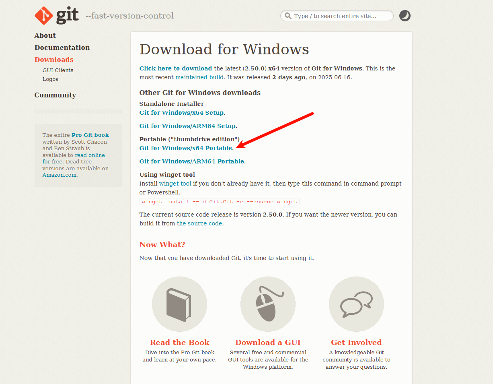
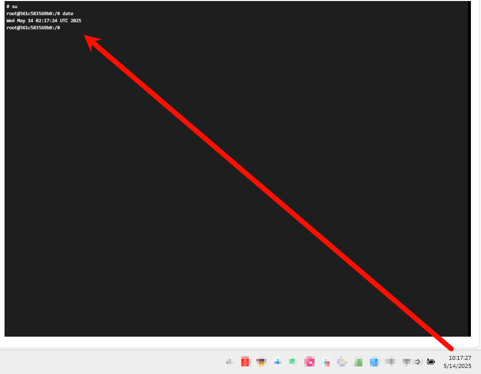
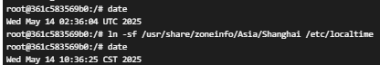
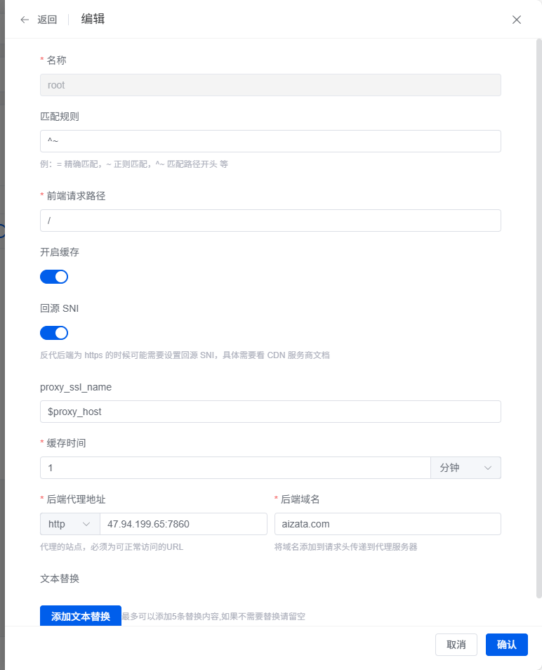

### 1panel安装

官网：   
https://1panel.cn/docs/installation/online_installation/


```bash
# ubuntu
apt install curl # 如果下面一行提示curl没有
curl -sSL https://resource.fit2cloud.com/1panel/package/quick_start.sh -o quick_start.sh && sudo bash quick_start.sh
1pctl --help # 查看是否安装成功
```


### 实战 --- 问题和解决方案


#### 腾讯云的windows服务器做远程hugo的dev服务器的时候出的问题  （之前用过华为云的服务器做dev服务器，明显腾讯做的不如华为）

1. 使用腾讯云自带的snv连接，卡的要死，所以用了windows自带的，mac上面又windows app作为远程连接
2. 使用openssh作为ssh作为服务器之后，存在总是断联问题，增加conf文件解决  [config文件解决ssh断联](https://www.zata.cc/p/ssh%E5%B8%B8%E7%94%A8%E5%91%BD%E4%BB%A4/#%E8%A7%A3%E5%86%B3-ssh-%E8%BF%9E%E6%8E%A5%E8%BF%9C%E7%A8%8B%E4%B8%BB%E6%9C%BA%E8%B6%85%E6%97%B6%E6%9C%AA%E4%BD%BF%E7%94%A8%E8%87%AA%E5%8A%A8%E6%96%AD%E5%BC%80)
3. git可以使用便携包，然后添加一下环境变量（里面的cmd文件夹），再重启服务器

4. 使用windows远程服务器进行git pull总是卡死，最终给出的解决方案就是：使用github的http地址拉取项目，然后使用ssh地址同步

#### 云服务器，修改时区设置

首先查看服务器时间，明显是错误的






```sh
# 检查时区
date  

# 通过手动链接时区文件来更改时区：
ln -sf /usr/share/zoneinfo/Asia/Shanghai /etc/localtime

# 如果有/etc/timezone 文件，可以更新它以确保一致性，当然不更新也可以
cat /etc/timezone  
echo "Asia/Shanghai" > /etc/timezone
```


#### 我自己使用1panel和云服务器的一些感悟

**在云服务器部署碰到的麻烦事：**

1. 1panel 的运行环境模式，会自动执行脚本，虽然它创建了一个docker容器，但是如果你进去想要把它的脚本关掉，它会自启动，而如果你把它的这个环境停掉，docker容器就消失了，所以不要用它的环境容器做什么事情
2. 1panel的docker连接之后要先执行一下su，不然的话命令是不好操作的，比如就没有补全功能
3. 要去/ect/hosts去设置一下github的ip地址解析，不然会很慢
4. 云服务器如果是国内厂商的，最好设置一下镜像源，不然的话会下载非常慢，比如pip install的时候


#### 1panel的反向代理


