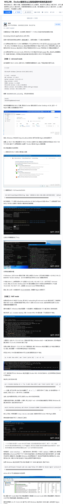

## 目录

- [WSL2中，Docker服务怎么让我局域网中其他机器访问？](#WSL2中，Docker服务怎么让我局域网中其他机器访问？)
- [我有一个项目，使用到了一个网站上我登陆后到cookie和authorization 我现在是手动更新到每次，我感觉太麻烦了，有什么简单点的方法吗](#我有一个项目，使用到了一个网站上我登陆后到cookie和authorization我现在是手动更新到每次，我感觉太麻烦了，有什么简单点的方法吗)


## 希望在本地电脑上能像操作本地文件一样，直接访问和修改远程容器里的文件目录

这是一个非常常见的开发需求，有几种成熟且高效的解决方案可以实现，我将为你详细介绍。

方案一：使用 SSHFS (最直接的“映射”方案)
SSHFS (SSH Filesystem) 是一个基于 FUSE (Filesystem in Userspace) 的文件系统客户端，它允许你通过 SSH 连接将远程目录挂载（Mount）到本地，让远程目录看起来就如同本地的一个文件夹一样。你对这个本地文件夹的所有读写操作，都会被实时地通过 SSH 协议传输到远程主机上。

这是最符合你“目录映射”需求的方案。

优点:

无缝集成：挂载后，你可以用任何本地工具（IDE、命令行、文件管理器）直接操作远程文件，完全感觉不到差异。

实时同步：所有修改都是实时的。

缺点:

性能依赖网络：由于所有文件操作都经过网络，如果网络延迟高或不稳定，读写速度会受影响。

需要额外安装：本地系统需要安装 SSHFS 客户端。

操作步骤：
1. 在本地机器上安装 SSHFS

macOS (使用 Homebrew):

Bash

brew install sshfs
注意：macOS 可能需要额外配置或允许系统扩展，请根据安装提示操作。

Linux (Debian/Ubuntu):

Bash

sudo apt-get update
sudo apt-get install sshfs
Windows:

安装 Winfsp (Windows File System Proxy)，这是一个 FUSE 的 Windows 实现。

安装 SSHFS-Win，它提供了 SSHFS 的 Windows 版本。

安装后，你可以在文件资源管理器的右键菜单中找到“Map Network Drive”，然后输入 SSH 连接信息。

2. 创建一个本地空目录作为挂载点

Bash

# 例如，在你的用户主目录下创建一个叫 remote-dev 的文件夹
mkdir ~/remote-dev
3. 执行挂载命令

基本命令格式为：sshfs [user@]hostname:[remote_directory] [local_mount_point]

假设：

远程SSH用户名：devuser

远程主机（或容器的宿主机）IP/域名：192.168.1.100

远程容器内的目录：/app

本地挂载点：~/remote-dev

执行以下命令：

Bash

sshfs devuser@192.168.1.100:/app ~/remote-dev
如果你的SSH服务运行在非标准端口（如 2222），可以这样指定：

Bash

sshfs -p 2222 devuser@192.168.1.100:/app ~/remote-dev
现在，你访问本地的 ~/remote-dev 目录，看到的就是远程服务器上 /app 目录的内容了。你可以直接用本地的 IDE 打开这个文件夹进行开发。

4. 卸载映射

当你不需要这个映射时，可以卸载它：

macOS / Linux:

Bash

umount ~/remote-dev
Windows: 在文件资源管理器中断开网络驱动器即可。


## WSL2中，Docker服务怎么让我局域网中其他机器访问？




## 我有一个项目，使用到了一个网站上我登陆后到cookie和authorization我现在是手动更新到每次，我感觉太麻烦了，有什么简单点的方法吗

您好，每次手动更新Cookie和Authorization确实非常繁琐且效率低下。这通常是因为登录凭证（特别是Authorization Token）具有时效性，过期后就需要重新获取。

要解决这个问题，核心思路就是**让你的程序/脚本自动模拟登录过程，以获取最新的Cookie和Authorization**。以下是几种从易到难、适用不同场景的自动化解决方案：

-----

### 方法一：模拟登录请求（最常用、最高效）

这是最推荐的方法。原理是分析网站登录时浏览器发送了什么网络请求，然后用你的代码（例如Python的`requests`库）去模仿这个请求，从而直接从服务器获取凭证。

**操作步骤：**

1.  **分析登录过程：**

      * 在浏览器中打开该网站的登录页面。
      * 按 `F12` 打开开发者工具，切换到 **“网络 (Network)”** 面板。
      * 勾选 `Preserve log` (或 `Persist logs`) 以免页面跳转后日志被清空。
      * 输入用户名和密码，点击登录按钮。

2.  **找到关键请求：**

      * 在网络请求列表中，找到那个负责登录的请求。它通常是 `POST` 方法，URL里可能包含 `login`, `auth`, `signin`, `token` 等关键词。
      * 点击这个请求，查看它的详细信息：
          * **Headers (标头):** 查看 `Request URL` (请求地址) 和 `Request Method` (请求方法，通常是POST)。
          * **Payload (负载) / Body (正文):** 查看你提交了哪些数据，通常是包含用户名、密码的表单数据 (Form Data) 或JSON对象。
          * **Response (响应):** 查看服务器返回了什么。`Authorization` 令牌（通常是一个很长的字符串，叫做 `token`, `access_token` 等）很可能就在返回的JSON数据里。
          * **Response Headers (响应标头):** 新的 `Cookie` 通常在 `Set-Cookie` 这个响应头里。

3.  **编写代码实现：**

      * 使用你项目的编程语言中的HTTP客户端库（如 Python 的 `requests`，Node.js 的 `axios`）来构造一个与浏览器完全相同的HTTP请求。
      * 将你的用户名和密码作为请求的 `data` 或 `json` 发送。
      * 发送请求后，从响应的JSON正文中提取 `Authorization` 令牌，并从响应头中提取 `Cookie`。

**示例 (使用Python `requests`)：**

```python
import requests

# 1. 登录获取token和cookie
login_url = 'https://example.com/api/login'  # 替换为实际的登录URL
credentials = {
    'username': 'your_username',
    'password': 'your_password'
}

# 创建一个会话对象，它能自动管理cookie
session = requests.Session()

# 发送登录请求
# 注意：根据网站要求，数据可能是 'json=credentials' 或 'data=credentials'
response = session.post(login_url, json=credentials)

# 检查登录是否成功
if response.status_code == 200:
    print("登录成功！")
    
    # 2. 从响应中提取数据
    # 假设token在返回的JSON中
    response_data = response.json()
    authorization_token = 'Bearer ' + response_data.get('token') # 格式通常是 'Bearer <token>'

    # Cookie会自动保存在session对象中，后续使用此session发起的请求会自动带上
    
    # 3. 在后续的请求中使用获取到的凭证
    headers = {
        'Authorization': authorization_token
    }
    
    # 使用session对象发送需要登录权限的请求，它会自动带上cookie
    protected_url = 'https://example.com/api/data'
    api_response = session.get(protected_url, headers=headers)
    
    print("受保护的API响应:", api_response.text)

else:
    print(f"登录失败，状态码：{response.status_code}")
    print("响应内容：", response.text)

```

**优点：**

  * **高效、快速**：没有浏览器界面的开销，执行速度快。
  * **稳定**：只要网站登录接口不变，脚本就能一直工作。
  * **易于部署**：非常适合在服务器或后台环境中运行。

**缺点：**

  * 如果网站登录逻辑复杂（例如有复杂的JavaScript加密或验证码），分析和模拟会变得困难。

-----

### 方法二：使用浏览器自动化工具

如果方法一难度太大（比如登录过程有无法绕过的验证码、密码经过了复杂的前端JS加密），你可以使用浏览器自动化工具来模拟真实用户操作。

**常用工具：**

  * **Selenium:** 最老牌、最通用的Web自动化框架。
  * **Playwright:** 由微软开发，更新、更快，API设计更现代化。

**操作步骤：**

1.  **安装相应的库** (例如 `pip install selenium` 或 `pip install playwright`) 和浏览器驱动。
2.  **编写脚本**来控制浏览器：
      * 打开登录页面。
      * 定位到用户名和密码输入框，并填入你的凭证。
      * 模拟点击登录按钮。
      * 等待页面加载完成或跳转。
      * 从浏览器中提取Cookie和`Authorization`。`Authorization`可能存储在 `localStorage` 或 `sessionStorage` 中，这些工具都提供了访问它们的方法。

**优点：**

  * **功能强大**：可以处理非常复杂的、依赖JavaScript的网站。
  * **所见即所得**：模拟的是真实用户操作，更容易理解和调试。

**缺点：**

  * **资源消耗大**：需要启动一个完整的浏览器实例，慢且占用内存。
  * **相对不稳定**：网站前端UI（如元素ID、类名）的微小改动都可能导致脚本失效。

-----

### 方法三：寻找网站的官方API

这是最理想但也是最少见的情况。检查一下该网站是否为开发者提供了官方的API。

  * **如何寻找**：通常在网站的页脚可以找到 "API"、"开发者 (Developers)"、"集成 (Integrations)" 等链接。
  * **如何使用**：官方API会提供清晰的文档，告诉你如何通过OAuth 2.0或其他认证方式获取API密钥 (API Key) 或访问令牌 (Access Token)。这种方式是官方支持的，因此最稳定、最可靠。

-----

### 总结与建议

| 方法 | 优点 | 缺点 | 适用场景 |
| :--- | :--- | :--- | :--- |
| **模拟登录请求** | **高效、稳定、资源占用少** | 登录逻辑复杂时难以实现 | **首选方案**，适用于绝大多数网站。 |
| **浏览器自动化** | 功能强大，能处理复杂JS逻辑 | 慢、资源消耗大、易受UI变化影响 | 登录过程有复杂验证码或加密，无法直接模拟请求时。 |
| **官方API** | **最稳定、最可靠、官方支持** | 并非所有网站都提供 | 网站明确提供开发者API时。 |

**给您的建议：**

1.  **首先尝试 `方法一：模拟登录请求`**。这是解决此类问题的标准工业实践。花一些时间用F12开发者工具分析，绝大多数情况都能成功。
2.  如果登录过程有难以处理的验证码或加密，再考虑使用 `方法二：浏览器自动化` 作为备选方案。
3.  最后，别忘了检查一下网站是否有 `方法三：官方API`，如果有，那将是最佳选择。

**安全提示**：在代码中处理用户名和密码时，建议使用环境变量或配置文件来存储，而不是直接硬编码在代码里，以确保安全。