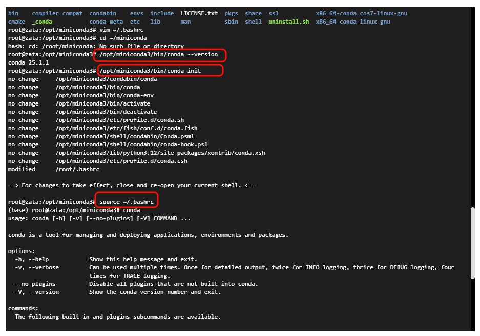
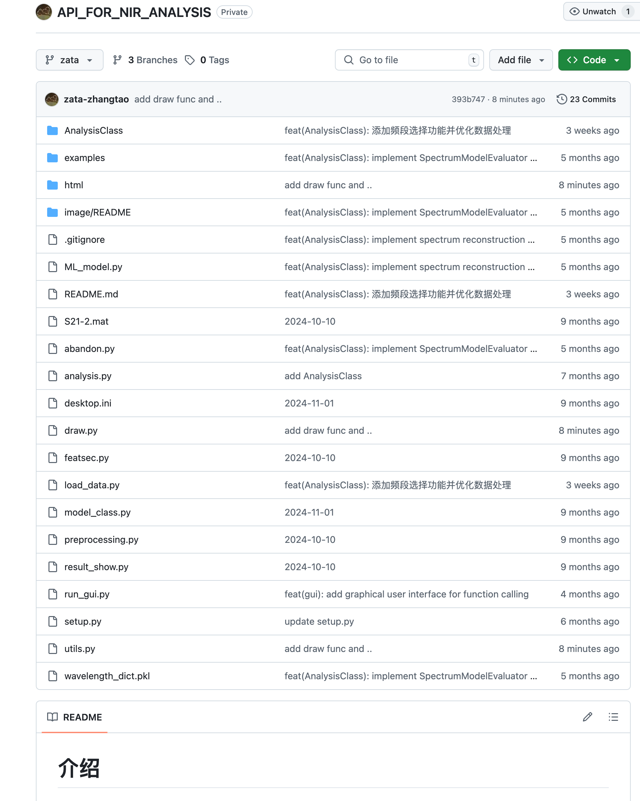
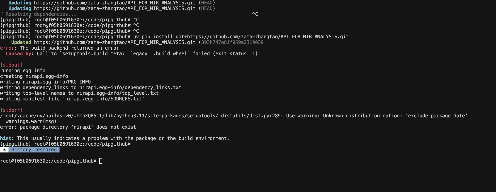
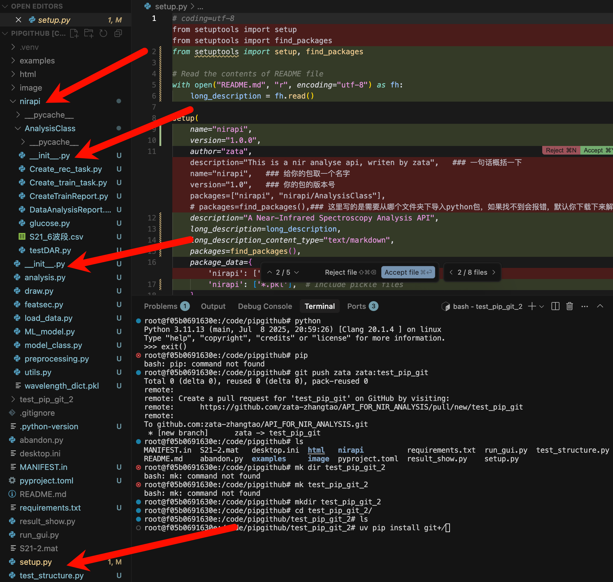
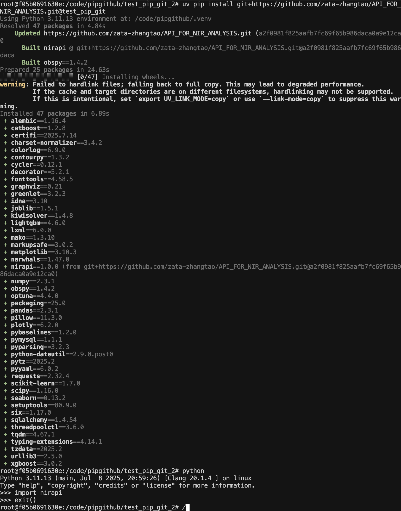

# 📚 目录

- [1. Conda 基础与常用命令](#1-conda-基础与常用命令)
- [2. Conda 安装与环境管理](#2-conda-安装与环境管理)
- [3. Pip 使用指南](#3-pip-使用指南)
- [4. 镜像源配置](#4-镜像源配置)
- [5. 将自定义代码包安装到环境](#5-将自定义代码包安装到环境)
- [6. 常见问题与解决方案](#6-常见问题与解决方案)
- [7. Conda 与 Pip 区别对比](#7-conda-与-pip-区别对比)
- [8. 将Python包发布到GitHub并通过pip安装](#8-将python包发布到github并通过pip安装)

---

## 1. Conda 基础与常用命令

### 🚀 核心命令

```bash
# 环境管理
conda create -n env_name python=3.8      # 创建新环境
conda activate env_name                   # 激活环境
conda deactivate                          # 退出环境
conda env list                            # 列出所有环境
conda env remove -n env_name              # 删除环境

# 包管理
conda install package_name                # 安装包
conda install package_name=1.2.3         # 安装特定版本
conda install -c channel_name package_name # 指定通道安装
conda remove package_name                 # 卸载包
conda list                                # 列出已安装包
conda search package_name                 # 搜索包

# 系统维护
conda --version                           # 查看版本
conda update conda                        # 更新conda
conda update --all                        # 更新所有包
conda clean --all                         # 清理缓存
```

<details>
<summary>🔧 点击展开更多高级命令</summary>

```bash
# 环境导入导出
conda env export > environment.yml       # 导出环境
conda env create -f environment.yml      # 从文件创建环境
conda list --export > requirements.txt   # 导出包列表

# 批量操作
conda create -n env_name python=3.8 numpy pandas  # 创建时安装多个包
conda install --file requirements.txt              # 批量安装
conda run -n env_name python script.py            # 在特定环境运行命令

# 配置管理
conda config --show channels             # 查看通道配置
conda config --add channels channel_name # 添加通道
conda config --remove channels channel_name # 移除通道
conda config --set channel_priority strict # 设置通道优先级
conda config --set auto_activate_base false # 禁用自动激活base

# 环境变量
conda env config vars set VAR_NAME=value # 设置环境变量
conda env config vars list               # 查看环境变量
conda env config vars unset VAR_NAME     # 删除环境变量

# 诊断工具
conda info --cache                       # 查看缓存位置
conda doctor                             # 检查环境完整性
conda list --revisions                   # 查看历史版本
conda install package_name --revision N  # 回滚到特定版本
```
</details>

---

## 2. Conda 安装与环境管理

### 📦 Conda 安装

#### Linux 系统安装

```bash
# 下载Miniconda
wget https://repo.anaconda.com/miniconda/Miniconda3-latest-Linux-x86_64.sh

# 安装
bash Miniconda3-latest-Linux-x86_64.sh

# 初始化环境
cd ~
source ~/.bashrc
```

#### 其他系统安装参考

| 操作系统 | 安装教程 |
|----------|----------|
| **Windows** | [CSDN教程](https://blog.csdn.net/ming12131342/article/details/140233867) |
| **Ubuntu** | [CSDN教程](https://blog.csdn.net/qq_41685627/article/details/139057628) |

### 🏗️ 环境管理

#### 创建环境

```bash
# 基本创建
conda create -n your_env_name python=3.8

# 创建时安装多个包
conda create -n your_env_name python=3.8 numpy scipy pandas

# 从现有环境克隆
conda create --name new_env --clone existing_env
```

#### 删除环境

```bash
# 退出环境（如果正在使用）
conda deactivate

# 删除环境
conda remove -n ENV_NAME --all
# 或者
conda env remove -n ENV_NAME
```

> ⚠️ **注意**：删除环境前请确保已退出该环境，使用 `--all` 标志会删除环境中的所有包。

---

## 3. Pip 使用指南

### 🔧 基本用法

#### 版本管理
```bash
pip --version                    # 查看版本
pip install --upgrade pip       # 升级pip
```

#### 包管理
```bash
# 安装包
pip install package_name         # 安装最新版本
pip install package_name==2.28.1 # 安装指定版本
pip install package_name>=2.0.0  # 安装最低版本

# 升级和卸载
pip install --upgrade package_name # 升级包
pip uninstall package_name         # 卸载包

# 查看信息
pip list                          # 列出已安装包
pip show package_name             # 显示包详情
pip search package_name           # 搜索包（部分版本可用）
```

#### 批量操作
```bash
# 批量安装
pip install -r requirements.txt

# 生成依赖文件
pip freeze > requirements.txt

# 生成项目依赖（推荐）
pip install pipreqs
pipreqs ./
```

### 💡 实用建议

#### 虚拟环境使用
```bash
# 创建虚拟环境
python -m venv myenv

# 激活虚拟环境
source myenv/bin/activate  # Linux/Mac
myenv\Scripts\activate     # Windows

# 退出虚拟环境
deactivate
```

#### 网络配置
```bash
# 使用代理
pip install package_name --proxy=http://代理地址:端口

# 使用国内镜像源
pip install package_name -i https://pypi.tuna.tsinghua.edu.cn/simple

# 信任主机（解决SSL问题）
pip install package_name --trusted-host pypi.org --trusted-host pypi.python.org
```

---

## 4. 镜像源配置

### 🌐 Pip 镜像源

#### 常用国内镜像源

| 镜像源 | 地址 | 特点 |
|--------|------|------|
| **清华大学** | `https://pypi.tuna.tsinghua.edu.cn/simple` | 速度快，更新及时 |
| **阿里云** | `https://mirrors.aliyun.com/pypi/simple/` | 稳定性好 |
| **中科大** | `https://pypi.mirrors.ustc.edu.cn/simple/` | 教育网友好 |
| **豆瓣** | `http://pypi.douban.com/simple/` | 老牌镜像 |
| **华为云** | `https://repo.huaweicloud.com/pypi/simple/` | 企业级稳定 |

#### 临时使用
```bash
pip install package_name -i https://pypi.tuna.tsinghua.edu.cn/simple
```

#### 永久配置

**Linux/Mac 系统**：
```bash
# 创建配置目录
mkdir -p ~/.pip

# 编辑配置文件
vim ~/.pip/pip.conf
```

**Windows 系统**：
```bash
# 配置文件位置：%USERPROFILE%\pip\pip.ini
```

**配置内容**：
```ini
[global]
index-url = https://pypi.tuna.tsinghua.edu.cn/simple
trusted-host = pypi.tuna.tsinghua.edu.cn
```

### 🔄 Conda 镜像源

#### 常用国内镜像源

| 镜像源 | 主要地址 | 配置命令 |
|--------|----------|----------|
| **清华大学** | `https://mirrors.tuna.tsinghua.edu.cn/anaconda/pkgs/main/` | `conda config --add channels https://mirrors.tuna.tsinghua.edu.cn/anaconda/pkgs/main` |
| **中科大** | `https://mirrors.ustc.edu.cn/anaconda/pkgs/main/` | `conda config --add channels https://mirrors.ustc.edu.cn/anaconda/pkgs/main` |
| **上海交大** | `https://mirror.sjtu.edu.cn/anaconda/pkgs/main/` | `conda config --add channels https://mirror.sjtu.edu.cn/anaconda/pkgs/main` |
| **阿里云** | `https://mirrors.aliyun.com/anaconda/pkgs/main/` | `conda config --add channels https://mirrors.aliyun.com/anaconda/pkgs/main` |

#### 配置示例（清华源）
```bash
# 添加清华源
conda config --add channels https://mirrors.tuna.tsinghua.edu.cn/anaconda/pkgs/main
conda config --add channels https://mirrors.tuna.tsinghua.edu.cn/anaconda/pkgs/free
conda config --add channels https://mirrors.tuna.tsinghua.edu.cn/anaconda/cloud/conda-forge

# 显示通道地址
conda config --set show_channel_urls yes
```

#### conda-forge 源
```bash
# 添加conda-forge社区源
conda config --add channels conda-forge
```

#### 管理配置
```bash
# 查看当前配置
conda config --show channels

# 恢复默认源
conda config --remove-key channels

# 移除特定通道
conda config --remove channels channel_name
```

---

## 5. 将自定义代码包安装到环境

### 📁 项目结构准备

```
project/
├── nirapi/                 # 你的代码包
│   ├── __init__.py
│   ├── utils.py
│   ├── test.py
│   └── AnalysisClass/
│       └── __init__.py
└── setup.py               # 安装配置文件
```

### ⚙️ 安装步骤

#### Step 1: 安装setuptools
```bash
pip install setuptools
```

#### Step 2: 创建setup.py文件
```python
# coding=utf-8
from setuptools import setup, find_packages

setup(
    name="nirapi",                              # 包名
    version="1.0.0",                            # 版本号
    author="zata",                              # 作者
    author_email="your.email@example.com",     # 邮箱
    description="This is a nir analyse api, written by zata",  # 简短描述
    long_description=open("README.md").read() if os.path.exists("README.md") else "",
    long_description_content_type="text/markdown",
    
    # 自动发现包
    packages=find_packages(),
    
    # 或手动指定包
    # packages=["nirapi", "nirapi.AnalysisClass"],
    
    # 包含的数据文件
    package_data={
        'nirapi': ['*.txt', '*.json', '*.yaml'],  # 包含特定文件类型
    },
    
    # 排除的文件
    exclude_package_data={
        '': ['.gitignore', '*.pyc', '__pycache__'],
        'nirapi': ['tests/*'],
    },
    
    # 依赖包
    install_requires=[
        'numpy>=1.19.0',
        'pandas>=1.2.0',
        # 其他依赖...
    ],
    
    # Python版本要求
    python_requires='>=3.6',
    
    # 分类信息
    classifiers=[
        "Development Status :: 3 - Alpha",
        "Intended Audience :: Developers",
        "License :: OSI Approved :: MIT License",
        "Programming Language :: Python :: 3",
        "Programming Language :: Python :: 3.6",
        "Programming Language :: Python :: 3.7",
        "Programming Language :: Python :: 3.8",
    ],
)
```

#### Step 3: 安装包
```bash
# 开发模式安装（推荐）
pip install -e .

# 或正常安装
pip install .

# 从其他位置安装
pip install /path/to/your/package
```

### 🔍 验证安装
```python
# 测试导入
import nirapi
print(nirapi.__version__)

# 或
from nirapi import utils
```

---

## 6. 常见问题与解决方案

### ❗ 安装与配置问题

#### 6.1 pip 忽略版本冲突
```bash
# 忽略依赖检查
pip install -r requirements.txt --no-dependencies

# 强制重新安装
pip install -r requirements.txt --force-reinstall

# 跳过失败的包继续安装
while read requirement; do
    pip install "$requirement" || echo "Failed to install $requirement, continuing..."
done < requirements.txt
```

#### 6.2 conda 命令不可用

**问题现象**：安装后 `conda --version` 提示命令不存在

**解决步骤**：
1. **验证安装位置**
   ```bash
   # 常见安装位置
   ls ~/miniconda3/bin/conda     # 默认位置
   ls /opt/miniconda3/bin/conda  # 容器环境常见位置
   ```

2. **手动初始化**
   ```bash
   # 根据实际路径调整
   /opt/miniconda3/bin/conda init bash
   source ~/.bashrc
   ```

3. **验证配置**
   ```bash
   conda --version
   ```



#### 6.3 环境名称修改
```bash
# 方法：克隆 + 删除原环境
conda create --name new_env_name --clone old_env_name
conda env remove --name old_env_name
```

### 🐛 包管理问题

#### 6.4 pip get_installed_distributions 报错

**问题**：`from pip._internal.utils.misc import get_installed_distributions` 报错

**原因**：pip 21.3+ 版本移除了该函数

**解决方案**：
```bash
# 降级pip到21.2版本
pip install pip==21.2

# 或使用新的替代方案
pip install importlib-metadata
```

#### 6.5 依赖文件生成

```bash
# 方法1：使用pip freeze（包含所有包）
pip freeze > requirements.txt

# 方法2：使用pipreqs（仅项目依赖，推荐）
pip install pipreqs
pipreqs ./ --force  # --force 覆盖现有文件

# 方法3：手动筛选核心依赖
pip freeze | grep -E "(numpy|pandas|requests)" > requirements.txt
```

### 🔧 环境问题

#### 6.6 虚拟环境激活失败
```bash
# 检查虚拟环境路径
ls venv/bin/activate  # Linux/Mac
ls venv\Scripts\activate  # Windows

# 重新创建虚拟环境
rm -rf venv
python -m venv venv
source venv/bin/activate
```

#### 6.7 包版本冲突
```bash
# 查看包依赖
pip show package_name

# 创建干净环境重新安装
conda create -n clean_env python=3.8
conda activate clean_env
pip install -r requirements.txt
```

---

## 7. Conda 与 Pip 区别对比

### 📊 详细对比表

| 维度 | **conda install** | **pip install** |
|------|-------------------|-----------------|
| **包管理范围** | Python包 + 非Python依赖（C库、编译器等） | 仅Python包 |
| **环境管理** | 与Conda环境紧密集成，强隔离 | 需要额外配置虚拟环境 |
| **包来源** | Conda仓库（预编译，兼容性好） | PyPI仓库（可能需要编译） |
| **依赖解决** | 严格的依赖解析，优先整体兼容性 | 相对宽松，可能出现版本冲突 |
| **安装速度** | 较快（预编译包） | 可能较慢（需要编译） |
| **包数量** | 相对较少但质量高 | 包数量庞大 |
| **适用场景** | 科学计算、数据科学、机器学习 | 通用Python开发、Web开发 |
| **平台支持** | 跨平台一致性好 | 依赖系统环境 |

### 🎯 使用建议

#### 优先级策略
```bash
# 1. 在Conda环境中优先使用conda
conda install numpy pandas matplotlib

# 2. conda仓库没有的包使用pip
pip install some-special-package

# 3. 避免混合使用导致冲突
```

#### 最佳实践
```bash
# ✅ 推荐做法
conda create -n myproject python=3.8
conda activate myproject
conda install numpy pandas scikit-learn  # 科学计算包用conda
pip install flask                        # Web框架用pip

# ❌ 避免做法
pip install numpy  # 在conda环境中用pip安装科学计算包
```

### 🔄 迁移建议

#### 从pip迁移到conda
```bash
# 1. 创建conda环境
conda create -n new_env python=3.8

# 2. 尝试用conda安装主要依赖
conda install numpy pandas matplotlib

# 3. 剩余包用pip安装
pip install remaining-packages
```

#### 环境同步
```bash
# 导出完整环境（包括pip安装的包）
conda env export > environment.yml

# 在新环境中重建
conda env create -f environment.yml
```


---


---

## 8. 将Python包发布到GitHub并通过pip安装
*最后更新：2025-07-15*
### 📦 创建Python包结构

构建以下目录结构：
```
your_package/
├── your_package/
│   ├── __init__.py
│   └── your_module.py
├── setup.py
├── README.md
├── LICENSE
└── requirements.txt
```

### 📝 编写关键文件

#### setup.py 示例：
```python
from setuptools import setup, find_packages

setup(
    name='your_package_name',
    version='0.1.0',
    packages=find_packages(),
    install_requires=[
        'requests>=2.25.1',
    ],
    author='Your Name',
    author_email='your.email@example.com',
    description='A short description of your package',
    long_description=open('README.md').read(),
    long_description_content_type='text/markdown',
    url='https://github.com/yourusername/your_package',
    classifiers=[
        'Programming Language :: Python :: 3',
        'License :: OSI Approved :: MIT License',
    ],
)
```

#### your_package/__init__.py：
```python
__version__ = '0.1.0'
```

### 🚀 初始化Git并上传到GitHub

```bash
git init
git add .
git commit -m "Initial commit"
git remote add origin https://github.com/yourusername/your_package.git
git branch -M main
git push -u origin main
```

### 🏷️ 创建GitHub Release（可选，但推荐）

1. 访问GitHub仓库页面，点击"Releases" -> "Create a new release"
2. 输入版本号（如v0.1.0），发布

### 📥 通过pip安装

#### 直接从GitHub安装：
```bash
pip install git+https://github.com/yourusername/your_package.git
```

#### 指定分支：
```bash
pip install git+https://github.com/yourusername/your_package.git@branch_name
```

#### 指定版本（需要有release）：
```bash
pip install git+https://github.com/yourusername/your_package.git@v0.1.0
```

### 🌐 发布到PyPI（可选，允许标准pip安装）

#### 安装工具：
```bash
pip install twine build
```

#### 构建包：
```bash
python -m build
```

#### 上传到PyPI：
```bash
twine upload dist/*
```

#### 之后可使用：
```bash
pip install your_package_name
```

### ⚠️ 注意事项

- 确保setup.py信息准确
- 设置清晰的GitHub仓库描述和topics
- 使用MIT或其他合适的许可证
- 编写详细的README.md，包含安装和使用说明
- 发布到PyPI需注册账号并配置API token

### 🔧 实际案例演示

以我的包为例：



首先，无需任何修改，直接尝试pip install（我将其改为public）：



然而安装失败了。

将包发送给AI，AI帮助修改代码，包括创建nirapi目录，2个__init__.py文件，并修改setup.py：



推送到远程后，使用：
```bash
uv pip install git+https://github.com/zata-zhangtao/API_FOR_NIR_ANALYSIS.git@test_pip_git
```



安装成功！

让我们看看一些关键文件：

#### 1. setup.py
```python
# setup.py
# coding=utf-8
from setuptools import setup, find_packages

# Read the contents of README file
with open("README.md", "r", encoding="utf-8") as fh:
    long_description = fh.read()

setup(
    name="nirapi",
    version="1.0.0",
    author="zata",
    description="A Near-Infrared Spectroscopy Analysis API",
    long_description=long_description,
    long_description_content_type="text/markdown",
    packages=find_packages(),
    package_data={
        'nirapi': ['*.pkl'],  # Include pickle files
    },
    include_package_data=True,
    python_requires=">=3.8",
    install_requires=[
        "numpy",
        "pandas",
        "scikit-learn",
        "scipy",
        "matplotlib",
        "seaborn",
        "plotly",
        "optuna",
        "pybaselines",
        "xgboost",
        "catboost", 
        "lightgbm",
        "obspy",
        "tqdm",
        "requests",
        "pymysql",
        "joblib",
    ],
    classifiers=[
        "Development Status :: 4 - Beta",
        "Intended Audience :: Science/Research", 
        "License :: OSI Approved :: MIT License",
        "Operating System :: OS Independent",
        "Programming Language :: Python :: 3",
        "Programming Language :: Python :: 3.8",
        "Programming Language :: Python :: 3.9",
        "Programming Language :: Python :: 3.10",
        "Programming Language :: Python :: 3.11",
        "Topic :: Scientific/Engineering :: Chemistry",
        "Topic :: Scientific/Engineering :: Information Analysis",
    ],
    keywords="NIR spectroscopy analysis machine-learning",
)
```

#### 2. nirapi/__init__.py
```python
"""
NIR API - A Near-Infrared Spectroscopy Analysis Package

This package provides tools for Near-Infrared spectroscopy analysis including:
- Data loading and preprocessing
- Machine learning models
- Visualization tools
- Analysis utilities
"""

__version__ = "1.0.0"
__author__ = "zata"
__description__ = "A Near-Infrared Spectroscopy Analysis API"

# Import main modules for easier access - only if dependencies are available
try:
    from . import utils
    from . import load_data
    from . import preprocessing
    from . import draw
    from . import analysis
    from . import ML_model
    from . import featsec
    from . import model_class
    
    # Make AnalysisClass available
    from . import AnalysisClass
    
    __all__ = [
        'utils',
        'load_data', 
        'preprocessing',
        'draw',
        'analysis',
        'ML_model',
        'featsec',
        'model_class',
        'AnalysisClass'
    ]
except ImportError:
    # If dependencies are not available, provide a minimal interface
    __all__ = []
    
    def __getattr__(name):
        """Lazy import for modules when dependencies are available."""
        if name in ['utils', 'load_data', 'preprocessing', 'draw', 'analysis', 
                   'ML_model', 'featsec', 'model_class', 'AnalysisClass']:
            try:
                import importlib
                module = importlib.import_module(f'.{name}', __name__)
                return module
            except ImportError as e:
                raise ImportError(f"Module {name} requires additional dependencies: {e}")
        raise AttributeError(f"module '{__name__}' has no attribute '{name}'") 
```

#### 3. nirapi/AnalysisClass/__init__.py
```python
"""
AnalysisClass subpackage for NIR API

Contains specialized analysis classes for different NIR analysis tasks.
"""

from . import Create_rec_task
from . import Create_train_task
from . import CreateTrainReport
from . import DataAnalysisReport

__all__ = [
    'Create_rec_task',
    'Create_train_task', 
    'CreateTrainReport',
    'DataAnalysisReport'
] 
```

---
