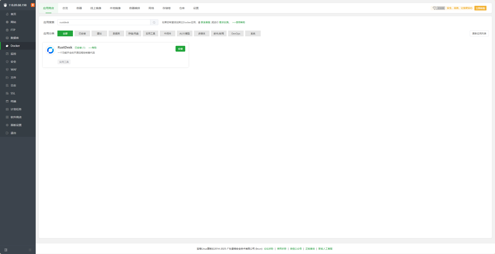
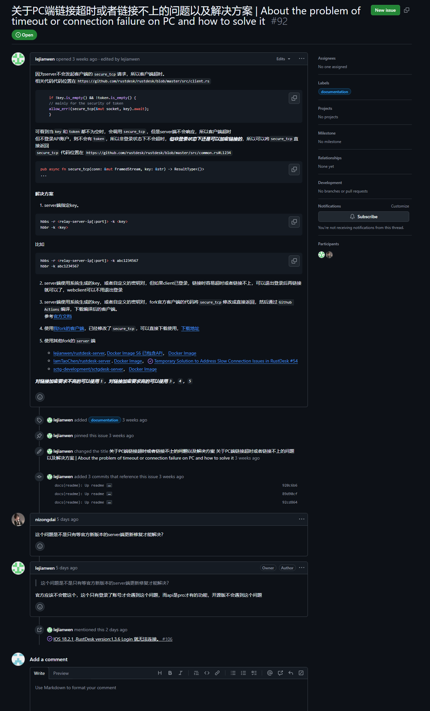

rustdesk：一款开源的远程控制软件

## docker编排 (可以安装宝塔linux或者ipanel)

### 1. 如果服务器上面没东西，可以选择安装宝塔linux，一般云服务器厂商都提供了相应的镜像可以选择安装


### 2. 安装ipanel

```bash
sudo -s


#根据自己的系统选择脚本
#RedHat / CentOS
curl -sSL https://resource.fit2cloud.com/1panel/package/quick_start.sh -o quick_start.sh && sh quick_start.sh
 
#Ubuntu
curl -sSL https://resource.fit2cloud.com/1panel/package/quick_start.sh -o quick_start.sh && sudo bash quick_start.sh
 
#Debian
curl -sSL https://resource.fit2cloud.com/1panel/package/quick_start.sh -o quick_start.sh && bash quick_start.sh

# 随后根据提示安装
 
```


### 搭建中继服务器
1. 如果安装了宝塔面板的话，直接进入如下位置，然后再商店里面搜索就有，点击安装，然后查看日志，就可以看见key，记得把ke复制下来



2. 如果是ipanel的话，可以使用编排进行，在编排日志里面可以看见key

```csharp
services:
  rustdesk_Y662:
    image: rustdesk/rustdesk-server-s6:${VERSION}
    #    container_name: ${CONTAINER_NAME}
    deploy:
      resources:
        limits:
          cpus: ${CPUS}
          memory: ${MEMORY_LIMIT}
    environment:
        - RELAY=${RUSTDESK_HOST_ADDR}:${RUSTDESK_PORT_HBBR}
        - ENCRYPTED_ONLY=1
    ports:
        - ${HOST_IP}:${RUSTDESK_PORT_NAT}:21115
        - ${HOST_IP}:${RUSTDESK_PORT_HBBS}:21116
        - ${HOST_IP}:${RUSTDESK_PORT_HBBS}:21116/udp
        - ${HOST_IP}:${RUSTDESK_PORT_HBBR}:21117
        - ${HOST_IP}:${RUSTDESK_PORT_WEB_CLIENT_1}:21118
        - ${HOST_IP}:${RUSTDESK_PORT_WEB_CLIENT_2}:21119
    restart: always
    volumes:
        - ${APP_PATH}/data:/data
    labels:
      createdBy: "bt_apps"
    networks:
      - baota_net

networks:
  baota_net:
    external: true
```


到这一步就可以了，搭建api服务器会很麻烦

----- 


### 搭建api服务器
```bash
networks:
  rustdesk-net:
    external: false

services:
  rustdesk:
    image: lejianwen/rustdesk-api:full-s6
    ports:
      - "【所开发的端口，如：29288】:21114"    # 添加引号确保端口格式正确第一个是服务器开放的端口，是需要改的
    environment:
      RELAY: "【server_ip】:21117"
      ENCRYPTED_ONLY: "1"
      TZ: "Asia/Shanghai"
      RUSTDESK_API_RUSTDESK_ID_SERVER: "【server_ip】:21116"
      RUSTDESK_API_RUSTDESK_RELAY_SERVER: "【server_ip】:21117"
      RUSTDESK_API_RUSTDESK_API_SERVER: "http://【server_ip】:【所开发的端口，如：29288】"
    volumes:
      - /data/rustdesk/server:/data
      - /data/rustdesk/server:/app/conf/data
      - /data/rustdesk/api:/app/data
    networks:
      - rustdesk-net
    restart: unless-stopped
```


### 关于PC端链接超时或者链接不上的问题以及解决方案 | About the problem of timeout or connection failure on PC and how to solve it 

https://github.com/lejianwen/rustdesk-api/issues/92




### 参考:

> https://www.smianao.com/1323.html
> https://www.smianao.com/1340.html
> https://github.com/lejianwen/rustdesk-api/issues/92

