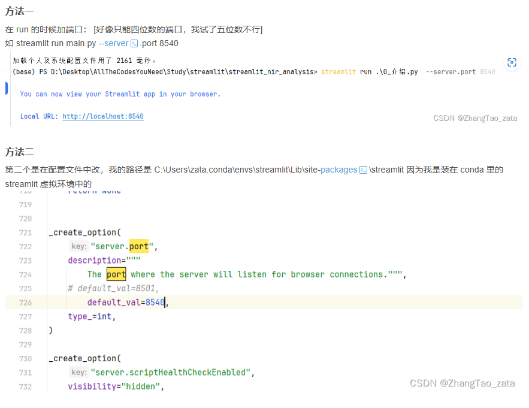
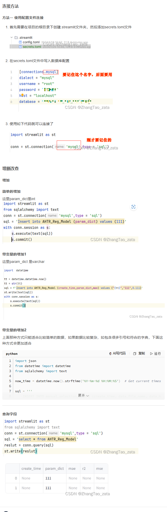

## 一些问题和使用技巧


### streamlit之下使用optuna做多进程调参

``` py
import streamlit as st
import optuna
import multiprocessing
import time

# 模拟一个简单的目标函数
def objective(trial):
    x = trial.suggest_float('x', -10, 10)
    return (x - 2) ** 2

# 优化函数
def optimize(study, n_trials, progress_queue):
    for i in range(n_trials):
        study.optimize(objective, n_trials=1)
        progress_queue.put(study.best_value)

def main():
    st.title("Optuna Optimization Progress Display")
    chose_n_trials = st.number_input("Choose number of trials", min_value=10, max_value=1000, value=100)
    
    # 创建或加载Optuna study
    study_name = 'optuna_study'
    try:
        study = optuna.create_study(study_name=study_name, storage='sqlite:///optuna_study.db', direction='minimize')
    except:
        study = optuna.load_study(study_name=study_name, storage='sqlite:///optuna_study.db')
    
    if st.button("Start Optimization"):
        progress_queue = multiprocessing.Queue()
        n_processes = 4  # 设置并行进程数
        trials_per_process = chose_n_trials // n_processes

        # 启动多进程优化
        processes = []
        for _ in range(n_processes):
            p = multiprocessing.Process(target=optimize, args=(study, trials_per_process, progress_queue))
            p.start()
            processes.append(p)
        
        # 初始化进度条
        progress_bar = st.progress(0)
        best_score = float('inf')

        for _ in range(chose_n_trials):
            best_value = progress_queue.get()
            if best_value < best_score:
                best_score = best_value
            progress = (_ + 1) / chose_n_trials
            progress_bar.progress(progress)
            st.write(f"Best score: {best_score}")

        # 确保所有进程完成
        for p in processes:
            p.join()

        st.success("Optimization completed!")

if __name__ == "__main__":
    main()


```


### 以一种访问权限不允许的方式做了一个访问套接字的尝试|端口占用



### streamlit连接数据库 并且 增删改查


