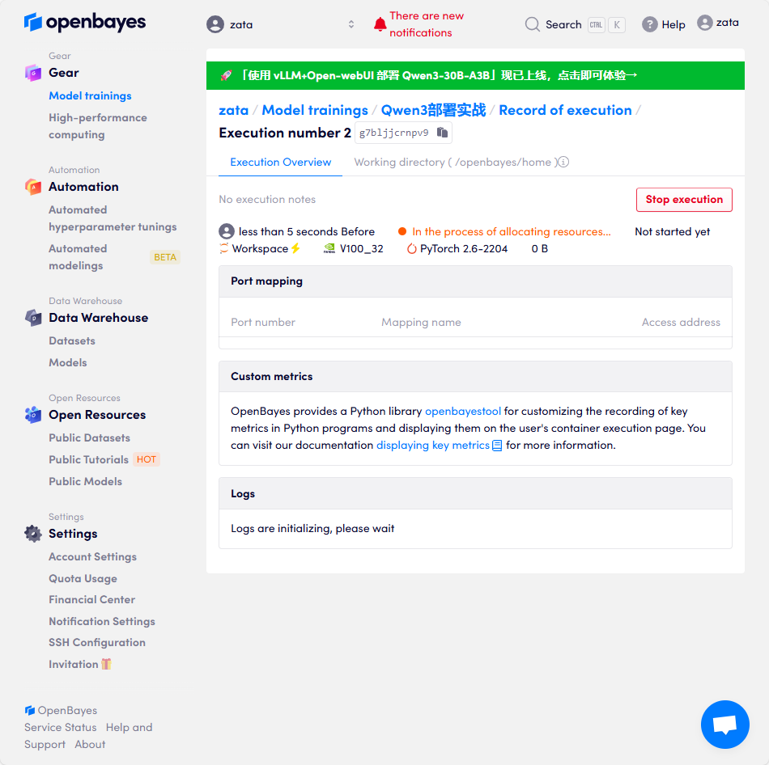
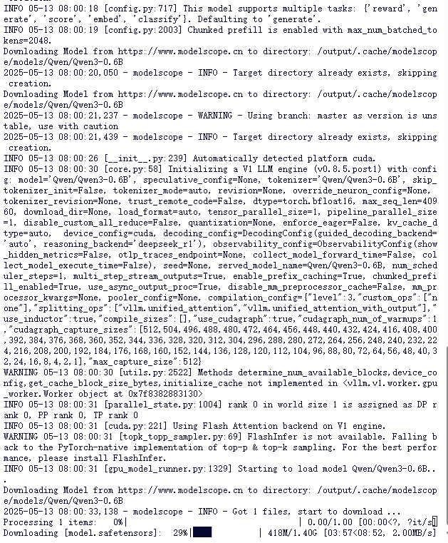
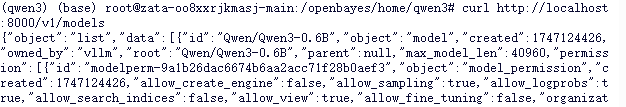
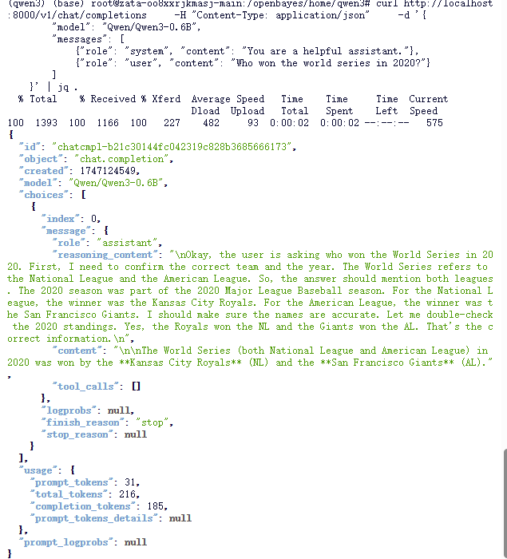
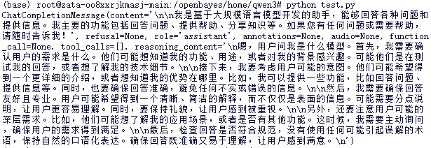
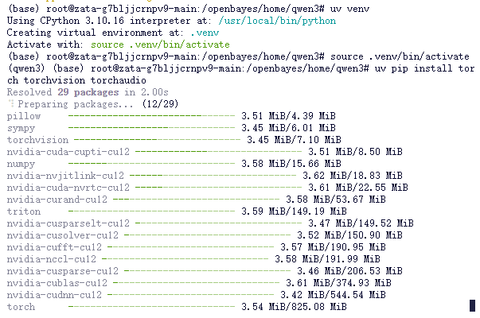
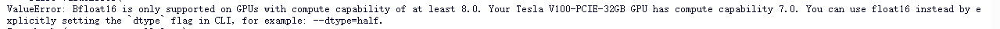
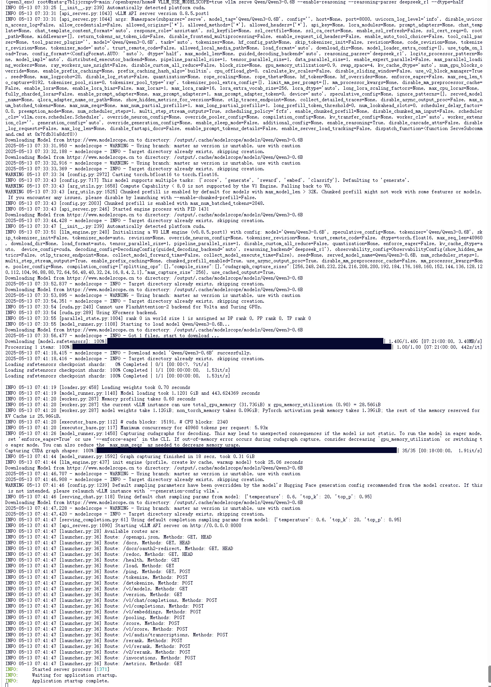
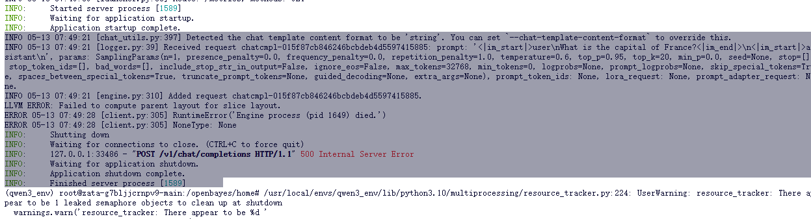

参考
[知乎](https://zhuanlan.zhihu.com/p/678869505)


---


## 常用命令

```sh
# 通过魔搭社区构建
VLLM_USE_MODELSCOPE=true vllm serve [魔搭建社区的模型名，如：Qwen/Qwen3-0.6B-FP8] --enable-reasoning --reasoning-parser deepseek_r1

# 通过本地模型文件构建
python -m vllm.entrypoints.openai.api_server --model ~/Qwen3-0.6B  --served-model-name Qwen3-0.6B --max-model-len=2048


```


## 基本使用

### 什么是 vLLM？

vLLM 是一个为大型语言模型（LLM）推理和服务而设计的高性能开源库。它通过引入创新的技术，如 PagedAttention 和连续批处理（Continuous Batching），显著提高了吞吐量并有效管理内存，使得在生产环境中部署 LLM 更加高效。

**核心优势:**

* **高吞吐量:** 通过 PagedAttention 和连续批处理等技术，vLLM 能够处理更多的请求。
* **内存效率:** PagedAttention 有效地管理注意力机制中的键（key）和值（value）缓存，减少内存浪费和碎片。
* **易用性:** 与 Hugging Face Transformers 模型无缝集成，并提供 OpenAI 兼容的 API 服务器。
* **灵活性:** 支持多种解码算法（如并行采样、束搜索等）、张量并行和流水线并行以进行分布式推理。
* **广泛的模型支持:** 支持许多流行的开源 LLM。

### 1. 安装 vLLM

vLLM 需要 Linux 环境、Python 3.8 或更高版本，以及具有 CUDA 计算能力 7.0 或更高版本的 NVIDIA GPU（例如 V100, T4, RTX20xx, A100, L4, H100 等）。vLLM 通常使用特定版本的 CUDA 进行编译（例如 CUDA 12.1）。

**推荐使用 Conda 创建新环境:**

```bash
conda create -n vllm-env python=3.9 -y
conda activate vllm-env
```

**通过 pip 安装 (通常需要与你的 CUDA 版本匹配):**

```bash
# 安装与 CUDA 12.1 兼容的 vLLM
pip install vllm
```

如果你本地的 CUDA 版本不同，或者想使用特定的 PyTorch 版本，可能需要从源码编译或者安装特定 CUDA 版本的预编译包。请参考 vLLM 官方文档获取最新的安装指南和针对不同 CUDA 版本的安装命令。

**查看官方文档获取最新和更详细的安装说明:** [https://docs.vllm.ai/en/latest/getting_started/installation.html](https://docs.vllm.ai/en/latest/getting_started/installation.html)

### 2. 基本离线推理 (Python API)

你可以直接在 Python 脚本中使用 vLLM 进行离线推理。

```python
from vllm import LLM, SamplingParams

# 准备你的提示语列表
prompts = [
    "Hello, my name is",
    "The president of the United States is",
    "The capital of France is",
    "The future of AI is",
]

# 初始化采样参数
# temperature: 控制生成文本的随机性，值越高越随机。
# top_p: 核采样，选择概率总和达到 top_p 的最小词汇集。
# max_tokens: 控制生成的最大 token 数量。
sampling_params = SamplingParams(temperature=0.8, top_p=0.95, max_tokens=50)

# 从 Hugging Face Hub 加载模型
# 你可以选择不同的模型，例如 "meta-llama/Llama-2-7b-chat-hf", "mistralai/Mistral-7B-v0.1" 等
# 确保你已经登录 Hugging Face CLI 并且接受了模型的 license (如果需要)
# export HF_TOKEN=YOUR_HUGGINGFACE_TOKEN (如果模型需要授权)
llm = LLM(model="facebook/opt-125m") # 这是一个小模型，方便快速测试

# 执行推理
outputs = llm.generate(prompts, sampling_params)

# 打印输出结果
for output in outputs:
    prompt = output.prompt
    generated_text = output.outputs[0].text
    print(f"Prompt: {prompt!r}, Generated: {generated_text!r}")
```

### 3. 启动 OpenAI 兼容的 API 服务器

vLLM 可以启动一个与 OpenAI API 兼容的服务器，允许你通过 HTTP 请求与模型交互，这对于将 LLM 集成到现有应用中非常方便。

```bash
# 启动 API 服务器，将 MODEL_NAME 替换为你想要服务的 Hugging Face 模型名称
# 例如: facebook/opt-125m, meta-llama/Llama-2-7b-chat-hf
# --model: 指定要加载的模型
# --tensor-parallel-size: (可选) 如果你有多个 GPU，可以使用张量并行来加速，例如 --tensor-parallel-size 2 表示使用 2 个 GPU
python -m vllm.entrypoints.openai.api_server --model="facebook/opt-125m"

# 服务器默认运行在 http://localhost:8000
# 你可以通过 --host 和 --port 参数修改
# 例如: python -m vllm.entrypoints.openai.api_server --model="facebook/opt-125m" --host 0.0.0.0 --port 8080
```

一旦服务器运行起来，你就可以像使用 OpenAI API 一样向它发送请求。

**使用 `curl` 测试 API 服务器 ( Completions API - 适用于非聊天模型 ):**

```bash
curl http://localhost:8000/v1/completions \
    -H "Content-Type: application/json" \
    -d '{
        "model": "facebook/opt-125m",
        "prompt": "San Francisco is a",
        "max_tokens": 7,
        "temperature": 0
    }'
```

**使用 `curl` 测试 API 服务器 ( Chat Completions API - 适用于聊天模型 ):**

对于像 Llama-2-chat 这样的聊天模型，你应该使用 `/v1/chat/completions` 端点。

```bash
# 假设你已经使用聊天模型启动了服务器，例如:
# python -m vllm.entrypoints.openai.api_server --model="meta-llama/Llama-2-7b-chat-hf"

curl http://localhost:8000/v1/chat/completions \
    -H "Content-Type: application/json" \
    -d '{
        "model": "meta-llama/Llama-2-7b-chat-hf",
        "messages": [
            {"role": "system", "content": "You are a helpful assistant."},
            {"role": "user", "content": "Who won the world series in 2020?"}
        ],
        "max_tokens": 50,
        "temperature": 0.7
    }'
```

**使用 Python `openai` 库与 vLLM 服务器交互:**

首先，安装 `openai` 库: `pip install openai`

```python
import openai

# 修改 openai.api_base 指向你的 vLLM 服务器
openai.api_base = "http://localhost:8000/v1"
openai.api_key = "YOUR_API_KEY" # 对于本地 vLLM 服务器，API 密钥通常是可选的或任意字符串，如 "EMPTY"

# 列出可用的模型 (会返回你通过 --model 参数指定的模型)
models = openai.Model.list()
print("Available models:", models.data)

if models.data:
    model_name = models.data[0].id # 获取第一个可用的模型名称
    print(f"Using model: {model_name}")

    # Chat Completions 示例
    try:
        chat_completion = openai.ChatCompletion.create(
            model=model_name,
            messages=[
                {"role": "system", "content": "You are a helpful assistant."},
                {"role": "user", "content": "What is the capital of France?"}
            ],
            temperature=0.7,
            max_tokens=50
        )
        print("Chat Completion:", chat_completion.choices[0].message['content'])
    except Exception as e:
        print(f"Error in Chat Completion: {e}")

    # Legacy Completions 示例 (如果模型支持)
    try:
        completion = openai.Completion.create(
            model=model_name,
            prompt="The capital of France is",
            max_tokens=10,
            temperature=0
        )
        print("Completion:", completion.choices[0].text)
    except Exception as e:
        print(f"Error in Completion: {e}")
else:
    print("No models available from the server.")

```

### 4. 常用参数说明

无论是在 Python API 还是 OpenAI 兼容服务器中，一些核心参数是共通的：

* `model` (字符串): 指定要加载的 Hugging Face 模型仓库的名称 (例如, `"facebook/opt-125m"`, `"meta-llama/Llama-2-7b-chat-hf"`)。
* `temperature` (浮点数, 通常在 0.0 到 2.0 之间): 控制输出的随机性。较低的温度使输出更具确定性和重复性，较高的温度则更具创造性和多样性。建议值：0.7-1.0 适用于创造性任务，0.0-0.2 适用于需要精确和事实性回答的任务。
* `top_p` (浮点数, 通常在 0.0 到 1.0 之间): 核采样参数。模型会从概率总和达到 `top_p` 的最小词汇集合中进行采样。例如，`top_p=0.9` 表示只考虑概率加起来达到90%的最可能的词。通常不与 `temperature` 同时设为非默认值。
* `top_k` (整数): 从 logits 最高的 K 个 token 中进行采样。如果设置为非零值，则会覆盖 `top_p`。
* `max_tokens` (整数): 生成响应的最大 token 数量。注意这包括了输入提示和输出。
* `n` (整数): 为每个输入提示生成多少个独立的候选项。
* `presence_penalty` (浮点数): 对已经出现在文本中的 token 施加惩罚，降低重复性。
* `frequency_penalty` (浮点数): 与 `presence_penalty` 类似，但惩罚的程度与 token 在文本中出现的频率成正比。
* `stop` (字符串或列表): 一个或多个停止序列。当模型生成这些序列时，会停止进一步的生成。

查阅 vLLM 和 OpenAI 的文档可以获取更详细的参数列表和解释。

### 5. 进阶特性 (简介)

vLLM 支持许多高级功能以优化性能和扩展能力：

* **量化 (Quantization):** 支持如 AWQ, GPTQ, SqueezeLLM 等量化方法，以更低的精度（如 INT8, INT4）运行模型，减少内存占用和加速推理，但可能会有轻微的精度损失。
    * 示例 (GPTQ): `llm = LLM(model="TheBloke/Llama-2-7B-GPTQ")`
* **LoRA (Low-Rank Adaptation):** 高效地微调或加载经过 LoRA 适配器调整的模型。vLLM 支持动态加载和卸载 LoRA 适配器。
* **分布式推理 (Distributed Inference):**
    * **张量并行 (Tensor Parallelism):** 将模型的权重和计算分布到多个 GPU 上，以运行单个大型模型。在启动服务器或 `LLM` 类时使用 `tensor_parallel_size` 参数。
        ```python
        # Python API
        llm = LLM(model="your_large_model", tensor_parallel_size=4) # 使用 4 个 GPU
        ```
        ```bash
        # API 服务器
        python -m vllm.entrypoints.openai.api_server --model="your_large_model" --tensor-parallel-size 4
        ```
    * **流水线并行 (Pipeline Parallelism):** (vLLM 对此的支持可能仍在发展中，主要依赖于底层模型的实现方式，通常张量并行更为直接)
* **前缀缓存 (Prefix Caching / Automatic Prefix Caching):** 自动缓存和重用共享前缀的 KV 缓存，加速具有共同前缀的请求序列。
* **投机解码 (Speculative Decoding):** 使用一个小的、快速的草稿模型来预测多个 token，然后由主模型进行验证，以加速解码过程。
* **多模态支持:** vLLM 正在扩展对多模态模型（如 LLaVA）的支持。

这些高级特性的具体用法请参考 vLLM 的官方文档和示例。

### 6. 常见用例

vLLM 因其高性能和高吞吐量，非常适合以下场景：

* **实时聊天机器人和虚拟助手:** 需要低延迟响应。
* **大规模文本生成服务:** 如内容创作、代码生成、摘要等。
* **批处理推理任务:** 对大量数据进行离线处理。
* **需要高效扩展 AI 驱动的工作流:** 当用户量或数据量增长时，vLLM 可以帮助系统保持性能。
* **研究和实验:** 快速迭代和测试不同的 LLM。


### 7. 更多资源

* **vLLM GitHub 仓库:** [https://github.com/vllm-project/vllm](https://github.com/vllm-project/vllm)
* **vLLM 官方文档:** [https://docs.vllm.ai/](https://docs.vllm.ai/)
* **vLLM 示例:** [https://docs.vllm.ai/en/latest/getting_started/examples/examples_index.html](https://docs.vllm.ai/en/latest/getting_started/examples/examples_index.html)


## 实战


### vllm部署 Qwen3 ：使用4090  （成功）


[https://www.modelscope.cn/models/Qwen/Qwen3-32B](https://www.modelscope.cn/models/Qwen/Qwen3-32B)


我使用的是bayes平台，首先创建一个容器




<span style="color:red">我选的是自带vllm环境的容器,所以并没有涉及到安装环境</span>


执行如下命令
```sh
VLLM_USE_MODELSCOPE=True vllm serve Qwen/Qwen3-0.6B --enable-reasoning --reasoning-parser deepseek_r1
```




首先查看有哪些模型
```sh
curl http://localhost:8000/v1/models
```



```sh
# 如果jq没安装 apt install jq

curl http://localhost:8000/v1/chat/completions \
    -H "Content-Type: application/json" \
    -d '{
        "model": "Qwen/Qwen3-0.6B",
        "messages": [
            {"role": "system", "content": "You are a helpful assistant."},
            {"role": "user", "content": "Who won the world series in 2020?"}
        ]
    }' | jq .
```




也可以使用如下的py代码

```sh
from openai import OpenAI
client = OpenAI(
    base_url="http://localhost:8000/v1",
    api_key="token-abc123", # 随便设，只是为了通过接口参数校验
)

completion = client.chat.completions.create(
  model="Qwen/Qwen3-0.6B",
  messages=[
      {"role": "user", "content": "你是什么模型？"}
  ]
)

print(completion.choices[0].message)
```





### vllm部署 Qwen3 ：使用v100_32  （失败）

我使用的是bayes平台，首先创建一个容器


1. 然后是环境的准备

推荐使用uv安装，因为快啊


```sh

mkdir qwen3

cd qwen3

pip install uv

uv venv

source ./venv/bin/activate

# uv pip install cudatoolkit=12.1 -y

# uv pip install torch torchvision torchaudio   # 也可以配置一下镜像源

# python -c 'import torch; print(torch.cuda.is_available())'

uv pip install vllm ray transformers accelerate

```

```bash
# 创建conda环境
conda create -n qwen3 python=3.10 -y # -y表示无需确认
conda activate qwen3

# 安装CUDA相关依赖（确保与vLLM兼容的CUDA版本）
# vLLM通常编译于CUDA 12.1
conda install cudatoolkit=12.1 -y

# 安装PyTorch（确保与CUDA版本兼容）
pip install torch torchvision torchaudio

# 检查CUDA是否正确安装
python -c 'import torch; print(torch.cuda.is_available())'

pip install vllm ray transformers accelerate
```

2. 然后配置魔搭（许多服务器不支持翻墙，所以hugging face可能难用）

```sh
pip install modelscope
```

之后vllm应用就可以默认从modelscope上下载镜像了。

[https://www.modelscope.cn/models/Qwen/Qwen3-32B](https://www.modelscope.cn/models/Qwen/Qwen3-32B)


```sh
VLLM_USE_MODELSCOPE=True vllm serve Qwen/Qwen3-0.6B --enable-reasoning --reasoning-parser deepseek_r1
```



然后修改成以下命令
```sh
VLLM_USE_MODELSCOPE=True vllm serve Qwen/Qwen3-0.6B --enable-reasoning --reasoning-parser deepseek_r1 --dtype=half
```




此外，我们也可以用本地的镜像文件进行模型部署，方法如下（我这里选择用本地，比较灵活）。

```sh
git lfs clone https://www.modelscope.cn/Qwen/Qwen3-0.6B.git

python -m vllm.entrypoints.openai.api_server --model ~/Qwen3-0.6B  --served-model-name Qwen3-0.6B --max-model-len=2048
```


之后进行测试：可以使用python进行测试：


```sh
from openai import OpenAI
client = OpenAI(
    base_url="http://localhost:8000/v1",
    api_key="token-abc123", # 随便设，只是为了通过接口参数校验
)

completion = client.chat.completions.create(
  model="Qwen3-0.6B",
  messages=[
      {"role": "user", "content": "你是什么模型？"}
  ]
)

print(completion.choices[0].message)
```

