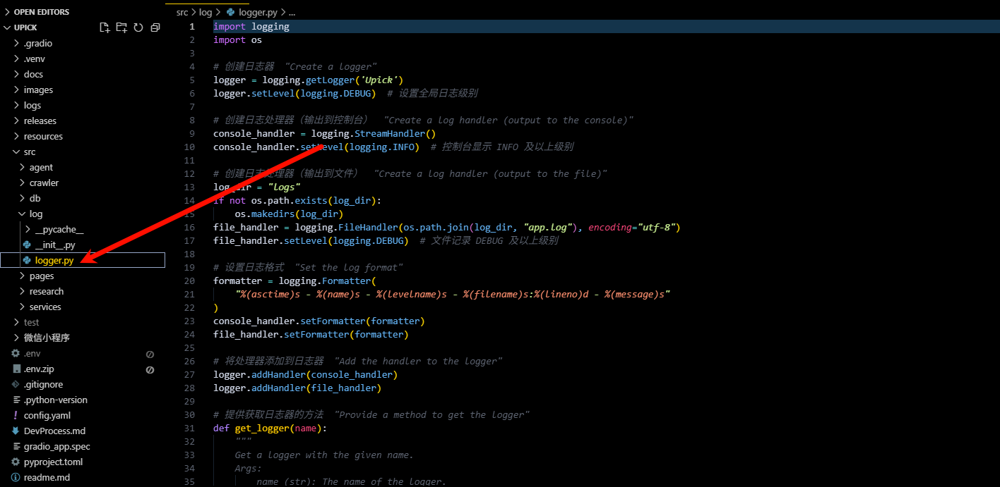

### 日志的编写

在项目中写日志是一个非常重要也是非常好的习惯，可以帮我错误的溯源。我习惯于创建一个get_logger(name)方法，然后其他文件都使用这个方法去创建日志


下面是logger.py的写法

```py
import logging
import os

# 创建日志器  "Create a logger"
logger = logging.getLogger('Upick')
logger.setLevel(logging.DEBUG)  # 设置全局日志级别

# 创建日志处理器（输出到控制台）  "Create a log handler (output to the console)"
console_handler = logging.StreamHandler()
console_handler.setLevel(logging.INFO)  # 控制台显示 INFO 及以上级别

# 创建日志处理器（输出到文件）  "Create a log handler (output to the file)"
log_dir = "logs"
if not os.path.exists(log_dir):
    os.makedirs(log_dir)
file_handler = logging.FileHandler(os.path.join(log_dir, "app.log"), encoding="utf-8")
file_handler.setLevel(logging.DEBUG)  # 文件记录 DEBUG 及以上级别

# 设置日志格式  "Set the log format"
formatter = logging.Formatter(
    "%(asctime)s - %(name)s - %(levelname)s - %(filename)s:%(lineno)d - %(message)s"
)
console_handler.setFormatter(formatter)
file_handler.setFormatter(formatter)

# 将处理器添加到日志器  "Add the handler to the logger"
logger.addHandler(console_handler)
logger.addHandler(file_handler)

# 提供获取日志器的方法  "Provide a method to get the logger"
def get_logger(name):
    """
    Get a logger with the given name.
    Args:
        name (str): The name of the logger.
    Returns:
        logging.Logger: The logger.
    """
    return logging.getLogger(f"Upick.{name}")
```


使用的时候就使用logger = get_logger(__name__)这样的方法 来创建