## clash 


项目地址：

https://github.com/zzzgydi/clash-verge/tree/main

[](images/index/Clash.Verge_1.3.8_x64-setup.exe)


### clash 基础知识 - clash 介绍

参考

[Clash for Windows 使用教程快速入门篇](https://clashforwindows.org/)


Clash for Windows是代理工具Clash在Windows系统的图形客户端，同时还支持Windows、Linux、macOS三大系统，功能强大且支持多种代理协议，如Shadowsocks(SS)、ShadowsocksR(SSR)、Socks、Snell、V2Ray、Trojan等代理协议。通过本文2025最新Clash for Windows使用教程快速入门篇所掌握的技巧，能快速方便配置代理协议进行代理访问。

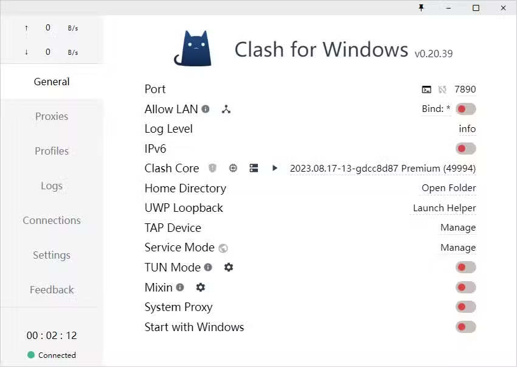


官方的clash现在已经删库跑路了，不过还是有很多其他人在做，下面是其中一些

[clash verge - github](https://github.com/zzzgydi/clash-verge)

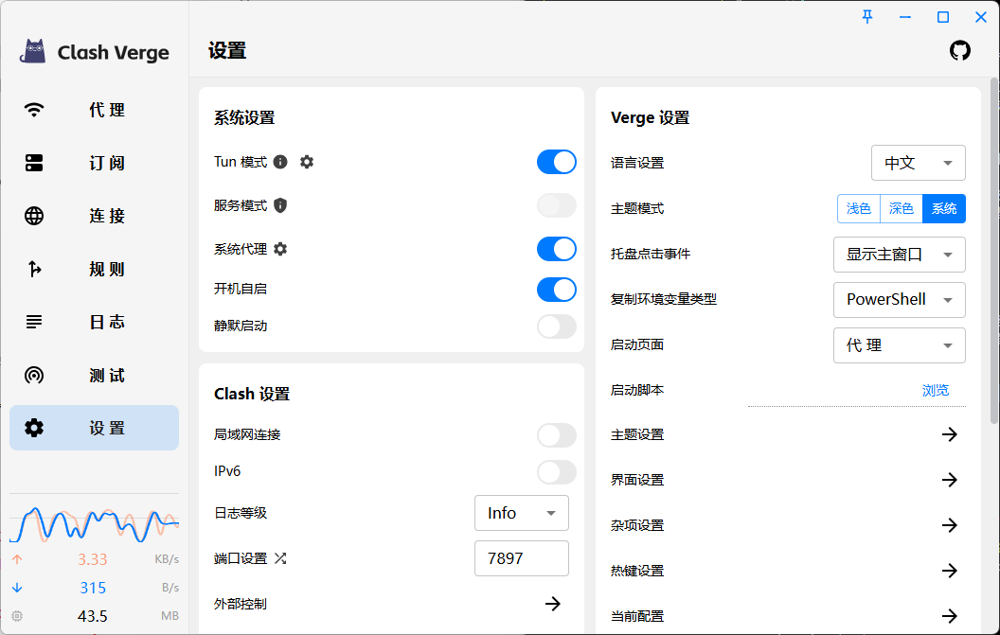


[clash verge rev - github](https://github.com/clash-verge-rev/clash-verge-rev)

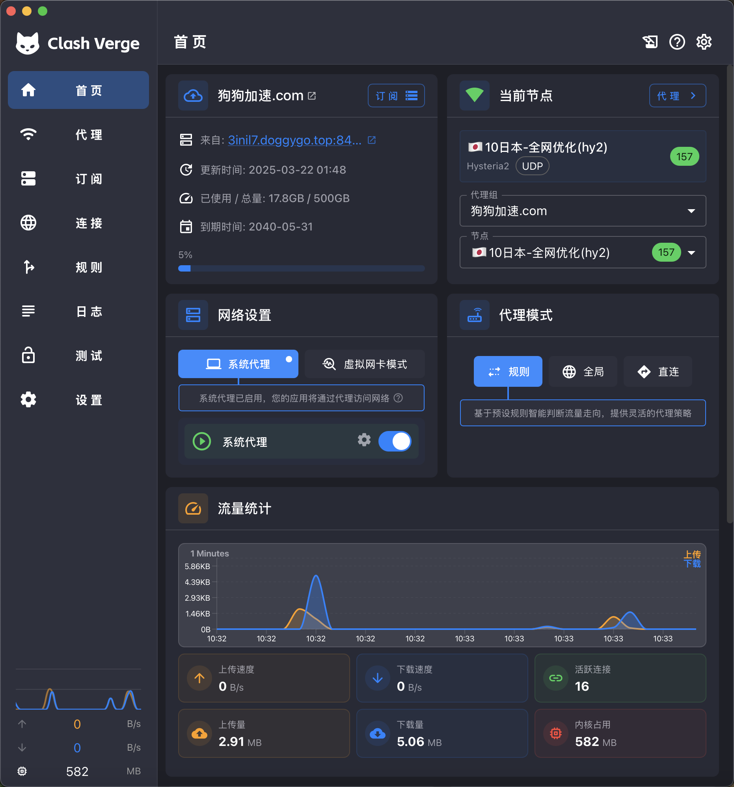

#### 界面介绍
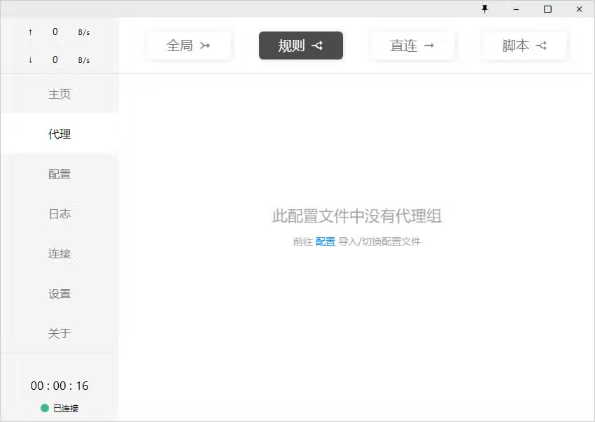

- General（常规）：

Port、Socks Port；分别为 HTTP、SOCKS 代理端口，点击终端图案可以打开一个配置了代理的命令行窗口，点击端口数字可以复制该命令；

Allow LAN：启用局域网共享代理功能；

Log Level：日志等级；

Home Directory：点击下方路径直达 C:\Users\用户名\.config\clash 文件夹；

GeoIP Database：点击下方日期可更新 GeoIP 数据库；

UWP Loopback ：可以用来使 UWP 应用解除回环代理限制；

Tap Device ：安装 cfw-tap 网卡，可用于处理不遵循系统代理的软件（实际启动 tap 模式需要更改配置文件）；

General YML：编辑 config.yml 文件，可用于配置部分 General 页面内容；

Dark Theme：控制暗色模式；

System Proxy：启用系统代理；

Start with Windows：设置开机自启；

- Proxies（代理）：选择代理方式（Global - 全局、Rule - 规则、Direct - 直连）及策略组节点选择；

- Profiles（配置管理）：

用来下载远端配置文件和创建本地副本，且可在多个配置文件间切换；
对配置进行节点、策略组和规则的管理（添加节点、策略组和规则在各自编辑界面选择 Add, 调整策略组顺序、节点顺序及策略组节点使用拖拽的方式）；

- Logs（日志）：显示当前请求命中规则类型和策略；
- Connections (连接): 显示当前的 TCP 连接，可对某个具体连接执行关闭操作；
- Settings（设置）：软件详细设置；
- Feedback（反馈）：显示软件、作者相关信息。

#### 如何添加订阅

1. 远程订阅地址订阅

远程订阅地址即通过 URL 链接导入，一般的服务商都会直接提供Clash节点地址，直接复制服务商提供的节点订阅地址即可，如下图所示：

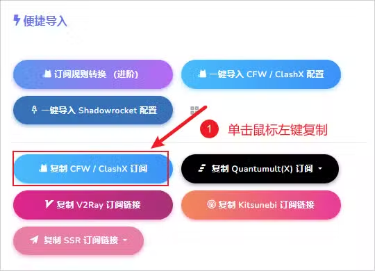

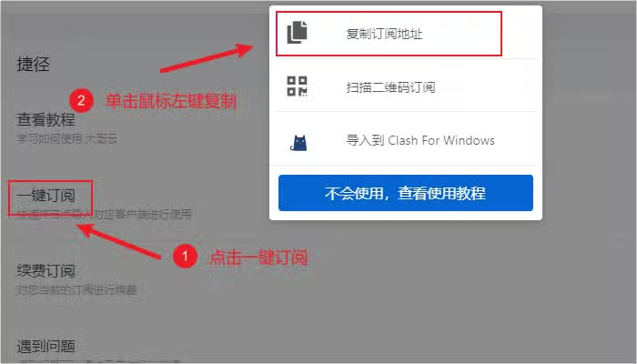

然后点击界面左侧菜单 配置，在顶部输入框填入刚才复制的 URL 连接地址并点击 下载 即可，下载完成后点击对应的配置文件即可添加配置文件，如下图所示。

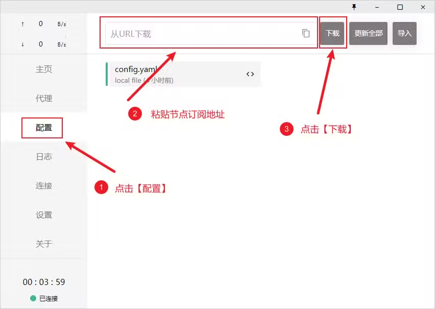


2. 本地配置文件

本地配置文件即通过本地文件拖拽导入，一般为无法通过远程订阅地址导入的情况下使用，可尝试在浏览器中下载配置文件后直接通过拖拽方式导入或点击 Import 导入，如下图所示。

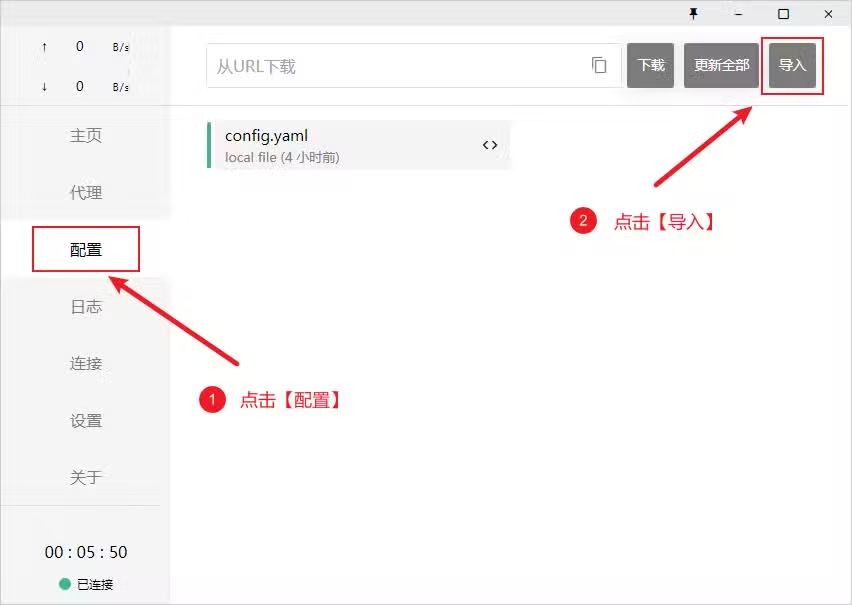

#### 选择代理节点

在添加完订阅地址之后，需要选择一个代理节点使用，点击软件主界面左侧的 代理 选项卡，软件右上角代理规则处默认保持 规则 即可，代理模式主要有以下四种：

- 规则：所有请求根据配置文件规则进行分流
- 全局：所有请求直接发往代理服务器
- 直连：所有请求直接发往目的地，即不使用代理
- 脚本：所有请求根据脚本文件规则进行分流

全局模式可能会导致国内流量也走代理访问，除了网络会变慢外，还会消耗套餐流量。规则模式的好处就是区分国内国外的流量只有在规则内的国外网站才会走代理，这样即不影响国内访问速度，又节省套餐流量，所以如果没有什么特别的需求，一般选择 规则 即可。

<span style = " color:red "> 有一点值得注意，选择了全局模式，而全局模式中的节点挂掉了，会导致无法访问国内的网站 </span>


然后在展开的节点组之中任意单击鼠标左键选择一个节点即可，如下图所示：

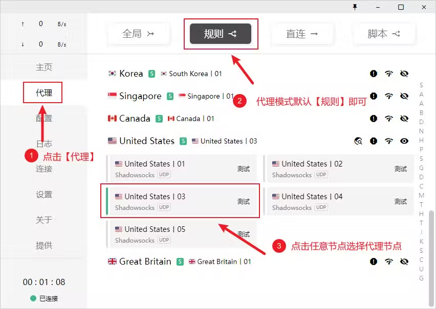


#### 启用代理

启用代理，需要点击界面左侧菜单 主页 选项卡，找到 系统代理 并开启开关即可，开启状态下按钮状态为绿色，如下图所示为开启状态。

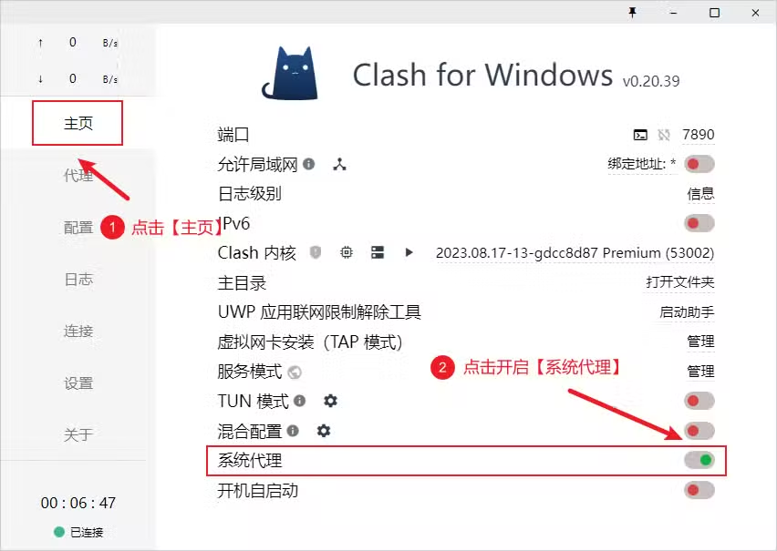

启动代理后系统托盘的图标会变色金色猫咪，以下是系统托盘图标颜色说明。

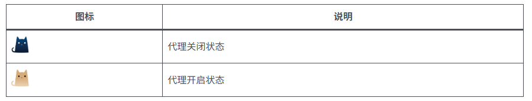


#### 设置开机启动

设置开机自启动，需要点击界面左侧菜单 主页 选项卡，找到 开机自启动 并开启开关即可，开启状态下按钮状态为绿色，如下图所示为开启状态。

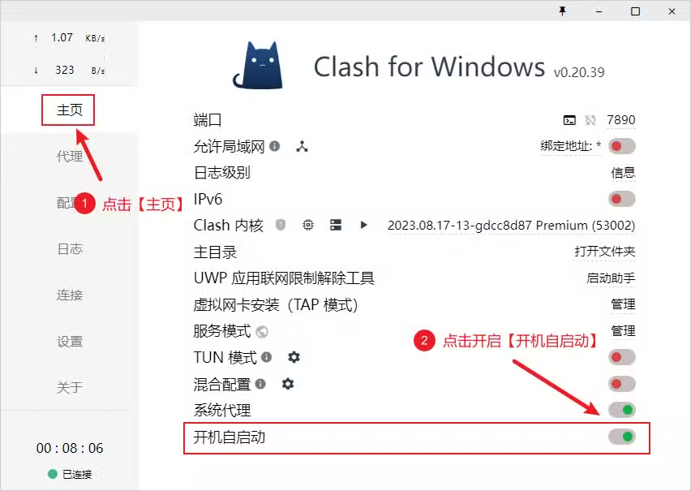

<span style = " color:red "> 有一点值得注意，如果未选择开机启动，而关机的时候直接未退出clash就关机了，会导致下次开机的时候无法连接网络，解决方式是重新打开clash，然后正常退出或者不退出clash都可能  </span>


#### 更新配置文件

点击界面左侧菜单 配置，点击 更新全部 即可更新所有配置文件，如下图所示。

<span style = " color:red "> 这个更新只针对远程导入的订阅 </span>


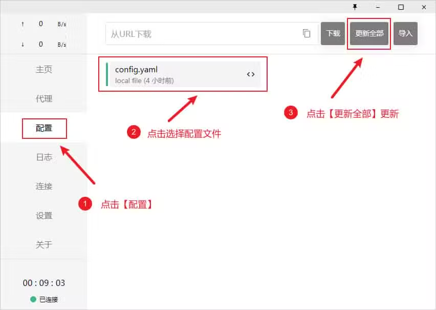


### 修改clash中的规则信息

<span style="color:red"> 改过配置之后不要刷新订阅，不然就没了，不过不更新又不会加载规则，可以通过切换订阅文件的方式加载规则</span>

<span style="color:red"> 配置是按照顺序来的，如果说你都用了域名过滤，写在前面的会优先级更高，此外还有DOMAIN-SUFFIX 和DOMAIN的区别，看下面单独的讲解</span>


可以复制一个你原有的规则，然后修改里面的内容，然后保存。通过加载本地文件的方式加载

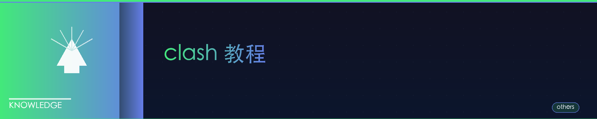


#### **1. 获取代理服务器信息**
你需要从你的代理服务提供商（比如 V2Ray、Shadowsocks、Trojan 等）那里拿到服务器信息，通常包括：
- 服务器地址（IP 或域名）
- 端口号
- 加密方式
- 密码或 UUID
- 协议类型（如 vmess、vless、ss 等）

例如，一个简单的 Shadowsocks 服务器信息可能是：
```
服务器地址: example.com
端口: 8388
加密: aes-256-gcm
密码: yourpassword
```

#### **2. 创建基础配置文件**
创建一个 `config.yaml` 文件，然后用文本编辑器（如 Notepad++、VS Code）打开。以下是一个简单的配置文件模板：

```yaml
# 基本设置
port: 7890                # 本地 HTTP 代理端口
socks-port: 7891          # 本地 SOCKS5 代理端口
allow-lan: false          # 是否允许局域网连接，false 表示仅本地使用
mode: rule                # 工作模式：rule（规则分流）、global（全局代理）、direct（直连）
log-level: info           # 日志级别，可选 silent/info/warning/error/debug

# 代理节点列表
proxies:
  - name: "ss1"           # 节点名称，自定义即可
    type: ss              # 协议类型，这里是 Shadowsocks
    server: example.com   # 服务器地址
    port: 8388            # 端口
    cipher: aes-256-gcm   # 加密方式
    password: "yourpassword"  # 密码

# 代理组（用于选择节点）
proxy-groups:
  - name: "auto"          # 组名称
    type: select          # 类型：select 表示手动选择
    proxies:
      - "ss1"             # 这里引用上面定义的节点

# 规则
rules:
  - DOMAIN-SUFFIX,google.com,auto    # 匹配 google.com 的流量走 auto 组
  - DOMAIN-SUFFIX,baidu.com,DIRECT   # 百度直连
  - MATCH,auto                       # 其他未匹配的流量走 auto 组
```

#### **3. 解释配置文件的主要部分**
- **端口设置**：`port` 和 `socks-port` 是 Clash 在本地监听的端口，应用程序通过这些端口连接代理。
- **proxies**：这里列出你的所有代理节点。可以添加多个，比如 `ss1`、`ss2` 等。
- **proxy-groups**：代理组用来组织节点，可以手动选择或设置自动选择（如 `url-test`）。
- **rules**：规则决定哪些流量走代理，哪些直连。可以用域名、IP 等条件匹配。

#### **4. 保存并加载配置文件**
- 将文件保存为 `config.yaml`。
- 打开 Clash 客户端，把文件拖进去，或者在设置中指定文件路径。
- 启动 Clash，检查是否能正常连接。

#### **5. 测试**
- 打开浏览器，设置代理为 `127.0.0.1:7890`（HTTP）或 `127.0.0.1:7891`（SOCKS5）。
- 访问一个被代理的网站（比如 google.com），看看是否成功。

---


### 进阶

#### 使用api切换节点


在clash的设置中打开外部控制

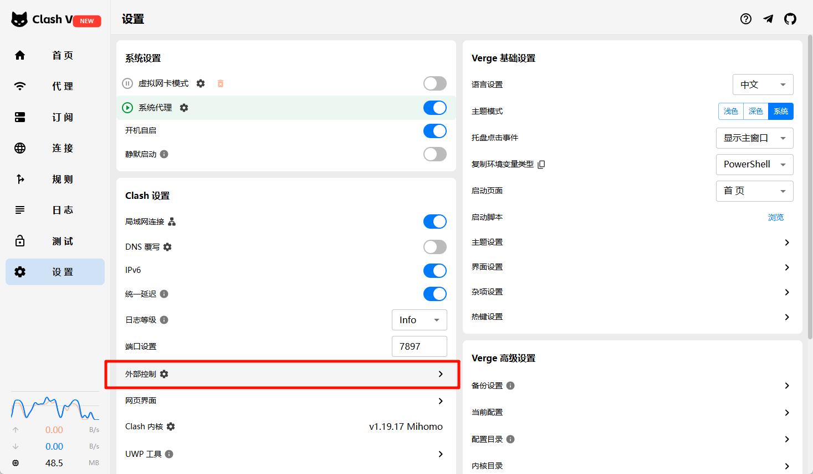

```python 
import urllib.parse  # 顶部添加
import random
import time
import requests

API_URL = "http://127.0.0.1:9097"
SECRET = "clashapikeyXXXX"  # 如果设置了
GROUP_NAME = "🇺🇸 美国"  # 你的proxy-group名字，必须是type: select的组
clash_api_headers = {
    'User-Agent': 'Mozilla/5.0 (Windows NT 10.0; Win64; x64) AppleWebKit/537.36 (KHTML, like Gecko) Chrome/91.0.4472.124 Safari/537.36',
    'Accept': 'application/json, text/plain, */*',
    'Accept-Language': 'en-US,en;q=0.9',
    'Authorization': f'Bearer {SECRET}'  # <--- 必须加上这一行
}
# 在 get_proxies() 后，添加一个 encoded 版本
ENCODED_GROUP_NAME = urllib.parse.quote(GROUP_NAME)
# 先获取所有可用节点
def get_proxies():
    global GROUP_NAME
    resp = requests.get(f"{API_URL}/proxies", headers={"Authorization": f"Bearer {SECRET}"} if SECRET else {})
    proxies_data = resp.json()["proxies"]
    print("Available proxy groups:")
    # print(proxies_data)
    for group_name in proxies_data:
        if proxies_data[group_name].get("type") == "select":
            try:
                print(f"  - {group_name}")
            except UnicodeEncodeError:
                print(f"  - [包含特殊字符的组名] ({len(group_name)} chars)")
    if GROUP_NAME not in proxies_data:
        print(f"Warning: Group '{GROUP_NAME}' not found. Using first available select group.")
        for group_name in proxies_data:
            if proxies_data[group_name].get("type") == "select":
                GROUP_NAME = group_name
                break
    return list(proxies_data[GROUP_NAME]["all"])  # 返回节点名列表

proxies_list = get_proxies()
print(proxies_list)

# 修改 switch_proxy 函数
def switch_proxy():
    try:
        new_proxy = random.choice(proxies_list)
        print(f"尝试切换到节点: {new_proxy}")
        
        # 使用 encoded 的组名在 URL 中
        resp = requests.put(
            f"{API_URL}/proxies/{ENCODED_GROUP_NAME}",  #如果grounp Name里面有emoji，不用encoded会出错
            json={"name": new_proxy},
            headers=clash_api_headers
        )
        print(resp)
        
        # 关键：检查响应！Clash 切换成功返回 204 No Content
        if resp.status_code == 204:
            print(f"成功切换到节点: {new_proxy}")
        else:
            print(f"切换失败！状态码: {resp.status_code}, 响应: {resp.text}")
            # 可选：打印当前实际选中的节点
            current = requests.get(f"{API_URL}/proxies/{ENCODED_GROUP_NAME}", headers=clash_api_headers).json()
            print(f"当前实际节点: {current.get('now')}")
        
        time.sleep(5)  # 等待切换生效（有些节点需要几秒）
        
    except Exception as e:
        print(f"切换异常: {e}")


# 示例爬虫循环
for i in range(10):  # 减少循环次数用于测试

    switch_proxy()
    headers = {
        'User-Agent': 'Mozilla/5.0 (Windows NT 10.0; Win64; x64) AppleWebKit/537.36 (KHTML, like Gecko) Chrome/91.0.4472.124 Safari/537.36',
        'Accept': 'application/json, text/plain, */*',
        'Accept-Language': 'en-US,en;q=0.9',
    }
# 你的爬虫请求
    try:
        resp = requests.get(headers=headers, url="https://httpbin.org/ip", timeout=5,proxies={"http": "http://127.0.0.1:7897", "https": "http://127.0.0.1:7897"})
        print("当前IP:", resp.text.strip())
    except requests.exceptions.RequestException as e:
        print(f"请求失败 (Clash代理未运行?): {e}")
        # 尝试不使用代理
        try:
            resp = requests.get(headers=headers, url="https://httpbin.org/ip", timeout=5,proxies={"http": "http://127.0.0.1:7897", "https": "http://127.0.0.1:7897"})
            print("直连IP:", resp.text.strip())
        except requests.exceptions.RequestException as e2:
            print(f"直连也失败: {e2}")
    time.sleep(5)

```

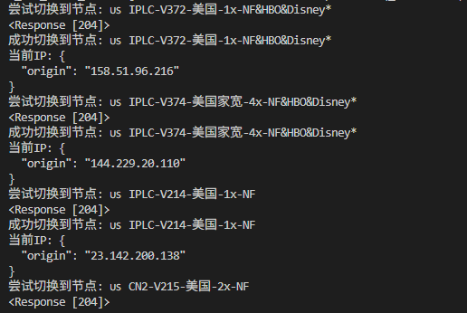


#### DOMAIN-SUFFIX 和 DOMAIN  （顺序影响行为）

**区别**

- DOMAIN-SUFFIX 匹配的是域名后缀，覆盖范围更广（包括所有子域名）。
- DOMAIN 匹配的是精确域名，覆盖范围更窄（仅限指定域名）。


**行为**

大多数软件的规则解析顺序: 许多工具（如 Surge、Clash、Adblock、uBlock Origin）按配置文件中规则的从上到下顺序进行匹配。也就是说，先出现的规则会优先被检查和应用。如果匹配成功，后续规则可能被忽略（除非软件支持多重匹配）。


 **哪个在前？**
- **通用实践**: 在大多数配置文件中，建议将**更具体的规则**（如 `DOMAIN`）写在**前面**，将**更宽泛的规则**（如 `DOMAIN-SUFFIX`）写在后面。原因如下：
  - 精确匹配（`DOMAIN`）通常表示用户希望对特定域名进行特殊处理，优先级更高。
  - 后缀匹配（`DOMAIN-SUFFIX`）覆盖范围广，适合作为“兜底”规则，处理未被精确匹配的子域名。
  - 示例（推荐写法）：
    ```
    DOMAIN,youtube.bo,YouTube
    DOMAIN-SUFFIX,youtube.bo,YouTube
    ```
    这样可以确保 `youtube.bo` 被精确匹配的规则优先处理，而子域名（如 `www.youtube.bo`）由后缀规则处理。
- **例外情况**: 如果软件明确要求按某种顺序（例如 Clash 或 Surge 的文档可能指定），需要遵循其规则。有些软件可能要求 `DOMAIN-SUFFIX` 优先，因为它覆盖范围更大。


#### **进阶配置示例**
如果你有多个节点，想自动选择延迟最低的，或者需要更复杂的规则，可以参考以下示例：

```yaml
port: 7890
socks-port: 7891
allow-lan: false
mode: rule
log-level: info

proxies:
  - name: "ss1"
    type: ss
    server: example1.com
    port: 8388
    cipher: aes-256-gcm
    password: "yourpassword1"
  - name: "ss2"
    type: ss
    server: example2.com
    port: 8388
    cipher: aes-256-gcm
    password: "yourpassword2"

proxy-groups:
  - name: "auto"
    type: url-test        # 自动选择延迟最低的节点
    proxies:
      - "ss1"
      - "ss2"
    url: "http://www.gstatic.com/generate_204"  # 测试延迟的 URL
    interval: 300         # 每 300 秒测试一次

rules:
  - DOMAIN-SUFFIX,google.com,auto
  - DOMAIN-SUFFIX,baidu.com,DIRECT
  - GEOIP,CN,DIRECT      # 中国 IP 直连
  - MATCH,auto           # 其他走 auto 组
```

---

#### **常见问题**
1. **配置文件报错怎么办？**
   - 检查 YAML 格式是否正确，比如缩进必须是 2 个空格，不能用 Tab。
   - 确保节点信息无误。
2. **想添加更多规则怎么办？**
   - 可以参考 Clash 的官方文档，或者告诉我你的需求，我帮你写。
3. **哪里找现成的规则？**
   - 网上有很多开源规则集，比如 GitHub 上，可以通过 Clash 的订阅功能导入。

---


#### 一个clash配置的信息如下

```yaml
port: 7890
socks-port: 7891
allow-lan: true
mode: Rule
log-level: info
external-controller: :9090
proxies:
  - {name: "🇯🇵 CN2-V329-日本-0.5x-NF&Abema*", server: pfxwhz.cscsgsg.xyz, port: 16007, type: vmess, uuid: 4ed1483a-8bd9-3380-8d28-fa68243292ba, alterId: 0, cipher: auto, tls: false, skip-cert-verify: true, udp: true}
  - {name: "🇬🇧 CN2-V229-英国-1x-NF&BBC*", server: epueyo.gxcvbmj.xyz, port: 58559, type: vmess, uuid: 4ed1483a-8bd9-3380-8d28-fa68243292ba, alterId: 0, cipher: auto, tls: false, skip-cert-verify: true, udp: true}
  - {name: 🇳🇱 CN2-V238-荷兰-1x-NF*, server: cyjsnl.ghskgvb.xyz, port: 20020, type: vmess, uuid: 4ed1483a-8bd9-3380-8d28-fa68243292ba, alterId: 0, cipher: auto, tls: false, skip-cert-verify: true, udp: true}
  - {name: 🇨🇦 CN2-V237-加拿大-1x, server: pfxwhz.cscsgsg.xyz, port: 12010, type: vmess, uuid: 4ed1483a-8bd9-3380-8d28-fa68243292ba, alterId: 0, cipher: auto, tls: false, skip-cert-verify: true, udp: true}
  - {name: "🇦🇺 CN2-V338-澳大利亚-1x-NF&7plus*", server: fdksxn.kghkjasfh.xyz, port: 12232, type: vmess, uuid: 4ed1483a-8bd9-3380-8d28-fa68243292ba, alterId: 0, cipher: auto, tls: false, skip-cert-verify: true, udp: true}
  - {name: 🇳🇿 CN2-V339-新西兰-1x-NF*, server: fdksxn.kghkjasfh.xyz, port: 12233, type: vmess, uuid: 4ed1483a-8bd9-3380-8d28-fa68243292ba, alterId: 0, cipher: auto, tls: false, skip-cert-verify: true, udp: true}
  - {name: 🇸🇬 福利-V345-新加坡-0.1x-15M-NF, server: vdiogsnf.kghkjasfh.xyz, port: 12543, type: vmess, uuid: 4ed1483a-8bd9-3380-8d28-fa68243292ba, alterId: 0, cipher: auto, tls: false, skip-cert-verify: true, udp: true}
  - {name: 🇭🇰 福利-V234-香港-0.1x-15M-NF, server: vdiogsnf.kghkjasfh.xyz, port: 12544, type: vmess, uuid: 4ed1483a-8bd9-3380-8d28-fa68243292ba, alterId: 0, cipher: auto, tls: false, skip-cert-verify: true, udp: true}
  - {name: 🇭🇰 福利-V114-香港-0.1x-仅限emby, server: vdiogsnf.kghkjasfh.xyz, port: 12545, type: vmess, uuid: 4ed1483a-8bd9-3380-8d28-fa68243292ba, alterId: 0, cipher: auto, tls: false, skip-cert-verify: true, udp: true}
proxy-groups:
  - name: 🎞️ Prime Video
    type: select
    proxies:
      - 🇭🇰 香港
      - 🇺🇸 美国
      - 🇯🇵 日本
      - 🇸🇬 新加坡
      - 🇹🇼 台湾
      - 🚀 手动切换
      - "🇭🇰 IPLC-V301-香港-1x-NF&Disney*"
      - "🇭🇰 IPLC-V302-香港-1x-NF&Disney"
      - "🇭🇰 IPLC-V303-香港-1x-NF&Disney*"
      - "🇯🇵 CN2-V329-日本-0.5x-NF&Abema*"
      - "🇬🇧 CN2-V229-英国-1x-NF&BBC*"
      - 🇳🇱 CN2-V238-荷兰-1x-NF*
      - 🇨🇦 CN2-V237-加拿大-1x
      - "🇦🇺 CN2-V338-澳大利亚-1x-NF&7plus*"
      - 🇳🇿 CN2-V339-新西兰-1x-NF*
      - 🇸🇬 福利-V345-新加坡-0.1x-15M-NF
      - 🇭🇰 福利-V234-香港-0.1x-15M-NF
      - 🇭🇰 福利-V114-香港-0.1x-仅限emby
  - name: 🎮👑👑 HBO MAX
    type: select
    proxies:
      - 🚀 手动切换
      - "🇭🇰 IPLC-V301-香港-1x-NF&Disney*"
      - "🇭🇰 IPLC-V302-香港-1x-NF&Disney"
      - 🇺🇸 CN2-V216-美国-1x-NF
      - 🇺🇸 CN2-V215-美国-2x-NF
      - "🇺🇸 CN2-V213-美国-1x-NF&HBO&Hulu&Disney*"
      - "🇺🇸 CN2-V212-美国-1x-NF&HBO&Hulu*"
      - "🇺🇸 CN2-V217-美国-1x-NF&Disney"
      - 🇺🇸 CN2-V211-美国-1x-NF*
      - "🇯🇵 CN2-V227-日本-1x-NF&Abema*"
      - "🇯🇵 CN2-V228-日本-1x-NF&Abema*"
      - "🇯🇵 CN2-V328-日本-0.5x-NF&Abema*"
      - "🇯🇵 CN2-V329-日本-0.5x-NF&Abema*"
      - "🇬🇧 CN2-V229-英国-1x-NF&BBC*"
      - 🇳🇱 CN2-V238-荷兰-1x-NF*
      - 🇨🇦 CN2-V237-加拿大-1x
      - "🇦🇺 CN2-V338-澳大利亚-1x-NF&7plus*"
      - 🇳🇿 CN2-V339-新西兰-1x-NF*
      - 🇸🇬 福利-V345-新加坡-0.1x-15M-NF
      - 🇭🇰 福利-V234-香港-0.1x-15M-NF
      - 🇭🇰 福利-V114-香港-0.1x-仅限emby
  - name: 📹️ HBOGO Asia
    type: select
    proxies:
      - 🚀 手动切换
      - "🇭🇰 IPLC-V301-香港-1x-NF&Disney*"
      - "🇭🇰 IPLC-V302-香港-1x-NF&Disney"
      - "🇭🇰 IPLC-V303-香港-1x-NF&Disney*"
      - "🇭🇰 IPLC-V304-香港-1x-NF&Disney*"
      - 🇺🇸 CN2-V211-美国-1x-NF*
      - "🇯🇵 CN2-V227-日本-1x-NF&Abema*"
      - "🇯🇵 CN2-V228-日本-1x-NF&Abema*"
      - "🇯🇵 CN2-V328-日本-0.5x-NF&Abema*"
      - "🇯🇵 CN2-V329-日本-0.5x-NF&Abema*"
      - "🇬🇧 CN2-V229-英国-1x-NF&BBC*"
      - 🇳🇱 CN2-V238-荷兰-1x-NF*
      - 🇨🇦 CN2-V237-加拿大-1x
      - "🇦🇺 CN2-V338-澳大利亚-1x-NF&7plus*"
      - 🇳🇿 CN2-V339-新西兰-1x-NF*
      - 🇸🇬 福利-V345-新加坡-0.1x-15M-NF
      - 🇭🇰 福利-V234-香港-0.1x-15M-NF
      - 🇭🇰 福利-V114-香港-0.1x-仅限emby
  - name: 💿 AbemaTV
    type: select
    proxies:
      - "🇯🇵 IPLC-V316-日本-0.5x-50M-NF&Abema*"
      - "🇯🇵 IPLC-V315-日本-1x-NF&Abema*（ChatGPT动态解锁测试）"
      - "🇯🇵 IPLC-V353-日本-1x-NF&Abema*"
      - "🇯🇵 IPLC-V356-日本-4x-家宽-NF&Abema*"
      - "🇯🇵 IPLC-V364-日本-0.5x-50M-NF&Abema*"
      - "🇯🇵 IPLC-V365-日本-1x-NF&Abema*（ChatGPT动态解锁测试）"
      - "🇯🇵 IPLC-V366-日本-1x-NF&Abema*（ChatGPT动态解锁测试）"
      - "🇯🇵 IPLC-V240-日本-1x-NF&Abema*"
      - "🇯🇵 CN2-V227-日本-1x-NF&Abema*"
      - "🇯🇵 CN2-V228-日本-1x-NF&Abema*"
      - "🇯🇵 CN2-V328-日本-0.5x-NF&Abema*"
      - "🇯🇵 CN2-V329-日本-0.5x-NF&Abema*"
  - name: 🔞 Pornhub
    type: select
    proxies:
      - 🚀 手动切换
      - "🇭🇰 IPLC-V301-香港-1x-NF&Disney*"
      - "🇭🇰 IPLC-V302-香港-1x-NF&Disney"
      - "🇭🇰 IPLC-V303-香港-1x-NF&Disney*"
      - "🇭🇰 IPLC-V304-香港-1x-NF&Disney*"
      - "🇯🇵 CN2-V228-日本-1x-NF&Abema*"
      - "🇯🇵 CN2-V328-日本-0.5x-NF&Abema*"
      - "🇯🇵 CN2-V329-日本-0.5x-NF&Abema*"
      - "🇬🇧 CN2-V229-英国-1x-NF&BBC*"
      - 🇳🇱 CN2-V238-荷兰-1x-NF*
      - 🇨🇦 CN2-V237-加拿大-1x
      - "🇦🇺 CN2-V338-澳大利亚-1x-NF&7plus*"
      - 🇳🇿 CN2-V339-新西兰-1x-NF*
      - 🇸🇬 福利-V345-新加坡-0.1x-15M-NF
      - 🇭🇰 福利-V234-香港-0.1x-15M-NF
      - 🇭🇰 福利-V114-香港-0.1x-仅限emby
  - name: 🎶 TikTok
    type: select
    proxies:
      - 🚀 手动切换
      - "🇭🇰 IPLC-V301-香港-1x-NF&Disney*"
      - "🇭🇰 IPLC-V302-香港-1x-NF&Disney"
      - "🇭🇰 IPLC-V303-香港-1x-NF&Disney*"
      - 🇭🇰 CN2-V241-香港-1x
      - "🇸🇬 CN2-V330-新加坡-1x-NF&Disney+*"
      - "🇸🇬 CN2-V347-新加坡-0.5x-NF&Disney+*"
      - 🇺🇸 CN2-V216-美国-1x-NF
      - 🇺🇸 CN2-V215-美国-2x-NF
      - "🇺🇸 CN2-V213-美国-1x-NF&HBO&Hulu&Disney*"
      - "🇺🇸 CN2-V212-美国-1x-NF&HBO&Hulu*"
      - "🇺🇸 CN2-V217-美国-1x-NF&Disney"
      - 🇺🇸 CN2-V211-美国-1x-NF*
      - "🇯🇵 CN2-V227-日本-1x-NF&Abema*"
      - "🇯🇵 CN2-V228-日本-1x-NF&Abema*"
      - "🇯🇵 CN2-V328-日本-0.5x-NF&Abema*"
      - "🇯🇵 CN2-V329-日本-0.5x-NF&Abema*"
      - "🇬🇧 CN2-V229-英国-1x-NF&BBC*"
      - 🇳🇱 CN2-V238-荷兰-1x-NF*
      - 🇨🇦 CN2-V237-加拿大-1x
      - "🇦🇺 CN2-V338-澳大利亚-1x-NF&7plus*"
      - 🇳🇿 CN2-V339-新西兰-1x-NF*
      - 🇸🇬 福利-V345-新加坡-0.1x-15M-NF
      - 🇭🇰 福利-V234-香港-0.1x-15M-NF
      - 🇭🇰 福利-V114-香港-0.1x-仅限emby
  - name: 🎧 Spotify
    type: select
    proxies:
      - 🚀 手动切换
      - 🎯 全球直连
      - "🇭🇰 IPLC-V301-香港-1x-NF&Disney*"
      - "🇭🇰 IPLC-V302-香港-1x-NF&Disney"
      - "🇭🇰 IPLC-V303-香港-1x-NF&Disney*"
      - "🇭🇰 CN2-V327-香港-1x-HKBN-NF&Disney*"
      - 🇭🇰 CN2-V346-香港-0.6x-HGC-NF*
      - 🇭🇰 CN2-V241-香港-1x
      - "🇸🇬 CN2-V330-新加坡-1x-NF&Disney+*"
      - "🇸🇬 CN2-V347-新加坡-0.5x-NF&Disney+*"
      - 🇺🇸 CN2-V216-美国-1x-NF
      - 🇺🇸 CN2-V215-美国-2x-NF
      - "🇺🇸 CN2-V213-美国-1x-NF&HBO&Hulu&Disney*"
      - "🇺🇸 CN2-V212-美国-1x-NF&HBO&Hulu*"
      - "🇺🇸 CN2-V217-美国-1x-NF&Disney"
      - 🇺🇸 CN2-V211-美国-1x-NF*
      - "🇯🇵 CN2-V227-日本-1x-NF&Abema*"
      - "🇯🇵 CN2-V228-日本-1x-NF&Abema*"
      - "🇯🇵 CN2-V328-日本-0.5x-NF&Abema*"
      - "🇯🇵 CN2-V329-日本-0.5x-NF&Abema*"
      - "🇬🇧 CN2-V229-英国-1x-NF&BBC*"
      - 🇳🇱 CN2-V238-荷兰-1x-NF*
      - 🇨🇦 CN2-V237-加拿大-1x
      - "🇦🇺 CN2-V338-澳大利亚-1x-NF&7plus*"
      - 🇳🇿 CN2-V339-新西兰-1x-NF*
      - 🇸🇬 福利-V345-新加坡-0.1x-15M-NF
      - 🇭🇰 福利-V234-香港-0.1x-15M-NF
      - 🇭🇰 福利-V114-香港-0.1x-仅限emby
  - name: 🎮️ 游戏平台
    type: select
    proxies:
      - 🎯 全球直连
      - 🚀 手动切换
      - "🇭🇰 IPLC-V301-香港-1x-NF&Disney*"
      - "🇭🇰 IPLC-V302-香港-1x-NF&Disney"
      - "🇭🇰 IPLC-V303-香港-1x-NF&Disney*"
      - 🇳🇱 CN2-V238-荷兰-1x-NF*
      - 🇨🇦 CN2-V237-加拿大-1x
      - "🇦🇺 CN2-V338-澳大利亚-1x-NF&7plus*"
      - 🇳🇿 CN2-V339-新西兰-1x-NF*
      - 🇸🇬 福利-V345-新加坡-0.1x-15M-NF
      - 🇭🇰 福利-V234-香港-0.1x-15M-NF
      - 🇭🇰 福利-V114-香港-0.1x-仅限emby
  - name: 🤖 ChatGPT、Claude、Gemini、微软AI
    type: select
    proxies:
      - 🚀 手动切换
      - 🇺🇸 美国
      - 🇯🇵 日本
      - 🇸🇬 新加坡
      - 🇹🇼 台湾
      - 🎯 全球直连
      - "🇭🇰 IPLC-V301-香港-1x-NF&Disney*"
      - "🇭🇰 IPLC-V302-香港-1x-NF&Disney"
      - "🇭🇰 IPLC-V303-香港-1x-NF&Disney*"
      - "🇭🇰 CN2-V327-香港-1x-HKBN-NF&Disney*"
      - 🇭🇰 CN2-V346-香港-0.6x-HGC-NF*
      - 🇭🇰 CN2-V241-香港-1x
      - "🇸🇬 CN2-V330-新加坡-1x-NF&Disney+*"
      - "🇸🇬 CN2-V347-新加坡-0.5x-NF&Disney+*"
      - 🇺🇸 CN2-V216-美国-1x-NF
      - 🇺🇸 CN2-V215-美国-2x-NF
      - "🇺🇸 CN2-V213-美国-1x-NF&HBO&Hulu&Disney*"
      - "🇺🇸 CN2-V212-美国-1x-NF&HBO&Hulu*"
      - "🇺🇸 CN2-V217-美国-1x-NF&Disney"
      - 🇺🇸 CN2-V211-美国-1x-NF*
      - "🇯🇵 CN2-V227-日本-1x-NF&Abema*"
      - "🇯🇵 CN2-V228-日本-1x-NF&Abema*"
      - "🇯🇵 CN2-V328-日本-0.5x-NF&Abema*"
      - "🇯🇵 CN2-V329-日本-0.5x-NF&Abema*"
      - "🇬🇧 CN2-V229-英国-1x-NF&BBC*"
      - 🇳🇱 CN2-V238-荷兰-1x-NF*
      - 🇨🇦 CN2-V237-加拿大-1x
      - "🇦🇺 CN2-V338-澳大利亚-1x-NF&7plus*"
      - 🇳🇿 CN2-V339-新西兰-1x-NF*
      - 🇸🇬 福利-V345-新加坡-0.1x-15M-NF
      - 🇭🇰 福利-V234-香港-0.1x-15M-NF
      - 🇭🇰 福利-V114-香港-0.1x-仅限emby
  - name: Ⓜ️ 微软服务
    type: select
    proxies:
      - 🎯 全球直连
      - 🚀 手动切换
      - "🇭🇰 IPLC-V301-香港-1x-NF&Disney*"
      - "🇭🇰 IPLC-V302-香港-1x-NF&Disney"
      - "🇭🇰 IPLC-V303-香港-1x-NF&Disney*"
      - "🇭🇰 IPLC-V304-香港-1x-NF&Disney*"
      - 🇭🇰 CN2-V321-香港-0.6x-NF
      - 🇭🇰 CN2-V322-香港-0.6x-NF
      - 🇭🇰 CN2-V325-香港-0.6x-NF
      - "🇭🇰 CN2-V326-香港-1x-HKBN-NF&Disney*"
      - "🇭🇰 CN2-V327-香港-1x-HKBN-NF&Disney*"
      - 🇭🇰 CN2-V346-香港-0.6x-HGC-NF*
      - 🇭🇰 CN2-V241-香港-1x
      - "🇸🇬 CN2-V330-新加坡-1x-NF&Disney+*"
      - "🇸🇬 CN2-V347-新加坡-0.5x-NF&Disney+*"
      - 🇺🇸 CN2-V216-美国-1x-NF
      - 🇺🇸 CN2-V215-美国-2x-NF
      - "🇺🇸 CN2-V213-美国-1x-NF&HBO&Hulu&Disney*"
      - "🇺🇸 CN2-V212-美国-1x-NF&HBO&Hulu*"
      - "🇺🇸 CN2-V217-美国-1x-NF&Disney"
      - 🇺🇸 CN2-V211-美国-1x-NF*
      - "🇯🇵 CN2-V227-日本-1x-NF&Abema*"
      - "🇯🇵 CN2-V228-日本-1x-NF&Abema*"
      - "🇯🇵 CN2-V328-日本-0.5x-NF&Abema*"
      - "🇯🇵 CN2-V329-日本-0.5x-NF&Abema*"
      - "🇬🇧 CN2-V229-英国-1x-NF&BBC*"
      - 🇳🇱 CN2-V238-荷兰-1x-NF*
      - 🇨🇦 CN2-V237-加拿大-1x
      - "🇦🇺 CN2-V338-澳大利亚-1x-NF&7plus*"
      - 🇳🇿 CN2-V339-新西兰-1x-NF*
      - 🇸🇬 福利-V345-新加坡-0.1x-15M-NF
      - 🇭🇰 福利-V234-香港-0.1x-15M-NF
      - 🇭🇰 福利-V114-香港-0.1x-仅限emby
  - name: 📲 电报信息
    type: select
    proxies:
      - 🚀 手动切换
      - ♻️ 自动选择
      - 🎯 全球直连
      - "🇭🇰 IPLC-V301-香港-1x-NF&Disney*"
      - "🇭🇰 IPLC-V302-香港-1x-NF&Disney"
      - "🇭🇰 IPLC-V303-香港-1x-NF&Disney*"
      - "🇭🇰 IPLC-V304-香港-1x-NF&Disney*"
      - 🇭🇰 CN2-V346-香港-0.6x-HGC-NF*
      - 🇭🇰 CN2-V241-香港-1x
      - "🇸🇬 CN2-V330-新加坡-1x-NF&Disney+*"
      - "🇸🇬 CN2-V347-新加坡-0.5x-NF&Disney+*"
      - 🇺🇸 CN2-V216-美国-1x-NF
      - 🇺🇸 CN2-V215-美国-2x-NF
      - "🇺🇸 CN2-V213-美国-1x-NF&HBO&Hulu&Disney*"
      - "🇺🇸 CN2-V212-美国-1x-NF&HBO&Hulu*"
      - "🇺🇸 CN2-V217-美国-1x-NF&Disney"
      - 🇺🇸 CN2-V211-美国-1x-NF*
      - "🇯🇵 CN2-V227-日本-1x-NF&Abema*"
      - "🇯🇵 CN2-V228-日本-1x-NF&Abema*"
      - "🇯🇵 CN2-V328-日本-0.5x-NF&Abema*"
      - "🇯🇵 CN2-V329-日本-0.5x-NF&Abema*"
      - "🇬🇧 CN2-V229-英国-1x-NF&BBC*"
      - 🇳🇱 CN2-V238-荷兰-1x-NF*
      - 🇨🇦 CN2-V237-加拿大-1x
      - "🇦🇺 CN2-V338-澳大利亚-1x-NF&7plus*"
      - 🇳🇿 CN2-V339-新西兰-1x-NF*
      - 🇸🇬 福利-V345-新加坡-0.1x-15M-NF
      - 🇭🇰 福利-V234-香港-0.1x-15M-NF
      - 🇭🇰 福利-V114-香港-0.1x-仅限emby
  - name: 🍎 苹果服务
    type: select
    proxies:
      - 🎯 全球直连
      - 🚀 手动切换
      - "🇭🇰 IPLC-V301-香港-1x-NF&Disney*"
      - "🇭🇰 IPLC-V302-香港-1x-NF&Disney"
      - "🇭🇰 IPLC-V303-香港-1x-NF&Disney*"
      - "🇭🇰 IPLC-V304-香港-1x-NF&Disney*"
      - "🇭🇰 IPLC-V305-香港-1x-NF&Disney*"
      - "🇭🇰 IPLC-V306-香港-1x-NF&Disney*"
      - "🇯🇵 CN2-V227-日本-1x-NF&Abema*"
      - "🇯🇵 CN2-V228-日本-1x-NF&Abema*"
      - "🇯🇵 CN2-V328-日本-0.5x-NF&Abema*"
      - "🇯🇵 CN2-V329-日本-0.5x-NF&Abema*"
      - "🇬🇧 CN2-V229-英国-1x-NF&BBC*"
      - 🇳🇱 CN2-V238-荷兰-1x-NF*
      - 🇨🇦 CN2-V237-加拿大-1x
      - "🇦🇺 CN2-V338-澳大利亚-1x-NF&7plus*"
      - 🇳🇿 CN2-V339-新西兰-1x-NF*
      - 🇸🇬 福利-V345-新加坡-0.1x-15M-NF
      - 🇭🇰 福利-V234-香港-0.1x-15M-NF
      - 🇭🇰 福利-V114-香港-0.1x-仅限emby
  - name: 📢 谷歌FCM
    type: select
    proxies:
      - 🚀 手动切换
      - 🎯 全球直连
      - ♻️ 自动选择
      - "🇭🇰 IPLC-V301-香港-1x-NF&Disney*"
      - "🇭🇰 IPLC-V302-香港-1x-NF&Disney"
      - "🇭🇰 IPLC-V303-香港-1x-NF&Disney*"
      - 🇨🇦 CN2-V237-加拿大-1x
      - "🇦🇺 CN2-V338-澳大利亚-1x-NF&7plus*"
      - 🇳🇿 CN2-V339-新西兰-1x-NF*
      - 🇸🇬 福利-V345-新加坡-0.1x-15M-NF
      - 🇭🇰 福利-V234-香港-0.1x-15M-NF
      - 🇭🇰 福利-V114-香港-0.1x-仅限emby
  - name: 🎯 全球直连
    type: select
    proxies:
      - DIRECT
      - 🚀 手动切换
      - "🇭🇰 IPLC-V301-香港-1x-NF&Disney*"
      - "🇭🇰 IPLC-V302-香港-1x-NF&Disney"
      - "🇭🇰 IPLC-V303-香港-1x-NF&Disney*"
      - "🇭🇰 IPLC-V304-香港-1x-NF&Disney*"
      - "🇭🇰 IPLC-V305-香港-1x-NF&Disney*"
      - 🇸🇬 IPLC-V101-新加坡-1x
      - 🇸🇬 IPLC-V102-新加坡-1x
      - 🇰🇷 IPLC-V320-韩国-1x-NF
      - 🇰🇷 IPLC-V230-韩国家宽-1x-NF*
      - "🇺🇸 IPLC-V350-美国-1x-NF&HBO&Disney*"
      - "🇺🇸 IPLC-V351-美国-2x-夏威夷-NF&HBO"
      - "🇺🇸 IPLC-V355-美国-4x-家宽-NF&HBO&Disney*"
      - "🇺🇸 IPLC-V371-美国-1x-NF&HBO&Disney*"
      - "🇺🇸 IPLC-V372-美国-1x-NF&HBO&Disney*"
      - "🇺🇸 IPLC-V373-美国Starlink-8x-NF&HBO&Disney*"
      - "🇺🇸 IPLC-V374-美国家宽-4x-NF&HBO&Disney*"
  
      - 🇺🇸 CN2-V211-美国-1x-NF*
      - "🇯🇵 CN2-V227-日本-1x-NF&Abema*"
      - "🇯🇵 CN2-V228-日本-1x-NF&Abema*"
      - "🇯🇵 CN2-V328-日本-0.5x-NF&Abema*"
      - "🇯🇵 CN2-V329-日本-0.5x-NF&Abema*"
      - "🇬🇧 CN2-V229-英国-1x-NF&BBC*"
      - 🇳🇱 CN2-V238-荷兰-1x-NF*
      - 🇨🇦 CN2-V237-加拿大-1x
      - "🇦🇺 CN2-V338-澳大利亚-1x-NF&7plus*"
      - 🇳🇿 CN2-V339-新西兰-1x-NF*
      - 🇸🇬 福利-V345-新加坡-0.1x-15M-NF
      - 🇭🇰 福利-V234-香港-0.1x-15M-NF
      - 🇭🇰 福利-V114-香港-0.1x-仅限emby
  - name: 🐟 漏网之鱼
    type: select
    proxies:
      - 🚀 手动切换
      - 🎯 全球直连
      - "🇭🇰 IPLC-V301-香港-1x-NF&Disney*"
      - "🇭🇰 IPLC-V302-香港-1x-NF&Disney"
      - "🇭🇰 IPLC-V303-香港-1x-NF&Disney*"
      - "🇭🇰 IPLC-V304-香港-1x-NF&Disney*"
      - 🇳🇿 CN2-V339-新西兰-1x-NF*
      - 🇸🇬 福利-V345-新加坡-0.1x-15M-NF
      - 🇭🇰 福利-V234-香港-0.1x-15M-NF
      - 🇭🇰 福利-V114-香港-0.1x-仅限emby
rules:
  - DOMAIN,apple.comscoreresearch.com,🍎 苹果服务
  - DOMAIN-SUFFIX,aaplimg.com,🍎 苹果服务
  - DOMAIN-SUFFIX,akadns.net,🍎 苹果服务
  - DOMAIN-SUFFIX,apple-cloudkit.com,🍎 苹果服务
  - DOMAIN-SUFFIX,apple-dns.net,🍎 苹果服务
  - DOMAIN-SUFFIX,apple-mapkit.com,🍎 苹果服务
  - DOMAIN-SUFFIX,apple.co,🍎 苹果服务
  - DOMAIN-SUFFIX,apple.com,🍎 苹果服务
  - DOMAIN-SUFFIX,apple.com.cn,🍎 苹果服务
  - DOMAIN-SUFFIX,apple.news,🍎 苹果服务
  - DOMAIN-SUFFIX,appstore.com,🍎 苹果服务
  - DOMAIN-SUFFIX,cdn-apple.com,🍎 苹果服务
  - DOMAIN-SUFFIX,crashlytics.com,🍎 苹果服务
  - DOMAIN-SUFFIX,icloud-content.com,🍎 苹果服务
  - DOMAIN-SUFFIX,icloud.com,🍎 苹果服务
  - DOMAIN-SUFFIX,icloud.com.cn,🍎 苹果服务
  - DOMAIN-SUFFIX,itunes.com,🍎 苹果服务
  - IP-CIDR,13.245.112.0/23,🎥 NETFLIX,no-resolve
  - IP-CIDR,13.245.114.0/24,🎥 NETFLIX,no-resolve
  - IP-CIDR,13.245.127.232/30,🎥 NETFLIX,no-resolve
  - IP-CIDR,13.245.155.128/27,🎥 NETFLIX,no-resolve
  - IP-CIDR,13.245.155.224/27,🎥 NETFLIX,no-resolve
  - IP-CIDR,13.245.166.128/29,🎥 NETFLIX,no-resolve
  - IP-CIDR,13.245.166.176/29,🎥 NETFLIX,no-resolve
  - IP-CIDR,13.248.224.0/21,🎥 NETFLIX,no-resolve
  - IP-CIDR,13.248.232.0/23,🎥 NETFLIX,no-resolve
  - IP-CIDR,13.250.186.0/28,🎥 NETFLIX,no-resolve
  - IP-CIDR,13.250.186.16/29,🎥 NETFLIX,no-resolve
  - IP-CIDR,13.250.186.128/26,🎥 NETFLIX,no-resolve
  - IP-CIDR,13.250.186.192/28,🎥 NETFLIX,no-resolve
  - IP-CIDR,13.250.186.208/29,🎥 NETFLIX,no-resolve
  - IP-CIDR,15.152.10.0/24,🎥 NETFLIX,no-resolve
  - IP-CIDR,15.152.24.0/26,🎥 NETFLIX,no-resolve
  - IP-CIDR,15.152.24.128/29,🎥 NETFLIX,no-resolve
  - IP-CIDR,15.160.55.112/29,🎥 NETFLIX,no-resolve
  - IP-CIDR,15.161.66.0/25,🎥 NETFLIX,no-resolve
  - IP-CIDR,15.161.66.128/26,🎥 NETFLIX,no-resolve
  - IP-CIDR,15.161.135.64/26,🎥 NETFLIX,no-resolve
  - DOMAIN-SUFFIX,dlandroid.rcv.sandai.net,🚀 手动切换
  - DOMAIN-SUFFIX,hub5idx.v6.shub.sandai.net,🚀 手动切换
  - DOMAIN-SUFFIX,hub5pn.wap.sandai.net,🚀 手动切换
  - DOMAIN-SUFFIX,hub5pnc.sandai.net,🚀 手动切换
  - DOMAIN-SUFFIX,hub5pr.v6.phub.sandai.net,🚀 手动切换
  - DOMAIN-SUFFIX,hubciddata.sandai.net,🚀 手动切换
  - DOMAIN-KEYWORD,mypikpak,🚀 手动切换
  - DOMAIN-SUFFIX,acl4.ssr,🎯 全球直连
  - DOMAIN-SUFFIX,ip6-localhost,🎯 全球直连
  - IP-CIDR6,::1/128,🎯 全球直连,no-resolve
  - IP-CIDR6,fc00::/7,🎯 全球直连,no-resolve
  - DOMAIN,instant.arubanetworks.com,🎯 全球直连
  - DOMAIN,setmeup.arubanetworks.com,🎯 全球直连
  - DOMAIN,router.asus.com,🎯 全球直连
  - DOMAIN,www.asusrouter.com,🎯 全球直连
  - DOMAIN-SUFFIX,hiwifi.com,🎯 全球直连
  - DOMAIN-SUFFIX,leike.cc,🎯 全球直连
  - DOMAIN-SUFFIX,cm.steampowered.com,🎯 全球直连
  - DOMAIN-SUFFIX,steamchina.com,🎯 全球直连
  - IP-CIDR,8.128.0.0/10,🎯 全球直连,no-resolve
  - DOMAIN-SUFFIX,smtp,🎯 全球直连
  - DOMAIN-KEYWORD,aria2,🎯 全球直连
  - PROCESS-NAME,Weiyun.exe,🎯 全球直连
  - PROCESS-NAME,baidunetdisk.exe,🎯 全球直连
  - DOMAIN,alt1-mtalk.google.com,📢 谷歌FCM
  - DOMAIN,alt8-mtalk.google.com,📢 谷歌FCM
  - DOMAIN,mtalk.google.com,📢 谷歌FCM
  - IP-CIDR,64.233.177.188/32,📢 谷歌FCM,no-resolve
  - IP-CIDR,64.233.186.188/32,📢 谷歌FCM,no-resolve
  - GEOIP,CN,🎯 全球直连
  - MATCH,🐟 漏网之鱼

```