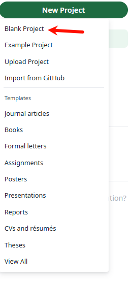

在overleaf中为什么相同文件编译结果不同？ 

为什么检查了很多遍明明没有语法错误，却还是报错？

为什么明明在其他地方可以运行，到这里运行不了了？

百思不得其解！！！！！！！！，后来发现是因为overleaf的缓存问题。

在overleaf中，当你编辑了一个文件并保存后，它会自动将该文件的缓存版本存储在服务器上。当你再次打开该文件时，它会从缓存中加载该文件的版本，而不是从服务器上重新加载。

解决方法是：

1. 新建一个空白项目

2. 然后把前面一个项目里面的所有文件都复制粘贴过来

3. 保存并编译