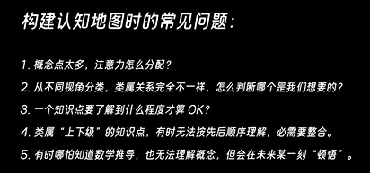

参考：

[少数派-真正的自学](https://sspai.com/post/87551)

[老奇不好奇-如何自学全新领域](https://www.bilibili.com/video/BV1QnGhzpEfF)

想要写下这篇文章的动机是我在自学的过程中也碰到了很多的困惑，时间回到2025年的3月17日，当我要学习Langchain的时候，我遇到的一些抉择，一方面是跟着课程开始学习，而另一方面是直接找一个项目进行实战，我首先是进行的实战，找了一个开源的项目，但是没过多久我便发现了问题，什么问题呢，就是开源项目上面的代码实际上使用的是上一个版本的Langchian，而Langchain早已经更新到了第三个版本，当然我又画了一些功夫去解决了这些问题，最终做出来一个简单的小项目。然而当遇到别人的面试，问我关于Langchain的问题时，我才发现我很多Langchain的内容都没有学习到，因为那个项目中只使用到了Langchian的一小部分知识，这个时候我重新看Langchain的课程，我这个时候才发现课程中实际上有说到Langchin的更多知识。这个时候我陷入困惑，自学到底应该如何学习？

机缘巧合之下，我首先看到了 老奇不好奇的这个视频[如何自学全新领域](https://www.bilibili.com/video/BV1QnGhzpEfF)

我这个时候茅塞顿开，我突然意识到，自学也是需要计划的，从课程开始学起有没有错？没有错，但是确实目的性。从项目学习有没有错？没错，但是缺乏系统性。下面我总结我自己的学习经验，得出了我的自学心得。

## **你需要全身心的专注**

这一点我感觉是最重要的，说一说我现在的学习方法：

1. 我是有两块屏幕，当我学习的时候，我会先把主屏幕清空，然后，副屏幕只打开三个应用，分别是滴答清单、有道翻译、和一个记事本

2. 随后开始学习，主屏幕上面只会出现我当前学习的内容，如果我学习的过程中发现一些问题，或者一些其他需要学习的，我会先记下来，记录到笔记本上面。

3. 等当前的学习目标完成之后，我才会回头看笔记本上， 我可能还需要学习什么内容。

## 目的导向，实践开始，系统提升

### 1. 首先需要认知到你的目的是什么？拆分学习步骤

比如说： 我要学习英语，目的是能出国的时候和外国人交流

那么你的学习路线应该是：和外国人交流 《《《  掌握口语和听力  《《《  通过XXX掌握口语 & 通过XXX掌握听力  《《《  口语和听力的预备知识

好了，上面是你的一个基础学习路线，你可以将上面不断的扩充或者细化，比如你只想学习日常永裕，那么你可以将学习路线细化为“问路学习、购物学习”

### 2. 不要陷入“学习基础知识 -- 放弃--- 再学习基础知识”的循环，开始实践

我这里说的开始实践，并不是说让你不要学习基础知识，而是说，学习一部分基础知识，然后便可以围绕这部分基础知识开始学习，只有在实战中获得的经验才会让你成长。

还是拿学习英语这个说事，你学习英语需要把所有单词全部背精通才开始学习听力，学习口语吗？不需要，你需要的是学习一部分特定领域的单词，然后快速的将它实用起来。
你可以学习一部分问路的单词，然后快速结合问路的情景开始训练，在实战中巩固自己的知识。

### 3. 实战之后就是系统的提升

根据第二部，你在某一个细分模块进行了实战，那么我相信你会很好的掌握这个细分模块。
然后，你需要回过头来反思自己，你的目的达到了吗？如果没有达到，说明是不是你的细分模块没有学完整，还有什么需要再去学习的细分模块吗。
比如你之前你只学习了问路的实战，现在还缺乏购物的实战，那么你可以再次进行第二步的工作，将细分模块修改为购物口语的学习。
如果当你已经不知道还有哪个细分模块没有学习的时候，说明你已经完成了初级的学习过程，下一步就将是融合了，尝试进行完整的实战，或者开始进行宽泛的阅读，这后面就是提升经验的过程了。

## 如果一个全新的领域，没法拆分学习步骤改怎么办？（构建认知地图）

如果没有办法拆分学习步骤，可以首先去构建一个认知地图，构建认知地图的时候你不需要考虑太多的东西，什么相关就画上来，然后当你地图构建的差不多了，可以根据地图去制定学习策略，相关可以看

[bilibili视频](https://www.bilibili.com/video/BV1QnGhzpEfF)

当然当你根据你的认知地图然后制定了一个学习步骤之后，你也可以不断完善你的认知地图，并随时考虑在你的步骤上面修改

注意：

如果你的学习步骤中有写可以省去的，可以先不做，记住一点，以最快的时间获得60分，后面再不断优化到100（如果时间充足）

## 为什么你的学习目标永远实现不了？ （来自少数派）

### 1. 因为你定的目标根本无法实现
「学会编程」「学会英语」式的目标，根本就不是目标，仔细想想，「会」的标准是什么？

是掌握世界上所有的编程语言？背下来所有的英语单词？这个范围可以无限扩大下去。

「学会 XX」就是一种幻想。

而幻想根本没有具体实现的方法。

### 2. 什么是有效目标

让我们把白日梦变得现实一点，越现实越好，越小越好，最好小到毫不费力。

「如何学会编程？」缩小。

「学会编程中的 web 开发领域？」范围太大，依然是做梦，缩小。

「如何做一个个人网站？」做一个网站想想就复杂，到底怎么做？缩小。

把它分解为如下最小目标：

搜索「怎么零基础做一个个人网站」；
在结果中挑一个排版顺眼的往下看；
代码部分你一个字都看不懂，那就从第一个不懂的关键词开始查。
第一个关键词：「VSCODE 编辑器」

回到第一步，搜索，下载安装编辑器，目标完成，回去刚才的页面接着往下查，遇到问题，回到第一步，重复 N 次。

同样，「学习英语」可以缩小为：

先掌握核心词汇；
今天先掌握 20 个词；
掌握牛津 3000 词中的第 1 到第 5 个词；
背下来第 1 个词的意思和发音；
在每个词上重复这个过程；
当词汇量达到 1000 个，开始输入大量现实语料，同时输出（同样按照最小目标原则进行步骤分解）；
继续背单词；
重复 N 次。
（这个举例可能不是太严谨，在实际操作中，如果你有一定英语基础，输入和输出可以和背单词同步进行，在这里只要领会分解目标的操作即可。）

总结就是，把一个目标分解到不能再分解为止，简单到毫不费力也可以完成，这样形成的才是有效目标。

这就是最小目标原则，也是如何真正制定有效目标的方法。

补充：每一个目标，都是能够对现实产生实际效用的，而所有目标完成后，一定也是能产生一个能够实现具体目的的结果：做完一个个人网站，能够开着字幕完整看懂一个视频，实现一个用来批量操作电子表格的 python 脚本……

过去我们学习为什么经常半途而废，就是因为我们的学习结果无法立刻反映在现实世界，这是违反人类本能的学习方式。婴儿将一个物体移动位置后，马上就会产生愉悦的神情，因为他发现自己可以改变世界，人类天生就有一种「作为原因的快乐」，我们对生活的掌控感，认为自己能够产生影响，愿意去做工作，也源于此。

而我们需要在自己的学习中加入「作为原因的快乐」。

### 3. 克服完美主义：切忌大而全

你是否每次学习一个项目的开始，就搜罗各种攻略停不下来，想要找到一个覆盖一切的解决方案，最后大把时间耗在构建这个大而全的学习方案，然后烂尾？

让我们回顾一下前面提到的，要真正掌握一门技术，跨越「会」与「不会」的真正信息就藏在「做」的过程，这个信息你不做是无法搜集到的，这就意味着根本不存在完美的学习方案。

说白了，你不做，根本连什么是「好」都不知道，何谈完美？

因此，在计划方面，无需纠结太多，只要知道自己最后要达成什么目的，然后按照每个最小目标去做就好了。

「怎么下载安装 VSCODE？」就是一个计划，这种规模的计划对于你而言足够了，完成一个，再定下一个，渐进式提高，每次提高的内容也要符合最小目标原则。

再次强调，足够小，小到毫不费力。

在做的过程中，也会有完美主义的心态阻碍学习，完美主义者经常陷于这样一种困境：必须要用一种「标准全面优雅」的解决方式，去解决学习中遇到的某个问题，即使答案就在眼前，还去浪费大把时间找那个完美答案，最后问题也没有得到解决，心态也磨没了。

还是我们前面提到的，作为一个初学者，能够解决问题的方案就是最好的方案。

在这个过程中遗留的小问题或者不完美的解决方案，就是另一个新计划的开始，所以先把它记下来，完成现在的任务，再去解决。

从 0 到 1，从 1 到 2，是现实。

一次从 0 到 100，是做梦。

## P 人宿敌：拖延、效率与自律

### 1.你也许并不需要日程表

番茄钟？每天细化到分钟的时间日程表？如果这些东西对你没用，我来介绍另一种模式：

以一个半小时为周期，利用整段时间来集中进行任务，同时引入一段热身时间进入状态

20 分钟热身期 + 1 个小时左右的专注期 = 一个半小时完整学习周期。

以一个半小时为基准，每次的总时长和热身期可以根据具体情况增加/缩短。

在热身期，做一项和你接下来要做的工作相关，能够迅速投入，且非常简单的活动。

例如，你要继续完成一个编程项目，你可以先打开算法题网站，挑一道初中级难度题，限定时间20分钟，不管做没做完，时间一到，立刻停止，回到那个主要项目。你会发现你已经进入编程的状态了，接下来就是利用整块时间高效学习。

就像健身开始前做的那些热身活动，大脑进入活跃状态也需要启动。

一天下来，根据具体情况，只需要让自己完成 1-3 个周期，剩下的时间休息放松。

Q：为什么是一个半小时？

A：因为科学研究结果表示，这是成年人能维持高度注意力的平均大概时长。可以根据自身情况适度调整，从一个小时先练起。

Q：热身期的作用？

A：我们从一个任务切换到另一个任务，都需要一个「切换期」，每次切换都要消耗精力进入新的工作模式，热身的目的就是为了快速度过这个切换期。

Q：优势在哪？

A：所有需要创造力的活动都需要大量整块的专注时间，学习，编程，绘画，文学创作等等都需要，根据上一个回答里的任务切换理论，番茄钟这种东西就是在主动打扰自己，这样中途不需要考虑别的事情，所有周期完成后，今天就结束了，心智负担小。

Q：有用吗？

A：我自己就在用，有用，你可以试试，反正不要钱。

### 2.拖延的本质，以及如何干掉拖延

拖延是完美主义的产物，前面我们讲了最小目标原则和完美主义的应对方法，综合应用处理拖延问题，我们可以这样：

试试「只写一个字」
拖延的本质，在于我们把从 0 到 100 这个过程当成了一个必须要一次性完成的任务，我们可以回忆一下每次拖延的时候在想什么：

这个任务要完成的话，要这样，再那样，然后这样……中间还可能遇到 A 情况， B 情况， C 情况……想想就烦，后面再说吧

但是如果我们要做的只有这些：

打开 Word，只写一个字，任务完成。

假如你打开了电脑，写了一个字，trust me，你会再写一百个字。

只要「不做」切换到「做」，你其实就已经把拖延干掉了，在「做」的状态待一会，度过热身期后，你已经进入了任务状态，不会再去想拖延。

开始我们提到了，拖延是完美主义的产物，因为拖延者在心中构想的那个结果就是一种达不到的完美状态，如果要实现它不是 0 到 100，而是 0 到无穷，是幻想，幻想是没有实现路径的。

而实现只写一个字，毫不费力。

针对工作中的完美主义造成的拖延，在这里我再提供一种方法：假设你心中的结果是 100 分，下次你可以告诉自己：做到 80 分，我就停手。然后把这个 80 分的成果提交，自己继续完善那个达不到的 100 分。

你最后会发现：80 分的已经足够好。

如果想彻底根治，还有一种方法，下次专门交一个 60 分的成果，然后观察别人的反应，你会大吃一惊。

### 3. 太容易分心怎么办？

太多文章教你「怎么用一个 APP 管住另一个 APP」，我只想说一句：

直接卸载所有的信息流 APP，最简单且唯一有效的方式，I mean it.

你对抗的不是一个 APP，而是这个世界上最聪明的算法工程师、最懂人性的产品经理，他们比你更懂你的弱点，刷信息流会上瘾，这件事本身就是设计好的，唯一解法：退出这场不可能获胜的对抗。

戒烟的最有效方法就是不抽烟，而不是电子烟或者别的替代物。不抽烟你不会死，反而活得更久。不刷微博你啥也不会错过，只会更快乐。这就是彻底解决问题的方案，注意力也是你身体健康的一部分。

如果真的有大事发生，不用看新闻你也能知道。世界上 99% 的事其实都不受你的控制，如果你整天去纠结，只能徒增焦虑，改变不确定性的最好方式就是去做事，剩下的交给命运。

根据林迪效应，久经考验流传下来的那些就是好东西。所以，在这个信息垃圾满天飞的时代，当周围的人沉迷那些新东西时，你更应该去回看那些经典著作，稳赚不赔。

如果你能做到，那注意力的问题其实已经解决，剩下这些就属于锦上添花了。

环境方面，保持一个清爽的桌面，不要放和学习无关的东西。专注期间手机保持静音丢一边去，相信我你不是啥大明星，消失一个半钟头不会有任何问题。

如果你需要音乐进入状态，选择柔和的纯音乐，任何歌词都会吸引人的注意力，推荐那种1个小时起步的钢琴曲合集，选一个你最喜欢的，以后每次都听这个。

在学习中保持专注和冥想训练的原理一样，每次察觉到自己分心，就把注意力拉回来，继续任务，全力保持一个完整周期。多次练习，分心的次数会越来越少，心流状态在整个周期的占比也会增加。

最后，既然提到冥想，建议你可以从每天 5 分钟开始，真的有用。

### 4.怎么提高效率？

如今市面上充斥着各种「一周学会 python」「半个月减值增肌」「完美 PPT 速成攻略」，光打出这几个名字都让我感到那股子焦虑劲儿。

《刻意练习》中提到，那些所谓的天才，也是练的最多的人，天才也是靠堆时间堆出来的，学习这件事本就如此，毫无他法。

事先就把心态放长远一些，慢就是快。一天完整走完每个周期，效率自然不成问题。

只要完成了你所有的最小目标，就是最高的效率。

## 学习很重要，休息更重要 （来自少数派）

如果你不知道自己需要什么，你可能需要睡觉。

睡眠为什么重要？因为在睡眠中你依然在学习，白天那些问题，会进入大脑的「后台程序」，这是突破的关键。很多著名科学家都有一觉醒来，某个苦思冥想的问题直接顿悟的体验。

不管你是不是夜猫子，每天都要按时准点睡觉。入睡前一个小时调暗房间亮度，看一些让大脑安静下来的材料，如一些讲座播客等，文学类书籍也可以。

对于那些听音乐学习的人，入睡之前放和白天一样的音乐。

如果中午困了，去睡觉，但不超过 30 分钟。

任何形式的运动都对学习有促进作用，每天爬楼梯，走路就是一种锻炼，效果显著。如果你懒得去健身房，每天多走走路吧。白天多运动也有利于夜晚的睡眠质量。
