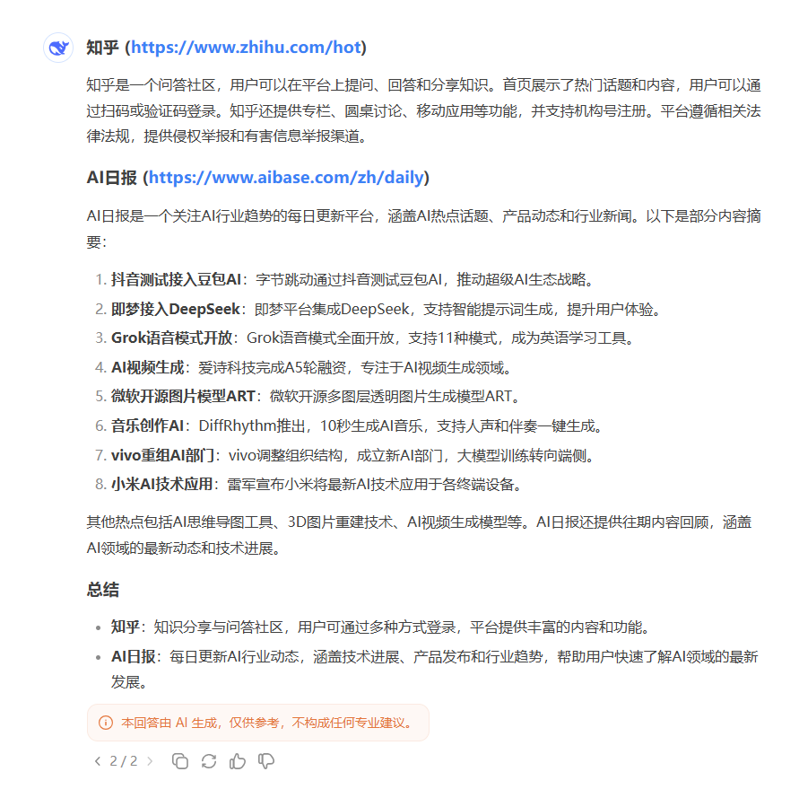
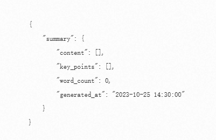
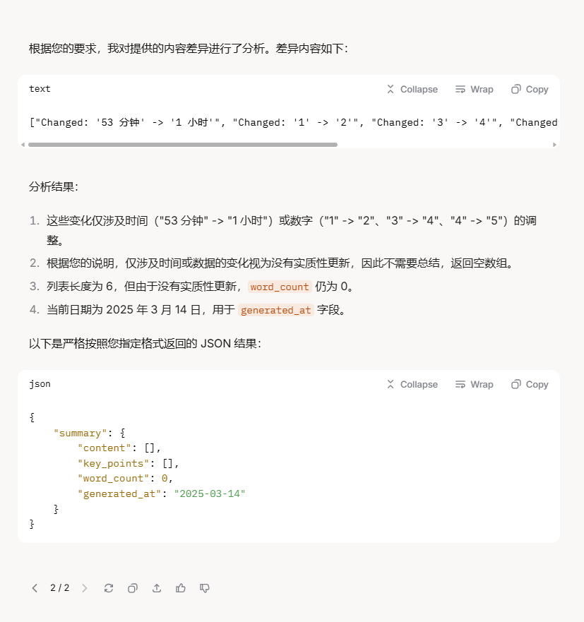
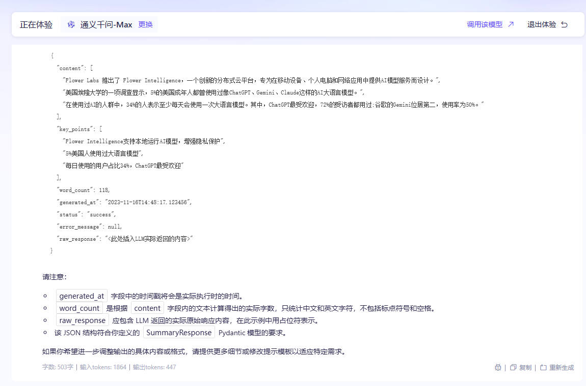
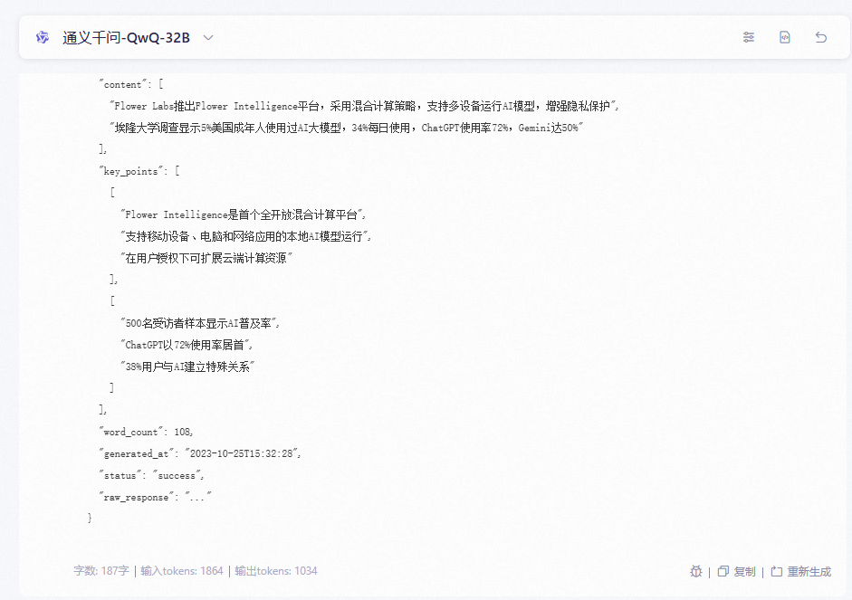
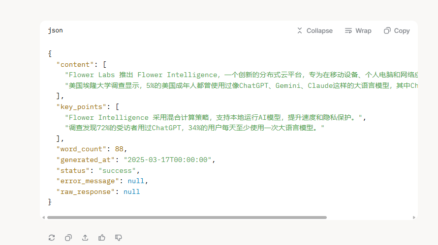

`每个模型我试了多次，然后取比较好的，当然可能也和提示词有关！！！`


## 内容梳理任务

### 总结文档的内容-1
```text
Summarize the content from the following websites:

https://www.zhihu.com/hot: 知乎 - 有问题，就会有答案打开知乎App在「我的页」右上角打开扫一扫其他扫码方式：微信下载知乎App开通机构号无障碍模式 验证码登录密码登录获取短信验证码获取语音验证码登录/注册其他方式登录未注册手机验证后自动登录，注册即代表同意《知乎协议》《隐私保护指引》知乎专栏圆桌发现移动应用联系我们来知乎工作注册机构号Investor Relations© 2025 知乎京 ICP 证 110745 号京 ICP 备 13052560 号 - 1京公网安备 11010802020088 号京网文[2022]2674-081 号出版物经营许可证药品医疗器械网络信息服务备案（京）网药械信息备字（2022）第00334号广播电视节目制作经营许可证:（京）字第06591号互联网宗教 信息服务许可证：京（2022）0000078侵权举报网上有害信息举报专区儿童色情信息举报专区互联网算法推荐举报专区违法和不良信息举报：010-82716601举报邮箱：jubao@zhihu.com
https://www.aibase.com/zh/daily : AI日报 - 每天三分钟关注AI行业趋势_AIbase zh AI产品榜 每月不到10元，就可以无限制地访问最好的AIbase。立即成为会员 首 页 AI资讯 AI日报 变现指南 AI教程 AI工具导航 AI产品库zh AI产品榜 3月5号 AI 日报AI日报：抖音测试接入豆包AI；即梦接入DeepSeek支持智能提示词生成；Grok语 音模式全面开放查看日报 包含 10 个AI热点话题内容1、AI思维导图神器 MindMapper ：扔个链接就能生成交互式思维导图2、​全新技术 Fast3R ：实现千张图片一键3DD 重建，速度惊人!3、强强联合！即梦接入DeepSeek 从提示词到绘画一步到位4、抖音打通豆包AI，字节跳动开启超级AI生态战略5、Grok 语音模式全面开放：11 种模式 上线，自带字幕成英语学习利器6、爱诗科技完成A5轮融资，剑指AI视频生成领域新高地7、微软开源图片模型ART，可生成多图层透明图片8、音乐创作领域投下核弹！DiffRhythm 炸裂问世：10 秒 AI 神曲，人声伴奏一键搞定！9、vivo重组调整，成立新AI部门并将大模型训练转向端侧10、雷军亮相首场代表通道：小米将把最新的AI技术 应用到各个终端上往期日报~3月4号 AI 日报AI日报：可生成汉字！智谱开源文生图模型CogView4；大模型工具Ollama存在严重漏洞；腾讯元宝下载量超DeepSeek 包含 13 个AI热点话题内容查看日报1、智谱发布首个能生成汉字的开源文生图模型CogView42、超强视频生成模型 Wan2.1 GP：低配GPU也能搞定大片！3、颠覆城市建模！AI生 成3D城市模型GaussianCity，生成速度提升 60 倍！4、火山引擎宣布大模型应用开源：上线“大模型应用实验室”，释放 AI 创新潜力5、雷军两会建议：建议加强“AI换脸拟声”违法侵权重灾区治理6、雷军2025两会建议：聚焦人工智能终端与AI换脸拟声治理7、警惕安全隐患！Ollama 大模型工具被指存在严重漏洞8、从编码到创意写作 xAI Grok-3 击败 GPT4.5全能登顶大模型竞技场3月3号 AI 日报AI日报：字节AI编程工具Trae国内版发布；天价AI域名ai.com挂牌1亿美元；星火深度推理大模型X1全面升级 包含 13 个AI热点话题内容查看日报1、科大讯飞宣布完成星火深度推理大模型X1全面升级2、百度文库、百度网盘AI创作新物种「自由画布」全量上线3、中国2025一季 度人工智能现状分析：摆脱“学生”标签，从追赶者到竞争者4、Flora推出AI驱动的“无限画布”工具，专为创意专业人士打造5、字节跳动AI编程产品Trae国内版发布 配置 豆包1.5pro、满血版DeepSeek模型6、荣耀 CEO 李健发布阿尔法计划：未来5年投100亿美元打造 AI 生态！7、超越DeepSeek-R1！阿里万相大模型登上全球开源榜首8、天价域名再现：ai.com挂牌1亿美元，或成史上最贵域名交2月28号 AI 日报AI日报：OpenAI最大最贵模型GPT-4.5发布；百度文心大模型4.5上线定档3月16日；字节AI编程工具Trae集成Claude 3.7 包含 13 个AI热点话题内容查看日报1、百度网盘与百度文库全量上线DeepSeek-R1满血版 前者将于3月改版2、免费试用！Krea推出 Wan 2.1模型：动态效果惊艳 可理解复杂提示3、转战 AI 课程直播！​“嘎子哥”谢孟伟开卖DeepSeek课程4、荣耀与阿里在AI领域展开合作 千问、万相等已接入YOYO智能体5、百度文 心大模型4.5将于3月16日发布 具备原生多模态、深度思考等能力6、华为AI助手小艺网页版上线 支持问答、写作、编程等7、文生图模型Ideogram 2a 震撼发布：速度翻 倍、成本减半，英文排版媲美人类设计8、DeepSeek开源周第五天：6.6TiB/s炸场！3FS重新定义AI存储基建2月27号 AI 日报AI日报：阿里春招3000岗位AI相关占50%；DeepSeek开源DualPipe与EPLB技术；字节豆包APP推“照片动起来”功能 包含 18 个AI热点话题内容查看日报1、腾讯混元新一代快思考模型 Turbo S 发布 即将在腾讯元宝中上线2、百度文心4.5或将在3月中旬发布 提升推理及多模态能力3、​Anthropic 开放 Claude AI GitHub 集成，助力开发者代码效率4、快手可灵AI 1月全球访问用户环 比增长113%5、Adobe推出Photoshop iOS版本，提供丰富免费功能与无缝跨设备体验6、B站文本转语音模型IndexTTS ：支持拼音纠正汉字发音、精准控制停顿7、阿里启动2026届春招，开放3000岗位AI相关占近50%8、字节跳动AI智能助手豆包APP推出“照片动起来”功能2月26号 AI 日报AI日报：阿里开源文生视频模型万相2.1；幻方量化回应DeepSeek-R2模型提前发布；百度“秒哒”开启用户邀测 包含 16 个AI热点话题内容查看日报1、OpenAI向免费用户推出基于GPT-4o mini的高级语音模式2、支持联网搜索！OPPO ColorOS接入满血版DeepSeek-R13、谷歌超低价AI模型Gemini 2.0 Flash-Lite正式上线 4、OpenAI免费开放ChatGPT高级语音聊天模式 基于GPT-4o mini5、萌翻全网！AI“魔法”让校园地标秒变毛绒玩偶，创意特效火爆出圈！6、报道称字节跳动旗下AI产品 “即梦” 考虑接入 DeepSeek7、AI料理 “神还原” 引爆全网 网友：8888元卖给 上海人！8、阿里全面开源文生视频模型万相2.1：14B和1.3B双版本上线2月25号 AI 日报AI日报：全球首个混合推理模型Claude 3.7 Sonnet发布；阿里开源推理模型QwQ ；DeepSeek平台API充值服务恢复 包含 12 个AI热点话题内容查看日报1、谷歌推出免费AI代码助手Gemini Code Assist ：每月提供18万次代码补全2、DeepSeek开放平 台API充值服务已正式恢复3、百度教育「拍照搜题」、「AI写作文」接入DeepSeek-R1模型4、京东零售技术发布京点点AIGC内容生成平台 一键生成商品图、营销文案5、 拼多多组建电商推荐大模型团队：负责人年薪数倍于百度时期，内部推行赛马机制6、商汤小浣熊家族全面升级：多模态融合 10秒钟即可复刻网页7、DeepSeek开源周第二日：首个面向MoE模型的开源EP通信库8、​ChatGPT新增Safari扩展功能，可设置为Safari浏览器地址栏默认搜索引擎2月24号 AI 日报AI日报：DeepSeek开源大模型加速 器FlashMLA；海螺AI推I2V-01-Director模型；Pixverse V4.0支持同步音效与转绘功能 包含 13 个AI热点话题内容查看日报1、百度APP全面焕新：上线AI入口 DeepseekR1深度搜索不卡顿2、海螺AI解锁全新“导演”模式：I2V-01-Director模型向所有人开放3、1x发布家庭机器人NEO Gamma：能冲咖啡、洗衣和吸尘等4、DeepSeek 开源周首日 ：发布大模型加速利器FlashMLA 解码性能飙升至3000GB/s5、Grok 3上线实时语音功能 一共支持10种模式 6、LiblibAI哩布哩布AI宣布再获数亿元融资 一年内连续完成 四轮融资7、融资速度“开挂”！LiblibAI再获数亿投资，一年连融四轮 领跑 AI 应用赛道8、Meta AI 发布新型视频学习模型V-JEPA ：视频理解新突破2月21号 AI 日报AI日报：给力！DeepSeek下周将开源五个项目；阿里通义万相将开源视频生成模型WanX 2.1；ChatGPT周活跃用户突破4亿 包含 15 个AI热点话题内容查看日报1、网信办发布2025年“清朗”系列专项行动 整治AI技术滥用乱象2、​小红书将接入DeepSeek，AI 搜索产品“点点” 内测深度思考功能3、腾讯文档接入DeepSeek 上线PPT直出、周报神 器、文献速读功能4、DeepSeek App 上线一个月下载量突破 1 亿5、扣子Coze宣布独家支持 DeepSeek Function Calling 工具调用能力6、超给力！DeepSeek 宣布下周开源五个项目7、Figure推出新型智能模型 Helix，让人形机器人接受语音命令做家务8、Midjourney 网站新增多项组织功能，提升用户体验2月20号 AI 日报AI日报：腾讯 深度思考模型“混元T1”全面开放；字节跳动全新视频生成工具Phantom；苹果智能将于4月初支持简体中文 包含 12 个AI热点话题内容查看日报1、xAI称已面向所有用户 免费提供 Grok3 直到他们服务器崩溃2、谷歌发布全新视觉语言模型 PaliGemma 2 Mix 集成多种功能助力开发者3、NVIDIA和Arc研究所联合发布全球最大生物学 AI 模型 Evo2，助力基因组研究与设计4、Mistral的AI助手Le Chat两周内下载量突破百万5、警惕！马斯克的新AI模型Grok 3被曝存在严重安全漏洞，黑客可轻松操控！6、​Xboxx推新生成AI模型Muse,助力游戏开发者高效创建游戏元素7、微软团队推多模态AI模型Magma：整合视觉、语言和动作决策技能8、​Rabbit展示新AI代理能力：从下载游戏 到自动管理购物清单

Task:


<URL>: <保留原本的内容，但是更有利于阅读，总结>. ...    
```


**模型效果**
- Qwen      ☆☆☆☆☆
- Grok      ☆☆☆☆☆
- Deepseek  ☆☆
- ChatGLM   ☆


#### Qwen2.5-max ☆☆☆☆☆


#### Grok3 ☆☆☆☆☆


#### DeepSeek-V3 ☆☆




#### ChatGLM-plus ☆


### 总结文档的内容-2 （检查是否更新


**模型效果**
- qwq-32b       ☆☆☆☆☆
- Grok      ☆☆☆☆☆
- Deepseek  ☆☆
- ChatGLM   ☆


<span style="color:red"> 这里我给出一个实际上没有更新的内容，最好应该就是返回没有更新 </span>

```text

你是一个订阅号运营专家，可以根据差异内容总结出订阅内容的更新情况，请对以下内容差异进行总结：
            "[""Changed: '53  分钟' -> '1  小时'"", ""Changed: '1' -> '2'"", ""Changed: '3' -> '4'"", ""Changed: '3' -> '4'"", ""Changed: '4' -> '5'"", ""Changed: '4' -> '5'""]"

            注意，有些内容的可能仅仅是时间或者数据的变化，这样的内容更新是不需要总结的，可以看作没有更新，返回空数组

            要求：
            1. 提供简洁的内容更新概要
            2. 提取关键点
            3. 计算内容的列表长度
            返回结果使用中文,如果内容更新或者没有关键点，请返回空数组。
            请根据以上要求，总结出订阅内容的更新情况，并返回结果。
            

            返回格式json（请严格按照以下格式返回）：
            {{
                "summary": {{
                    "content": [],
                    "key_points": [],
                    "word_count": 0,
                    "generated_at": ""
                }},
            }}
            

            """
```


#### qwq-32b ☆☆☆☆☆

非常可以，只返回了json，没有一点多余的内容





#### Grok3 ☆☆☆☆

也非常可以，对了，但是比起qwq-32b ，还是没有做到：只返回json




### 按照要求输出内容-1

```json
from datetime import datetime
import time
from langchain_core.prompts import PromptTemplate
from langchain_core.output_parsers import PydanticOutputParser
import json
import re
from pydantic import BaseModel, Field
from typing import List, Optional

# 假设的 LLM 获取函数（需要根据你的实际环境调整）
from src.agent.llm import get_ali_llm

# 定义 Pydantic 模型用于输出解析
class SummaryResponse(BaseModel):
    content: List[str] = Field(default_factory=list, description="内容更新概要")
    key_points: List[str] = Field(default_factory=list, description="关键点列表")
    word_count: int = Field(default=0, description="内容字数统计")
    generated_at: str = Field(default="", description="生成时间")
    status: str = Field(default="success", description="处理状态")
    error_message: Optional[str] = Field(default=None, description="错误信息")
    raw_response: Optional[str] = Field(default=None, description="原始响应")

class SubscriptionAgent:
    def __init__(self, llm_model=None, max_retries=3, retry_delay=2):
        # 初始化 LLM，如果没有传入特定模型，使用默认配置
        self.llm = llm_model if llm_model else get_ali_llm("qwen-7b-chat")
        self.max_retries = max_retries  # 最大重试次数
        self.retry_delay = retry_delay  # 重试间隔时间（秒）
        
        # 定义 Pydantic 输出解析器
        self.parser = PydanticOutputParser(pydantic_object=SummaryResponse)
        
        # 定义提示模板，进一步优化以确保提取 key_points
        self.prompt_template = PromptTemplate(
            input_variables=["contentdiff"],
            partial_variables={"format_instructions": self.parser.get_format_instructions()},
            template="""
            你是一个订阅号运营专家，可以根据差异内容总结出订阅内容的更新情况。请对以下内容差异进行总结：
            {contentdiff}

            ###注意，有些内容的可能仅仅是时间或者数据的变化，这样的内容更新是不需要总结的，可以看作没有更新，返回空数组

            ###要求：
            1. 提供内容更新概要（content），用数组形式返回。
            2. 提取每个内容的关键点（key_points），每个关键点应简洁且突出重点。
            3. content和key_points的列表长度应当一致，也就是他们是一一对应关系
            4. 计算 content 字段的总字数（仅统计中文和英文字符，不包括标点和空格）。
            5. 返回结果使用中文，如果没有实质性更新或关键点，返回空数组。
            6. 严格按照以下 JSON 格式返回结果，不添加任何多余的说明文字或注释：
            {format_instructions}
            """
        )

    def extract_json(self, raw_content: str) -> str:
        """从原始响应中提取 JSON 字符串"""
        json_match = re.search(r'\{.*\}', raw_content, re.DOTALL)
        return json_match.group(0) if json_match else raw_content

    def generate_summary(self, contentdiff: str) -> SummaryResponse:
        """
        生成 summary 的主函数
        参数:
            contentdiff: 输入的内容差异文本
        返回:
            SummaryResponse: 包含摘要内容的 Pydantic 模型
        """
        retries = 0
        last_exception = None
        raw_response = None
        
        while retries < self.max_retries:
            try:
                # 执行 LLM 调用获取原始响应
                chain = self.prompt_template | self.llm
                raw_response = chain.invoke({"contentdiff": contentdiff})
                
                # 检查并提取原始内容
                raw_content = raw_response.content if hasattr(raw_response, 'content') else str(raw_response)
                json_content = self.extract_json(raw_content)
                
                # 尝试解析响应
                response = self.parser.parse(json_content)
                
                # 确保生成时间字段有值
                if not response.generated_at:
                    response.generated_at = datetime.now().isoformat()
                
                # 计算字数（如果 LLM 未提供，则基于 content 计算）
                if response.word_count == 0 and response.content:
                    response.word_count = len("".join(response.content).replace(" ", "").replace(",", "").replace(".", ""))
                
                # 添加原始响应到结果中
                response.raw_response = raw_content
                
                return response

            except Exception as e:
                last_exception = e
                retries += 1
                if retries < self.max_retries:
                    time.sleep(self.retry_delay)
                    continue
        
        # 所有重试都失败后，返回错误响应
        raw_content = raw_response.content if raw_response and hasattr(raw_response, 'content') else str(raw_response) if raw_response else "No response"
        return SummaryResponse(
            content=[],
            key_points=[],
            word_count=0,
            generated_at=datetime.now().isoformat(),
            status="error",
            error_message=f"Failed to parse SummaryResponse: {str(last_exception)}",
            raw_response=raw_content
        )

# 使用示例
def main():
    # 创建示例 contentdiff，确保包含可提取的关键点
    sample_contentdiff = """
"[""Changed: '1' -> '2  分钟前\n.\nAIbase\nFlower Labs 颠覆AI应用模式，2360万美元打造首个全开放混合计算平台\n人工智能正在以前所未有的速度融入我们的日常应用，而一家名为Flower Labs的初创公司正以革命性的方式改变AI模型的部署和运行方式。这家获得Y Combinator支持的新锐企业近日推出了Flower Intelligence，一个创新的分布式云平台，专为在移动设备、个人电脑和网络应用中提供AI模型服务而设计。Flower Intelligence的核心优势在于其独特的混合计算策略。该平台允许应用程序在本地设备上运行AI模型，既保证了速度，又增强了隐私保护。当需要更强大的计算能力时，系统会在获得用户同意的情况下，无\n7'"", ""Added: '美国埃隆大学的一项调查显示，5'"", ""Added: '%的美国成年人都曾使用过像ChatGPT、Gemini、Claude这样的AI大语言模型。这项由北卡罗来纳州埃隆大学“想象数字未来中心”在'"", ""Added: '月份开展的调查，选取了500名受访者。结果发现，在使用过AI的人群中，34%的人表示至少每天会使用一次大语言模型。其中，ChatGPT最受欢迎，72%的受访者都用过;谷歌的Gemini位居第二，使用率为50% 。图源备注：图片由AI生成，图片授权服务商Midjourney越来越多的人开始和AI聊天机器人建立起特殊的关系。调查显示，38%的用户认为大语言模\n27'"", ""Changed: '3' -> '9'"", ""Changed: '49' -> '55'"", ""Changed: '1' -> '2'"", ""Deleted: '\n2  小时前\n.\nAIbase\n叫板Sora？潞晨科技开源视频大模型Open-Sora 2.0，降本提速\n听说过壕无人性的 OpenAI Sora 吧?动辄几百万美元的训练成本，简直就是视频生成界的“劳斯莱斯”。现在，潞晨科技宣布开源视频生成模型 Open-Sora2.0!仅仅花费了区区20万美元（相当于224张 GPU 的投入），就成功训练出了一个拥有 110亿参数的商业级视频生成大模型。性能直追“OpenAI Sora ”别看 Open-Sora2.0成本不高，实力可一点都不含糊。它可是敢于叫板行业标杆 HunyuanVideo 和拥有300亿参数的 Step-Video 的狠角色。在权威评测 VBench 和用户偏好测试中，Open-Sora2.0的表现都令人刮目相看，多项关键指'""]"

    """
    
    # 初始化智能体
    agent = SubscriptionAgent(max_retries=3, retry_delay=2)
    summary_result = agent.generate_summary(sample_contentdiff)
    
    # 打印调试信息
    # print("Raw response:", summary_result.raw_response)
    # print("Error message:", summary_result.error_message)
    # print("Summary result:")
    print(json.dumps(summary_result.model_dump(), indent=2, ensure_ascii=False))

if __name__ == "__main__":
    main()


现在我只要你返回应当的json内容
```
#### qwq-max ☆☆☆☆

返回的格式不完全符合要求




#### qwq-32b ☆☆☆

返回的内容不完全符合要求



#### grok3 ☆☆☆☆☆

完全符合要求


