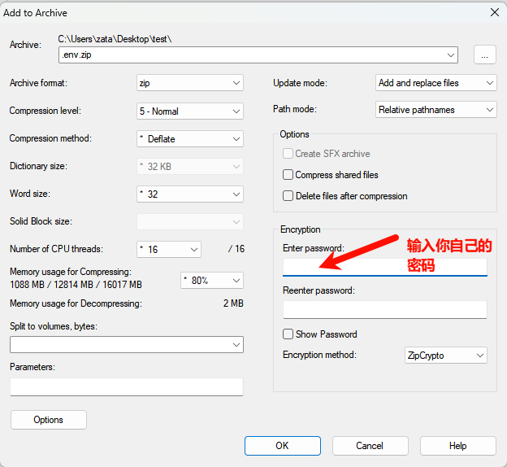

### 如何安全地将 .env 文件保存到 GitHub 公开仓库


#### 背景
`.env` 文件通常用于存储敏感信息（如 API 密钥、数据库凭据等），直接将其上传到 GitHub 公开仓库会导致安全风险。为了在公开仓库中保存 `.env` 文件，同时保护其内容，一种可行的方法是使用加密压缩（如 `.zip` 文件）并设置只有自己知道的密码。

#### 操作步骤
1. **准备 .env 文件**  
   确保你的 `.env` 文件已经包含所有必要的环境变量，例如：
   ```
   API_KEY=your_api_key
   DB_PASSWORD=your_password
   ```

2. **加密压缩文件**  
   使用工具（如 `7-Zip` 或命令行工具）将 `.env` 文件压缩为 `.zip` 文件，并设置密码：
   - **Windows (使用 7-Zip)**  
     右键 `.env` 文件 → 选择“添加到压缩包” → 在“加密”部分输入密码 → 确认生成 `.env.zip`。


3. **上传到 GitHub**  
   将生成的 `.env.zip` 文件提交并推送到 GitHub 公开仓库：
   ```
   git add env.zip
   git commit -m "Add encrypted .env file"
   git push origin main
   ```

4. **使用时解密**  
   下载 `.env.zip` 文件后，使用密码解密：
   - **命令行**  
     ```
     unzip -P your_password env.zip
     ```
   - 或者使用解压软件，输入密码手动解压，比如在windows系统还是使用7-zip。

#### 注意事项
- **密码管理**：密码不要记录在任何公开的地方，建议使用密码管理器保存。
- **安全性**：`.zip` 的加密强度有限，若涉及高度敏感信息，可考虑更强的加密工具（如 GPG）。
- **gitignore**：确保未加密的 `.env` 文件已被添加到 `.gitignore`，避免意外上传。
