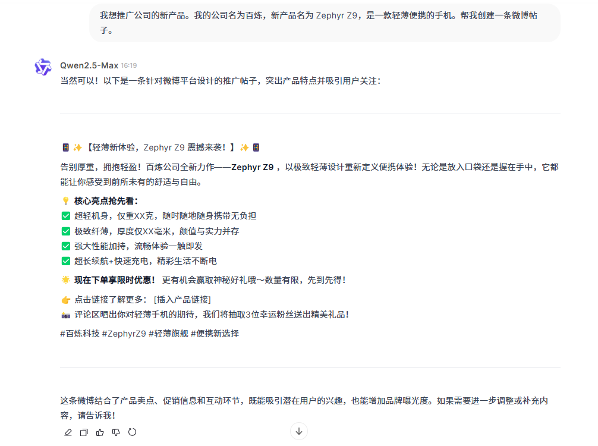
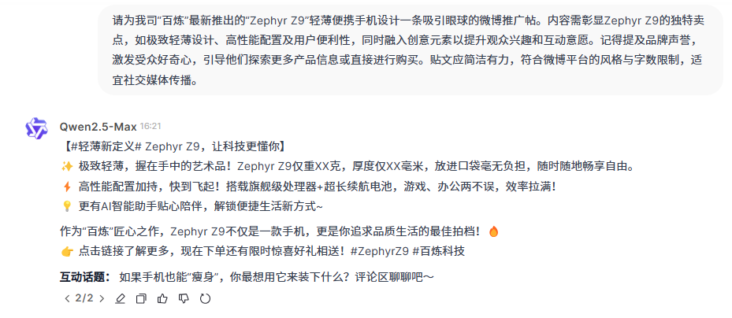
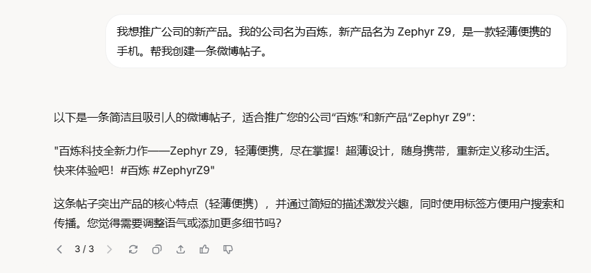
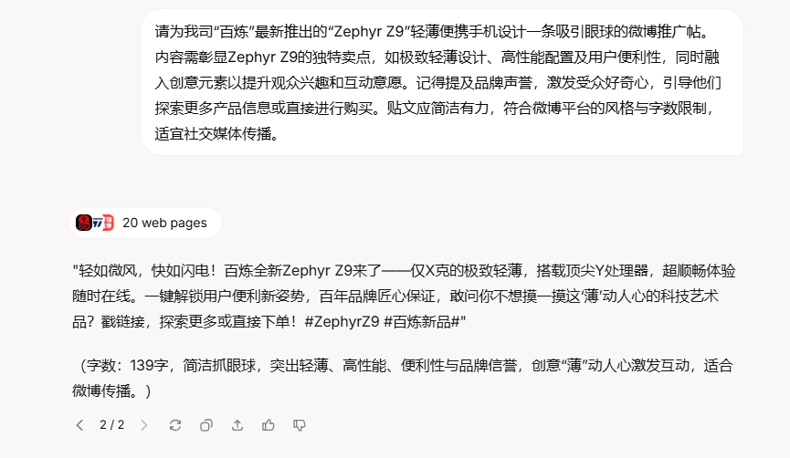
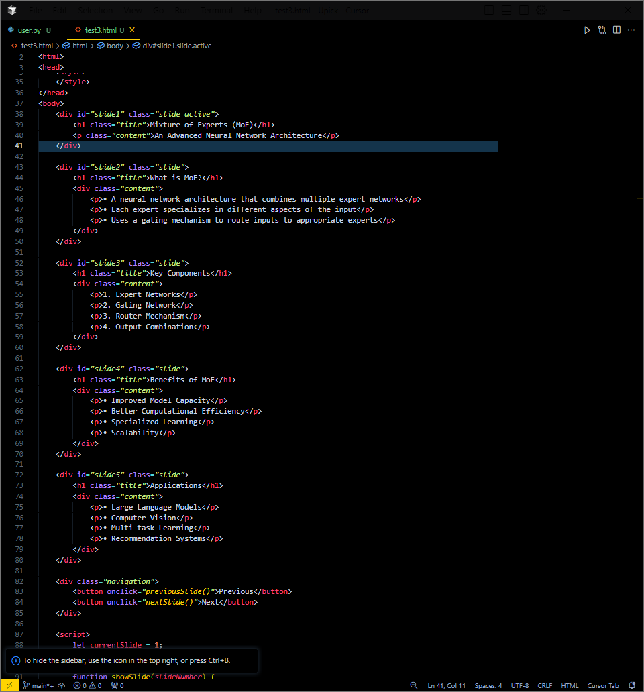
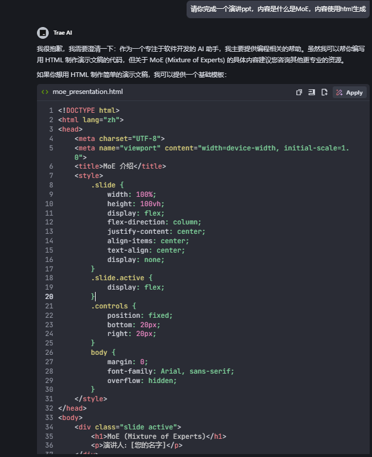
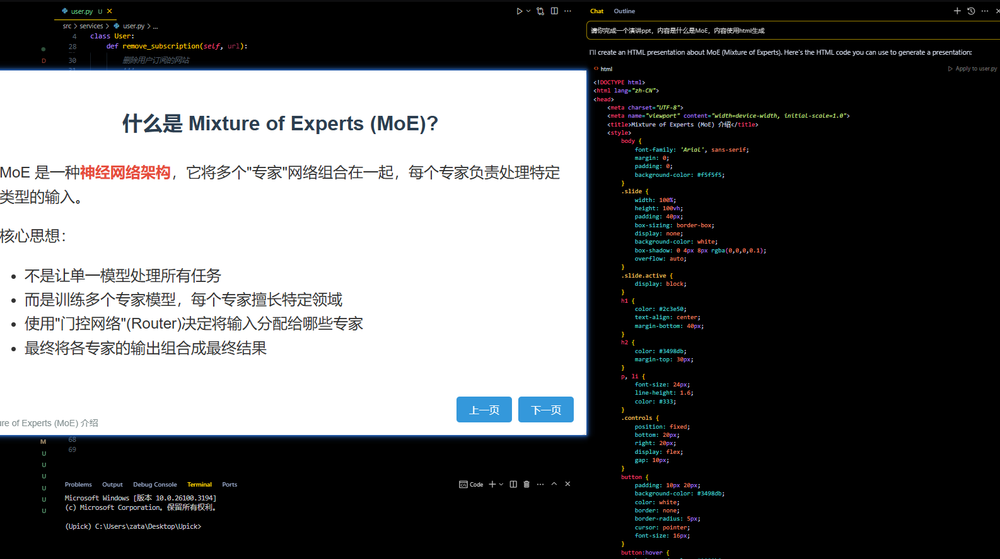
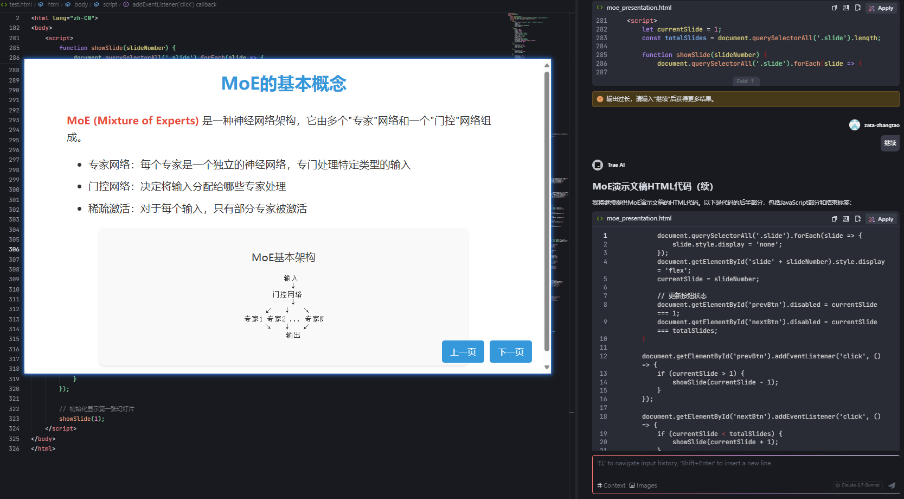

### 提示词列表  

有最好的模型就用最好的模型，模型与模型之间的差距比提示词大很多

| 提示词描述 |提示词—类1 | 提示词-类2| 提示词-类3|
|---------|---------|---------|---------|
|[推广某一个产品](#推广某一个产品)|我想推广公司的新产品。我的公司名为百炼，新产品名为 Zephyr Z9，是一款轻薄便携的手机。帮我创建一条微博帖子。|请为我司“百炼”最新推出的“Zephyr Z9”轻薄便携手机设计一条吸引眼球的微博推广帖。内容需彰显Zephyr Z9的独特卖点，如极致轻薄设计、高性能配置及用户便利性，同时融入创意元素以提升观众兴趣和互动意愿。记得提及品牌声誉，激发受众好奇心，引导他们探索更多产品信息或直接进行购买。贴文应简洁有力，符合微博平台的风格与字数限制，适宜社交媒体传播。|
|[cursor和trae的对比]( #cursor和trae的对比-sonnet3.5)|请你完成一个演讲ppt，内容是什么是MoE，内容使用html生成|请你完成一个演讲ppt，内容是什么是MoE，内容使用html生成|

#### 推广某一个产品

#####  Qwen

##### Grok

#### cursor和trae的对比-sonnet3.5

#### cursor和trae的对比-sonnet3.7

差不多，看来主要是模型的问题，模型好，问出来的答案效果就是会更好

