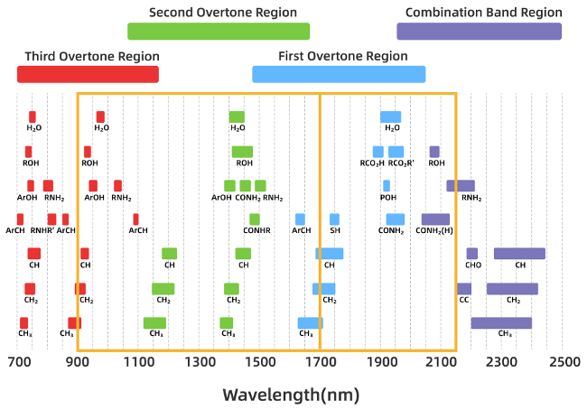
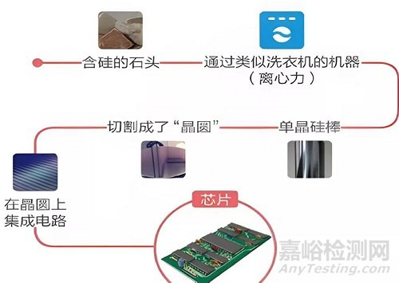

## 近红外的基础知识点


**波长和波数的转换关系**

例如：
- 如果波长 $\lambda = 500 \text{nm}$，则波数为：

$$
\tilde{\nu} = \frac{1}{500 \times 10^{-7}} = 20000 \, \text{cm}^{-1}
$$

$$
\tilde{\nu} = \frac{ 10^{7}}{波长 } = 波数 \, \text{cm}^{-1}
$$

以下是不同波长和波数范围在实际应用中的意义：

| **波长范围** ($\lambda$) | **波数范围** ($\tilde{\nu}$) | **应用领域**                |
|---------------------------|-------------------------------|-----------------------------|
| 200–400 nm                | 25000–50000 cm⁻¹             | 紫外吸收光谱、臭氧层吸收    |
| 400–700 nm                | 14286–25000 cm⁻¹             | 可见光、颜色感知            |
| 700–2500 nm               | 4000–14286 cm⁻¹              | 近红外光谱、遥感            |
| 2500–25000 nm             | 400–4000 cm⁻¹                | 中红外光谱、分子振动        |
| >25000 nm                 | <400 cm⁻¹                    | 远红外、热辐射              |

---


### 吸收峰

吸收峰
近红外的范围：780～2526nm范围内的电磁波，习惯上又将近红外区划分为近红外短波（780~ 1100nm）和近红外长波（1100 ~2526nm）
1. 水的吸收峰：在750nm左右、950-1000nm、1400-1450nm、1900-2000nm
2. 羟基（ROH）的吸收峰  730-750、930-950、1400-1500、2050-2100
3. 羟酸(RCO_2H）的吸收峰 1900附近 
4. 羟酸衍生物(RCO_2R’）的吸收峰 1950附近 
5. 酚类（ArOH）的吸收峰750附近、930-950、1400-1500




### 血液中几种物质的基本含量

---

#### 血液酒精含量 (BAC)
血液酒精含量 (Blood Alcohol Concentration, BAC) 是衡量酒精摄入的重要指标，常用于判断醉酒程度。

| BAC 范围 (g/L) | 对应 mmol/L | 临床意义                                      |
|----------------|-------------|-----------------------------------------------|
| 0.00-0.20 g/L  | 0-43 mmol/L | 正常范围，未饮酒或微量饮酒                   |
| 0.20-0.50 g/L  | 43-108 mmol/L | 轻度饮酒，反应能力略有下降                 |
| 0.50-0.80 g/L  | 108-176 mmol/L | 中度饮酒，协调能力下降                   |
| 0.80-1.50 g/L  | 176-329 mmol/L | 明显醉酒，判断力严重受损                 |
| 1.50-3.00 g/L  | 329-658 mmol/L | 严重醉酒，可能出现意识模糊、呕吐、昏迷等 |
| >3.00 g/L      | >658 mmol/L | 极度危险，可能发生呼吸抑制、低血糖、心脏骤停甚至死亡 |

##### 醉酒分级（百分比表示）
```
轻度醉酒 (0.02%-0.05%)：200 mg/L - 500 mg/L
中度醉酒 (0.05%-0.10%)：500 mg/L - 1000 mg/L
重度醉酒 (0.10%-0.15%)：1000 mg/L - 1500 mg/L
极重度醉酒 (>0.15%)：>1500 mg/L
```

---

#### 血液乳酸
血液乳酸浓度反映体内代谢状态，常用于评估组织缺氧或运动负荷。

| 乳酸类型       | 正常值范围      | 轻度升高范围    | 显著升高范围    | 危急值范围      |
|----------------|-----------------|-----------------|-----------------|-----------------|
| 动脉血乳酸     | 0.5-1.6 mmol/L | 1.6-2.0 mmol/L | ≥2.0 mmol/L     | >5.0 mmol/L     |
| 静脉血乳酸     | 0.5-2.2 mmol/L | 2.2-4.0 mmol/L | ≥4.0 mmol/L     | >8.0 mmol/L     |

##### 不同状态下的乳酸水平
```
静息状态（空腹、安静）：
  正常值：0.5 ~ 2.2 mmol/L (90 ~ 396 mg/L)
  轻度升高：2.2 ~ 4.0 mmol/L（可能与轻度运动或应激相关）
  显著升高：≥4.0 mmol/L（提示可能存在组织缺氧或其他病理状态）

运动后：
  中等强度运动：2.0 ~ 8.0 mmol/L（乳酸生成增加，但仍可被代谢清除）
  高强度运动：>8.0 mmol/L（乳酸堆积显著，可能达到乳酸阈值以上）

病理状态：
  乳酸酸中毒诊断标准：≥5.0 mmol/L（伴随血液 pH < 7.35）
  危险水平：≥10.0 mmol/L（可能危及生命，需紧急处理）
```

##### 换算说明
```
1 mmol/L ≈ 90 mg/L（乳酸分子量为 90）
```

---

#### 血液血糖
血糖浓度是评估糖代谢的重要指标，常用于糖尿病诊断。

| 血糖类型       | 正常值范围      | 糖尿病前期范围  | 糖尿病诊断标准  |
|----------------|-----------------|-----------------|-----------------|
| 空腹血糖       | 3.89-6.11 mmol/L| 6.11-7.00 mmol/L| ≥7.00 mmol/L    |
| 餐后2小时血糖  | <7.78 mmol/L    | 7.78-11.11 mmol/L| ≥11.11 mmol/L  |
| 随机血糖       | <11.11 mmol/L   | -               | ≥11.11 mmol/L   |

##### 血糖分级（mg/L 表示）
```
空腹血糖（禁食8小时以上）：
  正常值：700-1100 mg/L (0.07%-0.11%)
  空腹血糖受损：1100-1260 mg/L
  糖尿病诊断标准：≥1260 mg/L

餐后2小时血糖：
  正常值：<1400 mg/L
  糖耐量受损：1400-2000 mg/L
  糖尿病诊断标准：≥2000 mg/L

随机血糖：
  正常值：<2000 mg/L
  糖尿病诊断标准：≥2000 mg/L
```

##### 换算说明
```
1 mmol/L ≈ 180 mg/L（葡萄糖分子量为 180）
```

---

#### 血液尿酸
血液尿酸浓度与痛风和高尿酸血症相关，男女正常值范围有所差异。

| 性别 | 正常值范围 (μmol/L) | 正常值范围 (mmol/L) | 高尿酸血症阈值 (mmol/L) | 痛风风险增加 (mmol/L) |
|------|---------------------|---------------------|-------------------------|-----------------------|
| 男性 | 208-428 μmol/L      | 0.208-0.428 mmol/L  | >0.428 mmol/L           | >0.480 mmol/L         |
| 女性 | 155-357 μmol/L      | 0.155-0.357 mmol/L  | >0.357 mmol/L           | >0.420 mmol/L         |

##### 正常值（mg/L 表示）
```
男性：58.8-120.9 mg/L (相当于 208-428 μmol/L)
女性：43.7-100.7 mg/L (相当于 155-357 μmol/L)
```

##### 换算说明
```
1 μmol/L = 0.168 mg/L（尿酸分子量为 168）
```

---

以上内容以 Markdown 格式整理，包含表格和代码块，清晰展示了血液中酒精、乳酸、血糖和尿酸的基本含量及其临床意义。

## 近红外在硅棒中氧碳含量的测定

参考：   
http://www.anytesting.com/news/1928815.html

单晶硅材料可以用于制造太阳能电池、半导体器件等，由于其应用领域的特殊性要求其纯度达到99.9999% 甚至更高。在单晶硅生产过程中由原料及方法等因素难以避免的引入了碳、氧等杂质，直接影响了单晶硅的性能。因而需对单晶硅材料中的氧碳含量进行控制。  




### 关键要点  
- 研究表明，近红外光谱仪在硅棒中氧碳含量测定中面临显著挑战，主要是因为氧碳的特征吸收带主要在中红外区域，近红外区域的信号非常弱。  
- 证据倾向于认为，近红外光谱不适合直接测量硅中的氧碳含量，标准方法是低温中红外傅里叶变换红外光谱（FTIR）。  
- 一个意想不到的细节是，某些高次谐波或组合带可能出现在近红外区域，但这些信号太弱，难以用于精确测量。  

---


#### 概述  
近红外光谱仪在硅棒中氧碳含量测定中面临显著挑战，主要由于氧和碳的特征吸收带主要在中红外区域（约400至4000 cm⁻¹），而近红外区域（约4000至12800 cm⁻¹）的信号非常弱。这使得近红外光谱不适合直接测量硅中的氧碳含量，标准方法是使用低温中红外傅里叶变换红外光谱（FTIR），其灵敏度和分辨率更高。

#### 主要挑战  
- **信号弱度**：氧和碳在近红外区域的吸收带（如高次谐波或组合带）非常弱，难以检测，尤其是在痕量水平（如ppma或ppba）。  
- **分辨率和灵敏度低**：与中红外相比，近红外光谱的分辨率和灵敏度较低，难以准确量化硅中的微量杂质。  
- **干扰问题**：近红外区域可能受到其他杂质或硅晶格本身的吸收干扰，增加测量复杂性。  
- **数据分析复杂**：提取近红外谱图中的弱信号需要高级数据分析技术，增加了操作难度。  

##### 单晶硅中碳和氧的含量分析

在单晶硅中，碳（C）和氧（O）是常见的杂质元素，它们的含量通常以原子浓度（atoms/cm³）来表示。您提到的碳含量范围为 $10^{16} \sim 10^{17}$ atoms/cm³，接下来我们可以通过一些计算将其转换为其他单位（如 PPMA），并讨论氧的含量。

---

##### **1. 碳的含量：$10^{16} \sim 10^{17}$ atoms/cm³**

###### **(1) 转换为 PPMA**
PPMA 是基于原子比例的单位，表示每百万个硅原子中有多少个碳原子。为了计算 PPMA，我们需要知道单晶硅的原子密度。

- 单晶硅的原子密度约为：
  $$
  N_{\text{Si}} = 5 \times 10^{22} \, \text{atoms/cm}^3
  $$

- 碳的原子浓度范围为 $10^{16} \sim 10^{17}$ atoms/cm³。

因此，碳的 PPMA 含量为：
$$
\text{PPMA}_{\text{C}} = \frac{\text{碳的原子浓度}}{\text{硅的原子密度}} \times 10^6
$$

对于下限 $10^{16}$ atoms/cm³：
$$
\text{PPMA}_{\text{C}} = \frac{10^{16}}{5 \times 10^{22}} \times 10^6 = 0.2 \, \text{PPMA}
$$

对于上限 $10^{17}$ atoms/cm³：
$$
\text{PPMA}_{\text{C}} = \frac{10^{17}}{5 \times 10^{22}} \times 10^6 = 2 \, \text{PPMA}
$$

因此，碳的含量范围为 **0.2～2 PPMA**。

---

###### **(2) 氧的含量**
氧是单晶硅中的另一种常见杂质，其典型含量范围为 $10^{17} \sim 10^{18}$ atoms/cm³。

类似的，我们可以将氧的含量转换为 PPMA：

对于下限 $10^{17}$ atoms/cm³：
$$
\text{PPMA}_{\text{O}} = \frac{10^{17}}{5 \times 10^{22}} \times 10^6 = 2 \, \text{PPMA}
$$

对于上限 $10^{18}$ atoms/cm³：
$$
\text{PPMA}_{\text{O}} = \frac{10^{18}}{5 \times 10^{22}} \times 10^6 = 20 \, \text{PPMA}
$$

因此，氧的含量范围为 **2～20 PPMA**。

---

##### **2. 总结**
- 碳的含量范围为 $10^{16} \sim 10^{17}$ atoms/cm³，对应的 PPMA 范围为 **0.2～2 PPMA**。
- 氧的含量范围为 $10^{17} \sim 10^{18}$ atoms/cm³，对应的 PPMA 范围为 **2～20 PPMA**。

这些杂质的含量对单晶硅的性能有重要影响，例如电学性质、机械强度等。如果需要更精确的数据，可以参考具体的材料规格或实验测量结果。


#### 可行性分析  
鉴于这些挑战，近红外光谱仪在硅棒中氧碳含量测定中的可行性较低。研究表明，当前技术难以克服这些限制，因此不推荐将其作为常规方法。不过，若结合其他技术或针对特定样品，可能有间接应用的潜力，但这需要进一步研究。

一个意想不到的细节是，尽管氧和碳的特征吸收带不在近红外区域，但某些高次谐波（如氧的第四次谐波可能在近红外边缘）可能被检测到，但信号强度不足以支持精确测量。

支持的资源包括：[碳和氧在硅中的定量分析](https://www.bruker.com/en/applications/semiconductor-and-nanotech/solar/carbon-oxygen-quantification-in-silicon.html) 和 [硅单晶中碳氧含量的测定方法](https://www.powerwaywafer.com/determine-carbon-and-oxygen-content.html)。

---

### 报告  

近红外光谱仪在硅棒中氧碳含量测定中的应用面临显著挑战，主要是由于氧和碳的特征吸收带主要集中在中红外区域，而非近红外区域。本报告详细分析了这些挑战及其对可行性的影响，并探讨了潜在的间接应用可能性。以下是全面的分析，基于当前研究和行业标准。

#### 背景与标准方法  
硅棒中的氧和碳含量是半导体材料质量控制的关键指标，直接影响其机械和电学性能。标准方法是使用低温傅里叶变换中红外光谱（FTIR），其工作波数范围为400至4000 cm⁻¹，覆盖碳的吸收峰（如607.5 cm⁻¹）和氧的吸收峰（如1136.3 cm⁻¹）。例如，[碳和氧在硅中的定量分析](https://www.bruker.com/en/applications/semiconductor-and-nanotech/solar/carbon-oxygen-quantification-in-silicon.html) 指出，FTIR可在低温下实现对碳和氧的灵敏检测，达到ppba（十亿分之一原子）级别。

相比之下，近红外光谱（NIR）覆盖的波数范围为4000至12800 cm⁻¹（对应780至2500 nm），主要用于分析复杂混合物中的过振动和组合带，常见于农业和食品工业，但其在半导体材料分析中的应用较少。

#### 挑战分析  
以下是近红外光谱仪在硅棒中氧碳含量测定中面临的四大主要挑战：

1. **信号弱度**  
   氧和碳在硅中的振动模式（如取代碳和间隙氧）的基频吸收带在中红外区域，其在近红外区域的过振动或组合带非常弱。理论上，高次谐波（如氧的第四次谐波可能在4000 cm⁻¹以上）可能出现在近红外边缘，但由于非谐性效应，这些信号强度显著降低，难以用于精确测量。例如，[硅晶圆中碳氧含量的评估](https://www.osapublishing.org/as/abstract.cfm?uri=as-34-2-167) 提到，室温FTIR测量已能检测0.1 ppm的碳氧含量，但这是基于中红外吸收。

2. **分辨率和灵敏度低**  
   近红外光谱的分辨率和灵敏度通常低于中红外光谱，尤其在检测微量杂质时。Bruker的报告[碳和氧在硅中的定量分析](https://www.bruker.com/en/applications/semiconductor-and-nanotech/solar/carbon-oxygen-quantification-in-silicon.html) 强调，低温中红外分析可将碳检测下限降至10 ppba，而近红外由于信号弱，难以达到类似灵敏度。

3. **干扰问题**  
   近红外区域可能受到其他杂质或硅晶格本身的吸收干扰。例如，硅晶格的振动模式或掺杂元素（如硼、磷）的吸收可能掩盖氧碳的弱信号。文献[硅晶圆中微量杂质的红外光谱模拟](https://www.ncbi.nlm.nih.gov/pmc/articles/PMC7806787/) 指出，薄硅片中的干涉条纹已对中红外测量构成挑战，近红外区域的干扰可能更复杂。

4. **数据分析复杂**  
   提取近红外谱图中的弱信号需要依赖化学计量学方法，如主成分分析（PCA）或偏最小二乘法（PLS），这增加了分析复杂性和专业知识要求。文献[近红外光谱在连续制造中的挑战](https://www.sciencedirect.com/science/article/abs/pii/S0378517322000151) 提到，近红外应用的模型鲁棒性是常见问题，尤其在动态样品流中。

#### 可行性评估  
鉴于上述挑战，近红外光谱仪在硅棒中氧碳含量测定中的可行性较低。研究表明，当前技术难以克服信号弱度和干扰问题，因此不推荐将其作为常规方法。然而，存在一些潜在的间接应用场景，例如：  
- 若氧碳含量影响硅的某些可通过近红外测量的光学性质（如折射率或散射），可能通过相关性分析间接推断。但这需要建立明确的模型，目前文献支持不足。  
- 某些高次谐波或组合带可能出现在近红外边缘（如氧的第四次谐波可能在4000 cm⁻¹以上），但信号强度不足以支持精确测量，需结合表面增强技术（如SEIRA）可能有所改善，但这增加了实验复杂性。

一个意想不到的细节是，尽管氧和碳的基频吸收不在近红外区域，但某些高次谐波（如碳的第七次谐波可能在4235 cm⁻¹）可能被检测到，但其强度远低于中红外基频，实用性有限。

#### 对比表：中红外与近红外在硅氧碳测定中的优劣  

| **方法**         | **优点**                              | **缺点**                              | **适用性**          |
|------------------|---------------------------------------|---------------------------------------|---------------------|
| 中红外FTIR（标准） | 直接检测基频吸收，灵敏度高，精度高     | 需要低温环境，成本较高，样品制备复杂   | 硅氧碳常规测量      |
| 近红外光谱       | 非破坏性，快速，设备成本可能较低       | 信号弱，干扰多，灵敏度低，不适合直接测量 | 间接测量或其他应用 |

#### 结论与展望  
近红外光谱仪在硅棒中氧碳含量测定中的挑战主要源于信号弱度和技术限制，当前可行性较低。未来，若能开发新型探测器或增强信号的技术（如表面增强红外吸收光谱），可能改善其应用潜力，但目前仍建议采用中红外FTIR作为标准方法。

支持的资源包括：[碳和氧在硅中的定量分析](https://www.bruker.com/en/applications/semiconductor-and-nanotech/solar/carbon-oxygen-quantification-in-silicon.html)、[硅单晶中碳氧含量的测定方法](https://www.powerwaywafer.com/determine-carbon-and-oxygen-content.html) 和 [硅晶圆中碳氧含量的评估](https://www.osapublishing.org/as/abstract.cfm?uri=as-34-2-167)。

---

### 关键引文  
- [碳和氧在硅中的定量分析](https://www.bruker.com/en/applications/semiconductor-and-nanotech/solar/carbon-oxygen-quantification-in-silicon.html)  
- [硅单晶中碳氧含量的测定方法](https://www.powerwaywafer.com/determine-carbon-and-oxygen-content.html)  
- [硅晶圆中碳氧含量的评估](https://www.osapublishing.org/as/abstract.cfm?uri=as-34-2-167)  
- [硅晶圆中微量杂质的红外光谱模拟](https://www.ncbi.nlm.nih.gov/pmc/articles/PMC7806787/)  
- [近红外光谱在连续制造中的挑战](https://www.sciencedirect.com/science/article/abs/pii/S0378517322000151)


## 近红外在酸性清洗液含量检测中的应用可行性分析

### 关键要点  
- 研究表明，这些物质在近红外区域的吸收峰主要来源于其分子振动的基本频率的倍频和组合带。  
- 检测这些物质的近红外可行性较高，但需建立校准模型以确保准确性。  
- 不同化合物的吸收峰可能重叠，影响复杂混合物的识别。  

---

### 直接回答  

#### 近红外吸收峰对应  
这些物质在近红外区域的吸收峰主要来源于其分子中官能团（如O-H、N-H、C-H）的倍频和组合带。例如：  
- 过氧化氢（H₂O₂）：约1420纳米（7042 cm⁻¹）。  
- 硫酸（H₂SO₄）：O-H拉伸的倍频约1667纳米（6000 cm⁻¹）。  
- 氨（NH₃）：N-H拉伸的倍频约1515纳米（6600 cm⁻¹）。  
- 水（H₂O）：1364、1378、1400纳米（7330、7252、7143 cm⁻¹）。  
- 盐酸（HCl）：H-Cl拉伸的倍频约1724纳米（5800 cm⁻¹）。  
- 异丙醇：C-H和O-H的倍频，通常在近红外区域有特征吸收。  

这些峰值反映了分子振动的更高能量跃迁，适合用于检测混合物中的成分。

#### 检测可行性  
使用近红外检测这些物质是可行的，尤其在定量分析中，如监测过氧化氢的浓度或水的含量的场景。研究表明，近红外光谱可快速、无损地分析样品，但需要建立校准模型以区分重叠的吸收峰。对于简单混合物（如硫酸+过氧化氢），检测效果较好；但复杂混合物可能因峰重叠而降低准确性。仪器灵敏度和样品浓度也会影响检测效果。

#### 意外细节  
有趣的是，近红外光谱在农业和食品工业中广泛用于水分和蛋白质的测量，但对硫酸等强酸的近红外研究较少，可能因其倍频吸收较弱。

---

---

### 详细调查报告：近红外吸收峰及检测可行性分析  

#### 引言  
近红外（NIR）光谱学是一种基于电磁波近红外区域（约700纳米至2500纳米或14,286至4,000 cm⁻¹）的分析技术，主要用于检测分子振动的倍频和组合带。与中红外光谱相比，近红外光谱的吸收峰强度较低，但因其穿透性强，适合非破坏性分析。本报告旨在探讨用户提到的物质（基于附件中的化学混合物）在近红外区域的吸收峰，并评估使用近红外检测的可行性。

#### 物质及近红外吸收峰分析  
根据附件，涉及的物质包括SPM（硫酸+过氧化氢）、SC1（氨+过氧化氢+水）、SC2（盐酸+过氧化氢+水）和IPA（异丙醇）。以下为各成分的近红外吸收峰，基于分子官能团的倍频和组合带：  

| **物质**         | **近红外吸收峰（纳米）** | **对应波数（cm⁻¹）** | **备注**                     |
|-------------------|--------------------------|----------------------|------------------------------|
| 过氧化氢 (H₂O₂)  | 约1420                  | 7042                 | O-H拉伸的倍频                |
| 硫酸 (H₂SO₄)     | 约1667                  | 6000                 | O-H拉伸的倍频                |
| 氨 (NH₃)         | 约1515                  | 6600                 | N-H拉伸的倍频                |
| 水 (H₂O)         | 1364, 1378, 1400        | 7330, 7252, 7143     | O-H拉伸的倍频和组合带        |
| 盐酸 (HCl)       | 约1724                  | 5800                 | H-Cl拉伸的倍频               |
| 异丙醇           | C-H和O-H的倍频，范围广   | 约6000-7000 cm⁻¹    | 典型醇类特征吸收             |

这些吸收峰来源于分子振动的倍频，通常是中红外基本频率的2倍左右，但因非谐性效应，实际位置略低。例如，过氧化氢的1420纳米峰对应其O-H拉伸的倍频，而水的多个峰反映了其复杂的氢键网络。

#### 混合物的近红外吸收特征  
对于混合物，其近红外光谱将是各成分吸收峰的叠加：  
- **SPM（硫酸+过氧化氢）**：硫酸约1667纳米，过氧化氢约1420纳米，峰位较分开，易区分。  
- **SC1（氨+过氧化氢+水）**：氨约1515纳米，过氧化氢1420纳米，水1364-1400纳米，峰位较近，可能需高分辨率仪器。  
- **SC2（盐酸+过氧化氢+水）**：盐酸约1724纳米，过氧化氢1420纳米，水1364-1400纳米，峰位分布较广，检测较可行。  
- **IPA（异丙醇）**：作为单一物质，其C-H和O-H倍频在近红外区域有特征吸收，适合定量分析。  

#### 检测可行性评估  
近红外光谱的检测可行性取决于以下因素：  
1. **吸收峰的强度和分辨率**：近红外吸收峰通常较弱，需高灵敏度仪器。研究表明，过氧化氢的1420纳米峰在气体检测中可用于浓度测量 ([Determination of Hydrogen Peroxide by near Infrared Spectroscopy](https://www.researchgate.net/publication/244738508_Determination_of_Hydrogen_Peroxide_by_near_Infrared_Spectroscopy))。  
2. **峰的重叠**：混合物中峰可能重叠，如SC1中的氨和水峰接近，可能需主成分回归（PCR）或偏最小二乘回归（PLSR）等化学计量学方法分析。  
3. **样品状态**：近红外适合液体、气体和固体样品分析，附件中的混合物多为液体或气体，检测条件较优。  
4. **校准模型**：为确保定量准确性，需建立校准模型，基于已知浓度的标准样品。研究显示，近红外在农业（如水分测量）和制药工业中广泛应用，表明其对类似混合物的分析能力 ([Near-Infrared Spectroscopy in Bio-Applications](https://pmc.ncbi.nlm.nih.gov/articles/PMC7357077/))。  

总体而言，近红外检测这些物质是可行的，尤其在简单混合物中。复杂混合物可能需结合化学计量学方法以提高准确性。

#### 应用场景及局限性  
近红外光谱在工业中常用于快速、无损检测，如监测过氧化氢在灭菌过程中的浓度 ([Hydrogen peroxide vapor cross sections: A flow cell study using laser absorption in the near infrared](https://www.sciencedirect.com/science/article/pii/S0009261417311417))。对于硫酸等强酸，近红外研究较少，可能因其倍频吸收较弱，但仍可通过O-H倍频检测。  
局限性包括：  
- 吸收峰强度低，可能需高浓度样品。  
- 复杂混合物中峰重叠可能降低分辨率。  
- 仪器成本和校准模型的建立需额外投入。  

#### 结论  
这些物质在近红外区域的吸收峰主要为官能团倍频，检测可行性较高，适合快速定量分析。但复杂混合物需注意峰重叠问题，并通过化学计量学方法优化。  

---

### 关键引文  
- [Determination of Hydrogen Peroxide by near Infrared Spectroscopy](https://www.researchgate.net/publication/244738508_Determination_of_Hydrogen_Peroxide_by_near_Infrared_Spectroscopy)  
- [Hydrogen peroxide vapor cross sections: A flow cell study using laser absorption in the near infrared](https://www.sciencedirect.com/science/article/pii/S0009261417311417)  
- [Near-Infrared Spectroscopy in Bio-Applications](https://pmc.ncbi.nlm.nih.gov/articles/PMC7357077/)  
- [Observations on the Interpretation and Analysis of Sulfuric Acid Hydrate Infrared Spectra](https://pubs.acs.org/doi/10.1021/jp0114541)  
- [Infrared spectroscopy of sulfuric acid/water aerosols: Freezing characteristics](https://agupubs.onlinelibrary.wiley.com/doi/pdf/10.1029/97JD00012)  
- [Dataset for SO2, SO3, H2SO4 and H2O infrared absorption spectra at 300° C and 350° C temperatures](https://www.sciencedirect.com/science/article/pii/S2352340923001841)  
- [Infrared and visible Fourier-transform spectra of sulfuric-acid–water aerosols at 230 and 294 K](https://opg.optica.org/ao/abstract.cfm?uri=ao-38-30-6408)  
- [Infrared absorption spectrum of Sulfuric Acid (H 2 SO 4 ) taken at a temperature of 300 °C](https://www.researchgate.net/figure/Infrared-absorption-spectrum-of-Sulfuric-Acid-H-2-SO-4-taken-at-a-temperature-of-300_fig4_369424439)  
- [Spectral Databases for Infrared](http://www.irug.org/resources/spectral-databases-for-infrared)  
- [KnowItAll IR Spectral Database Collection](https://sciencesolutions.wiley.com/solutions/technique/ir/knowitall-ir-collection/)  
- [NIR Spectral Libraries](https://kaplanscientific.nl/product/nir-spectral-libraries/)  
- [Near-infrared spectroscopy](https://en.wikipedia.org/wiki/Near-infrared_spectroscopy)  
- [Frontiers | Breakthrough Potential in Near-Infrared Spectroscopy: Spectra Simulation. A Review of Recent Developments](https://www.frontiersin.org/journals/chemistry/articles/10.3389/fchem.2019.00048/full)  
- [Dataset of chemical and near-infrared spectroscopy measurements of fresh and dried poultry and cattle manure](https://pmc.ncbi.nlm.nih.gov/articles/PMC7749372/)  
- [Web Sources - Spectra and Spectral Data](https://guides.lib.utexas.edu/chemistry/spectra)  
- [Openfnirs database – The Society for functional Near Infrared Spectroscopy](https://fnirs.org/2020/11/10/openfnirs-database/)